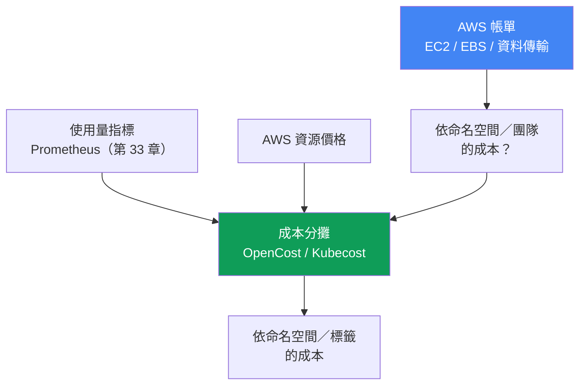
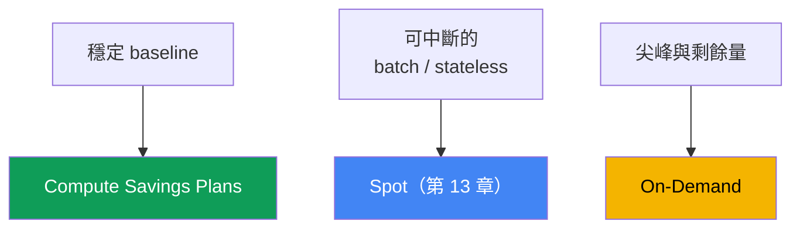

[Русская версия](ru.md) · [Eng version](en.md) · [Versión en español](es.md) · [Version française](fr.md) · [Deutsche Version](de.md) · [ქართული ვერსია](ge.md) · [日本語版](jp.md)
# 第 43 章。成本：OpenCost 與 Kubecost、right-sizing、Savings Plans、Spot 組合、流量

> **接下來。** 第 33 至 36 章提供了可觀測性：metrics、logs、traces，讓您看見叢集正在做什麼。本章討論它的成本，以及如何回答業務問題：「團隊 X 或服務 Y 花了多少錢？」相關主題交由其他章節說明：Spot 與節點採購模型見第 13 章；透過 requests/limits 與 VPA 進行 Pod sizing 見第 14 章；Karpenter consolidation 與 bin-packing 見第 12 章；流量成本（NAT、cross-AZ、endpoints）見第 31 章；logs 及其成本見第 34 章；gp3 與 EBS volumes 見第 23 章。這裡會將它們整合為一幅完整圖像，並加入對 Kubernetes 物件的成本分攤與 AWS commitment 模型。

## 43.1. 帳單正在增加，卻不清楚是什麼造成的

財務部門帶來一個簡單問題：EKS 帳單在一季內增加了三分之一，請解釋原因與花錢的人。值班工程師打開 Cost Explorer，看到 AWS 的事實：一大筆 `Amazon Elastic Compute Cloud`（叢集下方的節點）、一筆 `EBS`，以及一筆 `data transfer`。僅此而已。沒有方法能依 namespace、團隊或服務拆分這些金額，因為 AWS billing 沒有這類概念。

同時，`kubectl top` 顯示痛點的另一半：

```bash
# Pod 的實際用量
kubectl top pods -A --sort-by=cpu
# 已請求的資源與 node 容量
kubectl describe node <node> | grep -A6 "Allocated resources"
```

典型情況是：Pod 請求 `cpu: 2` 與 `memory: 4Gi`，但 `kubectl top` 顯示 200m 與 600Mi。Requests 被高估了好幾倍。Karpenter（第 12 章）如實地為這些 requests 保留容量並啟動節點，而您正為這些節點付費，即使 Pods 沒有使用它們。節點在「帳面上」已滿，實際上卻幾乎是空的。

一張帳單中的兩種不同失敗：

- **沒有分攤。** AWS 對資源（instances、volumes、traffic）收費，而不是對 namespace 收費。一個 node 上有許多團隊的 Pods，AWS billing 不會區分它們。
- **沒有效率。** Requests 過高，bin-packing 保留了空白容量，節點閒置。我們為保留的資源付費，而非已使用的資源。

因此本章的安排是：先說明為何 AWS 帳單無法回答成本分攤問題，以及如何恢復此能力（OpenCost、Kubecost）；接著介紹最重要的節省槓桿，right-sizing；然後是計算資源的採購模型（On-Demand、Spot、Savings Plans、Reserved）與其組合；接著是流量與儲存成本項目；最後是 FinOps 實務與最佳化優先順序。

## 43.2. 為什麼 AWS 帳單不知道 namespace

AWS billing 以資源層級運作：某個 EC2 instance 以某種規格運行了若干小時，`gp3` volume 佔用了若干 GiB，若干 GB 的流量走了 cross-AZ 與 NAT。這些是 AWS 的實體與虛擬實體。Kubernetes 則將 node 切分為 Pods，並分派給不同團隊、不同 namespace 中的不同 Deployment。在「`m6i.2xlarge` instance 運行了 720 小時」與「`payments` 團隊的 `checkout` 服務成本是多少」之間存在一道鴻溝，AWS 不會跨越它。

只能在 Kubernetes 內恢復這個連結：從 metrics 取得每個 Pod 的實際用量（CPU、記憶體、磁碟、網路），從 AWS 取得 node 資源價格，然後依其用量或 requests 比例，將 node 成本分配給 Pods。接著透過 labels 將 Pods 彙整至 Deployment、namespace、team。這稱為成本分攤（cost allocation），它需要專門的工具，而不是 AWS billing。



## 43.3. OpenCost 與 Kubecost

**OpenCost** 是開放、vendor-neutral 的 Kubernetes 成本分攤標準，為 CNCF 專案（自 2024 年 10 月起處於 incubation）。其目標被表述為「用於成本監控的 Prometheus」：讓其他解決方案建立在其上的統一模型。機制很直接：

- 從 metrics 取得 Pod 用量（Prometheus，第 33 章）：CPU、記憶體、磁碟、網路；
- 取得 AWS 資源價格，在 EKS 上會自行拉取公開的 on-demand 價格，不需要額外設定；
- 將 node 成本分配至 Pods，並依 namespace、Deployment、label、SA 彙總。

結果透過 API 輸出，並以適合 dashboards 的格式提供。OpenCost 是組成精簡的成本分攤 engine。

**Kubecost** 是基於 OpenCost 的產品：相同的 engine，加上具備 dashboards、歷史記錄、reports、最佳化建議與 savings insights 的 UI。EKS 可使用 **Amazon EKS optimized Kubecost bundle**，可作為 EKS add-on 或透過 Helm 安裝；可依現有 AWS Support agreements 取得支援。Kubecost 將資料儲存在 Prometheus-compatible storage 中（較新版本的 multi-cluster 則儲存在 S3-compatible object storage）。

**透過 Cost and Usage Report 取得精確成本。** 公開 on-demand 價格會高估實際情況，因為它不知道您的折扣。OpenCost 與 Kubecost 都能連接 AWS Cost and Usage Report，這是存於 S3、以 Athena queries 讀取的詳細 billing 資料，並讓分攤結果與實際帳單對帳（reconcile）。如此一來，node 成本會納入 Savings Plans、Reserved Instances、Spot 與 Enterprise discounts 的真實折扣費率，而非目錄價格。沒有此對帳時，團隊間的分攤比例是正確的，但絕對金額會偏高。

| | OpenCost | Kubecost |
|---|---|---|
| 定義 | 成本分攤 engine 與標準（CNCF） | 基於 OpenCost 的產品 |
| 介面 | API、最精簡的 UI | 完整 UI、dashboards、reports |
| 建議 | 無 | right-sizing、savings insights |
| 在 EKS 上 | Helm、來自 Prometheus 的 metrics | EKS add-on 或 Helm、EKS-optimized bundle |
| 適用時機 | 需要開放標準與資料 | 需要開箱即用的 UI、reports 與建議 |

**分配共同（shared）成本。** 並非所有成本都能直接分配給 Pods。有些成本由整個叢集承擔：control plane 的每小時費用、system namespaces（`kube-system` 與 addons），最重要的是 **idle 容量**，即付費的 node 容量與 Pods 實際消耗量之間的差異。工具可以將這些 shared costs 顯示為單獨一列，或依所選規則分配給團隊（平均、依用量比例、依 weighted shares）。Idle 是最重要的一列：高 idle 直接指出 requests 過高與 bin-packing 不佳，也就是 right-sizing 的潛力（第 43.4 節）。

**Showback 與 chargeback。** 成本分攤需要用於下列兩種模型之一：

- **showback**：向團隊展示其成本作為資訊，不涉及資金流動。第一步是讓支出可見，使團隊自行注意異常。
- **chargeback**：成本確實歸入團隊預算，資金在公司內部重新分配。這需要成熟的會計制度、對分攤數字的信任，以及一致同意的 shared costs 規則。

幾乎總是從 showback 開始：它在組織政治上的成本較低，而且已能改變行為。

## 43.4. Right-sizing 是最重要的槓桿

EKS 中最大的節省，通常不是 commitments 或 Spot，而是消除空白容量。因果鏈如下：requests 過高 → bin-packing（Karpenter，第 12 章）保留容量 → Karpenter 為該保留容量啟動 nodes → 您為 Pods 未使用的 nodes 付費。過高的 `requests` 是已付費的空白容量，再乘上 replica 數量。

診斷方式是比較 requested 與 used：

```bash
# Pod 資源請求
kubectl get pods -A -o custom-columns=\
NS:.metadata.namespace,POD:.metadata.name,\
CPU_REQ:.spec.containers[*].resources.requests.cpu,\
MEM_REQ:.spec.containers[*].resources.requests.memory
# 實際用量
kubectl top pods -A
```

更精確且動態的數字可由 metrics（第 33 章）及處於 recommendation 模式的 VPA 建議（第 14 章）提供：VPA 觀察用量並建議合理的 `requests` 值。將 requests 降低至實際用量（為尖峰保留餘裕），可讓 nodes 更緊密：相同 node 可容納更多 Pods，Karpenter consolidation（第 12 章）會移除多餘 nodes，帳單便會下降。

注意邊界：

- **memory `limits` 與 OOMKill。** 記憶體 limit 過低會因 OOM 而終止 Pod。記憶體是不可壓縮資源，應謹慎降低 limit，為尖峰保留餘裕，並參考 metrics 中的實際峰值。
- **CPU `limits` 與 throttling。** 硬性 CPU limit 會在突發流量時以 throttling 壓制 Pod。通常較正確的做法是設定 `requests` 而不設定（或設定寬裕的）CPU `limit`，見第 14 章。
- **不要低估 baseline。** Right-size 應依持續用量加上 headroom，而不是依最低值，否則正常的每日尖峰會變成 incident。

Right-sizing 與 bin-packing 在最佳化順序中優先：它們降低實際消耗的容量本身，接著才對縮小且穩定的量套用折扣模型（第 43.6 節）。

## 43.5. 計算資源採購模型

EKS nodes 是 EC2，可使用不同方式付費。折扣模型不改變消耗量，而是改變每單位的費率。因此，它們應在 right-sizing 之後，套用至已穩定的容量，否則您會對空白容量作出 commitment。

| 模型 | 承諾 | 可中斷性 | 用途 |
|---|---|---|---|
| On-Demand | 無 | 否 | 尖峰、剩餘量、所有未涵蓋部分 |
| Spot | 無 | 是，帶通知 | fault-tolerant、batch、stateless（第 13 章） |
| Compute Savings Plans | 每小時 $，1 或 3 年 | 否 | 穩定的計算 baseline |
| Reserved Instances | 特定設定，1 至 3 年 | 否 | 長期穩定的特定 workloads |

- **On-Demand** 是基本模式：按運行小時付費，沒有承諾，費率最高。它是 default，也是用來涵蓋所有未落入其他模型的「剩餘量」。
- **Spot**（第 13 章）是 AWS 的閒置容量，有大幅折扣，但可能在短暫通知後被收回。適合能承受中斷的 workloads：具多個 replicas 的 stateless services、queue processing、batch、CI。跨 instance types 與 AZ 的 diversification 可降低同時撤回的風險，第 13 章有詳細說明。
- **Compute Savings Plans** 是承諾在 1 或 3 年內每小時花費一定金額於計算資源，以換取折扣。它們很有彈性：不論 instance family、region、OS，甚至 Fargate 與 Lambda，都可套用折扣。很適合可預測的 baseline。
- **Reserved Instances** 是較舊的機制：針對特定設定（family、region）承諾 1 至 3 年。它比 Savings Plans 缺乏彈性；對 EKS 計算資源通常選擇 Savings Plans，RI 則保留給特定的長壽命資源。

**Commitment 與 Spot 競爭同一個基礎。** Savings Plans 不會套用至 Spot consumption：Spot 不受 commitment 涵蓋，且不會在 spot price 之上獲得額外折扣。因此常見錯誤是：依目前 consumption 購買 commitment，隨後將部分 fleet 轉為 Spot（Karpenter 或 node group），使可涵蓋的基礎減少，而 commitment 仍未被充分使用。「之後會平衡」並不成立：commitment 是按小時計算，未用完的一小時餘額不會帶到下一小時，短缺每小時都會失效，而非在期限末合計。因此應從 baseline 中扣除計畫維持在 Spot 的部分，並對不可中斷的餘額作出 commitment。但「扣除 Spot」不等於「扣除所有 spot pool 容量」：spot capacity 不足時回退至 On-Demand（第 13 章）會使部分 consumption 回到 commitment 的涵蓋範圍，因此應扣除穩定達成的 Spot 比例，而非設計中的比例，並依實際結果而非計畫檢討 commitment。套用順序為：Savings Plans 在 Reserved Instances 之後套用，EC2 Instance Savings Plans 早於 Compute Savings Plans，而在其中則從折扣百分比最高的 consumption 開始，這說明為何在混合 fleet 中，commitment 可能流向不是您預期的位置。

**組合策略。** 健康的 node fleet 通常結合所有模式：Compute Savings Plans 涵蓋穩定 baseline，Spot 承擔彈性與 batch workloads，On-Demand 涵蓋尖峰與無法中斷或作出 commitment 的部分。比例取決於可中斷 workloads 的比例及對 baseline 的信心；具體折扣百分比應參考最新 AWS pricing。

**帳單中 EKS 特有的項目：**

- **control plane** 依每個 cluster 按小時計費，與負載無關，這是一筆固定項目，也是反對大量小型 clusters 的理由（第 32 章）。
- **extended support** 比標準支援更昂貴：處於 extended support 版本的 cluster，control plane 會收取較高的每小時費用（第 38 章），這也是及時更新的另一項誘因。
- **Fargate** 的計費方式與 EC2 nodes 不同：您依 Pod 存活期間分配給它的 vCPU 與記憶體付費，不需要管理 nodes（詳細資料與情境見第 15 章）。
- **折扣模型不涵蓋所有項目：** Compute Savings Plans 適用於 EC2、Fargate、Lambda 與 SageMaker AI，但 EKS control plane 的每小時費用不在此清單中，因此每個 cluster 的固定成本不會因折扣模型而降低（第 9 章）。



## 43.6. 流量與儲存作為帳單項目

在計算資源之後，EKS 帳單中還有兩大容易忽略的類別：它們分散在架構中。專門章節會詳細介紹它們，此處說明每一項可帶來的節省：

| 項目 | 節省位置 | 章節 |
|---|---|---|
| Cross-AZ traffic | topology-aware routing、Pod locality | 第 31 章 |
| NAT Gateway | NAT 處理費與 per-GB 費用昂貴 | 第 31 章 |
| VPC endpoints / PrivateLink | 讓前往 AWS services 的流量避開 NAT | 第 31 章 |
| 日誌 | 資料量、保留期、抽樣、篩選器 | 第 34 章 |
| EBS 磁碟區 | 以 gp3 取代 gp2、大小、快照 | 第 23 章 |

- **Cross-AZ。** 區域間流量雙向計費。一個 AZ 中的服務呼叫另一個 AZ 中的資料庫時，每 GB 都需付費。成本分攤與 network metrics 有助於發現此問題；解法（topology aware hints、locality）見第 31 章。
- **NAT Gateway。** 同時收取每小時運行費與每個處理 GB 的費用。經由 NAT 前往網際網路或 AWS services 的 Pods 會增加帳單，而 VPC endpoints 與 PrivateLink 正可解決此問題（第 31 章）。
- **日誌。** 對於冗長的應用程式及很長的保留期，CloudWatch Logs、OpenSearch 與日誌傳遞流量是顯著項目。控制資料量、保留期與抽樣見第 34 章。
- **儲存。** 在相同容量下，`gp3` 通常比 `gp2` 划算，並允許分別設定 IOPS 與 throughput；未使用的磁碟區與舊快照是無聲的洩漏（第 23 章）。

## 43.7. FinOps 實務

成本分攤與採購模型是工具；FinOps 則是使它們可持續運作的流程。

- **Cost allocation tags 加上 Kubernetes labels。** 在 AWS 端以 tags 標記 resources（`team`、`env`、`cost-center`），並在 Billing console 中啟用 user-defined tags，否則它們不會出現在 Cost Explorer 與 Budgets。叢集內則在 namespace 與 workload 上以相同維度作為 labels，供 OpenCost/Kubecost 分割。兩種標記的語意應相同，AWS 與叢集的圖像才會一致。
- **AWS Budgets 與 alerts。** 建立 budgets（整體及依 tags/services）並設定 thresholds 與 notifications，以便在成本增加時立即發現，而不是在月底看到帳單後才知道。
- **Cost Anomaly Detection。** 一項獨立的 Cost Management service：ML 建立支出的 baseline，偵測異常尖峰，並經由 email 或 SNS 發送 alerts（再透過 AWS Chatbot 傳至 Slack 或 Teams）。它不同於固定 threshold 的 Budgets，能捕捉偏離慣常模式的情況，也就是仍在靜態 budget 範圍內、卻不正常的增加。
- **Commitment monitoring。** Cost Explorer 提供 Savings Plans utilization report（實際使用的 commitment）與 Savings Plans coverage report（符合條件 consumption 中由 commitment 涵蓋的比例），AWS Budgets 則為 Savings Plans 提供依 utilization 與 coverage 分類的專用 budget type，透過 SNS 發出 alerts。Utilization 應如同 overspending 一樣受到監控：將 workloads 移至 Spot 後的下降可立即看見，而不是一個月後才從帳單發現。
- **依 tags 分組的 Cost Explorer。** 依已啟用 tags 分析帳單，是查看團隊、environment、service 趨勢的標準方式。
- **對團隊進行 showback。** 定期提供「您的部分花了多少」的 report，比任何規章更能改變行為：團隊會自行發現被遺忘的 LoadBalancer 或膨脹的 requests。

**最佳化優先順序**（由上而下，依效果與風險的比率）：

1. **Right-size 與 bin-pack**：降低實際消耗的容量（第 43.4 節、第 12 章）。這會減少其餘所有措施所套用的基礎。
2. **對穩定 baseline 採用 Savings Plans**：對已縮小的穩定容量作出 commitment，而不是原先膨脹的容量。
3. **將彈性 workloads 改用 Spot**：將可中斷的部分移至 Spot（第 13 章）。
4. **流量、logs、儲存**：清理 cross-AZ 與 NAT（第 31 章）、log retention（第 34 章）、volumes 與 snapshots（第 23 章）。

順序很重要：在 right-sizing（步驟 1）之前作出 commitment（步驟 2），等於將空白容量的付款固定為一至三年。

## 43.8. 如何在 production 中使用

- **在資金爭議前部署成本分攤。** 預先部署 OpenCost 或 Kubecost，讓與財務對話時已經有依 namespace 的數字，而不是「我們試著算算看」。
- **從 showback 開始。** 團隊先看到自己的成本，只有在會計成熟後，才轉為帶有預算流動的 chargeback。
- **將 right-sizing 作為例行工作。** 定期比較 requests 與 consumption（metrics、VPA recommendations），降低過高值，讓 consolidation 壓縮 nodes。
- **僅對穩定 baseline 作出 commitment。** 在 right-sizing 之後，針對維持數月的數量購買 Savings Plans，將尖峰與成長留給 On-Demand 與 Spot。
- **一致地使用 tags 與 labels 標記。** AWS cost allocation tags 與 Kubernetes labels 使用一套維度（team、env、service）；在 Billing 中啟用 user-defined tags。
- **設定帶有 alerts 的 Budgets。** 依團隊與服務設定有 thresholds 的 budgets，可在異常發生時捕捉它，而非事後才發現。

## 43.9. 迷你詞彙表

- **cost allocation（成本分攤）**：依 consumption 或 requests，將 AWS resources 成本分配給 Kubernetes objects（namespace、Deployment、label）。
- **OpenCost**：開放、vendor-neutral 的成本分攤標準與 engine，CNCF 專案；從 Prometheus 取得 consumption，並從 AWS 取得資源價格。
- **Kubecost**：基於 OpenCost 的產品，具 UI、reports 與 recommendations；在 EKS 上有 EKS-optimized bundle（add-on 或 Helm）。
- **idle 容量**：已付費的 node 容量與實際 consumption 的差異；是 requests 過高與 bin-packing 不佳的標記。
- **shared costs**：共同的 cluster 成本（control plane、system namespaces、idle），依規則分配給團隊或分開顯示。
- **showback**：向團隊展示成本，不涉及資金流動。
- **chargeback**：確實將成本歸入團隊預算。
- **right-sizing**：使 requests/limits 符合實際 consumption，以壓縮 nodes。
- **Compute Savings Plans**：承諾在 1 至 3 年內每小時花費一定金額以換取折扣，對 instance families、region 及 Fargate/Lambda 具彈性；commitment 以小時計算，無法跨小時轉移，也不適用於 Spot，其使用狀況可於 Cost Explorer 的 Savings Plans utilization（已使用）與 coverage（已涵蓋）reports 中查看。
- **cost allocation tags**：用於分割帳單的 AWS tags；必須在 Billing console 中啟用 user-defined tags。
- **Cost and Usage Report**：S3 中的詳細 AWS billing；透過 Athena 讀取，可讓 OpenCost/Kubecost 以含折扣的實際帳單核對成本分攤。
- **Cost Anomaly Detection**：AWS service，使用 ML 偵測異常支出增長，並以 email 或 SNS 發送 alerts（經 AWS Chatbot 傳至 Slack/Teams）。

## 43.10. 本章總結

- AWS 帳單是針對 resources（EC2、EBS、data transfer），而不是 namespace；一個 node 上有許多團隊的 Pods，billing 不會區分它們。
- 只有透過 Kubernetes 內部的成本分攤，才能回答「團隊 X 花了多少」：將 metrics 中的 consumption 加上 AWS 價格，依 consumption 或 requests 分配給 objects。
- OpenCost 是開放的成本分攤標準與 engine（CNCF）；Kubecost 是其上的產品，具 UI、reports 與 recommendations，並在 EKS 上提供 EKS-optimized bundle。
- Shared costs（control plane、system namespaces、idle）可分攤或單獨顯示；高 idle 是 right-sizing 的直接訊號。
- Showback（展示成本）是第一步，chargeback（歸入預算）則較成熟。
- Right-sizing 是主要槓桿：過高 requests 使 bin-packing 保留空白容量並啟動多餘 nodes；降低 requests 可壓縮 nodes。
- 應謹慎設定 limits：低 memory limit 會導致 OOMKill，硬性 CPU limit 會導致 throttling；依持續 consumption 加上 headroom 進行 right-size。
- 採購模型：On-Demand（無承諾、昂貴）、Spot（便宜、可中斷）、Compute Savings Plans（依支出 commitment、具彈性）、Reserved（特定設定）。
- 組合方式：Savings Plans 用於 baseline、Spot 用於彈性部分、On-Demand 用於尖峰；只在 right-sizing 後，對穩定容量作出 commitment。
- Spot 與 commitment 競爭相同基礎：Savings Plans 不涵蓋 Spot，且每小時 commitment 不會跨小時轉移，因此從 baseline 中扣除穩定達成的 Spot 比例。
- EKS 帳單特性：每個 cluster 的每小時 control plane、extended support 時較貴（第 38 章）、Fargate 的不同 pricing（第 15 章）；流量與儲存見第 31、34、23 章。
- 若要取得精確數字，請將成本分攤連接至 Cost and Usage Report（透過 Athena）：如此會計入 Savings Plans/RI/Spot 折扣，而非公開價格；Cost Anomaly Detection 以異常偏離慣常模式的 alerts 補足基於 threshold 的 Budgets。

## 43.11. 如何用於實際工作

在值班與規劃期間，本章能將帳單從黑箱轉變為可管理的量。當財務詢問帳單為何增加時，您不會猜測 `Amazon EC2` 項目，而是打開依 namespace 的成本分攤，展示何者造成增加，並將 idle 與實際 consumption 分開。這會將談話從「太貴」轉為「這個具過高 requests 的特定 Deployment」，接著便可採取行動。

在叢集規劃中，成本會與可靠性同樣成為必要的面向：已部署的成本分攤（OpenCost 或 Kubecost）、一致的 cost allocation tags 與 labels、帶有 alerts 的 budgets、成熟的 right-sizing cycle，以及有意識的採購組合（Savings Plans 用於 baseline、Spot 用於彈性部分、On-Demand 用於剩餘量）。最佳化順序固定：先減少容量，然後對穩定部分作出 commitment，接著使用 Spot，最後處理流量與儲存。如此節省才可持續，而非季度結算前的一次性行動。

## 43.12. 自我檢查問題

1. 為什麼 AWS 帳單無法回答「namespace 花了多少」？要回答它需要什麼？
2. 成本分攤如何恢復 AWS resources 與 Kubernetes objects 之間的連結？
3. OpenCost 是什麼？它從何處取得 consumption 與價格？為何它是 CNCF 專案？
4. Kubecost 與 OpenCost 有何差別？EKS-optimized Kubecost bundle 提供什麼？
5. 哪些項目屬於 shared costs？為何高 idle 是 right-sizing 的訊號？
6. Showback 與 chargeback 有何差別？通常從何者開始？
7. 為什麼過高 requests 會導致為空閒 nodes 付費（bin-packing 與 Karpenter 的角色）？
8. 激進地降低 limits 有哪些風險？如何避免？
9. On-Demand、Spot、Savings Plans 與 Reserved 在 commitment 與彈性上有何不同？
10. 如何建立採購模型的組合？為何 Savings Plans 只用於 baseline？
11. 為何購買 Savings Plans 與將 fleet 轉至 Spot 會衝突？作出 commitment 前，應從 baseline 扣除什麼？
12. EKS 帳單有哪些特性：control plane、extended support、Fargate？
13. 最佳化哪些流量與儲存項目？哪些章節負責說明它們？
14. 最佳化優先順序是什麼？為何不能在 right-sizing 前作出 Savings Plans commitment？
15. 為何要將 OpenCost/Kubecost 連接至 Cost and Usage Report？Cost Anomaly Detection 如何補足 AWS Budgets？

## 實作

流量成本也會在[實驗 117：流量與成本：每個 AZ 的 NAT 對單一 NAT、VPC endpoints、cross-AZ](../../labs/117/README_TW.MD)中說明。本章沒有專屬實驗，但您可以在實際叢集與 AWS console 中看到完整圖像。先從 requested 與 used 之間的落差開始，這是最主要的節省來源：

```bash
# 實際 consumption 與 requests
kubectl top pods -A --sort-by=cpu
kubectl top nodes
# node 中已有多少 resources 被 requests 保留
kubectl describe node <node> | grep -A6 "Allocated resources"
```

部署成本分攤（OpenCost 或 EKS-optimized Kubecost bundle），查看依 namespace 與 label 分組的成本，並注意 idle 項目，這正是過高的 requests：

```bash
# 透過 port-forward 存取 Kubecost UI（namespace kubecost）
kubectl -n kubecost port-forward deploy/kubecost-cost-analyzer 9090
# 透過 OpenCost/Kubecost API 請求成本分攤
curl "http://localhost:9090/model/allocation?window=7d&aggregate=namespace"
```

在 AWS 端，於 billing 中核對結果：在 Billing console 中啟用 user-defined cost allocation tags，在 Cost Explorer 中依 tags 分組帳單，並建立帶有 alert 的 budget。若要取得精確數字，請將成本分攤連接至 Cost and Usage Report，並對異常成本增加設定通知至 SNS 的 Cost Anomaly Detection。

```bash
# 一段期間內依 service 彙總（Cost Explorer API）
aws ce get-cost-and-usage \
  --time-period Start=2024-01-01,End=2024-02-01 \
  --granularity MONTHLY --metrics "UnblendedCost" \
  --group-by Type=DIMENSION,Key=SERVICE
# 依 team tag 拆分
aws ce get-cost-and-usage \
  --time-period Start=2024-01-01,End=2024-02-01 \
  --granularity MONTHLY --metrics "UnblendedCost" \
  --group-by Type=TAG,Key=team
```

接著依優先順序進行：right-size 與 bin-pack（第 43.4 節、第 12 章）、對 baseline 採用 Savings Plans、將彈性部分改用 Spot（第 13 章），然後處理流量與儲存（第 31、34、23 章）。具體價格與折扣百分比一律應參考最新 AWS pricing，而非文章中的數字。

---
[目錄](../README_TW.md) · [第 42 章](../42/tw.md) · [第 44 章](../44/tw.md)
