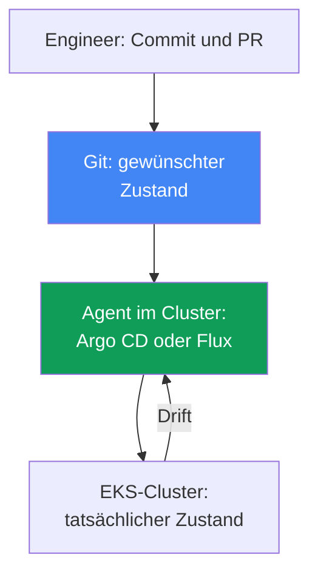
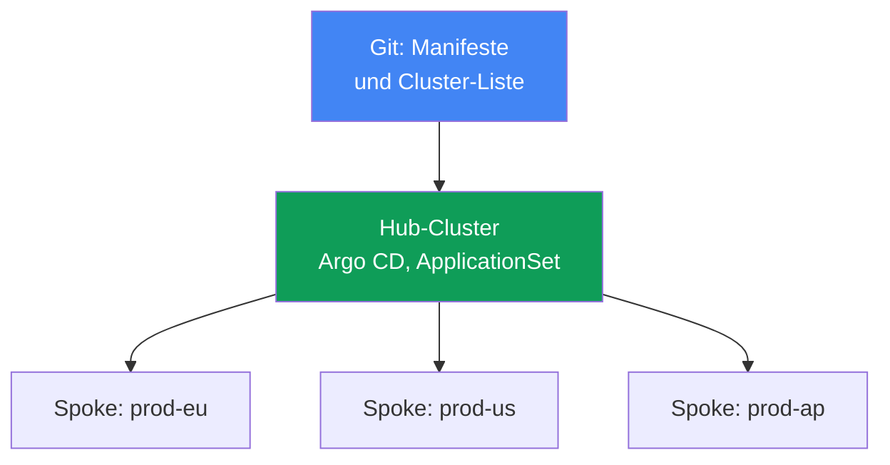
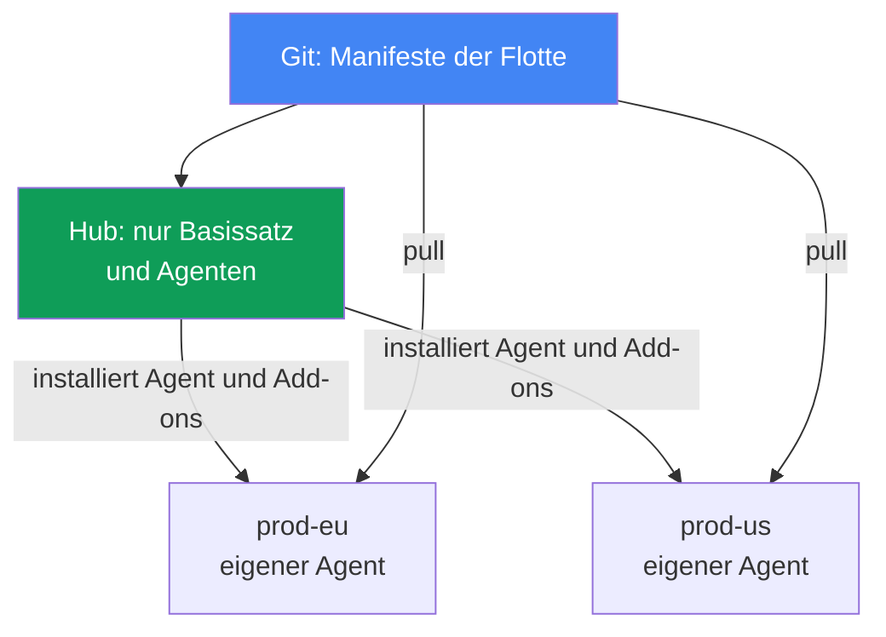

[Русская версия](ru.md) · [Eng version](en.md) · [Versión en español](es.md) · [Version française](fr.md) · [ქართული ვერსია](ge.md) · [繁體中文版](tw.md) · [日本語版](jp.md)
# Kapitel 44. GitOps und Auslieferung: Argo CD und Flux, Verwaltung einer Cluster-Flotte

> **Wie es weitergeht.** Die Teile 5-7 erwähnten GitOps wiederholt als Weg zum Ausrollen von Konfigurationen: Add-ons, Controller, Richtlinien, Observability. Nun betrachten wir den Mechanismus selbst. Verwandte Themen behandeln andere Kapitel: Multi-Cluster- und Multi-Account-Konnektivität in Kapitel 32, die Blue/Green-Migration der Cluster selbst in Kapitel 38, Secrets (External Secrets, SecretStore) in den Kapiteln 17-18 sowie Rollen für den Zugriff aus Pods (IRSA, Pod Identity) in den Kapiteln 16-17. Hier geht es darum, wie Git zur einzigen Quelle der Wahrheit für den Cluster wird und wie ein Repository eine EKS-Cluster-Flotte verwaltet.

## 44.1. Manuelles kubectl apply skaliert nicht

Eine Anwendung läuft in zwei Clustern: `prod-eu` und `prod-us`. Das Release wurde manuell ausgerollt, mit jeweils einem `kubectl apply` pro Cluster. Ein halbes Jahr später vergleicht der Bereitschaftsdienst und stellt fest, dass in `prod-eu` `app:1.14` läuft, in `prod-us` jedoch `app:1.11`: Jemand hat Europa aktualisiert und die USA vergessen.

Dann wird es schlimmer. In `prod-us` hat jemand einmal ein Deployment direkt im laufenden Betrieb bearbeitet:

```bash
# jemand hat während eines Incidents Replikate und Limits manuell geändert, in Git steht das nicht
kubectl -n shop edit deployment checkout
```

Diese Änderung ist nirgends dokumentiert. In Git liegt ein Manifest mit `replicas: 3` und einem Satz von Limits, im Cluster dagegen `replicas: 6` und andere Limits. Der Cluster-Zustand ist von dem abgewichen, was im Repository beschrieben ist. Das nennt man Drift, und niemand bemerkt ihn, bis ein Incident eintritt oder das nächste `kubectl apply` die Produktionsänderung stillschweigend zurückrollt.

Daraus ergeben sich drei getrennte Probleme:

- **Keine einzige Quelle der Wahrheit.** Was tatsächlich ausgerollt ist, sieht man nur im Cluster selbst, und jeder Cluster ist anders. Git und Cluster sind nur durch die Disziplin der Engineers verbunden.
- **Drift ist nicht sichtbar.** Manuelle Änderungen mit `kubectl edit` sammeln sich stillschweigend an; sie werden zufällig entdeckt.
- **Kein Audit und kein einfacher Rollback.** Wer wann was im Cluster geändert hat, ist unbekannt; für die Rückkehr zu einem früheren funktionierenden Zustand muss man sich daran erinnern, wie er aussah.

Bei zwei Clustern ist das noch erträglich, bei zwanzig (Kapitel 32) nicht mehr beherrschbar. Im weiteren Kapitel folgen die GitOps-Prinzipien, die alle drei Probleme beheben; die Agenten Argo CD und Flux; die Verwaltung einer Cluster-Flotte mit einem Repository; und die Besonderheiten dieses Modells für EKS.

## 44.2. GitOps-Prinzipien

GitOps ist ein Betriebsmodell, bei dem der gewünschte Zustand des Systems deklarativ in Git beschrieben wird und ein spezieller Agent im Cluster den tatsächlichen Zustand kontinuierlich an den beschriebenen Zustand angleicht. Es gibt vier Prinzipien (formuliert von OpenGitOps, einem CNCF-Projekt):

- **Deklarativität.** Das gesamte System wird deklarativ beschrieben: nicht „führe diese Schritte aus“, sondern „so soll es aussehen“. Das sind gewöhnliche Kubernetes-Manifeste, Kustomize oder Helm-Charts.
- **Versionierung und Unveränderlichkeit.** Der gewünschte Zustand liegt in Git: Jede Änderung ist ein Commit mit Autor, Zeit und Review durch einen Pull Request. Daraus ergeben sich Audit und Rollback: Die Rückkehr zum früheren Zustand ist ein `git revert`.
- **Automatisches Anwenden.** Der Agent holt genehmigte Änderungen und wendet sie selbst an, ohne manuelles `kubectl apply`.
- **Kontinuierliche Rekonsiliation.** Der Agent vergleicht Git und Cluster fortlaufend und beseitigt Abweichungen. Das ist der Kern des Modells: kein einmaliges Deployment, sondern ein endloser Abgleichzyklus.

**Pull gegenüber Push.** Klassisches CI/CD arbeitet nach dem Push-Modell: Eine Pipeline außerhalb des Clusters besitzt Cluster-Credentials und führt `kubectl apply` aus. Die Berechtigungen des Clusters liegen außen offen, und die Pipeline kennt nur ihren eigenen Lauf - was danach mit dem Cluster geschieht, weiß sie nicht. GitOps arbeitet nach dem Pull-Modell: Der Agent lebt im Cluster, zieht selbst aus Git und wendet selbst an. Cluster-Credentials werden nicht nach außen gegeben, und der Abgleich erfolgt fortlaufend statt nur beim Start der Pipeline.

**Drift und self-heal.** Da der Agent Git ständig mit dem Cluster vergleicht, erkennt er ein manuelles `kubectl edit` als Abweichung (Drift) und rollt die Änderung, wenn self-heal aktiviert ist, automatisch auf den Zustand aus Git zurück. Aus Drift wird statt eines stillen Problems entweder ein sichtbarer Status oder er wird selbst behoben - manuelle Änderungen in der Produktion überleben nicht mehr.



## 44.3. Argo CD

Argo CD ist ein GitOps-Agent und CNCF-Projekt (seit Dezember 2022 graduated). Es ist anwendungszentriert: Die Verwaltungseinheit ist die Ressource `Application`, die eine Quelle in Git mit einem Zielcluster und Namespace verbindet.

```yaml
apiVersion: argoproj.io/v1alpha1
kind: Application
metadata:
  name: checkout
  namespace: argocd
spec:
  project: default
  source:
    repoURL: https://git.example.com/shop.git
    targetRevision: main
    path: apps/checkout/overlays/prod
  destination:
    server: https://kubernetes.default.svc   # Zielcluster
    namespace: shop
  syncPolicy:
    automated:
      selfHeal: true    # Drift auf den Zustand aus Git zurückrollen
      prune: true       # entfernen, was aus Git entfernt wurde
```

Argo CD führt für jede `Application` zwei unabhängige Statuswerte:

- **sync status** - ob Cluster und Git übereinstimmen: `Synced` oder `OutOfSync` (es gibt Drift).
- **health status** - ob die Ressource selbst gesund ist: `Healthy`, `Progressing`, `Degraded`, `Missing`.
  Ein Deployment kann `Synced` sein (es stimmt mit Git überein), aber `Degraded` (Pods stürzen ab) - das sind verschiedene Achsen.

Die wichtigsten Synchronisierungsmechanismen:

- **auto-sync** - Änderungen aus Git automatisch anwenden, ohne manuelles `argocd app sync`.
- **self-heal** - manuelle Änderungen im Cluster auf den Zustand aus Git zurückrollen.
- **prune** - Ressourcen aus dem Cluster entfernen, die aus Git entfernt wurden (ohne prune bleiben sie verwaist).
- **sync waves** - die Anwendungsreihenfolge. Die Synchronisierung läuft in den Phasen `PreSync`, `Sync`, `PostSync` und innerhalb dieser in Wellen anhand der Annotation `argocd.argoproj.io/sync-wave`: zuerst kleinere Nummern. So werden CRDs vor Ressourcen angewendet, die sie verwenden, und die Datenbankmigration vor der Anwendung.

**App-of-apps.** Eine übergeordnete `Application` verweist auf ein Verzeichnis mit Manifesten untergeordneter `Application`-Ressourcen. Wird die übergeordnete Anwendung ausgerollt, stellen Sie den gesamten Anwendungssatz bereit - praktisch für das Bootstrapping eines Clusters von Grund auf. Die **UI** von Argo CD zeigt den Ressourcenbaum, den Diff zwischen Git und Cluster, Statuswerte und ermöglicht manuelles Starten von Sync oder Rollback.

**ApplicationSet** ist ein Controller, der anhand von Generatoren `Application`-Ressourcen aus einer Vorlage erzeugt. Für eine Cluster-Flotte ist der **cluster generator** entscheidend: Verbundene Cluster speichert Argo CD als Secret in seinem Namespace, und der cluster generator erstellt für jeden solchen Cluster eine `Application`. Wird ein Cluster hinzugefügt, wird der Anwendungssatz automatisch auf ihn ausgerollt (Abschnitt 44.6).

## 44.4. Flux

Flux ist der zweite GitOps-Agent, ebenfalls ein CNCF-Projekt (graduated). Im Unterschied zum monolithischen Argo CD ist es ein Satz spezialisierter Controller (GitOps Toolkit), jeweils mit eigener Aufgabe und eigenen CRDs:

| Controller | Zuständig für | Wichtigste CRDs |
|---|---|---|
| source-controller | Quellen: Git, Helm-Repositories, OCI | `GitRepository`, `HelmRepository`, `OCIRepository` |
| kustomize-controller | Anwenden von Kustomize/Manifesten | `Kustomization` |
| helm-controller | Releases von Helm-Charts | `HelmRelease` |
| notification-controller | eingehende/ausgehende Ereignisse, Alerts | `Alert`, `Provider`, `Receiver` |
| image-reflector-controller | Scannen von Image-Tags in Registries | `ImageRepository`, `ImagePolicy` |
| image-automation-controller | Commit neuer Tags zurück nach Git | `ImageUpdateAutomation` |

Das Flux-Modell lautet „Quelle, dann Rekonsiliation“. Zuerst wird deklariert, woher gezogen wird, dann was und wohin angewendet wird:

```yaml
apiVersion: source.toolkit.fluxcd.io/v1
kind: GitRepository
metadata:
  name: shop
  namespace: flux-system
spec:
  interval: 1m           # wie oft das Repository abgefragt wird
  url: https://git.example.com/shop.git
  ref:
    branch: main
---
apiVersion: kustomize.toolkit.fluxcd.io/v1
kind: Kustomization
metadata:
  name: checkout
  namespace: flux-system
spec:
  interval: 10m          # wie oft Cluster und Quelle verglichen werden
  sourceRef:
    kind: GitRepository
    name: shop
  path: ./apps/checkout/overlays/prod
  prune: true            # Entsprechung zu prune in Argo CD
```

Die Rekonsiliation läuft nach einem Intervall (`interval`): Der Controller prüft die Quelle periodisch und gleicht den Cluster daran an. `HelmRelease` bietet dasselbe für Helm-Charts deklarativ, ohne manuelles `helm install`.

**Image automation.** Das Paar der Image-Controller implementiert die automatische Aktualisierung von Images: Der reflector scannt Tags in der Registry (für EKS meist ECR, Kapitel 20), wählt anhand von `ImagePolicy` ein passendes aus (zum Beispiel das neueste semver), und der automation-controller committet den neuen Tag zurück nach Git. Danach rollt die gewöhnliche Rekonsiliation ihn in den Cluster aus. Git bleibt auch für Versionsaktualisierungen die Quelle der Wahrheit: Die Image-Änderung ist ein Commit, kein direkter Patch am Deployment.

## 44.5. Argo CD gegenüber Flux

Beide sind reife CNCF-graduated-Projekte und setzen dieselben GitOps-Prinzipien um. Der Unterschied liegt in Aufbau und Schwerpunkten, nicht darin, welches „besser“ ist:

| | Argo CD | Flux |
|---|---|---|
| Aufbau | monolithischer, anwendungszentrierter Agent | Satz von Controllern (GitOps Toolkit) |
| UI | umfangreiche Web-UI sofort verfügbar | keine UI (es gibt Drittanbieter-Lösungen, CLI `flux`) |
| Verwaltungseinheit | `Application` / `ApplicationSet` | `Kustomization` / `HelmRelease` |
| Cluster-Flotte | ApplicationSet + cluster generator | `Kustomization` pro Cluster, Hub-Repository |
| Automatische Image-Aktualisierung | über Argo Image Updater (separat) | integrierte Image-Controller |
| Progressive Delivery | Argo Rollouts | Flagger |
| Modell | Pull, Rekonsiliation | Pull, Rekonsiliation nach Intervall |

Eine grobe Auswahlheuristik: Argo CD wird gewählt, wenn eine anschauliche UI, ein Ressourcenbaum und das anwendungszentrierte Modell mit ApplicationSet wichtig sind; Flux, wenn Modularität, Verwaltung durch CRDs in Git und integrierte image automation besser passen. Ergänzungen (Secrets, Delivery) lassen sich mit beiden kombinieren.

## 44.6. Verwaltung einer Cluster-Flotte

Ein verbreitetes Modell für eine EKS-Cluster-Flotte (Kapitel 32) ist **Hub und Spoke**. Ein Hub-Cluster trägt Argo CD (oder Flux) und verwaltet viele Spoke-Cluster: Der Agent auf dem Hub wendet Manifeste in jedem Zielcluster an. Der Agent muss nicht in jedem Cluster installiert und aktualisiert werden, und seine Identität sowie sein Zugriff auf Git werden an einer Stelle eingerichtet. Der Preis dieser Zentralisierung sind eine Ausfalldomäne und eine Skalierungsgrenze - Details folgen unten.



ApplicationSet mit cluster generator verwandelt „einen Anwendungssatz auf allen Clustern ausrollen“ in eine Deklaration: eine `Application`-Vorlage plus einen Generator, der verbundene Cluster durchläuft. Der gemeinsame Satz (Add-ons, Richtlinien, Basisdienste) wird konsistent auf die gesamte Flotte ausgerollt; Unterschiede zwischen Clustern (Region, Größe, Endpoint) werden durch Generatorparameter in die Vorlage eingesetzt.

**Git generator und matrix.** Der cluster generator durchläuft Cluster, während der Add-on-Satz selbst häufig durch die Struktur des Git-Repositorys definiert ist. Dies deckt der git generator in zwei Modi ab: Der directory generator erzeugt eine `Application` pro Unterverzeichnis (ein Verzeichnis pro Add-on), der file generator eine pro Konfigurationsdatei (zum Beispiel `addons/*.yaml` mit Parametern). Wird ein Verzeichnis oder eine Datei in Git ergänzt, erscheint ein neues Add-on in der Flotte, ohne dass ApplicationSet geändert werden muss.

Um „einen Add-on-Satz auf jeden Cluster“ auszurollen, werden Generatoren mit dem matrix generator kombiniert: Er multipliziert zwei verschachtelte Generatoren (kartesisches Produkt), etwa cluster (jeder Cluster) und git (jedes Add-on), und erzeugt eine `Application` für jedes Paar. Damit wird der grundlegende Satz von Infrastruktur-Add-ons automatisch auf neue Cluster ausgerollt, während die Add-on-Liste als Verzeichnis- oder Dateistruktur in Git bleibt.

**Bootstrapping eines neuen Clusters.** Sobald der Cluster erstellt (Terraform, Kapitel 4) und mit dem Hub verbunden ist, rollt app-of-apps oder ApplicationSet den gesamten Basissatz automatisch auf ihn aus. Genau das wird bei einer Blue/Green-Migration von Clustern (Kapitel 38) benötigt: Der neue „grüne“ Cluster erhält dieselbe Konfiguration aus demselben Git und wird nicht manuell zusammengestellt - daher ist er mit dem „blauen“ identisch.

### Preis der Zentralisierung und Wahl der Topologie

Der erste Preis ist die **Ausfalldomäne**. Der Hub ist ein einzelner Punkt für die gesamte Flotte: Laufende Workloads auf den Spoke-Clustern arbeiten weiter, der Agent liegt nicht im Datenpfad, aber das Anwenden neuer Commits, die Korrektur von Drift (self-heal) und Rollbacks stehen sofort für die ganze Flotte still - ein Incident auf dem Hub friert die Delivery überall ein. Der zweite Preis ist die **Rekonsiliation über das Netzwerk**: Der Agent ändert und löscht Ressourcen über Cluster-Grenzen, mit Latenz, Netzwerkengpässen, Kosten für ausgehenden Datenverkehr (Kapitel 31) und Empfindlichkeit gegenüber instabilen Verbindungen als Folge (die Dokumentation von Argo CD Agent von Red Hat nennt diese Punkte im Vergleich mit der traditionellen Argo-CD-Architektur). Es gibt drei Antworten:

- **Den Hub sharden.** Cluster werden auf Replikate des application-controller verteilt: Die Zahl der Replikate wird erhöht und dieselbe Zahl in der Variablen `ARGOCD_CONTROLLER_REPLICAS` dupliziert. Der Verteilungsalgorithmus kann hash-based sein (älter, verteilt ungleichmäßig) oder round-robin (gleichmäßiger); in aktuellen Versionen gibt es eine dynamische Verteilung, die die Zuordnung bei Änderung der Replikazahl neu berechnet.
- **Dezentralisieren.** Der Hub rollt über ApplicationSet nur die Basis aus: Infrastruktur-Add-ons und einen lokalen Agenten Argo CD oder Flux; danach betrachtet der Agent selbst Git und zieht seine Anwendungen (Pull-Modell, Abschnitt 44.2). Der Cluster ist autonom: Fällt der Hub oder die Verbindung dorthin aus, läuft die Rekonsiliation weiter. Der Preis: Es gibt genauso viele Agenten wie Cluster, sie müssen aktualisiert und eingerichtet werden, eine gemeinsame Übersicht über die Flotte fehlt, und die Agent-Versionen driften auseinander.
- **Den Datenfluss umkehren und eine Control Plane behalten.** Das Projekt `argocd-agent` (es gehört zu `argoproj-labs`, ist inkubierend und nicht Kern von Argo CD) bewahrt genau eine zentrale Argo-CD-Instanz, die die `Application`-Ressourcen aller Workload-Cluster sieht, aber die Synchronisierung wird von einem Agenten auf der Spoke-Seite gezogen, statt dass der Hub auf entfernte APIs schreibt. Dies bleibt Hub-and-Spoke.

Die Auswahl richtet sich nach der Größe der Flotte und dem Bedarf an Autonomie, nicht nach „Richtigkeit“: Das Hub-Modell ist einfacher zu betreiben und bietet eine zentrale Übersicht, das dezentrale Modell überlebt den Verlust des Hub.



**Aufgabentrennung** ist ein wichtiges Prinzip, das leicht verletzt wird:

| Ebene | Was verwaltet wird | Werkzeug |
|---|---|---|
| Infrastruktur | VPC, EKS-Cluster, node groups, IAM | Terraform / Terragrunt (IaC) |
| Plattform und Anwendungen | Add-ons, Controller, Richtlinien, Workloads | GitOps (Argo CD / Flux) |

IaC erstellt den Cluster und seine „Hardware“, GitOps füllt den vorhandenen Cluster mit Add-ons und Anwendungen. Eine Vermischung ist schädlich: Einen Cluster wegen einer Deployment-Änderung neu zu erstellen ist teuer; Infrastruktur über einen Agenten zu ziehen, der selbst in diesem Cluster lebt, ist ein Henne-Ei-Problem. Die Grenze verläuft zwischen „Cluster als AWS-Ressource“ und „was im Cluster läuft“.

## 44.7. EKS-Besonderheiten

Ein GitOps-Agent ist ein gewöhnlicher Workload im Cluster, und in EKS gelten für ihn dieselben Regeln für Identität und Zugriff wie für jeden Pod.

- **Authentifizierung des Agenten bei AWS.** Um Images aus ECR zu ziehen (Kapitel 20) oder AWS-Services aufzurufen, erhält der Agent eine Rolle über IRSA (Kapitel 16) oder EKS Pod Identity (Kapitel 17), keine statischen Schlüssel: Der ServiceAccount wird einer IAM-Rolle mit minimalen Berechtigungen zugeordnet.
- **Repository-Zugriff.** Privates Git ist CodeCommit oder self-hosted; für externes Git erhält der Agent einen deploy-key oder Token, der als Secret gespeichert (und nicht in Git committet, siehe unten) wird.
- **Verwaltung von EKS-Add-ons.** Managed Add-ons und Helm-Add-ons (Kapitel 37) lassen sich bequem in Git beschreiben und durch denselben Agenten ausrollen: Versionen und Konfiguration der Add-ons sind Teil desselben Satzes.

**Secrets werden nicht in Git committet.** Das ist die wichtigste Regel: Git ist eine Quelle der Wahrheit, aber kein Secret-Speicher, auch kein privates Repository. Ein Secret-Wert in Git ist eine Offenlegung. Praktische Ansätze:

- **External Secrets Operator** (Kapitel 18): In Git liegt ein `ExternalSecret`, das auf Secrets Manager oder SSM Parameter Store verweist; der Operator zieht den Wert und erstellt ein gewöhnliches Secret im Cluster. In Git liegt nur die Referenz, der Wert verbleibt in Secrets Manager (Kapitel 17-18).
- **Sealed Secrets**: In Git wird ein verschlüsseltes `SealedSecret` abgelegt, das nur der Controller im Cluster mit seinem Schlüssel entschlüsseln kann. Im Repository liegt nur der Chiffretext.

Damit bleibt die Deklarativität erhalten (in Git liegt ein Secret-Objekt), aber sein Wert gelangt nicht dorthin.

### Verwaltete EKS-Funktion für Argo CD

Die obige Behandlung von IRSA und Pod Identity bezieht sich auf einen selbst installierten Agenten. Argo CD ist auch als verwaltete EKS-Funktion (EKS Capabilities) verfügbar: AWS übernimmt Installation, Updates und Skalierung der Controller, und die Software läuft in der AWS-Control-Plane, nicht auf Ihren Nodes. Die ausdrücklich in der Dokumentation genannte Folge: Worker-Nodes benötigen keinen direkten Zugriff auf Git-Repositories und Helm-Registries, denn die Funktion liest die Quellen auf AWS-Seite. Die Manifeste `Application` und `ApplicationSet` funktionieren dabei wie im Upstream und müssen nicht geändert werden.

- **Deployment-Ziele.** Nur EKS-Cluster und nur über die Cluster-ARN, nicht über die URL des API-Servers. Der lokale Cluster wird nicht automatisch registriert: Um in den gleichen Cluster auszurollen, in dem die Funktion erstellt wurde, wird auch er explizit über ARN registriert. Die Funktion richtet die Hub-and-Spoke-Topologie nicht selbst ein - Zielcluster und access entries legen Sie fest. Sie wird auf dem zentralen Hub-Cluster erstellt und nicht auf den Spoke-Clustern installiert: Hub-and-Spoke ist eine unterstützte, valide Topologie und kein Entwurfsfehler.
- **Zugriff auf Zielcluster.** Über EKS access entries (Kapitel 5), daher werden dafür weder IRSA noch cross-account assume role benötigt. Es wird transparenter Zugriff auf vollständig private EKS-Cluster ohne VPC peering und besondere Netzwerkkonfiguration zugesagt (Kapitel 2).
- **Authentifizierung und RBAC.** AWS Identity Center, genau drei Rollen: admin, editor, viewer; die Zuordnung wird über den Funktionsparameter `rbacRoleMapping` festgelegt, nicht durch die ConfigMap `argocd-rbac-cm`. Die Ressourcen `Application`, `ApplicationSet`, `AppProject` müssen in einem vorgegebenen Namespace liegen, während Workloads in beliebige Namespaces beliebiger Zielcluster ausgerollt werden.
- **Was fehlt.** Config Management Plugins, eigene Lua-Skripte für Health-Prüfungen, der notifications-Controller, eigene SSO-Provider außer Identity Center, UI-Erweiterungen, direkter Zugriff auf `argocd-cm` und `argocd-params`, Änderung des Synchronisierungs-Timeouts (fest auf 120 Sekunden).

## 44.8. Progressive Delivery

GitOps rollt aus, was in Git beschrieben ist, steuert jedoch nicht, *wie* eine neue Anwendungsversion die alte ersetzt. Das Standardverfahren `RollingUpdate` kann nur Pods schrittweise ersetzen, ohne Aufteilung des Traffics nach Prozenten und ohne automatischen Rollback anhand von Metriken. Dies deckt Progressive Delivery ab: **Argo Rollouts** (CRD `Rollout` statt `Deployment`) mit Argo CD und **Flagger** mit Flux ermöglichen Canary- und Blue/Green-Deployments von *Anwendungen* mit Metrikanalyse und automatischem Rollback. Es geht um Anwendungsversionen, nicht zu verwechseln mit Blue/Green von *Clustern* aus Kapitel 38; die Ebene liegt über GitOps.

## 44.9. So wird es in der Produktion eingesetzt

- **Git wird zur einzigen Quelle der Wahrheit gemacht.** Direktes `kubectl apply` in der Produktion wird untersagt; jede Änderung erfolgt durch Commit und Pull Request, der Agent wendet sie an. Audit und Rollback gibt es kostenlos.
- **self-heal und prune werden bewusst aktiviert.** self-heal beseitigt manuelle Änderungen in der Produktion; während eines Incidents wird es manchmal temporär deaktiviert. Prune entfernt, was nach dem Löschen aus Git verwaist ist.
- **IaC und GitOps werden getrennt.** Cluster, VPC und node groups gehören zu Terraform; Add-ons und Anwendungen zu GitOps. Die Grenze wird strikt eingehalten, damit kein Cluster wegen einer Deployment-Änderung neu erstellt wird.
- **Die Flotte wird über ApplicationSet verwaltet.** Ein gemeinsamer Satz von Add-ons und Richtlinien wird aus einem Repository auf alle Cluster ausgerollt; ein neuer Cluster erhält die Konfiguration beim Bootstrapping automatisch.
- **Secrets bleiben außerhalb von Git.** External Secrets Operator über Secrets Manager oder Sealed Secrets; Klartextwerte gelangen nie ins Repository.
- **Der Agent erhält eine Rolle, keine Schlüssel.** Zugriff auf ECR und AWS-Services erfolgt über IRSA oder Pod Identity.

## 44.10. Mini-Glossar

- **GitOps** - ein Modell, bei dem der gewünschte Zustand in Git beschrieben ist und ein Agent den Cluster kontinuierlich daran angleicht (die Prinzipien formuliert OpenGitOps, ein CNCF-Projekt).
- **Rekonsiliation** - ein kontinuierlicher Abgleichzyklus zwischen gewünschtem (Git) und tatsächlichem (Cluster) Zustand.
- **Drift** - Abweichung des Cluster-Zustands von Git, meist durch manuelles `kubectl edit`.
- **self-heal** - automatisches Zurückrollen von Drift auf den Zustand aus Git.
- **Pull-Modell** - der Agent im Cluster zieht selbst aus Git; Push bedeutet eine externe Pipeline.
- **Application** - Argo-CD-CRD: die Verbindung „Quelle in Git + Zielcluster und Namespace“.
- **ApplicationSet** - Argo-CD-Controller, der `Application` anhand einer Vorlage erzeugt; cluster generator erstellt eine pro verbundenem Cluster, git generator eine pro Verzeichnis oder Datei in Git, matrix generator multipliziert zwei Generatoren (cluster + git).
- **sync waves** - Reihenfolge der Ressourcenanwendung in Argo CD nach Wellen innerhalb der Sync-Phasen.
- **app-of-apps** - eine übergeordnete `Application`, die einen Satz untergeordneter Anwendungen bereitstellt.
- **GitOps Toolkit** - der Satz von Flux-Controllern (source, kustomize, helm, image und weitere).
- **Kustomization / HelmRelease** - Flux-CRDs: was aus einer Quelle wohin angewendet wird.
- **image automation** - Flux-Controller, die neue Image-Tags zurück nach Git committen.
- **Progressive Delivery** - Canary-/Blue-Green-Deployment von Anwendungen (Argo Rollouts, Flagger).
- **verwaltete EKS-Funktion für Argo CD** - Argo CD als EKS Capability: Controller in der AWS-Control-Plane, Ziele nur EKS-Cluster über ARN, Zugriff über EKS access entries.
- **Argo-CD-Sharding** - Verteilung verbundener Cluster auf Replikate des application-controller.

## 44.11. Zusammenfassung des Kapitels

- Manuelles `kubectl apply` auf viele Cluster führt zu drei Problemen: keine einzige Quelle der Wahrheit, unsichtbarer Drift durch manuelle Änderungen, kein Audit und kein einfacher Rollback.
- GitOps behebt dies: Der gewünschte Zustand ist deklarativ in Git, der Agent rekonsiliiert den tatsächlichen Zustand kontinuierlich darauf (Pull-Modell). Eine Änderung ist ein Commit mit Review, ein Rollback ist `git revert`, und self-heal macht manuelle Produktionsänderungen nicht überlebensfähig.
- Argo CD ist ein anwendungszentrierter Monolith mit UI: CRD `Application` mit sync- und health-Status, auto-sync, self-heal, prune, sync waves, app-of-apps, ApplicationSet mit cluster generator.
- Flux ist ein Satz von Controllern (GitOps Toolkit): `GitRepository`, `Kustomization`, `HelmRelease`, Rekonsiliation nach Intervall und image automation mit Commit der Tags nach Git. Beide sind CNCF graduated.
- Cluster-Flotte: Ein Hub mit Agent verwaltet Spoke-Cluster; der ApplicationSet cluster generator rollt den gemeinsamen Satz auf alle aus; ein neuer Cluster erhält seine Konfiguration beim Bootstrapping.
- Die Ausfalldomäne des Hub-Modells ist die gesamte Flotte: Anwenden von Commits, self-heal und Rollbacks stehen still, nicht aber die Workloads selbst. Abhilfe schaffen Sharding des Controllers oder Dezentralisierung mit lokalem Agenten auf jedem Cluster.
- Argo CD ist auch als verwaltete EKS-Funktion verfügbar: Software in der AWS-Control-Plane statt auf Nodes, Deployment-Ziele nur EKS-Cluster über ARN, Zugriff über access entries, RBAC über Identity Center.
- Die Grenze wird eingehalten: Terraform verwaltet Infrastruktur (VPC, Cluster, node groups), GitOps Add-ons und Anwendungen darauf; eine Vermischung ist teuer und riskant.
- In EKS erhält der Agent eine Rolle über IRSA oder Pod Identity (Zugriff auf ECR, CodeCommit), keine Schlüssel; Secrets werden nicht in Git committet - External Secrets Operator über Secrets Manager oder Sealed Secrets.
- Progressive Delivery (Argo Rollouts, Flagger) liefert Canary-/Blue-Green-Deployments von Anwendungen über GitOps; dies betrifft Anwendungsversionen, nicht Blue/Green von Clustern aus Kapitel 38.

## 44.12. Nutzen in der praktischen Arbeit

Im Bereitschaftsdienst verändert GitOps den Charakter der Arbeit mit dem Cluster. Die Frage „was ist hier tatsächlich ausgerollt“ erfordert keine Nachforschungen mehr: Die Wahrheit liegt in Git, und jede Abweichung zeigt der Agent mit dem Status `OutOfSync`. Eine manuelle Änderung während eines Incidents ist keine stille Mine mehr: Entweder self-heal rollt sie sofort zurück, oder sie ist als Drift sichtbar, und Sie entscheiden bewusst, sie zu committen oder zu entfernen. Die Rückkehr zu einem früheren funktionierenden Zustand ist ein `git revert`, nicht der Versuch, sich an gestern zu erinnern.

Bei der Plattformplanung hält GitOps die Cluster-Flotte einheitlich: Der gemeinsame Satz von Add-ons und Richtlinien wird einmal beschrieben und über ApplicationSet auf alle Cluster ausgerollt; ein neuer Cluster wird nach der Erstellung mit Terraform (Kapitel 4) beim Bootstrapping automatisch befüllt, was die Blue/Green-Migration (Kapitel 38) vereinfacht. Disziplin ist hier wichtiger als das Werkzeug: eine strenge Grenze zwischen IaC und GitOps, Secrets außerhalb von Git, Zugriff des Agenten über eine Rolle. Die Wahl zwischen Argo CD und Flux ist zweitrangig - beide sind reif; entscheidend ist, dass Git zum einzigen Ort geworden ist, über den sich der Cluster ändert.

## 44.13. Fragen zur Selbstkontrolle

1. Welche drei Probleme bei manuellem `kubectl apply` auf vielen Clustern behandelt der Anfang des Kapitels?
2. Was ist Drift und wie verändert self-heal das Schicksal einer manuellen Änderung mit `kubectl edit` in der Produktion?
3. Formulieren Sie die vier GitOps-Prinzipien. Warum reduziert sich ein Rollback auf `git revert`?
4. Worin unterscheiden sich Pull- und Push-Modell der Delivery und warum ist Pull für Cluster-Credentials sicherer?
5. Was beschreibt die CRD `Application` in Argo CD und worin unterscheidet sich sync status von health status?
6. Wozu dienen auto-sync, self-heal, prune und sync waves? Wo ist die Reihenfolge von Wellen wichtig?
7. Was sind app-of-apps und ApplicationSet cluster generator, und wann eignet sich welches?
8. Aus welchen Controllern und CRDs besteht Flux und was bedeutet „Quelle, dann Rekonsiliation“?
9. Wie funktioniert image automation in Flux und warum bleibt die Image-Aktualisierung ein Commit in Git?
10. Vergleichen Sie Argo CD und Flux: Aufbau, UI, Verwaltungseinheit, Cluster-Flotte.
11. Wie funktioniert die Verwaltung einer Flotte nach dem Hub-and-Spoke-Modell und was rollt der cluster generator aus?
12. Was funktioniert in der Flotte beim Ausfall des Hub-Clusters nicht mehr, und was funktioniert weiter?
13. Wo verläuft die Grenze zwischen IaC (Terraform) und GitOps und warum darf sie nicht verwischt werden?
14. Wie erhält ein GitOps-Agent auf EKS Zugriff auf ECR und warum werden Secrets nicht in Git committet?
15. Worin unterscheidet sich die verwaltete EKS-Funktion für Argo CD von einer selbst installierten Instanz hinsichtlich Ausführungsort der Software und Zugriff auf Zielcluster?

## Praxis

Das Kurslabor zu diesem Thema: [Labor 118 - GitOps: Argo CD, Drift und self-heal](../../labs/118/README_DE.MD).
Darin installieren Sie Argo CD, erstellen eine Application für ein Verzeichnis in Git, beobachten Drift und self-heal, behandeln sync waves, die Grenzen von prune und den Unterschied zwischen sync status und health status; geprüft wird mit dem Befehl `check_result`. Start: `TASK=118 make run_eks_task`.

Neben dem Labor lassen sich sowohl Argo CD als auch Flux auf einem laufenden Cluster über ihre CRDs und CLI betrachten.
Beginnen Sie damit, welche Anwendungen der Agent überhaupt kennt und welchen Status sie haben.

Wenn Argo CD im Cluster installiert ist:

```bash
# alle Application-Ressourcen und ihr sync/health-Status
kubectl get applications -n argocd
# dasselbe über die Argo-CD-CLI
argocd app list
# Details zu einer Anwendung: Quelle, Ressourcenbaum, Drift
argocd app get checkout
```

Achten Sie auf die Spalten sync (`Synced`/`OutOfSync`) und health (`Healthy`/`Degraded`):
`OutOfSync` bei aktiviertem self-heal ist ein Anlass zu prüfen, wer was manuell geändert hat.

Wenn Flux im Cluster installiert ist:

```bash
# Quellen und ihr Zustand
kubectl get gitrepository -A
flux get sources git
# was tatsächlich rekonsiliiert wird und wann der letzte Abgleich erfolgte
flux get kustomizations -A
kubectl get kustomization -A
```

Sehen Sie sich das Feld `interval` bei `GitRepository` und `Kustomization` an - das ist der Rhythmus der Rekonsiliation. Prüfen Sie anschließend die Trennung der Ebenen: Stellen Sie sicher, dass Cluster und node groups über Terraform erstellt sind, Add-ons und Anwendungen dagegen über den Agenten aus Git kommen und nicht manuell angelegt wurden. Suchen Sie Secrets als `ExternalSecret` oder `SealedSecret`, nicht als Klartext-`Secret` im Repository.

---
[Inhaltsverzeichnis](../README_DE.md) · [Kapitel 43](../43/de.md) · [Kapitel 45](../45/de.md)
