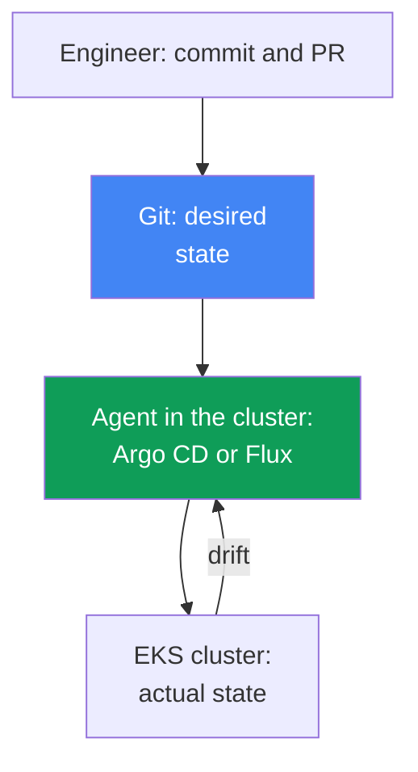
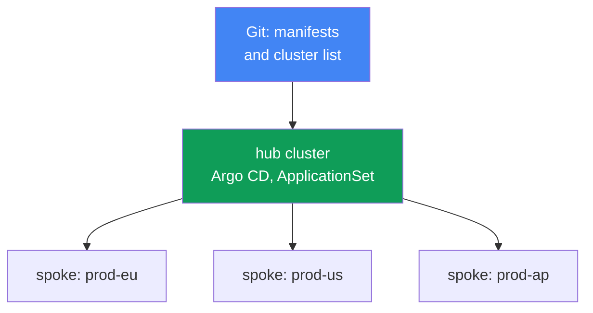
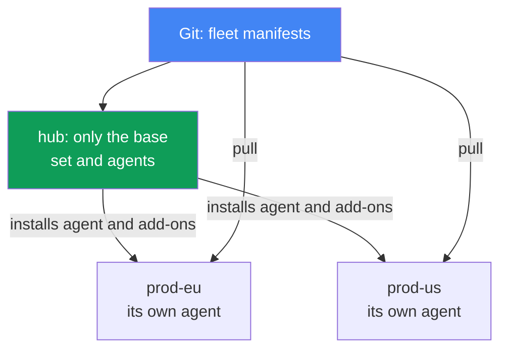

[Русская версия](ru.md) · [Versión en español](es.md) · [Version française](fr.md) · [Deutsche Version](de.md) · [ქართული ვერსია](ge.md) · [繁體中文版](tw.md) · [日本語版](jp.md)
# Chapter 44. GitOps and delivery: Argo CD and Flux, fleet management

> **What is next.** Parts 5-7 repeatedly mentioned GitOps as a way to roll out configuration:
> add-ons, controllers, policies, observability. It is time to examine the mechanism itself. Related
> topics belong to other chapters: multi-cluster and multi-account connectivity is chapter 32,
> blue/green migration of the clusters themselves is chapter 38, secrets (External Secrets,
> SecretStore) are chapters 17-18, and roles for access from Pods (IRSA, Pod Identity) are
> chapters 16-17. Here, we cover how Git becomes the single source of truth for a cluster and how
> one repository manages a fleet of EKS clusters.

## 44.1. Manual kubectl apply does not scale

An application runs in two clusters: `prod-eu` and `prod-us`. The release was rolled out manually,
with one `kubectl apply` per cluster. Six months later, an on-call engineer compares them and finds
that `prod-eu` runs `app:1.14`, while `prod-us` runs `app:1.11`: someone updated Europe and forgot
about the United States.

It gets worse. At some point, someone edited a Deployment live in `prod-us`:

```bash
# someone changed replicas and limits manually during an incident; Git does not contain this
kubectl -n shop edit deployment checkout
```

That edit was never recorded anywhere. Git contains a manifest with `replicas: 3` and one set of
limits, while the cluster has `replicas: 6` and different limits. The cluster state has diverged
from what the repository describes. This is called drift, and no one knows about it until an
incident occurs or until the next `kubectl apply` silently rolls the production edit back.

This creates three distinct failures:

- **No single source of truth.** What is actually deployed is visible only in the cluster itself,
  and every cluster differs. Git and the cluster are connected by nothing but engineer discipline.
- **Drift is invisible.** Manual `kubectl edit` changes accumulate silently; they are discovered by
  accident.
- **No audit trail or easy rollback.** Who changed what in the cluster and when is unknown; to
  return to a previous working state, you must remember what it was.

This is tolerable for two clusters; for twenty (chapter 32), it is unmanageable. The rest of the
chapter covers the GitOps principles that fix all three failures; Argo CD and Flux agents; managing
a fleet of clusters from one repository; and what is EKS-specific in this setup.

## 44.2. GitOps principles

GitOps is an operating model in which the desired state of the system is described declaratively in
Git, and a special in-cluster agent continuously brings the actual state into line with that
description. There are four principles (formulated by OpenGitOps, a CNCF project):

- **Declarative.** The entire system is described declaratively: not “perform these steps,” but
  “this is how it must be.” These are regular Kubernetes manifests, Kustomize, or Helm charts.
- **Versioned and immutable.** Desired state is stored in Git: every change is a commit with an
  author, timestamp, and pull-request review. This provides audit and rollback: returning to a
  previous state is `git revert`.
- **Automatically pulled.** The agent pulls and applies approved changes itself, without a manual
  `kubectl apply`.
- **Continuously reconciled.** The agent constantly compares Git and the cluster and corrects
  differences. This is the core of the model: not a one-time deployment, but an endless
  reconciliation loop.

**Pull versus push.** Traditional CI/CD uses a push model: an external pipeline holds cluster
credentials and runs `kubectl apply`. Cluster permissions are exposed outside the cluster, and the
pipeline knows only about its own run; it does not know what happened to the cluster afterward.
GitOps uses a pull model: the agent lives inside the cluster, pulls from Git itself, and applies
changes itself. Cluster credentials are not handed outside, and reconciliation is continuous rather
than limited to the moment when the pipeline runs.

**Drift and self-heal.** Because the agent constantly compares Git with the cluster, it sees a
manual `kubectl edit` as a difference (drift) and, if self-heal is enabled, automatically rolls the
edit back to the Git state. Drift changes from a silent problem into either a visible status or
something that fixes itself: manual production edits no longer persist.



## 44.3. Argo CD

Argo CD is a GitOps agent and a CNCF project (graduated since December 2022). It is
application-centric: its unit of management is the `Application` resource, which connects a Git
source to a target cluster and namespace.

```yaml
apiVersion: argoproj.io/v1alpha1
kind: Application
metadata:
  name: checkout
  namespace: argocd
spec:
  project: default
  source:
    repoURL: https://git.example.com/shop.git
    targetRevision: main
    path: apps/checkout/overlays/prod
  destination:
    server: https://kubernetes.default.svc   # target cluster
    namespace: shop
  syncPolicy:
    automated:
      selfHeal: true    # roll drift back to the Git state
      prune: true       # delete what was removed from Git
```

Argo CD maintains two independent statuses for each `Application`:

- **sync status**: whether the cluster matches Git: `Synced` or `OutOfSync` (drift exists).
- **health status**: whether the resource itself is healthy: `Healthy`, `Progressing`,
  `Degraded`, `Missing`. A Deployment can be `Synced` (it matches Git) but `Degraded` (its Pods
  are crashing); these are separate dimensions.

Key synchronization mechanisms:

- **auto-sync**: apply Git changes automatically, without a manual `argocd app sync`.
- **self-heal**: roll manual cluster edits back to the Git state.
- **prune**: delete cluster resources removed from Git (without prune, they are orphaned).
- **sync waves**: the apply order. Synchronization proceeds through `PreSync`, `Sync`, and
  `PostSync` phases, and within them through waves based on the
  `argocd.argoproj.io/sync-wave` annotation: lower numbers go first. This applies CRDs before
  resources that use them, and database migration before the application.

**App-of-apps.** One parent `Application` points to a directory with manifests for child
`Application` resources. By rolling out the parent, you deploy the entire application set, which is
convenient for bootstrapping a cluster from scratch. The Argo CD **UI** displays the resource tree,
the diff between Git and the cluster, statuses, and lets you manually start a sync or rollback.

**ApplicationSet** is a controller that generates `Application` resources from a template using
generators. For a cluster fleet, the key one is the **cluster generator**: Argo CD stores connected
clusters as Secrets in its namespace, and the cluster generator creates one `Application` for each
such cluster. Add a cluster, and the application set is rolled out to it automatically (section
44.6).

## 44.4. Flux

Flux is the second GitOps agent and also a CNCF project (graduated). Unlike monolithic Argo CD, it
is a set of specialized controllers (GitOps Toolkit), each with its own job and CRDs:

| Controller | Responsible for | Main CRDs |
|---|---|---|
| source-controller | sources: Git, Helm repositories, OCI | `GitRepository`, `HelmRepository`, `OCIRepository` |
| kustomize-controller | applying Kustomize/manifests | `Kustomization` |
| helm-controller | Helm chart releases | `HelmRelease` |
| notification-controller | incoming/outgoing events, alerts | `Alert`, `Provider`, `Receiver` |
| image-reflector-controller | scanning image tags in registries | `ImageRepository`, `ImagePolicy` |
| image-automation-controller | committing new tags back to Git | `ImageUpdateAutomation` |

The Flux model is “source, then reconciliation.” First, declare where to pull from, then declare
what to apply and where:

```yaml
apiVersion: source.toolkit.fluxcd.io/v1
kind: GitRepository
metadata:
  name: shop
  namespace: flux-system
spec:
  interval: 1m           # how often to poll the repository
  url: https://git.example.com/shop.git
  ref:
    branch: main
---
apiVersion: kustomize.toolkit.fluxcd.io/v1
kind: Kustomization
metadata:
  name: checkout
  namespace: flux-system
spec:
  interval: 10m          # how often to compare the cluster with the source
  sourceRef:
    kind: GitRepository
    name: shop
  path: ./apps/checkout/overlays/prod
  prune: true            # equivalent of prune in Argo CD
```

Reconciliation runs on an `interval`: the controller periodically checks the source and brings the
cluster into line with it. `HelmRelease` provides the same thing for Helm charts declaratively,
without manually running `helm install`.

**Image automation.** The pair of image controllers implements automated image updates: the
reflector scans tags in a registry (for EKS, usually ECR, chapter 20), `ImagePolicy` selects a
suitable one (for example, the latest semver), and the automation-controller commits the new tag
back to Git. Then ordinary reconciliation rolls it out to the cluster. Git remains the source of
truth even for version updates: an image change is a commit, not a direct Deployment patch.

## 44.5. Argo CD versus Flux

Both are mature CNCF graduated projects, and both implement the same GitOps principles. The
difference is in architecture and emphasis, not in which one is “better”:

| | Argo CD | Flux |
|---|---|---|
| Architecture | monolithic agent, application-centric | set of controllers (GitOps Toolkit) |
| UI | feature-rich web UI out of the box | no UI (third-party options and the `flux` CLI exist) |
| Unit of management | `Application` / `ApplicationSet` | `Kustomization` / `HelmRelease` |
| Cluster fleet | ApplicationSet + cluster generator | per-cluster `Kustomization`, hub repository |
| Automated image updates | through Argo Image Updater (separate) | built-in image controllers |
| Progressive delivery | Argo Rollouts | Flagger |
| Model | pull, reconciliation | pull, interval-based reconciliation |

A rough selection heuristic: choose Argo CD when a clear UI, resource tree, and
application-centric model with ApplicationSet matter; choose Flux when modularity and management
through CRDs in Git with built-in image automation are a better fit. Either one needs supporting
components for secrets and delivery.

## 44.6. Managing a cluster fleet

A common model for a fleet of EKS clusters (chapter 32) is **hub and spoke**. One hub cluster runs
Argo CD (or Flux) and manages many spoke clusters: the agent on the hub applies manifests to each
target cluster. The agent does not need to be installed and updated in every cluster, and the
agent's identity and Git access are configured in one place. This centralization comes with a
failure domain and scaling limit, discussed below.



An ApplicationSet with a cluster generator turns “roll out an application set to every cluster” into
a single declaration: an `Application` template plus a generator that iterates over connected
clusters. The common set (add-ons, policies, foundational services) is deployed consistently across
the fleet, while differences between clusters (region, size, endpoint) are supplied as generator
parameters in the template.

**Git generator and matrix.** The cluster generator iterates over clusters, while the add-on set
itself is often defined by the Git repository structure. The git generator handles this in two
modes: the directory generator creates an `Application` for each subdirectory (a directory per
add-on), and the file generator creates one for each configuration file (for example,
`addons/*.yaml` with parameters). Add a directory or a file to Git, and the fleet gets a new
add-on; the ApplicationSet does not need editing.

To roll out “an add-on set to every cluster,” combine generators with the matrix generator: it
multiplies two nested generators (a Cartesian product), for example cluster (every cluster) and git
(every add-on), producing an `Application` for every pair. This automatically delivers the baseline
infrastructure add-on set to new clusters, while the add-on list remains the directory or file
structure in Git.

**Bootstrapping a new cluster.** When a cluster is created (Terraform, chapter 4) and connected to
the hub, app-of-apps or ApplicationSet automatically deploys the entire baseline set to it. This is
exactly what is needed during a blue/green cluster migration (chapter 38): the new “green” cluster
receives the same configuration from the same Git rather than being assembled manually, and is
therefore identical to the “blue” one.

### The cost of centralization and choosing a topology

The first cost is the **failure domain**. The hub is a single point for the whole fleet: running
workloads in spoke clusters continue to work because the agent is not in the data path, but applying
new commits, correcting drift (self-heal), and rollbacks stop across the entire fleet at once: a hub
incident freezes delivery everywhere. The second cost is **network-based reconciliation**: the agent
updates and deletes resources across cluster boundaries, resulting in latency, network bottlenecks,
egress charges (chapter 31), and sensitivity to unstable connectivity (the Red Hat Argo CD Agent
documentation lists these in its comparison with the traditional Argo CD architecture). There are
three responses:

- **Shard the hub.** Clusters are distributed across application-controller replicas: increase the
  number of replicas and duplicate the same number in the `ARGOCD_CONTROLLER_REPLICAS` variable.
  The distribution algorithm can be hash-based (older, uneven distribution) or round-robin (more
  even); recent versions include dynamic distribution, which recalculates the layout when the
  replica count changes.
- **Decentralize.** Through ApplicationSet, the hub deploys only the foundation: infrastructure
  add-ons and a local Argo CD or Flux agent. The agent then watches Git itself and pulls its own
  applications (pull model, section 44.2). The cluster is autonomous: if the hub or its connection
  fails, reconciliation continues. The cost is as many agents as clusters, which must be updated
  and configured; there is no single fleet-wide dashboard, and agent versions diverge.
- **Reverse the flow while retaining one control plane.** The `argocd-agent` project (it is
  `argoproj-labs`, incubating rather than Argo CD core) retains exactly one central Argo CD
  instance, which sees the `Application` resources of all workload clusters, but the spoke-side
  agent pulls synchronization instead of the hub writing to remote APIs. This remains hub-and-spoke.

The choice depends on fleet size and autonomy requirements, not on “correctness”: the hub model is
simpler to operate and provides a single overview, while the decentralized model survives loss of
the hub.



**Separation of responsibilities** is an important principle that is easy to violate:

| Layer | What it manages | Tool |
|---|---|---|
| Infrastructure | VPC, EKS cluster, node groups, IAM | Terraform / Terragrunt (IaC) |
| Platform and applications | add-ons, controllers, policies, workloads | GitOps (Argo CD / Flux) |

IaC creates the cluster and its “hardware”; GitOps fills an existing cluster with add-ons and
applications. Mixing them is harmful: recreating a cluster to edit a Deployment is expensive, while
pulling infrastructure through an agent that itself runs in that cluster is a chicken-and-egg
problem. The boundary is between “cluster as an AWS resource” and “what runs inside the cluster.”

## 44.7. EKS specifics

A GitOps agent is a regular cluster workload, and on EKS the same identity and access rules apply to
it as to any Pod.

- **Agent authentication to AWS.** To pull images from ECR (chapter 20) or access AWS services,
  give the agent a role through IRSA (chapter 16) or EKS Pod Identity (chapter 17), rather than
  static keys: associate its ServiceAccount with an IAM role with least-privilege permissions.
- **Repository access.** Private Git may be CodeCommit or self-hosted; for external Git, give the
  agent a deploy key or token stored as a Secret (and do not commit it to Git, see below).
- **Managing EKS add-ons.** It is convenient to describe managed add-ons and Helm add-ons (chapter
  37) in Git and roll them out through the same agent: add-on versions and configuration are part
  of the same set.

**Do not commit secrets to Git.** This is the main rule: Git is the source of truth, but not a
secret store, even when the repository is private. A secret value in Git is a leak. Working
approaches include:

- **External Secrets Operator** (chapter 18): Git contains an `ExternalSecret` that references
  Secrets Manager or SSM Parameter Store; the operator pulls the value and creates a regular
  Secret in the cluster. Git contains only the reference; the value lives in Secrets Manager
  (chapters 17-18).
- **Sealed Secrets**: Git contains an encrypted `SealedSecret`, which only the controller in the
  cluster can decrypt with its key. The repository contains ciphertext only.

This preserves declarative configuration (Git has a secret object) without putting the value there.

### Managed EKS capability for Argo CD

The discussion of IRSA and Pod Identity above applies to a self-installed agent. Argo CD is also
available as a managed EKS capability (EKS Capabilities): AWS handles installation, upgrades, and
scaling of the controllers, while the software runs in the AWS control plane rather than on your
nodes. The documentation explicitly states the consequence: worker nodes do not need direct access
to Git repositories and Helm registries; the AWS-side capability reads the sources itself.
`Application` and `ApplicationSet` manifests work as they do upstream; you do not need to change
them.

- **Deployment targets.** Only EKS clusters, and only by cluster ARN rather than API server URL.
  The local cluster is not registered automatically: to deploy to the same cluster where the
  capability was created, explicitly register it by ARN as well. The capability does not configure
  a hub-and-spoke topology itself; you configure target clusters and access entries. It is created
  on the central hub cluster and not installed on spoke clusters: hub-and-spoke is a supported live
  topology, not a design mistake.
- **Access to target clusters.** Through EKS access entries (chapter 5), so neither IRSA nor a
  cross-account assume role is needed for this task. Fully private EKS clusters have documented
  transparent access without VPC peering or special network configuration (chapter 2).
- **Authentication and RBAC.** AWS Identity Center with exactly three roles: admin, editor,
  viewer; the mapping is set by the capability's `rbacRoleMapping` parameter, not via the
  `argocd-rbac-cm` ConfigMap. `Application`, `ApplicationSet`, and `AppProject` resources must be
  in one specified namespace, while workloads can deploy to any namespace in any target cluster.
- **What is unavailable.** Config Management Plugins, custom Lua scripts for health checks, the
  notifications controller, SSO providers other than Identity Center, UI extensions, direct access
  to `argocd-cm` and `argocd-params`, and changing the synchronization timeout (fixed at 120
  seconds).

## 44.8. Progressive delivery

GitOps rolls out what is described in Git, but it does not control *how* a new application version
replaces the old one. The standard `RollingUpdate` can only gradually replace Pods, with no traffic
split by percentage and no automatic rollback based on metrics. Progressive delivery fills this
gap: **Argo Rollouts** (the `Rollout` CRD instead of `Deployment`) with Argo CD and **Flagger**
with Flux provide canary and blue/green deployment of *applications* with metric analysis and
automatic rollback. This concerns application versions; do not confuse it with blue/green
*clusters* from chapter 38. The layer sits on top of GitOps.

## 44.9. How it is used in production

- **Make Git the single source of truth.** Forbid direct production `kubectl apply`; every change
  goes through a commit and pull request, then the agent applies it. Audit and rollback are free.
- **Enable self-heal and prune deliberately.** Self-heal eliminates manual production edits; it is
  sometimes temporarily disabled during an incident. Prune removes resources orphaned after
  removal from Git.
- **Separate IaC and GitOps.** The cluster, VPC, and node groups are Terraform; add-ons and
  applications are GitOps. Keep the boundary strict so you do not recreate a cluster to edit a
  Deployment.
- **Manage the fleet through ApplicationSet.** A common add-on and policy set goes to all clusters
  from one repository; a new cluster receives configuration automatically during bootstrapping.
- **Keep secrets out of Git.** External Secrets Operator over Secrets Manager or Sealed Secrets;
  plaintext values never enter the repository.
- **Give the agent a role, not keys.** Access to ECR and AWS services is through IRSA or Pod
  Identity.

## 44.10. Mini-glossary

- **GitOps**: a model in which desired state is described in Git and an agent continuously brings
  the cluster into line with it (the principles are formulated by OpenGitOps, a CNCF project).
- **reconciliation**: the continuous loop that compares desired state (Git) with actual state
  (cluster).
- **drift**: a difference between cluster state and Git, usually caused by a manual `kubectl edit`.
- **self-heal**: automatic rollback of drift to the Git state.
- **pull model**: an agent inside the cluster pulls from Git itself; push is an external pipeline.
- **Application**: an Argo CD CRD that links “a source in Git + a target cluster and namespace.”
- **ApplicationSet**: an Argo CD controller that generates `Application` resources from a
  template; the cluster generator creates one per connected cluster, the git generator creates them
  from directories or files in Git, and the matrix generator multiplies two generators (cluster +
  git).
- **sync waves**: the order of applying Argo CD resources in waves within sync phases.
- **app-of-apps**: a parent `Application` that deploys a set of children.
- **GitOps Toolkit**: Flux's set of controllers (source, kustomize, helm, image, and others).
- **Kustomization / HelmRelease**: Flux CRDs for what to apply from a source and where.
- **image automation**: Flux controllers that commit new image tags back to Git.
- **progressive delivery**: canary/blue-green deployment of applications (Argo Rollouts, Flagger).
- **managed EKS capability for Argo CD**: Argo CD as an EKS Capability: controllers in the AWS
  control plane, targets only EKS clusters by ARN, and access to them through EKS access entries.
- **Argo CD sharding**: distributing connected clusters among application-controller replicas.

## 44.11. Chapter summary

- Manual `kubectl apply` across many clusters causes three problems: no single source of truth,
  invisible drift from manual edits, and no audit trail or easy rollback.
- GitOps fixes this: desired state is declaratively in Git, and an agent continuously reconciles
  actual state to it (pull model). A change is a reviewed commit, rollback is `git revert`, and
  self-heal makes manual production edits non-persistent.
- Argo CD is an application-centric monolith with a UI: the `Application` CRD with sync and health
  statuses, auto-sync, self-heal, prune, sync waves, app-of-apps, and ApplicationSet with cluster
  generator.
- Flux is a set of controllers (GitOps Toolkit): `GitRepository`, `Kustomization`, `HelmRelease`,
  interval-based reconciliation, and image automation that commits tags to Git. Both are CNCF
  graduated projects.
- For a cluster fleet, a hub with an agent manages spoke clusters; the ApplicationSet cluster
  generator deploys the common set to all; a new cluster receives configuration during
  bootstrapping.
- The hub model's failure domain is the whole fleet: applying commits, self-heal, and rollbacks
  stop, but workloads themselves do not. Mitigate this by controller sharding or decentralizing
  with a local agent in every cluster.
- Argo CD is also available as a managed EKS capability: software runs in the AWS control plane,
  not on nodes; deployment targets are only EKS clusters by ARN; access is through access entries;
  RBAC is Identity Center.
- Keep the boundary: Terraform manages infrastructure (VPC, cluster, node groups), and GitOps
  manages add-ons and applications on top; mixing them is expensive and risky.
- On EKS, give the agent a role through IRSA or Pod Identity (access to ECR, CodeCommit), not
  keys; do not commit secrets to Git: use External Secrets Operator over Secrets Manager or Sealed
  Secrets.
- Progressive delivery (Argo Rollouts, Flagger) provides canary/blue-green for applications on top
  of GitOps; this is about application versions, not blue/green clusters from chapter 38.

## 44.12. How this helps in real work

During on-call duty, GitOps changes the nature of cluster work. The question “what is actually
deployed here” no longer requires investigation: Git is the truth, and the agent shows any
difference with `OutOfSync` status. A manual incident edit is no longer a silent landmine: either
self-heal rolls it back immediately, or it is visible as drift and you consciously decide whether
to commit it or remove it. Returning to the previous working state is `git revert`, not an attempt
to remember how things were yesterday.

When planning a platform, GitOps keeps the cluster fleet consistent: describe the common add-on and
policy set once and deploy it to every cluster through ApplicationSet. A new cluster, after being
created in Terraform (chapter 4), fills itself during bootstrapping, which simplifies blue/green
migration (chapter 38). Discipline matters more than the tool: a strict boundary between IaC and
GitOps, secrets outside Git, and agent access through a role. The choice between Argo CD and Flux
is secondary; both are mature. The primary point is that Git has become the only path through which
the cluster changes.

## 44.13. Self-check questions

1. Which three failures of manual `kubectl apply` across many clusters does the beginning of the
   chapter discuss?
2. What is drift, and how does self-heal change the fate of a manual production `kubectl edit`?
3. State the four GitOps principles. Why does rollback become `git revert`?
4. What is the difference between pull and push delivery models, and why is pull safer for cluster
   credentials?
5. What does the `Application` CRD in Argo CD describe, and how does sync status differ from health
   status?
6. Why are auto-sync, self-heal, prune, and sync waves needed? Where does wave order matter?
7. What are app-of-apps and the ApplicationSet cluster generator, and when is each useful?
8. Which controllers and CRDs make up Flux, and what does “source, then reconciliation” mean?
9. How does image automation work in Flux, and why does an image update remain a Git commit?
10. Compare Argo CD and Flux: architecture, UI, unit of management, and cluster fleet.
11. How does hub-and-spoke fleet management work, and what does the cluster generator deploy?
12. What stops working in the fleet if the hub cluster fails, and what continues working?
13. Where is the boundary between IaC (Terraform) and GitOps, and why must it not be blurred?
14. How does a GitOps agent on EKS get access to ECR, and why are secrets not committed to Git?
15. How does the managed EKS capability for Argo CD differ from self-installation in where the
    software runs and how it accesses target clusters?

## Practice

The course lab for this topic: [lab 118: GitOps, Argo CD, drift, and self-heal](../../labs/118/README.MD).
In it, you install Argo CD, create an Application for a directory in Git, observe drift and
self-heal, examine sync waves, prune boundaries, and the difference between sync status and health
status; verify with the `check_result` command. Start it with `TASK=118 make run_eks_task`.

Beyond the lab, both Argo CD and Flux are visible on a live cluster through their CRDs and CLI.
Start by checking which applications the agent knows about and what status they have.

If the cluster has Argo CD:

```bash
# all Applications and their sync/health statuses
kubectl get applications -n argocd
# the same through the Argo CD CLI
argocd app list
# details of one application: source, resource tree, drift
argocd app get checkout
```

Pay attention to the sync (`Synced`/`OutOfSync`) and health (`Healthy`/`Degraded`) columns:
`OutOfSync` with self-heal enabled is a reason to investigate who changed what manually.

If the cluster has Flux:

```bash
# sources and their state
kubectl get gitrepository -A
flux get sources git
# what is actually being reconciled and when the last comparison occurred
flux get kustomizations -A
kubectl get kustomization -A
```

Check the `interval` field on `GitRepository` and `Kustomization`: it is the reconciliation
cadence. Then check layer separation: ensure that the cluster and node groups were created through
Terraform, while add-ons and applications come from Git through an agent rather than being deployed
manually. Look for secrets as `ExternalSecret` or `SealedSecret`, not as plaintext `Secret` values
in the repository.

---
[Table of contents](../README.md) · [Chapter 43](../43/en.md) · [Chapter 45](../45/en.md)
