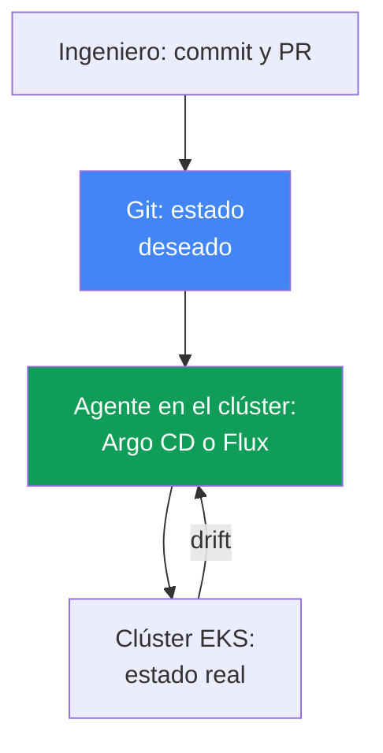
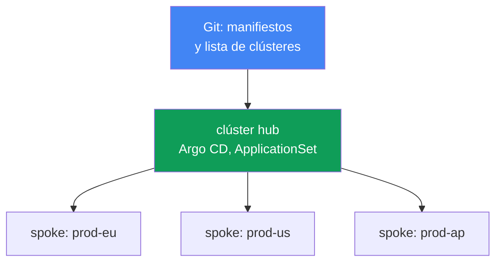
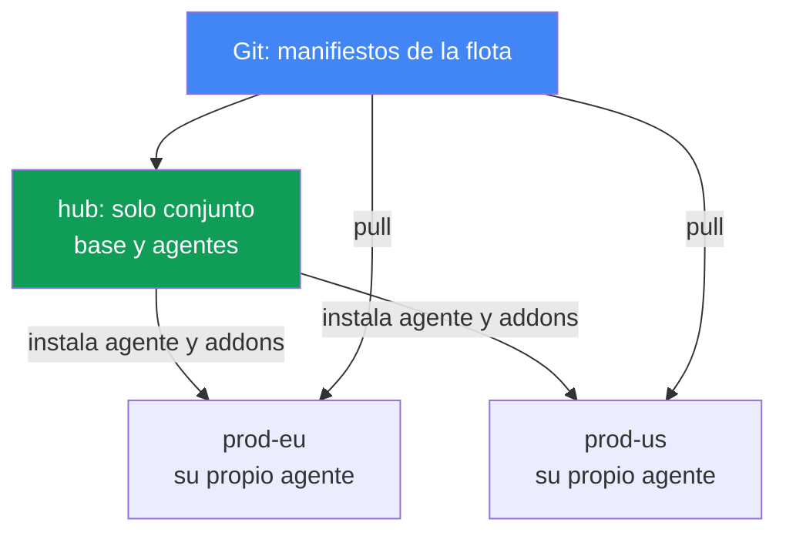

[Русская версия](ru.md) · [Eng version](en.md) · [Version française](fr.md) · [Deutsche Version](de.md) · [ქართული ვერსია](ge.md) · [繁體中文版](tw.md) · [日本語版](jp.md)
# Capítulo 44. GitOps y entrega: Argo CD y Flux, gestión de una flota de clústeres

> **Qué sigue.** Las partes 5-7 mencionaron muchas veces GitOps como forma de desplegar configuración: addons, controladores, políticas y observabilidad. Es hora de examinar el propio mecanismo. Los temas relacionados se tratan en otros capítulos: conectividad multiclúster y multicuenta, capítulo 32; migración blue/green de los propios clústeres, capítulo 38; secretos (`External Secrets`, `SecretStore`), capítulos 17-18; roles para acceso desde pods (IRSA, Pod Identity), capítulos 16-17. Aquí veremos cómo Git se convierte en la única fuente de verdad del clúster y cómo gestionar una flota de clústeres EKS con un solo repositorio.

## 44.1. El `kubectl apply` manual no escala

La aplicación vive en dos clústeres: `prod-eu` y `prod-us`. El lanzamiento se desplegaba manualmente, un `kubectl apply` por clúster. Seis meses después, la persona de guardia compara y descubre que `prod-eu` ejecuta `app:1.14`, mientras que `prod-us` ejecuta `app:1.11`: alguien completó Europa y olvidó Estados Unidos.

Después es peor. En `prod-us`, alguien editó una vez el Deployment en vivo:

```bash
# alguien ajustó manualmente las réplicas y los límites durante un incidente; Git no lo contiene
kubectl -n shop edit deployment checkout
```

Este cambio no está registrado en ningún sitio. En Git hay un manifiesto con `replicas: 3` y un conjunto de límites, mientras que el clúster tiene `replicas: 6` y otros límites. El estado del clúster divergió de lo descrito en el repositorio. Se llama deriva (drift) y nadie lo sabe hasta que ocurre un incidente o hasta que el siguiente `kubectl apply` revierte silenciosamente el cambio de producción.

Se acumulan tres fallos distintos:

- **No hay una fuente única de verdad.** Solo el propio clúster muestra qué está desplegado realmente, y cada clúster es diferente. Git y el clúster no están conectados por nada salvo la disciplina de la persona ingeniera.
- **La deriva no es visible.** Las ediciones manuales con `kubectl edit` se acumulan en silencio; se descubren por casualidad.
- **No hay auditoría ni reversión fácil.** Se desconoce quién cambió qué y cuándo en el clúster; para volver a un estado anterior que funcionaba hay que recordar cómo era.

Esto es tolerable con dos clústeres; con veinte (capítulo 32) es inmanejable. El resto del capítulo cubre los principios de GitOps que corrigen los tres fallos; los agentes Argo CD y Flux; la gestión de una flota de clústeres con un repositorio; y lo específico de EKS en este esquema.

## 44.2. Principios de GitOps

GitOps es un modelo operativo donde el estado deseado del sistema se describe declarativamente en Git, y un agente especial en el clúster mantiene continuamente el estado real conforme a esa descripción. Cuatro principios (formulados por OpenGitOps, un proyecto CNCF):

- **Declaratividad.** Todo el sistema se describe declarativamente: no «ejecuta estos pasos», sino «así debe ser». Son manifiestos Kubernetes convencionales, Kustomize o charts Helm.
- **Versionado e inmutabilidad.** El estado deseado se guarda en Git: cada cambio es un commit con autor, hora y revisión mediante pull request. De ahí provienen la auditoría y la reversión: volver al estado anterior es `git revert`.
- **Aplicación automatizada.** El agente obtiene y aplica por sí mismo los cambios aprobados, sin `kubectl apply` manual.
- **Reconciliación continua.** El agente compara constantemente Git y el clúster y elimina las diferencias. Es el núcleo del modelo: no un despliegue puntual, sino un ciclo infinito de comparación.

**Pull frente a push.** El CI/CD clásico trabaja en modelo push: un pipeline externo conserva las credenciales del clúster y ejecuta `kubectl apply`. Los permisos del clúster se exponen hacia fuera, y el pipeline solo sabe de su propia ejecución; ignora qué ocurrió con el clúster después. GitOps usa el modelo pull: el agente vive dentro del clúster, extrae de Git y aplica por sí mismo. Las credenciales del clúster no se entregan externamente, y la comparación es continua, no solo al iniciar el pipeline.

**Deriva y self-heal.** Como el agente compara Git continuamente con el clúster, interpreta un `kubectl edit` manual como una divergencia (drift) y, si está habilitado self-heal, revierte automáticamente el cambio al estado de Git. La deriva pasa de ser un problema silencioso a ser un estado visible o a corregirse sola: los cambios manuales en producción dejan de sobrevivir.



## 44.3. Argo CD

Argo CD es un agente GitOps, proyecto CNCF (graduated desde diciembre de 2022). Está centrado en aplicaciones: la unidad de gestión es el recurso `Application`, que enlaza una fuente en Git con un clúster y namespace de destino.

```yaml
apiVersion: argoproj.io/v1alpha1
kind: Application
metadata:
  name: checkout
  namespace: argocd
spec:
  project: default
  source:
    repoURL: https://git.example.com/shop.git
    targetRevision: main
    path: apps/checkout/overlays/prod
  destination:
    server: https://kubernetes.default.svc   # clúster de destino
    namespace: shop
  syncPolicy:
    automated:
      selfHeal: true    # revertir la deriva al estado de Git
      prune: true       # eliminar lo que se quitó de Git
```

Argo CD mantiene dos estados independientes para cada `Application`:

- **sync status**: si el clúster coincide con Git, `Synced` u `OutOfSync` (hay deriva).
- **health status**: si el propio recurso está saludable: `Healthy`, `Progressing`, `Degraded`, `Missing`. Un Deployment puede estar `Synced` (coincide con Git), pero `Degraded` (los pods fallan): son ejes distintos.

Mecanismos clave de sincronización:

- **auto-sync**: aplicar automáticamente cambios de Git, sin `argocd app sync` manual.
- **self-heal**: revertir cambios manuales del clúster al estado de Git.
- **prune**: eliminar del clúster los recursos quitados de Git (sin prune quedan huérfanos).
- **sync waves**: orden de aplicación. La sincronización se realiza en fases `PreSync`, `Sync`, `PostSync`, y dentro de ellas en olas mediante la anotación `argocd.argoproj.io/sync-wave`: primero los números menores. Así, los CRD se aplican antes de los recursos que los usan, y la migración de la base de datos antes de la aplicación.

**App-of-apps.** Un `Application` padre apunta a un directorio con manifiestos de `Application` hijas. Al desplegar el padre, se despliega todo el conjunto de aplicaciones, lo que resulta conveniente para el bootstrapping de un clúster desde cero. La **UI** de Argo CD muestra el árbol de recursos, el diff entre Git y el clúster, los estados y permite iniciar sync o una reversión manual.

**ApplicationSet** es un controlador que genera `Application` a partir de una plantilla y generadores. Para una flota de clústeres, el esencial es el **cluster generator**: Argo CD guarda los clústeres conectados como Secret en su namespace, y cluster generator crea un `Application` para cada clúster. Se añade un clúster y el conjunto de aplicaciones se despliega en él automáticamente (sección 44.6).

## 44.4. Flux

Flux es el segundo agente GitOps, también proyecto CNCF (graduated). A diferencia del Argo CD monolítico, es un conjunto de controladores especializados (GitOps Toolkit), cada uno con su tarea y sus CRD:

| Controlador | Responsable de | CRD principales |
|---|---|---|
| source-controller | fuentes: Git, repositorios Helm, OCI | `GitRepository`, `HelmRepository`, `OCIRepository` |
| kustomize-controller | aplicación de Kustomize/manifiestos | `Kustomization` |
| helm-controller | releases de charts Helm | `HelmRelease` |
| notification-controller | eventos y alertas entrantes/salientes | `Alert`, `Provider`, `Receiver` |
| image-reflector-controller | exploración de tags de imágenes en el registro | `ImageRepository`, `ImagePolicy` |
| image-automation-controller | commit de nuevos tags de vuelta en Git | `ImageUpdateAutomation` |

El modelo de Flux es «fuente, después reconciliación». Primero se declara de dónde extraer; después, qué y dónde aplicar:

```yaml
apiVersion: source.toolkit.fluxcd.io/v1
kind: GitRepository
metadata:
  name: shop
  namespace: flux-system
spec:
  interval: 1m           # frecuencia de sondeo del repositorio
  url: https://git.example.com/shop.git
  ref:
    branch: main
---
apiVersion: kustomize.toolkit.fluxcd.io/v1
kind: Kustomization
metadata:
  name: checkout
  namespace: flux-system
spec:
  interval: 10m          # frecuencia para comparar el clúster con la fuente
  sourceRef:
    kind: GitRepository
    name: shop
  path: ./apps/checkout/overlays/prod
  prune: true            # equivalente de prune en Argo CD
```

La reconciliación sigue el intervalo (`interval`): el controlador verifica periódicamente la fuente y adecua el clúster a ella. `HelmRelease` proporciona lo mismo para charts Helm de forma declarativa, sin ejecutar `helm install` manualmente.

**Image automation.** El par de controladores de imágenes implementa la actualización automática: reflector explora los tags del registro (para EKS, normalmente ECR, capítulo 20), `ImagePolicy` elige uno adecuado (por ejemplo, el semver más reciente), y automation-controller hace commit del nuevo tag de vuelta en Git. La reconciliación habitual lo despliega luego en el clúster. Git sigue siendo la fuente de verdad incluso para actualizaciones de versiones: el cambio de imagen es un commit, no un parche directo del Deployment.

## 44.5. Argo CD frente a Flux

Ambos son proyectos CNCF graduated maduros y aplican los mismos principios GitOps. La diferencia está en la arquitectura y los énfasis, no en cuál es «mejor»:

| | Argo CD | Flux |
|---|---|---|
| Arquitectura | agente monolítico, centrado en aplicaciones | conjunto de controladores (GitOps Toolkit) |
| UI | web UI completa incluida | sin UI (existen alternativas de terceros, CLI `flux`) |
| Unidad de gestión | `Application` / `ApplicationSet` | `Kustomization` / `HelmRelease` |
| Flota de clústeres | ApplicationSet + cluster generator | `Kustomization` por clúster, repositorio hub |
| Actualización automática de imágenes | mediante Argo Image Updater (aparte) | controladores de imágenes integrados |
| Entrega progresiva | Argo Rollouts | Flagger |
| Modelo | pull, reconciliación | pull, reconciliación por intervalo |

Una heurística aproximada: se elige Argo CD cuando importan una UI visual, el árbol de recursos y un modelo centrado en aplicaciones con ApplicationSet; Flux cuando encajan mejor la modularidad y la gestión mediante CRD en Git con image automation integrado. A cualquiera se le añade la infraestructura auxiliar: secretos y entrega.

## 44.6. Gestión de una flota de clústeres

Un modelo habitual para una flota de clústeres EKS (capítulo 32) es **hub y spoke**. Un clúster hub contiene Argo CD (o Flux) y gestiona muchos clústeres spoke: el agente del hub aplica manifiestos en cada clúster de destino. No es necesario instalar y actualizar el agente en cada clúster, y la identidad del agente y su acceso a Git se configuran en un solo lugar. Esta centralización tiene como coste un dominio de fallo y un límite de escalabilidad, que se examinan más abajo.



ApplicationSet con cluster generator convierte «desplegar el conjunto de aplicaciones en todos los clústeres» en una declaración: una plantilla `Application` más un generador que recorre los clústeres conectados. El conjunto común (addons, políticas, servicios base) llega de manera uniforme a toda la flota, mientras que las diferencias entre clústeres (región, tamaño, endpoint) se insertan como parámetros del generador en la plantilla.

**Git generator y matrix.** Cluster generator recorre los clústeres, mientras que el propio conjunto de addons se suele definir mediante la estructura del repositorio Git. Esto lo resuelve git generator en dos modos: directory generator crea un `Application` por cada subdirectorio (un directorio por addon), y file generator por cada archivo de configuración (por ejemplo, `addons/*.yaml` con parámetros). Se añade un directorio o archivo a Git y aparece un addon nuevo en la flota, sin editar ApplicationSet.

Para desplegar «un conjunto de addons en cada clúster», los generadores se combinan mediante matrix generator: multiplica dos generadores anidados (producto cartesiano), por ejemplo cluster (cada clúster) y git (cada addon), creando un `Application` para cada par. De este modo, el conjunto base de addons de infraestructura llega automáticamente a los clústeres nuevos, y la lista de addons permanece como estructura de directorios o archivos en Git.

**Bootstrapping de un clúster nuevo.** Cuando se crea un clúster (Terraform, capítulo 4) y se conecta al hub, app-of-apps o ApplicationSet despliega automáticamente todo el conjunto base en él. Esto es justo lo necesario en la migración blue/green de clústeres (capítulo 38): el nuevo clúster «verde» recibe la misma configuración del mismo Git, en vez de construirse manualmente, y por ello es idéntico al «azul».

### Coste de la centralización y elección de topología

El primer coste es el **dominio de fallo**. El hub es un punto único para toda la flota: las cargas ya ejecutándose en los clústeres spoke siguen funcionando, el agente no está en la ruta de datos, pero la aplicación de nuevos commits, la corrección de deriva (self-heal) y las reversiones se detienen para toda la flota: un incidente en el hub paraliza la entrega en todas partes. El segundo coste es la **reconciliación a través de la red**: el agente modifica y elimina recursos a través de la frontera entre clústeres, con latencia, cuellos de botella de red, coste de tráfico saliente (capítulo 31) y sensibilidad a una conectividad inestable (la documentación de Argo CD Agent de Red Hat enumera estos aspectos al compararlo con la arquitectura tradicional de Argo CD). Hay tres respuestas:

- **Fragmentar el hub.** Los clústeres se reparten entre réplicas de application-controller: se aumenta el número de réplicas y se duplica ese número en la variable `ARGOCD_CONTROLLER_REPLICAS`. El algoritmo de reparto puede ser hash-based (antiguo, distribuye de forma desigual) o round-robin (más uniforme); las versiones recientes tienen distribución dinámica, que recalcula el reparto cuando cambia el número de réplicas.
- **Descentralizar.** El hub despliega mediante ApplicationSet solo la base: addons de infraestructura y un agente local Argo CD o Flux; después, el agente consulta Git y extrae sus aplicaciones (modelo pull, sección 44.2). El clúster es autónomo: si el hub o su conexión falla, la reconciliación continúa. El coste es que hay tantos agentes como clústeres, deben actualizarse y configurarse, no existe una consola única para la flota y las versiones de los agentes divergen.
- **Invertir el flujo conservando un control plane.** El proyecto `argocd-agent` (de `argoproj-labs`, incubador y no núcleo de Argo CD) mantiene exactamente una instancia central de Argo CD, que ve los `Application` de todos los clústeres de trabajo, pero la sincronización la extrae un agente del lado spoke, en lugar de que el hub escriba en API remotas. Sigue siendo hub-and-spoke.

La elección depende del tamaño de la flota y del requisito de autonomía, no de qué sea «correcto»: el modelo hub es más sencillo de operar y ofrece una vista unificada; el descentralizado sobrevive a la pérdida del hub.



La **separación de responsabilidades** es un principio importante y fácil de infringir:

| Capa | Qué se gestiona | Herramienta |
|---|---|---|
| Infraestructura | VPC, clúster EKS, node groups, IAM | Terraform / Terragrunt (IaC) |
| Plataforma y aplicaciones | addons, controladores, políticas, cargas | GitOps (Argo CD / Flux) |

IaC crea el clúster y su «hardware», mientras que GitOps llena el clúster existente con addons y aplicaciones. Mezclarlos es perjudicial: recrear un clúster para modificar un Deployment es caro; llevar infraestructura mediante un agente que vive en ese mismo clúster plantea el problema del huevo y la gallina. La frontera separa «clúster como recurso AWS» de «lo que se ejecuta dentro del clúster».

## 44.7. Particularidades de EKS

Un agente GitOps es una carga ordinaria dentro del clúster y, en EKS, se le aplican las mismas reglas de identidad y acceso que a cualquier pod.

- **Autenticación del agente en AWS.** Para extraer imágenes de ECR (capítulo 20) o acceder a servicios AWS, se asigna al agente un rol mediante IRSA (capítulo 16) o EKS Pod Identity (capítulo 17), no claves estáticas: se asocia un ServiceAccount con un rol IAM de permisos mínimos.
- **Acceso al repositorio.** Git privado puede ser CodeCommit o self-hosted; para Git externo, al agente se le proporciona deploy-key o token, almacenado como Secret (y no se hace commit en Git, véase más abajo).
- **Gestión de addons EKS.** Los managed addons y addons Helm (capítulo 37) se describen cómodamente en Git y se despliegan con el mismo agente: las versiones y configuración de addons son parte del mismo conjunto.

**Los secretos no se hacen commit en Git.** Es la regla principal: Git es la fuente de verdad, pero no un almacén de secretos, ni siquiera un repositorio privado. El valor de un secreto en Git supone una filtración. Enfoques funcionales:

- **External Secrets Operator** (capítulo 18): en Git hay un `ExternalSecret` que referencia Secrets Manager o SSM Parameter Store; el operador extrae el valor y crea un Secret normal en el clúster. En Git solo está la referencia; el valor vive en Secrets Manager (capítulos 17-18).
- **Sealed Secrets**: se guarda en Git un `SealedSecret` cifrado, que solo puede descifrar el controlador del clúster con su propia clave. En el repositorio solo está el texto cifrado.

Así se conserva la declaratividad (Git contiene un objeto de secreto), pero el valor no llega allí.

### Capacidad administrada de EKS para Argo CD

La explicación anterior sobre IRSA y Pod Identity se aplica a un agente instalado por cuenta propia. Argo CD también existe como capacidad administrada de EKS (EKS Capabilities): AWS se encarga de la instalación, las actualizaciones y el escalado de controladores, y el software se ejecuta en el control plane de AWS, no en sus nodos. Consecuencia que la documentación declara explícitamente: las worker nodes no necesitan acceso directo a repositorios Git ni registros Helm; la propia capacidad lee las fuentes desde AWS. Los manifiestos `Application` y `ApplicationSet` funcionan como en upstream y no hace falta modificarlos.

- **Destinos de despliegue.** Solo clústeres EKS y exclusivamente por ARN de clúster, no por URL del API server. El clúster local no se registra automáticamente: para desplegar en el mismo clúster donde se creó la capacidad, también hay que registrarlo explícitamente por ARN. La capacidad no configura por sí misma la topología hub-and-spoke: usted define los clústeres de destino y access entries. Se crea en el clúster hub central y no se instala en los clústeres spoke: hub-and-spoke es una topología activa compatible, no un error de diseño.
- **Acceso a clústeres de destino.** Mediante EKS access entries (capítulo 5), por lo que no se necesita IRSA ni cross-account assume role para esta tarea. Se declara acceso transparente a clústeres EKS completamente privados sin VPC peering ni configuración de red especial (capítulo 2).
- **Autenticación y RBAC.** AWS Identity Center, con exactamente tres roles: admin, editor, viewer; el mapeo se define con el parámetro `rbacRoleMapping` de la capacidad, no mediante ConfigMap `argocd-rbac-cm`. Los recursos `Application`, `ApplicationSet`, `AppProject` deben estar en un mismo namespace establecido, mientras que las cargas se despliegan en cualquier namespace de cualquier clúster de destino.
- **Qué no existe.** Config Management Plugins, scripts Lua propios para comprobaciones health, controlador notifications, proveedores SSO propios aparte de Identity Center, extensiones de UI, acceso directo a `argocd-cm` y `argocd-params`, ni modificación del timeout de sincronización (fijo en 120 segundos).

## 44.8. Entrega progresiva

GitOps despliega lo que se describe en Git, pero no gobierna *cómo* una nueva versión de la aplicación sustituye a la anterior. El `RollingUpdate` estándar solo puede reemplazar pods gradualmente, sin dividir tráfico por porcentajes ni reversión automática según métricas. Esto lo cubre la entrega progresiva: **Argo Rollouts** (CRD `Rollout` en lugar de `Deployment`) con Argo CD y **Flagger** con Flux proporcionan despliegues canary y blue/green de *aplicaciones* con análisis de métricas y reversión automática. Trata de versiones de aplicación, no debe confundirse con blue/green de *clústeres* del capítulo 38; esta capa se sitúa sobre GitOps.

## 44.9. Cómo se aplica en producción

- **Convierta Git en la única fuente de verdad.** Se prohíbe `kubectl apply` directo en producción; todo cambio pasa por commit y pull request, y el agente lo aplica. Auditoría y reversión son gratuitas.
- **Habilite self-heal y prune de forma consciente.** Self-heal elimina los cambios manuales en producción; durante un incidente a veces se desactiva temporalmente. Prune elimina lo que quedó huérfano tras quitarlo de Git.
- **Separe IaC y GitOps.** Clúster, VPC y node groups son Terraform; addons y aplicaciones son GitOps. Mantenga la frontera estricta para no recrear un clúster por modificar un Deployment.
- **Gestione la flota mediante ApplicationSet.** El conjunto común de addons y políticas llega a todos los clústeres desde un repositorio; el clúster nuevo recibe configuración automáticamente durante el bootstrapping.
- **Mantenga secretos fuera de Git.** External Secrets Operator sobre Secrets Manager o Sealed Secrets; los valores en claro nunca entran al repositorio.
- **Dé al agente un rol, no claves.** El acceso a ECR y servicios AWS se proporciona mediante IRSA o Pod Identity.

## 44.10. Miniglosario

- **GitOps**: modelo donde el estado deseado se describe en Git y un agente lleva continuamente el clúster a él (los principios los formula OpenGitOps, proyecto CNCF).
- **reconciliación**: ciclo continuo de comparación entre lo deseado (Git) y lo real (clúster).
- **deriva (drift)**: divergencia entre el estado del clúster y Git, normalmente por `kubectl edit` manual.
- **self-heal**: reversión automática de la deriva al estado de Git.
- **modelo pull**: el agente dentro del clúster extrae por sí mismo de Git; push es un pipeline externo.
- **Application**: CRD de Argo CD: vínculo «fuente en Git + clúster y namespace de destino».
- **ApplicationSet**: controlador Argo CD que genera `Application` mediante plantilla; cluster generator crea uno por clúster conectado, git generator por directorios o archivos de Git, matrix generator multiplica dos generadores (cluster + git).
- **sync waves**: orden de aplicación de recursos en Argo CD por olas dentro de fases sync.
- **app-of-apps**: `Application` padre que despliega un conjunto de hijos.
- **GitOps Toolkit**: conjunto de controladores Flux (source, kustomize, helm, image y otros).
- **Kustomization / HelmRelease**: CRD Flux que indican qué y dónde aplicar desde la fuente.
- **image automation**: controladores Flux que hacen commit de nuevos tags de imagen de vuelta en Git.
- **entrega progresiva**: despliegue canary/blue-green de aplicaciones (Argo Rollouts, Flagger).
- **capacidad administrada de EKS para Argo CD**: Argo CD como EKS Capability: controladores en el control plane AWS, destinos solo clústeres EKS por ARN, y acceso mediante EKS access entries.
- **fragmentación de Argo CD**: reparto de clústeres conectados entre réplicas de application-controller.

## 44.11. Resumen del capítulo

- El `kubectl apply` manual en muchos clústeres produce tres problemas: no hay fuente única de verdad, la deriva de cambios manuales es invisible y no hay auditoría ni reversión fácil.
- GitOps lo corrige: el estado deseado se declara en Git y el agente reconcilia continuamente el estado real con él (modelo pull). Un cambio es un commit con review, una reversión es `git revert`, y self-heal hace inviables los cambios manuales en producción.
- Argo CD es un monolito centrado en aplicaciones con UI: CRD `Application` con estados sync y health, auto-sync, self-heal, prune, sync waves, app-of-apps y ApplicationSet con cluster generator.
- Flux es un conjunto de controladores (GitOps Toolkit): `GitRepository`, `Kustomization`, `HelmRelease`, reconciliación por intervalo e image automation que hace commit de tags en Git. Ambos son CNCF graduated.
- Flota de clústeres: un hub con agente gestiona clústeres spoke; ApplicationSet cluster generator despliega el conjunto común en todos; un clúster nuevo recibe configuración durante el bootstrapping.
- El dominio de fallo del modelo hub es toda la flota: se detienen la aplicación de commits, self-heal y las reversiones, pero no las cargas. Se mitiga fragmentando el controlador o descentralizando con un agente local en cada clúster.
- Argo CD también existe como capacidad administrada de EKS: el software está en el control plane AWS y no en nodos; los destinos son solo clústeres EKS por ARN, el acceso se hace mediante access entries y RBAC mediante Identity Center.
- Mantenga la frontera: Terraform gestiona infraestructura (VPC, clúster, node groups), GitOps gestiona addons y aplicaciones sobre ella; mezclarlos es costoso y arriesgado.
- En EKS se proporciona al agente un rol mediante IRSA o Pod Identity (acceso a ECR, CodeCommit), no claves; no se hacen commit de secretos en Git: use External Secrets Operator sobre Secrets Manager o Sealed Secrets.
- La entrega progresiva (Argo Rollouts, Flagger) aporta canary/blue-green de aplicaciones sobre GitOps; trata de versiones de aplicaciones, no blue/green de clústeres del capítulo 38.

## 44.12. Cómo resultará útil en el trabajo real

Durante la guardia, GitOps cambia la propia naturaleza del trabajo con clústeres. La pregunta «qué se desplegó realmente aquí» ya no exige investigar: la verdad está en Git, y el agente muestra cualquier divergencia con el estado `OutOfSync`. Una modificación manual durante un incidente deja de ser una mina silenciosa: self-heal la revierte inmediatamente o aparece como deriva, y usted decide conscientemente si hacerle commit o eliminarla. Volver a un estado anterior funcional es `git revert`, no tratar de recordar cómo era ayer.

Al planificar la plataforma, GitOps mantiene uniforme la flota: el conjunto común de addons y políticas se describe una vez y se despliega en todos los clústeres mediante ApplicationSet; tras crearse en Terraform (capítulo 4), el clúster nuevo se llena solo durante el bootstrapping, lo que simplifica la migración blue/green (capítulo 38). La disciplina importa más que la herramienta: frontera estricta entre IaC y GitOps, secretos fuera de Git, acceso del agente mediante rol. La elección entre Argo CD y Flux es secundaria; ambos son maduros. Lo fundamental es que Git sea el único punto por el que cambia el clúster.

## 44.13. Preguntas de autoevaluación

1. ¿Qué tres fallos del `kubectl apply` manual en muchos clústeres presenta el inicio del capítulo?
2. ¿Qué es la deriva y cómo cambia self-heal el destino de una edición manual `kubectl edit` en producción?
3. Formule los cuatro principios de GitOps. ¿Por qué la reversión se reduce a `git revert`?
4. ¿Cuál es la diferencia entre los modelos de entrega pull y push y por qué pull es más seguro para las credenciales del clúster?
5. ¿Qué describe el CRD `Application` de Argo CD y en qué se diferencia sync status de health status?
6. ¿Para qué sirven auto-sync, self-heal, prune y sync waves? ¿Dónde importa el orden de las olas?
7. ¿Qué son app-of-apps y ApplicationSet cluster generator, y cuándo es conveniente cada uno?
8. ¿De qué controladores y CRD consta Flux, y qué significa «fuente, después reconciliación»?
9. ¿Cómo funciona image automation en Flux y por qué la actualización de imagen sigue siendo un commit en Git?
10. Compare Argo CD y Flux: arquitectura, UI, unidad de gestión y flota de clústeres.
11. ¿Cómo se organiza la gestión de flota en el modelo hub y spoke y qué despliega cluster generator?
12. ¿Qué deja de funcionar en la flota cuando falla el clúster hub y qué continúa funcionando?
13. ¿Dónde está la frontera entre IaC (Terraform) y GitOps y por qué no se debe difuminar?
14. ¿Cómo obtiene un agente GitOps en EKS acceso a ECR y por qué no se hacen commit de secretos en Git?
15. ¿En qué se diferencia la capacidad administrada de EKS para Argo CD de una instalación propia, por ubicación del software y acceso a clústeres de destino?

## Práctica

La lab del curso para este tema: [lab 118: GitOps, Argo CD, deriva y self-heal](../../labs/118/README_ES.MD).
En ella instalará Argo CD, creará un Application para un directorio de Git, detectará deriva y self-heal, analizará sync waves, los límites de prune y la diferencia entre sync status y health status; se verifica con el comando `check_result`. Ejecución: `TASK=118 make run_eks_task`.

Además de la lab, tanto Argo CD como Flux se pueden ver en un clúster activo mediante sus CRD y CLI.
Empiece por saber qué aplicaciones conoce el agente y cuál es su estado.

Si el clúster tiene Argo CD:

```bash
# todas las Application y sus estados sync/health
kubectl get applications -n argocd
# lo mismo mediante la CLI de Argo CD
argocd app list
# detalles de una aplicación: fuente, árbol de recursos, deriva
argocd app get checkout
```

Observe las columnas sync (`Synced`/`OutOfSync`) y health (`Healthy`/`Degraded`):
`OutOfSync` con self-heal habilitado es motivo para ver quién editó qué manualmente.

Si el clúster tiene Flux:

```bash
# fuentes y su estado
kubectl get gitrepository -A
flux get sources git
# qué se reconcilia realmente y cuándo fue la última comparación
flux get kustomizations -A
kubectl get kustomization -A
```

Examine el campo `interval` de `GitRepository` y `Kustomization`: es el ritmo de reconciliación. Después compruebe la separación de capas: confirme que el clúster y los node groups se crean mediante Terraform, mientras los addons y las aplicaciones llegan desde Git mediante agentes, no se despliegan manualmente. Busque secretos como `ExternalSecret` o `SealedSecret`, no como `Secret` en claro en el repositorio.

---
[Índice](../README_ES.md) · [Capítulo 43](../43/es.md) · [Capítulo 45](../45/es.md)
