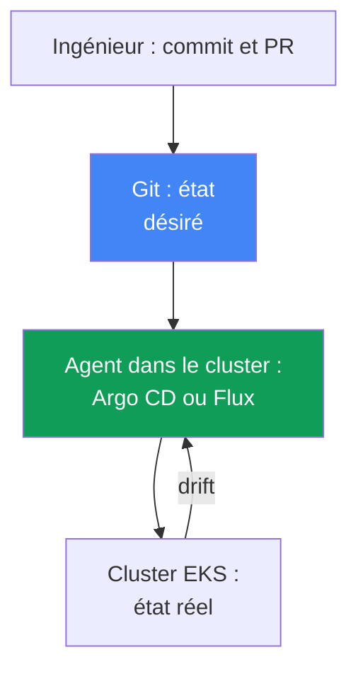
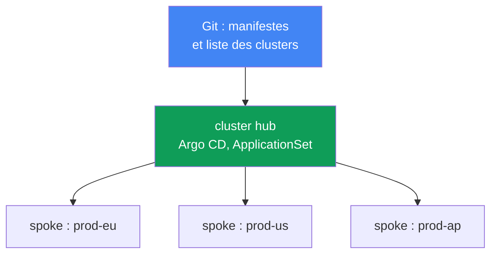
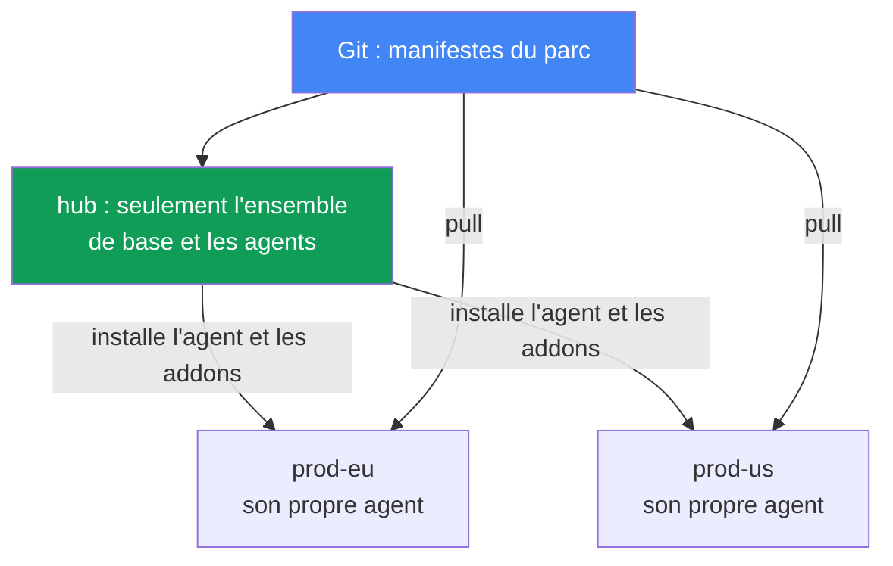

[Русская версия](ru.md) · [Eng version](en.md) · [Versión en español](es.md) · [Deutsche Version](de.md) · [ქართული ვერსია](ge.md) · [繁體中文版](tw.md) · [日本語版](jp.md)
# Chapitre 44. GitOps et livraison : Argo CD et Flux, gestion d'un parc de clusters

> **La suite.** Les parties 5 à 7 ont souvent évoqué GitOps comme méthode de déploiement de la configuration : addons, contrôleurs, politiques, observabilité. Il est temps d'examiner le mécanisme lui-même. Les sujets connexes sont traités dans d'autres chapitres : connectivité multicluster et multicompte au chapitre 32, migration blue/green des clusters eux-mêmes au chapitre 38, secrets (`External Secrets`, `SecretStore`) aux chapitres 17-18, rôles pour l'accès depuis les pods (IRSA, Pod Identity) aux chapitres 16-17. Ici, nous voyons comment Git devient l'unique source de vérité du cluster et comment gérer un parc de clusters EKS depuis un seul dépôt.

## 44.1. Le `kubectl apply` manuel ne passe pas à l'échelle

L'application fonctionne dans deux clusters : `prod-eu` et `prod-us`. La release était déployée à la main, un `kubectl apply` par cluster. Six mois plus tard, l'astreinte compare et découvre que `prod-eu` exécute `app:1.14`, tandis que `prod-us` exécute `app:1.11` : quelqu'un a terminé l'Europe et oublié les États-Unis.

Cela empire ensuite. Dans `prod-us`, quelqu'un a un jour modifié le Deployment en direct :

```bash
# quelqu’un a modifié manuellement les réplicas et les limites pendant un incident ; Git ne le contient pas
kubectl -n shop edit deployment checkout
```

Cette modification n'est enregistrée nulle part. Git contient un manifeste avec `replicas: 3` et un jeu de limites, tandis que le cluster a `replicas: 6` et d'autres limites. L'état du cluster a divergé de ce qui est décrit dans le dépôt. C'est ce qu'on appelle une dérive (drift), et personne ne le sait jusqu'à un incident ou jusqu'à ce que le prochain `kubectl apply` annule silencieusement la modification de production.

Trois échecs distincts apparaissent :

- **Pas d'unique source de vérité.** Ce qui est réellement déployé n'est visible que dans le cluster lui-même, et chaque cluster est différent. Git et le cluster ne sont liés que par la discipline de l'ingénieur.
- **La dérive est invisible.** Les modifications manuelles avec `kubectl edit` s'accumulent silencieusement ; on les découvre par hasard.
- **Pas d'audit ni de retour arrière facile.** On ignore qui a changé quoi et quand dans le cluster ; pour revenir à un état fonctionnel précédent, il faut se souvenir de ce qu'il était.

Sur deux clusters, c'est tolérable ; sur vingt (chapitre 32), c'est ingérable. La suite du chapitre présente les principes GitOps qui corrigent ces trois échecs ; les agents Argo CD et Flux ; la gestion d'un parc de clusters depuis un dépôt ; et les particularités de ce modèle pour EKS.

## 44.2. Principes GitOps

GitOps est un modèle opérationnel dans lequel l'état désiré du système est décrit déclarativement dans Git, et un agent spécial dans le cluster ramène continuellement l'état réel vers celui qui est décrit. Quatre principes (formulés par OpenGitOps, projet CNCF) :

- **Déclarativité.** Tout le système est décrit déclarativement : non pas « exécute ces étapes », mais « voici comment cela doit être ». Ce sont des manifestes Kubernetes ordinaires, Kustomize ou des charts Helm.
- **Versionnement et immutabilité.** L'état désiré est stocké dans Git : chaque changement est un commit avec un auteur, un horodatage et une revue via pull request. D'où l'audit et le retour arrière : revenir à l'état précédent est un `git revert`.
- **Application automatisée.** L'agent récupère et applique lui-même les changements approuvés, sans `kubectl apply` manuel.
- **Réconciliation continue.** L'agent compare constamment Git et le cluster et corrige les écarts. C'est le cœur du modèle : non pas un déploiement ponctuel, mais un cycle de comparaison infini.

**Pull contre push.** Le CI/CD classique fonctionne selon un modèle push : un pipeline externe détient les identifiants du cluster et exécute `kubectl apply`. Les autorisations du cluster sont exposées vers l'extérieur, et le pipeline ne connaît que sa propre exécution : il ignore ce qui est arrivé au cluster ensuite. GitOps fonctionne selon un modèle pull : l'agent vit dans le cluster, récupère lui-même depuis Git et applique lui-même. Les identifiants du cluster ne sont pas exposés à l'extérieur, et la comparaison est continue, non limitée au moment de l'exécution du pipeline.

**Dérive et self-heal.** Comme l'agent compare constamment Git au cluster, il voit une modification manuelle avec `kubectl edit` comme un écart (drift) et, si le self-heal est activé, ramène automatiquement la modification à l'état de Git. La dérive, de problème silencieux, devient soit un statut visible, soit s'auto-corrige ; les modifications manuelles en production cessent de survivre.



## 44.3. Argo CD

Argo CD est un agent GitOps, projet CNCF (graduated depuis décembre 2022). Il est centré sur les applications : l'unité de gestion est la ressource `Application`, qui relie une source Git à un cluster et un namespace cibles.

```yaml
apiVersion: argoproj.io/v1alpha1
kind: Application
metadata:
  name: checkout
  namespace: argocd
spec:
  project: default
  source:
    repoURL: https://git.example.com/shop.git
    targetRevision: main
    path: apps/checkout/overlays/prod
  destination:
    server: https://kubernetes.default.svc   # cluster cible
    namespace: shop
  syncPolicy:
    automated:
      selfHeal: true    # ramener la dérive à l’état Git
      prune: true       # supprimer ce qui a été retiré de Git
```

Argo CD maintient deux statuts indépendants pour chaque `Application` :

- **sync status** : le cluster correspond-il à Git : `Synced` ou `OutOfSync` (il y a une dérive).
- **health status** : la ressource elle-même est-elle saine : `Healthy`, `Progressing`, `Degraded`, `Missing`. Un Deployment peut être `Synced` (il correspond à Git), mais `Degraded` (les pods échouent) : ce sont deux axes différents.

Mécanismes de synchronisation principaux :

- **auto-sync** : appliquer automatiquement les changements de Git, sans `argocd app sync` manuel.
- **self-heal** : annuler les modifications manuelles dans le cluster pour revenir à l'état Git.
- **prune** : supprimer du cluster les ressources retirées de Git (sans prune, elles deviennent orphelines).
- **sync waves** : ordre d'application. La synchronisation procède par phases `PreSync`, `Sync`, `PostSync`, puis par vagues selon l'annotation `argocd.argoproj.io/sync-wave` : les plus petits numéros d'abord. Les CRD sont ainsi appliquées avant les ressources qui les utilisent, et la migration de base de données avant l'application.

**App-of-apps.** Une `Application` parente pointe vers un répertoire contenant les manifestes des `Application` enfants. En déployant le parent, vous déployez tout l'ensemble d'applications ; c'est pratique pour le bootstrapping d'un cluster depuis zéro. L'**UI** d'Argo CD affiche l'arbre des ressources, le diff entre Git et le cluster, les statuts, et permet de lancer manuellement une synchronisation ou un retour arrière.

**ApplicationSet** est un contrôleur qui génère des `Application` depuis un modèle à l'aide de générateurs. Pour un parc de clusters, le plus important est le **cluster generator** : Argo CD stocke les clusters connectés sous forme de Secret dans son namespace, et le cluster generator crée une `Application` pour chaque cluster. Ajoutez un cluster, et le jeu d'applications y est automatiquement déployé (section 44.6).

## 44.4. Flux

Flux est le deuxième agent GitOps, également un projet CNCF (graduated). Contrairement à Argo CD, monolithique, c'est un ensemble de contrôleurs spécialisés (GitOps Toolkit), chacun avec sa tâche et ses CRD :

| Contrôleur | Responsable de | CRD principales |
|---|---|---|
| source-controller | sources : Git, dépôts Helm, OCI | `GitRepository`, `HelmRepository`, `OCIRepository` |
| kustomize-controller | application de Kustomize/manifestes | `Kustomization` |
| helm-controller | releases de charts Helm | `HelmRelease` |
| notification-controller | événements entrants/sortants, alertes | `Alert`, `Provider`, `Receiver` |
| image-reflector-controller | analyse des tags d'images dans le registre | `ImageRepository`, `ImagePolicy` |
| image-automation-controller | commit des nouveaux tags dans Git | `ImageUpdateAutomation` |

Le modèle Flux est « source, puis réconciliation ». On déclare d'abord d'où récupérer, puis quoi appliquer et où :

```yaml
apiVersion: source.toolkit.fluxcd.io/v1
kind: GitRepository
metadata:
  name: shop
  namespace: flux-system
spec:
  interval: 1m           # fréquence d’interrogation du dépôt
  url: https://git.example.com/shop.git
  ref:
    branch: main
---
apiVersion: kustomize.toolkit.fluxcd.io/v1
kind: Kustomization
metadata:
  name: checkout
  namespace: flux-system
spec:
  interval: 10m          # fréquence de comparaison entre le cluster et la source
  sourceRef:
    kind: GitRepository
    name: shop
  path: ./apps/checkout/overlays/prod
  prune: true            # équivalent de prune dans Argo CD
```

La réconciliation suit l'intervalle (`interval`) : le contrôleur vérifie périodiquement la source et aligne le cluster sur elle. `HelmRelease` offre la même chose pour les charts Helm de manière déclarative, sans `helm install` manuel.

**Image automation.** La paire de contrôleurs d'images réalise la mise à jour automatique des images : reflector analyse les tags du registre (pour EKS, généralement ECR, chapitre 20), `ImagePolicy` sélectionne celui qui convient (par exemple le semver le plus récent), et automation-controller commit le nouveau tag dans Git. La réconciliation ordinaire le déploie ensuite dans le cluster. Git reste la source de vérité même pour les mises à jour de versions : un changement d'image est un commit, non un patch direct du Deployment.

## 44.5. Argo CD contre Flux

Les deux sont des projets CNCF graduated matures et mettent en œuvre les mêmes principes GitOps. La différence est dans leur conception et leurs priorités, non dans ce qui serait « meilleur » :

| | Argo CD | Flux |
|---|---|---|
| Conception | agent monolithique, centré application | ensemble de contrôleurs (GitOps Toolkit) |
| UI | web-UI riche prête à l'emploi | pas d'UI (solutions tierces, CLI `flux`) |
| Unité de gestion | `Application` / `ApplicationSet` | `Kustomization` / `HelmRelease` |
| Parc de clusters | ApplicationSet + cluster generator | `Kustomization` par cluster, dépôt hub |
| Mise à jour automatique des images | via Argo Image Updater (séparé) | contrôleurs d'images intégrés |
| Livraison progressive | Argo Rollouts | Flagger |
| Modèle | pull, réconciliation | pull, réconciliation par intervalle |

Heuristique de choix approximative : Argo CD convient lorsque l'UI visuelle, l'arbre des ressources et le modèle centré sur les applications avec ApplicationSet sont importants ; Flux lorsque la modularité, la gestion via les CRD dans Git et l'image automation intégrée correspondent mieux. On ajoute les composants autour (secrets, livraison) à l'un ou l'autre.

## 44.6. Gestion d'un parc de clusters

Un modèle courant pour un parc de clusters EKS (chapitre 32) est le **hub and spoke**. Un cluster hub héberge Argo CD (ou Flux) et gère de nombreux clusters spoke : l'agent du hub applique les manifestes dans chaque cluster cible. Il n'est pas nécessaire d'installer et de mettre à jour l'agent dans chaque cluster, et l'identité de l'agent et son accès à Git sont configurés à un seul endroit. Cette centralisation se paie par un domaine de défaillance et une limite de mise à l'échelle, examinés ci-dessous.



Un ApplicationSet avec cluster generator transforme « déployer un ensemble d'applications sur tous les clusters » en une seule déclaration : un modèle `Application` plus un générateur qui parcourt les clusters connectés. L'ensemble commun (addons, politiques, services de base) est déployé uniformément dans tout le parc, tandis que les différences entre clusters (région, taille, endpoint) sont injectées dans le modèle par les paramètres du générateur.

**Git generator et matrix.** Le cluster generator parcourt les clusters, alors que l'ensemble d'addons est souvent défini par la structure du dépôt Git. Le git generator couvre cela en deux modes : le directory generator crée une `Application` pour chaque sous-répertoire (un répertoire par addon), tandis que le file generator le fait pour chaque fichier de configuration (par exemple `addons/*.yaml` avec des paramètres). Ajoutez un répertoire ou un fichier dans Git, et un nouvel addon apparaît dans le parc sans avoir à modifier ApplicationSet.

Pour déployer « un ensemble d'addons sur chaque cluster », les générateurs sont combinés via le matrix generator : il multiplie deux générateurs imbriqués (produit cartésien), par exemple cluster (chaque cluster) et git (chaque addon), produisant une `Application` pour chaque paire. Ainsi, l'ensemble d'addons d'infrastructure de base est déployé automatiquement sur les nouveaux clusters, et la liste des addons reste une structure de répertoires ou de fichiers dans Git.

**Bootstrapping d'un nouveau cluster.** Lorsqu'un cluster est créé (Terraform, chapitre 4) et connecté au hub, app-of-apps ou ApplicationSet y déploie automatiquement tout l'ensemble de base. C'est exactement ce qui est nécessaire lors d'une migration blue/green de clusters (chapitre 38) : le nouveau cluster « vert » reçoit la même configuration depuis le même Git, au lieu d'être assemblé manuellement, et est donc identique au « bleu ».

### Prix de la centralisation et choix de topologie

Le premier prix est le **domaine de défaillance**. Le hub est un point unique pour tout le parc : les charges en cours d'exécution dans les clusters spoke continuent de fonctionner, l'agent n'est pas dans le chemin de données, mais l'application des nouveaux commits, la correction de dérive (self-heal) et les retours arrière s'arrêtent immédiatement dans tout le parc ; un incident sur le hub fige la livraison partout. Le second prix est la **réconciliation à travers le réseau** : l'agent modifie et supprime des ressources à travers la frontière des clusters, d'où la latence, les goulots d'étranglement réseau, les frais de trafic sortant (chapitre 31) et la sensibilité à une connectivité instable (la documentation Argo CD Agent de Red Hat énumère ces éléments en comparaison avec l'architecture Argo CD traditionnelle). Il existe trois réponses :

- **Shard le hub.** Les clusters sont répartis entre les répliques de application-controller : on augmente le nombre de répliques et on duplique ce même nombre dans la variable `ARGOCD_CONTROLLER_REPLICAS`. L'algorithme de distribution peut être hash-based (ancien, distribution inégale) ou round-robin (plus uniforme), et les versions récentes disposent d'une distribution dynamique qui recalcule la répartition au changement de nombre de répliques.
- **Décentraliser.** Via ApplicationSet, le hub ne déploie que la base : addons d'infrastructure et un agent local Argo CD ou Flux ; l'agent consulte ensuite lui-même Git et récupère ses applications (modèle pull, section 44.2). Le cluster est autonome : si le hub ou sa connexion tombe, la réconciliation continue. Prix à payer : il y a autant d'agents que de clusters, il faut les mettre à jour et les configurer, il n'y a pas de panneau unique pour le parc, et les versions des agents divergent.
- **Inverser le flux en gardant un seul control plane.** Le projet `argocd-agent` (c'est `argoproj-labs`, incubateur, non le cœur d'Argo CD) conserve une unique instance centrale Argo CD qui voit les `Application` de tous les clusters de travail, mais la synchronisation est récupérée par un agent côté spoke, au lieu que le hub écrive dans des API distantes. Cela reste du hub-and-spoke.

Le choix dépend de la taille du parc et de l'exigence d'autonomie, non de ce qui serait « correct » : le modèle hub est plus simple à exploiter et fournit une vue unique, le modèle décentralisé survit à la perte du hub.



La **séparation des responsabilités** est un principe important, facile à enfreindre :

| Couche | Ce qui est géré | Outil |
|---|---|---|
| Infrastructure | VPC, cluster EKS, node groups, IAM | Terraform / Terragrunt (IaC) |
| Plateforme et applications | addons, contrôleurs, politiques, charges | GitOps (Argo CD / Flux) |

L'IaC crée le cluster et son « matériel », GitOps remplit un cluster existant avec des addons et des applications. Les mélanger est nuisible : recréer un cluster pour modifier un Deployment est coûteux ; et faire passer l'infrastructure par un agent qui vit lui-même dans ce cluster pose le problème de la poule et de l'œuf. La frontière oppose « le cluster comme ressource AWS » à « ce qui s'exécute à l'intérieur du cluster ».

## 44.7. Particularités d'EKS

Un agent GitOps est une charge ordinaire dans le cluster et, sur EKS, les mêmes règles d'identité et d'accès s'appliquent à lui qu'à tout pod.

- **Authentification de l'agent auprès d'AWS.** Pour récupérer des images depuis ECR (chapitre 20) ou appeler des services AWS, on donne à l'agent un rôle via IRSA (chapitre 16) ou EKS Pod Identity (chapitre 17), et non des clés statiques : on associe le ServiceAccount à un rôle IAM aux droits minimaux.
- **Accès au dépôt.** Git privé peut être CodeCommit ou self-hosted ; pour Git externe, on fournit à l'agent une deploy-key ou un token stocké comme Secret (et non commité dans Git, voir ci-dessous).
- **Gestion des addons EKS.** Les managed addons et addons Helm (chapitre 37) sont commodément décrits dans Git et déployés par le même agent : les versions et la configuration des addons font partie du même ensemble.

**Les secrets ne sont pas commités dans Git.** C'est la règle principale : Git est une source de vérité, mais pas un stockage de secrets, même dans un dépôt privé. La valeur d'un secret dans Git est une fuite. Approches utilisables :

- **External Secrets Operator** (chapitre 18) : Git contient un `ExternalSecret` qui référence Secrets Manager ou SSM Parameter Store ; l'opérateur récupère la valeur et crée un Secret ordinaire dans le cluster. Git ne contient que la référence ; la valeur vit dans Secrets Manager (chapitres 17-18).
- **Sealed Secrets** : un `SealedSecret` chiffré est placé dans Git et seul le contrôleur du cluster peut le déchiffrer avec sa clé. Le dépôt ne contient que le texte chiffré.

La déclarativité est ainsi préservée (Git contient l'objet secret), sans y placer sa valeur.

### Capacité EKS managée pour Argo CD

L'analyse d'IRSA et Pod Identity ci-dessus concerne un agent installé par vous-même. Argo CD existe aussi comme capacité EKS managée (EKS Capabilities) : AWS prend en charge l'installation, les mises à jour et le dimensionnement des contrôleurs, et le logiciel s'exécute dans le control plane AWS, non sur vos nœuds. Conséquence explicitement citée dans la documentation : les nœuds workers n'ont pas besoin d'un accès direct aux dépôts Git et aux registres Helm ; la capacité elle-même lit les sources côté AWS. Les manifestes `Application` et `ApplicationSet` fonctionnent comme dans l'upstream, sans devoir être modifiés.

- **Cibles de déploiement.** Uniquement des clusters EKS et uniquement via l'ARN du cluster, non l'URL du serveur API. Le cluster local n'est pas enregistré automatiquement : pour déployer dans le même cluster où la capacité a été créée, il faut aussi l'enregistrer explicitement par ARN. La capacité ne configure pas elle-même la topologie hub-and-spoke : vous définissez les clusters cibles et les access entries. Elle est créée sur le cluster hub central et n'est pas installée sur les clusters spoke : hub-and-spoke est une topologie active prise en charge, non une erreur de conception.
- **Accès aux clusters cibles.** Via EKS access entries (chapitre 5), donc ni IRSA ni cross-account assume role ne sont nécessaires pour cette tâche. Un accès transparent aux clusters EKS entièrement privés est annoncé, sans VPC peering ni configuration réseau particulière (chapitre 2).
- **Authentification et RBAC.** AWS Identity Center, avec exactement trois rôles : admin, editor, viewer ; le mappage est défini par le paramètre `rbacRoleMapping` de la capacité, et non via ConfigMap `argocd-rbac-cm`. Les ressources `Application`, `ApplicationSet`, `AppProject` doivent se trouver dans un même namespace défini, tandis que les charges sont déployées dans tout namespace de tout cluster cible.
- **Ce qui manque.** Config Management Plugins, scripts Lua personnalisés pour les contrôles de santé, contrôleur notifications, fournisseurs SSO personnalisés autres qu'Identity Center, extensions UI, accès direct à `argocd-cm` et `argocd-params`, modification du délai de synchronisation (fixe, 120 secondes).

## 44.8. Livraison progressive

GitOps déploie ce qui est décrit dans Git, mais ne gère pas *comment* une nouvelle version d'application remplace l'ancienne. Le `RollingUpdate` standard ne sait que remplacer progressivement les pods, sans répartition du trafic en pourcentages ni retour arrière automatique selon les métriques. C'est ce que couvre la livraison progressive : **Argo Rollouts** (CRD `Rollout` au lieu de `Deployment`) avec Argo CD et **Flagger** avec Flux offrent des déploiements canary et blue/green d'*applications* avec analyse des métriques et retour arrière automatique. Cela concerne les versions d'applications, à ne pas confondre avec le blue/green de *clusters* du chapitre 38 ; cette couche se place au-dessus de GitOps.

## 44.9. Utilisation en production

- **Faire de Git l'unique source de vérité.** Le `kubectl apply` direct en production est interdit ; tout changement passe par un commit et une pull request, puis l'agent l'applique. Audit et retour arrière sont gratuits.
- **Activer self-heal et prune consciemment.** Le self-heal élimine les modifications manuelles en production ; pendant un incident, il est parfois désactivé temporairement. Prune retire ce qui est devenu orphelin après une suppression de Git.
- **Séparer IaC et GitOps.** Cluster, VPC et node groups sont gérés par Terraform ; addons et applications par GitOps. La frontière est rigoureusement respectée pour ne pas recréer un cluster afin de modifier un Deployment.
- **Gérer le parc avec ApplicationSet.** L'ensemble commun d'addons et de politiques est déployé sur tous les clusters depuis un dépôt ; un nouveau cluster reçoit automatiquement sa configuration lors du bootstrapping.
- **Conserver les secrets hors de Git.** External Secrets Operator au-dessus de Secrets Manager ou Sealed Secrets ; les valeurs en clair ne vont jamais dans le dépôt.
- **Donner à l'agent un rôle, non des clés.** L'accès à ECR et aux services AWS passe par IRSA ou Pod Identity.

## 44.10. Mini-glossaire

- **GitOps** : modèle où l'état désiré est décrit dans Git et où un agent aligne continuellement le cluster sur cet état (les principes sont formulés par OpenGitOps, projet CNCF).
- **réconciliation** : cycle continu de comparaison entre l'état désiré (Git) et l'état réel (cluster).
- **dérive (drift)** : écart entre l'état du cluster et Git, habituellement issu d'un `kubectl edit` manuel.
- **self-heal** : retour arrière automatique de la dérive vers l'état Git.
- **modèle pull** : l'agent dans le cluster récupère lui-même depuis Git ; push est un pipeline externe.
- **Application** : CRD Argo CD : association « source dans Git + cluster et namespace cibles ».
- **ApplicationSet** : contrôleur Argo CD qui génère des `Application` depuis un modèle ; cluster generator en crée une pour chaque cluster connecté, git generator selon les répertoires ou fichiers Git, matrix generator multiplie deux générateurs (cluster + git).
- **sync waves** : ordre d'application des ressources dans Argo CD, par vagues au sein des phases de synchronisation.
- **app-of-apps** : `Application` parente qui déploie un ensemble d'enfants.
- **GitOps Toolkit** : ensemble de contrôleurs Flux (source, kustomize, helm, image et autres).
- **Kustomization / HelmRelease** : CRD Flux : quoi appliquer depuis une source et où.
- **image automation** : contrôleurs Flux qui commitent de nouveaux tags d'images dans Git.
- **livraison progressive** : déploiement canary/blue-green d'applications (Argo Rollouts, Flagger).
- **capacité EKS managée pour Argo CD** : Argo CD comme EKS Capability : contrôleurs dans le control plane AWS, cibles limitées aux clusters EKS par ARN, accès à ceux-ci via EKS access entries.
- **sharding Argo CD** : distribution des clusters connectés entre les répliques de application-controller.

## 44.11. Résumé du chapitre

- Le `kubectl apply` manuel sur de nombreux clusters conduit à trois problèmes : pas d'unique source de vérité, dérive invisible due aux modifications manuelles, pas d'audit ni de retour arrière facile.
- GitOps corrige cela : l'état désiré est déclaratif dans Git, et l'agent réconcilie continuellement l'état réel avec lui (modèle pull). Un changement est un commit avec review, un retour arrière est `git revert`, et le self-heal rend les modifications manuelles en production non pérennes.
- Argo CD est un monolithe centré application avec UI : CRD `Application` avec statuts sync et health, auto-sync, self-heal, prune, sync waves, app-of-apps, ApplicationSet avec cluster generator.
- Flux est un ensemble de contrôleurs (GitOps Toolkit) : `GitRepository`, `Kustomization`, `HelmRelease`, réconciliation par intervalle et image automation avec commit des tags dans Git. Les deux sont CNCF graduated.
- Parc de clusters : un hub avec un agent gère des clusters spoke ; ApplicationSet cluster generator déploie l'ensemble commun sur tous ; un nouveau cluster reçoit sa configuration lors du bootstrapping.
- Le domaine de défaillance du modèle hub est tout le parc : application des commits, self-heal et retours arrière s'arrêtent, mais pas les charges elles-mêmes. On y remédie par sharding du contrôleur ou décentralisation avec un agent local sur chaque cluster.
- Argo CD existe aussi comme capacité EKS managée : logiciel dans le control plane AWS, non sur les nœuds ; cibles de déploiement limitées aux clusters EKS par ARN, accès par access entries, RBAC par Identity Center.
- La frontière est claire : Terraform gère l'infrastructure (VPC, cluster, node groups), GitOps les addons et applications au-dessus ; les mélanger est coûteux et risqué.
- Sur EKS, on donne à l'agent un rôle via IRSA ou Pod Identity (accès à ECR, CodeCommit), non des clés ; les secrets ne sont pas commités dans Git, avec External Secrets Operator au-dessus de Secrets Manager ou Sealed Secrets.
- La livraison progressive (Argo Rollouts, Flagger) apporte le canary/blue-green des applications au-dessus de GitOps ; elle concerne les versions d'applications, non le blue/green des clusters du chapitre 38.

## 44.12. Utilité dans le travail réel

En astreinte, GitOps change le caractère même du travail avec le cluster. La question « qu'est-ce qui est réellement déployé ici » ne nécessite plus de fouilles : la vérité est dans Git et l'agent affiche tout écart avec le statut `OutOfSync`. Une modification manuelle pendant un incident cesse d'être une mine silencieuse : soit le self-heal l'annule immédiatement, soit elle est visible comme dérive, et vous décidez consciemment de la commiter ou de la supprimer. Le retour à un état fonctionnel précédent est un `git revert`, non une tentative de se rappeler comment c'était hier.

Lors de la planification de la plateforme, GitOps maintient un parc de clusters homogène : l'ensemble commun d'addons et de politiques est décrit une fois et déployé sur tous les clusters via ApplicationSet, tandis qu'un nouveau cluster, après sa création avec Terraform (chapitre 4), se remplit lui-même lors du bootstrapping, ce qui simplifie la migration blue/green (chapitre 38). La discipline importe plus que l'outil : frontière stricte entre IaC et GitOps, secrets hors de Git, accès de l'agent par rôle. Le choix entre Argo CD et Flux est secondaire : les deux sont matures ; l'essentiel est que Git soit devenu le point unique par lequel le cluster est modifié.

## 44.13. Questions d'auto-évaluation

1. Quels sont les trois échecs du `kubectl apply` manuel sur de nombreux clusters examinés au début du chapitre ?
2. Qu'est-ce que la dérive, et comment le self-heal change-t-il le destin d'une modification manuelle avec `kubectl edit` en production ?
3. Formulez les quatre principes GitOps. Pourquoi le retour arrière se réduit-il à `git revert` ?
4. Quelle est la différence entre les modèles pull et push de livraison, et pourquoi pull est-il plus sûr pour les identifiants du cluster ?
5. Que décrit le CRD `Application` dans Argo CD et en quoi sync status diffère-t-il de health status ?
6. À quoi servent auto-sync, self-heal, prune et sync waves ? Où l'ordre des vagues est-il important ?
7. Que sont app-of-apps et ApplicationSet cluster generator, et quand chacun est-il pratique ?
8. De quels contrôleurs et CRD Flux est-il composé, et que signifie « source, puis réconciliation » ?
9. Comment fonctionne image automation dans Flux et pourquoi la mise à jour d'image reste-t-elle un commit dans Git ?
10. Comparez Argo CD et Flux : conception, UI, unité de gestion, parc de clusters.
11. Comment est organisée la gestion du parc selon le modèle hub and spoke, et que déploie cluster generator ?
12. Qu'est-ce qui cesse de fonctionner dans le parc en cas de défaillance du cluster hub, et qu'est-ce qui continue de fonctionner ?
13. Où se situe la frontière entre IaC (Terraform) et GitOps, et pourquoi ne faut-il pas la brouiller ?
14. Comment un agent GitOps sur EKS accède-t-il à ECR, et pourquoi les secrets ne sont-ils pas commités dans Git ?
15. En quoi la capacité EKS managée pour Argo CD diffère-t-elle d'une installation autonome par son lieu d'exécution et sa méthode d'accès aux clusters cibles ?

## Pratique

Laboratoire du cours sur ce sujet : [laboratoire 118 : GitOps, Argo CD, dérive et self-heal](../../labs/118/README_FR.MD).
Vous y installez Argo CD, créez une Application vers un répertoire dans Git, observez la dérive et le self-heal, examinez les sync waves, les limites de prune et la différence entre sync status et health status ; la vérification s'exécute avec la commande `check_result`. Démarrage : `TASK=118 make run_eks_task`.

En plus du laboratoire, Argo CD et Flux peuvent être observés sur un cluster en fonctionnement via leurs CRD et CLI.
Commencez par voir quelles applications l'agent connaît et quels sont leurs statuts.

Si Argo CD est installé dans le cluster :

```bash
# toutes les Application et leurs statuts sync/health
kubectl get applications -n argocd
# même résultat via la CLI Argo CD
argocd app list
# détail d’une application : source, arbre des ressources, dérive
argocd app get checkout
```

Regardez les colonnes sync (`Synced`/`OutOfSync`) et health (`Healthy`/`Degraded`) : `OutOfSync` avec self-heal activé est une raison d'examiner qui a modifié quoi manuellement.

Si Flux est installé dans le cluster :

```bash
# sources et leur état
kubectl get gitrepository -A
flux get sources git
# éléments réellement réconciliés et date de la dernière comparaison
flux get kustomizations -A
kubectl get kustomization -A
```

Examinez le champ `interval` dans `GitRepository` et `Kustomization` : c'est le rythme de réconciliation. Vérifiez ensuite la séparation des couches : assurez-vous que le cluster et les node groups sont créés via Terraform, et que les addons et applications arrivent de Git via l'agent, plutôt que d'être déployés à la main. Cherchez les secrets sous forme de `ExternalSecret` ou `SealedSecret`, non comme `Secret` en clair dans le dépôt.

---
[Table des matières](../README_FR.md) · [Chapitre 43](../43/fr.md) · [Chapitre 45](../45/fr.md)
