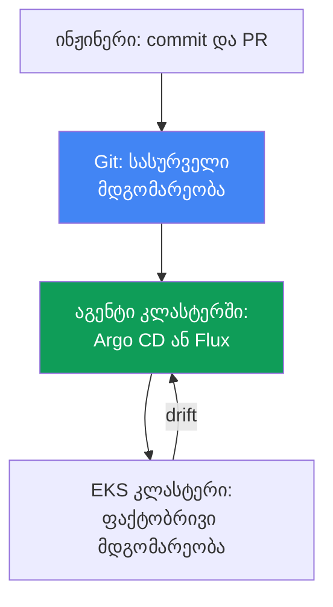
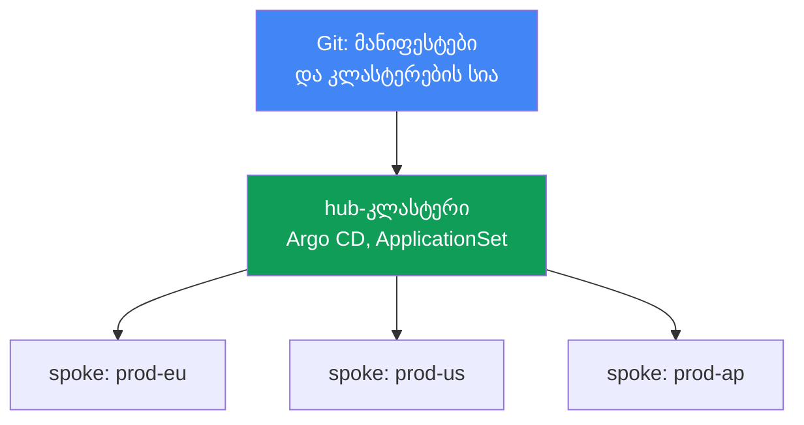
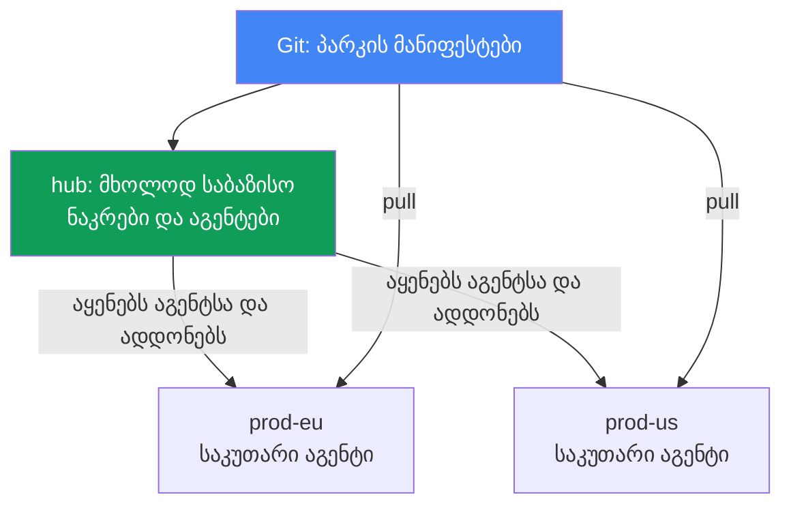

[Русская версия](ru.md) · [Eng version](en.md) · [Versión en español](es.md) · [Version française](fr.md) · [Deutsche Version](de.md) · [繁體中文版](tw.md) · [日本語版](jp.md)
# თავი 44. GitOps და მიწოდება: Argo CD და Flux, კლასტერების პარკის მართვა

> **რა არის შემდეგ.** ნაწილებში 5-7 GitOps არაერთხელ ვახსენეთ, როგორც კონფიგურაციის გაშლის გზა:
> ადდონები, კონტროლერები, პოლიტიკები, observability. დროა თავად მექანიზმი განვიხილოთ. მომიჯნავე თემები
> სხვა თავებშია: მულტიკლასტერული და მულტიაკაუნტური კავშირი - თავი 32, თავად კლასტერების blue/green
> მიგრაცია - თავი 38, საიდუმლოებები (External Secrets, SecretStore) - თავები 17-18, პოდებიდან
> წვდომის როლები (IRSA, Pod Identity) - თავები 16-17. აქ განვიხილავთ, როგორ ხდება Git კლასტერისთვის
> ჭეშმარიტების ერთადერთი წყარო და როგორ იმართება EKS კლასტერების პარკი ერთი რეპოზიტორიიდან.

## 44.1. ხელით kubectl apply არ მასშტაბირდება

აპლიკაცია ორ კლასტერში მუშაობს: `prod-eu` და `prod-us`. რელიზს ხელით შლიდნენ, თითო კლასტერზე თითო
`kubectl apply`-ით. ნახევარი წლის შემდეგ მორიგე ადარებს და აღმოაჩენს, რომ `prod-eu`-ში
`app:1.14` მუშაობს, ხოლო `prod-us`-ში - `app:1.11`: ვიღაცამ ევროპაში გაშლა დაასრულა და აშშ დაავიწყდა.

შემდეგ უარესიც ხდება. `prod-us`-ში ვიღაცამ ოდესღაც Deployment პირდაპირ შეცვალა:

```bash
# ვიღაცამ ინციდენტის დროს რეპლიკები და ლიმიტები ხელით შეასწორა, Git-ში ეს არ არის
kubectl -n shop edit deployment checkout
```

ეს ცვლილება არსადაა ჩაწერილი. Git-ში დევს მანიფესტი `replicas: 3`-ითა და ლიმიტების ერთი ნაკრებით,
კლასტერში კი - `replicas: 6` და სხვა ლიმიტებია. კლასტერის მდგომარეობა რეპოზიტორიაში აღწერილს ასცდა.
ამას დრიფტი (drift) ეწოდება და მის შესახებ არავინ იცის, სანამ ინციდენტი არ მოხდება ან მომდევნო
`kubectl apply` საბრძოლო ცვლილებას ჩუმად უკან არ დააბრუნებს.

სამი ცალკეული ჩავარდნა გვაქვს:

- **ჭეშმარიტების ერთიანი წყარო არ არსებობს.** რეალურად რა არის განთავსებული, მხოლოდ თავად კლასტერში
  ჩანს და თითოეულ კლასტერში მდგომარეობა განსხვავებულია. Git-სა და კლასტერს ინჟინრის დისციპლინის
  გარდა არაფერი აკავშირებს.
- **დრიფტი უხილავია.** `kubectl edit`-ით ხელით შეტანილი ცვლილებები ჩუმად გროვდება; მათ შემთხვევით პოულობენ.
- **არ არსებობს აუდიტი და მარტივი rollback.** ვინ, რა და როდის შეცვალა კლასტერში, უცნობია; წინა მუშა
  მდგომარეობაზე დასაბრუნებლად უნდა გახსოვდეთ, როგორი იყო ის.

ორ კლასტერზე ეს ასატანია, ოცზე (თავი 32) - უმართავი. ამ თავში შემდეგ განვიხილავთ GitOps-ის
პრინციპებს, რომლებიც სამივე ჩავარდნას აგვარებს; Argo CD-ისა და Flux-ის აგენტებს; ერთი
რეპოზიტორიით კლასტერების პარკის მართვას; და იმას, თუ რა არის ამ სქემაში EKS-ისთვის სპეციფიკური.

## 44.2. GitOps-ის პრინციპები

GitOps არის ოპერაციული მოდელი, რომელშიც სისტემის სასურველი მდგომარეობა Git-ში დეკლარაციულადაა
აღწერილი, ხოლო სპეციალური აგენტი კლასტერში ფაქტობრივ მდგომარეობას განუწყვეტლივ შეუსაბამებს აღწერილს.
ოთხი პრინციპი (მათ აყალიბებს OpenGitOps, CNCF-ის პროექტი):

- **დეკლარაციულობა.** მთელი სისტემა დეკლარაციულადაა აღწერილი: არა „შეასრულე ეს ნაბიჯები“, არამედ
  „ასეთი უნდა იყოს“. ეს Kubernetes-ის ჩვეულებრივი მანიფესტები, Kustomize ან Helm chart-ებია.
- **ვერსიონირება და უცვლელობა.** სასურველი მდგომარეობა Git-ში ინახება: ყოველი ცვლილება არის commit
  ავტორით, დროითა და pull request-ის მეშვეობით review-თი. აქედან მოდის აუდიტი და rollback: წინა
  მდგომარეობაზე დაბრუნება არის `git revert`.
- **ავტომატური გამოყენება.** დამტკიცებულ ცვლილებებს აგენტი თავად იღებს და იყენებს, ხელით
  `kubectl apply`-ის გარეშე.
- **უწყვეტი რეკონსილაცია.** აგენტი მუდმივად ადარებს Git-სა და კლასტერს და განსხვავებებს ასწორებს.
  ეს მოდელის ბირთვია: არა ერთჯერადი deploy, არამედ შედარების უსასრულო ციკლი.

**Pull push-ის წინააღმდეგ.** კლასიკური CI/CD push-მოდელით მუშაობს: გარე pipeline კლასტერის
credentials-ს ფლობს და `kubectl apply`-ს ასრულებს. კლასტერის უფლებები გარეთაა გატანილი, ხოლო pipeline-მა
მხოლოდ საკუთარი გაშვების შესახებ იცის - რა დაემართა კლასტერს შემდეგ, მისთვის უცნობია. GitOps
pull-მოდელით მუშაობს: აგენტი კლასტერის შიგნით ცხოვრობს, თავად იღებს მონაცემებს Git-იდან და თავადვე
იყენებს. კლასტერის credentials გარეთ არ გაიცემა, შედარება კი უწყვეტად მიმდინარეობს და არა მხოლოდ
pipeline-ის გაშვების მომენტში.

**დრიფტი და self-heal.** რადგან აგენტი Git-სა და კლასტერს მუდმივად ადარებს, ხელით შესრულებულ
`kubectl edit`-ს ის განსხვავებად (drift) ხედავს და, თუ self-heal ჩართულია, ცვლილებას ავტომატურად
აბრუნებს Git-ში აღწერილ მდგომარეობაზე. დრიფტი ჩუმი პრობლემიდან ან ხილულ სტატუსად იქცევა, ან თავად
აღმოიფხვრება - production-ში ხელით შეტანილი ცვლილებები ვეღარ ძლებს.



## 44.3. Argo CD

Argo CD არის GitOps-აგენტი, CNCF-ის პროექტი (graduated 2022 წლის დეკემბრიდან). ის აპლიკაციაზეა
ორიენტირებული: მართვის ერთეულია რესურსი `Application`, რომელიც Git-ის წყაროს სამიზნე კლასტერსა და
namespace-ს უკავშირებს.

```yaml
apiVersion: argoproj.io/v1alpha1
kind: Application
metadata:
  name: checkout
  namespace: argocd
spec:
  project: default
  source:
    repoURL: https://git.example.com/shop.git
    targetRevision: main
    path: apps/checkout/overlays/prod
  destination:
    server: https://kubernetes.default.svc   # სამიზნე კლასტერი
    namespace: shop
  syncPolicy:
    automated:
      selfHeal: true    # დრიფტის Git-ის მდგომარეობაზე დაბრუნება
      prune: true       # Git-იდან ამოღებული რესურსების წაშლა
```

Argo CD თითოეული `Application`-ისთვის ორ დამოუკიდებელ სტატუსს ინახავს:

- **sync status** - ემთხვევა თუ არა კლასტერი Git-ს: `Synced` ან `OutOfSync` (არსებობს დრიფტი).
- **health status** - ჯანმრთელია თუ არა თავად რესურსი: `Healthy`, `Progressing`, `Degraded`, `Missing`.
  Deployment შეიძლება იყოს `Synced` (ემთხვევა Git-ს), მაგრამ `Degraded` (პოდები ითიშება) - ეს
  სხვადასხვა ღერძია.

სინქრონიზაციის ძირითადი მექანიზმებია:

- **auto-sync** - Git-იდან ცვლილებების ავტომატურად გამოყენება, ხელით `argocd app sync`-ის გარეშე.
- **self-heal** - კლასტერში ხელით შეტანილი ცვლილებების Git-ის მდგომარეობაზე დაბრუნება.
- **prune** - Git-იდან ამოღებული რესურსების კლასტერიდან წაშლა (prune-ის გარეშე ისინი დაობლდებიან).
- **sync waves** - გამოყენების თანმიმდევრობა. სინქრონიზაცია `PreSync`, `Sync`, `PostSync` ფაზებით,
  ხოლო მათ შიგნით `argocd.argoproj.io/sync-wave` ანოტაციის მიხედვით ტალღებად მიმდინარეობს: ჯერ
  უფრო მცირე ნომრები. ასე CRD მათ გამომყენებელ რესურსებზე ადრე გამოიყენება, DB-ის მიგრაცია კი -
  აპლიკაციაზე ადრე.

**App-of-apps.** ერთი მშობელი `Application` მიუთითებს კატალოგზე, სადაც შვილობილი `Application`-ების
მანიფესტებია. მშობლის გაშლით აპლიკაციების მთელ ნაკრებს შლით - ეს კლასტერის ნულიდან bootstrapping-ისთვის
მოსახერხებელია. Argo CD-ის **UI** აჩვენებს რესურსების ხეს, Git-სა და კლასტერს შორის diff-ს, სტატუსებს
და sync-ის ან rollback-ის ხელით გაშვების საშუალებას იძლევა.

**ApplicationSet** არის კონტროლერი, რომელიც გენერატორების მიხედვით შაბლონიდან `Application`-ებს ქმნის.
კლასტერების პარკისთვის მთავარია **cluster generator**: Argo CD მიერთებულ კლასტერებს საკუთარ namespace-ში
Secret-ებად ინახავს, cluster generator კი თითოეული ასეთი კლასტერისთვის თითო `Application`-ს ქმნის.
კლასტერი დაამატეთ - აპლიკაციების ნაკრები მასზე ავტომატურად გაიშალა (განყოფილება 44.6).

## 44.4. Flux

Flux მეორე GitOps-აგენტია, ისიც CNCF-ის პროექტი (graduated). მონოლითური Argo CD-ისგან განსხვავებით,
ეს არის სპეციალიზებული კონტროლერების ნაკრები (GitOps Toolkit), სადაც თითოეულს საკუთარი ამოცანა და CRD აქვს:

| კონტროლერი | რაზე აგებს პასუხს | ძირითადი CRD |
|---|---|---|
| source-controller | წყაროები: Git, Helm-რეპოზიტორიები, OCI | `GitRepository`, `HelmRepository`, `OCIRepository` |
| kustomize-controller | Kustomize/მანიფესტების გამოყენება | `Kustomization` |
| helm-controller | Helm chart-ების რელიზები | `HelmRelease` |
| notification-controller | შემომავალი/გამავალი მოვლენები, alert-ები | `Alert`, `Provider`, `Receiver` |
| image-reflector-controller | რეესტრში image tag-ების სკანირება | `ImageRepository`, `ImagePolicy` |
| image-automation-controller | ახალი tag-ების უკან Git-ში commit | `ImageUpdateAutomation` |

Flux-ის მოდელია „წყარო, შემდეგ რეკონსილაცია“. ჯერ აცხადებენ, საიდან უნდა მიიღოს მონაცემები, შემდეგ კი
რას და სად უნდა იყენებდეს:

```yaml
apiVersion: source.toolkit.fluxcd.io/v1
kind: GitRepository
metadata:
  name: shop
  namespace: flux-system
spec:
  interval: 1m           # რამდენად ხშირად შემოწმდეს რეპოზიტორია
  url: https://git.example.com/shop.git
  ref:
    branch: main
---
apiVersion: kustomize.toolkit.fluxcd.io/v1
kind: Kustomization
metadata:
  name: checkout
  namespace: flux-system
spec:
  interval: 10m          # რამდენად ხშირად შედარდეს კლასტერი წყაროს
  sourceRef:
    kind: GitRepository
    name: shop
  path: ./apps/checkout/overlays/prod
  prune: true            # Argo CD-ის prune-ის ანალოგი
```

რეკონსილაცია ინტერვალის (`interval`) მიხედვით მიმდინარეობს: კონტროლერი პერიოდულად ამოწმებს წყაროს და
კლასტერს მასთან შესაბამისობაში მოჰყავს. `HelmRelease` იმავეს Helm chart-ებისთვის დეკლარაციულად,
ხელით `helm install`-ის გარეშე აკეთებს.

**Image automation.** image-კონტროლერების წყვილი image-ების ავტომატურ განახლებას ახორციელებს: reflector
რეესტრში tag-ებს ასკანირებს (EKS-ისთვის ეს ჩვეულებრივ ECR-ია, თავი 20), `ImagePolicy`-ის მიხედვით
შესაფერისს ირჩევს (მაგალითად, ახალ semver-ს), automation-controller კი ახალ tag-ს უკან Git-ში
აკომიტებს. შემდეგ ჩვეულებრივი რეკონსილაცია მას კლასტერში შლის. Git ვერსიების განახლებისთვისაც
ჭეშმარიტების წყაროდ რჩება: image-ის ცვლილება commit-ია და არა Deployment-ის პირდაპირი patch.

## 44.5. Argo CD Flux-ის წინააღმდეგ

ორივე მომწიფებული CNCF graduated პროექტია და ორივე GitOps-ის ერთსა და იმავე პრინციპებს ახორციელებს.
განსხვავება მოწყობასა და აქცენტებშია და არა იმაში, თუ რომელია „უკეთესი“:

| | Argo CD | Flux |
|---|---|---|
| მოწყობა | მონოლითური, აპლიკაციაზე ორიენტირებული აგენტი | კონტროლერების ნაკრები (GitOps Toolkit) |
| UI | მდიდარი web-UI პირდაპირ კომპლექტში | UI არ აქვს (არსებობს გარე UI-ები და CLI `flux`) |
| მართვის ერთეული | `Application` / `ApplicationSet` | `Kustomization` / `HelmRelease` |
| კლასტერების პარკი | ApplicationSet + cluster generator | per-cluster `Kustomization`, hub-რეპოზიტორია |
| image-ების ავტომატური განახლება | Argo Image Updater-ის მეშვეობით (ცალკე) | ჩაშენებული image-კონტროლერები |
| პროგრესული მიწოდება | Argo Rollouts | Flagger |
| მოდელი | pull, რეკონსილაცია | pull, ინტერვალით რეკონსილაცია |

არჩევის უხეში ევრისტიკა: Argo CD-ს მაშინ ირჩევენ, როდესაც მნიშვნელოვანია თვალსაჩინო UI, რესურსების ხე და
ApplicationSet-ის მქონე, აპლიკაციაზე ორიენტირებული მოდელი; Flux-ს - როდესაც უფრო ახლოა მოდულურობა,
Git-ში CRD-ების მეშვეობით მართვა და ჩაშენებული image automation. დამატებით შესაძლებლობებს
(secrets, მიწოდება) ორივესთან ამატებენ.

## 44.6. კლასტერების პარკის მართვა

EKS კლასტერების პარკისთვის (თავი 32) გავრცელებული მოდელია **hub და spoke**. ერთ hub-კლასტერში მუშაობს
Argo CD (ან Flux) და მრავალ spoke-კლასტერს მართავს: hub-ში მყოფი აგენტი თითოეულ სამიზნე კლასტერში
მანიფესტებს იყენებს. აგენტის თითოეულ კლასტერში დაყენება და განახლება საჭირო არ არის, ხოლო აგენტის
იდენტობა და Git-ზე მისი წვდომა ერთ ადგილას კონფიგურირდება. ამ ცენტრალიზაციის ფასი failure domain და
მასშტაბირების ზღვარია - მათ ქვემოთ განვიხილავთ.



ApplicationSet cluster generator-ით „აპლიკაციების ნაკრების ყველა კლასტერზე გაშლას“ ერთ დეკლარაციად
აქცევს: `Application`-ის შაბლონი და გენერატორი, რომელიც მიერთებულ კლასტერებს ჩამოუვლის. საერთო ნაკრები
(ადდონები, პოლიტიკები, საბაზისო სერვისები) მთელ პარკში ერთგვაროვნად ვრცელდება, კლასტერებს შორის
განსხვავებები (რეგიონი, ზომა, endpoint) კი გენერატორის პარამეტრებით ჩაისმება შაბლონში.

**Git generator და matrix.** Cluster generator კლასტერებს ჩამოუვლის, თავად ადდონების ნაკრები კი ხშირად
Git-რეპოზიტორიის სტრუქტურითაა განსაზღვრული. ამას git generator ორ რეჟიმში ფარავს: directory generator
თითოეული ქვეკატალოგისთვის ქმნის `Application`-ს (ერთი კატალოგი თითო ადდონზე), file generator კი -
თითოეული კონფიგურაციის ფაილისთვის (მაგალითად, `addons/*.yaml` პარამეტრებით). Git-ში კატალოგი ან ფაილი
დაამატეთ - პარკში ახალი ადდონი გამოჩნდა, ApplicationSet-ის შეცვლა საჭირო არ არის.

იმისთვის, რომ „ადდონების ნაკრები თითოეულ კლასტერზე“ გაიშალოს, გენერატორებს matrix generator-ის
მეშვეობით აერთიანებენ: ის ორ ჩადგმულ გენერატორს დეკარტულად ამრავლებს, მაგალითად cluster-ს (თითოეული
კლასტერი) და git-ს (თითოეული ადდონი), და ყოველი წყვილისთვის `Application`-ს წარმოქმნის. ამგვარად,
ინფრასტრუქტურული ადდონების საბაზისო ნაკრები ახალ კლასტერებზე ავტომატურად ხვდება, ადდონების სია კი
Git-ში კატალოგების ან ფაილების სტრუქტურად რჩება.

**ახალი კლასტერის bootstrapping.** როდესაც კლასტერი შექმნილია (Terraform, თავი 4) და hub-ს მიერთებულია,
app-of-apps ან ApplicationSet მასზე მთელ საბაზისო ნაკრებს ავტომატურად შლის. კლასტერების blue/green
მიგრაციისას (თავი 38) ზუსტად ესაა საჭირო: ახალი „მწვანე“ კლასტერი იმავე Git-იდან იმავე კონფიგურაციას
იღებს და ხელით არ იწყობა, ამიტომ „ლურჯის“ იდენტურია.

### ცენტრალიზაციის ფასი და ტოპოლოგიის არჩევა

პირველი ფასი არის **failure domain**. Hub მთელი პარკისთვის საერთო წერტილია: spoke-კლასტერებზე უკვე
გაშვებული დატვირთვები მუშაობას აგრძელებს, რადგან აგენტი data path-ში არ დგას, მაგრამ ახალი commit-ების
გამოყენება, დრიფტის გასწორება (self-heal) და rollback-ები მთელ პარკში ერთდროულად ჩერდება - hub-ზე
ინციდენტი მიწოდებას ყველგან ყინავს. მეორე ფასი არის **ქსელის გავლით რეკონსილაცია**: აგენტი რესურსებს
კლასტერების საზღვრის გავლით ცვლის და შლის, აქედან მოდის latency, ქსელის bottleneck-ები, გამავალი
ტრაფიკის საფასური (თავი 31) და კავშირის არასტაბილურობის მიმართ მგრძნობელობა (ამ ჩამონათვალს Red Hat-ის
Argo CD Agent-ის დოკუმენტაცია იძლევა Argo CD-ის ტრადიციულ არქიტექტურასთან შედარებისას). პასუხი სამია:

- **Hub-ის shard-ებად დაყოფა.** კლასტერები application-controller-ის რეპლიკებს შორის ნაწილდება: იზრდება
  რეპლიკების რაოდენობა და იგივე რიცხვი დუბლირდება `ARGOCD_CONTROLLER_REPLICAS` ცვლადში. განაწილების
  ალგორითმი შეიძლება იყოს hash-based (ძველი, არათანაბრად ანაწილებს) და round-robin (უფრო თანაბრად),
  ახალ ვერსიებში კი არის დინამიკური განაწილება, რომელიც რეპლიკების ცვლილებისას განლაგებას ხელახლა ითვლის.
- **დეცენტრალიზაცია.** Hub ApplicationSet-ის მეშვეობით მხოლოდ საფუძველს შლის: ინფრასტრუქტურულ ადდონებსა
  და ლოკალურ Argo CD ან Flux აგენტს, შემდეგ კი აგენტი თავად უყურებს Git-ს და საკუთარ აპლიკაციებს იღებს
  (pull-მოდელი, განყოფილება 44.2). კლასტერი ავტონომიურია: hub ან მასთან კავშირი რომ გაითიშოს,
  რეკონსილაცია გრძელდება. ფასი: აგენტების რაოდენობა კლასტერების რაოდენობის ტოლია, საჭიროა მათი განახლება
  და კონფიგურაცია, პარკის ერთიანი პანელი არ არსებობს, აგენტების ვერსიები კი ერთმანეთს სცილდება.
- **ნაკადის შემობრუნება ერთი control plane-ის დატოვებით.** პროექტი `argocd-agent` (ეს არის
  `argoproj-labs`, ინკუბაციური და არა Argo CD-ის ბირთვი) ინარჩუნებს ზუსტად ერთ ცენტრალურ Argo CD
  ინსტანციას, რომელიც ყველა სამუშაო კლასტერის `Application`-ებს ხედავს, მაგრამ სინქრონიზაციას spoke-ის
  მხარეს მყოფი აგენტი იღებს და არა hub წერს დაშორებულ API-ებში. ეს კვლავ hub-and-spoke-ია.

არჩევანი პარკის ზომისა და ავტონომიურობის მოთხოვნის მიხედვით კეთდება და არა „სისწორის“ მიხედვით:
hub-მოდელი ექსპლუატაციაში უფრო მარტივია და ერთიან მიმოხილვას იძლევა, დეცენტრალიზებული კი hub-ის
დაკარგვისას აგრძელებს მუშაობას.



**პასუხისმგებლობის გაყოფა** მნიშვნელოვანი პრინციპია, რომლის დარღვევაც ადვილია:

| ფენა | რას მართავენ | ინსტრუმენტი |
|---|---|---|
| ინფრასტრუქტურა | VPC, EKS კლასტერი, node groups, IAM | Terraform / Terragrunt (IaC) |
| პლატფორმა და აპლიკაციები | ადდონები, კონტროლერები, პოლიტიკები, დატვირთვები | GitOps (Argo CD / Flux) |

IaC ქმნის კლასტერსა და მის „რკინას“, GitOps კი არსებულ კლასტერს ადდონებითა და აპლიკაციებით ავსებს.
მათი შერევა საზიანოა: Deployment-ის ცვლილებისთვის კლასტერის თავიდან შექმნა ძვირია, ხოლო
ინფრასტრუქტურის მართვა აგენტით, რომელიც თავად ამ კლასტერში ცხოვრობს, ქათმისა და კვერცხის პრობლემაა.
საზღვარი გადის „კლასტერი, როგორც AWS რესურსი“ და „ის, რაც კლასტერის შიგნით მუშაობს“ ცნებებს შორის.

## 44.7. EKS-ის სპეციფიკა

GitOps-აგენტი კლასტერში ჩვეულებრივი დატვირთვაა და EKS-ზე მასზეც იდენტობისა და წვდომის იგივე წესები
ვრცელდება, რაც ნებისმიერ პოდზე.

- **აგენტის ავთენტიფიკაცია AWS-ში.** ECR-იდან image-ების მისაღებად (თავი 20) ან AWS-ის სერვისებთან
  სამუშაოდ აგენტს როლს IRSA-ის (თავი 16) ან EKS Pod Identity-ის (თავი 17) მეშვეობით აძლევენ და არა
  სტატიკურ გასაღებებს: ServiceAccount მინიმალური უფლებების მქონე IAM-როლთან ასოცირდება.
- **რეპოზიტორიაზე წვდომა.** კერძო Git არის CodeCommit ან self-hosted; გარე Git-ისთვის აგენტს deploy-key
  ან token ეძლევა, რომელიც Secret-ად ინახება (და Git-ში არ კომიტდება, იხილეთ ქვემოთ).
- **EKS ადდონების მართვა.** Managed addons-ისა და Helm ადდონების (თავი 37) Git-ში აღწერა და იმავე
  აგენტით გაშლა მოსახერხებელია: ადდონების ვერსიები და კონფიგურაცია იმავე ნაკრების ნაწილია.

**საიდუმლოებებს Git-ში არ აკომიტებენ.** ეს მთავარი წესია: Git ჭეშმარიტების წყაროა, მაგრამ არა
საიდუმლოებების საცავი, კერძო რეპოზიტორიის შემთხვევაშიც კი. Git-ში საიდუმლოს მნიშვნელობა გაჟონვაა.
სამუშაო მიდგომებია:

- **External Secrets Operator** (თავი 18): Git-ში დევს `ExternalSecret`, რომელიც Secrets Manager-ზე
  ან SSM Parameter Store-ზე მიუთითებს; ოპერატორი მნიშვნელობას იღებს და კლასტერში ჩვეულებრივ Secret-ს
  ქმნის. Git-ში მხოლოდ მითითებაა, მნიშვნელობა კი Secrets Manager-ში ინახება (თავები 17-18).
- **Sealed Secrets**: Git-ში თავსდება დაშიფრული `SealedSecret`, რომლის გაშიფვრაც მხოლოდ კლასტერში
  მყოფ კონტროლერს შეუძლია საკუთარი გასაღებით. რეპოზიტორიაში მხოლოდ ciphertext-ია.

ამგვარად დეკლარაციულობა შენარჩუნებულია (Git-ში საიდუმლოს ობიექტი არსებობს), მნიშვნელობა კი იქ არ ხვდება.

### EKS-ის მართული შესაძლებლობა Argo CD-ისთვის

IRSA-ისა და Pod Identity-ის ზემოთ განხილული გამოყენება დამოუკიდებლად დაყენებულ აგენტს ეხება. Argo CD
ასევე არსებობს, როგორც EKS-ის მართული შესაძლებლობა (EKS Capabilities): კონტროლერების დაყენებას,
განახლებასა და მასშტაბირებას AWS საკუთარ თავზე იღებს, პროგრამული უზრუნველყოფა კი AWS-ის control
plane-ში მუშაობს და არა თქვენს ნოდებზე. დოკუმენტაციაში პირდაპირ დასახელებული შედეგია: worker-ნოდებს
Git-რეპოზიტორიებსა და Helm-რეესტრებზე პირდაპირი წვდომა არ სჭირდება, წყაროებს თავად შესაძლებლობა
AWS-ის მხრიდან კითხულობს. `Application`-ისა და `ApplicationSet`-ის მანიფესტები ამასთან upstream-ის
მსგავსად მუშაობს და მათი შეცვლა საჭირო არ არის.

- **Deployment-ის სამიზნეები.** მხოლოდ EKS კლასტერები და მხოლოდ კლასტერის ARN-ით, არა API-სერვერის
  URL-ით. ლოკალური კლასტერი ავტომატურად არ რეგისტრირდება: იმავე კლასტერში გასაშლელად, სადაც
  შესაძლებლობაა შექმნილი, ისიც ARN-ით ცხადად უნდა დარეგისტრირდეს. შესაძლებლობა hub-and-spoke
  ტოპოლოგიას თავად არ აწყობს - სამიზნე კლასტერებსა და access entries-ს თქვენ უთითებთ. ის ცენტრალურ
  hub-კლასტერში იქმნება და spoke-კლასტერებზე არ ყენდება: hub-and-spoke მხარდაჭერილი მოქმედი
  ტოპოლოგიაა და არა პროექტირების შეცდომა.
- **სამიზნე კლასტერებზე წვდომა.** EKS access entries-ის მეშვეობით (თავი 5), ამიტომ ამ ამოცანისთვის
  არც IRSA და არც cross-account assume role არ არის საჭირო. გაცხადებულია სრულიად კერძო EKS
  კლასტერებზე გამჭვირვალე წვდომა VPC peering-ისა და სპეციალური ქსელური კონფიგურაციის გარეშე (თავი 2).
- **ავთენტიფიკაცია და RBAC.** AWS Identity Center, ზუსტად სამი როლი: admin, editor, viewer;
  შესაბამისობა შესაძლებლობის `rbacRoleMapping` პარამეტრით განისაზღვრება და არა `argocd-rbac-cm`
  ConfigMap-ით. რესურსები `Application`, `ApplicationSet`, `AppProject` ერთ მითითებულ namespace-ში უნდა
  იყოს, დატვირთვები კი ნებისმიერი სამიზნე კლასტერის ნებისმიერ namespace-ში იშლება.
- **რა არ არის.** Config Management Plugins, health-შემოწმებისთვის საკუთარი Lua-სკრიპტები,
  notifications კონტროლერი, Identity Center-ის გარდა საკუთარი SSO-პროვაიდერები, UI-გაფართოებები,
  პირდაპირი წვდომა `argocd-cm`-სა და `argocd-params`-ზე, სინქრონიზაციის timeout-ის შეცვლა
  (ფიქსირებულია, 120 წამი).

## 44.8. პროგრესული მიწოდება

GitOps იმას შლის, რაც Git-შია აღწერილი, მაგრამ არ მართავს, *როგორ* ანაცვლებს აპლიკაციის ახალი ვერსია
ძველს. სტანდარტულ `RollingUpdate`-ს მხოლოდ პოდების თანდათან შეცვლა შეუძლია, ტრაფიკის პროცენტულად
გაყოფისა და მეტრიკების მიხედვით ავტომატური rollback-ის გარეშე. ამას პროგრესული მიწოდება აგვარებს:
**Argo Rollouts** (CRD `Rollout` `Deployment`-ის ნაცვლად) Argo CD-სთან და **Flagger** Flux-სთან ერთად
იძლევა აპლიკაციების canary და blue/green deploy-ს მეტრიკების ანალიზითა და ავტომატური rollback-ით.
ეს აპლიკაციის ვერსიებს ეხება და არ უნდა აგერიოთ 38-ე თავის კლასტერების blue/green-ში; ეს ფენა
GitOps-ის ზემოთ დგება.

## 44.9. როგორ იყენებენ ამას production-ში

- **Git-ს ჭეშმარიტების ერთადერთ წყაროდ აქცევენ.** production-ში პირდაპირ `kubectl apply`-ს კრძალავენ;
  ყოველი ცვლილება commit-ისა და pull request-ის მეშვეობით შედის, აგენტი კი მას იყენებს. აუდიტი და
  rollback უფასოდ მიიღება.
- **self-heal-სა და prune-ს გააზრებულად რთავენ.** Self-heal production-ში ხელით შეტანილ ცვლილებებს
  ანადგურებს; ინციდენტის დროს მას ზოგჯერ დროებით თიშავენ. Prune Git-იდან წაშლის შემდეგ დაობლებულ
  რესურსებს აშორებს.
- **IaC-სა და GitOps-ს ყოფენ.** კლასტერი, VPC და node groups - Terraform; ადდონები და აპლიკაციები -
  GitOps. საზღვარს მკაცრად იცავენ, რათა Deployment-ის ცვლილებისთვის კლასტერის თავიდან შექმნა არ დასჭირდეთ.
- **პარკს ApplicationSet-ის მეშვეობით მართავენ.** ადდონებისა და პოლიტიკების საერთო ნაკრები ერთი
  რეპოზიტორიიდან ყველა კლასტერზე ვრცელდება; ახალი კლასტერი კონფიგურაციას bootstrapping-ისას ავტომატურად იღებს.
- **საიდუმლოებებს Git-ის გარეთ ინახავენ.** External Secrets Operator Secrets Manager-ის ზემოთ ან
  Sealed Secrets; ღია მნიშვნელობები რეპოზიტორიაში არასოდეს ხვდება.
- **აგენტს როლს და არა გასაღებებს აძლევენ.** ECR-სა და AWS-ის სერვისებზე წვდომა IRSA-ის ან Pod Identity-ის
  მეშვეობით ხდება.

## 44.10. მინი-ლექსიკონი

- **GitOps** - მოდელი, რომელშიც სასურველი მდგომარეობა Git-შია აღწერილი, აგენტი კი კლასტერს მასთან
  განუწყვეტლივ შესაბამისობაში ამყოფებს (პრინციპებს აყალიბებს OpenGitOps, CNCF-ის პროექტი).
- **რეკონსილაცია** - სასურველის (Git) ფაქტობრივთან (კლასტერი) შედარების უწყვეტი ციკლი.
- **დრიფტი (drift)** - კლასტერის მდგომარეობის აცდენა Git-ისგან, ჩვეულებრივ ხელით `kubectl edit`-ის გამო.
- **self-heal** - დრიფტის ავტომატური დაბრუნება Git-ში აღწერილ მდგომარეობაზე.
- **pull-მოდელი** - კლასტერის შიგნით აგენტი თავად იღებს მონაცემებს Git-იდან; push - გარე pipeline.
- **Application** - Argo CD-ის CRD: „Git-ის წყარო + სამიზნე კლასტერი და namespace“ კავშირი.
- **ApplicationSet** - Argo CD-ის კონტროლერი, რომელიც შაბლონიდან `Application`-ებს ქმნის; cluster
  generator თითოეულ მიერთებულ კლასტერზე თითო მათგანს ქმნის, git generator - Git-ის კატალოგების ან
  ფაილების მიხედვით, matrix generator კი ორ გენერატორს (cluster + git) ერთმანეთზე ამრავლებს.
- **sync waves** - Argo CD-ში რესურსების გამოყენების თანმიმდევრობა sync ფაზების შიგნით ტალღების მიხედვით.
- **app-of-apps** - მშობელი `Application`, რომელიც შვილობილთა ნაკრებს შლის.
- **GitOps Toolkit** - Flux-ის კონტროლერების ნაკრები (source, kustomize, helm, image და სხვა).
- **Kustomization / HelmRelease** - Flux-ის CRD: წყაროდან რა და სად უნდა გამოიყენოს.
- **image automation** - Flux-ის კონტროლერები, რომლებიც image-ების ახალ tag-ებს უკან Git-ში აკომიტებენ.
- **პროგრესული მიწოდება** - აპლიკაციების canary/blue-green deploy (Argo Rollouts, Flagger).
- **EKS-ის მართული შესაძლებლობა Argo CD-ისთვის** - Argo CD, როგორც EKS Capability: კონტროლერები AWS-ის
  control plane-ში, სამიზნეები - მხოლოდ EKS კლასტერები ARN-ის მიხედვით, მათზე წვდომა - EKS access entries-ით.
- **Argo CD-ის sharding** - მიერთებული კლასტერების application-controller-ის რეპლიკებზე განაწილება.

## 44.11. თავის შეჯამება

- მრავალ კლასტერზე ხელით `kubectl apply` სამ პრობლემას იწვევს: ჭეშმარიტების ერთიანი წყარო არ არსებობს,
  ხელით შეტანილი ცვლილებების დრიფტი უხილავია, აუდიტი და მარტივი rollback არ არის.
- GitOps ამას აგვარებს: სასურველი მდგომარეობა დეკლარაციულადაა Git-ში, აგენტი კი ფაქტობრივ მდგომარეობას
  მასთან განუწყვეტლივ არეკონსილირებს (pull-მოდელი). ცვლილება არის commit review-თი, rollback -
  `git revert`, self-heal კი production-ში ხელით შეტანილ ცვლილებებს არამდგრადს ხდის.
- Argo CD აპლიკაციაზე ორიენტირებული მონოლითია UI-ით: CRD `Application` sync და health სტატუსებით,
  auto-sync, self-heal, prune, sync waves, app-of-apps, ApplicationSet cluster generator-ით.
- Flux კონტროლერების ნაკრებია (GitOps Toolkit): `GitRepository`, `Kustomization`, `HelmRelease`,
  ინტერვალით რეკონსილაცია და image automation Git-ში tag-ების commit-ით. ორივე CNCF graduated პროექტია.
- კლასტერების პარკი: აგენტიანი hub მართავს spoke-კლასტერებს; ApplicationSet cluster generator საერთო
  ნაკრებს ყველაზე შლის; ახალი კლასტერი კონფიგურაციას bootstrapping-ისას იღებს.
- hub-მოდელის failure domain მთელი პარკია: commit-ების გამოყენება, self-heal და rollback-ები ჩერდება,
  თავად დატვირთვები კი არა. ეს კონტროლერის sharding-ით ან თითოეულ კლასტერში ლოკალური აგენტით
  დეცენტრალიზაციით გვარდება.
- Argo CD EKS-ის მართული შესაძლებლობის სახითაც არსებობს: პროგრამული უზრუნველყოფა AWS-ის control
  plane-შია და არა ნოდებზე, deployment-ის სამიზნეები მხოლოდ EKS კლასტერებია ARN-ის მიხედვით, წვდომა
  access entries-ის მეშვეობითაა, RBAC კი - Identity Center-ით.
- საზღვარი დაცულია: Terraform მართავს ინფრასტრუქტურას (VPC, კლასტერი, node groups), GitOps კი -
  ადდონებსა და მის ზემოთ აპლიკაციებს; შერევა ძვირი და სარისკოა.
- EKS-ზე აგენტს ECR-სა და CodeCommit-ზე წვდომისთვის როლს IRSA-ის ან Pod Identity-ის მეშვეობით აძლევენ
  და არა გასაღებებს; საიდუმლოებებს Git-ში არ აკომიტებენ - იყენებენ External Secrets Operator-ს
  Secrets Manager-ის ზემოთ ან Sealed Secrets-ს.
- პროგრესული მიწოდება (Argo Rollouts, Flagger) GitOps-ის ზემოთ აპლიკაციების canary/blue-green-ს იძლევა;
  ეს აპლიკაციის ვერსიებს ეხება და არა 38-ე თავის კლასტერების blue/green-ს.

## 44.12. როგორ გამოგადგებათ ეს რეალურ მუშაობაში

მორიგეობისას GitOps კლასტერთან მუშაობის ბუნებას ცვლის. კითხვა „რეალურად რა არის აქ განთავსებული“
კვლავ ძიებას აღარ მოითხოვს: ჭეშმარიტება Git-შია, ნებისმიერ განსხვავებას კი აგენტი `OutOfSync` სტატუსით
აჩვენებს. ინციდენტისას ხელით შეტანილი ცვლილება ჩუმი ნაღმი აღარ არის: ან self-heal დაუყოვნებლივ
დააბრუნებს, ან ის დრიფტის სახით გამოჩნდება და გააზრებულად გადაწყვეტთ, დააკომიტოთ თუ წაშალოთ.
წინა მუშა მდგომარეობაზე დაბრუნება არის `git revert` და არა გუშინდელი მდგომარეობის გახსენების მცდელობა.

პლატფორმის დაგეგმვისას GitOps კლასტერების პარკს ერთგვაროვნად ინარჩუნებს: ადდონებისა და პოლიტიკების
საერთო ნაკრებს ერთხელ აღწერენ და ApplicationSet-ის მეშვეობით ყველა კლასტერზე შლიან, ხოლო ახალი კლასტერი
Terraform-ში შექმნის შემდეგ (თავი 4) bootstrapping-ისას თავად ივსება, რაც blue/green მიგრაციას
(თავი 38) ამარტივებს. აქ დისციპლინა ინსტრუმენტზე მნიშვნელოვანია: მკაცრი საზღვარი IaC-სა და GitOps-ს
შორის, საიდუმლოებები Git-ის გარეთ, აგენტის წვდომა როლის მეშვეობით. Argo CD-სა და Flux-ს შორის არჩევანი
მეორეხარისხოვანია - ორივე მომწიფებულია; მთავარია, რომ Git გახდა ერთადერთი წერტილი, რომლის გავლითაც
კლასტერი იცვლება.

## 44.13. თვითშემოწმების კითხვები

1. მრავალ კლასტერზე ხელით `kubectl apply`-ის რომელ სამ ჩავარდნას განიხილავს თავის დასაწყისი?
2. რა არის დრიფტი და როგორ ცვლის self-heal production-ში ხელით `kubectl edit`-ით შეტანილი ცვლილების ბედს?
3. ჩამოაყალიბეთ GitOps-ის ოთხი პრინციპი. რატომ დაიყვანება rollback `git revert`-ზე?
4. რა განსხვავებაა მიწოდების pull- და push-მოდელებს შორის და რატომაა pull უფრო უსაფრთხო კლასტერის credentials-ისთვის?
5. რას აღწერს Argo CD-ის CRD `Application` და რით განსხვავდება sync status health status-ისგან?
6. რისთვისაა საჭირო auto-sync, self-heal, prune და sync waves? სად არის მნიშვნელოვანი ტალღების თანმიმდევრობა?
7. რა არის app-of-apps და ApplicationSet cluster generator და როდისაა თითოეული მოსახერხებელი?
8. რომელი კონტროლერებისა და CRD-ებისგან შედგება Flux და რას ნიშნავს „წყარო, შემდეგ რეკონსილაცია“?
9. როგორ მუშაობს Flux-ის image automation და რატომ რჩება image-ის განახლება Git-ის commit-ად?
10. შეადარეთ Argo CD და Flux: მოწყობა, UI, მართვის ერთეული, კლასტერების პარკი.
11. როგორაა მოწყობილი პარკის მართვა hub და spoke მოდელით და რას შლის cluster generator?
12. რა წყვეტს მუშაობას პარკში hub-კლასტერის მწყობრიდან გამოსვლისას და რა აგრძელებს მუშაობას?
13. სად გადის საზღვარი IaC-სა (Terraform) და GitOps-ს შორის და რატომ არ შეიძლება მისი წაშლა?
14. როგორ იღებს EKS-ზე GitOps-აგენტი ECR-ზე წვდომას და რატომ არ აკომიტებენ საიდუმლოებებს Git-ში?
15. რით განსხვავდება EKS-ის მართული შესაძლებლობა Argo CD-ისთვის დამოუკიდებელი დაყენებისგან პროგრამული
    უზრუნველყოფის გაშვების ადგილისა და სამიზნე კლასტერებზე წვდომის მეთოდის მიხედვით?

## პრაქტიკა

ამ თემის კურსის ლაბაა: [ლაბა 118 - GitOps: Argo CD, დრიფტი და self-heal](../../labs/118/README_GE.MD).
მასში აყენებთ Argo CD-ს, Git-ის კატალოგისთვის ქმნით Application-ს, აკვირდებით დრიფტსა და self-heal-ს,
განიხილავთ sync waves-ს, prune-ის საზღვრებსა და sync status-სა და health status-ს შორის განსხვავებას;
შემოწმება ხდება `check_result` ბრძანებით. გაშვება - `TASK=118 make run_eks_task`.

ლაბის გარდა, მოქმედ კლასტერში Argo CD-ც და Flux-იც მათი CRD-ებისა და CLI-ის მეშვეობით ჩანს.
დაიწყეთ იმით, თუ საერთოდ რომელ აპლიკაციებს იცნობს აგენტი და რა სტატუსში არიან ისინი.

თუ კლასტერში Argo CD დგას:

```bash
# ყველა Application და მათი sync/health სტატუსები
kubectl get applications -n argocd
# იგივე Argo CD-ის CLI-ის მეშვეობით
argocd app list
# ერთი აპლიკაციის დეტალები: წყარო, რესურსების ხე, დრიფტი
argocd app get checkout
```

ყურადღება მიაქციეთ sync (`Synced`/`OutOfSync`) და health (`Healthy`/`Degraded`) სვეტებს:
ჩართული self-heal-ისას `OutOfSync` არის მიზეზი, შეამოწმოთ ვინ და რა შეცვალა ხელით.

თუ კლასტერში Flux დგას:

```bash
# წყაროები და მათი მდგომარეობა
kubectl get gitrepository -A
flux get sources git
# რეალურად რა რეკონსილირდება და როდის იყო ბოლო შედარება
flux get kustomizations -A
kubectl get kustomization -A
```

ნახეთ `GitRepository`-ისა და `Kustomization`-ის `interval` ველი - ეს რეკონსილაციის რიტმია. შემდეგ
შეამოწმეთ ფენების დაყოფა: დარწმუნდით, რომ კლასტერი და node groups Terraform-ის მეშვეობითაა შექმნილი,
ადდონები და აპლიკაციები კი Git-იდან აგენტის მეშვეობით მოდის და ხელით არ არის განლაგებული.
საიდუმლოებები ეძებეთ როგორც `ExternalSecret` ან `SealedSecret` და არა როგორც ღია `Secret` რეპოზიტორიაში.

---
[სარჩევი](../README_GE.md) · [თავი 43](../43/ge.md) · [თავი 45](../45/ge.md)
