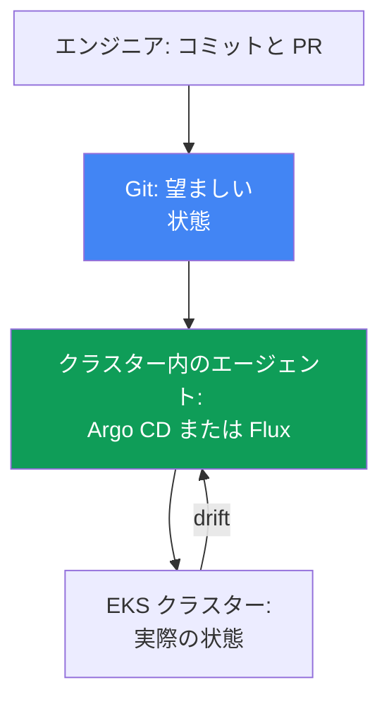
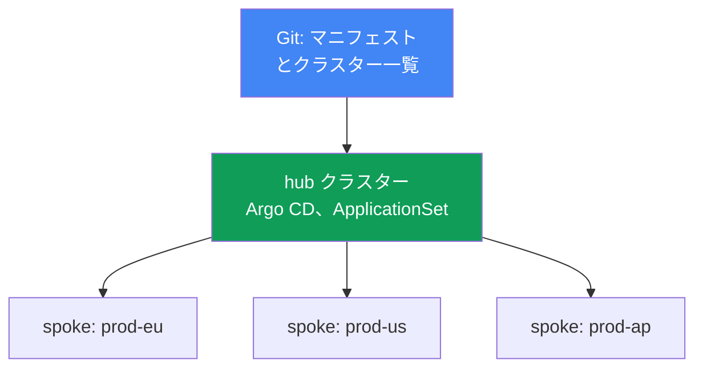
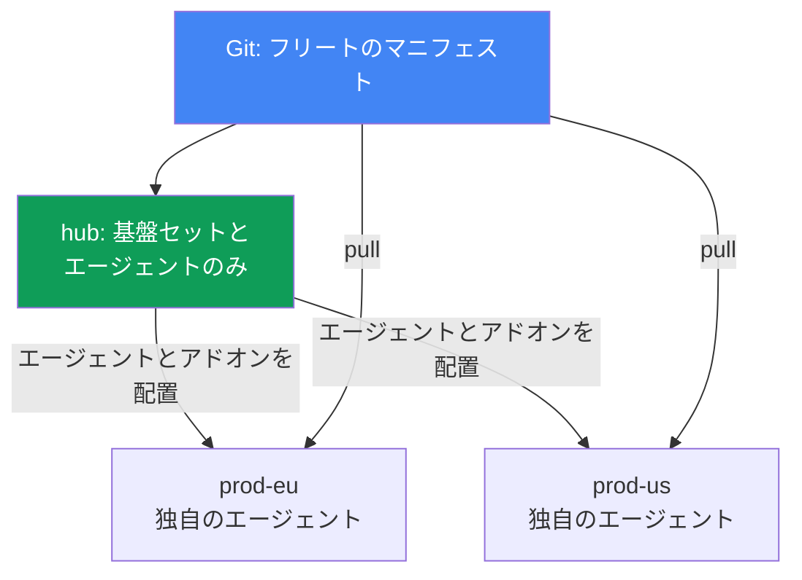

[ロシア語版](ru.md) · [英語版](en.md) · [スペイン語版](es.md) · [フランス語版](fr.md) · [ドイツ語版](de.md) · [ジョージア語版](ge.md) · [繁体字中国語版](tw.md)
# 第44章. GitOps とデリバリー: Argo CD と Flux、クラスターフリートの管理

> **次に進む前に。** 第5-7部では、アドオン、コントローラー、ポリシー、オブザーバビリティの設定を展開する方法として GitOps に何度も触れてきました。ここで仕組みそのものを扱います。隣接するテーマは別章で扱います。マルチクラスターとマルチアカウントの接続性は第32章、クラスター自体の blue/green 移行は第38章、シークレット（External Secrets、SecretStore）は第17-18章、Pod からアクセスするためのロール（IRSA、Pod Identity）は第16-17章です。ここでは、Git をクラスターの唯一の信頼できる情報源にする方法と、1つのリポジトリで EKS クラスターフリートを管理する方法を説明します。

## 44.1. 手動の kubectl apply はスケールしない

アプリケーションは `prod-eu` と `prod-us` の2つのクラスターで稼働しています。リリースはクラスターごとに手作業で `kubectl apply` していました。半年後、当番者が比較すると、`prod-eu` では `app:1.14` が動いている一方、`prod-us` では `app:1.11` でした。誰かがヨーロッパだけを更新し、米国を忘れたのです。

さらに悪化します。`prod-us` では、誰かが一度 Deployment を本番環境で直接編集しました。

```bash
# インシデント時に誰かがレプリカと制限を手で修正したが、Git には存在しない
kubectl -n shop edit deployment checkout
```

この変更はどこにも記録されていません。Git には `replicas: 3` とあるリソース制限を含むマニフェストがあり、クラスターには `replicas: 6` と異なる制限があります。クラスターの状態はリポジトリに記述された状態から乖離しました。これはドリフト（drift）と呼ばれ、インシデントが起きるか、次の `kubectl apply` が本番の修正を黙って元に戻すまで、誰にも分かりません。

3つの別々の失敗が生じます。

- **唯一の信頼できる情報源がない。** 実際にデプロイされているものはクラスター自体でしか確認できず、クラスターごとに異なります。Git とクラスターは、エンジニアの規律以外では結び付いていません。
- **ドリフトが見えない。** 手動の `kubectl edit` による変更は黙って蓄積し、偶然にしか発見されません。
- **監査と簡単なロールバックがない。** 誰が、何を、いつクラスター内で変更したか不明です。以前の動作状態に戻すには、その状態を覚えている必要があります。

2つのクラスターでは許容できても、20個では（第32章）管理不能です。以降では、3つすべての失敗を直す GitOps の原則、Argo CD と Flux のエージェント、1つのリポジトリによるクラスターフリート管理、そしてこの設計で EKS に固有の点を扱います。

## 44.2. GitOps の原則

GitOps は、システムの望ましい状態を Git に宣言的に記述し、クラスター内の専用エージェントが実際の状態をその記述へ継続的に一致させる運用モデルです。OpenGitOps（CNCF プロジェクト）が定義する4つの原則があります。

- **宣言性。** システム全体を「これらの手順を実行する」ではなく「こうあるべきだ」と宣言的に記述します。通常の Kubernetes マニフェスト、Kustomize、または Helm チャートです。
- **バージョン管理と不変性。** 望ましい状態は Git に保存されます。すべての変更は、作成者、時刻、pull request による review を伴うコミットです。これにより監査とロールバックが得られます。過去の状態へ戻す操作は `git revert` です。
- **自動適用。** 承認済みの変更は、手動の `kubectl apply` を使わずにエージェントが取得して適用します。
- **継続的なリコンシリエーション。** エージェントは Git とクラスターを常に比較し、不一致を解消します。これがモデルの核です。1回限りのデプロイではなく、終わらない照合ループです。

**Pull と push。** 従来の CI/CD は push モデルで動きます。外部のパイプラインがクラスターの認証情報を保持し、`kubectl apply` を実行します。クラスター権限が外へ露出し、パイプラインが知るのは自分の実行だけです。その後クラスターがどうなったかは分かりません。GitOps は pull モデルです。エージェントはクラスター内に存在し、自ら Git から取得して適用します。クラスターの認証情報を外部へ渡す必要がなく、照合はパイプライン実行時だけでなく継続します。

**ドリフトと self-heal。** エージェントは Git とクラスターを常に比較するため、手動の `kubectl edit` を不一致（drift）として検出します。self-heal が有効なら、Git の状態へ自動的に戻します。ドリフトは静かな問題から、目に見えるステータスになるか自動的に解消されるものへ変わり、本番中の手動修正は残らなくなります。



## 44.3. Argo CD

Argo CD は CNCF の GitOps エージェントであり、2022年12月から graduated プロジェクトです。アプリケーション中心で、管理単位は Git のソースを対象クラスターおよび namespace に結び付ける `Application` リソースです。

```yaml
apiVersion: argoproj.io/v1alpha1
kind: Application
metadata:
  name: checkout
  namespace: argocd
spec:
  project: default
  source:
    repoURL: https://git.example.com/shop.git
    targetRevision: main
    path: apps/checkout/overlays/prod
  destination:
    server: https://kubernetes.default.svc   # 対象クラスター
    namespace: shop
  syncPolicy:
    automated:
      selfHeal: true    # ドリフトを Git の状態へ戻す
      prune: true       # Git から削除したものを削除する
```

Argo CD は各 `Application` に対して、独立した2つのステータスを管理します。

- **sync status**: クラスターが Git と一致するかどうか。`Synced` または `OutOfSync`（ドリフトあり）。
- **health status**: リソース自体が健全かどうか。`Healthy`、`Progressing`、`Degraded`、`Missing`。Deployment は `Synced`（Git と一致）であっても `Degraded`（Pod が失敗）になり得ます。これは別の軸です。

主な同期メカニズムは以下です。

- **auto-sync**: 手動の `argocd app sync` なしに Git の変更を自動適用します。
- **self-heal**: クラスター内の手動変更を Git の状態へ戻します。
- **prune**: Git から削除したリソースをクラスターから削除します。prune がなければ孤立します。
- **sync waves**: 適用順序です。同期は `PreSync`、`Sync`、`PostSync` のフェーズで進み、各フェーズ内では `argocd.argoproj.io/sync-wave` アノテーションに従う wave で進みます。小さい番号が先です。これにより CRD はそれを使うリソースより先に適用され、DB マイグレーションはアプリケーションより先に実行されます。

**App-of-apps。** 1つの親 `Application` が、子 `Application` マニフェストを含むディレクトリを指します。親を展開するとアプリケーション一式がデプロイされ、ゼロからクラスターを bootstrapping するのに便利です。Argo CD の **UI** はリソースツリー、Git とクラスター間の diff、ステータスを表示し、手動の sync やロールバックを開始できます。

**ApplicationSet** は、ジェネレーターに基づいてテンプレートから `Application` を生成するコントローラーです。クラスターフリートで重要なのは **cluster generator** です。Argo CD は接続済みクラスターを自身の namespace 内の Secret として保存し、cluster generator は各クラスターに対して1つの `Application` を作成します。クラスターを追加すると、アプリケーション一式が自動的にそこへ展開されます（44.6節）。

## 44.4. Flux

Flux はもう一つの GitOps エージェントで、こちらも CNCF の graduated プロジェクトです。モノリシックな Argo CD と異なり、特定の役割と独自の CRD を持つ専用コントローラー群（GitOps Toolkit）から成ります。

| コントローラー | 担当 | 主な CRD |
|---|---|---|
| source-controller | ソース: Git、Helm リポジトリ、OCI | `GitRepository`, `HelmRepository`, `OCIRepository` |
| kustomize-controller | Kustomize/マニフェストの適用 | `Kustomization` |
| helm-controller | Helm チャートのリリース | `HelmRelease` |
| notification-controller | 受信/送信イベント、アラート | `Alert`, `Provider`, `Receiver` |
| image-reflector-controller | レジストリ内のイメージタグのスキャン | `ImageRepository`, `ImagePolicy` |
| image-automation-controller | 新しいタグを Git へコミット | `ImageUpdateAutomation` |

Flux のモデルは「ソース、次にリコンシリエーション」です。まず取得元を宣言し、次に何をどこへ適用するかを宣言します。

```yaml
apiVersion: source.toolkit.fluxcd.io/v1
kind: GitRepository
metadata:
  name: shop
  namespace: flux-system
spec:
  interval: 1m           # リポジトリをポーリングする頻度
  url: https://git.example.com/shop.git
  ref:
    branch: main
---
apiVersion: kustomize.toolkit.fluxcd.io/v1
kind: Kustomization
metadata:
  name: checkout
  namespace: flux-system
spec:
  interval: 10m          # クラスターとソースを照合する頻度
  sourceRef:
    kind: GitRepository
    name: shop
  path: ./apps/checkout/overlays/prod
  prune: true            # Argo CD の prune に相当
```

リコンシリエーションは `interval` に従って進みます。コントローラーは定期的にソースを確認し、クラスターをその状態へ一致させます。`HelmRelease` は、手動の `helm install` なしに Helm チャートに対して同じことを宣言的に提供します。

**Image automation。** 一対の image コントローラーがイメージの自動更新を実装します。reflector はレジストリ内のタグ（EKS では通常 ECR、第20章）をスキャンし、`ImagePolicy` によって適切なもの（たとえば最新の semver）を選び、automation-controller は新しいタグを Git にコミットします。その後、通常のリコンシリエーションがクラスターへ展開します。バージョン更新についても Git は信頼できる情報源のままです。イメージの変更は、Deployment への直接パッチではなくコミットです。

## 44.5. Argo CD と Flux の比較

どちらも成熟した CNCF graduated プロジェクトで、同じ GitOps 原則を実装しています。違いはどちらが「より良い」かではなく、構成と重点です。

| | Argo CD | Flux |
|---|---|---|
| 構成 | モノリシックなアプリケーション中心エージェント | コントローラー群（GitOps Toolkit） |
| UI | 高機能な web-UI を標準搭載 | UI なし（サードパーティ製および CLI `flux` はある） |
| 管理単位 | `Application` / `ApplicationSet` | `Kustomization` / `HelmRelease` |
| クラスターフリート | ApplicationSet + cluster generator | クラスターごとの `Kustomization`、hub リポジトリ |
| イメージ自動更新 | Argo Image Updater により実現（別途） | 組み込みの image コントローラー |
| プログレッシブデリバリー | Argo Rollouts | Flagger |
| モデル | pull、リコンシリエーション | pull、interval によるリコンシリエーション |

大まかな選定指針は次のとおりです。分かりやすい UI、リソースツリー、ApplicationSet を用いるアプリケーション中心モデルが重要なら Argo CD を選びます。モジュール性、Git 内の CRD を介した管理、組み込みの image automation に魅力を感じるなら Flux を選びます。シークレットやデリバリーなどの周辺機能は、どちらにも追加します。

## 44.6. クラスターフリートの管理

EKS クラスターフリート（第32章）で一般的なモデルは **hub と spoke** です。1つの hub クラスターが Argo CD（または Flux）をホストし、多数の spoke クラスターを管理します。hub 上のエージェントは各対象クラスターにマニフェストを適用します。各クラスターにエージェントをインストール・更新する必要はなく、エージェントの ID と Git へのアクセスは1か所で設定します。その集中化には、障害ドメインとスケーリング上限という代償があります。詳細は後述します。



cluster generator を備えた ApplicationSet は、「すべてのクラスターへ一式のアプリケーションを展開する」を1つの宣言に変えます。つまり、`Application` テンプレートと接続済みクラスターを列挙するジェネレーターです。共通セット（アドオン、ポリシー、基盤サービス）はフリート全体へ一貫して展開され、クラスター間の差異（リージョン、サイズ、endpoint）はジェネレーターのパラメーターでテンプレートに差し込みます。

**Git generator と matrix。** cluster generator はクラスターを列挙しますが、アドオンのセット自体は Git リポジトリの構造で定義されることが多くあります。これを2つのモードで実現するのが git generator です。directory generator は各サブディレクトリ（アドオンごとのディレクトリ）に対して `Application` を作成し、file generator は各設定ファイル（たとえばパラメーターを持つ `addons/*.yaml`）に対して作成します。Git にディレクトリまたはファイルを追加すると、ApplicationSet を編集しなくてもフリートに新しいアドオンが現れます。

「各クラスターにアドオンセットを展開する」には、matrix generator でジェネレーターを組み合わせます。これはネストした2つのジェネレーターの積（デカルト積）を取ります。たとえば cluster（各クラスター）と git（各アドオン）を組み合わせ、すべての組に対して `Application` を生成します。これにより、新しいクラスターには基盤アドオンの基本セットが自動的に展開され、アドオンの一覧は Git 内のディレクトリまたはファイル構造として維持されます。

**新しいクラスターの bootstrapping。** クラスターを作成し（Terraform、第4章）、hub に接続すると、app-of-apps または ApplicationSet が基盤セット全体を自動的に展開します。これはクラスターの blue/green 移行（第38章）でまさに必要なものです。新しい「green」クラスターは同じ Git から同じ構成を受け取り、手で組み立てられるのではないため、「blue」と同一になります。

### 集中化の代償とトポロジーの選択

第1の代償は **障害ドメイン** です。hub はフリート全体の単一障害点です。spoke クラスターで実行中のワークロードは続行します。エージェントはデータパスにありません。しかし、新しいコミットの適用、ドリフト修復（self-heal）、ロールバックはフリート全体で直ちに停止します。hub のインシデントは全体のデリバリーを止めます。第2の代償は **ネットワーク越しのリコンシリエーション** です。エージェントはクラスター境界を越えてリソースを修正・削除するため、レイテンシー、ネットワークのボトルネック、送信トラフィック料金（第31章）、接続不安定性への感度が生じます。この一覧は、従来の Argo CD アーキテクチャとの比較における Red Hat の Argo CD Agent ドキュメントにもあります。対応は3つです。

- **hub をシャーディングする。** クラスターを application-controller のレプリカへ分配します。レプリカ数を増やし、同じ数を環境変数 `ARGOCD_CONTROLLER_REPLICAS` にも設定します。分配アルゴリズムには hash-based（旧方式で不均一）と round-robin（より均一）があり、新しいバージョンでは、レプリカ変更時に配分を再計算する動的分配もあります。
- **分散化する。** hub は ApplicationSet により基盤だけ、すなわちインフラアドオンとローカルの Argo CD または Flux エージェントを展開します。その後はエージェント自身が Git を見てアプリケーションを取得します（pull モデル、44.2節）。クラスターは自律的です。hub または接続が失われてもリコンシリエーションは続きます。代償は、クラスター数と同じ数のエージェントを更新・設定する必要があり、フリート全体の単一パネルがなく、エージェントバージョンがずれることです。
- **1つの control plane を維持してフローを反転する。** `argocd-agent` プロジェクト（これは `argoproj-labs` のインキュベーション中のプロジェクトであり、Argo CD のコアではありません）は、すべてのワークロードクラスターの `Application` を見る中央の Argo CD インスタンスを1つだけ維持します。ただし同期は hub がリモート API に書き込むのではなく、spoke 側のエージェントが pull します。これは依然として hub-and-spoke です。

選択は「正しさ」ではなく、フリート規模と自律性の要件で決まります。hub モデルは運用が簡単で単一の概要を提供し、分散モデルは hub の喪失時にも生き残ります。



**責任分離** は、容易に破られる重要な原則です。

| レイヤー | 管理対象 | ツール |
|---|---|---|
| インフラストラクチャ | VPC、EKS クラスター、node groups、IAM | Terraform / Terragrunt (IaC) |
| プラットフォームとアプリケーション | アドオン、コントローラー、ポリシー、ワークロード | GitOps (Argo CD / Flux) |

IaC はクラスターとその「ハードウェア」を作成し、GitOps は既存クラスターをアドオンとアプリケーションで満たします。混ぜるべきではありません。Deployment の修正のためにクラスターを作り直すのは高コストであり、そのクラスター内に住むエージェントでインフラを取得するのは鶏と卵の問題です。境界は「AWS リソースとしてのクラスター」と「クラスター内で動くもの」の間にあります。

## 44.7. EKS 固有の点

GitOps エージェントはクラスター内の通常のワークロードであり、EKS では任意の Pod と同じ ID とアクセスのルールが適用されます。

- **エージェントの AWS 認証。** ECR からイメージを取得する（第20章）か AWS サービスへアクセスするには、静的キーではなく、IRSA（第16章）または EKS Pod Identity（第17章）によってエージェントへロールを与えます。ServiceAccount を最小権限の IAM ロールに関連付けます。
- **リポジトリへのアクセス。** プライベート Git は CodeCommit または self-hosted です。外部 Git には、agent に deploy-key またはトークンを与え、Secret として保存します（Git へコミットしません。後述）。
- **EKS アドオンの管理。** Managed addons と Helm アドオン（第37章）は Git に記述し、同じエージェントで展開すると便利です。アドオンのバージョンと設定は同一のセットの一部です。

**シークレットを Git にコミットしない。** これが最重要ルールです。Git は信頼できる情報源ですが、プライベートリポジトリであってもシークレットストアではありません。Git 内のシークレット値は漏洩です。実用的なアプローチは以下です。

- **External Secrets Operator**（第18章）: Git には Secrets Manager または SSM Parameter Store を参照する `ExternalSecret` を置きます。オペレーターが値を取得し、クラスター内に通常の Secret を作成します。Git にあるのは参照だけで、値は Secrets Manager に存在します（第17-18章）。
- **Sealed Secrets**: Git には暗号化された `SealedSecret` を置き、それを復号できるのは独自のキーを持つクラスター内コントローラーだけです。リポジトリにあるのは暗号文だけです。

このように宣言性は保持されます。Git にはシークレットオブジェクトがありますが、値は含まれません。

### Argo CD 用の EKS マネージド機能

上記の IRSA と Pod Identity の説明は、自分でインストールしたエージェントに当てはまります。Argo CD は EKS のマネージド機能（EKS Capabilities）としても提供されます。コントローラーのインストール、更新、スケーリングは AWS が担い、ソフトウェアは自分のノードではなく AWS の control plane で動きます。ドキュメントで明記された結果として、ワーカーノードは Git リポジトリや Helm レジストリへ直接アクセスする必要がありません。ソースを読むのは AWS 側の機能です。`Application` と `ApplicationSet` マニフェストは upstream と同様に動作し、変更不要です。

- **デプロイ先。** EKS クラスターのみで、API サーバー URL ではなくクラスター ARN を指定します。ローカルクラスターは自動登録されません。機能を作成した同じクラスターへ展開する場合も、ARN で明示的に登録します。この機能が hub-and-spoke トポロジーを自動設定することはありません。対象クラスターと access entries は自分で設定します。機能は中央の hub クラスターに作成され、spoke クラスターにはインストールされません。hub-and-spoke は設計ミスではなく、サポートされる実用的なトポロジーです。
- **対象クラスターへのアクセス。** EKS access entries（第5章）を通じて行うため、この用途に IRSA も cross-account assume role も不要です。VPC peering や特別なネットワーク設定（第2章）なしで、完全にプライベートな EKS クラスターへ透過的にアクセスできるとされています。
- **認証と RBAC。** AWS Identity Center を使います。ロールは admin、editor、viewer の3つだけです。マッピングは ConfigMap `argocd-rbac-cm` ではなく、機能の `rbacRoleMapping` パラメーターで設定します。`Application`、`ApplicationSet`、`AppProject` リソースは指定された同一 namespace に置く必要がありますが、ワークロードは任意の対象クラスターの任意の namespace にデプロイできます。
- **提供されないもの。** Config Management Plugins、health チェック用の独自 Lua スクリプト、notifications コントローラー、Identity Center 以外の独自 SSO プロバイダー、UI 拡張、`argocd-cm` と `argocd-params` への直接アクセス、同期タイムアウトの変更（120秒に固定）。

## 44.8. プログレッシブデリバリー

GitOps は Git に記述されたものを展開しますが、新しいアプリケーションバージョンが古いものを*どのように*置き換えるかは管理しません。標準の `RollingUpdate` は Pod を徐々に置換できるだけで、トラフィックを割合で分割したり、メトリクスに基づいて自動ロールバックしたりはできません。これを補うのがプログレッシブデリバリーです。Argo CD と組み合わせる **Argo Rollouts**（`Deployment` の代わりに CRD `Rollout` を使用）および Flux と組み合わせる **Flagger** は、メトリクス分析と自動ロールバックを備えたアプリケーションの canary と blue/green デプロイを提供します。これはアプリケーションのバージョンの話であり、第38章のクラスターの blue/green と混同しないでください。この層は GitOps の上に置かれます。

## 44.9. 本番での適用方法

- **Git を唯一の信頼できる情報源にする。** 本番への直接の `kubectl apply` を禁止します。すべての変更はコミットと pull request を経由し、エージェントが適用します。監査とロールバックは無償で得られます。
- **self-heal と prune を意識して有効化する。** self-heal は本番中の手動変更を消します。インシデント中は一時的に無効化することがあります。prune は Git からの削除後に残る孤立リソースを除去します。
- **IaC と GitOps を分離する。** クラスター、VPC、node groups は Terraform、アドオンとアプリケーションは GitOps です。Deployment の修正のためにクラスターを作り直さないよう、境界を厳密に保ちます。
- **ApplicationSet でフリートを管理する。** アドオンとポリシーの共通セットを1つのリポジトリからすべてのクラスターへ展開します。新しいクラスターは bootstrapping 時に自動で構成を受け取ります。
- **シークレットは Git の外部に置く。** Secrets Manager 上の External Secrets Operator または Sealed Secrets を使います。平文の値がリポジトリに入ることは決してありません。
- **エージェントにはキーでなくロールを与える。** ECR と AWS サービスへのアクセスには IRSA または Pod Identity を使います。

## 44.10. ミニ用語集

- **GitOps**: 望ましい状態を Git に記述し、エージェントがクラスターを継続的にその状態へ一致させるモデル（原則は CNCF プロジェクトの OpenGitOps が定義）。
- **リコンシリエーション**: 望ましい状態（Git）と実際の状態（クラスター）を照合し続けるサイクル。
- **ドリフト（drift）**: 通常は手動の `kubectl edit` によって生じる、クラスター状態と Git の不一致。
- **self-heal**: ドリフトを Git の状態へ自動ロールバックすること。
- **pull モデル**: クラスター内のエージェントが自ら Git から取得するモデル。push は外部パイプラインです。
- **Application**: Argo CD の CRD。「Git 内のソース + 対象クラスターと namespace」の組。
- **ApplicationSet**: テンプレートから `Application` を生成する Argo CD コントローラー。cluster generator は接続済みクラスターごとに1つを作り、git generator は Git のディレクトリまたはファイルごとに作り、matrix generator は2つのジェネレーター（cluster + git）を掛け合わせます。
- **sync waves**: sync フェーズ内で wave ごとにリソースを適用する Argo CD の順序。
- **app-of-apps**: 子の一式を展開する親 `Application`。
- **GitOps Toolkit**: Flux のコントローラー群（source、kustomize、helm、image など）。
- **Kustomization / HelmRelease**: Flux の CRD。ソースから何をどこに適用するかを表します。
- **image automation**: 新しいイメージタグを Git へコミットする Flux コントローラー。
- **プログレッシブデリバリー**: アプリケーションの canary/blue-green デプロイ（Argo Rollouts、Flagger）。
- **Argo CD 用 EKS マネージド機能**: EKS Capability としての Argo CD。コントローラーは AWS の control plane にあり、対象は ARN で指定する EKS クラスターだけで、アクセスは EKS access entries を通じます。
- **Argo CD のシャーディング**: 接続済みクラスターを application-controller のレプリカに分配すること。

## 44.11. 章のまとめ

- 多数のクラスターへの手動 `kubectl apply` は3つの問題を招きます。唯一の信頼できる情報源がなく、手動変更によるドリフトは見えず、監査と簡単なロールバックもありません。
- GitOps はこれを解決します。望ましい状態は Git に宣言的に置かれ、エージェントが実際の状態を継続的に一致させます（pull モデル）。変更は review 付きのコミット、ロールバックは `git revert` であり、self-heal は本番中の手動変更を残らなくします。
- Argo CD は UI を持つアプリケーション中心のモノリスです。sync と health ステータスを持つ CRD `Application`、auto-sync、self-heal、prune、sync waves、app-of-apps、cluster generator を備えた ApplicationSet を提供します。
- Flux はコントローラー群（GitOps Toolkit）です。`GitRepository`、`Kustomization`、`HelmRelease`、interval によるリコンシリエーション、Git へのタグコミットを行う image automation を提供します。どちらも CNCF graduated です。
- クラスターフリートでは、エージェントを持つ hub が spoke クラスターを管理します。ApplicationSet cluster generator は共通セットをすべてに展開し、新しいクラスターは bootstrapping 時に構成を取得します。
- hub モデルの障害ドメインはフリート全体です。コミットの適用、self-heal、ロールバックは停止しますが、ワークロード自体は停止しません。コントローラーのシャーディング、または各クラスターのローカルエージェントによる分散化で軽減できます。
- Argo CD は EKS のマネージド機能としても利用できます。ソフトウェアはノードでなく AWS の control plane にあり、デプロイ先は ARN で指定する EKS クラスターのみ、アクセスは access entries、RBAC は Identity Center です。
- 境界を保ちます。Terraform はインフラ（VPC、クラスター、node groups）を管理し、GitOps はその上のアドオンとアプリケーションを管理します。混在させるのは高コストでリスクがあります。
- EKS では、エージェントにキーではなく IRSA または Pod Identity によるロール（ECR、CodeCommit へのアクセス）を与えます。シークレットは Git にコミットせず、Secrets Manager 上の External Secrets Operator または Sealed Secrets を使います。
- プログレッシブデリバリー（Argo Rollouts、Flagger）は GitOps の上でアプリケーションの canary/blue-green を実現します。これは第38章のクラスターの blue/green ではなく、アプリケーションバージョンについての機能です。

## 44.12. 実務での役立ち方

当番時、GitOps はクラスターとの向き合い方を変えます。「ここに実際に何がデプロイされているか」という問いに、掘り起こしは不要になります。真実は Git にあり、あらゆる不一致をエージェントが `OutOfSync` ステータスとして示します。インシデント中の手動変更は、もはや静かな地雷ではありません。self-heal が即座に戻すか、ドリフトとして見えるため、意識してコミットするか除去するかを決められます。以前の動作状態へのロールバックは、昨日どうだったかを思い出そうとするのではなく `git revert` です。

プラットフォームを計画する際、GitOps はクラスターフリートを統一します。アドオンとポリシーの共通セットを1度記述して ApplicationSet によりすべてのクラスターへ展開し、新しいクラスターは Terraform（第4章）での作成後、bootstrapping で自動的に満たされます。これは blue/green 移行（第38章）を簡単にします。ここではツールより規律が重要です。IaC と GitOps の厳密な境界、Git の外に置くシークレット、ロールを介したエージェントアクセスです。Argo CD と Flux の選択は二次的です。どちらも成熟しており、第一に重要なのは Git がクラスター変更の唯一の入口になることです。

## 44.13. 自己確認の質問

1. 多数のクラスターへの手動 `kubectl apply` について、章の冒頭ではどの3つの失敗を説明していますか。
2. ドリフトとは何ですか。self-heal は、本番中の手動 `kubectl edit` の行く末をどう変えますか。
3. GitOps の4原則を述べてください。なぜロールバックは `git revert` に帰着しますか。
4. pull と push のデリバリーモデルの違いは何ですか。なぜ pull の方がクラスター認証情報にとって安全ですか。
5. Argo CD の CRD `Application` は何を記述しますか。sync status と health status はどう異なりますか。
6. auto-sync、self-heal、prune、sync waves は何のためにありますか。wave の順序が重要なのはどこですか。
7. app-of-apps と ApplicationSet cluster generator とは何ですか。それぞれどのような場合に便利ですか。
8. Flux はどのコントローラーと CRD から構成されますか。「ソース、次にリコンシリエーション」とは何を意味しますか。
9. Flux の image automation はどのように動き、なぜイメージ更新は Git のコミットのままなのですか。
10. Argo CD と Flux を比較してください。構成、UI、管理単位、クラスターフリートの観点で答えてください。
11. hub と spoke モデルによるフリート管理はどのように構成され、cluster generator は何を展開しますか。
12. hub クラスターが停止するとフリート内で何が動かなくなり、何は動き続けますか。
13. IaC（Terraform）と GitOps の境界はどこですか。なぜ曖昧にしてはいけませんか。
14. EKS 上の GitOps エージェントは ECR へのアクセスをどのように取得しますか。なぜシークレットを Git にコミットしないのですか。
15. Argo CD 用 EKS マネージド機能は、ソフトウェアの実行場所と対象クラスターへのアクセス方法の点で、自前インストールとどう異なりますか。

## 実践

このテーマのコースラボ: [ラボ118 - GitOps: Argo CD、ドリフト、self-heal](../../labs/118/README_JP.MD)。
このラボでは Argo CD をインストールし、Git のディレクトリに対する Application を作成して、ドリフトと self-heal を観察します。sync waves、prune の境界、sync status と health status の違いも扱います。検証は `check_result` コマンドで行います。起動は `TASK=118 make run_eks_task` です。

ラボ以外にも、Argo CD と Flux は、それぞれの CRD と CLI を通じて稼働中のクラスターで確認できます。まず、エージェントが認識しているアプリケーションと、そのステータスを確認します。

クラスターに Argo CD がある場合:

```bash
# すべての Application とその sync/health ステータス
kubectl get applications -n argocd
# Argo CD CLI による同じ確認
argocd app list
# 1つのアプリケーションの詳細: ソース、リソースツリー、ドリフト
argocd app get checkout
```

sync（`Synced`/`OutOfSync`）と health（`Healthy`/`Degraded`）の列に注意してください。self-heal が有効な `OutOfSync` は、誰が何を手で変更したのかを調べるきっかけです。

クラスターに Flux がある場合:

```bash
# ソースとその状態
kubectl get gitrepository -A
flux get sources git
# 実際に何がリコンシリエーションされ、最後の照合がいつだったか
flux get kustomizations -A
kubectl get kustomization -A
```

`GitRepository` と `Kustomization` の `interval` フィールドを確認してください。これがリコンシリエーションのリズムです。次にレイヤー分離を確認します。クラスターと node groups が Terraform で作成され、アドオンとアプリケーションは手で配置されたものではなく、エージェントを介して Git から来ていることを確認してください。シークレットは、リポジトリ内の平文 `Secret` ではなく、`ExternalSecret` または `SealedSecret` として探します。

---
[目次](../README_JP.md) · [第43章](../43/jp.md) · [第45章](../45/jp.md)
