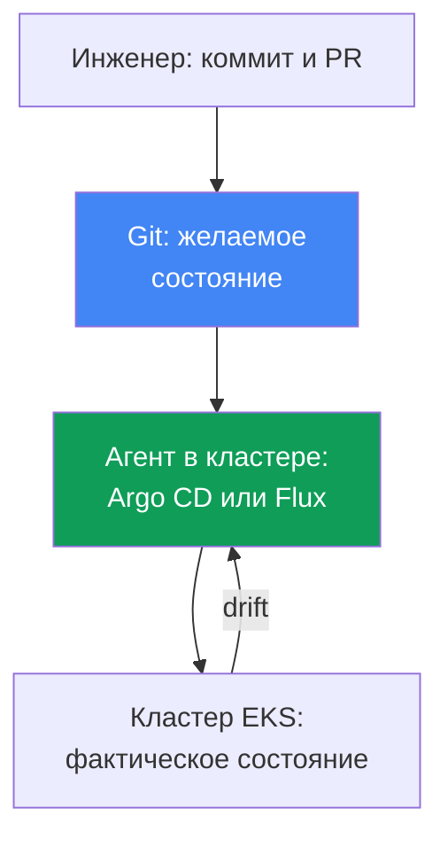
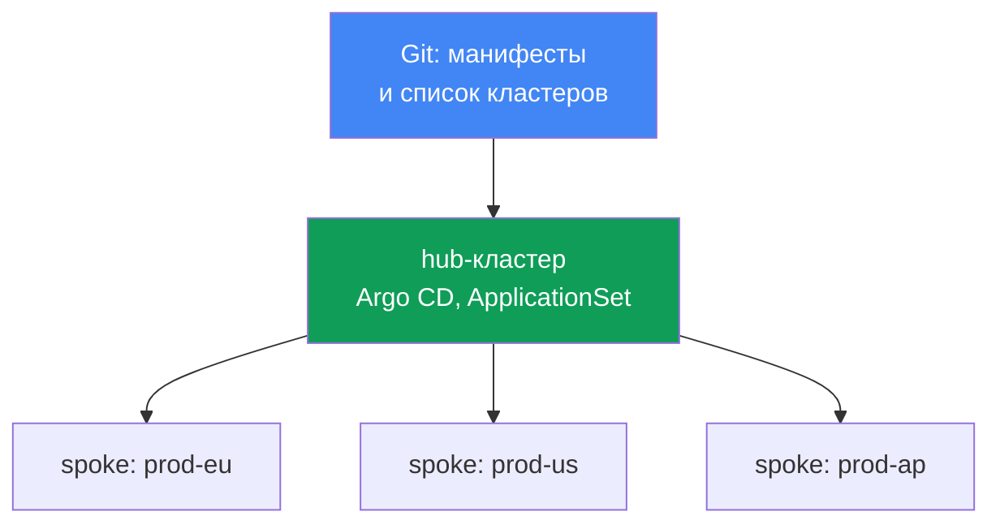
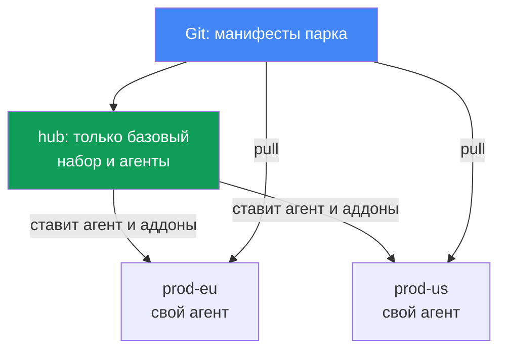

# Глава 44. GitOps и доставка: Argo CD и Flux, управление парком кластеров

> **Что дальше.** Части 5-7 много раз упоминали GitOps как способ раскатывать конфигурацию:
> аддоны, контроллеры, политики, наблюдаемость. Пора разобрать сам механизм. Смежное отдано
> другим главам: связность мультикластера и мультиаккаунта - глава 32, blue/green миграция
> самих кластеров - глава 38, секреты (External Secrets, SecretStore) - главы 17-18, роли для
> доступа из подов (IRSA, Pod Identity) - главы 16-17. Здесь - как Git становится единственным
> источником истины для кластера и как одним репозиторием управлять парком кластеров EKS.

## 44.1. Ручной kubectl apply не масштабируется

Приложение живёт в двух кластерах: `prod-eu` и `prod-us`. Релиз выкатывали руками, по одному
`kubectl apply` на кластер. Полгода спустя дежурный сравнивает и обнаруживает, что в `prod-eu`
крутится `app:1.14`, а в `prod-us` - `app:1.11`: кто-то докатил Европу и забыл про США.

Дальше хуже. В `prod-us` кто-то однажды правил Deployment вживую:

```bash
# кто-то поправил реплики и лимиты руками в инциденте, в Git этого нет
kubectl -n shop edit deployment checkout
```

Эта правка нигде не записана. В Git лежит манифест с `replicas: 3` и одним набором лимитов, а
в кластере - `replicas: 6` и другие лимиты. Состояние кластера разъехалось с тем, что описано
в репозитории. Это называется дрейф (drift), и никто про него не знает, пока не случится
инцидент или пока следующий `kubectl apply` молча не откатит боевую правку назад.

Складывается три отдельных провала:

- **Нет единого источника истины.** Что реально задеплоено - видно только в самом кластере,
  и в каждом кластере своё. Git и кластер не связаны ничем, кроме дисциплины инженера.
- **Дрейф не виден.** Ручные правки `kubectl edit` накапливаются молча; узнают о них случайно.
- **Нет аудита и лёгкого отката.** Кто, что и когда менял в кластере - неизвестно; чтобы
  вернуться к прошлому рабочему состоянию, надо помнить, каким оно было.

На двух кластерах это терпимо, на двадцати (глава 32) - неуправляемо. Дальше в главе: принципы
GitOps, которые чинят все три провала; агенты Argo CD и Flux; управление парком кластеров одним
репозиторием; и что в этой схеме специфично для EKS.

## 44.2. Принципы GitOps

GitOps - это операционная модель, в которой желаемое состояние системы описано декларативно в
Git, а специальный агент в кластере непрерывно приводит фактическое состояние к описанному.
Четыре принципа (их формулирует OpenGitOps, проект CNCF):

- **Декларативность.** Вся система описана декларативно: не «выполни эти шаги», а «вот как
  должно быть». Это обычные манифесты Kubernetes, Kustomize или Helm-чарты.
- **Версионирование и неизменяемость.** Желаемое состояние хранится в Git: каждое изменение -
  это коммит с автором, временем и review через pull request. Отсюда аудит и откат: вернуться
  к прошлому состоянию - это `git revert`.
- **Автоматическое применение.** Одобренные изменения агент подтягивает и применяет сам, без
  ручного `kubectl apply`.
- **Непрерывная реконсиляция.** Агент постоянно сравнивает Git и кластер и устраняет
  расхождения. Это ядро модели: не разовый деплой, а бесконечный цикл сверки.

**Pull против push.** Классический CI/CD работает по push-модели: пайплайн снаружи держит
кредлы кластера и делает `kubectl apply`. У кластера торчат наружу права, а знает пайплайн
только про свой запуск - что стало с кластером после, ему неизвестно. GitOps работает по
pull-модели: агент живёт внутри кластера, сам тянет из Git и сам применяет. Кредлы кластера
наружу не отдаются, а сверка идёт непрерывно, а не только в момент запуска пайплайна.

**Дрейф и self-heal.** Раз агент постоянно сравнивает Git с кластером, ручной `kubectl edit`
он видит как расхождение (drift) и, если включён self-heal, откатывает правку к состоянию из
Git автоматически. Дрейф из тихой проблемы становится либо видимым статусом, либо
самоустраняется - ручные правки в бою перестают выживать.



## 44.3. Argo CD

Argo CD - GitOps-агент, проект CNCF (graduated с декабря 2022). Он app-центричный: единица
управления - ресурс `Application`, связывающий источник в Git с целевым кластером и namespace.

```yaml
apiVersion: argoproj.io/v1alpha1
kind: Application
metadata:
  name: checkout
  namespace: argocd
spec:
  project: default
  source:
    repoURL: https://git.example.com/shop.git
    targetRevision: main
    path: apps/checkout/overlays/prod
  destination:
    server: https://kubernetes.default.svc   # целевой кластер
    namespace: shop
  syncPolicy:
    automated:
      selfHeal: true    # откатывать дрейф к состоянию из Git
      prune: true       # удалять то, что убрали из Git
```

Argo CD ведёт для каждого `Application` два независимых статуса:

- **sync status** - совпадает ли кластер с Git: `Synced` или `OutOfSync` (есть дрейф).
- **health status** - здоров ли сам ресурс: `Healthy`, `Progressing`, `Degraded`, `Missing`.
  Deployment бывает `Synced` (совпадает с Git), но `Degraded` (поды падают) - это разные оси.

Ключевые механизмы синхронизации:

- **auto-sync** - применять изменения из Git автоматически, без ручного `argocd app sync`.
- **self-heal** - откатывать ручные правки в кластере к состоянию из Git.
- **prune** - удалять из кластера ресурсы, которые убрали из Git (без prune они осиротеют).
- **sync waves** - порядок применения. Синхронизация идёт фазами `PreSync`, `Sync`, `PostSync`,
  а внутри - волнами по аннотации `argocd.argoproj.io/sync-wave`: сначала меньшие номера. Так
  CRD применяются раньше использующих их ресурсов, а миграция БД - раньше приложения.

**App-of-apps.** Одно родительское `Application` указывает на каталог с манифестами дочерних
`Application`. Раскатив родителя, вы разворачиваете весь набор приложений - удобно для
bootstrapping кластера с нуля. **UI** Argo CD показывает дерево ресурсов, diff между Git и
кластером, статусы и позволяет запустить sync или откат вручную.

**ApplicationSet** - контроллер, генерирующий `Application` из шаблона по генераторам. Для
парка кластеров ключевой - **cluster generator**: подключённые кластеры Argo CD хранит как
Secret в своём namespace, а cluster generator создаёт по одному `Application` на каждый такой
кластер. Добавили кластер - набор приложений раскатился на него сам (раздел 44.6).

## 44.4. Flux

Flux - второй GitOps-агент, тоже проект CNCF (graduated). В отличие от монолитного Argo CD, это
набор специализированных контроллеров (GitOps Toolkit), каждый со своей задачей и своими CRD:

| Контроллер | Отвечает за | Основные CRD |
|---|---|---|
| source-controller | источники: Git, Helm-репозитории, OCI | `GitRepository`, `HelmRepository`, `OCIRepository` |
| kustomize-controller | применение Kustomize/манифестов | `Kustomization` |
| helm-controller | релизы Helm-чартов | `HelmRelease` |
| notification-controller | входящие/исходящие события, алерты | `Alert`, `Provider`, `Receiver` |
| image-reflector-controller | сканирование тегов образов в реестре | `ImageRepository`, `ImagePolicy` |
| image-automation-controller | коммит новых тегов обратно в Git | `ImageUpdateAutomation` |

Модель Flux - «источник, затем реконсиляция». Сначала объявляют, откуда тянуть, потом что и
куда применять:

```yaml
apiVersion: source.toolkit.fluxcd.io/v1
kind: GitRepository
metadata:
  name: shop
  namespace: flux-system
spec:
  interval: 1m           # как часто опрашивать репозиторий
  url: https://git.example.com/shop.git
  ref:
    branch: main
---
apiVersion: kustomize.toolkit.fluxcd.io/v1
kind: Kustomization
metadata:
  name: checkout
  namespace: flux-system
spec:
  interval: 10m          # как часто сверять кластер с источником
  sourceRef:
    kind: GitRepository
    name: shop
  path: ./apps/checkout/overlays/prod
  prune: true            # аналог prune в Argo CD
```

Реконсиляция идёт по интервалу (`interval`): контроллер периодически проверяет источник и
приводит кластер к нему. `HelmRelease` даёт то же самое для Helm-чартов декларативно, без
`helm install` руками.

**Image automation.** Пара image-контроллеров реализует автообновление образов: reflector
сканирует теги в реестре (для EKS - обычно ECR, глава 20), по `ImagePolicy` выбирает подходящий
(например, свежий semver), а automation-controller коммитит новый тег обратно в Git. Дальше
обычная реконсиляция катит его в кластер. Git остаётся источником истины даже для обновления
версий: изменение образа - это коммит, а не прямой патч Deployment.

## 44.5. Argo CD против Flux

Оба - зрелые CNCF graduated проекты, оба реализуют одни и те же принципы GitOps. Разница в
устройстве и акцентах, а не в том, что «лучше»:

| | Argo CD | Flux |
|---|---|---|
| Устройство | монолитный агент, app-центричный | набор контроллеров (GitOps Toolkit) |
| UI | богатый web-UI из коробки | UI нет (есть сторонние, CLI `flux`) |
| Единица управления | `Application` / `ApplicationSet` | `Kustomization` / `HelmRelease` |
| Парк кластеров | ApplicationSet + cluster generator | per-cluster `Kustomization`, hub-репо |
| Автообновление образов | через Argo Image Updater (отдельно) | встроенные image-контроллеры |
| Прогрессивная доставка | Argo Rollouts | Flagger |
| Модель | pull, реконсиляция | pull, реконсиляция по интервалу |

Грубая эвристика выбора: Argo CD берут, когда важен наглядный UI, дерево ресурсов и
app-центричная модель с ApplicationSet; Flux - когда ближе модульность и управление через CRD
в Git со встроенным image automation. Обвязку (secrets, доставка) добавляют к любому.

## 44.6. Управление парком кластеров

Распространённая модель для парка кластеров EKS (глава 32) - **hub и spoke**. Один hub-кластер
несёт Argo CD (или Flux) и управляет многими spoke-кластерами: агент на hub применяет манифесты
в каждый целевой кластер. Агента не нужно ставить и обновлять в каждом кластере, а идентичность
агента и его доступ к Git настраиваются в одном месте. За эту централизацию платят доменом
отказа и пределом масштабирования - разбор ниже.



ApplicationSet с cluster generator превращает «раскатать набор приложений на все кластеры» в
одну декларацию: шаблон `Application` плюс генератор, перебирающий подключённые кластеры. Общий
набор (аддоны, политики, базовые сервисы) едет на весь парк единообразно, а различия между
кластерами (регион, размер, endpoint) подставляются параметрами генератора в шаблон.

**Git generator и matrix.** Cluster generator перебирает кластеры, а сам набор аддонов часто
задан структурой Git-репозитория. Это закрывает git generator в двух режимах: directory
generator создаёт `Application` по каждому подкаталогу (каталог на аддон), а file generator -
по каждому конфигурационному файлу (например, `addons/*.yaml` с параметрами). Добавили каталог
или файл в Git - в парке появился новый аддон, ApplicationSet править не нужно.

Чтобы раскатать «набор аддонов на каждый кластер», генераторы комбинируют через matrix
generator: он перемножает два вложенных генератора (декартово произведение), например cluster
(каждый кластер) и git (каждый аддон), порождая `Application` на всякую пару. Так базовый набор
инфраструктурных аддонов на новые кластеры едет автоматически, а список аддонов остаётся
структурой каталогов или файлов в Git.

**Bootstrapping нового кластера.** Когда кластер создан (Terraform, глава 4) и подключён к hub,
app-of-apps или ApplicationSet раскатывает на него весь базовый набор автоматически. Это ровно
то, что нужно при blue/green миграции кластеров (глава 38): новый «зелёный» кластер получает ту
же конфигурацию из того же Git, а не собирается руками, - и потому идентичен «синему».

### Цена централизации и выбор топологии

Цена первая - **домен отказа**. Hub единая точка для всего парка: запущенные нагрузки на
spoke-кластерах работают дальше, агента в пути данных нет, но применение новых коммитов,
исправление дрейфа (self-heal) и откаты встают сразу по всему парку - инцидент на hub это
замирание доставки везде. Цена вторая - **реконсиляция через сеть**: агент правит и удаляет
ресурсы через границу кластеров, отсюда латентность, узкие места в сети, плата за исходящий
трафик (глава 31) и чувствительность к нестабильности связи (перечень даёт документация
Argo CD Agent от Red Hat в сравнении с традиционной архитектурой Argo CD). Ответов три:

- **Шардировать hub.** Кластеры распределяются между репликами application-controller: число
  реплик поднимают и то же число дублируют в переменной `ARGOCD_CONTROLLER_REPLICAS`. Алгоритм
  распределения бывает hash-based (старый, распределяет неравномерно) и round-robin (ровнее), а
  в свежих версиях есть динамическое распределение, пересчитывающее раскладку при смене реплик.
- **Децентрализовать.** Hub через ApplicationSet раскатывает только базу: инфраструктурные
  аддоны и локальный агент Argo CD или Flux, а дальше агент сам смотрит в Git и тянет свои
  приложения (pull-модель, раздел 44.2). Кластер автономен: отвалился hub или связь с ним,
  реконсиляция продолжается. Цена: агентов столько же, сколько кластеров, их надо обновлять и
  настраивать, единой панели по парку нет, а версии агентов расходятся.
- **Перевернуть поток, оставив один control plane.** Проект `argocd-agent` (это
  `argoproj-labs`, инкубационный, а не ядро Argo CD) сохраняет ровно один центральный экземпляр
  Argo CD, который видит `Application` всех рабочих кластеров, но синхронизацию тянет агент со
  стороны spoke, а не hub пишет в удалённые API. Это по-прежнему hub-and-spoke.

Выбор идёт по размеру парка и требованию к автономности, а не по «правильности»: hub-модель
проще в эксплуатации и даёт единый обзор, децентрализованная выживает при потере hub.



**Разделение ответственности** - важный принцип, который легко нарушить:

| Слой | Чем управляют | Инструмент |
|---|---|---|
| Инфраструктура | VPC, кластер EKS, node groups, IAM | Terraform / Terragrunt (IaC) |
| Платформа и приложения | аддоны, контроллеры, политики, нагрузки | GitOps (Argo CD / Flux) |

IaC создаёт кластер и его «железо», GitOps наполняет существующий кластер аддонами и
приложениями. Смешивать вредно: пересоздавать кластер ради правки Deployment - дорого; а
тянуть инфраструктуру через агент, который сам в этом кластере живёт, - курица и яйцо. Граница
проходит по «кластер как ресурс AWS» против «то, что крутится внутри кластера».

## 44.7. Специфика EKS

GitOps-агент - это обычная нагрузка в кластере, и на EKS к нему применяются те же правила
идентичности и доступа, что и к любому поду.

- **Аутентификация агента в AWS.** Чтобы тянуть образы из ECR (глава 20) или ходить в
  AWS-сервисы, агенту дают роль через IRSA (глава 16) или EKS Pod Identity (глава 17), а не
  статические ключи: ServiceAccount ассоциируют с IAM-ролью с минимальными правами.
- **Доступ к репозиторию.** Приватный Git - это CodeCommit или self-hosted; для внешнего Git
  агенту дают deploy-key или токен, который хранят как Secret (и не коммитят в Git, см. ниже).
- **Управление EKS-аддонами.** Managed addons и Helm-аддоны (глава 37) удобно описывать в Git и
  катить тем же агентом: версии и конфигурация аддонов - часть того же набора.

**Секреты не коммитят в Git.** Это главное правило: Git - источник истины, но не хранилище
секретов, даже приватный репозиторий. Значение секрета в Git - это утечка. Рабочие подходы:

- **External Secrets Operator** (глава 18): в Git лежит `ExternalSecret`, ссылающийся на
  Secrets Manager или SSM Parameter Store; оператор подтягивает значение и создаёт обычный
  Secret в кластере. В Git - только ссылка, значение живёт в Secrets Manager (главы 17-18).
- **Sealed Secrets**: в Git кладут зашифрованный `SealedSecret`, расшифровать который может
  только контроллер в кластере своим ключом. В репозитории - лишь шифротекст.

Так декларативность сохраняется (в Git есть объект секрета), а значение туда не попадает.

### Управляемая возможность EKS для Argo CD

Разбор IRSA и Pod Identity выше относится к самостоятельно установленному агенту. Argo CD есть
и как управляемая возможность EKS (EKS Capabilities): установку, обновления и масштабирование
контроллеров берёт на себя AWS, а софт работает в control plane AWS, а не на ваших нодах.
Следствие, названное в документации прямо: воркер-нодам не нужен прямой доступ
к Git-репозиториям и Helm-реестрам, источники читает сама возможность со стороны AWS. Манифесты
`Application` и `ApplicationSet` при этом работают как в апстриме, менять их не нужно.

- **Цели деплоя.** Только кластеры EKS и только по ARN кластера, а не по URL API-сервера.
  Локальный кластер не регистрируется автоматически: чтобы катить в тот же кластер, где создана
  возможность, его тоже регистрируют явно по ARN. Топологию hub-and-spoke возможность сама не
  настраивает - целевые кластеры и access entries задаёте вы. Создаётся она на центральном
  hub-кластере и на spoke-кластеры не ставится: hub-and-spoke - поддерживаемая живая топология,
  а не ошибка проектирования.
- **Доступ в целевые кластеры.** Через EKS access entries (глава 5), поэтому ни IRSA, ни
  cross-account assume role для этой задачи не нужны. Заявлен прозрачный доступ к полностью
  приватным кластерам EKS без VPC peering и особой сетевой настройки (глава 2).
- **Аутентификация и RBAC.** AWS Identity Center, роли ровно три: admin, editor, viewer;
  сопоставление задаётся параметром `rbacRoleMapping` возможности, а не через ConfigMap
  `argocd-rbac-cm`. Ресурсы `Application`, `ApplicationSet`, `AppProject` должны лежать в одном
  заданном namespace, а нагрузки деплоятся в любые namespace любых целевых кластеров.
- **Чего нет.** Config Management Plugins, свои Lua-скрипты для health-проверок, контроллер
  notifications, свои SSO-провайдеры кроме Identity Center, UI-расширения, прямой доступ к
  `argocd-cm` и `argocd-params`, изменение таймаута синхронизации (фиксирован, 120 секунд).

## 44.8. Прогрессивная доставка

GitOps раскатывает то, что описано в Git, но не управляет тем, *как* новая версия приложения
замещает старую. Штатный `RollingUpdate` умеет лишь постепенно заменять поды, без разбивки
трафика по процентам и без автоотката по метрикам. Это закрывает прогрессивная доставка:
**Argo Rollouts** (CRD `Rollout` вместо `Deployment`) с Argo CD и **Flagger** с Flux дают
canary и blue/green деплой *приложений* с анализом метрик и автооткатом. Это про версии
приложения, не путать с blue/green *кластеров* из главы 38; слой встаёт поверх GitOps.

## 44.9. Как это применяют в продакшене

- **Делают Git единственным источником истины.** Прямой `kubectl apply` в бой запрещают;
  любое изменение идёт коммитом и pull request, а агент применяет. Аудит и откат - бесплатно.
- **Включают self-heal и prune осознанно.** Self-heal убивает ручные правки в бою; во время
  инцидента его иногда временно снимают. Prune убирает осиротевшее после удаления из Git.
- **Разделяют IaC и GitOps.** Кластер, VPC и node groups - Terraform; аддоны и приложения -
  GitOps. Границу держат строго, чтобы не пересоздавать кластер ради правки Deployment.
- **Управляют парком через ApplicationSet.** Общий набор аддонов и политик едет на все кластеры
  из одного репозитория; новый кластер получает конфигурацию при bootstrapping автоматически.
- **Секреты держат вне Git.** External Secrets Operator поверх Secrets Manager или Sealed
  Secrets; чистые значения в репозиторий не попадают никогда.
- **Дают агенту роль, а не ключи.** Доступ к ECR и AWS-сервисам - через IRSA или Pod Identity.

## 44.10. Мини-глоссарий

- **GitOps** - модель, где желаемое состояние описано в Git, а агент непрерывно приводит к нему
  кластер (принципы формулирует OpenGitOps, проект CNCF).
- **реконсиляция** - непрерывный цикл сверки желаемого (Git) с фактическим (кластер).
- **дрейф (drift)** - расхождение состояния кластера с Git, обычно от ручного `kubectl edit`.
- **self-heal** - автоматический откат дрейфа к состоянию из Git.
- **pull-модель** - агент внутри кластера сам тянет из Git; push - внешний пайплайн.
- **Application** - CRD Argo CD: связка «источник в Git + целевой кластер и namespace».
- **ApplicationSet** - контроллер Argo CD, генерирующий `Application` по шаблону; cluster
  generator создаёт по одному на каждый подключённый кластер, git generator - по каталогам или
  файлам в Git, matrix generator перемножает два генератора (cluster + git).
- **sync waves** - порядок применения ресурсов в Argo CD по волнам внутри фаз sync.
- **app-of-apps** - родительское `Application`, разворачивающее набор дочерних.
- **GitOps Toolkit** - набор контроллеров Flux (source, kustomize, helm, image и другие).
- **Kustomization / HelmRelease** - CRD Flux: что и куда применять из источника.
- **image automation** - контроллеры Flux, коммитящие новые теги образов обратно в Git.
- **прогрессивная доставка** - canary/blue-green деплой приложений (Argo Rollouts, Flagger).
- **управляемая возможность EKS для Argo CD** - Argo CD как EKS Capability: контроллеры в
  control plane AWS, цели - только кластеры EKS по ARN, доступ в них через EKS access entries.
- **шардирование Argo CD** - раздача подключённых кластеров репликам application-controller.

## 44.11. Итоги главы

- Ручной `kubectl apply` на много кластеров ведёт к трём бедам: нет единого источника истины,
  дрейф от ручных правок невидим, нет аудита и лёгкого отката.
- GitOps чинит это: желаемое состояние декларативно в Git, агент непрерывно реконсилирует
  фактическое к нему (pull-модель). Изменение - коммит с review, откат - `git revert`, а
  self-heal делает ручные правки в бою нежизнеспособными.
- Argo CD - app-центричный монолит с UI: CRD `Application` со статусами sync и health,
  auto-sync, self-heal, prune, sync waves, app-of-apps, ApplicationSet с cluster generator.
- Flux - набор контроллеров (GitOps Toolkit): `GitRepository`, `Kustomization`, `HelmRelease`,
  реконсиляция по интервалу и image automation с коммитом тегов в Git. Оба - CNCF graduated.
- Парк кластеров: hub с агентом управляет spoke-кластерами; ApplicationSet cluster generator
  раскатывает общий набор на все; новый кластер получает конфигурацию при bootstrapping.
- Домен отказа hub-модели - весь парк: встают применение коммитов, self-heal и откаты, но не
  сами нагрузки. Лечится шардированием контроллера или децентрализацией с локальным агентом на
  каждом кластере.
- Argo CD есть и как управляемая возможность EKS: софт в control plane AWS, а не на нодах, цели
  деплоя - только кластеры EKS по ARN, доступ через access entries, RBAC - Identity Center.
- Границу держат: Terraform управляет инфраструктурой (VPC, кластер, node groups), GitOps -
  аддонами и приложениями поверх; смешивать дорого и рискованно.
- На EKS агенту дают роль через IRSA или Pod Identity (доступ к ECR, CodeCommit), а не ключи;
  секреты в Git не коммитят - External Secrets Operator поверх Secrets Manager или Sealed
  Secrets.
- Прогрессивная доставка (Argo Rollouts, Flagger) даёт canary/blue-green приложений поверх
  GitOps; это про версии приложения, не про blue/green кластеров из главы 38.

## 44.12. Как это пригодится в реальной работе

На дежурстве GitOps меняет сам характер работы с кластером. Вопрос «что здесь реально
задеплоено» больше не требует раскопок: истина в Git, а любое расхождение агент показывает
статусом `OutOfSync`. Ручная правка в инциденте перестаёт быть тихой миной: либо self-heal
откатит её сразу, либо она видна как дрейф, и вы осознанно решаете закоммитить её или убрать.
Откат к прошлому рабочему состоянию - это `git revert`, а не попытка вспомнить, как было вчера.

При планировании платформы GitOps держит парк кластеров единообразным: общий набор аддонов и
политик описывают один раз и раскатывают на все кластеры через ApplicationSet, а новый кластер
после создания в Terraform (глава 4) наполняется сам при bootstrapping, что упрощает blue/green
миграцию (глава 38). Дисциплина здесь важнее инструмента: строгая граница между IaC и GitOps,
секреты вне Git, доступ агента через роль. Выбор между Argo CD и Flux вторичен - оба зрелые;
первично то, что Git стал единственной точкой, через которую меняется кластер.

## 44.13. Вопросы для самопроверки

1. Какие три провала ручного `kubectl apply` на много кластеров разбирает начало главы?
2. Что такое дрейф и как self-heal меняет судьбу ручной правки `kubectl edit` в бою?
3. Сформулируйте четыре принципа GitOps. Почему откат сводится к `git revert`?
4. В чём разница pull- и push-моделей доставки и почему pull безопаснее для кредлов кластера?
5. Что описывает CRD `Application` в Argo CD и чем sync status отличается от health status?
6. Зачем нужны auto-sync, self-heal, prune и sync waves? Где важен порядок волн?
7. Что такое app-of-apps и ApplicationSet cluster generator и когда каждый удобен?
8. Из каких контроллеров и CRD состоит Flux и что значит «источник, затем реконсиляция»?
9. Как работает image automation в Flux и почему обновление образа остаётся коммитом в Git?
10. Сравните Argo CD и Flux: устройство, UI, единица управления, парк кластеров.
11. Как устроено управление парком по модели hub и spoke и что раскатывает cluster generator?
12. Что в парке перестаёт работать при отказе hub-кластера, а что продолжает работать?
13. Где проходит граница между IaC (Terraform) и GitOps и почему её нельзя размывать?
14. Как GitOps-агент на EKS получает доступ к ECR и почему секреты не коммитят в Git?
15. Чем управляемая возможность EKS для Argo CD отличается от самостоятельной установки по
    месту запуска софта и по способу доступа в целевые кластеры?

## Практика

Своей лабы у главы нет, но и Argo CD, и Flux видно на живом кластере через их CRD и CLI.
Начните с того, какие приложения агент вообще знает и в каком они статусе.

Если в кластере стоит Argo CD:

```bash
# все Application и их sync/health статусы
kubectl get applications -n argocd
# то же через CLI Argo CD
argocd app list
# детально по одному приложению: источник, дерево ресурсов, дрейф
argocd app get checkout
```

Обратите внимание на колонки sync (`Synced`/`OutOfSync`) и health (`Healthy`/`Degraded`):
`OutOfSync` при включённом self-heal - повод посмотреть, кто и что правил руками.

Если в кластере стоит Flux:

```bash
# источники и их состояние
kubectl get gitrepository -A
flux get sources git
# что реально реконсилируется и когда была последняя сверка
flux get kustomizations -A
kubectl get kustomization -A
```

Посмотрите поле `interval` у `GitRepository` и `Kustomization` - это ритм реконсиляции. Затем
проверьте разделение слоёв: убедитесь, что кластер и node groups созданы через Terraform, а
аддоны и приложения приходят из Git через агента, а не разложены руками. Секреты ищите как
`ExternalSecret` или `SealedSecret`, а не как чистые `Secret` в репозитории.

---
[Оглавление](../README_RU.md) · [Глава 43](../43/ru.md) · [Глава 45](../45/ru.md)
