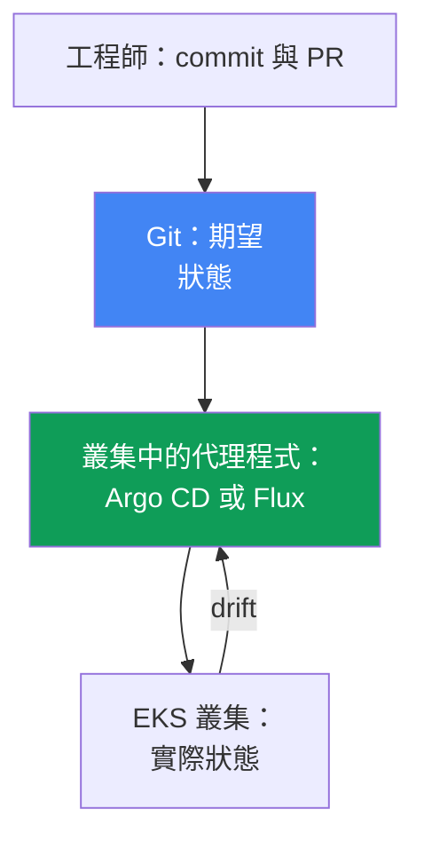
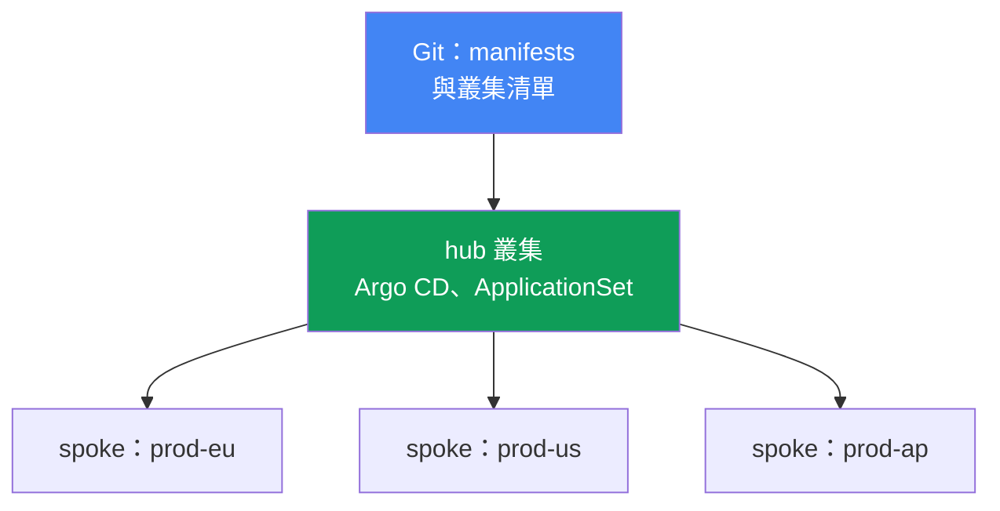
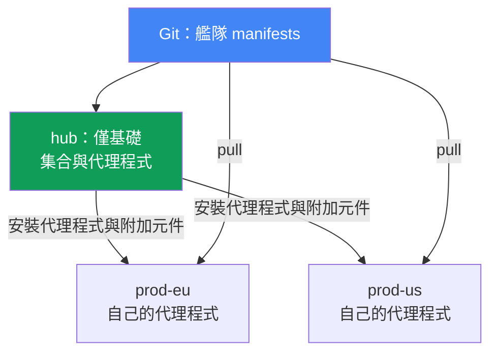

[Русская версия](ru.md) · [Eng version](en.md) · [Versión en español](es.md) · [Version française](fr.md) · [Deutsche Version](de.md) · [ქართული ვერსია](ge.md) · [日本語版](jp.md)
# 第 44 章。GitOps 與交付：Argo CD 和 Flux、叢集艦隊管理

> **接下來。** 第 5 至 7 部分多次提到 GitOps 是部署設定的方法：附加元件、控制器、政策、可觀測性。現在該解析其機制本身了。相鄰主題交由其他章節說明：多叢集與多帳戶連線性見第 32 章，叢集本身的 blue/green 遷移見第 38 章，祕密（External Secrets、SecretStore）見第 17 至 18 章，Pod 存取角色（IRSA、Pod Identity）見第 16 至 17 章。本章說明 Git 如何成為叢集唯一的事實來源，以及如何用一個儲存庫管理 EKS 叢集艦隊。

## 44.1. 手動 kubectl apply 無法擴展

應用程式執行於兩個叢集：`prod-eu` 與 `prod-us`。發布是手動進行的，每個叢集各執行一次
`kubectl apply`。半年後，值班人員比對後發現，`prod-eu` 正在執行 `app:1.14`，而 `prod-us`
執行的是 `app:1.11`：有人完成了歐洲的部署，卻忘了美國。

情況更糟的是，曾有人直接修改 `prod-us` 中的 Deployment：

```bash
# 有人在事件處理時手動調整 replicas 和 limits，Git 中沒有此變更
kubectl -n shop edit deployment checkout
```

此變更沒有記錄在任何地方。Git 裡的 manifest 是 `replicas: 3` 與一組 limits，但叢集裡是
`replicas: 6` 和不同的 limits。叢集狀態已偏離儲存庫所描述的內容。這稱為漂移（drift），而且沒人會知道，直到發生事件，或下一次 `kubectl apply` 悄悄將生產環境的變更還原。

這造成三個獨立的失敗：

- **沒有唯一的事實來源。** 實際部署了什麼只能在叢集本身看到，而且每個叢集都不同。Git 與叢集之間除了工程師的紀律外沒有任何連結。
- **漂移不可見。** 手動的 `kubectl edit` 變更無聲累積，總是偶然才發現。
- **沒有稽核與簡易回復。** 不知道誰在何時變更了叢集中的什麼；若要回到之前可用的狀態，必須記得它原本的樣子。

在兩個叢集時尚可忍受，在二十個叢集時（第 32 章）便無法管理。本章接下來將說明修復這三個失敗的 GitOps 原則；Argo CD 與 Flux 代理程式；以單一儲存庫管理叢集艦隊；以及此架構中 EKS 特有的部分。

## 44.2. GitOps 原則

GitOps 是一種作業模型，其中系統的期望狀態以宣告式方式描述於 Git，而叢集中的專用代理程式會持續使實際狀態符合該描述。四項原則（由 CNCF 專案 OpenGitOps 提出）：

- **宣告式。** 整個系統都以宣告式描述：不是「執行這些步驟」，而是「它應該長這樣」。這是一般 Kubernetes manifests、Kustomize 或 Helm charts。
- **版本控制與不可變性。** 期望狀態儲存在 Git：每項變更都是包含作者、時間與經由 pull request review 的 commit。因此可進行稽核與回復：回到先前狀態就是 `git revert`。
- **自動套用。** 代理程式自行拉取並套用已核准的變更，無須手動 `kubectl apply`。
- **持續調和。** 代理程式持續比對 Git 與叢集並消除差異。這是此模型的核心：不是一次性部署，而是永無止境的比對迴圈。

**Pull 與 push。** 傳統 CI/CD 採用 push 模型：外部 pipeline 持有叢集憑證並執行 `kubectl apply`。叢集權限暴露在外，而 pipeline 只知道自己的執行過程，不知道之後叢集發生了什麼。GitOps 使用 pull 模型：代理程式位於叢集內，自行從 Git 拉取並套用。叢集憑證不會交給外部，且比對持續進行，而非只在 pipeline 執行時進行。

**漂移與 self-heal。** 因為代理程式持續比對 Git 與叢集，它會將手動 `kubectl edit` 視為差異（drift）；若啟用 self-heal，便會自動將變更還原至 Git 中的狀態。漂移從沉默的問題變成可見狀態，或自行消失，生產環境中的手動變更不再能存活。



## 44.3. Argo CD

Argo CD 是 GitOps 代理程式，也是 CNCF 專案（自 2022 年 12 月起 graduated）。它以應用程式為中心：管理單位是 `Application` 資源，將 Git 中的來源連結至目標叢集與 namespace。

```yaml
apiVersion: argoproj.io/v1alpha1
kind: Application
metadata:
  name: checkout
  namespace: argocd
spec:
  project: default
  source:
    repoURL: https://git.example.com/shop.git
    targetRevision: main
    path: apps/checkout/overlays/prod
  destination:
    server: https://kubernetes.default.svc   # 目標叢集
    namespace: shop
  syncPolicy:
    automated:
      selfHeal: true    # 將漂移還原至 Git 中的狀態
      prune: true       # 刪除已從 Git 移除的項目
```

Argo CD 為每個 `Application` 維護兩個彼此獨立的狀態：

- **sync status**：叢集是否與 Git 相符，為 `Synced` 或 `OutOfSync`（存在漂移）。
- **health status**：資源本身是否健康，為 `Healthy`、`Progressing`、`Degraded`、`Missing`。
  Deployment 可以是 `Synced`（符合 Git），但同時是 `Degraded`（Pod 正在失敗），兩者是不同維度。

關鍵同步機制：

- **auto-sync**：自動套用 Git 中的變更，無須手動 `argocd app sync`。
- **self-heal**：將叢集中的手動變更還原至 Git 狀態。
- **prune**：從叢集中刪除已從 Git 移除的資源（沒有 prune，它們將成為孤立資源）。
- **sync waves**：套用順序。同步分為 `PreSync`、`Sync`、`PostSync` 階段，並在每一階段內依 `argocd.argoproj.io/sync-wave` annotation 的波次進行：較小的數字優先。因此 CRD 會在使用它們的資源之前套用，而資料庫遷移會在應用程式之前進行。

**App-of-apps。** 一個父 `Application` 指向包含子 `Application` manifests 的目錄。部署父項目即可部署整組應用程式，適合從零開始 bootstrapping 叢集。Argo CD 的 **UI** 顯示資源樹、Git 與叢集的 diff、狀態，並可手動啟動 sync 或回復。

**ApplicationSet** 是一個控制器，可依 generators 從範本產生 `Application`。對叢集艦隊而言，關鍵的是 **cluster generator**：Argo CD 將已連線的叢集儲存為其 namespace 中的 Secret，而 cluster generator 會為每個此類叢集建立一個 `Application`。新增叢集後，整組應用程式會自動部署至該叢集（第 44.6 節）。

## 44.4. Flux

Flux 是第二個 GitOps 代理程式，同樣是 CNCF 專案（graduated）。它不像單體式 Argo CD，而是由一組專門控制器（GitOps Toolkit）構成，每個控制器各有任務與 CRD：

| 控制器 | 負責事項 | 主要 CRD |
|---|---|---|
| source-controller | 來源：Git、Helm repositories、OCI | `GitRepository`、`HelmRepository`、`OCIRepository` |
| kustomize-controller | 套用 Kustomize/manifests | `Kustomization` |
| helm-controller | Helm charts 發布 | `HelmRelease` |
| notification-controller | 傳入/傳出事件、alerts | `Alert`、`Provider`、`Receiver` |
| image-reflector-controller | 掃描 registry 中的 image tags | `ImageRepository`、`ImagePolicy` |
| image-automation-controller | 將新 tag commit 回 Git | `ImageUpdateAutomation` |

Flux 的模型是「來源，接著調和」。先宣告從何處拉取，再宣告要將什麼套用到何處：

```yaml
apiVersion: source.toolkit.fluxcd.io/v1
kind: GitRepository
metadata:
  name: shop
  namespace: flux-system
spec:
  interval: 1m           # 輪詢儲存庫的頻率
  url: https://git.example.com/shop.git
  ref:
    branch: main
---
apiVersion: kustomize.toolkit.fluxcd.io/v1
kind: Kustomization
metadata:
  name: checkout
  namespace: flux-system
spec:
  interval: 10m          # 將叢集與來源比對的頻率
  sourceRef:
    kind: GitRepository
    name: shop
  path: ./apps/checkout/overlays/prod
  prune: true            # Argo CD 中 prune 的對應功能
```

調和依 `interval` 進行：控制器定期檢查來源並使叢集符合它。`HelmRelease` 以宣告方式為 Helm charts 提供相同功能，無須手動 `helm install`。

**Image automation。** 這一對 image controllers 實作自動 image 更新：reflector 掃描 registry 中的 tags（對 EKS 而言通常是 ECR，見第 20 章），依 `ImagePolicy` 選擇合適的項目（例如最新 semver），而 automation-controller 將新 tag commit 回 Git。接著一般調和會將它部署到叢集。即使更新版本，Git 仍是事實來源：image 的變更是 commit，而非直接 patch Deployment。

## 44.5. Argo CD 與 Flux 比較

兩者都是成熟的 CNCF graduated 專案，均實作相同 GitOps 原則。差異在於架構與著重點，而不是哪個「更好」：

| | Argo CD | Flux |
|---|---|---|
| 架構 | 單體式、以應用程式為中心的代理程式 | 一組控制器（GitOps Toolkit） |
| UI | 內建功能豐富的 web UI | 沒有 UI（有第三方選項、CLI `flux`） |
| 管理單位 | `Application` / `ApplicationSet` | `Kustomization` / `HelmRelease` |
| 叢集艦隊 | ApplicationSet + cluster generator | 每叢集 `Kustomization`、hub repository |
| image 自動更新 | 透過 Argo Image Updater（獨立元件） | 內建 image controllers |
| 漸進式交付 | Argo Rollouts | Flagger |
| 模型 | pull、調和 | pull、依 interval 調和 |

粗略的選擇啟發法：當重視直觀 UI、資源樹，以及具 ApplicationSet 的應用程式中心模型時選擇 Argo CD；當偏好模組化、透過 Git 中 CRD 管理，以及內建 image automation 時選擇 Flux。祕密與交付等周邊功能可加入任一工具。

## 44.6. 叢集艦隊管理

EKS 叢集艦隊（第 32 章）的常見模型是 **hub 與 spoke**。一個 hub 叢集承載 Argo CD（或 Flux）並管理許多 spoke 叢集：hub 上的代理程式在每個目標叢集套用 manifests。無須在每個叢集安裝與更新代理程式，且代理程式身分及其 Git 存取權可在單一位置設定。這種集中化的代價是故障領域與擴展限制，詳見下文。



使用 cluster generator 的 ApplicationSet 將「把一組應用程式部署到所有叢集」化為單一宣告：一個 `Application` 範本加上一個逐一走訪已連線叢集的 generator。共用集合（附加元件、政策、基礎服務）會一致地部署至整個艦隊，而叢集間差異（區域、規模、endpoint）則由 generator 參數帶入範本。

**Git generator 與 matrix。** Cluster generator 逐一走訪叢集，而附加元件集合本身通常由 Git repository 結構定義。git generator 在兩種模式中處理此事：directory generator 為每個子目錄建立 `Application`（每個附加元件一個目錄），file generator 則為每個組態檔建立（例如帶有參數的 `addons/*.yaml`）。在 Git 新增目錄或檔案後，艦隊中就出現新的附加元件，無須編輯 ApplicationSet。

若要將「一組附加元件部署至每個叢集」，可透過 matrix generator 組合 generators：它將兩個巢狀 generators 相乘（笛卡兒積），例如 cluster（每個叢集）與 git（每個附加元件），從而為每一對產生 `Application`。因此基礎基礎設施附加元件集合會自動部署至新叢集，而附加元件清單仍是 Git 中目錄或檔案的結構。

**新叢集 bootstrapping。** 建立叢集後（Terraform，見第 4 章）並將其連線至 hub，app-of-apps 或 ApplicationSet 會自動將完整基礎集合部署至其中。這正是叢集 blue/green 遷移（第 38 章）所需的：新的「green」叢集從同一份 Git 接收相同組態，而不是手動組裝，因此與「blue」叢集相同。

### 集中化的代價與拓撲選擇

第一個代價是 **故障領域**。Hub 是整個艦隊的單一點：spoke 叢集上的既有工作負載仍會繼續運行，代理程式不在資料路徑上，但新 commit 的套用、漂移修復（self-heal）與回復會同時停止於整個艦隊，hub 事件會使所有地方的交付凍結。第二個代價是 **透過網路進行調和**：代理程式跨叢集邊界修改及刪除資源，因而產生延遲、網路瓶頸、對外流量費用（第 31 章）及對連線不穩定的敏感性（Red Hat 的 Argo CD Agent 文件在與傳統 Argo CD 架構比較時列出這些項目）。有三種解法：

- **分片 hub。** 將叢集分配給 application-controller replicas：增加 replicas 數量，並在 `ARGOCD_CONTROLLER_REPLICAS` 變數中設定相同數量。分配演算法可為 hash-based（舊版，分配不均）或 round-robin（較平均），新版則具有動態分配，在 replicas 變動時重新計算配置。
- **去中心化。** Hub 透過 ApplicationSet 僅部署基礎：基礎設施附加元件與本機 Argo CD 或 Flux 代理程式；之後代理程式自行查看 Git 並拉取其應用程式（pull 模型，見第 44.2 節）。叢集具自主性：若 hub 或與其的連線中斷，調和仍會持續。代價是代理程式數量等於叢集數量，必須更新與設定它們，沒有全艦隊單一面板，且代理程式版本可能分歧。
- **保留一個 control plane 但反轉流向。** `argocd-agent` 專案（屬於 `argoproj-labs`，為孵化中專案，不是 Argo CD 核心）保留唯一一個中央 Argo CD 執行個體，可看見所有工作叢集的 `Application`，但同步由 spoke 端的代理程式拉取，而不是由 hub 寫入遠端 API。這仍然是 hub-and-spoke。

選擇取決於艦隊規模與自治需求，而非「正確性」：hub 模型較易操作並提供統一視圖，去中心化模型則可在 hub 遺失時存活。



**職責分離** 是容易遭到破壞的重要原則：

| 層級 | 管理內容 | 工具 |
|---|---|---|
| 基礎設施 | VPC、EKS 叢集、node groups、IAM | Terraform / Terragrunt (IaC) |
| 平台與應用程式 | 附加元件、控制器、政策、工作負載 | GitOps (Argo CD / Flux) |

IaC 建立叢集及其「硬體」，GitOps 以附加元件與應用程式填充既有叢集。混合兩者有害：為修改 Deployment 而重建叢集成本高昂；而讓住在該叢集內的代理程式拉取基礎設施，則是雞生蛋、蛋生雞問題。界線位於「叢集作為 AWS 資源」與「叢集內執行的內容」之間。

## 44.7. EKS 特性

GitOps 代理程式是叢集中的一般工作負載，在 EKS 上，它同樣適用於任何 Pod 的身分與存取規則。

- **代理程式在 AWS 的驗證。** 若要從 ECR 拉取 images（第 20 章）或存取 AWS 服務，應透過 IRSA（第 16 章）或 EKS Pod Identity（第 17 章）為代理程式提供 role，而不是靜態 keys：將 ServiceAccount 關聯至具最小權限的 IAM role。
- **儲存庫存取。** 私有 Git 可以是 CodeCommit 或 self-hosted；對外部 Git，為代理程式提供 deploy-key 或 token，並將它儲存為 Secret（且不要 commit 至 Git，見下文）。
- **管理 EKS 附加元件。** Managed addons 與 Helm addons（第 37 章）適合在 Git 中描述並透過同一代理程式部署：附加元件的版本與組態是同一集合的一部分。

**不要將祕密 commit 到 Git。** 這是最重要的規則：Git 是事實來源，但不是祕密儲存區，即使是私有 repository 也不是。Git 中的祕密值即為洩漏。可行做法：

- **External Secrets Operator**（第 18 章）：Git 中的 `ExternalSecret` 參照 Secrets Manager 或 SSM Parameter Store；operator 拉取值並在叢集中建立一般 Secret。Git 中只有參照，值存放於 Secrets Manager（第 17 至 18 章）。
- **Sealed Secrets**：將加密的 `SealedSecret` 放進 Git，只有叢集內持有自己 key 的 controller 能解密它。repository 中僅有 ciphertext。

如此可保留宣告式特性（Git 中存在祕密物件），而不會將值放入其中。

### 適用於 Argo CD 的 EKS 受管能力

上述 IRSA 與 Pod Identity 的討論適用於自行安裝的代理程式。Argo CD 也提供作為 EKS 受管能力（EKS Capabilities）：安裝、更新與 controller 擴展由 AWS 負責，軟體在 AWS control plane 中運行，而非您的 nodes。文件明確指出的結果是：worker nodes 不需要直接存取 Git repositories 與 Helm registries，來源由 AWS 端的該能力自行讀取。同時，`Application` 與 `ApplicationSet` manifests 的運作方式與 upstream 相同，無須變更。

- **部署目標。** 僅限 EKS 叢集，且僅以叢集 ARN 指定，而非 API server URL。本機叢集不會自動註冊：若要部署至建立該能力的同一叢集，也必須依 ARN 明確註冊。此能力不會自行設定 hub-and-spoke 拓撲，目標叢集與 access entries 由您設定。它建立在中央 hub 叢集上，不安裝於 spoke 叢集：hub-and-spoke 是受支援的有效拓撲，而非設計錯誤。
- **存取目標叢集。** 透過 EKS access entries（第 5 章），因此此任務無須 IRSA 或 cross-account assume role。宣告可透明存取完全私有的 EKS 叢集，無須 VPC peering 與特殊網路設定（第 2 章）。
- **驗證與 RBAC。** 使用 AWS Identity Center，只有三個 roles：admin、editor、viewer；對應透過能力的 `rbacRoleMapping` 參數設定，而不是透過 ConfigMap `argocd-rbac-cm`。`Application`、`ApplicationSet`、`AppProject` 資源必須位於同一指定 namespace，而工作負載可部署到任何目標叢集中的任何 namespace。
- **不提供的功能。** Config Management Plugins、用於 health checks 的自訂 Lua scripts、notifications controller、Identity Center 以外的自訂 SSO providers、UI extensions、直接存取 `argocd-cm` 與 `argocd-params`、變更 sync timeout（固定為 120 秒）。

## 44.8. 漸進式交付

GitOps 部署 Git 中所描述的內容，但不管理新版應用程式如何取代舊版。原生 `RollingUpdate` 僅能逐步取代 Pods，無法按百分比分配流量，亦無法依 metrics 自動回復。漸進式交付可處理此問題：搭配 Argo CD 的 **Argo Rollouts**（以 `Rollout` CRD 取代 `Deployment`）及搭配 Flux 的 **Flagger**，可對*應用程式*進行 canary 與 blue/green 部署，並提供 metrics 分析與自動回復。這關於應用程式版本，勿與第 38 章的叢集 blue/green 混淆；此層位於 GitOps 之上。

## 44.9. 如何在生產環境中使用

- **讓 Git 成為唯一的事實來源。** 禁止在生產環境直接 `kubectl apply`；所有變更都經由 commit 與 pull request，並由代理程式套用。稽核與回復免費取得。
- **審慎啟用 self-heal 與 prune。** Self-heal 會消滅生產環境的手動變更；在事件期間有時會暫時停用它。Prune 會移除從 Git 刪除後遺留的資源。
- **分離 IaC 與 GitOps。** 叢集、VPC 與 node groups 使用 Terraform；附加元件與應用程式使用 GitOps。嚴格維持邊界，避免為修改 Deployment 而重建叢集。
- **透過 ApplicationSet 管理艦隊。** 從單一 repository 將共用附加元件與政策集合部署至所有叢集；新叢集在 bootstrapping 時自動取得組態。
- **將祕密放在 Git 外部。** 在 Secrets Manager 之上使用 External Secrets Operator，或使用 Sealed Secrets；絕不將純文字值放入 repository。
- **為代理程式提供 role，而非 keys。** 透過 IRSA 或 Pod Identity 存取 ECR 與 AWS 服務。

## 44.10. 迷你詞彙表

- **GitOps**：期望狀態描述於 Git，代理程式持續使叢集符合該狀態的模型（原則由 CNCF 專案 OpenGitOps 提出）。
- **調和**：持續比對期望狀態（Git）與實際狀態（叢集）的迴圈。
- **漂移（drift）**：叢集狀態與 Git 間的差異，通常源自手動 `kubectl edit`。
- **self-heal**：自動將漂移還原至 Git 中的狀態。
- **pull 模型**：叢集內的代理程式自行從 Git 拉取；push 則是外部 pipeline。
- **Application**：Argo CD CRD，為「Git 中的來源 + 目標叢集與 namespace」的組合。
- **ApplicationSet**：Argo CD 控制器，依範本產生 `Application`；cluster generator 為每個已連線叢集產生一個，git generator 依 Git 中的目錄或檔案產生，matrix generator 將兩個 generators（cluster + git）相乘。
- **sync waves**：Argo CD 中，在 sync phases 內按波次套用資源的順序。
- **app-of-apps**：部署一組子應用程式的父 `Application`。
- **GitOps Toolkit**：Flux 的一組 controllers（source、kustomize、helm、image 等）。
- **Kustomization / HelmRelease**：Flux CRD，定義從來源將什麼套用到何處。
- **image automation**：Flux controllers，將新的 image tags commit 回 Git。
- **漸進式交付**：應用程式的 canary/blue-green 部署（Argo Rollouts、Flagger）。
- **適用於 Argo CD 的 EKS 受管能力**：作為 EKS Capability 的 Argo CD：controllers 位於 AWS control plane，目標僅限依 ARN 指定的 EKS 叢集，並透過 EKS access entries 存取。
- **Argo CD 分片**：將已連線叢集分配給 application-controller replicas。

## 44.11. 本章總結

- 在多個叢集上手動 `kubectl apply` 會導致三個問題：沒有唯一事實來源、手動變更造成的漂移不可見、沒有稽核與簡易回復。
- GitOps 解決此問題：期望狀態以宣告式儲存於 Git，代理程式持續將實際狀態調和至它（pull 模型）。變更是有 review 的 commit，回復是 `git revert`，self-heal 使生產環境中的手動變更無法存活。
- Argo CD 是帶有 UI、以應用程式為中心的單體：`Application` CRD 具有 sync 與 health 狀態、auto-sync、self-heal、prune、sync waves、app-of-apps，以及具 cluster generator 的 ApplicationSet。
- Flux 是一組 controllers（GitOps Toolkit）：`GitRepository`、`Kustomization`、`HelmRelease`、依 interval 調和，以及將 tags commit 至 Git 的 image automation。兩者皆為 CNCF graduated。
- 叢集艦隊：帶代理程式的 hub 管理 spoke 叢集；ApplicationSet cluster generator 將共用集合部署至所有叢集；新叢集在 bootstrapping 時取得組態。
- Hub 模型的故障領域是整個艦隊：commit 套用、self-heal 與回復停止，但工作負載本身不停止。可透過 controller 分片，或在每個叢集使用本機代理程式的去中心化方式改善。
- Argo CD 也提供為 EKS 受管能力：軟體位於 AWS control plane 而非 nodes，部署目標僅限依 ARN 指定的 EKS 叢集，透過 access entries 存取，RBAC 使用 Identity Center。
- 嚴守界線：Terraform 管理基礎設施（VPC、叢集、node groups），GitOps 管理其上的附加元件與應用程式；混用既昂貴又有風險。
- 在 EKS 上，透過 IRSA 或 Pod Identity 為代理程式提供 role（存取 ECR、CodeCommit），而非 keys；不要將祕密 commit 至 Git，應在 Secrets Manager 上使用 External Secrets Operator，或使用 Sealed Secrets。
- 漸進式交付（Argo Rollouts、Flagger）在 GitOps 上層提供應用程式 canary/blue-green；它針對應用程式版本，不是第 38 章所述的叢集 blue/green。

## 44.12. 對實際工作的幫助

在值班時，GitOps 改變了處理叢集工作的本質。問題「這裡實際部署了什麼」不再需要挖掘：真相在 Git，任何差異都由代理程式顯示為 `OutOfSync` 狀態。事件中的手動變更不再是無聲地雷：self-heal 會立即回復它，或它會作為漂移顯示，讓您有意識地決定要 commit 還是移除它。回到先前可用狀態就是 `git revert`，而不是嘗試回憶昨天的狀況。

在規劃平台時，GitOps 讓叢集艦隊保持一致：共用的附加元件與政策集合只描述一次，並透過 ApplicationSet 部署至所有叢集；新叢集在 Terraform 建立後（第 4 章）會於 bootstrapping 自動填充，這簡化了 blue/green 遷移（第 38 章）。紀律比工具更重要：IaC 與 GitOps 間嚴格的界線、祕密位於 Git 外、代理程式透過 role 存取。Argo CD 與 Flux 的選擇居於次要，兩者皆成熟；首要的是 Git 成為變更叢集的唯一入口。

## 44.13. 自我檢查問題

1. 本章開頭討論在多個叢集上手動 `kubectl apply` 的哪三個失敗？
2. 什麼是漂移？self-heal 如何改變生產環境中手動 `kubectl edit` 的命運？
3. 說明 GitOps 的四項原則。為什麼回復可化為 `git revert`？
4. pull 與 push 交付模型有何差異？為什麼 pull 對叢集憑證更安全？
5. Argo CD 的 `Application` CRD 描述什麼？sync status 與 health status 有何不同？
6. 為何需要 auto-sync、self-heal、prune 與 sync waves？波次順序在哪裡重要？
7. 什麼是 app-of-apps 與 ApplicationSet cluster generator？各自在何時方便？
8. Flux 由哪些 controllers 與 CRD 構成？「來源，接著調和」代表什麼？
9. Flux 的 image automation 如何運作？為何 image 更新仍然是 Git 中的 commit？
10. 比較 Argo CD 與 Flux：架構、UI、管理單位、叢集艦隊。
11. hub 與 spoke 模型如何管理艦隊？cluster generator 部署什麼？
12. hub 叢集故障時，艦隊中什麼會停止運作，什麼會繼續運作？
13. IaC（Terraform）與 GitOps 的界線在哪裡？為什麼不能模糊它？
14. EKS 上的 GitOps 代理程式如何取得 ECR 存取權？為何不將祕密 commit 至 Git？
15. 適用於 Argo CD 的 EKS 受管能力，相較於自行安裝，在軟體執行位置及存取目標叢集的方法上有何不同？

## 實作練習

本課程此主題的實驗：[實驗 118 - GitOps：Argo CD、漂移與 self-heal](../../labs/118/README_TW.MD)。
其中您會安裝 Argo CD、為 Git 中的目錄建立 Application、捕捉漂移與 self-heal、解析 sync waves、prune 的界線，以及 sync status 與 health status 的差異；以 `check_result` 命令驗證。啟動方式為 `TASK=118 make run_eks_task`。

除了實驗，Argo CD 與 Flux 都能透過其 CRD 及 CLI 在實際叢集中觀察。先查看代理程式究竟知道哪些應用程式，以及它們的狀態。

若叢集中安裝了 Argo CD：

```bash
# 所有 Application 及其 sync/health 狀態
kubectl get applications -n argocd
# 透過 Argo CD CLI 顯示相同內容
argocd app list
# 單一應用程式的詳細資料：來源、資源樹、漂移
argocd app get checkout
```

請注意 sync（`Synced`/`OutOfSync`）與 health（`Healthy`/`Degraded`）欄位：啟用 self-heal 時出現 `OutOfSync`，應檢查誰以手動方式變更了什麼。

若叢集中安裝了 Flux：

```bash
# 來源及其狀態
kubectl get gitrepository -A
flux get sources git
# 實際調和的項目，以及最後一次比對時間
flux get kustomizations -A
kubectl get kustomization -A
```

查看 `GitRepository` 與 `Kustomization` 的 `interval` 欄位，這就是調和的節奏。接著檢查層級分離：確認叢集與 node groups 是透過 Terraform 建立，而附加元件與應用程式是由 Git 經代理程式帶入，而非手動部署。應將祕密查找為 `ExternalSecret` 或 `SealedSecret`，而不是 repository 中的純文字 `Secret`。

---
[目錄](../README_TW.md) · [第 43 章](../43/tw.md) · [第 45 章](../45/tw.md)
