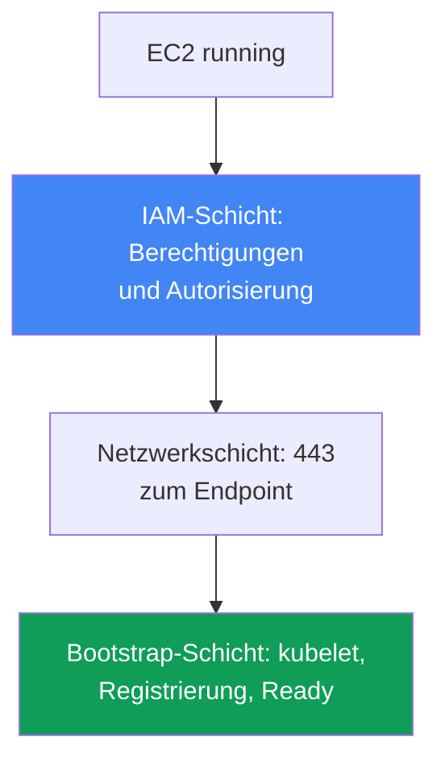
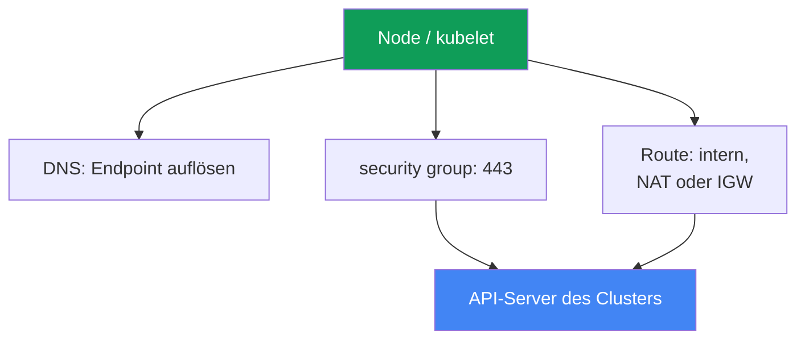

[Русская версия](ru.md) · [Eng version](en.md) · [Versión en español](es.md) · [Version française](fr.md) · [ქართული ვერსია](ge.md) · [繁體中文版](tw.md) · [日本語版](jp.md)
# Kapitel 45. Node ist dem Cluster nicht beigetreten: IAM, SG, user data, bootstrap, kubelet

> **Wie es weitergeht.** Hier beginnt Teil 8 - Troubleshooting. Wir starten mit dem häufigsten
> Start-Incident: EC2-Instances wurden erstellt, aber im Cluster gibt es keine Nodes. Wir behandeln
> eine systematische Diagnose nach Schichten (IAM, Netzwerk, bootstrap, kubelet). Verwandte Themen
> behandeln andere Kapitel: Aufbau von bootstrap, AMI und nodeadm - Kapitel 10, VPC CNI und die
> Vergabe von IPs an Pods - Kapitel 8, access entries und aws-auth - Kapitel 5, tiefergehende
> Netzwerkfehler (SG, NACL, DNS) - Kapitel 46, sowie Zugriff und IAM im Detail - Kapitel 47. Hier
> geht es darum, innerhalb von 15 Minuten herauszufinden, auf welcher Schicht eine Node hängt und
> womit das geprüft wird.

## 45.1. Instances sind vorhanden, aber keine Nodes

Sie haben eine managed node group erstellt. Die Konsole zeigt muntere EC2-Instances mit dem Status
`running`, aber:

```bash
kubectl get nodes
# No resources found
```

Zeit vergeht, die node group wechselt nicht zu `ACTIVE`, sondern die group selbst in den Zustand
`CREATE_FAILED` oder `DEGRADED`. In der Beschreibung der group ist zu sehen, worüber sie sich
konkret beschwert:

```bash
aws eks describe-nodegroup --cluster-name prod --nodegroup-name ng-1 \
  --query 'nodegroup.health.issues'
# [
#   {
#     "code": "NodeCreationFailure",
#     "message": "Instances failed to join the kubernetes cluster",
#     "resourceIds": ["i-0abc...", "i-0def..."]
#   }
# ]
```

`NodeCreationFailure` ist ein health issue, den EKS setzt, wenn Nodes einer managed node group
nicht innerhalb von 15 Minuten nach dem Start dem Cluster beigetreten sind. Die Meldung `Instances
failed to join the kubernetes cluster` ist wörtlich zu nehmen: Die EC2-Instance lebt, aber `kubectl
get nodes` sieht sie nicht.

Der Kerngedanke des Kapitels: „Node ist nicht beigetreten“ ist nicht ein einzelner Fehler, sondern
eine Fehlerklasse auf verschiedenen Schichten. Eine EC2-Instance muss die Kette durchlaufen:
IAM-Berechtigungen erhalten, den Endpoint des API-Servers über das Netzwerk erreichen, user data
und bootstrap ausführen, kubelet starten, sich registrieren und die Autorisierung im Cluster
bestehen. Ein Abbruch an jedem Glied führt zum selben Symptom - einer leeren Ausgabe von `kubectl
get nodes`. Daher wird nicht auf Verdacht repariert, sondern die Schichten werden der Reihe nach
durchgegangen. Im Folgenden die Schichten von oben nach unten, in Abschnitt 45.6 dann die Checkliste
und Werkzeuge zur Eingrenzung des Abbruchs.



## 45.2. IAM-Schicht: Berechtigungen der Node und Autorisierung im Cluster

Die IAM-Schicht hat zwei unabhängige Teile, die ständig verwechselt werden.

**Erster Teil - Berechtigungen der node instance role.** An die Rolle der Node (nicht das instance
profile, sondern genau die Rolle) müssen folgende managed policies angehängt sein:

| Policy | Wofür |
|---|---|
| `AmazonEKSWorkerNodePolicy` | kubelet beschreibt EC2-Ressourcen in der VPC, Arbeit mit dem Cluster |
| `AmazonEC2ContainerRegistryReadOnly` | Images aus ECR ziehen (auch Netzwerk-Add-ons) |
| `AmazonEKS_CNI_Policy` | für VPC CNI erforderlich, wenn ihm keine eigene Rolle über IRSA gegeben wurde (Kapitel 16) |

`AmazonEKS_CNI_Policy` auf der Node-Rolle ist nur für einen Cluster mit der Familie `IPv4` nötig
und wenn CNI nicht in eine eigene Rolle ausgelagert wurde. Es wird empfohlen, CNI eine eigene Rolle
zu geben (Kapitel 8), dann kann diese Policy auf der Node-Rolle entfallen. Neuer für Images ist
`AmazonEC2ContainerRegistryPullOnly`; `AmazonEC2ContainerRegistryReadOnly` ist ebenfalls gültig
und häufiger anzutreffen.

**Zweiter Teil, und das ist die häufigste Ursache - Autorisierung der Rolle im Cluster.** Es reicht
nicht, der Rolle IAM-Berechtigungen zu geben: Die Node-Rolle selbst muss innerhalb von Kubernetes
autorisiert sein, sonst authentifiziert sich kubelet bei AWS, besteht aber die authorization im
Cluster nicht und die Node registriert sich nicht. Die Autorisierung wird auf einem von zwei Wegen
vergeben (Kapitel 5):

- **EKS access entry vom Typ `EC2_LINUX`** (oder `EC2_WINDOWS`) für den ARN der Node-Rolle - der
  neue Weg.
- **Mapping in der ConfigMap `aws-auth`** - ein veralteter, aber weiterhin funktionierender Weg.

```bash
# sieht der Cluster die Node-Rolle über access entries?
aws eks list-access-entries --cluster-name prod
# veralteter Weg: Mappings in aws-auth
kubectl -n kube-system get configmap aws-auth -o yaml
```

Eine managed node group legt den Eintrag normalerweise selbst bei der Erstellung der group an. Wenn
der Eintrag gelöscht oder manuell verändert wurde, treten Nodes nicht mehr bei. Entscheidend: Im
principal wird der ARN genau der **Node-Rolle** angegeben, nicht der des instance profile, und der
ARN der Rolle darf außer `/` keinen path enthalten. Für self-managed Nodes und benutzerdefinierte
Instances wird ein access entry (oder Mapping) manuell angelegt - wird das vergessen, ist das
Symptom exakt dieselbe leere Ausgabe von `kubectl get nodes`.

## 45.3. Netzwerkschicht: API-Server auf 443 erreichen

kubelet registriert sich, indem es den Endpoint des API-Servers des Clusters über HTTPS auf Port 443
anspricht. Kein Netzwerkpfad - keine Registrierung. Folgendes wird der Reihe nach geprüft:

- **Security group.** Der Verkehr zwischen Nodes und control plane läuft über die cluster security
  group. Regeln müssen ausgehendes 443 von der Node zum Endpoint und die Verbindung mit der control
  plane erlauben. Wenn Nodes mit einer eigenen SG gestartet werden, muss diese den nötigen Verkehr
  zum Cluster und zurück zulassen.
- **Endpoint-Typ des Clusters.** Bei einem privaten Endpoint (private) löst die Node seine private
  Adresse über eine Route 53 private hosted zone innerhalb der VPC auf und nutzt internes Routing.
  Bei einem public Endpoint ist ein Weg nach außen erforderlich: NAT gateway für ein privates subnet
  oder öffentliche IP und IGW für ein öffentliches. Ein klassischer Fehler ist eine Node in einem
  privaten subnet ohne Route zu NAT.
- **DNS-Auflösung des Endpoints.** Die Node muss den FQDN des Cluster-Endpoints auflösen. Wenn die
  VPC eigene DHCP options ausliefert, müssen `domain-name` und `domain-name-servers` im Satz stehen
  (standardmäßig `AmazonProvidedDNS`). Ohne korrektes DNS schreibt kubelet `node "" not found` ins
  Log.

Tiefergehende Netzwerkfehler (ENI exhausted, NACL, DNS im Detail, unhealthy targets) behandelt
Kapitel 46. Hier ist eines wichtig: Wenn IAM in Ordnung ist, die Node aber weiterhin nicht erscheint,
ist das Netzwerk zum Endpoint auf 443 der nächste Verdächtige.



## 45.4. Schicht user data und bootstrap

Damit eine Instance zur Node wird, wird beim Start bootstrap aus user data ausgeführt: Es erhält
Clustername, API-Endpoint und CA-Zertifikat und konfiguriert kubelet. Der Mechanismus hängt vom AMI
ab (Kapitel 10):

- **AL2** (Amazon Linux 2, in neuen Versionen nicht mehr unterstützt) - das Skript
  `/etc/eks/bootstrap.sh`, dem der Clustername und Parameter über `--apiserver-endpoint`,
  `--b64-cluster-ca` übergeben werden.
- **AL2023 und Bottlerocket** - `nodeadm` und ein Objekt `NodeConfig` (YAML) mit den Feldern
  `cluster.name`, `apiServerEndpoint`, `certificateAuthority`. Die managed node group erstellt dies
  für Sie.

Hier kann es scheitern:

- **Benutzerdefiniertes AMI ohne korrektes bootstrap.** Ein eigenes Image ohne Aufruf von
  `bootstrap.sh` oder ohne `nodeadm` tritt nicht bei: kubelet ist schlicht nicht für diesen Cluster
  konfiguriert.
- **Fehlerhafte Clusterdaten.** Ein Fehler im Clusternamen, Endpoint oder CA in user data führt zu
  einem falschen `/var/lib/kubelet/kubeconfig`, und die Node geht zum falschen Ziel oder besteht TLS
  nicht.
- **Defektes cloud-init.** Ein Tippfehler in user data des launch template, falsches MTU,
  abgebrochenes cloud-init - und bootstrap läuft nicht zu Ende. Das zeigt das cloud-init-Log
  (Abschnitt 45.6).

Bei einer managed node group ohne benutzerdefiniertes launch template ist diese Schicht fast immer
in Ordnung: EKS generiert user data. Sie sollten sie verdächtigen, wenn ein eigenes AMI oder launch
template verwendet wird.

## 45.5. Schicht kubelet

Auch mit korrektem bootstrap kann kubelet nicht starten oder in einer Schleife abstürzen. Auf der
Node wird Folgendes geprüft (Zugang über SSM Session Manager, Abschnitt 45.6):

```bash
# Status und letzte Logs des kubelet-Daemons
systemctl status kubelet
journalctl -u kubelet -n 200 --no-pager
```

Typische Bilder:

- **kubelet läuft nicht oder startet neu.** Falsche Flags, beschädigtes `kubeconfig`, ein Problem
  mit dem Node-Zertifikat - kubelet kann sich nicht registrieren. Im Log steht die Ursache des
  Absturzes.
- **`node "" not found`** - normalerweise ein DNS-Problem oder ein fehlender private DNS name der
  Node (siehe Abschnitt 45.3).
- **Autorisierungsfehler bei der Registrierung** - kubelet hat den API-Server erreicht, aber eine
  Ablehnung erhalten: Das führt zurück zum access entry oder `aws-auth` aus Abschnitt 45.2.

Ein wichtiger Sonderfall ist die **sichtbare Node, die aber `NotReady` ist**. Hier lebt kubelet und
hat sich registriert, also haben IAM, Netzwerk und bootstrap funktioniert. Meist bedeutet `NotReady`
bei einem lebenden kubelet, dass CNI nicht bereit ist: Der Pod `aws-node` ist nicht gestartet, Pods
werden keine IPs zugewiesen und kubelet hält die Node wegen `NetworkNotReady` auf `NotReady`. Das
ist bereits das Gebiet von VPC CNI (Kapitel 8), nicht von „Node ist nicht beigetreten“. Diese beiden
Symptome zu unterscheiden - leere Liste gegenüber `NotReady` - ist wichtig: Sie führen zu
unterschiedlichen Schichten.

## 45.6. Reihenfolge der Diagnose und Werkzeuge

Die Diagnose wird von oben nach unten geführt, von „lebt die Instance überhaupt?“ bis zu den
kubelet-Logs. Die zentralen Werkzeuge:

```bash
# 1. was sagt EKS selbst über die node group?
aws eks describe-nodegroup --cluster-name prod --nodegroup-name ng-1 \
  --query 'nodegroup.health.issues'
# 2. sieht der Cluster Nodes?
kubectl get nodes
# 3. ist die Node-Rolle autorisiert?
aws eks list-access-entries --cluster-name prod
# 4. auf der Node über SSM Session Manager: bootstrap-/cloud-init-Log
sudo cat /var/log/cloud-init-output.log
# 5. auf der Node: kubelet-Logs
journalctl -u kubelet -n 200 --no-pager
```

Zugang zur Node ohne SSH erfolgt über **SSM Session Manager** (SSM agent und Berechtigungen sind
nötig, Kapitel 47): Das ist sicherer als offenes SSH und funktioniert auch ohne öffentliche IP. Ist
SSM nicht verfügbar, bleiben die Konsolenausgabe der Instance (system log) und `/var/log`.

Checkliste „Symptom - wahrscheinliche Ursache - was prüfen“:

| Symptom | Wahrscheinliche Ursache | Was prüfen |
|---|---|---|
| `NodeCreationFailure`, keine Nodes | Node-Rolle nicht autorisiert | `aws eks list-access-entries`, `aws-auth` |
| keine Nodes, IAM in Ordnung | kein Pfad zum API auf 443 | SG, NAT-/IGW-Route, Endpoint-Typ |
| keine Nodes, privater Cluster | Endpoint lässt sich nicht auflösen | DNS, DHCP options set in der VPC |
| keine Nodes, benutzerdefiniertes AMI | bootstrap wurde nicht ausgeführt | `/var/log/cloud-init-output.log` |
| keine Nodes, kubelet stürzt ab | beschädigtes kubeconfig/Zertifikat | `journalctl -u kubelet` |
| Node vorhanden, aber `NotReady` | CNI nicht bereit, Pods haben keine IPs | Pod `aws-node`, Node-Ereignisse (Kapitel 8) |
| im Log `node "" not found` | kein private DNS name | DHCP options, DNS in der VPC |

Die Logik ist einfach: Zuerst EKS fragen (`describe-nodegroup`), dann die Autorisierung der Rolle
prüfen (günstig und am häufigsten schuld), dann das Netzwerk zum Endpoint und erst danach für
cloud-init- und kubelet-Logs auf die Node gehen. Diese Reihenfolge schließt die häufigsten Ursachen
zuerst aus.

## 45.7. So wird es in der Produktion eingesetzt

- **Zuerst die Autorisierung der Node-Rolle prüfen.** Ein fehlender access entry (oder ein
  `aws-auth`-Mapping) für den ARN der Node-Rolle ist die häufigste Ursache, und die Prüfung ist
  günstig: ein `list-access-entries`.
- **Zugang zur Node vorher einrichten.** Auf dem AMI werden SSM agent installiert und der Node-Rolle
  SSM-Berechtigungen gegeben, um während eines Incidents über Session Manager hineinzukommen statt
  SSH für die Öffentlichkeit zu öffnen.
- **IAM-Rollen für Nodes als Code verwalten.** Drei managed policies und die trust policy werden in
  Terraform beschrieben (Kapitel 4), damit eine neue node group nicht mit eingeschränkten
  Berechtigungen startet.
- **Benutzerdefinierte AMIs und launch templates separat testen.** Jedes eigene Image oder user data
  wird auf einer Node ausgeführt und `cloud-init-output.log` gelesen, bevor es auf den gesamten Park
  ausgerollt wird.
- **„Keine Nodes“ und `NotReady` unterscheiden.** Das erste Symptom betrifft die Schichten
  IAM/Netzwerk/bootstrap; das zweite bei lebendem kubelet fast immer CNI (Kapitel 8). Nicht
  verwechseln, damit nicht in der falschen Schicht gesucht wird.
- **Nicht 15 Minuten blind warten.** `describe-nodegroup` zeigt den health issue sofort; darauf wird
  geschaut, statt zu raten, ob die group noch hochkommt.

## 45.8. Mini-Glossar

- **NodeCreationFailure** - health issue einer managed node group: Nodes sind dem Cluster nicht
  innerhalb von 15 Minuten nach dem Start beigetreten.
- **node instance role** - IAM-Rolle, die eine EC2-Node übernimmt; darüber ruft kubelet die AWS API
  auf.
- **access entry vom Typ `EC2_LINUX`** - Eintrag, der den ARN einer Node-Rolle im Cluster
  autorisiert (Kapitel 5).
- **aws-auth ConfigMap** - veraltete Methode zum Mapping von IAM-Rollen und -Benutzern in den
  Cluster.
- **cluster security group** - SG, über die Verkehr zwischen Nodes und control plane läuft.
- **private / public endpoint** - Zugriffsmodus für den API-Server des Clusters (Kapitel 2).
- **bootstrap.sh** - Skript zur Konfiguration von kubelet auf AL2 aus user data.
- **nodeadm / NodeConfig** - Konfiguration einer Node auf AL2023 und Bottlerocket (Kapitel 10).
- **SSM Session Manager** - Zugriff auf eine Instance ohne SSH über den SSM-Agent.
- **NotReady bei lebendem kubelet** - normalerweise ist CNI nicht bereit und Pods bekommen keine IPs
  (Kapitel 8).

## 45.9. Zusammenfassung des Kapitels

- „Node ist nicht beigetreten“ ist eine Fehlerklasse auf verschiedenen Schichten, nicht ein
  einzelner Fehler; das Symptom ist eines (leeres `kubectl get nodes` und `NodeCreationFailure`),
  die Ursachen sind verschieden.
- Die Diagnose wird nach Schichten von oben nach unten geführt: IAM (Berechtigungen und
  Autorisierung), Netzwerk zum API auf 443, user data und bootstrap, kubelet, Registrierung.
- Die häufigste Ursache ist Autorisierung: Der Node-Rolle fehlt ein access entry vom Typ
  `EC2_LINUX` (oder ein Mapping in `aws-auth`), während ihre IAM-Berechtigungen in Ordnung sein
  können. Dies wird als Erstes geprüft.
- Die IAM-Berechtigungen der Node-Rolle sind `AmazonEKSWorkerNodePolicy`,
  `AmazonEC2ContainerRegistryReadOnly` und, wenn CNI nicht in eine eigene Rolle ausgelagert ist,
  `AmazonEKS_CNI_Policy`.
- Netzwerk: Es wird ein Pfad zum Endpoint auf 443 benötigt - SG-Regeln, Route (NAT/IGW) sowie beim
  private Endpoint die Auflösung seiner Adresse über DNS und ein korrektes DHCP options set.
- bootstrap: auf AL2 `bootstrap.sh`, auf AL2023 `nodeadm`/`NodeConfig`; ein benutzerdefiniertes AMI
  oder defektes cloud-init ist bei eigenen Images eine häufige Ursache und in
  `cloud-init-output.log` sichtbar.
- kubelet wird mit `journalctl -u kubelet` geprüft; `node "" not found` ist DNS, während `NotReady`
  bei lebendem kubelet gewöhnlich CNI (Kapitel 8) und eine andere Schicht bedeutet.
- Werkzeuge: `describe-nodegroup` health, `kubectl get nodes`, `list-access-entries`, auf der Node
  über SSM Session Manager dann `cloud-init-output.log` und kubelet-Logs.

## 45.10. Wie dies in der praktischen Arbeit hilft

Im Bereitschaftsdienst sieht dieser Incident stets ähnlich beunruhigend und zugleich einfach aus:
Die node group wird rot, es gibt keine Nodes und die Anwendung verteilt sich nicht auf neue
Instances. Die Versuchung ist, auf die Node zu gehen und wahllos alles zu lesen. Besser ist, die
Schichten der Reihe nach durchzugehen: `describe-nodegroup` fragen, den access entry der Node-Rolle
prüfen (meist ist er schuld und in einer Minute repariert), dann das Netzwerk zum Endpoint und danach
die Logs von cloud-init und kubelet. Diese Reihenfolge spart die 15 Minuten Wartezeit und schließt
die häufigen Ursachen zuerst aus, statt zu raten.

Bei der Planung des Parks wird dieselbe Logik zur Prävention. Die Node-Rolle mit drei Policies und
ihre Autorisierung im Cluster werden in Terraform beschrieben, SSM agent und seine Berechtigungen
sind im AMI vorgesehen, benutzerdefinierte Images und launch templates vor dem Rollout auf einer Node
geprüft. Dann startet eine neue node group vorhersagbar, und wenn sie doch ausfällt, wissen Sie schon,
auf welcher Schicht Sie suchen und womit Sie prüfen. Die Fähigkeit, „keine Nodes“ von `NotReady` zu
unterscheiden, spart Stunden: Das sind zwei verschiedene Schichten und zwei verschiedene Pläne.

## 45.11. Fragen zur Selbstkontrolle

1. Warum ist „Node ist nicht beigetreten“ eine Fehlerklasse und kein einzelner Fehler? Nennen Sie
   die Schichten.
2. Was ist der health issue `NodeCreationFailure` und wann setzt EKS ihn?
3. Welche drei managed policies benötigt die Node-Rolle und wann kann `AmazonEKS_CNI_Policy`
   entfallen?
4. Worin liegt der Unterschied zwischen IAM-Berechtigungen der Node-Rolle und ihrer Autorisierung
   im Cluster?
5. Warum ist ein fehlender access entry (oder ein `aws-auth`-Mapping) die häufigste Ursache und wie
   lässt sich das mit einem Befehl prüfen?
6. Was wird im principal angegeben - der ARN der Node-Rolle oder das instance profile? Warum ist
   das entscheidend?
7. Welchen Pfad zum API-Server benötigt eine Node und worin unterscheiden sich private und public
   endpoint?
8. Warum tritt eine Node in einem privaten subnet ohne NAT einem Cluster mit public endpoint nicht
   bei?
9. Wie unterscheidet sich bootstrap auf AL2 und AL2023, und wo scheitert ein benutzerdefiniertes
   AMI?
10. Wo wird geprüft, ob bootstrap ausgeführt wurde, und wo stehen die kubelet-Logs?
11. Was bedeutet `node "" not found` im kubelet-Log und wohin führt das bei der Diagnose?
12. Worin unterscheiden sich „keine Nodes“ und „Node ist vorhanden, aber `NotReady`“, und zu welcher
    Schicht führt jeweils das Symptom?
13. Wie gelangen Sie sicher ohne öffentliches SSH auf eine Node, und was ist dafür auf dem AMI nötig?

## Praxis

Das Kurslabor zu diesem Thema: [Labor 119 - Troubleshooting: Node erreicht Ready nicht (IAM, SG,
user data, kubelet)](../../labs/119/README_DE.MD). Das Kapitel hat kein eigenes separates Labor:
Es ist ein diagnostisches Runbook, das auf einem laufenden Cluster geübt wird. Alle Prüfungen aus dem
Kapitel können aber auch auf einem gesunden Cluster ausgeführt werden, um zu wissen, wie der
Normalzustand aussieht.

Fragen Sie zuerst EKS und Kubernetes, was sie über die Nodes denken:

```bash
# Nodes und ihr Status
kubectl get nodes -o wide
# health der node group: im Normalfall ist issues leer
aws eks describe-nodegroup --cluster-name prod --nodegroup-name ng-1 \
  --query 'nodegroup.health.issues'
# Autorisierung der Rollen: Es muss ein Eintrag für den ARN der Node-Rolle vorhanden sein
aws eks list-access-entries --cluster-name prod
```

Suchen Sie in der Ausgabe von `list-access-entries` den ARN der Node-Rolle - das ist genau die
Autorisierung, ohne die eine Node nicht beitritt. Gehen Sie dann über SSM Session Manager auf eine
beliebige funktionierende Node und sehen Sie sich an, wie erfolgreiches bootstrap und ein lebender
kubelet aussehen:

```bash
# cloud-init-/bootstrap-Log: am Ende eines erfolgreichen Starts stehen keine Fehler
sudo cat /var/log/cloud-init-output.log
# kubelet-Daemon: active (running)
systemctl status kubelet
journalctl -u kubelet -n 100 --no-pager
```

Vergleichen Sie das Bild mit der Checkliste aus Abschnitt 45.6: Bei einer gesunden Node hat
`describe-nodegroup` keine issues, die Node-Rolle ist in access entries vorhanden, cloud-init wurde
ohne Fehler abgeschlossen und kubelet befindet sich im Status `running`. Wenn Sie sich den
Normalzustand merken, erkennen Sie einen Abbruch schneller, wenn eine node group nicht hochkommt.

---
[Inhaltsverzeichnis](../README_DE.md) · [Kapitel 44](../44/de.md) · [Kapitel 46](../46/de.md)
