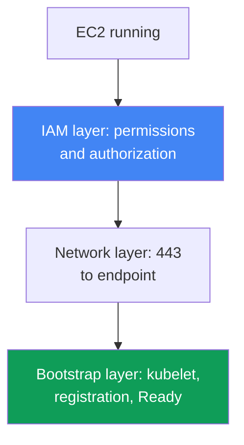
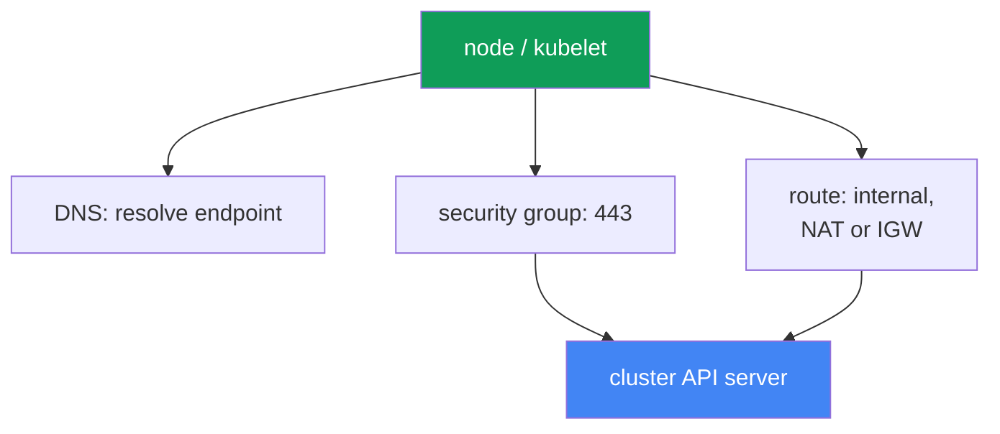

[Русская версия](ru.md) · [Versión en español](es.md) · [Version française](fr.md) · [Deutsche Version](de.md) · [ქართული ვერსია](ge.md) · [繁體中文版](tw.md) · [日本語版](jp.md)
# Chapter 45. Node did not join the cluster: IAM, SG, user data, bootstrap, kubelet

> **What is next.** Part 8, troubleshooting, starts here. We begin with the most common launch
> incident: EC2 instances are up, but there are no nodes in the cluster. We will cover systematic
> diagnosis by layer (IAM, network, bootstrap, kubelet). Related topics are covered by other
> chapters: bootstrap internals, AMIs, and nodeadm in chapter 10; VPC CNI and assigning IPs to Pods
> in chapter 8; access entries and aws-auth in chapter 5; network failures in depth (SG, NACL, DNS)
> in chapter 46; and access and IAM in detail in chapter 47. Here, we cover how to find the layer
> where a node is stuck within 15 minutes and which tools to use.

## 45.1. Instances exist, but there are no nodes

You created a managed node group. The console shows healthy EC2 instances in the `running` state,
but:

```bash
kubectl get nodes
# No resources found
```

Time passes, the node group does not become `ACTIVE`, and the group itself enters the
`CREATE_FAILED` or `DEGRADED` state. The group description shows exactly what it is unhappy about:

```bash
aws eks describe-nodegroup --cluster-name prod --nodegroup-name ng-1 \
  --query 'nodegroup.health.issues'
# [
#   {
#     "code": "NodeCreationFailure",
#     "message": "Instances failed to join the kubernetes cluster",
#     "resourceIds": ["i-0abc...", "i-0def..."]
#   }
# ]
```

`NodeCreationFailure` is a health issue that EKS reports when managed node group nodes have not
joined the cluster within 15 minutes of launch. The message `Instances failed to join the
kubernetes cluster` is literal: EC2 is alive, but `kubectl get nodes` cannot see it.

The key idea of this chapter is that “node did not join” is not one error but a class of failures
at different layers. An EC2 instance must complete a chain: obtain IAM permissions, reach the API
server endpoint over the network, run user data and bootstrap, start kubelet, register, and pass
cluster authorization. A break at any link produces the same symptom: an empty `kubectl get nodes`.
So do not fix this by guessing; walk the layers in order. The layers are shown top to bottom below,
and section 45.6 provides a checklist and tools to localize the break.



## 45.2. IAM layer: node permissions and cluster authorization

The IAM layer has two independent parts, and they are constantly confused.

**First part: node instance role permissions.** The node role (not the instance profile, but the
role itself) must have these managed policies attached:

| Policy | Purpose |
|---|---|
| `AmazonEKSWorkerNodePolicy` | The kubelet describes EC2 resources in the VPC and works with the cluster |
| `AmazonEC2ContainerRegistryReadOnly` | Pull images from ECR, including network add-ons |
| `AmazonEKS_CNI_Policy` | Required by VPC CNI if it has not been given a separate role through IRSA (chapter 16) |

`AmazonEKS_CNI_Policy` is needed on the node role only for a cluster with the `IPv4` family and
when CNI has not been moved to its own role. Giving CNI a separate role is recommended (chapter 8);
in that case the policy may be absent from the node role. The newer policy for images is
`AmazonEC2ContainerRegistryPullOnly`; `AmazonEC2ContainerRegistryReadOnly` is also valid and more
commonly encountered.

**Second part, and the most common root cause, is authorization of the role in the cluster.** Giving
a role IAM permissions is not enough: the node role itself must be authorized inside Kubernetes,
otherwise kubelet authenticates with AWS but does not pass authorization in the cluster and the
node does not register. Authorization is granted in one of two ways (chapter 5):

- **An EKS access entry of type `EC2_LINUX`** (or `EC2_WINDOWS`) for the node role ARN, the new
  approach.
- **A mapping in the `aws-auth` ConfigMap**, the deprecated but still working approach.

```bash
# whether the cluster sees the node role through access entries
aws eks list-access-entries --cluster-name prod
# deprecated path: mappings in aws-auth
kubectl -n kube-system get configmap aws-auth -o yaml
```

A managed node group usually creates the entry itself when the group is created. If the entry was
deleted or manually changed, nodes stop joining. Critical point: the principal must specify the ARN
of the **node role**, not the instance profile, and the role ARN must not contain a path other than
`/`. For self-managed nodes and custom instances, the access entry (or mapping) is created manually;
forget it, and the symptom is exactly the same empty `kubectl get nodes`.

## 45.3. Network layer: reach the API server on 443

Kubelet registers by calling the cluster API server endpoint over HTTPS on port 443. No network path
means no registration. Check the following in order:

- **Security group.** Traffic between nodes and the control plane goes through the cluster security
  group. Rules must allow outbound 443 from the node to the endpoint and communication with the
  control plane. If nodes launch with their own SG, it must allow the necessary traffic to and from
  the cluster.
- **Cluster endpoint type.** With a private endpoint, the node resolves its private address through
  the Route 53 private hosted zone inside the VPC and uses internal routing. A public endpoint needs
  an outward path: a NAT gateway for a private subnet or a public IP and IGW for a public subnet. A
  classic mistake is a node in a private subnet without a route to NAT.
- **Endpoint DNS resolution.** The node must resolve the cluster endpoint FQDN. If the VPC provides
  its own DHCP options, the set must contain `domain-name` and `domain-name-servers` (by default,
  `AmazonProvidedDNS`). Without correct DNS, kubelet writes `node "" not found` to the log.

Chapter 46 covers deeper network failures (ENI exhausted, NACL, DNS in detail, unhealthy targets).
The important point here is this: if IAM is in order but the node still has not appeared, the next
suspect is connectivity to the endpoint on 443.



## 45.4. User data and bootstrap layer

For an instance to become a node, bootstrap from user data runs at startup: it obtains the cluster
name, API endpoint, and CA certificate, then configures kubelet. The mechanics vary by AMI
(chapter 10):

- **AL2** (Amazon Linux 2, unsupported in new versions): the `/etc/eks/bootstrap.sh` script,
  which receives the cluster name and parameters through `--apiserver-endpoint` and
  `--b64-cluster-ca`.
- **AL2023 and Bottlerocket**: `nodeadm` and a `NodeConfig` (YAML) object with the fields
  `cluster.name`, `apiServerEndpoint`, and `certificateAuthority`. A managed node group builds this
  for you.

Where it breaks:

- **Custom AMI without correct bootstrap.** Your own image without a call to `bootstrap.sh` or
  without `nodeadm` will not join: kubelet is simply not configured for this cluster.
- **Incorrect cluster data.** An error in the cluster name, endpoint, or CA in user data produces
  an incorrect `/var/lib/kubelet/kubeconfig`, and the node either goes to the wrong place or fails
  TLS.
- **Broken cloud-init.** A typo in launch template user data, an incorrect MTU, or interrupted
  cloud-init prevents bootstrap from completing. This is visible in the cloud-init log
  (section 45.6).

For a managed node group without a custom launch template, this layer is nearly always correct:
EKS generates the user data. Suspect it when using your own AMI or launch template.

## 45.5. Kubelet layer

Even with correct bootstrap, kubelet may not start or may crash-loop. On the node itself, check the
following (access it through SSM Session Manager, section 45.6):

```bash
# kubelet daemon status and recent logs
systemctl status kubelet
journalctl -u kubelet -n 200 --no-pager
```

Typical patterns:

- **Kubelet is not running or is restarting.** Incorrect flags, a broken `kubeconfig`, or a node
  certificate problem prevents kubelet from registering. The log shows the cause of the failure.
- **`node "" not found`**: usually a DNS issue or a missing node private DNS name (see section
  45.3).
- **Authorization errors during registration**: kubelet reached the API but was denied. This leads
  back to the access entry or `aws-auth` in section 45.2.

One important special case is a **node that is visible but `NotReady`**. Here kubelet is alive and
has registered, so IAM, networking, and bootstrap have completed. Most often, `NotReady` with a
live kubelet means CNI is not ready: the `aws-node` Pod did not start, Pods are not assigned IPs,
and kubelet holds the node at `NotReady` because of `NetworkNotReady`. This belongs to VPC CNI
(chapter 8), not to “node did not join.” Distinguishing these two symptoms, an empty list versus
`NotReady`, matters because they involve different layers.

## 45.6. Diagnostic sequence and tools

Perform diagnostics top to bottom, from “is the instance even alive?” to kubelet logs. The core
tools are:

```bash
# 1. what EKS itself says about the node group
aws eks describe-nodegroup --cluster-name prod --nodegroup-name ng-1 \
  --query 'nodegroup.health.issues'
# 2. whether the cluster sees nodes
kubectl get nodes
# 3. whether the node role is authorized
aws eks list-access-entries --cluster-name prod
# 4. on the node through SSM Session Manager: bootstrap/cloud-init log
sudo cat /var/log/cloud-init-output.log
# 5. on the node: kubelet logs
journalctl -u kubelet -n 200 --no-pager
```

Access a node without SSH through **SSM Session Manager** (SSM Agent and permissions are required,
chapter 47): it is safer than exposing SSH and works even without a public IP. If SSM is unavailable,
the instance console output (system log) and `/var/log` remain.

Checklist, “symptom, probable cause, what to check”:

| Symptom | Probable cause | What to check |
|---|---|---|
| `NodeCreationFailure`, no nodes | node role is not authorized | `aws eks list-access-entries`, `aws-auth` |
| no nodes, IAM is in order | no path to API on 443 | SG, NAT/IGW route, endpoint type |
| no nodes, private cluster | endpoint does not resolve | DNS, DHCP options set in the VPC |
| no nodes, custom AMI | bootstrap did not run | `/var/log/cloud-init-output.log` |
| no nodes, kubelet crashes | broken kubeconfig/certificate | `journalctl -u kubelet` |
| node exists but is `NotReady` | CNI is not ready; Pods have no IPs | `aws-node` Pod, node events (chapter 8) |
| `node "" not found` in the log | no private DNS name | DHCP options, DNS in the VPC |

The logic is simple: first ask EKS (`describe-nodegroup`), then check node role authorization
(inexpensive, and most often the culprit), then connectivity to the endpoint, and only then go to
the node for cloud-init and kubelet logs. This order eliminates the most common causes first.

## 45.7. How it is applied in production

- **Check node role authorization first.** A missing access entry (or `aws-auth` mapping) for the
  node role ARN is the most common root cause, and the check is inexpensive: one
  `list-access-entries` call.
- **Prepare node access in advance.** Install SSM Agent on the AMI and grant the node role SSM
  permissions, so during an incident you can enter through Session Manager instead of exposing SSH
  to the public internet.
- **Keep the node IAM role as code.** Define the three managed policies and the trust policy in
  Terraform (chapter 4), so a new node group is not created with reduced permissions.
- **Test custom AMIs and launch templates separately.** Run every custom image or user data setup
  on one node and read `cloud-init-output.log` before rolling it out to the entire fleet.
- **Distinguish “no nodes” from `NotReady`.** The first symptom belongs to IAM/network/bootstrap
  layers; the second with a live kubelet is almost always CNI (chapter 8). Do not confuse them and
  investigate the wrong layer.
- **Do not wait blindly for 15 minutes.** `describe-nodegroup` shows the health issue immediately;
  inspect it rather than guessing whether the group will come up.

## 45.8. Mini-glossary

- **NodeCreationFailure**: a managed node group health issue; nodes did not join the cluster within
  15 minutes of launch.
- **node instance role**: the IAM role assumed by an EC2 node; kubelet uses it to call AWS APIs.
- **access entry of type `EC2_LINUX`**: an entry authorizing a node role ARN in the cluster
  (chapter 5).
- **aws-auth ConfigMap**: a deprecated way to map IAM roles and users into the cluster.
- **cluster security group**: the SG that carries traffic between nodes and the control plane.
- **private / public endpoint**: the access mode for the cluster API server (chapter 2).
- **bootstrap.sh**: the AL2 script from user data that configures kubelet.
- **nodeadm / NodeConfig**: node configuration on AL2023 and Bottlerocket (chapter 10).
- **SSM Session Manager**: SSH-free instance access through the SSM agent.
- **NotReady with a live kubelet**: CNI is usually not ready and Pods are not assigned IPs
  (chapter 8).

## 45.9. Chapter summary

- “Node did not join” is a class of failures at different layers, not one error. The symptom is
  the same (empty `kubectl get nodes` and `NodeCreationFailure`), but the causes differ.
- Diagnose top to bottom by layer: IAM (permissions and authorization), network access to the API
  on 443, user data and bootstrap, kubelet, and registration.
- The most common root cause is authorization: the node role lacks an access entry of type
  `EC2_LINUX` (or a mapping in `aws-auth`), even though IAM permissions may be in order. Check this
  first.
- Node role IAM permissions are `AmazonEKSWorkerNodePolicy`,
  `AmazonEC2ContainerRegistryReadOnly`, and, if CNI has not been moved to a separate role,
  `AmazonEKS_CNI_Policy`.
- Networking needs a path to the endpoint on 443: SG rules, a route (NAT/IGW), and, for a private
  endpoint, DNS resolution of its address and a correct DHCP options set.
- Bootstrap uses `bootstrap.sh` on AL2 and `nodeadm`/`NodeConfig` on AL2023. A custom AMI or broken
  cloud-init is a common cause with custom images and is visible in `cloud-init-output.log`.
- Inspect kubelet with `journalctl -u kubelet`; `node "" not found` is DNS, while `NotReady` with a
  live kubelet is usually CNI (chapter 8), a different layer.
- Tools: `describe-nodegroup` health, `kubectl get nodes`, `list-access-entries`, and, on the node
  through SSM Session Manager, `cloud-init-output.log` and kubelet logs.

## 45.10. How this helps in real work

On call, this incident looks equally alarming and equally simple: the node group turns red, there
are no nodes, and the application cannot spread onto new instances. The temptation is to enter a
node and read everything at random. It is better to walk the layers in order: call
`describe-nodegroup`, check the node role access entry (it is most often the culprit and takes a
minute to fix), then test connectivity to the endpoint, and finally inspect cloud-init and kubelet
logs. This sequence saves those 15 minutes of waiting and eliminates common causes first instead of
guessing.

When planning the fleet, the same logic becomes prevention. The node role with three policies and
its cluster authorization are described in Terraform; SSM Agent and its permissions are built into
the AMI; custom images and launch templates are tested on one node before rollout. Then a new node
group comes up predictably, and if it does fail, you already know which layer to search and which
tool to use. Being able to distinguish “no nodes” from `NotReady` saves hours: they are two
different layers and two different plans.

## 45.11. Self-check questions

1. Why is “node did not join” a class of failures rather than one error? Name the layers.
2. What is the `NodeCreationFailure` health issue and when does EKS report it?
3. Which three managed policies does a node role need, and when can `AmazonEKS_CNI_Policy` be
   omitted?
4. What is the difference between node role IAM permissions and its authorization in the cluster?
5. Why is a missing access entry (or `aws-auth` mapping) the most common root cause, and how can
   you check it with one command?
6. What belongs in the principal, the node role ARN or the instance profile? Why is this critical?
7. Which path to the API server does a node need, and how do private and public endpoints differ?
8. Why will a node in a private subnet without NAT not join a cluster with a public endpoint?
9. How does bootstrap differ between AL2 and AL2023, and where does a custom AMI fail?
10. Where can you check whether bootstrap ran, and where can you find kubelet logs?
11. What does `node "" not found` in the kubelet log mean, and where does it lead?
12. What is the difference between “no nodes” and “the node exists but is `NotReady`,” and which
    layer does each symptom point to?
13. How can you access a node safely without public SSH, and what is required on the AMI?

## Practice

The course lab for this topic is [lab 119, Troubleshooting: node does not reach Ready (IAM, SG, user
data, kubelet)](../../labs/119/README.MD). This chapter has no separate lab of its own: it is a
diagnostic runbook to practice on a live cluster. However, you can run every check in this chapter
on a healthy cluster to learn what normal looks like.

First, ask EKS and Kubernetes what they think about the nodes:

```bash
# nodes and their status
kubectl get nodes -o wide
# node group health: normally issues is empty
aws eks describe-nodegroup --cluster-name prod --nodegroup-name ng-1 \
  --query 'nodegroup.health.issues'
# role authorization: there must be an entry for the node role ARN
aws eks list-access-entries --cluster-name prod
```

Find the node role ARN in the `list-access-entries` output: that is the authorization without which
the node cannot join. Then enter any working node through SSM Session Manager and see what a
successful bootstrap and live kubelet look like:

```bash
# cloud-init/bootstrap log: there are no errors at the end of a successful launch
sudo cat /var/log/cloud-init-output.log
# kubelet daemon: active (running)
systemctl status kubelet
journalctl -u kubelet -n 100 --no-pager
```

Compare the result against the checklist in section 45.6: on a healthy node,
`describe-nodegroup` has no issues, the node role is in access entries, cloud-init completed without
errors, and kubelet is `running`. Once you remember the normal state, you will identify a break
faster when a node group does not come up.

---
[Table of contents](../README.md) · [Chapter 44](../44/en.md) · [Chapter 46](../46/en.md)
