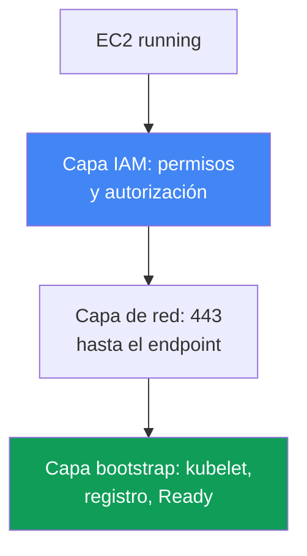
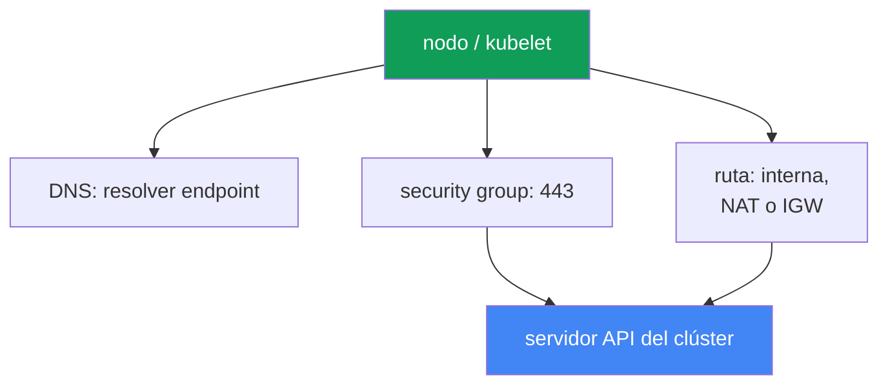

[Русская версия](ru.md) · [Eng version](en.md) · [Version française](fr.md) · [Deutsche Version](de.md) · [ქართული ვერსია](ge.md) · [繁體中文版](tw.md) · [日本語版](jp.md)
# Capítulo 45. El nodo no se unió al clúster: IAM, SG, user data, bootstrap, kubelet

> **Qué sigue.** Aquí comienza la Parte 8 - troubleshooting. Empezamos con el incidente de arranque más frecuente: las instancias EC2 se levantaron, pero no hay nodos en el clúster. Veremos un diagnóstico sistemático por capas (IAM, red, bootstrap, kubelet). Los temas relacionados se tratan en otros capítulos: el funcionamiento de bootstrap, AMI y nodeadm - capítulo 10; VPC CNI y asignación de IP a pods - capítulo 8; access entries y aws-auth - capítulo 5; fallos de red en profundidad (SG, NACL, DNS) - capítulo 46; acceso e IAM en detalle - capítulo 47. Aquí veremos cómo encontrar en 15 minutos en qué capa se quedó bloqueado el nodo y con qué herramientas hacerlo.

## 45.1. Hay instancias, pero no nodos

Creaste un managed node group. La consola muestra instancias EC2 activas con estado `running`, pero:

```bash
kubectl get nodes
# No resources found
```

Pasa el tiempo, el node group no pasa a `ACTIVE` y el propio grupo termina en estado
`CREATE_FAILED` o `DEGRADED`. En la descripción del grupo se ve exactamente qué le desagrada:

```bash
aws eks describe-nodegroup --cluster-name prod --nodegroup-name ng-1 \
  --query 'nodegroup.health.issues'
# [
#   {
#     "code": "NodeCreationFailure",
#     "message": "Instances failed to join the kubernetes cluster",
#     "resourceIds": ["i-0abc...", "i-0def..."]
#   }
# ]
```

`NodeCreationFailure` es un health issue que EKS establece si los nodos de un managed node group
no se conectaron al clúster durante los 15 minutos posteriores al arranque. El mensaje `Instances failed to join the
kubernetes cluster` es literal: EC2 está vivo, pero `kubectl get nodes` no lo ve.

La idea clave del capítulo: «el nodo no se unió» no es un único error, sino una clase de fallos en distintas
capas. La instancia EC2 debe recorrer una cadena: obtener permisos IAM, alcanzar el endpoint del
servidor API por la red, ejecutar user data y bootstrap, levantar kubelet, registrarse y superar la
autorización en el clúster. Una interrupción en cualquier eslabón da el mismo síntoma -
`kubectl get nodes` vacío. Por eso no se corrige al azar, sino recorriendo las capas en orden. A continuación están las capas
de arriba abajo y, en la sección 45.6, el checklist y las herramientas para localizar la interrupción.



## 45.2. Capa IAM: permisos del nodo y autorización en el clúster

La capa IAM tiene dos partes independientes, y se confunden constantemente.

**Primera parte - permisos del node instance role.** A la función del nodo (no al instance profile, sino a la función propiamente dicha)
deben adjuntarse las managed policies:

| Política | Para qué sirve |
|---|---|
| `AmazonEKSWorkerNodePolicy` | kubelet describe recursos EC2 en la VPC, interacción con el clúster |
| `AmazonEC2ContainerRegistryReadOnly` | descargar imágenes de ECR (incluidos los addons de red) |
| `AmazonEKS_CNI_Policy` | la necesita VPC CNI si no se le ha dado una función separada mediante IRSA (capítulo 16) |

`AmazonEKS_CNI_Policy` en la función del nodo solo se necesita para un clúster con familia `IPv4` y cuando CNI
no se trasladó a su propia función. Se recomienda dar a CNI una función separada (capítulo 8), entonces esta política puede no estar
presente en la función del nodo. Para imágenes, una opción más reciente es `AmazonEC2ContainerRegistryPullOnly`;
`AmazonEC2ContainerRegistryReadOnly` también es válida y se encuentra con mayor frecuencia.

**Segunda parte, y la causa raíz más frecuente - la autorización de la función dentro del clúster.** No basta con dar permisos
IAM a la función: la propia función del nodo debe estar autorizada dentro de Kubernetes; de lo contrario kubelet
se autentica en AWS, pero no supera la authorization en el clúster y el nodo no se registra.
La autorización se concede de una de dos maneras (capítulo 5):

- **EKS access entry de tipo `EC2_LINUX`** (o `EC2_WINDOWS`) para el ARN de la función del nodo - la vía nueva.
- **Mapeo en el ConfigMap `aws-auth`** - un método obsoleto, pero que todavía funciona.

```bash
# ¿ve el clúster la función del nodo mediante access entries?
aws eks list-access-entries --cluster-name prod
# vía obsoleta: mapeos en aws-auth
kubectl -n kube-system get configmap aws-auth -o yaml
```

Un managed node group suele crear la entrada por sí mismo al crear el grupo. Si la entrada se eliminó o
se modificó manualmente, los nodos dejan de unirse. Es crítico: en el principal se especifica el ARN de la
**función del nodo**, no el instance profile, y el ARN de la función no debe contener ningún path salvo `/`.
Para nodos self-managed e instancias personalizadas, el access entry (o el mapeo) se crea manualmente - se olvida,
y el síntoma es exactamente el mismo: `kubectl get nodes` vacío.

## 45.3. Capa de red: alcanzar el servidor API en 443

kubelet se registra accediendo al endpoint del servidor API del clúster por HTTPS en el puerto 443. Si no hay
ruta de red, no hay registro. Esto es lo que se comprueba en orden:

- **Security group.** El tráfico entre los nodos y el control plane pasa por el cluster security group.
  Las reglas deben permitir tráfico saliente 443 del nodo al endpoint y conectividad con el control plane. Si los nodos
  se lanzan con su propio SG, este debe permitir el tráfico necesario hacia el clúster y de vuelta.
- **Tipo de endpoint del clúster.** Con un endpoint privado (private), el nodo resuelve su dirección privada
  mediante la Route 53 private hosted zone dentro de la VPC y se conecta por el enrutamiento interno. Con un endpoint
  público se necesita una ruta hacia fuera: NAT gateway para una subred privada o IP pública e IGW
  para una pública. El error clásico es un nodo en una subred privada sin ruta hacia NAT.
- **Resolución DNS del endpoint.** El nodo debe resolver el FQDN del endpoint del clúster. Si la VPC entrega
  sus propias DHCP options, el conjunto debe incluir `domain-name` y `domain-name-servers` (por defecto
  `AmazonProvidedDNS`). Sin DNS correcto, kubelet escribe `node "" not found` en el log.

El capítulo 46 cubre fallos de red más profundos (ENI exhausted, NACL, DNS en detalle, unhealthy targets).
Aquí importa una cosa: si IAM está bien y el nodo sigue sin aparecer, el siguiente sospechoso es la
red hacia el endpoint en 443.



## 45.4. Capa de user data y bootstrap

Para que una instancia se convierta en nodo, al arrancar se ejecuta bootstrap desde user data: obtiene el nombre
del clúster, el endpoint API y el certificado CA, y configura kubelet. El mecanismo depende de la AMI (capítulo 10):

- **AL2** (Amazon Linux 2, sin soporte en versiones nuevas) - el script `/etc/eks/bootstrap.sh`,
  al que se pasan el nombre del clúster y parámetros mediante `--apiserver-endpoint`, `--b64-cluster-ca`.
- **AL2023 y Bottlerocket** - `nodeadm` y el objeto `NodeConfig` (YAML) con los campos `cluster.name`,
  `apiServerEndpoint`, `certificateAuthority`. El managed node group lo crea por ti.

Dónde se rompe:

- **AMI personalizada sin bootstrap correcto.** Una imagen propia sin invocar `bootstrap.sh` o sin
  `nodeadm` no se unirá: kubelet sencillamente no está configurado para este clúster.
- **Datos incorrectos del clúster.** Un error en el nombre del clúster, endpoint o CA en user data lleva a
  un `/var/lib/kubelet/kubeconfig` incorrecto, y el nodo se dirige a otro sitio o no supera TLS.
- **cloud-init roto.** Una errata en el user data del launch template, MTU incorrecta, un
  cloud-init interrumpido, y bootstrap no llega al final. Esto se ve en el log de cloud-init (sección 45.6).

Con un managed node group sin launch template personalizado, esta capa casi siempre está correcta: EKS genera el user
data. Conviene sospechar de ella cuando se usa una AMI o launch template propios.

## 45.5. Capa kubelet

Incluso con bootstrap correcto, kubelet puede no arrancar o caer en un ciclo. Esto es lo que se revisa en el propio
nodo (acceso mediante SSM Session Manager, sección 45.6):

```bash
# estado y últimos logs del daemon kubelet
systemctl status kubelet
journalctl -u kubelet -n 200 --no-pager
```

Patrones típicos:

- **kubelet no se inició o se reinicia.** Flags incorrectos, un `kubeconfig` dañado, un problema con
  el certificado del nodo - kubelet no puede registrarse. El log muestra la causa del fallo.
- **`node "" not found`** - normalmente es un problema de DNS o del private DNS name del nodo (véase la sección 45.3).
- **Errores de autorización durante el registro** - kubelet alcanzó la API, pero recibió un rechazo: esto
  nos devuelve al access entry o a `aws-auth` de la sección 45.2.

Un caso importante aparte - **el nodo es visible, pero está `NotReady`**. Aquí kubelet está vivo y se registró,
por lo que IAM, red y bootstrap funcionaron. Lo más frecuente es que `NotReady` con kubelet vivo signifique que
CNI no está listo: el pod `aws-node` no arrancó, no se asignan IP a los pods y kubelet mantiene el nodo
`NotReady` por `NetworkNotReady`. Esto ya es territorio de VPC CNI (capítulo 8), no «el nodo no se
unió». Distinguir estos dos síntomas - lista vacía frente a `NotReady` - es importante: llevan a capas distintas.

## 45.6. Orden de diagnóstico y herramientas

El diagnóstico se realiza de arriba abajo, desde «¿la instancia está siquiera viva?» hasta los logs de kubelet.
Herramientas de referencia:

```bash
# 1. qué dice el propio EKS sobre el node group
aws eks describe-nodegroup --cluster-name prod --nodegroup-name ng-1 \
  --query 'nodegroup.health.issues'
# 2. si el clúster ve los nodos
kubectl get nodes
# 3. si la función del nodo está autorizada
aws eks list-access-entries --cluster-name prod
# 4. en el nodo mediante SSM Session Manager: log de bootstrap/cloud-init
sudo cat /var/log/cloud-init-output.log
# 5. en el nodo: logs de kubelet
journalctl -u kubelet -n 200 --no-pager
```

El acceso al nodo sin SSH se obtiene mediante **SSM Session Manager** (se necesitan SSM agent y permisos, capítulo 47):
es más seguro que SSH abierto y funciona incluso sin IP pública. Si SSM no está disponible, quedan la salida de
consola de la instancia (system log) y `/var/log`.

Checklist «síntoma - causa probable - qué comprobar»:

| Síntoma | Causa probable | Qué comprobar |
|---|---|---|
| `NodeCreationFailure`, no hay nodos | la función del nodo no está autorizada | `aws eks list-access-entries`, `aws-auth` |
| no hay nodos, IAM está bien | no hay ruta a la API en 443 | SG, ruta NAT/IGW, tipo de endpoint |
| no hay nodos, clúster privado | el endpoint no se resuelve | DNS, DHCP options set en la VPC |
| no hay nodos, AMI personalizada | bootstrap no se ejecutó | `/var/log/cloud-init-output.log` |
| no hay nodos, kubelet cae | kubeconfig/certificado dañado | `journalctl -u kubelet` |
| hay nodo, pero `NotReady` | CNI no está listo, los pods no tienen IP | pod `aws-node`, eventos del nodo (capítulo 8) |
| `node "" not found` en el log | no hay private DNS name | DHCP options, DNS en la VPC |

La lógica es sencilla: primero preguntar a EKS (`describe-nodegroup`), luego comprobar la autorización de la función
(barato y, con frecuencia, esa es la culpable), después la red al endpoint y solo entonces entrar al nodo por los
logs de cloud-init y kubelet. Ese orden descarta primero las causas más comunes.

## 45.7. Cómo se aplica en producción

- **Se comprueba primero la autorización de la función del nodo.** La ausencia de un access entry (o mapeo en `aws-auth`)
  para el ARN de la función del nodo es la causa raíz más frecuente, y la comprobación es barata: una `list-access-entries`.
- **Se prepara el acceso al nodo por adelantado.** Se instala SSM agent en la AMI y se dan permisos SSM a la función del
  nodo, para entrar mediante Session Manager durante un incidente en vez de abrir SSH al mundo público.
- **Se mantienen las funciones IAM del nodo como código.** Las tres managed policies y la trust policy se describen en Terraform
  (capítulo 4), para que un nuevo node group no se levante con permisos recortados.
- **Se prueban por separado las AMI y launch template personalizados.** Toda imagen o user data propios se prueban
  en un solo nodo y se lee `cloud-init-output.log` antes de desplegarlos en toda la flota.
- **Se distinguen «no hay nodos» y `NotReady`.** El primer síntoma corresponde a las capas IAM/red/bootstrap; el segundo con
  kubelet vivo es casi siempre CNI (capítulo 8). No hay que confundirlos para no investigar la capa equivocada.
- **No se esperan 15 minutos a ciegas.** `describe-nodegroup` muestra el health issue inmediatamente; se consulta eso,
  en vez de adivinar si el grupo llegará a levantarse.

## 45.8. Mini glosario

- **NodeCreationFailure** - health issue de un managed node group: los nodos no se conectaron al clúster en los
  15 minutos posteriores al arranque.
- **node instance role** - función IAM asumida por el nodo EC2; desde ella kubelet accede a la API de AWS.
- **access entry de tipo `EC2_LINUX`** - entrada que autoriza el ARN de la función del nodo en el clúster (capítulo 5).
- **ConfigMap aws-auth** - método obsoleto de mapear funciones y usuarios IAM en el clúster.
- **cluster security group** - SG por el que pasa el tráfico entre los nodos y el control plane.
- **private / public endpoint** - modo de acceso al servidor API del clúster (capítulo 2).
- **bootstrap.sh** - script de configuración de kubelet en AL2 desde user data.
- **nodeadm / NodeConfig** - configuración del nodo en AL2023 y Bottlerocket (capítulo 10).
- **SSM Session Manager** - acceso a una instancia sin SSH mediante el agente SSM.
- **NotReady con kubelet vivo** - normalmente CNI no está listo y no se asignan IP a los pods (capítulo 8).

## 45.9. Resumen del capítulo

- «El nodo no se unió» es una clase de fallos en distintas capas, no un único error; el síntoma es uno
  (`kubectl get nodes` vacío y `NodeCreationFailure`), pero las causas son varias.
- El diagnóstico se realiza por capas de arriba abajo: IAM (permisos y autorización), red a la API en 443, user
  data y bootstrap, kubelet, registro.
- La causa raíz más frecuente es la autorización: a la función del nodo le falta un access entry de tipo `EC2_LINUX` (o
  un mapeo en `aws-auth`), aunque los permisos IAM puedan estar bien. Se comprueba primero.
- Los permisos IAM de la función del nodo son `AmazonEKSWorkerNodePolicy`, `AmazonEC2ContainerRegistryReadOnly` y,
  si CNI no se trasladó a una función separada, `AmazonEKS_CNI_Policy`.
- Red: se necesita una ruta al endpoint en 443 - reglas SG, ruta (NAT/IGW), y para un private endpoint,
  resolución de su dirección mediante DNS y DHCP options set correcto.
- bootstrap: en AL2, `bootstrap.sh`; en AL2023, `nodeadm`/`NodeConfig`; una AMI personalizada o
  cloud-init roto son causas frecuentes en imágenes propias, visibles en `cloud-init-output.log`.
- kubelet se revisa mediante `journalctl -u kubelet`; `node "" not found` indica DNS, y `NotReady`
  con kubelet vivo suele ser CNI (capítulo 8), otra capa.
- Herramientas: health de `describe-nodegroup`, `kubectl get nodes`, `list-access-entries`, y en el
  nodo mediante SSM Session Manager, `cloud-init-output.log` y los logs de kubelet.

## 45.10. Cómo resultará útil en el trabajo real

Durante una guardia, este incidente parece igual de aterrador e igual de simple: el node group se vuelve rojo,
no hay nodos y la aplicación no se reparte por las nuevas instancias. La tentación es entrar en el nodo y leer
todo indiscriminadamente. Es mejor recorrer las capas en orden: consultar `describe-nodegroup`, comprobar el access
entry de la función del nodo (con frecuencia es la culpable y se corrige en un minuto), luego la red al endpoint y,
después, los logs de cloud-init y kubelet. Este orden ahorra esos 15 minutos de espera y descarta las causas
frecuentes antes, en lugar de adivinar.

Al planificar la flota, la misma lógica se convierte en prevención. La función del nodo con tres políticas y su
autorización en el clúster se describen en Terraform, SSM agent y sus permisos se incluyen en la AMI, y las
imágenes personalizadas y launch template se prueban en un nodo antes de desplegarlas. Así, un nuevo node group
se levanta de forma predecible y, si falla, ya sabes en qué capa buscar y con qué herramienta hacerlo.
Saber distinguir «no hay nodos» de `NotReady` ahorra horas: son dos capas y dos planes diferentes.

## 45.11. Preguntas de autoevaluación

1. ¿Por qué «el nodo no se unió» es una clase de fallos y no un único error? Nombra las capas.
2. ¿Qué es el health issue `NodeCreationFailure` y cuándo lo establece EKS?
3. ¿Qué tres managed policies necesita la función del nodo y cuándo se puede omitir `AmazonEKS_CNI_Policy`?
4. ¿Cuál es la diferencia entre los permisos IAM de la función del nodo y su autorización en el clúster?
5. ¿Por qué la ausencia de un access entry (o mapeo en `aws-auth`) es la causa raíz más frecuente y cómo se
   comprueba con un solo comando?
6. ¿Qué se indica en el principal: el ARN de la función del nodo o el instance profile? ¿Por qué es crítico?
7. ¿Qué ruta al servidor API necesita el nodo y en qué se diferencian los endpoints private y public?
8. ¿Por qué un nodo en una subred privada sin NAT no se unirá a un clúster con endpoint public?
9. ¿Cómo difiere bootstrap en AL2 y AL2023, y dónde falla una AMI personalizada?
10. ¿Dónde se comprueba si bootstrap se ejecutó y dónde se ven los logs de kubelet?
11. ¿Qué significa `node "" not found` en el log de kubelet y hacia dónde orienta?
12. ¿Cuál es la diferencia entre «no hay nodos» y «hay un nodo, pero `NotReady`», y a qué capa conduce cada síntoma?
13. ¿Cómo entrar de forma segura a un nodo sin SSH público y qué se necesita en la AMI para ello?

## Práctica

La práctica del curso sobre este tema: [práctica 119 - Troubleshooting: el nodo no llega a Ready (IAM, SG, user
data, kubelet)](../../labs/119/README_ES.MD). El capítulo no tiene práctica propia independiente: es un
runbook de diagnóstico que se trabaja en un clúster vivo. Sin embargo,
todas las comprobaciones del capítulo pueden ejecutarse también en un clúster sano para saber cómo es el estado normal.

Primero pregunta a EKS y Kubernetes qué opinan de los nodos:

```bash
# nodos y su estado
kubectl get nodes -o wide
# health del node group: normalmente issues está vacío
aws eks describe-nodegroup --cluster-name prod --nodegroup-name ng-1 \
  --query 'nodegroup.health.issues'
# autorización de funciones: debe haber una entrada para el ARN de la función del nodo
aws eks list-access-entries --cluster-name prod
```

Busca en la salida de `list-access-entries` el ARN de la función del nodo: esa es precisamente la autorización sin
la cual el nodo no se une. Después, entra en cualquier nodo funcional mediante SSM Session Manager y
observa cómo son un bootstrap exitoso y un kubelet vivo:

```bash
# log de cloud-init/bootstrap: al final de un arranque exitoso no hay errores
sudo cat /var/log/cloud-init-output.log
# daemon kubelet: active (running)
systemctl status kubelet
journalctl -u kubelet -n 100 --no-pager
```

Compara el resultado con el checklist de la sección 45.6: en un nodo sano, `describe-nodegroup` no tiene issues,
la función del nodo está en access entries, cloud-init terminó sin errores y kubelet está en estado
`running`. Al recordar el estado normal, identificarás antes la interrupción cuando el node group no se levante.

---
[Índice](../README_ES.md) · [Capítulo 44](../44/es.md) · [Capítulo 46](../46/es.md)
