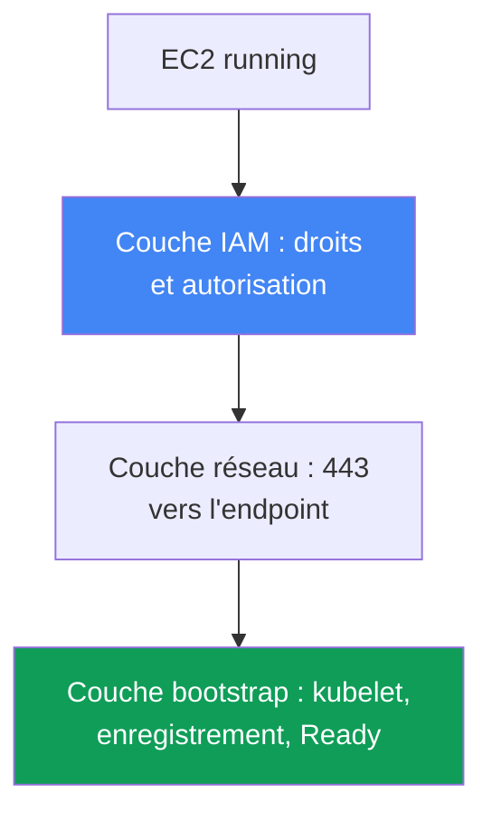
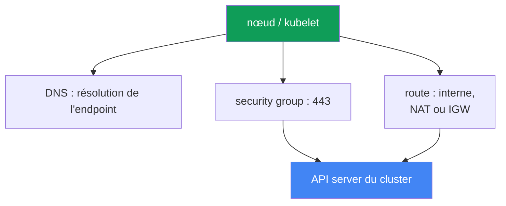

[Русская версия](ru.md) · [Eng version](en.md) · [Versión en español](es.md) · [Deutsche Version](de.md) · [ქართული ვერსია](ge.md) · [繁體中文版](tw.md) · [日本語版](jp.md)
# Chapitre 45. Le nœud ne rejoint pas le cluster : IAM, SG, user data, bootstrap, kubelet

> **La suite.** La partie 8, consacrée au troubleshooting, commence ici. Nous partons de l'incident de démarrage le plus fréquent : les instances EC2 sont lancées, mais aucun nœud n'apparaît dans le cluster. Nous verrons un diagnostic systématique par couches (IAM, réseau, bootstrap, kubelet). Les sujets connexes sont traités dans les chapitres suivants : fonctionnement interne du bootstrap, AMI et nodeadm au chapitre 10 ; VPC CNI et attribution d'IP aux pods au chapitre 8 ; access entries et aws-auth au chapitre 5 ; pannes réseau en profondeur (SG, NACL, DNS) au chapitre 46 ; accès et IAM en détail au chapitre 47. Ici, il s'agit de trouver en 15 minutes à quelle couche le nœud est bloqué et avec quels outils l'observer.

## 45.1. Les instances existent, mais les nœuds non

Vous créez un managed node group. La console affiche des instances EC2 actives, avec le statut `running`, mais :

```bash
kubectl get nodes
# No resources found
```

Le temps passe, le node group ne passe pas à `ACTIVE`, et le groupe lui-même atteint l'état
`CREATE_FAILED` ou `DEGRADED`. Sa description indique précisément ce qui pose problème :

```bash
aws eks describe-nodegroup --cluster-name prod --nodegroup-name ng-1 \
  --query 'nodegroup.health.issues'
# [
#   {
#     "code": "NodeCreationFailure",
#     "message": "Instances failed to join the kubernetes cluster",
#     "resourceIds": ["i-0abc...", "i-0def..."]
#   }
# ]
```

`NodeCreationFailure` est un health issue qu'EKS signale si les nœuds d'un managed node group
ne se sont pas connectés au cluster dans les 15 minutes suivant leur lancement. Le message
`Instances failed to join the kubernetes cluster` est littéral : EC2 est vivant, mais
`kubectl get nodes` ne le voit pas.

L'idée clé de ce chapitre : « le nœud n'a pas rejoint le cluster » n'est pas une seule erreur,
mais une classe de pannes à différentes couches. Une instance EC2 doit suivre la chaîne suivante :
obtenir les droits IAM, atteindre l'endpoint de l'API server via le réseau, exécuter user data et
bootstrap, démarrer kubelet, s'enregistrer et passer l'autorisation dans le cluster. Une rupture
à n'importe quel maillon donne le même symptôme : `kubectl get nodes` vide. Il ne faut donc pas
corriger au hasard, mais parcourir les couches dans l'ordre. Les couches sont présentées ci-dessous
de haut en bas, et la section 45.6 contient une checklist et les outils permettant de localiser la
rupture.



## 45.2. Couche IAM : droits du nœud et autorisation dans le cluster

La couche IAM comporte deux parties indépendantes, qui sont constamment confondues.

**Première partie : les droits du node instance role.** Les managed policies suivantes doivent
être attachées au rôle du nœud (pas à l'instance profile, mais bien au rôle) :

| Politique | Rôle |
|---|---|
| `AmazonEKSWorkerNodePolicy` | kubelet décrit les ressources EC2 dans le VPC et interagit avec le cluster |
| `AmazonEC2ContainerRegistryReadOnly` | tirer les images depuis ECR, y compris les addons réseau |
| `AmazonEKS_CNI_Policy` | nécessaire à VPC CNI si aucun rôle séparé ne lui est donné par IRSA (chapitre 16) |

`AmazonEKS_CNI_Policy` n'est nécessaire sur le rôle du nœud que pour un cluster de famille
`IPv4` et lorsque CNI ne possède pas son propre rôle. Il est recommandé de donner à CNI un rôle
séparé (chapitre 8) ; cette politique peut alors être absente du rôle du nœud. Pour les images,
une politique plus récente est `AmazonEC2ContainerRegistryPullOnly` ;
`AmazonEC2ContainerRegistryReadOnly` reste également valide et plus fréquente.

**Deuxième partie, et cause la plus fréquente : l'autorisation du rôle dans le cluster.** Donner
au rôle des droits IAM ne suffit pas : le rôle du nœud doit lui-même être autorisé à l'intérieur
de Kubernetes. Sinon kubelet s'authentifie auprès d'AWS, mais échoue à l'authorization dans le
cluster et le nœud ne s'enregistre pas. L'autorisation est accordée de l'une des deux manières
suivantes (chapitre 5) :

- **EKS access entry de type `EC2_LINUX`** (ou `EC2_WINDOWS`) pour l'ARN du rôle du nœud : la nouvelle voie.
- **Mapping dans le ConfigMap `aws-auth`** : une méthode obsolète, mais toujours fonctionnelle.

```bash
# le cluster voit-il le rôle du nœud via les access entries ?
aws eks list-access-entries --cluster-name prod
# voie obsolète : mappings dans aws-auth
kubectl -n kube-system get configmap aws-auth -o yaml
```

Un managed node group crée habituellement lui-même l'entrée lors de la création du groupe. Si
cette entrée est supprimée ou modifiée à la main, les nœuds cessent de rejoindre le cluster. Point
critique : le principal doit contenir l'ARN du **rôle du nœud**, et non celui de l'instance
profile ; l'ARN du rôle ne doit pas non plus contenir de path autre que `/`. Pour des nœuds
self-managed et des instances personnalisées, l'access entry (ou le mapping) est créée
manuellement. L'oublier donne exactement le même symptôme : `kubectl get nodes` vide.

## 45.3. Couche réseau : atteindre l'API server sur 443

kubelet s'enregistre en appelant l'endpoint de l'API server du cluster en HTTPS sur le port 443.
Sans chemin réseau, pas d'enregistrement. À vérifier dans cet ordre :

- **Security group.** Le trafic entre les nœuds et le control plane passe par le cluster security group.
  Les règles doivent autoriser le trafic sortant 443 du nœud vers l'endpoint et la communication
  avec le control plane. Si les nœuds sont lancés avec leur propre SG, celle-ci doit laisser passer
  le trafic requis vers le cluster et en retour.
- **Type d'endpoint du cluster.** Avec un endpoint privé (private), le nœud résout son adresse privée
  au moyen de la Route 53 private hosted zone dans le VPC et utilise le routage interne. Avec un
  endpoint public, un chemin vers l'extérieur est nécessaire : NAT gateway pour un subnet privé,
  ou IP publique et IGW pour un subnet public. L'erreur classique est un nœud dans un subnet privé
  sans route vers un NAT.
- **Résolution DNS de l'endpoint.** Le nœud doit résoudre le FQDN de l'endpoint du cluster. Si le VPC
  fournit ses propres DHCP options, leur jeu doit comporter `domain-name` et `domain-name-servers`
  (par défaut `AmazonProvidedDNS`). Sans DNS correct, kubelet écrit `node "" not found` dans le log.

Le chapitre 46 examine les pannes réseau plus en profondeur (ENI exhausted, NACL, DNS détaillé,
unhealthy targets). Ici, une seule chose importe : si IAM est en ordre et que le nœud n'apparaît
toujours pas, le suspect suivant est le réseau vers l'endpoint sur 443.



## 45.4. Couche user data et bootstrap

Pour qu'une instance devienne un nœud, le bootstrap de user data s'exécute au démarrage : il
récupère le nom du cluster, l'endpoint API et le certificat CA, puis configure kubelet. Le
mécanisme dépend de l'AMI (chapitre 10) :

- **AL2** (Amazon Linux 2, dont la prise en charge a été retirée dans les nouvelles versions) : script `/etc/eks/bootstrap.sh`,
  auquel sont transmis le nom du cluster et les paramètres `--apiserver-endpoint`, `--b64-cluster-ca`.
- **AL2023 et Bottlerocket** : `nodeadm` et l'objet `NodeConfig` (YAML), avec les champs `cluster.name`,
  `apiServerEndpoint`, `certificateAuthority`. Le managed node group le génère pour vous.

Les points de rupture possibles :

- **AMI personnalisée sans bootstrap correct.** Une image personnelle sans appel à `bootstrap.sh` ou sans
  `nodeadm` ne rejoindra pas le cluster : kubelet n'est simplement pas configuré pour ce cluster.
- **Données de cluster incorrectes.** Une erreur dans le nom du cluster, l'endpoint ou la CA de user data
  produit un `/var/lib/kubelet/kubeconfig` incorrect ; le nœud va au mauvais endroit ou échoue au TLS.
- **cloud-init défaillant.** Une coquille dans le user data d'un launch template, un MTU incorrect ou un
  cloud-init interrompu empêche le bootstrap d'aboutir. Cela est visible dans le log cloud-init
  (section 45.6).

Pour un managed node group sans launch template personnalisé, cette couche est presque toujours
correcte : EKS génère user data. Il faut la suspecter lorsqu'une AMI ou un launch template
personnalisé est utilisé.

## 45.5. Couche kubelet

Même avec un bootstrap correct, kubelet peut ne pas démarrer ou tomber dans une boucle. À consulter
sur le nœud lui-même (accès via SSM Session Manager, section 45.6) :

```bash
# statut et derniers logs du démon kubelet
systemctl status kubelet
journalctl -u kubelet -n 200 --no-pager
```

Situations typiques :

- **kubelet n'est pas lancé ou redémarre.** Des flags incorrects, un `kubeconfig` corrompu ou un problème
  de certificat du nœud empêchent kubelet de s'enregistrer. Le log montre la cause de l'échec.
- **`node "" not found`** : généralement un problème DNS ou de private DNS name du nœud (voir section 45.3).
- **Erreurs d'autorisation lors de l'enregistrement** : kubelet a atteint l'API, mais a reçu un refus ;
  cela ramène à l'access entry ou à `aws-auth` de la section 45.2.

Un cas important à distinguer est le suivant : **le nœud est visible, mais `NotReady`**. Ici,
kubelet est vivant et s'est enregistré, donc IAM, réseau et bootstrap ont fonctionné. Le plus
souvent, `NotReady` avec un kubelet vivant signifie que CNI n'est pas prêt : le pod `aws-node`
n'a pas démarré, les pods ne reçoivent pas d'IP et kubelet maintient le nœud à `NotReady` à cause
de `NetworkNotReady`. C'est alors le domaine de VPC CNI (chapitre 8), et non « le nœud n'a pas
rejoint le cluster ». Il est important de distinguer ces deux symptômes, liste vide contre
`NotReady` : ils correspondent à des couches différentes.

## 45.6. Ordre du diagnostic et outils

Le diagnostic se conduit de haut en bas, depuis « l'instance est-elle seulement vivante ? » jusqu'aux
logs de kubelet. Outils principaux :

```bash
# 1. ce qu'EKS lui-même indique sur le node group
aws eks describe-nodegroup --cluster-name prod --nodegroup-name ng-1 \
  --query 'nodegroup.health.issues'
# 2. le cluster voit-il des nœuds ?
kubectl get nodes
# 3. le rôle du nœud est-il autorisé ?
aws eks list-access-entries --cluster-name prod
# 4. sur le nœud via SSM Session Manager : log bootstrap/cloud-init
sudo cat /var/log/cloud-init-output.log
# 5. sur le nœud : logs kubelet
journalctl -u kubelet -n 200 --no-pager
```

L'accès au nœud sans SSH se fait par **SSM Session Manager** (SSM agent et droits requis,
chapitre 47) : c'est plus sûr qu'un SSH ouvert et cela fonctionne même sans IP publique. Si SSM
n'est pas disponible, il reste la sortie console de l'instance (system log) et `/var/log`.

Checklist « symptôme - cause probable - vérification » :

| Symptôme | Cause probable | Vérification |
|---|---|---|
| `NodeCreationFailure`, aucun nœud | rôle du nœud non autorisé | `aws eks list-access-entries`, `aws-auth` |
| aucun nœud, IAM en ordre | pas de chemin vers l'API sur 443 | SG, route NAT/IGW, type d'endpoint |
| aucun nœud, cluster privé | endpoint non résolu | DNS, DHCP options set dans le VPC |
| aucun nœud, AMI personnalisée | bootstrap non exécuté | `/var/log/cloud-init-output.log` |
| aucun nœud, kubelet tombe | `kubeconfig`/certificat corrompu | `journalctl -u kubelet` |
| nœud présent mais `NotReady` | CNI non prêt, pas d'IP pour les pods | pod `aws-node`, événements du nœud (chapitre 8) |
| `node "" not found` dans le log | pas de private DNS name | DHCP options, DNS dans le VPC |

La logique est simple : interroger d'abord EKS (`describe-nodegroup`), puis vérifier
l'autorisation du rôle (peu coûteux, et c'est le coupable le plus fréquent), ensuite le réseau
vers l'endpoint, et seulement alors se connecter au nœud pour lire les logs cloud-init et kubelet.
Cet ordre écarte d'abord les causes les plus fréquentes.

## 45.7. Application en production

- **Vérifier l'autorisation du rôle du nœud en premier.** L'absence d'access entry (ou de mapping
  `aws-auth`) pour l'ARN du rôle du nœud est la cause la plus fréquente, et sa vérification est
  peu coûteuse : une seule commande `list-access-entries`.
- **Préparer à l'avance l'accès au nœud.** Installer SSM agent sur l'AMI et donner au rôle du nœud les
  droits SSM permet de se connecter avec Session Manager durant l'incident, plutôt que d'ouvrir SSH
  au monde public.
- **Gérer les rôles IAM des nœuds comme du code.** Décrire dans Terraform les trois managed policies et
  la trust policy (chapitre 4) afin qu'un nouveau node group ne soit pas lancé avec des droits réduits.
- **Tester séparément les AMI et launch templates personnalisés.** Tester toute image ou user data personnel
  sur un seul nœud et lire `cloud-init-output.log` avant de le déployer dans tout le parc.
- **Distinguer « aucun nœud » et `NotReady`.** Le premier symptôme concerne les couches IAM/réseau/bootstrap ;
  le second, avec un kubelet vivant, concerne presque toujours CNI (chapitre 8). Ne pas les confondre
  évite d'explorer la mauvaise couche.
- **Ne pas attendre 15 minutes sans rien faire.** `describe-nodegroup` affiche immédiatement le health issue ;
  il faut le regarder au lieu de deviner si le groupe va finir par démarrer.

## 45.8. Mini-glossaire

- **NodeCreationFailure** : health issue d'un managed node group : les nœuds ne se sont pas connectés au cluster dans les 15 minutes suivant le lancement.
- **node instance role** : rôle IAM assumé par un nœud EC2 ; kubelet l'utilise pour appeler les API AWS.
- **access entry de type `EC2_LINUX`** : entrée qui autorise l'ARN du rôle du nœud dans le cluster (chapitre 5).
- **aws-auth ConfigMap** : méthode obsolète de mapping des rôles et utilisateurs IAM dans le cluster.
- **cluster security group** : SG par laquelle passe le trafic entre les nœuds et le control plane.
- **private / public endpoint** : mode d'accès à l'API server du cluster (chapitre 2).
- **bootstrap.sh** : script de configuration de kubelet sur AL2 depuis user data.
- **nodeadm / NodeConfig** : configuration du nœud sur AL2023 et Bottlerocket (chapitre 10).
- **SSM Session Manager** : accès à une instance sans SSH par l'intermédiaire de l'agent SSM.
- **NotReady avec un kubelet vivant** : CNI n'est habituellement pas prêt, les pods ne reçoivent pas d'IP (chapitre 8).

## 45.9. Résumé du chapitre

- « Le nœud n'a pas rejoint le cluster » est une classe de pannes à différentes couches, non une erreur unique ; le symptôme est le même (`kubectl get nodes` vide et `NodeCreationFailure`), les causes diffèrent.
- Le diagnostic se mène par couches, de haut en bas : IAM (droits et autorisation), réseau vers l'API sur 443, user data et bootstrap, kubelet, enregistrement.
- La cause la plus fréquente est l'autorisation : il manque au rôle du nœud une access entry de type `EC2_LINUX` (ou un mapping dans `aws-auth`), alors même que les droits IAM peuvent être corrects. C'est à vérifier en premier.
- Les droits IAM du rôle du nœud sont `AmazonEKSWorkerNodePolicy`, `AmazonEC2ContainerRegistryReadOnly` et, si CNI ne possède pas de rôle séparé, `AmazonEKS_CNI_Policy`.
- Réseau : un chemin est nécessaire vers l'endpoint sur 443, avec règles SG, route (NAT/IGW) et, pour un private endpoint, résolution de son adresse par DNS et DHCP options set correct.
- bootstrap : sur AL2, `bootstrap.sh` ; sur AL2023, `nodeadm`/`NodeConfig`. Une AMI personnalisée ou un cloud-init défaillant est une cause fréquente pour les images personnelles, visible dans `cloud-init-output.log`.
- kubelet se consulte avec `journalctl -u kubelet` ; `node "" not found` indique DNS, tandis que `NotReady` avec un kubelet vivant indique habituellement CNI (chapitre 8), une autre couche.
- Outils : health de `describe-nodegroup`, `kubectl get nodes`, `list-access-entries`, et, sur le nœud via SSM Session Manager, `cloud-init-output.log` et les logs kubelet.

## 45.10. Utilité dans le travail réel

En astreinte, cet incident semble toujours aussi grave et à la fois simple : le node group devient
rouge, il n'y a aucun nœud et l'application ne se répartit pas sur les nouvelles instances. La
tentation est de se connecter au nœud et de tout lire sans ordre. Il vaut mieux parcourir les
couches : appeler `describe-nodegroup`, vérifier l'access entry du rôle du nœud (c'est le plus
souvent la cause, corrigée en une minute), puis le réseau vers l'endpoint, enfin les logs cloud-init
et kubelet. Cet ordre économise ces 15 minutes d'attente et élimine les causes fréquentes avant de
devoir deviner.

Lors de la planification du parc, cette même logique devient de la prévention. Le rôle du nœud
avec trois politiques et son autorisation dans le cluster sont décrits dans Terraform ; SSM agent
et ses droits sont prévus dans l'AMI ; les images et launch templates personnalisés sont testés
sur un seul nœud avant le déploiement. Le nouveau node group démarre alors de façon prévisible et,
s'il échoue malgré tout, vous savez déjà à quelle couche chercher et avec quels outils. Savoir
distinguer « aucun nœud » de `NotReady` économise des heures : ce sont deux couches et deux plans
d'action différents.

## 45.11. Questions d'auto-évaluation

1. Pourquoi « le nœud n'a pas rejoint le cluster » est-il une classe de pannes et non une seule erreur ? Nommez les couches.
2. Qu'est-ce que le health issue `NodeCreationFailure`, et quand EKS le signale-t-il ?
3. Quelles sont les trois managed policies requises par le rôle du nœud, et quand `AmazonEKS_CNI_Policy` peut-elle être absente ?
4. Quelle est la différence entre les droits IAM du rôle du nœud et son autorisation dans le cluster ?
5. Pourquoi l'absence d'access entry (ou de mapping `aws-auth`) est-elle la cause la plus fréquente, et comment la vérifier avec une seule commande ?
6. Qu'indique-t-on dans le principal : l'ARN du rôle du nœud ou l'instance profile ? Pourquoi est-ce critique ?
7. Quel chemin vers l'API server est requis pour le nœud, et quelle différence entre private et public endpoint ?
8. Pourquoi un nœud dans un subnet privé sans NAT ne rejoint-il pas un cluster avec un public endpoint ?
9. Comment le bootstrap diffère-t-il entre AL2 et AL2023, et où une AMI personnalisée échoue-t-elle ?
10. Où vérifier que le bootstrap s'est exécuté, et où consulter les logs kubelet ?
11. Que signifie `node "" not found` dans le log kubelet, et vers quoi cela oriente-t-il ?
12. Quelle différence entre « aucun nœud » et « le nœud est présent, mais `NotReady` », et à quelle couche chaque symptôme conduit-il ?
13. Comment se connecter de manière sûre au nœud sans SSH public, et que faut-il pour cela sur l'AMI ?

## Pratique

Laboratoire du cours sur ce sujet : [laboratoire 119 : Troubleshooting : le nœud n'atteint pas Ready (IAM, SG, user data, kubelet)](../../labs/119/README_FR.MD). Le chapitre ne possède pas de laboratoire distinct : c'est un runbook de diagnostic à mettre en pratique sur un cluster en fonctionnement. Toutefois, toutes les vérifications du chapitre peuvent être exécutées sur un cluster sain pour savoir à quoi ressemble la normale.

Commencez par demander à EKS et Kubernetes ce qu'ils pensent des nœuds :

```bash
# nœuds et leur statut
kubectl get nodes -o wide
# health du node group : normalement, issues est vide
aws eks describe-nodegroup --cluster-name prod --nodegroup-name ng-1 \
  --query 'nodegroup.health.issues'
# autorisation des rôles : une entrée doit exister pour l'ARN du rôle du nœud
aws eks list-access-entries --cluster-name prod
```

Repérez dans la sortie de `list-access-entries` l'ARN du rôle du nœud : c'est précisément cette
autorisation sans laquelle le nœud ne rejoint pas le cluster. Connectez-vous ensuite à n'importe
quel nœud opérationnel via SSM Session Manager et observez un bootstrap réussi ainsi qu'un kubelet
vivant :

```bash
# log cloud-init/bootstrap : aucune erreur à la fin d'un démarrage réussi
sudo cat /var/log/cloud-init-output.log
# démon kubelet : active (running)
systemctl status kubelet
journalctl -u kubelet -n 100 --no-pager
```

Comparez avec la checklist de la section 45.6 : sur un nœud sain, `describe-nodegroup` n'a pas de
issues, le rôle du nœud apparaît dans les access entries, cloud-init se termine sans erreur et
kubelet est à l'état `running`. En mémorisant la normale, vous identifierez plus vite la rupture
lorsqu'un node group ne démarrera pas.

---
[Table des matières](../README_FR.md) · [Chapitre 44](../44/fr.md) · [Chapitre 46](../46/fr.md)
