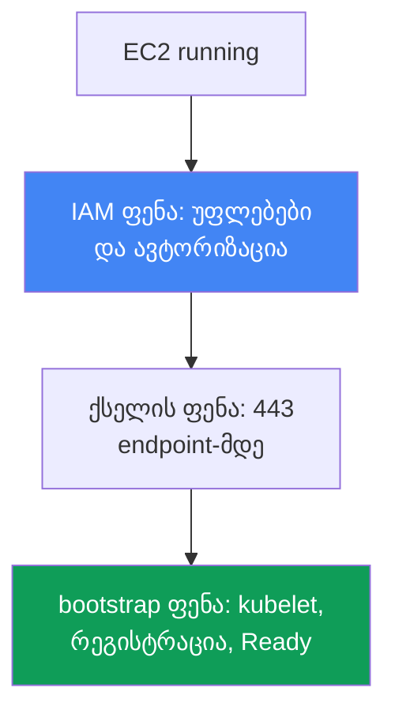
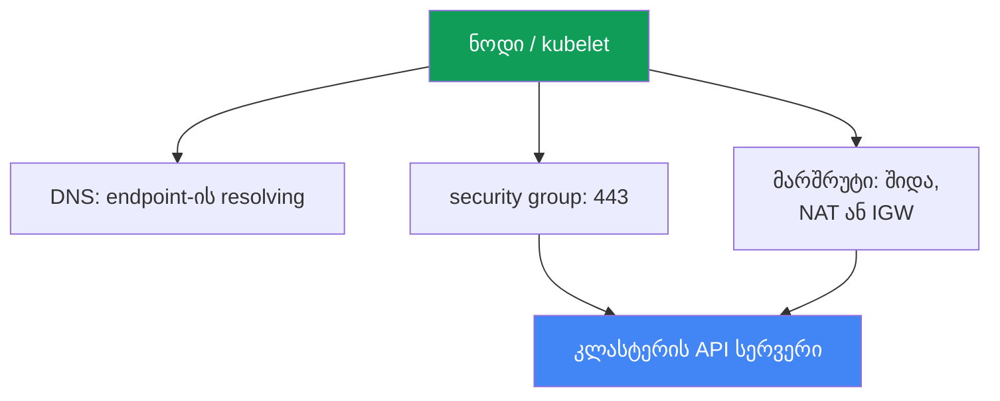

[Русская версия](ru.md) · [Eng version](en.md) · [Versión en español](es.md) · [Version française](fr.md) · [Deutsche Version](de.md) · [繁體中文版](tw.md) · [日本語版](jp.md)
# თავი 45. ნოდი კლასტერს არ შეუერთდა: IAM, SG, user data, bootstrap, kubelet

> **რა არის შემდეგ.** აქ იწყება ნაწილი 8 - troubleshooting. ვიწყებთ გაშვების ყველაზე ხშირი
> ინციდენტით: EC2 ინსტანსები გაეშვა, მაგრამ კლასტერში ნოდები არ არის. განვიხილავთ სისტემურ
> დიაგნოსტიკას ფენების მიხედვით (IAM, ქსელი, bootstrap, kubelet). მომიჯნავე თემები სხვა თავებშია:
> bootstrap-ის მოწყობა, AMI და nodeadm - თავი 10, VPC CNI და პოდებისთვის IP-ების გაცემა - თავი 8,
> access entries და aws-auth - თავი 5, ქსელური გაუმართაობები სიღრმისეულად (SG, NACL, DNS) - თავი 46,
> წვდომა და IAM დაწვრილებით - თავი 47. აქ განვიხილავთ, როგორ იპოვოთ 15 წუთში, რომელ ფენაზე გაიჭედა
> ნოდი და რომელი ხელსაწყოებით შეამოწმოთ ეს.

## 45.1. ინსტანსები არის, ნოდები კი არა

შექმენით managed node group. კონსოლი აჩვენებს გამართულ EC2 ინსტანსებს `running` სტატუსით, მაგრამ:

```bash
kubectl get nodes
# No resources found
```

დრო გადის, node group არ გადადის `ACTIVE` მდგომარეობაში, თავად group კი `CREATE_FAILED` ან
`DEGRADED` მდგომარეობაში გადადის. group-ის აღწერაში ჩანს, კონკრეტულად რა პრობლემას ხედავს ის:

```bash
aws eks describe-nodegroup --cluster-name prod --nodegroup-name ng-1 \
  --query 'nodegroup.health.issues'
# [
#   {
#     "code": "NodeCreationFailure",
#     "message": "Instances failed to join the kubernetes cluster",
#     "resourceIds": ["i-0abc...", "i-0def..."]
#   }
# ]
```

`NodeCreationFailure` არის health issue, რომელსაც EKS აყენებს, თუ managed node group-ის ნოდები
გაშვებიდან 15 წუთში კლასტერს არ შეუერთდნენ. შეტყობინება `Instances failed to join the
kubernetes cluster` პირდაპირი მნიშვნელობისაა: EC2 მუშაობს, მაგრამ `kubectl get nodes` მას ვერ ხედავს.

თავის მთავარი აზრი: „ნოდი არ შეუერთდა“ ერთი შეცდომა კი არა, სხვადასხვა ფენაზე არსებული
გაუმართაობების კლასია. EC2 ინსტანსმა უნდა გაიაროს ჯაჭვი: მიიღოს IAM უფლებები, ქსელით მისწვდეს
API სერვერის endpoint-ს, შეასრულოს user data და bootstrap, გაუშვას kubelet, დარეგისტრირდეს და
კლასტერში ავტორიზაცია გაიაროს. ნებისმიერ რგოლზე გაწყვეტა ერთსა და იმავე სიმპტომს იწვევს - ცარიელ
`kubectl get nodes`-ს. ამიტომ პრობლემას შემთხვევითი ცდებით კი არ ასწორებენ, არამედ ფენებს
თანმიმდევრულად ამოწმებენ. ქვემოთ ფენები ზემოდან ქვემოთაა ჩამოთვლილი, ხოლო 45.6 სექციაში მოცემულია
ჩეკლისტი და ხელსაწყოები გაწყვეტის ადგილის დასადგენად.



## 45.2. IAM ფენა: ნოდის უფლებები და ავტორიზაცია კლასტერში

IAM ფენას ორი დამოუკიდებელი ნაწილი აქვს და მათ მუდმივად ურევენ ერთმანეთში.

**პირველი ნაწილი - node instance role-ის უფლებები.** ნოდის როლზე (არა instance profile-ზე,
არამედ სწორედ როლზე) მიმაგრებული უნდა იყოს managed policy-ები:

| პოლიტიკა | დანიშნულება |
|---|---|
| `AmazonEKSWorkerNodePolicy` | kubelet აღწერს EC2 რესურსებს VPC-ში, კლასტერთან მუშაობა |
| `AmazonEC2ContainerRegistryReadOnly` | image-ების ECR-იდან ჩამოტვირთვა (მათ შორის ქსელის ადდონებისთვის) |
| `AmazonEKS_CNI_Policy` | საჭიროა VPC CNI-სთვის, თუ მას IRSA-ს მეშვეობით ცალკე როლი არ აქვს მინიჭებული (თავი 16) |

`AmazonEKS_CNI_Policy` ნოდის როლზე მხოლოდ `IPv4` ოჯახის კლასტერისთვისაა საჭირო და მაშინ, როდესაც
CNI ცალკე როლში არ არის გატანილი. რეკომენდებულია CNI-სთვის ცალკე როლის მინიჭება (თავი 8), ამ
შემთხვევაში ნოდის როლს ეს policy შეიძლება არ ჰქონდეს. image-ებისთვის უფრო ახალი ვარიანტია
`AmazonEC2ContainerRegistryPullOnly`; `AmazonEC2ContainerRegistryReadOnly`-ც ვალიდურია და უფრო
ხშირად გვხვდება.

**მეორე ნაწილი და ყველაზე ხშირი ძირეული მიზეზი - როლის ავტორიზაცია კლასტერში.** როლისთვის IAM
უფლებების მინიჭება საკმარისი არ არის: თავად ნოდის როლი Kubernetes-ის შიგნითაც უნდა იყოს
ავტორიზებული, წინააღმდეგ შემთხვევაში kubelet AWS-ში ავთენტიფიკაციას გაივლის, მაგრამ კლასტერში
authorization-ს ვერ გაივლის და ნოდი ვერ დარეგისტრირდება. ავტორიზაცია ორი გზიდან ერთ-ერთით
ენიჭება (თავი 5):

- **`EC2_LINUX` ტიპის EKS access entry** (ან `EC2_WINDOWS`) ნოდის როლის ARN-ისთვის - ახალი გზა.
- **მაპინგი `aws-auth` ConfigMap-ში** - მოძველებული, მაგრამ ჯერ კიდევ მოქმედი გზა.

```bash
# ხედავს თუ არა კლასტერი ნოდის როლს access entries-ის მეშვეობით
aws eks list-access-entries --cluster-name prod
# მოძველებული გზა: მაპინგები aws-auth-ში
kubectl -n kube-system get configmap aws-auth -o yaml
```

Managed node group ჩვეულებრივ ჩანაწერს group-ის შექმნისას თავად ამატებს. თუ ჩანაწერი წაშალეს ან
ხელით შეცვალეს, ნოდები შეერთებას წყვეტენ. კრიტიკულად მნიშვნელოვანია: principal-ში უნდა მიუთითოთ
სწორედ **ნოდის როლის** ARN და არა instance profile, ამასთან როლის ARN არ უნდა შეიცავდეს path-ს,
გარდა `/`-ისა. self-managed ნოდებისა და მორგებული ინსტანსებისთვის access entry (ან მაპინგი) ხელით
იქმნება. თუ ეს დაგავიწყდათ, სიმპტომი ზუსტად იგივე, ცარიელი `kubectl get nodes` იქნება.

## 45.3. ქსელის ფენა: API სერვერთან 443 პორტზე დაკავშირება

kubelet რეგისტრაციისას კლასტერის API სერვერის endpoint-ს HTTPS-ით, 443 პორტზე უკავშირდება. თუ
ქსელური გზა არ არის, რეგისტრაციაც არ იქნება. რას ამოწმებენ თანმიმდევრულად:

- **Security group.** ნოდებსა და control plane-ს შორის ტრაფიკი cluster security group-ის გავლით
  მოძრაობს. წესები უნდა უშვებდეს გამავალ 443 ტრაფიკს ნოდიდან endpoint-მდე და control plane-თან
  კავშირს. თუ ნოდები საკუთარი SG-ით ეშვება, მან კლასტერში და კლასტერიდან საჭირო ტრაფიკი უნდა გაატაროს.
- **კლასტერის endpoint-ის ტიპი.** private endpoint-ის შემთხვევაში ნოდი მის private მისამართს VPC-ის
  შიგნით Route 53 private hosted zone-ის მეშვეობით resolve-ს უკეთებს და შიდა მარშრუტიზაციით
  უკავშირდება. public endpoint-ს გარეთ გასასვლელი სჭირდება: private ქვექსელისთვის NAT gateway,
  ხოლო public ქვექსელისთვის საჯარო IP და IGW. კლასიკური შეცდომაა ნოდი private ქვექსელში NAT-მდე
  მარშრუტის გარეშე.
- **endpoint-ის DNS resolving.** ნოდმა კლასტერის endpoint-ის FQDN უნდა resolve-ოს. თუ VPC საკუთარ
  DHCP options-ს გასცემს, კომპლექტში `domain-name` და `domain-name-servers` უნდა იყოს (ნაგულისხმევად
  `AmazonProvidedDNS`). გამართული DNS-ის გარეშე kubelet ლოგში წერს `node "" not found`.

ქსელური გაუმართაობები უფრო სიღრმისეულად (ENI exhausted, NACL, DNS-ის დეტალები, unhealthy targets)
46-ე თავში განიხილება. აქ ერთი რამ არის მნიშვნელოვანი: თუ IAM გამართულია, ნოდი კი მაინც არ გამოჩნდა,
შემდეგი ეჭვმიტანილი endpoint-მდე 443 პორტზე ქსელური გზაა.



## 45.4. user data და bootstrap ფენა

იმისთვის, რომ ინსტანსი ნოდი გახდეს, გაშვებისას user data-დან bootstrap სრულდება: ის იღებს კლასტერის
სახელს, API endpoint-სა და CA სერტიფიკატს და kubelet-ს აკონფიგურირებს. მექანიზმი AMI-ის მიხედვით
(თავი 10):

- **AL2** (Amazon Linux 2, რომლის მხარდაჭერაც ახალ ვერსიებში შეწყდა) - სკრიპტი
  `/etc/eks/bootstrap.sh`, რომელსაც კლასტერის სახელი და პარამეტრები `--apiserver-endpoint`,
  `--b64-cluster-ca` გადაეცემა.
- **AL2023 და Bottlerocket** - `nodeadm` და `NodeConfig` ობიექტი (YAML) ველებით `cluster.name`,
  `apiServerEndpoint`, `certificateAuthority`. Managed node group ამას თქვენთვის ქმნის.

სად ფუჭდება ეს:

- **მორგებული AMI სწორი bootstrap-ის გარეშე.** საკუთარი image `bootstrap.sh`-ის გამოძახების ან
  `nodeadm`-ის გარეშე ვერ შეუერთდება: kubelet უბრალოდ ამ კლასტერზე არ არის კონფიგურირებული.
- **კლასტერის არასწორი მონაცემები.** user data-ში კლასტერის სახელის, endpoint-ის ან CA-ის შეცდომა
  არასწორ `/var/lib/kubelet/kubeconfig`-ს წარმოქმნის და ნოდი არასწორი მიმართულებით მიდის ან TLS-ს
  ვერ გადის.
- **გაფუჭებული cloud-init.** launch template-ის user data-ში ბეჭდვითი შეცდომა, არასწორი MTU,
  შეწყვეტილი cloud-init და bootstrap ბოლომდე ვერ სრულდება. ეს cloud-init-ის ლოგში ჩანს (სექცია 45.6).

Managed node group-ის შემთხვევაში, მორგებული launch template-ის გარეშე, ეს ფენა თითქმის ყოველთვის
გამართულია: user data-ს EKS ქმნის. მასზე ეჭვი მაშინ უნდა მიიტანოთ, როდესაც საკუთარ AMI-ს ან launch
template-ს იყენებთ.

## 45.5. kubelet ფენა

სწორი bootstrap-ის შემთხვევაშიც კი kubelet შეიძლება არ გაეშვას ან ციკლურად ითიშებოდეს. რას
ამოწმებენ თავად ნოდზე (წვდომა SSM Session Manager-ის მეშვეობით, სექცია 45.6):

```bash
# kubelet დემონის სტატუსი და ბოლო ლოგები
systemctl status kubelet
journalctl -u kubelet -n 200 --no-pager
```

ტიპური სურათები:

- **kubelet არ არის გაშვებული ან restart-ს აკეთებს.** არასწორი flag-ები, დაზიანებული `kubeconfig`,
  ნოდის სერტიფიკატის პრობლემა და kubelet რეგისტრაციას ვერ ახერხებს. გათიშვის მიზეზი ლოგში ჩანს.
- **`node "" not found`** - ჩვეულებრივ DNS-ის ან ნოდის private DNS name-ის პრობლემაა (იხ. სექცია 45.3).
- **ავტორიზაციის შეცდომები რეგისტრაციისას** - kubelet API-მდე მივიდა, მაგრამ უარი მიიღო: ეს ისევ
  45.2 სექციის access entry-სთან ან `aws-auth`-თან გვაბრუნებს.

ცალკე მნიშვნელოვანი შემთხვევაა **ნოდი ჩანს, მაგრამ `NotReady`-ა**. აქ kubelet მუშაობს და
დარეგისტრირდა, მაშასადამე IAM-მა, ქსელმა და bootstrap-მა იმუშავა. მოქმედი kubelet-ის დროს
`NotReady` ყველაზე ხშირად ნიშნავს, რომ CNI მზად არ არის: `aws-node` პოდი არ გაეშვა, პოდებს IP-ები
არ ეძლევა და kubelet ნოდს `NetworkNotReady`-ის გამო `NotReady` მდგომარეობაში ტოვებს. ეს უკვე VPC
CNI-ის სფეროა (თავი 8) და არა „ნოდი არ შეუერთდა“. ამ ორი სიმპტომის, ცარიელი სიისა და `NotReady`-ის,
გარჩევა მნიშვნელოვანია: ისინი სხვადასხვა ფენას უკავშირდება.

## 45.6. დიაგნოსტიკის თანმიმდევრობა და ხელსაწყოები

დიაგნოსტიკა ზემოდან ქვემოთ მიმდინარეობს, კითხვიდან „ინსტანსი საერთოდ მუშაობს?“ kubelet-ის ლოგებამდე.
ძირითადი ხელსაწყოებია:

```bash
# 1. რას ამბობს თავად EKS node group-ის შესახებ
aws eks describe-nodegroup --cluster-name prod --nodegroup-name ng-1 \
  --query 'nodegroup.health.issues'
# 2. ხედავს თუ არა კლასტერი ნოდებს
kubectl get nodes
# 3. ავტორიზებულია თუ არა ნოდის როლი
aws eks list-access-entries --cluster-name prod
# 4. ნოდზე SSM Session Manager-ის მეშვეობით: bootstrap/cloud-init ლოგი
sudo cat /var/log/cloud-init-output.log
# 5. ნოდზე: kubelet-ის ლოგები
journalctl -u kubelet -n 200 --no-pager
```

ნოდზე SSH-ის გარეშე წვდომას **SSM Session Manager**-ით იღებენ (საჭიროა SSM agent და უფლებები,
თავი 47): ეს ღია SSH-ზე უსაფრთხოა და საჯარო IP-ის გარეშეც მუშაობს. თუ SSM მიუწვდომელია, რჩება
ინსტანსის კონსოლური გამოტანა (system log) და `/var/log`.

ჩეკლისტი „სიმპტომი - სავარაუდო მიზეზი - რა შევამოწმოთ“:

| სიმპტომი | სავარაუდო მიზეზი | რა შევამოწმოთ |
|---|---|---|
| `NodeCreationFailure`, ნოდები არ არის | ნოდის როლი ავტორიზებული არ არის | `aws eks list-access-entries`, `aws-auth` |
| ნოდები არ არის, IAM გამართულია | API-მდე 443 პორტზე გზა არ არის | SG, NAT/IGW მარშრუტი, endpoint-ის ტიპი |
| ნოდები არ არის, კლასტერი private-ია | endpoint არ resolve-დება | DNS, DHCP options set VPC-ში |
| ნოდები არ არის, მორგებული AMI | bootstrap არ შესრულდა | `/var/log/cloud-init-output.log` |
| ნოდები არ არის, kubelet ითიშება | დაზიანებული kubeconfig/სერტიფიკატი | `journalctl -u kubelet` |
| ნოდი არის, მაგრამ `NotReady` | CNI მზად არ არის, პოდებს IP არ აქვთ | `aws-node` პოდი, ნოდის მოვლენები (თავი 8) |
| ლოგში `node "" not found` | private DNS name არ არის | DHCP options, DNS VPC-ში |

ლოგიკა მარტივია: ჯერ EKS-ს ჰკითხეთ (`describe-nodegroup`), შემდეგ როლის ავტორიზაცია შეამოწმეთ
(იაფი შემოწმებაა და ყველაზე ხშირად სწორედ ის არის დამნაშავე), შემდეგ endpoint-მდე ქსელი და მხოლოდ
ამის შემდეგ შედით ნოდზე cloud-init-ისა და kubelet-ის ლოგებისთვის. ასეთი თანმიმდევრობა ყველაზე ხშირ
მიზეზებს თავიდანვე გამორიცხავს.

## 45.7. როგორ იყენებენ ამას production-ში

- **პირველ რიგში ნოდის როლის ავტორიზაციას ამოწმებენ.** ნოდის როლის ARN-ისთვის access entry-ის
  (ან `aws-auth` მაპინგის) არარსებობა ყველაზე ხშირი ძირეული მიზეზია, შემოწმება კი იაფია: ერთი
  `list-access-entries`.
- **ნოდზე წვდომას წინასწარ ამზადებენ.** AMI-ზე აყენებენ SSM agent-ს და ნოდის როლს SSM უფლებებს
  ანიჭებენ, რათა ინციდენტის დროს Session Manager-ით შევიდნენ და საჯარო სამყაროსთვის SSH არ გახსნან.
- **ნოდის IAM როლებს როგორც კოდს ინახავენ.** სამ managed policy-სა და trust policy-ს Terraform-ში
  აღწერენ (თავი 4), რათა ახალი node group შეკვეცილი უფლებებით არ გაეშვას.
- **მორგებულ AMI-ებსა და launch template-ს ცალკე ტესტავენ.** ნებისმიერ საკუთარ image-ს ან user data-ს
  ერთ ნოდზე უშვებენ და `cloud-init-output.log`-ს კითხულობენ, სანამ მთელ პარკზე გაავრცელებენ.
- **განასხვავებენ „ნოდები არ არის“ და `NotReady` შემთხვევებს.** პირველი სიმპტომი IAM/ქსელი/bootstrap
  ფენებს უკავშირდება; მეორე მოქმედი kubelet-ის დროს თითქმის ყოველთვის CNI-ს (თავი 8). ისინი არ უნდა
  აგერიოთ, რათა არასწორი ფენის კვლევაზე დრო არ დაკარგოთ.
- **ბრმად 15 წუთს არ ელოდებიან.** `describe-nodegroup` health issue-ს დაუყოვნებლივ აჩვენებს; სწორედ
  მას ამოწმებენ და არ ვარაუდობენ, გაეშვება თუ არა ჯგუფი.

## 45.8. მინი-ლექსიკონი

- **NodeCreationFailure** - managed node group-ის health issue: ნოდები გაშვებიდან 15 წუთში კლასტერს
  არ შეუერთდნენ.
- **node instance role** - IAM როლი, რომელსაც EC2 ნოდი იღებს; მისი სახელით kubelet AWS API-ს მიმართავს.
- **`EC2_LINUX` ტიპის access entry** - ჩანაწერი, რომელიც ნოდის როლის ARN-ს კლასტერში ავტორიზაციას
  ანიჭებს (თავი 5).
- **aws-auth ConfigMap** - IAM როლებისა და მომხმარებლების კლასტერში მაპინგის მოძველებული გზა.
- **cluster security group** - SG, რომლის გავლითაც ნოდებსა და control plane-ს შორის ტრაფიკი მოძრაობს.
- **private / public endpoint** - კლასტერის API სერვერთან წვდომის რეჟიმი (თავი 2).
- **bootstrap.sh** - user data-დან AL2-ზე kubelet-ის კონფიგურაციის სკრიპტი.
- **nodeadm / NodeConfig** - ნოდის კონფიგურაცია AL2023-სა და Bottlerocket-ზე (თავი 10).
- **SSM Session Manager** - ინსტანსზე SSH-ის გარეშე, SSM agent-ის მეშვეობით წვდომა.
- **`NotReady` მოქმედი kubelet-ის დროს** - ჩვეულებრივ CNI მზად არ არის და პოდებს IP-ები არ ეძლევა
  (თავი 8).

## 45.9. თავის შეჯამება

- „ნოდი არ შეუერთდა“ სხვადასხვა ფენაზე არსებული გაუმართაობების კლასია და არა ერთი შეცდომა;
  სიმპტომი ერთია (ცარიელი `kubectl get nodes` და `NodeCreationFailure`), მიზეზები კი განსხვავებული.
- დიაგნოსტიკა ფენების მიხედვით ზემოდან ქვემოთ მიმდინარეობს: IAM (უფლებები და ავტორიზაცია), ქსელი
  API-მდე 443 პორტზე, user data და bootstrap, kubelet, რეგისტრაცია.
- ყველაზე ხშირი ძირეული მიზეზი ავტორიზაციაა: ნოდის როლს აკლია `EC2_LINUX` ტიპის access entry (ან
  მაპინგი `aws-auth`-ში), მაშინაც კი, როდესაც IAM უფლებები გამართულია. ამას პირველად ამოწმებენ.
- ნოდის როლის IAM უფლებებია `AmazonEKSWorkerNodePolicy`, `AmazonEC2ContainerRegistryReadOnly` და,
  თუ CNI ცალკე როლში არ არის გატანილი, `AmazonEKS_CNI_Policy`.
- ქსელი: საჭიროა endpoint-მდე 443 პორტზე გზა - SG წესები, მარშრუტი (NAT/IGW), ხოლო private
  endpoint-ისთვის მისი მისამართის DNS resolving და სწორი DHCP options set.
- bootstrap: AL2-ზე `bootstrap.sh`, AL2023-ზე `nodeadm`/`NodeConfig`; მორგებული AMI ან გაფუჭებული
  cloud-init საკუთარ image-ებში ხშირი მიზეზია და `cloud-init-output.log`-ში ჩანს.
- kubelet-ს `journalctl -u kubelet`-ით ამოწმებენ; `node "" not found` DNS-ს უკავშირდება, ხოლო
  `NotReady` მოქმედი kubelet-ის დროს ჩვეულებრივ CNI-ს (თავი 8), ანუ სხვა ფენას.
- ხელსაწყოები: `describe-nodegroup` health, `kubectl get nodes`, `list-access-entries`, ხოლო ნოდზე
  SSM Session Manager-ის მეშვეობით - `cloud-init-output.log` და kubelet-ის ლოგები.

## 45.10. როგორ გამოგადგებათ ეს რეალურ სამუშაოში

მორიგეობისას ეს ინციდენტი ერთნაირად საშიშად და ერთნაირად მარტივად გამოიყურება: node group წითლდება,
ნოდები არ არის, აპლიკაცია ახალ ინსტანსებზე არ ნაწილდება. ჩნდება ცდუნება, შეხვიდეთ ნოდზე და ყველაფერი
განურჩევლად წაიკითხოთ. სჯობს ფენები თანმიმდევრულად გაიაროთ: ჰკითხოთ `describe-nodegroup`-ს, შეამოწმოთ
ნოდის როლის access entry (ყველაზე ხშირად სწორედ ის არის დამნაშავე და ერთ წუთში სწორდება), შემდეგ
ქსელი endpoint-მდე და ბოლოს cloud-init-ისა და kubelet-ის ლოგები. ეს თანმიმდევრობა ლოდინის იმ 15
წუთს ზოგავს და ვარაუდების ნაცვლად ჯერ ყველაზე ხშირ მიზეზებს გამორიცხავს.

პარკის დაგეგმვისას იგივე ლოგიკა პრევენციად იქცევა. ნოდის როლი სამი policy-ითა და მისი ავტორიზაცია
კლასტერში Terraform-ითაა აღწერილი, SSM agent და მისი უფლებები AMI-შია გათვალისწინებული, მორგებული
image-ები და launch template გავრცელებამდე ერთ ნოდზეა შემოწმებული. ამ შემთხვევაში ახალი node group
პროგნოზირებადად ეშვება, ხოლო თუ მაინც ჩავარდება, უკვე იცით, რომელ ფენაზე და რომელი ხელსაწყოთი ეძებოთ.
„ნოდები არ არის“ და `NotReady` შემთხვევების გარჩევის უნარი საათებს ზოგავს: ეს ორი სხვადასხვა ფენა
და მოქმედების ორი სხვადასხვა გეგმაა.

## 45.11. თვითშემოწმების კითხვები

1. რატომ არის „ნოდი არ შეუერთდა“ გაუმართაობების კლასი და არა ერთი შეცდომა? ჩამოთვალეთ ფენები.
2. რა არის health issue `NodeCreationFailure` და როდის აყენებს მას EKS?
3. რომელი სამი managed policy სჭირდება ნოდის როლს და როდის შეიძლება არ მივანიჭოთ
   `AmazonEKS_CNI_Policy`?
4. რა განსხვავებაა ნოდის როლის IAM უფლებებსა და კლასტერში მის ავტორიზაციას შორის?
5. რატომ არის access entry-ის (ან `aws-auth` მაპინგის) არარსებობა ყველაზე ხშირი ძირეული მიზეზი და
   როგორ შევამოწმოთ ეს ერთი ბრძანებით?
6. რას უთითებენ principal-ში, ნოდის როლის ARN-ს თუ instance profile-ს? რატომ არის ეს კრიტიკული?
7. რომელი გზა სჭირდება ნოდს API სერვერამდე და რით განსხვავდება private და public endpoint?
8. რატომ ვერ შეუერთდება private ქვექსელში NAT-ის გარეშე არსებული ნოდი public endpoint-ის მქონე
   კლასტერს?
9. რით განსხვავდება bootstrap AL2-სა და AL2023-ზე და სად ფუჭდება მორგებული AMI?
10. სად უნდა ვნახოთ, შესრულდა თუ არა bootstrap და სად ვნახოთ kubelet-ის ლოგები?
11. რას ნიშნავს kubelet-ის ლოგში `node "" not found` და რომელ მიმართულებაზე მიგვითითებს?
12. რა განსხვავებაა „ნოდები არ არის“ და „ნოდი არის, მაგრამ `NotReady`“ შემთხვევებს შორის და რომელ
    ფენაზე მიგვითითებს თითოეული სიმპტომი?
13. როგორ შევიდეთ ნოდზე უსაფრთხოდ საჯარო SSH-ის გარეშე და რა არის ამისთვის საჭირო AMI-ზე?

## პრაქტიკა

კურსის ლაბა ამ თემისთვის: [ლაბა 119 - Troubleshooting: ნოდი Ready მდგომარეობამდე ვერ მიდის (IAM, SG,
user data, kubelet)](../../labs/119/README_GE.MD). თავს საკუთარი ცალკე ლაბა არ აქვს: ეს არის
დიაგნოსტიკური runbook, რომელსაც მოქმედ კლასტერზე ამუშავებენ. თუმცა თავის ყველა შემოწმება შეგიძლიათ
ჯანმრთელ კლასტერზეც შეასრულოთ, რათა იცოდეთ, როგორ გამოიყურება ნორმალური მდგომარეობა.

ჯერ EKS-სა და Kubernetes-ს ჰკითხეთ, რას ფიქრობენ ნოდების შესახებ:

```bash
# ნოდები და მათი სტატუსი
kubectl get nodes -o wide
# node group-ის health: ნორმალურ მდგომარეობაში issues ცარიელია
aws eks describe-nodegroup --cluster-name prod --nodegroup-name ng-1 \
  --query 'nodegroup.health.issues'
# როლების ავტორიზაცია: ნოდის როლის ARN-ისთვის ჩანაწერი უნდა არსებობდეს
aws eks list-access-entries --cluster-name prod
```

`list-access-entries`-ის გამოტანაში იპოვეთ ნოდის როლის ARN. ეს სწორედ ის ავტორიზაციაა, რომლის
გარეშეც ნოდი ვერ შეუერთდება. შემდეგ SSM Session Manager-ის მეშვეობით ნებისმიერ მოქმედ ნოდზე შედით
და ნახეთ, როგორ გამოიყურება წარმატებული bootstrap და მოქმედი kubelet:

```bash
# cloud-init/bootstrap ლოგი: წარმატებული გაშვების ბოლოს შეცდომები არ არის
sudo cat /var/log/cloud-init-output.log
# kubelet დემონი: active (running)
systemctl status kubelet
journalctl -u kubelet -n 100 --no-pager
```

სურათი 45.6 სექციის ჩეკლისტს შეადარეთ: ჯანმრთელ ნოდზე `describe-nodegroup` issues-ის გარეშეა,
ნოდის როლი access entries-ში არსებობს, cloud-init შეცდომების გარეშე დასრულდა, kubelet კი `running`
მდგომარეობაშია. თუ ნორმალურ სურათს დაიმახსოვრებთ, გაწყვეტას უფრო სწრაფად ამოიცნობთ, როდესაც node
group ვერ გაეშვება.

---
[სარჩევი](../README_GE.md) · [თავი 44](../44/ge.md) · [თავი 46](../46/ge.md)
