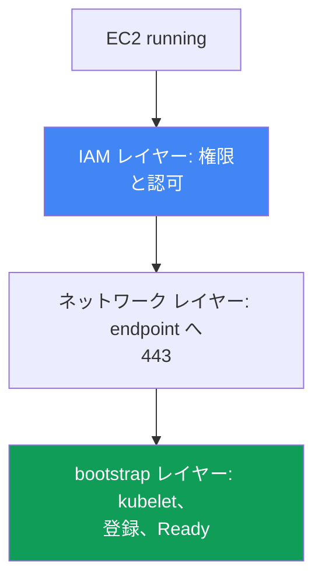
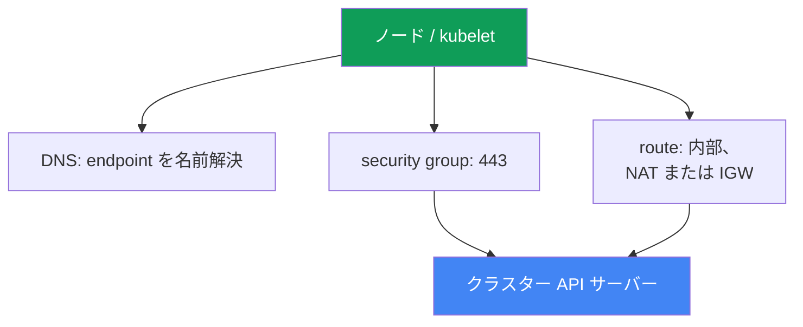

[Русская версия](ru.md) · [Eng version](en.md) · [Versión en español](es.md) · [Version française](fr.md) · [Deutsche Version](de.md) · [ქართული ვერსია](ge.md) · [繁體中文版](tw.md)
# 第45章. ノードがクラスターに参加しない: IAM、SG、user data、bootstrap、kubelet

> **この先。** ここからパート8、トラブルシューティングです。最も頻度の高い起動時インシデント、すなわち EC2 インスタンスは起動したのにクラスターにノードがない問題から始めます。レイヤーごとの体系的な診断（IAM、ネットワーク、bootstrap、kubelet）を扱います。関連する内容は別章で説明します。bootstrap、AMI、nodeadm の仕組みは第10章、VPC CNI と Pod への IP 割り当ては第8章、access entry と aws-auth は第5章、深いネットワーク障害（SG、NACL、DNS）は第46章、アクセスと IAM の詳細は第47章です。本章では、ノードがどのレイヤーで止まったかを15分で見つける方法と、その確認手段を解説します。

## 45.1. インスタンスはあるのにノードがない

managed node group を作成しました。コンソールには `running` 状態の元気な EC2 インスタンスが表示されていますが、次のとおりです。

```bash
kubectl get nodes
# No resources found
```

時間が経過しても node group は `ACTIVE` にならず、group 自体が `CREATE_FAILED` または `DEGRADED` 状態になります。group の説明には、何を問題としているかが表示されます。

```bash
aws eks describe-nodegroup --cluster-name prod --nodegroup-name ng-1 \
  --query 'nodegroup.health.issues'
# [
#   {
#     "code": "NodeCreationFailure",
#     "message": "Instances failed to join the kubernetes cluster",
#     "resourceIds": ["i-0abc...", "i-0def..."]
#   }
# ]
```

`NodeCreationFailure` は、managed node group のノードが起動後15分以内にクラスターへ接続しなかった場合に EKS が設定する health issue です。`Instances failed to join the kubernetes cluster` というメッセージは文字どおりです。EC2 は稼働していますが、`kubectl get nodes` からは見えません。

本章の重要な考え方は、「ノードが参加しない」は単一のエラーではなく、異なるレイヤーで起きる障害のクラスだということです。EC2 インスタンスは、IAM 権限の取得、ネットワーク経由での API サーバー endpoint への到達、user data と bootstrap の実行、kubelet の起動、登録、そしてクラスター内での認可という連鎖を通る必要があります。どこか一つが切れても、`kubectl get nodes` が空という同じ症状になります。そのため、当てずっぽうに直すのではなく、レイヤーを順に確認します。以下ではレイヤーを上から下へ扱い、45.6 節では切断箇所を特定するためのチェックリストとツールを示します。



## 45.2. IAM レイヤー: ノードの権限とクラスターでの認可

IAM レイヤーには独立した二つの部分があり、常に混同されます。

**第一の部分は node instance role の権限です。** ノードの role（instance profile ではなく role 自体）には、次の managed policy がアタッチされていなければなりません。

| Policy | 用途 |
|---|---|
| `AmazonEKSWorkerNodePolicy` | kubelet が VPC 内の EC2 リソースを記述し、クラスターと連携する |
| `AmazonEC2ContainerRegistryReadOnly` | ECR からイメージを pull する（ネットワーク add-on を含む） |
| `AmazonEKS_CNI_Policy` | VPC CNI に IRSA による別 role が与えられていない場合に必要（第16章） |

ノード role の `AmazonEKS_CNI_Policy` は、アドレスファミリーが `IPv4` のクラスターで、かつ CNI が独自の role に分離されていない場合にのみ必要です。CNI には別の role を与えることが推奨されます（第8章）。その場合、ノード role にこの policy は不要です。イメージ用にはより新しい `AmazonEC2ContainerRegistryPullOnly` もあります。`AmazonEC2ContainerRegistryReadOnly` も有効であり、よりよく見かけます。

**第二の部分、そして最も頻度の高い根本原因は、クラスター内での role の認可です。** role に IAM 権限を与えるだけでは不十分です。ノード role 自体が Kubernetes 内で認可されていなければ、kubelet は AWS で認証できてもクラスター内の authorization を通過できず、ノードは登録されません。認可は次の二つの方法のいずれかで行います（第5章）。

- ノード role の ARN に対する **`EC2_LINUX`**（または `EC2_WINDOWS`）タイプの **EKS access entry**。新しい方法です。
- **`aws-auth` ConfigMap のマッピング**。廃止予定ですが、まだ動作する方法です。

```bash
# access entries を通じてクラスターがノード role を認識しているか
aws eks list-access-entries --cluster-name prod
# 旧来の方法: aws-auth のマッピング
kubectl -n kube-system get configmap aws-auth -o yaml
```

managed node group は通常、group 作成時にこの entry を自動作成します。entry を削除したり手作業で変更したりすると、ノードは参加しなくなります。重要なのは、principal には instance profile ではなく、必ず**ノード role** の ARN を指定することです。また、role ARN には `/` 以外の path を含めてはいけません。self-managed ノードとカスタムインスタンスでは、access entry（またはマッピング）を手動で作成します。忘れた場合も、症状はまったく同じ空の `kubectl get nodes` です。

## 45.3. ネットワーク レイヤー: API サーバーの 443 に到達する

kubelet は HTTPS のポート 443 でクラスター API サーバーの endpoint にアクセスして登録します。ネットワーク経路がなければ、登録もありません。確認する順序は次のとおりです。

- **Security group。** ノードと control plane 間のトラフィックは cluster security group を通ります。ルールは、ノードから endpoint への outbound 443 と control plane との通信を許可する必要があります。ノードを独自の SG で起動する場合、その SG はクラスターへの必要なトラフィックと戻りのトラフィックを許可しなければなりません。
- **クラスター endpoint のタイプ。** private endpoint では、ノードは VPC 内の Route 53 private hosted zone を通じて private アドレスを名前解決し、内部ルーティングで接続します。public endpoint では外部への経路が必要です。private subnet には NAT gateway、public subnet には public IP と IGW が必要です。典型的なエラーは、NAT への route がない private subnet 内のノードです。
- **endpoint の DNS 名前解決。** ノードはクラスター endpoint の FQDN を名前解決できなければなりません。VPC が独自の DHCP options を配布している場合、セットには `domain-name` と `domain-name-servers`（デフォルトでは `AmazonProvidedDNS`）が必要です。正しい DNS がなければ、kubelet はログに `node "" not found` を出力します。

より深いネットワーク障害（ENI exhausted、NACL、DNS の詳細、unhealthy target）は第46章で扱います。ここで重要なのは一つです。IAM に問題がないのにノードが現れなければ、次の容疑者は endpoint の 443 までのネットワークです。



## 45.4. user data と bootstrap のレイヤー

インスタンスがノードになるには、起動時に user data の bootstrap が実行される必要があります。これはクラスター名、API endpoint、CA 証明書を取得し、kubelet を構成します。AMI ごとの仕組みは次のとおりです（第10章）。

- **AL2**（Amazon Linux 2。新しいバージョンではサポート終了）では、クラスター名と `--apiserver-endpoint`、`--b64-cluster-ca` によるパラメーターを渡す `/etc/eks/bootstrap.sh` スクリプトを使います。
- **AL2023 と Bottlerocket** では、`cluster.name`、`apiServerEndpoint`、`certificateAuthority` フィールドを持つ `nodeadm` と `NodeConfig`（YAML）を使います。managed node group では EKS がこれを生成します。

ここで壊れる箇所は次のとおりです。

- **正しい bootstrap のないカスタム AMI。** `bootstrap.sh` の呼び出し、または `nodeadm` のない独自イメージは参加できません。kubelet がそのクラスター用に構成されていないためです。
- **誤ったクラスター情報。** user data 内のクラスター名、endpoint、CA の誤りは、誤った `/var/lib/kubelet/kubeconfig` を生成します。ノードは別の場所に接続するか、TLS を通過できません。
- **壊れた cloud-init。** launch template の user data のタイプミス、誤った MTU、途中で失敗した cloud-init により、bootstrap が最後まで進みません。これは cloud-init のログで確認できます（45.6 節）。

カスタム launch template を使わない managed node group では、このレイヤーはほぼ常に正常です。user data は EKS が生成するためです。独自 AMI または launch template を使用している場合に疑うべきです。

## 45.5. kubelet レイヤー

bootstrap が正しくても、kubelet が起動しなかったり、繰り返しクラッシュしたりすることがあります。ノード自体で確認する項目は次のとおりです（アクセスは SSM Session Manager 経由、45.6 節）。

```bash
# kubelet デーモンの状態と直近ログ
systemctl status kubelet
journalctl -u kubelet -n 200 --no-pager
```

典型的な状況は次のとおりです。

- **kubelet が起動していない、または再起動している。** 誤ったフラグ、壊れた `kubeconfig`、ノード証明書の問題により、kubelet は登録できません。ログにクラッシュの原因が表示されます。
- **`node "" not found`**。通常は DNS またはノードの private DNS name の問題です（45.3 節を参照）。
- **登録時の認可エラー**。kubelet は API に到達しましたが拒否されました。この場合は 45.2 節の access entry または `aws-auth` に戻ります。

重要な別ケースは、**ノードは見えているが `NotReady`** の場合です。ここでは kubelet は生存し、すでに登録されています。つまり IAM、ネットワーク、bootstrap は完了しています。kubelet が動いている状態での `NotReady` は多くの場合、CNI が準備できていないことを意味します。`aws-node` Pod が起動していない、Pod に IP が割り当てられないため、kubelet は `NetworkNotReady` によりノードを `NotReady` に保ちます。これは「ノードが参加しない」ではなく、VPC CNI（第8章）の領域です。空の一覧と `NotReady` という二つの症状を区別することは重要です。原因となるレイヤーが異なります。

## 45.6. 診断の順序とツール

診断は、「そもそもインスタンスは生きているか」から kubelet ログまで、上から下へ進めます。主要なツールは次のとおりです。

```bash
# 1. EKS 自身が node group について何と言っているか
aws eks describe-nodegroup --cluster-name prod --nodegroup-name ng-1 \
  --query 'nodegroup.health.issues'
# 2. クラスターからノードが見えるか
kubectl get nodes
# 3. ノード role が認可されているか
aws eks list-access-entries --cluster-name prod
# 4. SSM Session Manager 経由でノード上: bootstrap/cloud-init のログ
sudo cat /var/log/cloud-init-output.log
# 5. ノード上: kubelet のログ
journalctl -u kubelet -n 200 --no-pager
```

SSH なしでノードにアクセスするには **SSM Session Manager** を使います（SSM agent と権限が必要、第47章）。これは public SSH より安全であり、public IP がなくても機能します。SSM を利用できない場合は、インスタンスのコンソール出力（system log）と `/var/log` が残ります。

「症状、考えられる原因、確認すること」のチェックリストです。

| 症状 | 考えられる原因 | 確認すること |
|---|---|---|
| `NodeCreationFailure`、ノードなし | ノード role が認可されていない | `aws eks list-access-entries`、`aws-auth` |
| ノードなし、IAM は正常 | API の 443 への経路がない | SG、NAT/IGW route、endpoint タイプ |
| ノードなし、private クラスター | endpoint を名前解決できない | DNS、VPC の DHCP options set |
| ノードなし、カスタム AMI | bootstrap が実行されなかった | `/var/log/cloud-init-output.log` |
| ノードなし、kubelet がクラッシュ | 壊れた kubeconfig/証明書 | `journalctl -u kubelet` |
| ノードはあるが `NotReady` | CNI が未準備、Pod に IP がない | `aws-node` Pod、ノードイベント（第8章） |
| ログに `node "" not found` | private DNS name がない | DHCP options、VPC の DNS |

ロジックは単純です。最初に EKS に尋ね（`describe-nodegroup`）、次に role の認可を確認します（安価であり、最も頻繁に原因となるためです）。続いて endpoint へのネットワークを確認し、最後にノードに入って cloud-init と kubelet のログを調べます。この順序なら、頻出の原因を先に除外できます。

## 45.7. 本番環境での適用方法

- **最初にノード role の認可を確認する。** ノード role ARN に対する access entry（または `aws-auth` マッピング）がないことが最も頻度の高い根本原因です。確認は `list-access-entries` 一回だけで安価です。
- **ノードへのアクセスを事前に準備する。** AMI に SSM agent を入れ、ノード role に SSM 権限を与えます。これによりインシデント中は、public な世界へ SSH を開放するのではなく Session Manager で入れます。
- **ノード IAM role をコードとして管理する。** 新しい node group が制限された権限で起動しないよう、三つの managed policy と trust policy を Terraform（第4章）で記述します。
- **カスタム AMI と launch template を別途テストする。** 独自イメージまたは user data は、全フリートへ展開する前に一つのノードで実行し、`cloud-init-output.log` を読みます。
- **「ノードなし」と `NotReady` を区別する。** 前者は IAM、ネットワーク、bootstrap のレイヤーです。kubelet が生存している後者は、ほぼ常に CNI（第8章）です。誤ったレイヤーを掘らないよう混同しないでください。
- **何もせず15分待たない。** `describe-nodegroup` は health issue をすぐに示します。group が起動するかを推測するのではなく、これを確認します。

## 45.8. ミニ用語集

- **NodeCreationFailure**: managed node group の health issue。ノードが起動後15分以内にクラスターへ接続しなかったことを示します。
- **node instance role**: EC2 ノードが引き受ける IAM role。kubelet はこれを使って AWS API にアクセスします。
- **`EC2_LINUX` タイプの access entry**: クラスター内のノード role ARN を認可する entry（第5章）。
- **aws-auth ConfigMap**: IAM role とユーザーをクラスターにマッピングする旧来の方法。
- **cluster security group**: ノードと control plane 間のトラフィックが通る SG。
- **private / public endpoint**: クラスター API サーバーへのアクセスモード（第2章）。
- **bootstrap.sh**: user data から AL2 上の kubelet を構成するスクリプト。
- **nodeadm / NodeConfig**: AL2023 と Bottlerocket 上のノード構成（第10章）。
- **SSM Session Manager**: SSM agent を通じて SSH なしでインスタンスにアクセスする仕組み。
- **kubelet が生存しているのに NotReady**: 通常は CNI が未準備で、Pod に IP が割り当てられていない状態（第8章）。

## 45.9. 本章のまとめ

- 「ノードが参加しない」は、単一のエラーではなく異なるレイヤーで起きる障害のクラスです。症状は一つ（空の `kubectl get nodes` と `NodeCreationFailure`）ですが、原因は異なります。
- 診断はレイヤーを上から下へ進めます。IAM（権限と認可）、API の 443 までのネットワーク、user data と bootstrap、kubelet、登録です。
- 最も頻度の高い根本原因は認可です。ノード role に `EC2_LINUX` タイプの access entry（または `aws-auth` のマッピング）がありません。この場合でも IAM 権限は正常である可能性があります。これを最初に確認します。
- ノード role の IAM 権限は `AmazonEKSWorkerNodePolicy`、`AmazonEC2ContainerRegistryReadOnly`、および CNI が別 role に分離されていない場合の `AmazonEKS_CNI_Policy` です。
- ネットワークでは endpoint の 443 までの経路が必要です。SG ルール、route（NAT/IGW）、そして private endpoint では DNS によるアドレス解決と正しい DHCP options set が必要です。
- bootstrap では、AL2 は `bootstrap.sh`、AL2023 は `nodeadm`/`NodeConfig` を使います。カスタム AMI や壊れた cloud-init は独自イメージで頻出する原因であり、`cloud-init-output.log` で確認できます。
- kubelet は `journalctl -u kubelet` で確認します。`node "" not found` は DNS を示し、kubelet が生存したままの `NotReady` は通常 CNI（第8章）を示す別レイヤーです。
- ツールは、`describe-nodegroup` health、`kubectl get nodes`、`list-access-entries`、そして SSM Session Manager 経由でノード上の `cloud-init-output.log` と kubelet ログです。

## 45.10. 実務で役立つ場面

オンコールでは、このインシデントは同じように恐ろしく、同じように単純に見えます。node group は赤くなり、ノードがなく、アプリケーションは新しいインスタンスへ配置されません。ノードに入り、手当たり次第にすべてを読む誘惑があります。正しくはレイヤーを順に進めます。`describe-nodegroup` に尋ね、ノード role の access entry を確認します。最も頻繁な原因であり一分で修正できるためです。次に endpoint へのネットワーク、最後に cloud-init と kubelet のログです。この順序により、待機に費やす15分を節約し、推測する代わりに頻出原因を先に除外できます。

フリートを計画する際、同じロジックは予防策になります。三つの policy を持つノード role とそのクラスター内認可は Terraform に記述し、SSM agent とその権限は AMI に組み込み、カスタムイメージと launch template は展開前に一つのノードで検証します。これにより新しい node group は予測どおりに起動し、失敗しても、どのレイヤーで何を使って探すべきかはすでに分かっています。「ノードなし」と `NotReady` を見分ける能力は何時間もの時間を守ります。これは二つの別のレイヤーであり、二つの別の対応計画だからです。

## 45.11. 自己確認のための質問

1. 「ノードが参加しない」が単一のエラーではなく障害のクラスであるのはなぜですか。レイヤーを挙げてください。
2. health issue `NodeCreationFailure` とは何で、EKS はいつ設定しますか。
3. ノード role に必要な三つの managed policy は何で、どのような場合に `AmazonEKS_CNI_Policy` を与えなくてもよいですか。
4. ノード role の IAM 権限と、クラスター内でのその認可はどう違いますか。
5. access entry（または `aws-auth` マッピング）がないことが最も頻度の高い根本原因なのはなぜで、どの一つのコマンドで確認できますか。
6. principal にはノード role の ARN と instance profile のどちらを指定しますか。なぜそれが重要ですか。
7. ノードに必要な API サーバーへの経路は何で、private endpoint と public endpoint はどう違いますか。
8. NAT のない private subnet のノードが、public endpoint を持つクラスターに参加できないのはなぜですか。
9. AL2 と AL2023 では bootstrap はどう異なり、カスタム AMI はどこで失敗しますか。
10. bootstrap が実行されたかはどこで確認し、kubelet のログはどこで確認しますか。
11. kubelet ログ内の `node "" not found` は何を意味し、どこを確認すべきことを示しますか。
12. 「ノードなし」と「ノードはあるが `NotReady`」はどう違い、それぞれどのレイヤーを示しますか。
13. public SSH なしで安全にノードに入るにはどうし、AMI に何が必要ですか。

## 演習

このトピックに対応するコースラボ: [ラボ119 - Troubleshooting: ノードが Ready に到達しない（IAM、SG、user data、kubelet）](../../labs/119/README_JP.MD)。この章には固有の個別ラボはありません。これは稼働中クラスターで実施する診断 runbook です。ただし、正常なクラスターでも本章のすべての確認を実行し、正常時の状態を把握できます。

まず、EKS と Kubernetes にノードについて何を考えているかを尋ねます。

```bash
# ノードとその状態
kubectl get nodes -o wide
# node group health: 正常なら issues は空
aws eks describe-nodegroup --cluster-name prod --nodegroup-name ng-1 \
  --query 'nodegroup.health.issues'
# role の認可: ノード role ARN の entry が必要
aws eks list-access-entries --cluster-name prod
```

`list-access-entries` の出力からノード role の ARN を見つけます。これが、ノードが参加するために必要な認可です。次に SSM Session Manager 経由で任意の稼働ノードへ入り、成功した bootstrap と稼働中の kubelet がどのように見えるかを確認します。

```bash
# cloud-init/bootstrap のログ: 成功した起動では末尾にエラーがない
sudo cat /var/log/cloud-init-output.log
# kubelet デーモン: active (running)
systemctl status kubelet
journalctl -u kubelet -n 100 --no-pager
```

45.6 節のチェックリストと照合してください。正常なノードでは `describe-nodegroup` に issues がなく、ノード role は access entries にあり、cloud-init はエラーなしで完了し、kubelet は `running` 状態です。正常な状態を覚えておけば、node group が起動しないときに、どこで切れているかをより早く認識できます。

---
[目次](../README_JP.md) · [第44章](../44/jp.md) · [第46章](../46/jp.md)
