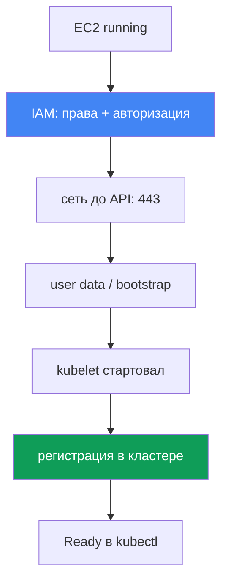
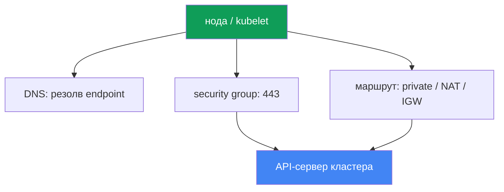

# Глава 45. Нода не присоединилась к кластеру: IAM, SG, user data, bootstrap, kubelet

> **Что дальше.** Здесь открывается Часть 8 - troubleshooting. Начинаем с самого частого
> инцидента запуска: EC2-инстансы поднялись, а нод в кластере нет. Разберём систематическую
> диагностику по слоям (IAM, сеть, bootstrap, kubelet). Смежное отдано главам: устройство
> bootstrap, AMI и nodeadm - глава 10, VPC CNI и выдача IP подам - глава 8, access entries и
> aws-auth - глава 5, сетевые сбои глубоко (SG, NACL, DNS) - глава 46, доступ и IAM детально -
> глава 47. Здесь - как за 15 минут найти, на каком слое застряла нода, и чем это смотреть.

## 45.1. Инстансы есть, а нод нет

Создали managed node group. Консоль показывает бодрые EC2-инстансы в статусе `running`, но:

```bash
kubectl get nodes
# No resources found
```

Проходит время, node group не переходит в `ACTIVE`, а сама group уходит в состояние
`CREATE_FAILED` или `DEGRADED`. В описании group видно, чем именно она недовольна:

```bash
aws eks describe-nodegroup --cluster-name prod --nodegroup-name ng-1 \
  --query 'nodegroup.health.issues'
# [
#   {
#     "code": "NodeCreationFailure",
#     "message": "Instances failed to join the kubernetes cluster",
#     "resourceIds": ["i-0abc...", "i-0def..."]
#   }
# ]
```

`NodeCreationFailure` - это health issue, который EKS выставляет, если ноды managed node group
не подключились к кластеру за 15 минут после запуска. Сообщение `Instances failed to join the
kubernetes cluster` буквальное: EC2 живой, но `kubectl get nodes` его не видит.

Ключевая мысль главы: «нода не присоединилась» - это не одна ошибка, а класс отказов на разных
слоях. EC2-инстанс должен пройти цепочку: получить IAM-права, достучаться до endpoint
API-сервера по сети, отработать user data и bootstrap, поднять kubelet, зарегистрироваться и
пройти авторизацию в кластере. Обрыв на любом звене даёт один и тот же симптом - пустой
`kubectl get nodes`. Поэтому чинят это не наугад, а проходя слои по порядку. Ниже - слои
сверху вниз, а в разделе 45.6 - чеклист и инструменты, чтобы локализовать обрыв.



## 45.2. Слой IAM: права ноды и авторизация в кластере

У IAM-слоя две независимые части, и путают их постоянно.

**Часть первая - права node instance role.** У роли ноды (не instance profile, а именно роль)
должны быть привязаны managed-политики:

| Политика | Зачем |
|---|---|
| `AmazonEKSWorkerNodePolicy` | kubelet описывает ресурсы EC2 в VPC, работа с кластером |
| `AmazonEC2ContainerRegistryReadOnly` | тянуть образы из ECR (в том числе аддоны сети) |
| `AmazonEKS_CNI_Policy` | нужна VPC CNI, если ей не дана отдельная роль через IRSA (глава 16) |

`AmazonEKS_CNI_Policy` на роли ноды нужна только для кластера с семейством `IPv4` и когда CNI
не вынесен в свою роль. Рекомендуется отдавать CNI отдельную роль (глава 8), тогда на роли ноды
этой политики может не быть. Новее для образов - `AmazonEC2ContainerRegistryPullOnly`;
`AmazonEC2ContainerRegistryReadOnly` тоже валидна и встречается чаще.

**Часть вторая, и это самый частый корень - авторизация роли в кластере.** Мало дать роли
IAM-права: сама роль ноды должна быть авторизована внутри Kubernetes, иначе kubelet
аутентифицируется в AWS, но не проходит authorization в кластере и нода не регистрируется.
Авторизацию дают одним из двух способов (глава 5):

- **EKS access entry типа `EC2_LINUX`** (или `EC2_WINDOWS`) для ARN роли ноды - новый путь.
- **Маппинг в `aws-auth` ConfigMap** - устаревший, но всё ещё работающий способ.

```bash
# видит ли кластер роль ноды через access entries
aws eks list-access-entries --cluster-name prod
# устаревший путь: маппинги в aws-auth
kubectl -n kube-system get configmap aws-auth -o yaml
```

Managed node group обычно заводит запись сам при создании group. Если запись удалили или
поправили руками, ноды перестают присоединяться. Критично: в принципале указывают ARN именно
**роли ноды**, а не instance profile, и ARN роли не должен содержать path, кроме `/`. Для
self-managed нод и кастомных инстансов access entry (или маппинг) заводят вручную - забыли,
и симптом ровно тот же пустой `kubectl get nodes`.

## 45.3. Слой сети: достучаться до API-сервера на 443

kubelet регистрируется, обращаясь к endpoint API-сервера кластера по HTTPS на порт 443. Нет
сетевого пути - нет регистрации. Что проверяют по порядку:

- **Security group.** Трафик между нодами и control plane идёт через cluster security group.
  Правила должны разрешать исходящий 443 от ноды к endpoint и связь с control plane. Если ноды
  запускают со своей SG, она должна пропускать нужный трафик к кластеру и обратно.
- **Тип endpoint кластера.** У приватного endpoint (private) нода резолвит его приватный адрес
  через Route 53 private hosted zone внутри VPC и ходит по внутренней маршрутизации. У public
  endpoint нужен путь наружу: NAT gateway для приватной подсети или публичный IP и IGW
  для публичной. Классическая ошибка - нода в приватной подсети без маршрута к NAT.
- **DNS-резолвинг endpoint.** Нода должна резолвить FQDN endpoint кластера. Если VPC отдаёт
  свои DHCP options, в наборе должны быть `domain-name` и `domain-name-servers` (по умолчанию
  `AmazonProvidedDNS`). Без корректного DNS kubelet пишет в лог `node "" not found`.

Глубже сетевые сбои (ENI exhausted, NACL, DNS в деталях, unhealthy targets) разбирает глава 46.
Здесь важно одно: если IAM в порядке, а нода всё равно не появилась, следующий подозреваемый -
сеть до endpoint на 443.



## 45.4. Слой user data и bootstrap

Чтобы инстанс стал нодой, при старте отрабатывает bootstrap из user data: он получает имя
кластера, endpoint API и CA-сертификат и настраивает kubelet. Механика по AMI (глава 10):

- **AL2** (Amazon Linux 2, снят с поддержки в новых версиях) - скрипт `/etc/eks/bootstrap.sh`,
  которому передают имя кластера и параметры через `--apiserver-endpoint`, `--b64-cluster-ca`.
- **AL2023 и Bottlerocket** - `nodeadm` и объект `NodeConfig` (YAML) с полями `cluster.name`,
  `apiServerEndpoint`, `certificateAuthority`. Managed node group формирует это за вас.

Где это ломается:

- **Кастомный AMI без корректного bootstrap.** Свой образ без вызова `bootstrap.sh` или без
  `nodeadm` не присоединится: kubelet просто не настроен на этот кластер.
- **Неверные данные кластера.** Ошибка в имени кластера, endpoint или CA в user data приводит к
  неправильному `/var/lib/kubelet/kubeconfig`, и нода идёт не туда или не проходит TLS.
- **Сломанный cloud-init.** Опечатка в launch template user data, неверный MTU, оборванный
  cloud-init - и bootstrap не доходит до конца. Это видно в логе cloud-init (раздел 45.6).

При managed node group без кастомного launch template этот слой почти всегда исправен: user
data генерирует EKS. Подозревать его стоит, когда используется свой AMI или launch template.

## 45.5. Слой kubelet

Даже с верным bootstrap kubelet может не стартовать или падать в цикле. Что смотрят на самой
ноде (доступ - через SSM Session Manager, раздел 45.6):

```bash
# статус и последние логи демона kubelet
systemctl status kubelet
journalctl -u kubelet -n 200 --no-pager
```

Типичные картины:

- **kubelet не запущен или рестартует.** Неверные флаги, битый `kubeconfig`, проблема с
  сертификатом ноды - kubelet не может зарегистрироваться. В логе видно причину падения.
- **`node "" not found`** - обычно проблема DNS или private DNS name ноды (см. раздел 45.3).
- **Ошибки авторизации при регистрации** - kubelet достучался до API, но получил отказ: это
  возвращает нас к access entry или `aws-auth` из раздела 45.2.

Отдельный важный случай - **нода видна, но `NotReady`**. Здесь kubelet жив и зарегистрировался,
значит IAM, сеть и bootstrap отработали. Чаще всего `NotReady` при живом kubelet означает, что
не готов CNI: под `aws-node` не поднялся, подам не выдаются IP, и kubelet держит ноду
`NotReady` из-за `NetworkNotReady`. Это уже территория VPC CNI (глава 8), а не «нода не
присоединилась». Различать эти два симптома - пустой список против `NotReady` - важно: у них
разные слои.

## 45.6. Порядок диагностики и инструменты

Диагностику ведут сверху вниз, от «а инстанс вообще жив» до логов kubelet. Опорные инструменты:

```bash
# 1. что говорит сам EKS про node group
aws eks describe-nodegroup --cluster-name prod --nodegroup-name ng-1 \
  --query 'nodegroup.health.issues'
# 2. видит ли кластер ноды
kubectl get nodes
# 3. авторизована ли роль ноды
aws eks list-access-entries --cluster-name prod
# 4. на ноде через SSM Session Manager: лог bootstrap/cloud-init
sudo cat /var/log/cloud-init-output.log
# 5. на ноде: логи kubelet
journalctl -u kubelet -n 200 --no-pager
```

Доступ на ноду без SSH берут через **SSM Session Manager** (нужен SSM agent и права, глава 47):
это безопаснее открытого SSH и работает даже без публичного IP. Если SSM недоступен, остаётся
консольный вывод инстанса (system log) и `/var/log`.

Чеклист «симптом - вероятная причина - что проверить»:

| Симптом | Вероятная причина | Что проверить |
|---|---|---|
| `NodeCreationFailure`, нод нет | роль ноды не авторизована | `aws eks list-access-entries`, `aws-auth` |
| нод нет, IAM в порядке | нет пути до API на 443 | SG, маршрут NAT/IGW, тип endpoint |
| нод нет, приватный кластер | не резолвится endpoint | DNS, DHCP options set в VPC |
| нод нет, кастомный AMI | bootstrap не отработал | `/var/log/cloud-init-output.log` |
| нод нет, kubelet падает | битый kubeconfig/сертификат | `journalctl -u kubelet` |
| нода есть, но `NotReady` | CNI не готов, нет IP подам | под `aws-node`, события ноды (глава 8) |
| в логе `node "" not found` | нет private DNS name | DHCP options, DNS в VPC |

Логика простая: сначала спросить EKS (`describe-nodegroup`), затем проверить авторизацию роли
(дёшево и чаще всего виновата она), потом сеть до endpoint, и только затем лезть на ноду за
логами cloud-init и kubelet. Такой порядок отсекает самые частые причины первыми.

## 45.7. Как это применяют в продакшене

- **Проверяют авторизацию роли ноды первой.** Отсутствие access entry (или `aws-auth`-маппинга)
  для ARN роли ноды - самый частый корень, а проверка дешёвая: одна `list-access-entries`.
- **Готовят доступ на ноду заранее.** На AMI ставят SSM agent и дают роли ноды права SSM, чтобы
  во время инцидента зайти через Session Manager, а не открывать SSH на публичный мир.
- **Держат IAM роли ноды как код.** Три managed-политики и trust policy описывают в Terraform
  (глава 4), чтобы новая node group не поднималась с урезанными правами.
- **Тестируют кастомные AMI и launch template отдельно.** Любой свой образ или user data гоняют
  на одной ноде и читают `cloud-init-output.log`, прежде чем катить на весь парк.
- **Различают «нет нод» и `NotReady`.** Первый симптом - слои IAM/сеть/bootstrap; второй при
  живом kubelet - почти всегда CNI (глава 8). Не путать, чтобы не копать не тот слой.
- **Не ждут 15 минут вслепую.** `describe-nodegroup` показывает health issue сразу; на него и
  смотрят, а не гадают, поднимется ли группа.

## 45.8. Мини-глоссарий

- **NodeCreationFailure** - health issue managed node group: ноды не подключились к кластеру за
  15 минут после запуска.
- **node instance role** - IAM-роль, которую принимает EC2-нода; с неё kubelet ходит в AWS API.
- **access entry типа `EC2_LINUX`** - запись, авторизующая ARN роли ноды в кластере (глава 5).
- **aws-auth ConfigMap** - устаревший способ маппинга IAM-ролей и пользователей в кластер.
- **cluster security group** - SG, через которую идёт трафик между нодами и control plane.
- **private / public endpoint** - режим доступа к API-серверу кластера (глава 2).
- **bootstrap.sh** - скрипт настройки kubelet на AL2 из user data.
- **nodeadm / NodeConfig** - настройка ноды на AL2023 и Bottlerocket (глава 10).
- **SSM Session Manager** - доступ на инстанс без SSH через агента SSM.
- **NotReady при живом kubelet** - обычно CNI не готов, подам не выдаются IP (глава 8).

## 45.9. Итоги главы

- «Нода не присоединилась» - это класс отказов на разных слоях, а не одна ошибка; симптом один
  (пустой `kubectl get nodes` и `NodeCreationFailure`), причины разные.
- Диагностику ведут по слоям сверху вниз: IAM (права и авторизация), сеть до API на 443, user
  data и bootstrap, kubelet, регистрация.
- Самый частый корень - авторизация: роли ноды не хватает access entry типа `EC2_LINUX` (или
  маппинга в `aws-auth`), при этом IAM-права могут быть в порядке. Проверяют это первым.
- IAM-права роли ноды - `AmazonEKSWorkerNodePolicy`, `AmazonEC2ContainerRegistryReadOnly` и,
  если CNI не вынесен в отдельную роль, `AmazonEKS_CNI_Policy`.
- Сеть: нужен путь до endpoint на 443 - правила SG, маршрут (NAT/IGW), а для private endpoint
  резолвинг его адреса через DNS и корректный DHCP options set.
- bootstrap: на AL2 - `bootstrap.sh`, на AL2023 - `nodeadm`/`NodeConfig`; кастомный AMI или
  сломанный cloud-init - частая причина у своих образов, видно в `cloud-init-output.log`.
- kubelet смотрят через `journalctl -u kubelet`; `node "" not found` - это DNS, а `NotReady`
  при живом kubelet - обычно CNI (глава 8), другой слой.
- Инструменты: `describe-nodegroup` health, `kubectl get nodes`, `list-access-entries`, а на
  ноде через SSM Session Manager - `cloud-init-output.log` и логи kubelet.

## 45.10. Как это пригодится в реальной работе

На дежурстве этот инцидент выглядит одинаково страшно и одинаково просто: node group краснеет,
нод нет, приложение не разъезжается по новым инстансам. Соблазн - лезть на ноду и читать всё
подряд. Правильнее пройти слои по порядку: спросить `describe-nodegroup`, проверить access
entry роли ноды (чаще всего виновата она и чинится за минуту), затем сеть до endpoint, и потом
логи cloud-init и kubelet. Этот порядок экономит те самые 15 минут ожидания и отсекает частые
причины первыми, вместо гадания.

При планировании парка та же логика превращается в профилактику. Роль ноды с тремя политиками и
её авторизация в кластере описаны в Terraform, SSM agent и права на него заложены в AMI,
кастомные образы и launch template проверены на одной ноде до раскатки. Тогда новая node group
поднимается предсказуемо, а если и падает - вы уже знаете, на каком слое искать и чем смотреть.
Умение отличить «нет нод» от `NotReady` бережёт часы: это два разных слоя и два разных плана.

## 45.11. Вопросы для самопроверки

1. Почему «нода не присоединилась» - это класс отказов, а не одна ошибка? Назовите слои.
2. Что такое health issue `NodeCreationFailure` и когда EKS его выставляет?
3. Какие три managed-политики нужны роли ноды и когда `AmazonEKS_CNI_Policy` можно не давать?
4. В чём разница между IAM-правами роли ноды и её авторизацией в кластере?
5. Почему отсутствие access entry (или `aws-auth`-маппинга) - самый частый корень и как это
   проверить одной командой?
6. Что указывают в принципале - ARN роли ноды или instance profile? Почему это критично?
7. Какой путь до API-сервера нужен ноде и чем отличаются private и public endpoint?
8. Почему нода в приватной подсети без NAT не присоединится к кластеру с public endpoint?
9. Как bootstrap различается на AL2 и AL2023 и где ломается кастомный AMI?
10. Где смотреть, отработал ли bootstrap, и где - логи kubelet?
11. Что означает `node "" not found` в логе kubelet и куда это ведёт?
12. Чем отличается «нод нет» от «нода есть, но `NotReady`» и в какой слой ведёт каждый симптом?
13. Как безопасно зайти на ноду без публичного SSH и что для этого нужно на AMI?

## Практика

Своей лабы у главы нет: это диагностический runbook, который отрабатывают на живом кластере. Но
все проверки из главы можно прогнать и на здоровом кластере, чтобы знать, как выглядит норма.

Сначала спросите EKS и Kubernetes, что они думают про ноды:

```bash
# ноды и их статус
kubectl get nodes -o wide
# health node group: в норме issues пустой
aws eks describe-nodegroup --cluster-name prod --nodegroup-name ng-1 \
  --query 'nodegroup.health.issues'
# авторизация ролей: должна быть запись для ARN роли ноды
aws eks list-access-entries --cluster-name prod
```

Найдите в выводе `list-access-entries` ARN роли ноды - это та самая авторизация, без которой
нода не присоединяется. Затем зайдите на любую рабочую ноду через SSM Session Manager и
посмотрите, как выглядит успешный bootstrap и живой kubelet:

```bash
# лог cloud-init/bootstrap: в конце успешного запуска нет ошибок
sudo cat /var/log/cloud-init-output.log
# демон kubelet: active (running)
systemctl status kubelet
journalctl -u kubelet -n 100 --no-pager
```

Сверьте картину с чеклистом из раздела 45.6: на здоровой ноде `describe-nodegroup` без issues,
роль ноды есть в access entries, cloud-init завершился без ошибок, kubelet в состоянии
`running`. Запомнив норму, вы быстрее опознаете обрыв, когда node group не поднимется.

---
[Оглавление](../README_RU.md) · [Глава 44](../44/ru.md) · [Глава 46](../46/ru.md)
