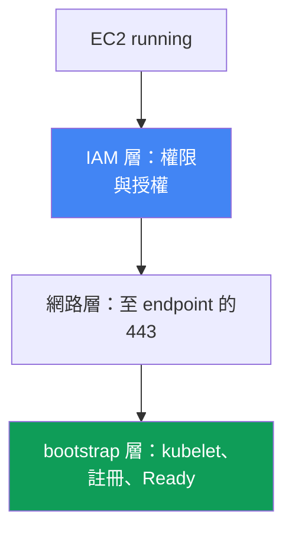
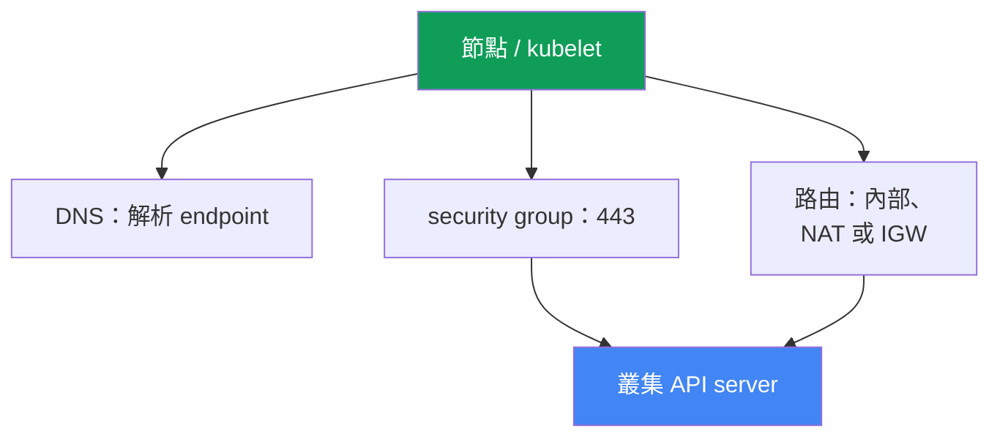

[Русская версия](ru.md) · [Eng version](en.md) · [Versión en español](es.md) · [Version française](fr.md) · [Deutsche Version](de.md) · [ქართული ვერსია](ge.md) · [日本語版](jp.md)
# 第 45 章。節點未加入叢集：IAM、SG、user data、bootstrap、kubelet

> **接下來。** 從這裡開始第 8 部分，troubleshooting。我們從最常見的啟動事件開始：EC2 執行個體已啟動，但叢集中沒有節點。我們將依層次系統化診斷（IAM、網路、bootstrap、kubelet）。相鄰主題分別在以下章節說明：bootstrap、AMI 與 nodeadm 的運作機制見第 10 章，VPC CNI 與為 Pod 配發 IP 見第 8 章，access entries 與 aws-auth 見第 5 章，深入的網路故障（SG、NACL、DNS）見第 46 章，存取與 IAM 細節見第 47 章。本章說明如何在 15 分鐘內找出節點卡在哪個層次，以及用什麼工具檢查。

## 45.1. 執行個體存在，但沒有節點

已建立 managed node group。主控台顯示狀態為 `running`、看起來一切正常的 EC2 執行個體，但：

```bash
kubectl get nodes
# No resources found
```

時間過去後，node group 沒有轉為 `ACTIVE`，而 group 本身進入
`CREATE_FAILED` 或 `DEGRADED` 狀態。從 group 的描述可看出它具體不滿意什麼：

```bash
aws eks describe-nodegroup --cluster-name prod --nodegroup-name ng-1 \
  --query 'nodegroup.health.issues'
# [
#   {
#     "code": "NodeCreationFailure",
#     "message": "Instances failed to join the kubernetes cluster",
#     "resourceIds": ["i-0abc...", "i-0def..."]
#   }
# ]
```

`NodeCreationFailure` 是一種 health issue，若 managed node group 的節點在啟動後 15 分鐘內
未連上叢集，EKS 就會設定它。`Instances failed to join the kubernetes cluster` 訊息的字面意思
就是：EC2 還活著，但 `kubectl get nodes` 看不到它。

本章的核心概念是：「節點未加入」不是單一錯誤，而是不同層次的一類故障。EC2 執行個體必須走完一條鏈：取得 IAM 權限、透過網路連到 API server endpoint、執行 user data 與 bootstrap、啟動 kubelet、註冊並通過叢集授權。任一環節中斷都會造成同一症狀，也就是空的 `kubectl get nodes`。因此修復時不應猜測，而應依序檢查各層。下方由上而下列出各層，第 45.6 節則提供用來定位中斷點的檢查清單和工具。



## 45.2. IAM 層：節點權限及叢集內授權

IAM 層有兩個彼此獨立的部分，而且常被混淆。

**第一部分是 node instance role 的權限。** 節點角色（不是 instance profile，而是角色本身）必須附加下列 managed policies：

| Policy | 用途 |
|---|---|
| `AmazonEKSWorkerNodePolicy` | kubelet 描述 VPC 中的 EC2 資源、與叢集互動 |
| `AmazonEC2ContainerRegistryReadOnly` | 從 ECR 拉取映像檔（包括網路附加元件） |
| `AmazonEKS_CNI_Policy` | 若 VPC CNI 未透過 IRSA（第 16 章）取得獨立角色，便需要它 |

只有在叢集使用 `IPv4` family 且 CNI 未拆出自己的角色時，節點角色才需要 `AmazonEKS_CNI_Policy`。
建議給 CNI 獨立角色（第 8 章），此時節點角色不必有此 policy。較新的映像檔 policy 是
`AmazonEC2ContainerRegistryPullOnly`；`AmazonEC2ContainerRegistryReadOnly` 也有效且更常見。

**第二部分，也是最常見的根本原因，是角色在叢集中的授權。** 只給角色 IAM 權限還不夠：節點角色本身必須在 Kubernetes 內獲得授權，否則 kubelet 雖然通過 AWS 驗證，卻無法通過叢集 authorization，節點也不會註冊。可透過兩種方式之一授權（第 5 章）：

- 為節點角色 ARN 建立 **類型為 `EC2_LINUX`**（或 `EC2_WINDOWS`）的 **EKS access entry**，這是新途徑。
- 在 **`aws-auth` ConfigMap** 中建立 mapping，這是已淘汰但仍可運作的方式。

```bash
# 叢集是否透過 access entries 看得到節點角色
aws eks list-access-entries --cluster-name prod
# 已淘汰的途徑：aws-auth 中的 mappings
kubectl -n kube-system get configmap aws-auth -o yaml
```

Managed node group 通常會在建立 group 時自行建立這筆記錄。若有人手動刪除或修改它，節點便不再加入。關鍵在於 principal 中必須指定**節點角色**的 ARN，而非 instance profile，且角色 ARN 不得含有 `/` 以外的 path。對 self-managed 節點及自訂執行個體，access entry（或 mapping）需手動建立，忘記時的症狀同樣是空的 `kubectl get nodes`。

## 45.3. 網路層：連到 API server 的 443

kubelet 會透過 HTTPS 的 443 連線至叢集 API server endpoint 來註冊。沒有網路路徑，就無法註冊。依序應檢查：

- **Security group。** 節點與 control plane 間的流量透過 cluster security group。規則必須允許從節點到 endpoint 的輸出 443，以及和 control plane 的連通性。若節點使用自己的 SG 啟動，它必須允許往返叢集的必要流量。
- **叢集 endpoint 類型。** 使用 private endpoint 時，節點會透過 VPC 內的 Route 53 private hosted zone 將其解析為私有位址，並透過內部路由連線。使用 public endpoint 時需要向外的路徑：私有子網路需有 NAT gateway，或公有子網路需有 public IP 與 IGW。典型錯誤是私有子網路中的節點沒有通往 NAT 的路由。
- **endpoint 的 DNS 解析。** 節點必須能解析叢集 endpoint 的 FQDN。若 VPC 使用自訂 DHCP options，其設定組必須有 `domain-name` 與 `domain-name-servers`（預設為 `AmazonProvidedDNS`）。DNS 不正確時，kubelet 會在 log 中寫入 `node "" not found`。

更深入的網路故障（ENI exhausted、NACL、DNS 細節、unhealthy targets）見第 46 章。此處只要記住一件事：若 IAM 正常而節點仍未出現，下一個嫌疑對象就是到 443 endpoint 的網路。



## 45.4. user data 與 bootstrap 層

要讓執行個體成為節點，啟動時會執行 user data 中的 bootstrap：它取得叢集名稱、API endpoint 與 CA 憑證，並設定 kubelet。依 AMI 而異的機制如下（第 10 章）：

- **AL2**（Amazon Linux 2，已不再支援新版本）使用 `/etc/eks/bootstrap.sh` 指令碼，傳入叢集名稱以及 `--apiserver-endpoint`、`--b64-cluster-ca` 參數。
- **AL2023 與 Bottlerocket** 使用 `nodeadm` 和 `NodeConfig`（YAML）物件，其中具有 `cluster.name`、`apiServerEndpoint`、`certificateAuthority` 欄位。Managed node group 會為您產生這些內容。

此處會在哪裡失敗：

- **沒有正確 bootstrap 的自訂 AMI。** 自有映像檔若未呼叫 `bootstrap.sh` 或未使用 `nodeadm`，便無法加入：kubelet 根本沒有設定為連向此叢集。
- **錯誤的叢集資料。** user data 中的叢集名稱、endpoint 或 CA 錯誤，會導致 `/var/lib/kubelet/kubeconfig` 不正確，節點不是連到錯誤位置，就是無法通過 TLS。
- **損壞的 cloud-init。** launch template user data 有拼字錯誤、MTU 不正確、cloud-init 被中斷，都會使 bootstrap 未能完成。這可從 cloud-init log 中看出（第 45.6 節）。

沒有自訂 launch template 的 managed node group，這一層幾乎總是正確的：user data 由 EKS 產生。只有使用自訂 AMI 或 launch template 時，才應優先懷疑此層。

## 45.5. kubelet 層

即使 bootstrap 正確，kubelet 仍可能無法啟動或不斷重啟。在節點本身檢查以下內容（透過 SSM Session Manager 存取，見第 45.6 節）：

```bash
# kubelet daemon 的狀態和最新 logs
systemctl status kubelet
journalctl -u kubelet -n 200 --no-pager
```

常見情況：

- **kubelet 未啟動或持續重啟。** 錯誤 flags、損壞的 `kubeconfig`、節點憑證問題，都會使 kubelet 無法註冊。log 中可看到故障原因。
- **`node "" not found`**：通常是 DNS 或節點 private DNS name 的問題（見第 45.3 節）。
- **註冊時發生 authorization 錯誤**：kubelet 已經連到 API，但遭到拒絕，這會回到第 45.2 節的 access entry 或 `aws-auth`。

還有一個重要的獨立情況：**節點可見，但為 `NotReady`**。這代表 kubelet 存活並已註冊，因此 IAM、網路與 bootstrap 都已成功。kubelet 存活時，`NotReady` 最常代表 CNI 尚未就緒：`aws-node` Pod 未啟動、Pod 未獲配 IP，kubelet 因 `NetworkNotReady` 而將節點維持在 `NotReady`。這已屬於 VPC CNI 的範圍（第 8 章），而不是「節點未加入」。區分這兩種症狀十分重要：一種是空清單，另一種是 `NotReady`，它們對應不同層次。

## 45.6. 診斷順序與工具

診斷由上而下進行，從「執行個體真的還活著嗎」一路到 kubelet logs。基本工具如下：

```bash
# 1. EKS 對 node group 本身怎麼說
aws eks describe-nodegroup --cluster-name prod --nodegroup-name ng-1 \
  --query 'nodegroup.health.issues'
# 2. 叢集是否看得到節點
kubectl get nodes
# 3. 節點角色是否已授權
aws eks list-access-entries --cluster-name prod
# 4. 透過 SSM Session Manager 在節點上：bootstrap/cloud-init log
sudo cat /var/log/cloud-init-output.log
# 5. 在節點上：kubelet logs
journalctl -u kubelet -n 200 --no-pager
```

無須 SSH 的節點存取可透過 **SSM Session Manager** 完成（需要 SSM agent 和權限，見第 47 章）：這比對公網開放 SSH 安全，且即使沒有 public IP 也能運作。若 SSM 不可用，只能使用執行個體的 console output（system log）及 `/var/log`。

「症狀、可能原因、檢查項目」檢查清單：

| 症狀 | 可能原因 | 檢查項目 |
|---|---|---|
| `NodeCreationFailure`，沒有節點 | 節點角色未授權 | `aws eks list-access-entries`、`aws-auth` |
| 沒有節點，IAM 正常 | 沒有通往 API 的 443 路徑 | SG、NAT/IGW 路由、endpoint 類型 |
| 沒有節點，私有叢集 | endpoint 無法解析 | DNS、VPC 的 DHCP options set |
| 沒有節點，自訂 AMI | bootstrap 未執行 | `/var/log/cloud-init-output.log` |
| 沒有節點，kubelet 崩潰 | 損壞的 kubeconfig/憑證 | `journalctl -u kubelet` |
| 有節點但為 `NotReady` | CNI 未就緒，Pod 沒有 IP | `aws-node` Pod、節點事件（第 8 章） |
| log 中有 `node "" not found` | 沒有 private DNS name | DHCP options、VPC 中的 DNS |

邏輯很簡單：先問 EKS（`describe-nodegroup`），再檢查角色授權（成本低且最常是它的問題），接著檢查通往 endpoint 的網路，最後才到節點上查看 cloud-init 與 kubelet logs。這個順序會先排除最常見的原因。

## 45.7. 如何在生產環境使用

- **首先檢查節點角色授權。** 節點角色 ARN 缺少 access entry（或 `aws-auth` mapping）是最常見根因，而且檢查成本低：一個 `list-access-entries` 即可。
- **預先準備節點存取方式。** 在 AMI 安裝 SSM agent，並給節點角色 SSM 權限，讓事件發生時可透過 Session Manager 登入，而不是向公網開放 SSH。
- **將節點 IAM 角色視為程式碼管理。** 在 Terraform（第 4 章）描述三個 managed policies 和 trust policy，避免新的 node group 以受限權限啟動。
- **個別測試自訂 AMI 與 launch template。** 任何自有映像檔或 user data，先在一個節點上執行並閱讀 `cloud-init-output.log`，再擴展到整個叢集。
- **區分「沒有節點」與 `NotReady`。** 前者屬於 IAM、網路、bootstrap 層；後者在 kubelet 存活時幾乎總是 CNI（第 8 章）。不要混淆，才不會挖錯層次。
- **不要盲等 15 分鐘。** `describe-nodegroup` 會立即顯示 health issue；應查看它，而不是猜 group 是否會自行恢復。

## 45.8. 迷你詞彙表

- **NodeCreationFailure**：managed node group 的 health issue，節點在啟動後 15 分鐘內未連上叢集。
- **node instance role**：EC2 節點所 assume 的 IAM 角色；kubelet 透過它呼叫 AWS API。
- **類型為 `EC2_LINUX` 的 access entry**：在叢集中授權節點角色 ARN 的記錄（第 5 章）。
- **aws-auth ConfigMap**：將 IAM 角色與使用者 mapping 至叢集的已淘汰方式。
- **cluster security group**：節點與 control plane 之間流量所經的 SG。
- **private / public endpoint**：叢集 API server 的存取模式（第 2 章）。
- **bootstrap.sh**：AL2 從 user data 設定 kubelet 的指令碼。
- **nodeadm / NodeConfig**：AL2023 與 Bottlerocket 上的節點設定（第 10 章）。
- **SSM Session Manager**：透過 SSM agent、不使用 SSH 進入執行個體的方式。
- **kubelet 存活時的 NotReady**：通常代表 CNI 尚未就緒，Pod 未獲配 IP（第 8 章）。

## 45.9. 本章總結

- 「節點未加入」是不同層次的一類故障，而不是單一錯誤；症狀相同（空的 `kubectl get nodes` 與 `NodeCreationFailure`），原因不同。
- 診斷應由上而下依層次進行：IAM（權限與授權）、到 API 的 443 網路、user data 與 bootstrap、kubelet、註冊。
- 最常見根因是授權：節點角色缺少類型為 `EC2_LINUX` 的 access entry（或 `aws-auth` mapping），即使 IAM 權限可能正常。應先檢查它。
- 節點角色的 IAM 權限為 `AmazonEKSWorkerNodePolicy`、`AmazonEC2ContainerRegistryReadOnly`，以及若 CNI 未拆到獨立角色時所需的 `AmazonEKS_CNI_Policy`。
- 網路方面：需要通往 443 endpoint 的路徑，包括 SG 規則、路由（NAT/IGW）；private endpoint 則還需要透過 DNS 解析其位址和正確的 DHCP options set。
- bootstrap 方面：AL2 使用 `bootstrap.sh`，AL2023 使用 `nodeadm`/`NodeConfig`；自訂 AMI 或損壞的 cloud-init 是自有映像檔常見原因，可在 `cloud-init-output.log` 中看到。
- kubelet 可透過 `journalctl -u kubelet` 檢查；`node "" not found` 是 DNS 問題，而 kubelet 存活時的 `NotReady` 通常是 CNI（第 8 章），屬於不同層次。
- 工具包括 `describe-nodegroup` health、`kubectl get nodes`、`list-access-entries`，以及透過 SSM Session Manager 在節點上查看 `cloud-init-output.log` 和 kubelet logs。

## 45.10. 如何幫助實際工作

值班時，這個事件看起來同樣嚴重也同樣單純：node group 變紅、沒有節點、應用程式無法分散到新執行個體。很容易想直接登入節點、把所有東西都讀一遍。更好的作法是按順序走過各層：執行 `describe-nodegroup`、檢查節點角色的 access entry（最常是它的問題，而且一分鐘就可修復）、再檢查到 endpoint 的網路，最後才看 cloud-init 與 kubelet logs。這個順序節省的正是那 15 分鐘等待時間，並會優先排除常見原因，而非靠猜測。

規劃節點叢集時，同一邏輯會轉化為預防措施。具有三個 policies 的節點角色及其叢集授權都在 Terraform 中描述，SSM agent 及其權限已內建於 AMI，並在推出前於單一節點測試自訂映像檔與 launch template。如此新的 node group 便能可預測地啟動；即使失敗，您也已知道應在哪個層次、以什麼工具尋找。能區分「沒有節點」與 `NotReady` 可節省數小時：這是兩個不同層次與兩套不同的處理計畫。

## 45.11. 自我檢查問題

1. 為何「節點未加入」是一類故障而非單一錯誤？請列出各層次。
2. health issue `NodeCreationFailure` 是什麼，EKS 何時會設定它？
3. 節點角色需要哪三個 managed policies，何時可不給 `AmazonEKS_CNI_Policy`？
4. 節點角色的 IAM 權限與它在叢集中的授權有何差異？
5. 為何缺少 access entry（或 `aws-auth` mapping）是最常見根因，如何用一個命令檢查？
6. principal 應指定節點角色 ARN 還是 instance profile？為何這很重要？
7. 節點需要通往 API server 的什麼路徑？private 與 public endpoint 有何不同？
8. 為何位於沒有 NAT 的私有子網路中的節點無法加入使用 public endpoint 的叢集？
9. AL2 與 AL2023 的 bootstrap 有何不同，自訂 AMI 會在哪裡失敗？
10. 在哪裡查看 bootstrap 是否執行，在何處查看 kubelet logs？
11. kubelet log 中的 `node "" not found` 代表什麼，它會引導你查向哪裡？
12. 「沒有節點」和「有節點但 `NotReady`」有何不同，各自指向哪個層次？
13. 如何在不開放 public SSH 的情況下安全登入節點，AMI 需要具備什麼？

## 實作練習

本課程此主題的實驗：[實驗 119 - Troubleshooting：節點無法進入 Ready（IAM、SG、user data、kubelet）](../../labs/119/README_TW.MD)。本章沒有專屬的獨立實驗：它是一份在實際叢集上演練的診斷 runbook。但您可以在健康叢集上執行本章的所有檢查，以了解正常情況應有的樣子。

先詢問 EKS 與 Kubernetes 對節點的看法：

```bash
# 節點及其狀態
kubectl get nodes -o wide
# node group health：正常時 issues 為空
aws eks describe-nodegroup --cluster-name prod --nodegroup-name ng-1 \
  --query 'nodegroup.health.issues'
# 角色授權：應有一筆節點角色 ARN 的記錄
aws eks list-access-entries --cluster-name prod
```

在 `list-access-entries` 輸出中尋找節點角色 ARN，這正是節點未加入時所缺少的授權。接著透過 SSM Session Manager 進入任一正常運作的節點，查看成功 bootstrap 與存活 kubelet 的樣子：

```bash
# cloud-init/bootstrap log：成功啟動時末尾沒有錯誤
sudo cat /var/log/cloud-init-output.log
# kubelet daemon：active (running)
systemctl status kubelet
journalctl -u kubelet -n 100 --no-pager
```

對照第 45.6 節的檢查清單：在健康節點上，`describe-nodegroup` 沒有 issues、access entries 中有節點角色、cloud-init 無錯誤完成、kubelet 處於 `running`。記住正常情況後，當 node group 無法啟動時，就能更快辨識中斷點。

---
[目錄](../README_TW.md) · [第 44 章](../44/tw.md) · [第 46 章](../46/tw.md)
