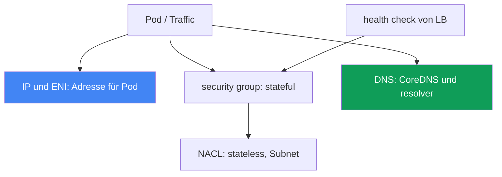
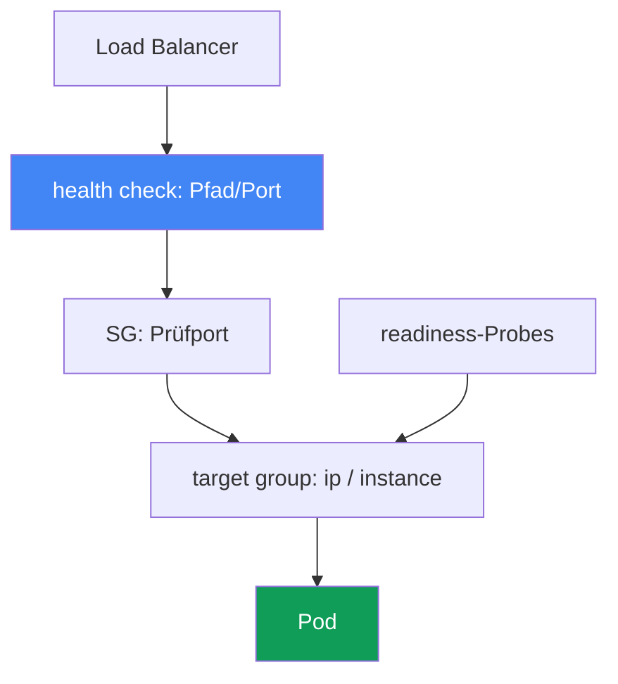

[Русская версия](ru.md) · [Eng version](en.md) · [Versión en español](es.md) · [Version française](fr.md) · [ქართული ვერსია](ge.md) · [繁體中文版](tw.md) · [日本語版](jp.md)
# Kapitel 46. Netzwerkfehler: ENI exhausted, SG und NACL, DNS, unhealthy targets im Load Balancer

> **Wie es weitergeht.** Kapitel 45 behandelte, warum eine Node dem Cluster überhaupt nicht beitritt. Hier geht es um Netzwerkfehler in einem bereits laufenden Cluster: Ein Pod erhält keine IP, die Verbindung reißt ab, DNS versagt oder Targets im Load Balancer werden rot. Verwandte Themen behandeln andere Kapitel: Aufbau von VPC CNI, ENI und IPs auf Nodes sowie prefix delegation - Kapitel 7 und 8, NLB- und ALB-Load-Balancer - Kapitel 26 und 27, CoreDNS-Metriken - Kapitel 33, und „Node ist nicht beigetreten“ - Kapitel 45. Hier erkennen Sie anhand des Symptoms die Klasse des Netzwerkfehlers und bestätigen sie.

## 46.1. Vier Symptome einer Fehlerklasse

Der Cluster läuft, Nodes sind `Ready`, doch das Netzwerk versagt auf unterschiedliche Weise. Vier typische Bilder.

**Pod hängt in `ContainerCreating`.** Er wurde einer Node zugewiesen, startet aber nicht:

```bash
kubectl describe pod web-7d9f-abcde
# Events:
#   Warning  FailedCreatePodSandBox  kubelet
#   failed to assign an IP address to container
```

`failed to assign an IP address to container` bedeutet, dass VPC CNI dem Pod keine Adresse zugeteilt hat: Entweder sind auf der Node keine verfügbaren IPs mehr vorhanden oder das Subnet ist erschöpft.

**Verbindung reißt ab.** Ein Pod erreicht einen anderen Pod, RDS oder eine externe API nicht: `connection timed out`, obwohl DNS auflöst. Meist sind Regeln der security group oder NACL die Ursache.

**Targets im Load Balancer sind `unhealthy`.** Ein Dienst hinter NLB oder ALB liefert 502 oder 503, und die Targets der target group sind nicht `healthy`:

```bash
aws elbv2 describe-target-health --target-group-arn "$TG_ARN" \
  --query "TargetHealthDescriptions[?TargetHealth.State!='healthy'].[Target.Id,TargetHealth.State,TargetHealth.Reason]"
# [ ["10.0.3.17", "unhealthy", "Target.FailedHealthChecks" ] ]
```

**DNS versagt zeitweise.** Das Auflösen funktioniert mal und fällt dann per Timeout aus - ein schwankendes Problem, das schwer einzufangen ist.

Der Kerngedanke: Das ist nicht ein Fehler, sondern eine Klasse von Netzwerkfehlern auf verschiedenen Ebenen: Adressierung, security group, NACL, DNS und health check des Load Balancers. Die Symptome ähneln sich (etwas „geht nicht“), Schichten und Werkzeuge unterscheiden sich. Unten gibt es je Schicht einen Abschnitt und in 46.7 Checkliste und Reihenfolge.



## 46.2. Erschöpfung von IP und ENI

VPC CNI gibt jedem Pod eine echte IP aus dem VPC-Subnet (Kapitel 6). Pods konkurrieren somit um eine endliche Ressource, die auf zwei unterschiedliche Arten ausgeht.

**Keine IPs mehr auf der Node.** Wie viele Pods auf eine Node passen, bestimmen nicht nur CPU und Speicher, sondern das Limit `max-pods`. Es hängt vom Instance-Typ ab: Anzahl der ENIs, die eine Instance halten kann, multipliziert mit den IPs je ENI. Eine kleine Instance hat wenige ENIs und IPs und damit ein niedriges `max-pods`. Sind die freien IPs erschöpft, erhält ein neuer Pod keine Adresse und hängt mit `failed to assign an IP address to container` in `ContainerCreating`.

**Subnet erschöpft.** Selbst wenn auf der Node Platz für eine ENI ist, stammt die Adresse aus dem Subnet. Ein kleines Subnet (etwa `/26`, zusätzlich mit Load Balancer und anderen Verbrauchern) gerät schnell in subnet IP exhaustion: Es gibt keine freien Adressen, eine ENI wird nicht erstellt und Pods erhalten keine IP.

Entscheidend ist, wo das Limit erreicht wurde:

```bash
# wie viele Adressen tatsächlich vergeben sind und welches Limit die Node hat
kubectl get pods -o wide --field-selector spec.nodeName=<node> | wc -l
kubectl get node <node> -o jsonpath='{.status.allocatable.pods}'
# freie IPs im Subnet
aws ec2 describe-subnets --subnet-ids <subnet> \
  --query 'Subnets[0].AvailableIpAddressCount'
```

Die Abhilfe steht in Kapitel 7 und 8; hier nur die Übersicht:

| Maßnahme | Wirkung | Details |
|---|---|---|
| prefix delegation | ENI erhält `/28`-Präfixe statt einzelner IPs - deutlich mehr Pods je Node | Kapitel 7 |
| Sizing der Subnets | große Subnets für Pods, damit keine subnet exhaustion entsteht | Kapitel 6 |
| secondary CIDR | zusätzlichen Adressraum für Pods zur VPC hinzufügen | Kapitel 7 |
| `WARM_ENI_TARGET` / `WARM_IP_TARGET` | Anzahl der vorgehaltenen IPs - Abwägung zwischen Geschwindigkeit und Verbrauch | Kapitel 8 |

Prefix delegation ist der wirksamste Hebel: Statt einzelner sekundärer IPs erhält die ENI Präfixe, und `max-pods` pro Node wächst erheblich. Konfiguration und Kompatibilität stehen in Kapitel 7.

## 46.3. Security groups: stateful Filter auf ENI-Ebene

Eine security group (SG) ist eine Firewall auf ENI-Ebene und **stateful**: Ist eine ausgehende Verbindung erlaubt, passiert der Antwortverkehr automatisch, eine separate eingehende Regel für die Antwort ist nicht nötig. Das unterscheidet sie wesentlich von NACL im nächsten Abschnitt.

In EKS wirken mehrere SGs, deren Verwechslung oft die Ursache für „geht nicht“ ist:

- **cluster security group** - wird von EKS erstellt; darüber läuft Traffic zwischen control plane und Nodes und standardmäßig auch zwischen Nodes.
- **Node-SG** - an die ENIs der node-group-Instances gebunden (über launch template, Kapitel 10).
- **security groups for pods** - eine eigene SG auf Ebene eines bestimmten Pods. Die Ressource `SecurityGroupPolicy` bindet nach Selector eine SG-Liste an Pods; VPC CNI weist ihnen eine eigene branch ENI mit diesen SGs zu. Die Policy gilt nur für neu geplante Pods; bereits laufende ändern sich nicht.

Typische Verbindungsprobleme durch SG:

- **Pod-Pod zwischen verschiedenen SGs.** Erhalten Pods über `SecurityGroupPolicy` SGs und erlauben Regeln keinen gegenseitigen Traffic, hängt die Verbindung still bis zum Timeout.
- **Pod-RDS.** Die SG der Datenbank hat keine inbound-Regel für Traffic von Node- oder Pod-SG auf den DB-Port. Abhilfe schafft ein SG-Referenz: Die RDS-Regel enthält nicht einen CIDR, sondern die ID der erlaubten SG.
- **Pod-externer Dienst.** Die Egress-Regel der SG lässt Traffic nicht über den benötigten Port hinaus.

Eine SG-Referenz (Regel referenziert eine andere SG statt eines Adressbereichs) ist robust: Sie bricht nicht bei Adresswechsel und überlebt das Neuerstellen von Instances.

```bash
# welche SGs auf der ENI von Node oder Pod liegen
aws ec2 describe-network-interfaces \
  --filters "Name=private-ip-address,Values=10.0.3.17" \
  --query 'NetworkInterfaces[0].Groups'
```

### Eigene SG für einen Pod: Was stillschweigend bricht

Mikrosegmentierung ist aktiviert, die Pod-SG beschrieben, Datenbankzugriff erlaubt, der Pod läuft - doch Namen werden nicht aufgelöst, readiness schlägt fehl oder ausgehender Traffic funktioniert nicht. Der Grund: Für einen Pod mit branch ENI gelten **NUR** dessen SGs; Regeln der Node-SG gelten nicht. Das dokumentierte Minimum für die Pod-SG:

| In Pod-SG öffnen | Zweck und Fehler ohne Regel |
|---|---|
| vorhandene SG-ID | bei falscher ID hängt der Pod dauerhaft beim Erstellen; in `describe pod` steht bei `CreateNetworkInterface` `InvalidSecurityGroupID.NotFound` - erstes Zeichen eines Tippfehlers |
| Eingang von Node-SG auf Probe-Ports | `kubelet` sendet die Probes; ohne dies bestehen readiness und liveness nicht, und der Pod gelangt nicht in endpoints (46.6). Häufigste Ursache |
| Ausgang 53 über TCP und UDP | beide Transporte zu SGs der CoreDNS-Pods oder der Nodes, auf denen CoreDNS läuft; CoreDNS hat meist keine eigene SG, praktisch ist dies die Node-SG oder cluster security group |
| Eingang 53 über TCP und UDP in CoreDNS-SG | Rückregel zwingend: Egress des Pods allein ist nur die halbe Konfiguration |
| Regeln zu benötigten Pods | ohne sie hängt Traffic zu Kommunikationspartnern still bis zum Timeout |
| control plane | nötig bei SG mit Fargate; am einfachsten wird die cluster security group als eine Pod-SG angegeben. Für Pods auf EC2-Nodes steht diese Anforderung nicht in der Liste: Kubernetes API benötigt regulär ausgehendes 443 |

Die Falle „funktioniert manchmal“: Regeln der Pod-SG gelten nicht für Pod-zu-Pod- und Pod-zu-Service-Traffic auf derselben Node, einschließlich `kubelet` und `nodeLocalDNS`; Pods mit unterschiedlichen SGs auf derselben Node kommunizieren gar nicht, denn sie liegen in verschiedenen Subnets und das Routing dazwischen ist deaktiviert. Das Symptom schwankt je nach Platzierung des Pods und von CoreDNS. Der Enforcement-Modus entscheidet, wessen SG Sie debuggen. Standardmäßig gilt `POD_SECURITY_GROUP_ENFORCING_MODE=strict`: Source NAT für ausgehenden Traffic solcher Pods ist abgeschaltet; nach außen gelangen sie nur von einer Node in einem privaten Subnet mit NAT, aus einem öffentlichen Subnet haben sie kein Internet. Mit `standard` verlässt Traffic außerhalb der VPC die primary ENI der Instance und unterliegt der Node-SG. Für Probes über branch ENI ist `DISABLE_TCP_EARLY_DEMUX=true` im init-Container `aws-node` nötig; ab VPC CNI 1.11.0 und `standard` nicht mehr.

```bash
# SG-Enforcement-Modus für Pods und branch-ENI-Einstellungen, dann nach Fehlern in der SG-ID suchen
kubectl describe daemonset aws-node -n kube-system | grep -iE 'SECURITY_GROUP|DEMUX'
kubectl describe pod <pod> | grep -i InvalidSecurityGroupID
```

## 46.4. NACL: stateless Filter auf Subnet-Ebene

Eine Network ACL (NACL) wirkt auf Subnet-Ebene und ist anders als SG **stateless**: Regeln für eingehenden und ausgehenden Traffic sind vollständig unabhängig. Einen Request zu erlauben reicht nicht; auch die Antwort muss separat erlaubt werden.

Das führt zur klassischen Falle. Eine Verbindung verlässt das Subnet von einem Port zu einem entfernten Port, die Antwort kommt jedoch auf einem **ephemeral port** zurück, einem temporären Port aus einem hohen Bereich, den der Client gewählt hat. Erlaubt die NACL-Regel für ausgehenden Traffic (oder eingehenden Antworttraffic) nicht den Bereich der ephemeral ports, werden Antworten verworfen und die Verbindung hängt, obwohl der Request hinausging. In der Praxis muss eine NACL Rückverkehr über ephemeral ports (`1024-65535`) erlauben, sonst schließen TCP-Sitzungen nicht.

| Eigenschaft | Security group | NACL |
|---|---|---|
| Ebene | ENI (Node, Pod) | Subnet |
| Zustand | stateful, Antwort automatisch erlaubt | stateless, Antwort separat erlauben |
| Regeln | nur allow | allow und deny, Priorität nach Nummer |
| ephemeral ports | automatisch berücksichtigt | manuell erlauben |

Die Standard-NACL erlaubt allen Traffic, daher ist sie in den meisten Clustern nicht beteiligt. Hängt das Security-Team jedoch benutzerdefinierte NACLs an Subnets, werden diese bei Abbrüchen verdächtig, die SG-Regeln nicht erklären. Die Trennung ist einfach: SG scheitert nicht an ephemeral ports. Liegt das Problem im Rückverkehr, untersuchen Sie NACL.

## 46.5. DNS-Fehler: intermittierende Timeouts

Die heimtückischste Klasse: Auflösung funktioniert mal und fällt dann aus. Mehrere Ursachen überlagern sich.

**CoreDNS ist überlastet oder nicht verfügbar.** CoreDNS-Pods bewältigen den Request-Strom nicht oder es gibt zu wenige für den Cluster. Symptom sind steigende Latenz und Resolution-Timeouts unter Last. EKS unterstützt CoreDNS-Autoscaling; CoreDNS-Metriken für die Diagnose behandelt Kapitel 33.

**Effekt `ndots:5`.** Kubernetes schreibt Pods `ndots:5` und eine Liste von search domains. Ein Name mit weniger als fünf Punkten (fast alle, etwa `api.example.com`) wird zuerst mit allen search domains probiert und erst danach unverändert. Ein externer Request wird zu mehreren zusätzlichen und multipliziert DNS-Last. Für häufige externe Namen hilft ein FQDN mit Punkt am Ende (`api.example.com.`), der die Suche deaktiviert.

**conntrack table full.** Jede Verbindung, auch ein UDP-DNS-Request, belegt einen Eintrag in der conntrack-Tabelle des Node-Kernels. Bei Überlauf werden neue Verbindungen verworfen; DNS über UDP leidet zuerst und verursacht schwankende Timeouts. Prüfen Sie die Nutzung von `nf_conntrack` auf der Node.

**DNS-Throttling auf ENI-Ebene.** Jede ENI hat ein festes packets-per-second-Limit zum VPC resolver (Route 53 Resolver). Senden alle Pods einer Node DNS über eine ENI und erreichen es, werden Pakete verworfen - erneut schwankende Timeouts ohne Bezug zu einem Namen.

**Abhilfe: NodeLocal DNSCache.** Ein lokaler DNS-Cache-Agent auf der Node beantwortet Pods aus dem Cache und hält eine TCP-Verbindung zu CoreDNS. Das verringert UDP-Last und per-ENI-Throttling und stabilisiert die Latenzspitze.

```bash
# funktioniert die Auflösung aus dem Debug-Pod?
kubectl run dnstest --image=busybox:1.36 --rm -it --restart=Never -- \
  nslookup kubernetes.default.svc.cluster.local
# Zustand der CoreDNS-Pods
kubectl -n kube-system get pods -l k8s-app=kube-dns -o wide
```

## 46.6. Unhealthy targets im Load Balancer

Ein Dienst hinter NLB oder ALB liefert 502 oder 503, weil der Load Balancer keine gesunden Targets sieht (Kapitel 26 und 27). Der Load Balancer sendet health checks; bei Fehlschlag wird ein Target aus der Rotation genommen.

- **Falscher health check.** Pfad, Port oder Protokoll passen nicht zu dem, was die Anwendung wirklich bedient. ALB prüft standardmäßig `/`, die App gibt aber nur auf `/healthz` `200` zurück - Target ist `unhealthy`, obwohl der Pod lebt.
- **SG lässt health check nicht durch.** Die SG des Targets (Node bei target-type `instance`, Pod bei `ip`) erlaubt keinen eingehenden Traffic von der Load-Balancer-SG auf den Prüfport. Die Prüfung erreicht es nicht und das Target wird rot.
- **target-type und Ports passen nicht.** Bei `ip` ist das Target die Pod-IP und sein `containerPort`; bei `instance` die Node und `NodePort`. Ein Fehler im Typ oder target-group-Port prüft die falsche Stelle.
- **Readiness-Probe des Pods nicht bereit.** Bis readiness erfolgreich ist, gelangt der Pod nicht in endpoints und die target group bzw. bleibt `unhealthy`. Der Load Balancer spiegelt den Anwendungszustand korrekt.

Client-Symptom: 502 (`Bad gateway`) heißt meist, ein Target antwortete fehlerhaft oder die Verbindung riss ab; 503 (`Service unavailable`) heißt, dass überhaupt keine gesunden Targets vorhanden sind. Die Diagnose geht von target group zum Pod:

```bash
# Status und Ursachen je Target
aws elbv2 describe-target-health --target-group-arn "$TG_ARN" \
  --query 'TargetHealthDescriptions[].[Target.Id,TargetHealth.State,TargetHealth.Reason]'
# gibt es bereite Endpoints hinter dem Service?
kubectl get endpointslices -l kubernetes.io/service-name=<svc>
```

Der health-check-Pfad zeigt, wo die Kette reißt; readiness entscheidet, ob ein Pod in die target group gelangt.



## 46.7. Reihenfolge der Diagnose und Werkzeuge

Netzwerke werden nicht geraten, sondern vom Symptom zur Schicht repariert. Die zentralen Werkzeuge:

```bash
# 1. Pod-Ereignisse: Grund für ContainerCreating und IP-Zuweisung
kubectl describe pod <pod>
# 2. wo ist der Pod und auf welcher Node?
kubectl get pods -o wide
# 3. ENI, IP und SG an einer bestimmten Adresse
aws ec2 describe-network-interfaces \
  --filters "Name=private-ip-address,Values=<ip>" --query 'NetworkInterfaces[0]'
# 4. freie Adressen im Subnet
aws ec2 describe-subnets --subnet-ids <subnet> \
  --query 'Subnets[0].AvailableIpAddressCount'
# 5. Gesundheit der Load-Balancer-Targets
aws elbv2 describe-target-health --target-group-arn "$TG_ARN"
# 6. Auflösung aus einem Pod prüfen
kubectl run dnstest --image=busybox:1.36 --rm -it --restart=Never -- nslookup <name>
# 7. auf der Node: VPC-CNI-Netzwerkdump sammeln (ipamd-/plugin-Logs, ENI, eni-configs)
aws ssm send-command --document-name "AWS-RunShellScript" --instance-ids <instance-id> \
  --parameters 'commands=["/opt/cni/bin/aws-cni-support.sh"]'
```

Ein separates Werkzeug für „stille“ Abbrüche sind **VPC Flow Logs**: Sie zeigen, ob ein Paket auf ENI- oder Subnet-Ebene ACCEPT oder REJECT erhielt. `REJECT` weist direkt auf SG oder NACL; fehlende Antwortpakete bei einem hinausgegangenen Request auf stateless NACL und ephemeral ports.

Hängt ein Pod mit `failed to assign an IP address` und ist unklar, ob IPs erschöpft sind oder die ENI nicht hochkam, geht die Diagnose auf die Node. VPC CNI hält Logs in `/var/log/aws-routed-eni` (`ipamd.log`, `plugin.log`); `/opt/cni/bin/aws-cni-support.sh` sammelt sie mit ENI-/IP-Status und Konfiguration in ein Archiv `/var/log/eks_<instance-id>_<...>.tar.gz`. Es wird ohne SSH über SSM auf der Node gestartet. Den ipamd-Status zeigt auch `curl http://localhost:61679/v1/enis` mit ausgegebenen ENIs und IPs; `/v1/pods` zeigt die Bindung von Adressen an Pods.

Checkliste „Symptom - wahrscheinliche Ursache - Prüfung“:

| Symptom | Wahrscheinliche Ursache | Prüfung |
|---|---|---|
| `failed to assign an IP address` | keine freien IPs auf Node oder im Subnet | `describe pod`, `AvailableIpAddressCount` |
| Pod-Pod- oder Pod-RDS-Timeout | SG erlaubt Traffic nicht | `describe-network-interfaces` Groups, RDS-SG |
| Abbruch, aber Request geht hinaus | NACL verwirft ephemeral ports | NACL-Regeln in/out, VPC Flow Logs |
| DNS mit intermittierenden Timeouts | CoreDNS, conntrack, per-ENI-Throttling | CoreDNS-Metriken (Kapitel 33), conntrack, PPS |
| zusätzliche DNS-Last bei externen Namen | Effekt `ndots:5` | search domains, FQDN mit Punkt |
| 502 oder 503 von Service hinter LB | Targets `unhealthy` | `describe-target-health`, health check, SG |
| Targets `unhealthy`, Pod lebt | health-check-Pfad/-Port oder SG | Prüfpfad/-port, Load-Balancer-SG |
| Pod ohne DNS und ohne readiness | eigene Pod-SG statt Node-SG | `SecurityGroupPolicy` des Pods, 53 TCP/UDP, Eingang von Node-SG |

Logik: Zuerst Symptom klassifizieren (keine IP / Verbindungsabbruch / DNS / 5xx von LB), dann in die passende Schicht gehen. `describe pod` und `get pods -o wide` sind günstig und grenzen IP-Probleme zuerst ein; `describe-target-health` lokalisiert Load-Balancer-Fehler sofort; VPC Flow Logs sind die letzte Instanz bei Abbrüchen, die IP oder health check nicht erklären.

## 46.8. Einsatz in der Produktion

- **Symptom vor der Diagnose klassifizieren.** Keine IP, Verbindungsabbruch, DNS-Timeouts und 5xx von LB sind vier unterschiedliche Schichten. Erst Klasse bestimmen, dann Werkzeug wählen.
- **Adressplan früh planen.** Große Pod-Subnets und prefix delegation (Kapitel 7) verhindern IP-Erschöpfung vor dem Traffic-Peak.
- **SG-Referenzen statt CIDR verwenden.** Regeln, die Node- oder Pod-SGs referenzieren, überstehen neue Instances und Adresswechsel und reduzieren unerwartete RDS-Abbrüche.
- **NodeLocal DNSCache auf belasteten Clustern einsetzen.** Der lokale Cache reduziert per-ENI-Throttling und conntrack-Überlauf durch DNS und beseitigt eine schwer fassbare Incident-Klasse.
- **Health checks bewusst im Manifest halten.** Pfad, Port und Protokoll sind mit readiness-Probe und Target-Ports abgestimmt, damit `unhealthy` ein echtes Problem und kein Tippfehler bedeutet.
- **VPC Flow Logs auf Produktions-Subnets aktivieren.** Verschwindet Traffic still, spart `REJECT` in Logs Stunden des Ratens zwischen SG und NACL.

## 46.9. Mini-Glossar

- **`failed to assign an IP address to container`** - VPC CNI konnte dem Pod keine IP geben: Adressen auf Node oder im Subnet sind erschöpft.
- **`max-pods`** - Pod-Limit einer Node, abhängig von ENIs und IPs je ENI des Instance-Typs.
- **subnet IP exhaustion** - im Subnet sind keine freien Adressen mehr für ENIs und Pods vorhanden.
- **prefix delegation** - Zuteilung von `/28`-Präfixen an ENIs statt einzelner IPs, für mehr Pods je Node (Kapitel 7).
- **security group** - stateful Firewall auf ENI-Ebene; die Antwort auf einen erlaubten Request passiert automatisch.
- **`SecurityGroupPolicy`** - Ressource, die SGs nach Selector an Pods bindet (security groups for pods); ein Pod mit branch ENI erbt nicht mehr die Node-SG-Regeln.
- **`POD_SECURITY_GROUP_ENFORCING_MODE`** - `strict` ohne source NAT gegenüber `standard`, wo Traffic außerhalb der VPC über die primary ENI nach Node-SG-Regeln geht.
- **NACL** - stateless Filter auf Subnet-Ebene; eingehende und ausgehende Regeln sind unabhängig.
- **ephemeral ports** - hoher Bereich `1024-65535`, auf den Antworttraffic geht; NACL muss ihn manuell erlauben.
- **`ndots:5`** - resolv.conf-Einstellung von Pods, durch die Namen über search domains probiert werden.
- **conntrack** - Verbindungstabelle des Node-Kernels; bei Überlauf werden neue Verbindungen verworfen.
- **NodeLocal DNSCache** - lokaler DNS-Cache auf der Node, der CoreDNS-Last und per-ENI-Throttling senkt.
- **`describe-target-health`** - Befehl, der Status und Ursache für Targets einer target group zeigt.

## 46.10. Zusammenfassung des Kapitels

- Netzwerkfehler in einem laufenden Cluster sind Fehlerklassen auf unterschiedlichen Ebenen: IP und ENI, security group, NACL, DNS und health check des Load Balancers. Symptome ähneln sich, Schichten und Werkzeuge nicht.
- `failed to assign an IP address to container` ist IP-Erschöpfung: entweder `max-pods` auf der Node oder subnet IP exhaustion. Prefix delegation und Subnet-Sizing mildern sie (Kapitel 7 und 8).
- Security groups sind stateful und wirken auf ENI-Ebene; Pod-Pod-, Pod-RDS- und Egress-Abbrüche sind meist SG-Regeln. SG-Referenzen sind robuster als CIDR.
- Eine eigene Pod-SG ersetzt Node-SG-Regeln. Daher müssen 53 über TCP und UDP in beide Richtungen sowie Eingang von Node-SG auf Probe-Ports manuell ergänzt werden, sonst verliert der Pod still DNS und readiness.
- NACL ist stateless und auf Subnet-Ebene; die klassische Falle ist nicht erlaubter Rückverkehr auf ephemeral ports. Standard-NACL lässt alles durch, verdächtig wird NACL bei benutzerdefinierten Regeln.
- DNS-Timeouts schwanken: Ursachen sind CoreDNS-Überlastung, `ndots:5`, conntrack-Überlauf und per-ENI-Throttling zum resolver. NodeLocal DNSCache und CoreDNS-Autoscaling helfen.
- Unhealthy targets in NLB und ALB führen zu 502 und 503: falscher health check, SG blockiert die Prüfung, target-type/Ports passen nicht oder Pod-readiness fehlt. Diagnose: `describe-target-health`.
- Reihenfolge: Symptom klassifizieren, dann Werkzeug der Schicht: `describe pod`, `describe-network-interfaces`, `describe-target-health`, `nslookup` im Pod, VPC Flow Logs.

## 46.11. Nutzen in der praktischen Arbeit

Im Bereitschaftsdienst wirkt ein Netzwerk-Incident wie „etwas geht nicht“, und das erste Werkzeug liegt verlockend nahe. Erfolgreich ist, wer zuerst die Klasse benennt: Pod ohne IP, Verbindungsabbruch, schwankendes DNS oder 5xx vom Load Balancer. Die Klasse gibt sofort Schicht und Befehl vor. Ein Pod in `ContainerCreating` verlangt `describe pod` und freie IPs, nicht tcpdump. 503 verlangt `describe-target-health`, nicht Pod-Neustarts. Korrekte Klassifizierung spart Zeit, während der Dienst ausfällt.

Bei Planung werden dieselben Schichten zur Prävention: Große Subnets und prefix delegation verhindern IP-Erschöpfung vor dem Peak; SG-Referenzen und bewusste health checks beseitigen ganze Abbruchklassen; NodeLocal DNSCache dämpft DNS-Throttling an ENIs; VPC Flow Logs machen aus einem „stillen“ Abbruch ein `REJECT`. Den Unterschied von stateful SG und stateless NACL zu kennen und zu wissen, wo IPs ausgehen, spart Stunden, weil es direkt zur richtigen Schicht führt.

## 46.12. Fragen zur Selbstkontrolle

1. Warum sind Netzwerkfehler im Cluster eine Fehlerklasse statt eines einzelnen Fehlers? Nennen Sie die Schichten.
2. Was bedeutet `failed to assign an IP address to container`, und welche zwei Ursachen stehen dahinter?
3. Wovon hängt `max-pods` auf einer Node ab, und wie verändert prefix delegation das Bild (Kapitel 7)?
4. Wie unterscheiden sich IP-Erschöpfung auf der Node und subnet IP exhaustion, und wie prüfen Sie beide?
5. Warum heißt eine security group stateful, und wie vereinfacht das Regeln gegenüber NACL?
6. Welche SGs wirken in EKS, und was macht `SecurityGroupPolicy` (security groups for pods)?
7. Was funktioniert bei einem Pod mit eigener SG nicht mehr, und welche Regeln werden manuell ergänzt?
8. Warum erreicht ein Pod RDS trotz korrektem DNS nicht, und was ist eine SG-Referenz?
9. Was ist die NACL-Falle mit ephemeral ports, und warum gibt es sie bei security groups nicht?
10. Nennen Sie Ursachen schwankender DNS-Timeouts: Welche Rolle spielen `ndots:5`, conntrack und das per-ENI-Limit?
11. Wie mildert NodeLocal DNSCache DNS-Fehler, und welche Last nimmt es weg?
12. Warum sind Targets im Load Balancer `unhealthy`, und was zeigt `describe-target-health`?
13. Was unterscheidet 502 von 503 bei einer Load-Balancer-Antwort für die Diagnose?
14. Wann sollten Sie für einen Verbindungsabbruch VPC Flow Logs heranziehen, und wonach suchen Sie dort?

## Praxis

Zu diesem Thema gehören zwei Kurslabore. [Labor 120 - Netzwerkfehler und unhealthy
targets](../../labs/120/README_DE.MD): Sie installieren AWS Load Balancer Controller, erhalten einen
NLB mit eigener security group ohne inbound-Regeln, sehen `Target.FailedHealthChecks`, beweisen die
Ursache und reparieren den Zugriff. Start: `TASK=120 make run_eks_task`.

[Labor 126 - security groups for pods](../../labs/126/README_DE.MD) behandelt dieselbe Schicht aus
einer anderen Richtung: Ein Pod erhält seine eigene branch ENI, Node-Regeln gelten nicht mehr, und
Sie sehen `Running`, aber nicht `Ready`, finden die fehlende Regel für die `kubelet`-Probe, klären,
warum DNS mit einer Regel auf CoreDNS-Seite statt Pod-Egress repariert wird, und prüfen das Verhalten
zwischen `strict` und `standard`. Start: `TASK=126 make run_eks_task`. Die Prüfung erfolgt in beiden
Laboren mit `check_result`.

Neben dem Labor ist dieses Kapitel ein diagnostisches Runbook. Alle Prüfungen können sicher auf
einem gesunden Cluster ausgeführt werden, um den Normalzustand zu kennen und Abweichungen schneller
zu erkennen.

Sehen Sie zuerst Pod- und Subnet-Adressierung an:

```bash
# wie viele Pods pro Node vorhanden sind und welches Limit gilt
kubectl get pods -A -o wide --field-selector spec.nodeName=<node>
kubectl get node <node> -o jsonpath='{.status.allocatable.pods}'
# freie Adressen im Node-Subnet: normalerweise ist die Reserve groß
aws ec2 describe-subnets --subnet-ids <subnet> \
  --query 'Subnets[0].AvailableIpAddressCount'
```

Klären Sie dann, welche SGs an der ENI eines laufenden Pods hängen, und prüfen Sie die Auflösung im Inneren:

```bash
# ENI und ihre security groups anhand der Pod-IP
aws ec2 describe-network-interfaces \
  --filters "Name=private-ip-address,Values=<pod-ip>" \
  --query 'NetworkInterfaces[0].[NetworkInterfaceId,Groups]'
# DNS aus dem Debug-Pod: ein interner und ein externer Name
kubectl run dnstest --image=busybox:1.36 --rm -it --restart=Never -- \
  sh -c 'nslookup kubernetes.default; nslookup example.com'
```

Gibt es im Cluster einen Dienst hinter einem Load Balancer, sehen Sie Target-Health an und vergleichen sie mit Pod-readiness:

```bash
# Target-Zustand: normalerweise sind alle healthy
aws elbv2 describe-target-health --target-group-arn "$TG_ARN" \
  --query 'TargetHealthDescriptions[].[Target.Id,TargetHealth.State]' --output table
# bereite Endpoints hinter dem Service
kubectl get endpointslices -l kubernetes.io/service-name=<svc>
```

Aktivieren Sie zum Schluss VPC Flow Logs auf den Node-Subnets und sehen Sie das Format an: Die Spalte action mit `ACCEPT` oder `REJECT` ist das, wonach Sie bei einem „stillen“ Abbruch suchen. Vergleichen Sie mit der Checkliste aus 46.7: In einem gesunden Cluster sind IPs verfügbar, SGs an ENIs erwartet, DNS löst interne und externe Namen auf und Targets sind `healthy`. Wer die Norm kennt, lokalisiert die Schicht schneller, wenn das Netzwerk versagt.

---
[Inhaltsverzeichnis](../README_DE.md) · [Kapitel 45](../45/de.md) · [Kapitel 47](../47/de.md)
