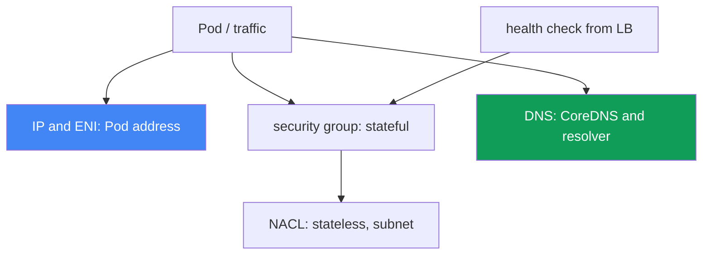
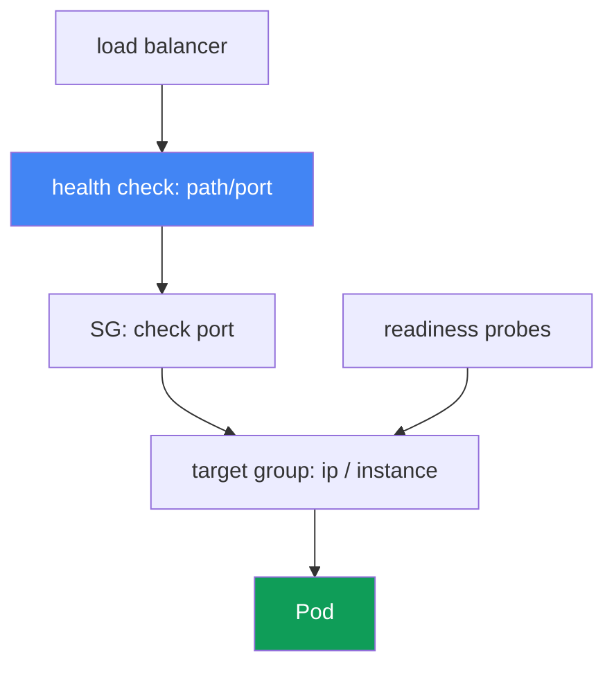

[Русская версия](ru.md) · [Versión en español](es.md) · [Version française](fr.md) · [Deutsche Version](de.md) · [ქართული ვერსია](ge.md) · [繁體中文版](tw.md) · [日本語版](jp.md)
# Chapter 46. Network failures: ENI exhaustion, SG and NACL, DNS, unhealthy load-balancer targets

> **What is next.** Chapter 45 examined why a node did not join the cluster at all. Here we cover
> network failures in an already running cluster: a Pod cannot get an IP, connectivity breaks, DNS
> fails, and load-balancer targets turn red. Related topics belong to other chapters: VPC CNI, ENIs,
> and IPs on nodes are chapters 7 and 8; NLB and ALB load balancers are chapters 26 and 27; CoreDNS
> metrics are chapter 33; and “node did not join” is chapter 45. Here is how to recognize the class
> of network failure by its symptom and how to confirm it.

## 46.1. Four symptoms of one class

The cluster works and nodes are `Ready`, but the network can fail in different ways. There are four
common patterns.

**A Pod is stuck in `ContainerCreating`.** It was scheduled onto a node but does not start:

```bash
kubectl describe pod web-7d9f-abcde
# Events:
#   Warning  FailedCreatePodSandBox  kubelet
#   failed to assign an IP address to container
```

The message `failed to assign an IP address to container` means VPC CNI did not assign an address
to the Pod: either the node has run out of available IPs or the subnet has run out.

**Connectivity breaks.** A Pod cannot reach another Pod, RDS, or an external API: it gets
`connection timed out` even though DNS resolves. This is most often security group or NACL rules.

**Load-balancer targets are `unhealthy`.** A service behind an NLB or ALB returns 502 or 503, and
targets in the target group are not in the `healthy` state:

```bash
aws elbv2 describe-target-health --target-group-arn "$TG_ARN" \
  --query "TargetHealthDescriptions[?TargetHealth.State!='healthy'].[Target.Id,TargetHealth.State,TargetHealth.Reason]"
# [ ["10.0.3.17", "unhealthy", "Target.FailedHealthChecks"] ]
```

**DNS fails intermittently.** Resolution works sometimes and times out at other times: a fluctuating
problem that is hard to catch.

The key idea of this chapter is that this is not one error, but a class of network failures at
different layers: addressing, security groups, NACLs, DNS, and load-balancer health checks. The
symptoms look alike (something “does not work”), but the layers and tools differ. The following
sections cover one layer each; section 46.7 provides a checklist and order of operations.



## 46.2. IP and ENI exhaustion

VPC CNI gives every Pod a real IP from the VPC subnet (chapter 6). Pods therefore compete for a
finite resource, which can run out in two different ways.

**The node has run out of IPs.** The number of Pods that fit on a node is determined not only by CPU
and memory, but also by the `max-pods` limit. It depends on the instance type: the number of ENIs
an instance can hold multiplied by the number of IPs per ENI. A small instance holds few ENIs and
few IPs, so its `max-pods` is low. When the node's free IPs are exhausted, a new Pod cannot get an
address and remains in `ContainerCreating` with `failed to assign an IP address to container`.

**The subnet has run out.** Even if a node has room for another ENI, its address comes from a
subnet. A small subnet (for example, `/26`, while it also hosts a Load Balancer and other
consumers) quickly reaches subnet IP exhaustion: no free subnet addresses remain, an ENI cannot be
created, and Pods cannot get IPs.

The following distinguishes where the limit was reached:

```bash
# number of actually assigned addresses and the limit on the node
kubectl get pods -o wide --field-selector spec.nodeName=<node> | wc -l
kubectl get node <node> -o jsonpath='{.status.allocatable.pods}'
# free IPs in the subnet
aws ec2 describe-subnets --subnet-ids <subnet> \
  --query 'Subnets[0].AvailableIpAddressCount'
```

Mitigation is covered in chapters 7 and 8; here is only a map of the options:

| Technique | What it provides | Details |
|---|---|---|
| prefix delegation | An ENI gets /28 prefixes rather than individual IPs: vastly more Pods per node | chapter 7 |
| subnet sizing | Large subnets for Pods, so they do not hit subnet exhaustion | chapter 6 |
| secondary CIDR | Add VPC address space for Pods | chapter 7 |
| `WARM_ENI_TARGET` / `WARM_IP_TARGET` | Number of spare IPs to keep: a balance of speed and consumption | chapter 8 |

Prefix delegation is the most effective lever: instead of individual secondary IPs, ENIs receive
prefixes, and a node's `max-pods` increases many times over. Configuration and compatibility are
covered in chapter 7.

## 46.3. Security groups: a stateful filter at the ENI level

A security group (SG) is a firewall at the ENI level, and it is **stateful**: if an outbound
connection is allowed, return traffic passes automatically, with no separate inbound rule for the
reply. This is the key difference from the NACL in the next section.

Several SGs participate in EKS, and confusing them is a frequent root cause of “it does not work”:

- **cluster security group**: created by EKS; it carries traffic between the control plane and
  nodes, and by default between the nodes themselves.
- **node SG**: attached to ENIs of node group instances (through the launch template, chapter 10).
- **security groups for Pods**: a separate SG at an individual Pod level. It is specified by a
  `SecurityGroupPolicy` resource, which uses a selector to attach a list of SGs to Pods; VPC CNI
  allocates those Pods their own branch ENI with these SGs. Importantly, the policy applies only to
  newly scheduled Pods; existing ones do not change.

Typical connectivity failures caused by an SG include:

- **Pod-to-Pod across different SGs.** If Pods get SGs through `SecurityGroupPolicy` but rules do
  not allow traffic between them, the connection silently waits until a timeout.
- **Pod-to-RDS.** The database SG has no inbound rule allowing traffic from the node or Pod SG to
  the database port. Fix it with an SG reference: add the ID of the permitted SG to the RDS rule,
  not a CIDR.
- **Pod-to-external service.** An SG egress rule does not permit traffic to the required port.

An SG reference (a rule referring to another SG rather than an address range) is a robust style: it
does not break when addresses change and survives instance recreation.

```bash
# SGs on an ENI of a node or Pod
aws ec2 describe-network-interfaces \
  --filters "Name=private-ip-address,Values=10.0.3.17" \
  --query 'NetworkInterfaces[0].Groups'
```

### A Pod's own SG: what silently breaks

You enabled microsegmentation, defined an SG for a Pod, allowed database access, and the Pod starts,
but it cannot resolve names, pass readiness, or reach outside. The cause is the same: only the Pod's
own SGs apply to a Pod with a branch ENI; node SG rules do not apply. The documented minimum for a
Pod SG is:

| What to open in the Pod SG | Why, and what breaks without it |
|---|---|
| existing SG ID | With an invalid ID, the Pod is permanently stuck at creation; `describe pod` shows `InvalidSecurityGroupID.NotFound` on the `CreateNetworkInterface` call: the first sign of a typo |
| inbound from node SGs on probe ports | `kubelet` sends probes; otherwise readiness and liveness fail and the Pod is not added to endpoints (section 46.6). This is the most common cause |
| outbound 53 over TCP and UDP | Both transports, to the CoreDNS Pod SGs or node SGs where it runs; CoreDNS usually has no own SG, so in practice this is the node SG or cluster security group |
| inbound 53 over TCP and UDP in the CoreDNS SG | A return rule is mandatory: Pod egress alone is only half the configuration |
| rules for required Pods | Without them, traffic to peers the Pod needs to communicate with silently waits until timeout |
| control plane | Rules are required when the SG is used with Fargate; the simplest path is to specify the cluster security group as one of the Pod's SGs. This requirement is not on the list for Pods on EC2 nodes: Kubernetes API access needs ordinary outbound 443 |

There is an “intermittent” trap: Pod SG rules do not apply to traffic between Pods or between a Pod
and services on the same node, including `kubelet` and `nodeLocalDNS`; nor can Pods with different
SGs on the same node communicate at all: they are in different subnets and routing between them is
disabled. The symptom varies with where the Pod and CoreDNS land: “sometimes it works” does not
excuse the SG. The enforcement mode determines whose SG you debug. By default,
`POD_SECURITY_GROUP_ENFORCING_MODE=strict`: source NAT for outbound traffic from such Pods is
disabled, so a Pod reaches the outside world only from a node in a private subnet with NAT; it has
no Internet access from a public subnet. With `standard`, traffic beyond the VPC uses the instance's
primary ENI address and is subject to node SG rules. Probes through a branch ENI need
`DISABLE_TCP_EARLY_DEMUX=true` in the `aws-node` init container; this is not required with VPC CNI
1.11.0 or later in `standard` mode.

```bash
# Pod SG enforcement mode and branch ENI settings, then search for an erroneous SG ID
kubectl describe daemonset aws-node -n kube-system | grep -iE 'SECURITY_GROUP|DEMUX'
kubectl describe pod <pod> | grep -i InvalidSecurityGroupID
```

## 46.4. NACL: a stateless filter at the subnet level

A Network ACL (NACL) operates at the subnet level and, unlike an SG, is **stateless**: inbound and
outbound traffic rules are entirely independent. Allowing a request is not enough: you must allow
its reply separately.

This leads to the classic trap. A connection leaves a subnet from some port to a remote port, and
the reply returns to an **ephemeral port**, a temporary port the client chose for that connection.
If an outbound NACL rule (or inbound rule for replies) does not allow the ephemeral-port range,
replies are dropped and the connection hangs although the request left. In practice, a NACL must
allow return traffic on ephemeral ports (the `1024-65535` range), or TCP sessions do not complete.

| Property | Security group | NACL |
|---|---|---|
| Level | ENI (node, Pod) | subnet |
| State | stateful, reply allowed automatically | stateless, reply allowed separately |
| Rules | allow only | allow and deny, prioritized by number |
| ephemeral ports | accounted for automatically | must be allowed manually |

The default NACL allows all traffic, so it is not responsible in most clusters. But if a security
team attached custom NACLs to subnets, they become suspects for interruptions not “explained” by SG
rules. The distinction is simple: an SG does not fail on ephemeral ports; if the problem is
specifically return traffic, investigate the NACL.

## 46.5. DNS failures: intermittent timeouts

This is the most insidious class: resolution works sometimes and fails at other times. Several
causes can overlap.

**CoreDNS is overloaded or unavailable.** CoreDNS Pods cannot handle the request stream, or there
are too few of them for the cluster. The symptom is increased resolution latency and timeouts under
load. EKS supports CoreDNS autoscaling; chapter 33 covers CoreDNS metrics for diagnosis.

**The `ndots:5` effect.** Kubernetes writes `ndots:5` and a search-domain list into Pods. A name
without five dots (which includes almost all names, such as `api.example.com`) is first tried with
every search domain and only then as-is. One external request becomes several extra requests,
multiplying DNS load. For hot external names, an FQDN with a trailing dot (`api.example.com.`)
prevents searching through search domains.

**conntrack table full.** Every connection, including a UDP request to DNS, takes an entry in the
node kernel's conntrack table. When it fills, new connections are dropped, and DNS over UDP is the
first to suffer, causing intermittent timeouts. Inspect `nf_conntrack` usage on the node.

**DNS throttling at the ENI level.** Every ENI has a hard packets-per-second limit to the VPC
resolver (Route 53 Resolver). When all Pods on a node send DNS through one ENI and reach that limit,
some packets are dropped, again causing intermittent timeouts unrelated to a specific name.

**Mitigation: NodeLocal DNSCache.** A local caching DNS agent on every node answers Pods from its
cache and keeps a TCP connection to CoreDNS. This removes UDP load and per-ENI throttling and
stabilizes tail latency.

```bash
# whether resolution works from a debugging Pod
kubectl run dnstest --image=busybox:1.36 --rm -it --restart=Never -- \
  nslookup kubernetes.default.svc.cluster.local
# CoreDNS Pod state
kubectl -n kube-system get pods -l k8s-app=kube-dns -o wide
```

## 46.6. Unhealthy targets in a load balancer

A service behind an NLB or ALB returns 502 or 503 because the load balancer sees no healthy targets
(chapters 26 and 27). The load balancer sends health checks to targets; a failure removes a target
from rotation. Diagnose it by cause.

- **Incorrect health check.** The check path, port, or protocol does not match what the application
  actually listens on. By default, an ALB checks `/`, while the application returns `200` only for
  `/healthz`: the target is `unhealthy` although the Pod is alive.
- **The SG blocks the health check.** The target SG (node for target-type `instance`, or Pod for
  target-type `ip`) does not allow inbound traffic from the load-balancer SG to the check port. The
  check cannot arrive and the target turns red.
- **target-type and port mismatch.** With target-type `ip`, the target is the Pod IP and its
  `containerPort`; with `instance`, it is a node and `NodePort`. An error in the target group type
  or port sends the check to the wrong place.
- **Pod readiness probes are not ready.** Until readiness passes, the Pod is not added to endpoints
  and is absent from the target group or `unhealthy`. The load balancer faithfully reflects the
  application state.

The client-side symptom is 502 (`Bad gateway`), which usually means a target responded incorrectly
or the connection broke, versus 503 (`Service unavailable`), which means there are no healthy
targets at all. Diagnose from the target group back to the Pod:

```bash
# target states and reasons
aws elbv2 describe-target-health --target-group-arn "$TG_ARN" \
  --query 'TargetHealthDescriptions[].[Target.Id,TargetHealth.State,TargetHealth.Reason]'
# whether the service has ready endpoints
kubectl get endpointslices -l kubernetes.io/service-name=<svc>
```

The health-check path shows where it breaks, while readiness determines whether a Pod enters the
target group.



## 46.7. Diagnostic order and tools

Do not fix the network by guessing: go from symptom to layer. The core toolkit is:

```bash
# 1. Pod events: cause of ContainerCreating and IP assignment
kubectl describe pod <pod>
# 2. where the Pod is and which node it is on
kubectl get pods -o wide
# 3. ENI, IP, and SG on a specific address
aws ec2 describe-network-interfaces \
  --filters "Name=private-ip-address,Values=<ip>" --query 'NetworkInterfaces[0]'
# 4. free addresses in the subnet
aws ec2 describe-subnets --subnet-ids <subnet> \
  --query 'Subnets[0].AvailableIpAddressCount'
# 5. load-balancer target health
aws elbv2 describe-target-health --target-group-arn "$TG_ARN"
# 6. test resolution from a Pod
kubectl run dnstest --image=busybox:1.36 --rm -it --restart=Never -- nslookup <name>
# 7. on a node: collect a VPC CNI network dump (ipamd/plugin logs, ENIs, eni-configs)
aws ssm send-command --document-name "AWS-RunShellScript" --instance-ids <instance-id> \
  --parameters 'commands=["/opt/cni/bin/aws-cni-support.sh"]'
```

A separate tool for “silent” interruptions is **VPC Flow Logs**: they record whether a packet was
ACCEPTed or REJECTed at the ENI or subnet level. `REJECT` in flow logs directly points to an SG or
NACL; no reply packets after a sent request point to a stateless NACL and ephemeral ports.

When a Pod is stuck with `failed to assign an IP address` and it is unclear whether IPs ran out or
an ENI failed to come up, go down to the node. VPC CNI keeps logs in `/var/log/aws-routed-eni`
(`ipamd.log`, `plugin.log`), and `/opt/cni/bin/aws-cni-support.sh` collects them along with ENI/IP
state and configuration into `/var/log/eks_<instance-id>_<...>.tar.gz`. Run it on the node through
SSM, without SSH. The ipamd state is also directly visible: `curl http://localhost:61679/v1/enis`
shows assigned ENIs and IPs, while `/v1/pods` shows address bindings to Pods.

Checklist: “symptom, likely cause, what to check”:

| Symptom | Likely cause | What to check |
|---|---|---|
| `failed to assign an IP address` | no free IPs on the node or in the subnet | `describe pod`, `AvailableIpAddressCount` |
| Pod-to-Pod or Pod-to-RDS timeout | SG does not allow traffic | `describe-network-interfaces` Groups, RDS SG |
| interruption, but request leaves | NACL blocks ephemeral ports | NACL inbound/outbound rules, VPC Flow Logs |
| DNS with intermittent timeouts | CoreDNS, conntrack, per-ENI throttling | CoreDNS metrics (chapter 33), conntrack, PPS |
| extra DNS load for external names | `ndots:5` effect | search domains, FQDN with a trailing dot |
| 502 or 503 from a service behind LB | targets are `unhealthy` | `describe-target-health`, health check, SG |
| targets are `unhealthy`, Pod is alive | health-check path/port or SG | check path and port, load-balancer SG |
| Pod lacks DNS and readiness | own Pod SG instead of node SG | Pod `SecurityGroupPolicy`, 53 TCP/UDP, inbound from node SG |

The logic is: first classify the symptom (no IP, broken connectivity, DNS, or 5xx from an LB), then
go to its layer. `describe pod` and `get pods -o wide` are inexpensive and rule out IP problems
first; `describe-target-health` immediately localizes a load-balancer failure; VPC Flow Logs are
the last resort for interruptions explained by neither IPs nor health checks.

## 46.8. How this is used in production

- **Classify the symptom before diagnosis.** No IP, broken connectivity, DNS timeouts, and 5xx from
  an LB are four different layers. Identify the class first, then use the tool, not the reverse.
- **Plan the address space in advance.** Large subnets for Pods and prefix delegation (chapter 7)
  prevent IP exhaustion before it happens at peak traffic.
- **Use SG references, not CIDRs.** Rules that reference node or Pod SGs survive instance
  recreation and address changes, yielding fewer “surprise” interruptions to RDS.
- **Install NodeLocal DNSCache in loaded clusters.** The local cache removes per-ENI throttling and
  DNS-related conntrack exhaustion, eliminating an elusive class of incidents.
- **Keep health checks deliberate in manifests.** Align the check path, port, and protocol with the
  readiness probe and target ports, so `unhealthy` means a real problem rather than a typo.
- **Enable VPC Flow Logs on production subnets.** When traffic disappears “silently,” `REJECT` in
  the logs saves hours of guessing between SG and NACL.

## 46.9. Mini glossary

- **`failed to assign an IP address to container`**: VPC CNI could not assign a Pod IP; addresses
  are exhausted on the node or in the subnet.
- **`max-pods`**: the Pod limit per node, based on the number of ENIs and IPs per ENI for the
  instance type.
- **subnet IP exhaustion**: no free addresses remain in a subnet for ENIs and Pods.
- **prefix delegation**: assigning /28 prefixes to ENIs instead of individual IPs, yielding more
  Pods per node (chapter 7).
- **security group**: a stateful firewall at the ENI level; replies to an allowed request pass
  automatically.
- **`SecurityGroupPolicy`**: a resource that attaches SGs to Pods through a selector (security
  groups for Pods); a Pod with a branch ENI stops inheriting node SG rules.
- **`POD_SECURITY_GROUP_ENFORCING_MODE`**: `strict` without source NAT versus `standard`, where
  traffic beyond the VPC uses the primary ENI under node SG rules.
- **NACL**: a stateless filter at the subnet level; inbound and outbound rules are independent.
- **ephemeral ports**: the high `1024-65535` range that receives return traffic; it is allowed
  manually on a NACL.
- **`ndots:5`**: a Pod resolv.conf setting that makes names try search domains.
- **conntrack**: the node kernel connection table; when full, new connections are dropped.
- **NodeLocal DNSCache**: a local caching DNS service on a node that reduces CoreDNS load and
  per-ENI throttling.
- **`describe-target-health`**: a command that shows target group target state and reason.

## 46.10. Chapter summary

- Network failures in a running cluster are a class of failures at different layers: IP and ENI,
  security group, NACL, DNS, and load-balancer health check. Symptoms are similar, but the layers
  and tools are different.
- `failed to assign an IP address to container` is IP exhaustion: either `max-pods` on a node or
  subnet IP exhaustion. Mitigate it with prefix delegation and subnet sizing (chapters 7 and 8).
- A security group is stateful and operates at the ENI level; Pod-to-Pod, Pod-to-RDS, and egress
  interruptions are most often SG rules. SG references are more robust than CIDRs.
- A Pod's own SG supersedes node SG rules, so manually add TCP and UDP 53 in both directions and
  inbound from node SGs to probe ports; otherwise the Pod silently loses DNS and readiness.
- A NACL is stateless and works at the subnet level; the classic trap is blocking return traffic to
  ephemeral ports. The default NACL permits everything; suspect NACLs only with custom rules.
- DNS timeouts fluctuate: overload in CoreDNS, the `ndots:5` effect, conntrack exhaustion, and
  per-ENI resolver throttling are causes. Mitigate with NodeLocal DNSCache and CoreDNS autoscaling.
- Unhealthy targets in NLB and ALB cause 502 and 503: an incorrect health check, an SG blocking the
  check, target-type and port mismatch, or Pod readiness. Diagnose with `describe-target-health`.
- Order: classify the symptom, then use the tool for its layer: `describe pod`,
  `describe-network-interfaces`, `describe-target-health`, `nslookup` from a Pod, and VPC Flow Logs.

## 46.11. How it helps in real work

On call, a network incident looks like “something does not work,” and the temptation is to grab the
first tool. The person who wins first names the class: a Pod without an IP, broken connectivity,
intermittent DNS, or 5xx from a load balancer. The class immediately determines the layer and
command. A Pod in `ContainerCreating` calls for `describe pod` and counting free IPs, not tcpdump.
A 503 calls for `describe-target-health`, not restarting Pods. Correct classification saves the
minutes while a service is down.

During planning, the same layers become prevention: large subnets and prefix delegation remove IP
exhaustion before a peak; SG references and deliberate health checks remove whole classes of
interruptions; NodeLocal DNSCache suppresses ENI DNS throttling; and VPC Flow Logs turn a “silent”
interruption into `REJECT`. Knowing the distinction between a stateful SG and stateless NACL, and
where IPs run out, saves hours because it leads directly to the right layer.

## 46.12. Self-check questions

1. Why are network failures in a cluster a class of failures rather than one error? Name the layers.
2. What does `failed to assign an IP address to container` mean, and what are its two causes?
3. What determines `max-pods` on a node, and how does prefix delegation change the picture (chapter 7)?
4. What is the difference between IP exhaustion on a node and subnet IP exhaustion, and how do you check each?
5. Why is a security group called stateful, and how does that simplify rules compared with a NACL?
6. Which SGs participate in EKS, and what does `SecurityGroupPolicy` (security groups for Pods) do?
7. What stops working for a Pod that gets its own SG, and which rules are manually added to it?
8. Why can a Pod not reach RDS even with correct DNS, and what is an SG reference?
9. What is the NACL ephemeral-port trap, and why does it not occur with a security group?
10. Name causes of intermittent DNS timeouts: what do `ndots:5`, conntrack, and the per-ENI limit have to do with them?
11. How does NodeLocal DNSCache mitigate DNS failures, and which load does it remove?
12. Why are load-balancer targets `unhealthy`, and what does `describe-target-health` show?
13. What is the diagnostic difference in meaning between load-balancer responses 502 and 503?
14. When should you use VPC Flow Logs to diagnose a connectivity break, and what should you look for there?

## Practice

This topic has two course labs. [Lab 120: network failures and unhealthy
targets](../../labs/120/README.MD): install the AWS Load Balancer Controller, get an NLB with its
own security group lacking inbound rules, observe the `Target.FailedHealthChecks` symptom, prove
its cause, and restore access. Start it with `TASK=120 make run_eks_task`.

[Lab 126: security groups for Pods](../../labs/126/README.MD) examines the same layer from another
side: a Pod gets its own branch ENI, node rules no longer apply to it, and you observe `Running` but
not `Ready`, find the missing rule for the `kubelet` probe, learn why DNS is fixed with a rule on
the CoreDNS side rather than Pod egress, and verify how behavior changes between `strict` and
`standard` modes. Start it with `TASK=126 make run_eks_task`. Validate both labs with the
`check_result` command.

Beyond the lab, this chapter is a diagnostic runbook. You can safely run all checks on a healthy
cluster to learn what normal looks like and recognize deviations faster.

First, inspect Pod and subnet addressing:

```bash
# number of Pods on a node and its limit
kubectl get pods -A -o wide --field-selector spec.nodeName=<node>
kubectl get node <node> -o jsonpath='{.status.allocatable.pods}'
# free addresses in node subnets: a healthy cluster has ample headroom
aws ec2 describe-subnets --subnet-ids <subnet> \
  --query 'Subnets[0].AvailableIpAddressCount'
```

Then determine which SGs are attached to a working Pod's ENI and test resolution from inside:

```bash
# ENI and its security groups by Pod IP
aws ec2 describe-network-interfaces \
  --filters "Name=private-ip-address,Values=<pod-ip>" \
  --query 'NetworkInterfaces[0].[NetworkInterfaceId,Groups]'
# DNS from a debugging Pod: both an internal and an external name
kubectl run dnstest --image=busybox:1.36 --rm -it --restart=Never -- \
  sh -c 'nslookup kubernetes.default; nslookup example.com'
```

If the cluster has a service behind a load balancer, inspect target health and compare it with Pod
readiness:

```bash
# target state: normally all are healthy
aws elbv2 describe-target-health --target-group-arn "$TG_ARN" \
  --query 'TargetHealthDescriptions[].[Target.Id,TargetHealth.State]' --output table
# ready endpoints behind the service
kubectl get endpointslices -l kubernetes.io/service-name=<svc>
```

Finally, enable VPC Flow Logs on node subnets and inspect the record format: the `action` column
with the value `ACCEPT` or `REJECT` is what you look for while diagnosing a “silent” interruption.
Compare the result with the checklist in section 46.7: in a healthy cluster IPs have headroom, SGs
on ENIs are expected, DNS resolves internal and external names, and targets are `healthy`. Once you
remember normal, you can localize the layer faster when the network fails.

---
[Table of contents](../README.md) · [Chapter 45](../45/en.md) · [Chapter 47](../47/en.md)
