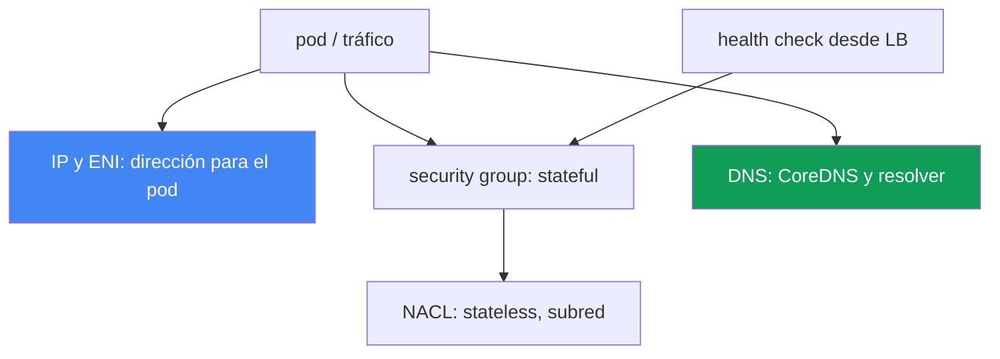
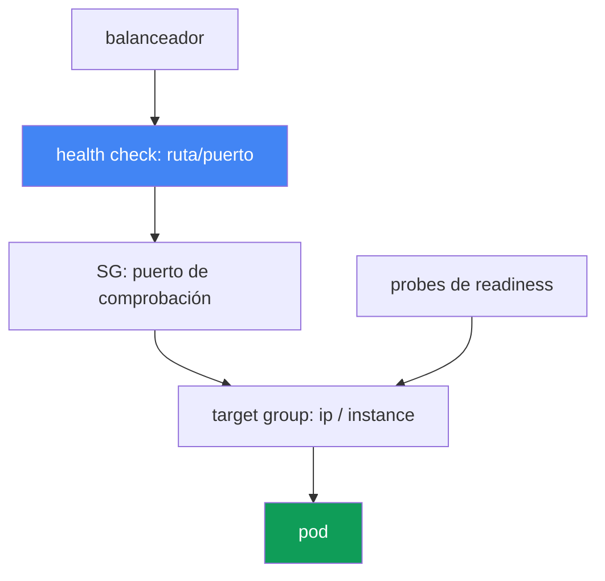

[Русская версия](ru.md) · [Eng version](en.md) · [Version française](fr.md) · [Deutsche Version](de.md) · [ქართული ვერსია](ge.md) · [繁體中文版](tw.md) · [日本語版](jp.md)
# Capítulo 46. Fallos de red: ENI agotadas, SG y NACL, DNS, targets no saludables en el balanceador

> **Qué sigue.** El capítulo 45 explicó por qué un nodo no se unió al clúster. Aquí tratamos
> fallos de red en un clúster que ya funciona: un pod no recibe IP, la conectividad se corta, DNS falla,
> los targets del balanceador se ponen en rojo. Los temas relacionados se abordan en otros capítulos: la arquitectura de VPC CNI,
> ENI e IP en nodos, prefix delegation - capítulos 7 y 8, balanceadores NLB y ALB - capítulos 26 y 27, métricas de
> CoreDNS - capítulo 33, y «el nodo no se unió» - capítulo 45. Aquí veremos cómo reconocer por el síntoma
> la clase de fallo de red y cómo confirmarla.

## 46.1. Cuatro síntomas de una misma clase

El clúster funciona, los nodos están `Ready`, pero la red falla de maneras distintas. Cuatro escenarios típicos.

**El pod queda en `ContainerCreating`.** Se programó en un nodo, pero no arranca:

```bash
kubectl describe pod web-7d9f-abcde
# Events:
#   Warning  FailedCreatePodSandBox  kubelet
#   failed to assign an IP address to container
```

El mensaje `failed to assign an IP address to container` significa que VPC CNI no asignó una
IP al pod: o bien el nodo se quedó sin IP disponibles, o bien se agotó la subred.

**La conectividad se corta.** Un pod no logra llegar a otro pod, a RDS o a una API externa:
`connection timed out`, aunque DNS resuelva. Lo más frecuente son reglas de security group o NACL.

**Los targets del balanceador están `unhealthy`.** Un servicio detrás de NLB o ALB devuelve 502 o 503, y los
 targets del target group no están en estado `healthy`:

```bash
aws elbv2 describe-target-health --target-group-arn "$TG_ARN" \
  --query "TargetHealthDescriptions[?TargetHealth.State!='healthy'].[Target.Id,TargetHealth.State,TargetHealth.Reason]"
# [ ["10.0.3.17", "unhealthy", "Target.FailedHealthChecks" ] ]
```

**DNS falla de forma intermitente.** La resolución funciona unas veces y se agota por timeout otras: un
problema fluctuante difícil de capturar.

La idea clave del capítulo: no es un único error, sino una clase de fallos de red en distintas capas: direccionamiento,
security group, NACL, DNS, health check del balanceador. Los síntomas se parecen (algo «no llega»), pero
las capas y las herramientas son diferentes. A continuación hay una sección por capa; la sección 46.7 incluye
un checklist y el orden de diagnóstico.



## 46.2. Agotamiento de IP y ENI

VPC CNI asigna a cada pod una IP real de la subred VPC (capítulo 6). Por tanto, los pods compiten por
un recurso finito, que se agota de dos formas distintas.

**Se agotaron las IP del nodo.** La cantidad de pods que caben en un nodo no la determinan solo CPU y memoria,
sino el límite de `max-pods`. Está ligado al tipo de instancia: el número de ENI que la instancia puede mantener,
multiplicado por el número de IP de cada ENI. Una instancia pequeña mantiene pocas ENI y pocas IP,
por lo que su `max-pods` es bajo. Cuando se agotan las IP libres del nodo, el pod nuevo no recibe dirección y queda en
`ContainerCreating` con `failed to assign an IP address to container`.

**Se agotó la subred.** Incluso si el nodo tiene capacidad para una ENI, la dirección se toma de una subred. Una
subred pequeña (por ejemplo, `/26`, que además aloja Load Balancer y otros consumidores) llega rápidamente a
subnet IP exhaustion: no quedan direcciones libres en la subred, no se crea la ENI y los pods no reciben IP.

Para distinguirlos, ayuda ver dónde se alcanzó el límite:

```bash
# cuántas direcciones se asignaron realmente y cuál es el límite del nodo
kubectl get pods -o wide --field-selector spec.nodeName=<node> | wc -l
kubectl get node <node> -o jsonpath='{.status.allocatable.pods}'
# IP libres en la subred
aws ec2 describe-subnets --subnet-ids <subnet> \
  --query 'Subnets[0].AvailableIpAddressCount'
```

La mitigación se explica en los capítulos 7 y 8; aquí solo está el mapa de opciones:

| Técnica | Qué aporta | Dónde se detalla |
|---|---|---|
| prefix delegation | La ENI recibe prefijos `/28`, no IP individuales: muchos más pods por nodo | capítulo 7 |
| dimensionamiento de subredes | Subredes grandes para pods, para no alcanzar subnet exhaustion | capítulo 6 |
| secondary CIDR | Añadir espacio de direcciones en VPC para los pods | capítulo 7 |
| `WARM_ENI_TARGET` / `WARM_IP_TARGET` | Cuántas IP mantener «en reserva»: equilibrio entre velocidad y consumo | capítulo 8 |

Prefix delegation es la palanca más efectiva: en lugar de IP secundarias individuales en la ENI, se asignan
prefijos, y `max-pods` por nodo aumenta varias veces. La configuración y compatibilidad están en el capítulo 7.

## 46.3. Security groups: filtro stateful en el nivel de ENI

Un security group (SG) es un firewall en el nivel de ENI y es **stateful**: si se permite una conexión saliente,
el tráfico de respuesta pasa automáticamente; no se necesita una regla de entrada separada para la respuesta.
Esta es la diferencia clave frente a NACL de la siguiente sección.

En EKS intervienen varios SG, y confundirlos es una causa frecuente de «no llega»:

- **cluster security group** - lo crea EKS; por él circula el tráfico entre control plane y
  nodos, y de forma predeterminada también entre los propios nodos.
- **SG de nodos** - se adjunta a la ENI de las instancias del node group (mediante launch template, capítulo 10).
- **security groups for pods** - un SG independiente en el nivel de un pod concreto. Se establece con el recurso
  `SecurityGroupPolicy`, que adjunta por selector una lista de SG a los pods; VPC CNI asigna a esos
  pods su propia branch ENI con esos SG. Importante: la política solo se aplica a pods programados
  después, los ya ejecutados no cambian.

Fallos de conectividad típicos cuyo responsable es un SG:

- **pod a pod entre SG distintos.** Si los pods reciben SG mediante `SecurityGroupPolicy`, pero las reglas no
  permiten tráfico mutuo, la conexión queda silenciosamente esperando hasta el timeout.
- **pod a RDS.** El SG de la base no tiene una regla inbound que permita tráfico desde el SG de los
  nodos o pods hacia el puerto de la base de datos. Se corrige con una referencia de SG: se añade a la regla de RDS,
  no un CIDR, sino el ID del SG permitido.
- **pod a servicio externo.** Una regla de egress del SG no permite tráfico al puerto requerido.

Una referencia de SG (la regla se refiere a otro SG, no a un rango de direcciones) es un patrón fiable:
no se rompe al cambiar las direcciones y sobrevive a la recreación de instancias.

```bash
# qué SG están en la ENI del nodo o del pod
aws ec2 describe-network-interfaces \
  --filters "Name=private-ip-address,Values=10.0.3.17" \
  --query 'NetworkInterfaces[0].Groups'
```

### SG propia de un pod: lo que se rompe silenciosamente

Se habilitó microsegmentación, se describió un SG para el pod, se permitió acceso a la base de datos; el pod arrancó,
pero no resuelve nombres, no supera readiness o no sale a Internet. La causa es única: a un pod con branch ENI
se le aplican SOLO sus SG; las reglas del SG del nodo no tienen efecto. El mínimo documentado para el SG del pod:

| Qué abrir en el SG del pod | Por qué y qué se rompe sin ello |
|---|---|
| id de SG existente | con un ID incorrecto el pod queda bloqueado para siempre durante la creación, y `describe pod` muestra `InvalidSecurityGroupID.NotFound` al llamar a `CreateNetworkInterface`: la primera señal de una errata |
| entrada desde el SG de nodos en los puertos de probes | las probes las envía `kubelet`; de otro modo readiness y liveness no pasan y el pod no entra en endpoints (sección 46.6). Es la causa más frecuente |
| salida 53 por TCP y UDP | ambos transportes, hacia el SG de pods de CoreDNS o el SG de nodos donde se ejecuta; CoreDNS normalmente no tiene SG propio, en la práctica es el SG de nodos o el cluster security group |
| entrada 53 por TCP y UDP en el SG de CoreDNS | la regla inversa es obligatoria: solo el egress del pod es media configuración |
| reglas hacia los pods necesarios | sin ellas, el tráfico a quienes el pod debe comunicarse queda silenciosamente esperando hasta el timeout |
| control plane | las reglas son necesarias cuando el SG se usa con Fargate; el camino más simple es indicar el cluster security group como uno de los SG del pod. Para pods en nodos EC2 este requisito no aparece en la lista: se necesita Kubernetes API, egress 443 en las condiciones generales |

La trampa de «funciona a veces»: las reglas del SG del pod no se aplican al tráfico entre pods ni entre
el pod y los servicios en el mismo nodo, incluidos `kubelet` y `nodeLocalDNS`; además, pods con SG distintos en
el mismo nodo no se comunican en absoluto: están en subredes distintas y el enrutamiento entre ellos está deshabilitado.
El síntoma fluctúa según dónde cayó el pod y dónde está CoreDNS: aquí «a veces funciona» no justifica el SG.
El modo de aplicación decide qué SG se depura. De forma predeterminada,
`POD_SECURITY_GROUP_ENFORCING_MODE=strict`: se desactiva source NAT para el tráfico saliente de esos pods;
hacia fuera, el pod solo saldrá desde un nodo en una subred privada con NAT; desde una subred pública no tiene
Internet. Con `standard`, el tráfico fuera de VPC sale con la dirección de la primary ENI de la instancia y queda
sujeto a las reglas del SG del nodo. Para probes a través de branch ENI hace falta `DISABLE_TCP_EARLY_DEMUX=true` en
el init container de `aws-node`; con VPC CNI 1.11.0 o posterior y modo `standard` no se requiere.

```bash
# modo de aplicación de SG para pods y configuración de branch ENI; luego buscar un error en el ID del SG
kubectl describe daemonset aws-node -n kube-system | grep -iE 'SECURITY_GROUP|DEMUX'
kubectl describe pod <pod> | grep -i InvalidSecurityGroupID
```

## 46.4. NACL: filtro stateless en el nivel de subred

Una Network ACL (NACL) actúa en el nivel de subred y, a diferencia de un SG, es **stateless**: las reglas
para tráfico entrante y saliente son completamente independientes. No basta con permitir una solicitud: también hay que
permitir por separado su respuesta.

De ahí la trampa clásica. La conexión sale de la subred desde un puerto hacia un puerto remoto, y la respuesta
vuelve al **puerto ephemeral**: un puerto temporal del rango alto que el cliente eligió para esa conexión. Si la regla
NACL de salida (o la de entrada para las respuestas) no permite el rango de ephemeral ports, las respuestas se
bloquean y la conexión queda colgada aunque la solicitud haya salido. En la práctica, esto significa que la NACL debe
permitir tráfico de respuesta por ephemeral ports (rango `1024-65535`), de lo contrario las sesiones TCP no se cierran.

| Propiedad | Security group | NACL |
|---|---|---|
| Nivel | ENI (nodo, pod) | subred |
| Estado | stateful, respuesta permitida automáticamente | stateless, la respuesta se permite por separado |
| Reglas | solo allow | allow y deny, con prioridad por número |
| ephemeral ports | se consideran automáticamente | deben permitirse manualmente |

De forma predeterminada NACL permite todo el tráfico, así que en la mayoría de clústeres no interviene. Sin embargo, si
el equipo de seguridad aplicó NACL personalizados a las subredes, pasan a ser sospechosos de cortes que «no se explican»
por reglas de SG. Es fácil distinguirlos: SG no golpea los ephemeral; si el problema está precisamente en el tráfico de
respuesta, investigue NACL.

## 46.5. Fallos de DNS: timeouts intermitentes

La clase más insidiosa: la resolución funciona unas veces y falla otras. Hay varias causas que se
superponen.

**CoreDNS está sobrecargado o no disponible.** Los pods de CoreDNS no soportan el flujo de consultas o hay
muy pocos para el clúster. El síntoma es el aumento de latencia y de timeouts de resolución bajo carga. EKS
admite autoscaling de CoreDNS; el capítulo 33 explica las métricas de CoreDNS para diagnóstico.

**Efecto de `ndots:5`.** Kubernetes configura en los pods `ndots:5` y una lista de dominios de búsqueda.
Un nombre sin cinco puntos (casi todos, por ejemplo `api.example.com`) se intenta primero con todos los
dominios de búsqueda y solo después tal cual está. Una consulta externa se convierte en varias consultas adicionales, y
la carga de DNS se multiplica. Para nombres externos «calientes» ayuda el FQDN con un punto final
(`api.example.com.`), que desactiva la iteración por dominios de búsqueda.

**conntrack table full.** Cada conexión (incluida una consulta UDP a DNS) ocupa una entrada en la tabla
conntrack del kernel del nodo. Cuando se llena, se descartan conexiones nuevas, y DNS por UDP es el primero en sufrir:
de ahí los timeouts fluctuantes. Se revisa el uso de `nf_conntrack` en el nodo.

**Throttling de DNS en el nivel de ENI.** Cada ENI tiene un límite estricto de packets per second hacia el VPC
resolver (Route 53 Resolver). Cuando todos los pods del nodo envían DNS por una ENI y alcanzan ese límite, parte de
los paquetes se descarta: nuevamente aparecen timeouts intermitentes no ligados a un nombre concreto.

**Mitigación: NodeLocal DNSCache.** Un agente DNS de caché local en el nodo responde a los pods desde la
caché y mantiene una conexión TCP a CoreDNS. Esto reduce la carga UDP y el throttling per-ENI, y estabiliza la
cola de latencia.

```bash
# comprobar si la resolución funciona desde un pod de depuración
kubectl run dnstest --image=busybox:1.36 --rm -it --restart=Never -- \
  nslookup kubernetes.default.svc.cluster.local
# estado de los pods CoreDNS
kubectl -n kube-system get pods -l k8s-app=kube-dns -o wide
```

## 46.6. Targets no saludables en el balanceador

Un servicio detrás de NLB o ALB devuelve 502 o 503 porque el balanceador no ve targets saludables
(capítulos 26 y 27). El balanceador envía health checks a los targets; si fallan, el target sale de
rotación. Analicemos las causas.

- **Health check incorrecto.** La ruta, el puerto o el protocolo de la comprobación no coinciden con lo que
  realmente escucha la aplicación. Por defecto ALB comprueba `/`, mientras la aplicación solo devuelve `200` en
  `/healthz`: el target queda `unhealthy`, aunque el pod esté vivo.
- **El SG no permite el health check.** El SG del target (nodo con target-type `instance` o pod con
  target-type `ip`) no permite tráfico entrante desde el SG del balanceador al puerto de comprobación. No llega,
  y el target se pone en rojo.
- **Incompatibilidad de target-type y puertos.** Con target-type `ip`, el target es la IP del pod y su
  `containerPort`; con `instance`, es el nodo y `NodePort`. Un error en el tipo o puerto del target group
  hace que la comprobación vaya al sitio equivocado.
- **La probe de readiness del pod no está lista.** Hasta que readiness no pase, el pod no entra en endpoints ni
  en el target group, o queda `unhealthy`. El balanceador refleja honestamente el estado de la aplicación.

El síntoma para el cliente: 502 (`Bad gateway`) suele significar que el target respondió incorrectamente o que
se interrumpió la conexión, mientras que 503 (`Service unavailable`) indica que no hay targets saludables en absoluto.
El diagnóstico va del target group al pod:

```bash
# estado y motivos por target
aws elbv2 describe-target-health --target-group-arn "$TG_ARN" \
  --query 'TargetHealthDescriptions[].[Target.Id,TargetHealth.State,TargetHealth.Reason]'
# si hay endpoints listos detrás del servicio
kubectl get endpointslices -l kubernetes.io/service-name=<svc>
```

La ruta del health check muestra dónde se corta, y readiness decide si el pod entrará al target group.



## 46.7. Orden de diagnóstico y herramientas

La red no se corrige al azar, sino desde el síntoma hacia la capa. El conjunto básico de herramientas:

```bash
# 1. eventos del pod: causa de ContainerCreating y asignación de IP
kubectl describe pod <pod>
# 2. dónde está el pod y en qué nodo
kubectl get pods -o wide
# 3. ENI, IP y SG de una dirección concreta
aws ec2 describe-network-interfaces \
  --filters "Name=private-ip-address,Values=<ip>" --query 'NetworkInterfaces[0]'
# 4. direcciones libres en la subred
aws ec2 describe-subnets --subnet-ids <subnet> \
  --query 'Subnets[0].AvailableIpAddressCount'
# 5. salud de los targets del balanceador
aws elbv2 describe-target-health --target-group-arn "$TG_ARN"
# 6. comprobación de resolución desde un pod
kubectl run dnstest --image=busybox:1.36 --rm -it --restart=Never -- nslookup <name>
# 7. en el nodo: recopilar un volcado de red VPC CNI (logs de ipamd/plugin, ENI, eni-configs)
aws ssm send-command --document-name "AWS-RunShellScript" --instance-ids <instance-id> \
  --parameters 'commands=["/opt/cni/bin/aws-cni-support.sh"]'
```

Una herramienta independiente para cortes «silenciosos» son los **VPC Flow Logs**: registran si un paquete recibió
ACCEPT o REJECT en el nivel de ENI o subred. `REJECT` en flow logs apunta directamente a SG o NACL, y la
ausencia de paquetes de respuesta cuando la solicitud salió apunta a NACL stateless y ephemeral ports.

Cuando un pod queda bloqueado con `failed to assign an IP address` y no está claro si se agotaron las IP o no
se creó la ENI, se baja al nodo. VPC CNI guarda los logs en `/var/log/aws-routed-eni` (`ipamd.log`,
`plugin.log`), y el script `/opt/cni/bin/aws-cni-support.sh` los recopila junto con el estado de
ENI/IP y la configuración en el archivo `/var/log/eks_<instance-id>_<...>.tar.gz`. Se ejecuta en
el nodo mediante SSM, sin SSH. El estado de ipamd también se ve directamente:
`curl http://localhost:61679/v1/enis` muestra las ENI e IP asignadas, y `/v1/pods` muestra la asociación
de direcciones con los pods.

Checklist «síntoma - causa probable - qué comprobar»:

| Síntoma | Causa probable | Qué comprobar |
|---|---|---|
| `failed to assign an IP address` | no hay IP libres en el nodo o la subred | `describe pod`, `AvailableIpAddressCount` |
| timeout pod a pod o pod a RDS | SG no permite tráfico | Groups de `describe-network-interfaces`, SG de RDS |
| corte, pero la solicitud sale | NACL bloquea ephemeral ports | reglas NACL in/out, VPC Flow Logs |
| DNS con timeouts intermitentes | CoreDNS, conntrack, throttling per-ENI | métricas de CoreDNS (capítulo 33), conntrack, PPS |
| carga DNS adicional para nombres externos | efecto `ndots:5` | dominios de búsqueda, FQDN con punto |
| 502 o 503 del servicio detrás de LB | targets `unhealthy` | `describe-target-health`, health check, SG |
| targets `unhealthy`, pod vivo | ruta/puerto de health check o SG | ruta y puerto de comprobación, SG del balanceador |
| pod sin DNS ni readiness | SG propia del pod en vez del SG del nodo | `SecurityGroupPolicy` del pod, 53 TCP/UDP, entrada desde SG de nodos |

La lógica: primero clasificar el síntoma (sin IP / corte de conectividad / DNS / 5xx de LB), después ir a
su capa. `describe pod` y `get pods -o wide` son baratos y descartan primero los problemas de IP;
`describe-target-health` localiza de inmediato el fallo del balanceador; VPC Flow Logs es el último recurso para
cortes que no explican ni las IP ni el health check.

## 46.8. Cómo se aplica en producción

- **Clasifique el síntoma antes de diagnosticar.** Sin IP, corte de conectividad, timeouts DNS, 5xx de LB:
  son cuatro capas distintas. Primero se determina la clase y después se abre la herramienta, no al revés.
- **Planifique el direccionamiento con anticipación.** Subredes grandes para pods y prefix delegation (capítulo 7)
  evitan el agotamiento de IP antes de que suceda en un pico de tráfico.
- **Use referencias de SG, no CIDR.** Las reglas que referencian el SG de nodos o pods sobreviven a la
  recreación de instancias y a cambios de direcciones, con menos cortes «repentinos» hacia RDS.
- **Instale NodeLocal DNSCache en clústeres con carga.** La caché local reduce el throttling per-ENI y el
  agotamiento de conntrack por DNS, eliminando una clase de incidentes difícil de detectar.
- **Mantenga conscientemente el health check en el manifiesto.** La ruta, el puerto y el protocolo de la
  comprobación se alinean con la probe de readiness y los puertos del target, para que `unhealthy` indique un
  problema real y no una errata.
- **Active VPC Flow Logs en subredes de producción.** Cuando el tráfico desaparece «silenciosamente», un
  `REJECT` en los logs ahorra horas de conjeturas entre SG y NACL.

## 46.9. Mini glosario

- **`failed to assign an IP address to container`** - VPC CNI no pudo asignar IP al pod: se agotaron las
  direcciones en el nodo o la subred.
- **`max-pods`** - límite de pods por nodo, ligado a la cantidad de ENI e IP por ENI del tipo de instancia.
- **subnet IP exhaustion** - no quedan direcciones libres en la subred para ENI y pods.
- **prefix delegation** - asignación de prefijos `/28` a ENI en lugar de IP individuales: más pods por nodo
  (capítulo 7).
- **security group** - firewall stateful en el nivel de ENI; la respuesta a una solicitud permitida pasa sola.
- **`SecurityGroupPolicy`** - recurso que adjunta SG a pods por selector (security groups for pods); un pod
  con branch ENI deja de heredar las reglas del SG del nodo.
- **`POD_SECURITY_GROUP_ENFORCING_MODE`** - `strict` sin source NAT frente a `standard`, donde fuera de
  VPC el tráfico va desde la primary ENI bajo las reglas del SG del nodo.
- **NACL** - filtro stateless en el nivel de subred; las reglas entrantes y salientes son independientes.
- **ephemeral ports** - rango alto `1024-65535` al que llega tráfico de respuesta; en NACL se permite manualmente.
- **`ndots:5`** - ajuste de resolv.conf de los pods que hace que los nombres prueben dominios de búsqueda.
- **conntrack** - tabla de conexiones del kernel del nodo; al llenarse se descartan conexiones nuevas.
- **NodeLocal DNSCache** - DNS de caché local en el nodo que reduce carga sobre CoreDNS y throttling per-ENI.
- **`describe-target-health`** - comando que muestra el estado y la causa de los targets del target group.

## 46.10. Resumen del capítulo

- Los fallos de red en un clúster en funcionamiento son una clase de fallos en distintas capas: IP y ENI, security
  group, NACL, DNS y health check del balanceador. Los síntomas se parecen; las capas y herramientas son distintas.
- `failed to assign an IP address to container` es agotamiento de IP: o `max-pods` en el nodo o subnet IP
  exhaustion. Se mitiga con prefix delegation y dimensionamiento de subredes (capítulos 7 y 8).
- Security group es stateful y funciona en el nivel de ENI; los cortes pod a pod, pod a RDS y egress suelen ser
  reglas de SG. Las referencias de SG son más fiables que CIDR.
- Un SG propio del pod anula las reglas del SG del nodo, por lo que hay que incluir manualmente 53 por TCP y UDP en
  ambos sentidos y entrada desde el SG de nodos a los puertos de probes; de otro modo el pod pierde DNS y readiness
  silenciosamente.
- NACL es stateless y funciona en el nivel de subred; la trampa clásica es no permitir tráfico de respuesta hacia
  ephemeral ports. Por defecto NACL deja pasar todo; se sospecha de él cuando hay reglas personalizadas.
- Los timeouts DNS fluctúan: las causas son sobrecarga de CoreDNS, efecto `ndots:5`, agotamiento de conntrack y
  throttling per-ENI hacia resolver. La mitigación es NodeLocal DNSCache y autoscaling de CoreDNS.
- Targets no saludables en NLB y ALB causan 502 y 503: health check incorrecto, SG no permite la comprobación,
  incompatibilidad de target-type y puertos, o readiness del pod. El diagnóstico es `describe-target-health`.
- Orden: clasificar el síntoma y luego usar la herramienta de su capa: `describe pod`,
  `describe-network-interfaces`, `describe-target-health`, `nslookup` desde el pod y VPC Flow Logs.

## 46.11. Cómo será útil en el trabajo real

En guardia, un incidente de red parece «algo no llega», y la tentación es usar la primera herramienta disponible.
Gana quien primero nombra la clase: pod sin IP, corte de conectividad, DNS intermitente o 5xx del balanceador.
La clase determina inmediatamente la capa y el comando. Un pod en `ContainerCreating` requiere
`describe pod` y contar IP libres, no tcpdump. Un 503 requiere `describe-target-health`, no reiniciar pods.
La clasificación correcta ahorra los minutos en que el servicio está caído.

Al planificar, estas mismas capas se convierten en prevención: subredes grandes y prefix delegation eliminan el
agotamiento de IP antes del pico; referencias de SG y health checks deliberados eliminan clases completas de cortes;
NodeLocal DNSCache amortigua el throttling DNS en ENI, y VPC Flow Logs convierte un corte «silencioso» en un
`REJECT`. Saber distinguir un SG stateful de una NACL stateless y saber dónde se agotan las IP ahorra horas:
lleva directamente a la capa correcta.

## 46.12. Preguntas de autoevaluación

1. ¿Por qué los fallos de red en un clúster son una clase de fallos y no un único error? Nombre las capas.
2. ¿Qué significa `failed to assign an IP address to container` y cuáles son las dos causas que hay detrás?
3. ¿De qué depende `max-pods` en un nodo y cómo cambia prefix delegation el escenario (capítulo 7)?
4. ¿En qué se diferencia el agotamiento de IP en un nodo de subnet IP exhaustion y cómo se comprueba cada uno?
5. ¿Por qué se llama stateful a un security group y cómo simplifica las reglas frente a NACL?
6. ¿Qué SG participan en EKS y qué hace `SecurityGroupPolicy` (security groups for pods)?
7. ¿Qué deja de funcionar en un pod que recibe su propio SG y qué reglas se añaden manualmente?
8. ¿Por qué un pod no llega a RDS incluso con DNS correcto y qué es una referencia de SG?
9. ¿Cuál es la trampa de NACL con ephemeral ports y por qué no ocurre con security group?
10. Nombre las causas de los timeouts DNS fluctuantes: ¿qué relación tienen `ndots:5`, conntrack y el límite per-ENI?
11. ¿Cómo mitiga NodeLocal DNSCache los fallos DNS y qué carga reduce?
12. ¿Por qué los targets de un balanceador están `unhealthy` y qué muestra `describe-target-health`?
13. ¿En qué se diferencia 502 de 503 en la respuesta del balanceador para fines de diagnóstico?
14. ¿Cuándo conviene consultar VPC Flow Logs al diagnosticar un corte de red y qué hay que buscar allí?

## Práctica

Este tema incluye dos laboratorios del curso. [Laboratorio 120 - fallos de red y targets
unhealthy](../../labs/120/README_ES.MD): instala AWS Load Balancer Controller, obtiene un
NLB con su propio security group sin reglas inbound, detecta el síntoma
`Target.FailedHealthChecks`, demuestra la causa y corrige el acceso. Ejecución:
`TASK=120 make run_eks_task`.

[Laboratorio 126 - security groups for pods](../../labs/126/README_ES.MD) aborda la misma capa desde
otro lado: el pod recibe su propia branch ENI, las reglas del nodo ya no se aplican a él, y se encuentra un pod
`Running`, pero no `Ready`; se detecta la regla ausente para la probe de `kubelet`, se entiende por qué DNS se
corrige con una regla del lado de CoreDNS y no con el egress del pod, y se comprueba cómo cambia el comportamiento
entre los modos `strict` y `standard`. Ejecución: `TASK=126 make run_eks_task`. La comprobación en ambos
laboratorios se realiza con el comando `check_result`.

Además del laboratorio, este capítulo es un runbook de diagnóstico. Todas las comprobaciones se pueden ejecutar
sin riesgo en un clúster saludable para saber cómo luce la norma y reconocer antes las desviaciones.

Primero revise el direccionamiento de pods y subredes:

```bash
# cuántos pods hay en el nodo y cuál es el límite
kubectl get pods -A -o wide --field-selector spec.nodeName=<node>
kubectl get node <node> -o jsonpath='{.status.allocatable.pods}'
# direcciones libres en la subred de nodos: normalmente hay una reserva amplia
aws ec2 describe-subnets --subnet-ids <subnet> \
  --query 'Subnets[0].AvailableIpAddressCount'
```

Después determine qué SG están adjuntos a la ENI de un pod funcional y compruebe la resolución desde dentro:

```bash
# ENI y sus security groups por la IP del pod
aws ec2 describe-network-interfaces \
  --filters "Name=private-ip-address,Values=<ip-del-pod>" \
  --query 'NetworkInterfaces[0].[NetworkInterfaceId,Groups]'
# DNS desde un pod de depuración: nombre interno y externo
kubectl run dnstest --image=busybox:1.36 --rm -it --restart=Never -- \
  sh -c 'nslookup kubernetes.default; nslookup example.com'
```

Si el clúster tiene un servicio detrás de un balanceador, observe la salud de los targets y compárela con
el readiness de los pods:

```bash
# estado de los targets: normalmente todos deben estar healthy
aws elbv2 describe-target-health --target-group-arn "$TG_ARN" \
  --query 'TargetHealthDescriptions[].[Target.Id,TargetHealth.State]' --output table
# endpoints listos detrás del servicio
kubectl get endpointslices -l kubernetes.io/service-name=<svc>
```

Para terminar, active VPC Flow Logs en la subred de nodos y observe el formato de los registros: la columna action
con el valor `ACCEPT` o `REJECT` es lo que se busca al analizar un corte «silencioso». Compare el resultado
con el checklist de la sección 46.7: en un clúster saludable hay IP de reserva, los SG de ENI son los esperados,
DNS resuelve nombres internos y externos, y los targets están `healthy`. Al recordar la normalidad, localizará antes
la capa cuando la red falle.

---
[Índice](../README_ES.md) · [Capítulo 45](../45/es.md) · [Capítulo 47](../47/es.md)
