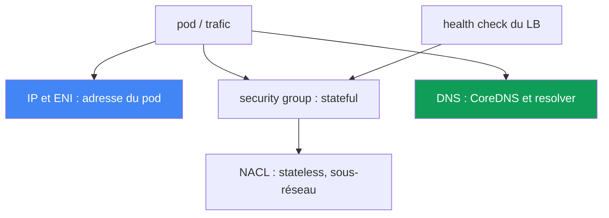
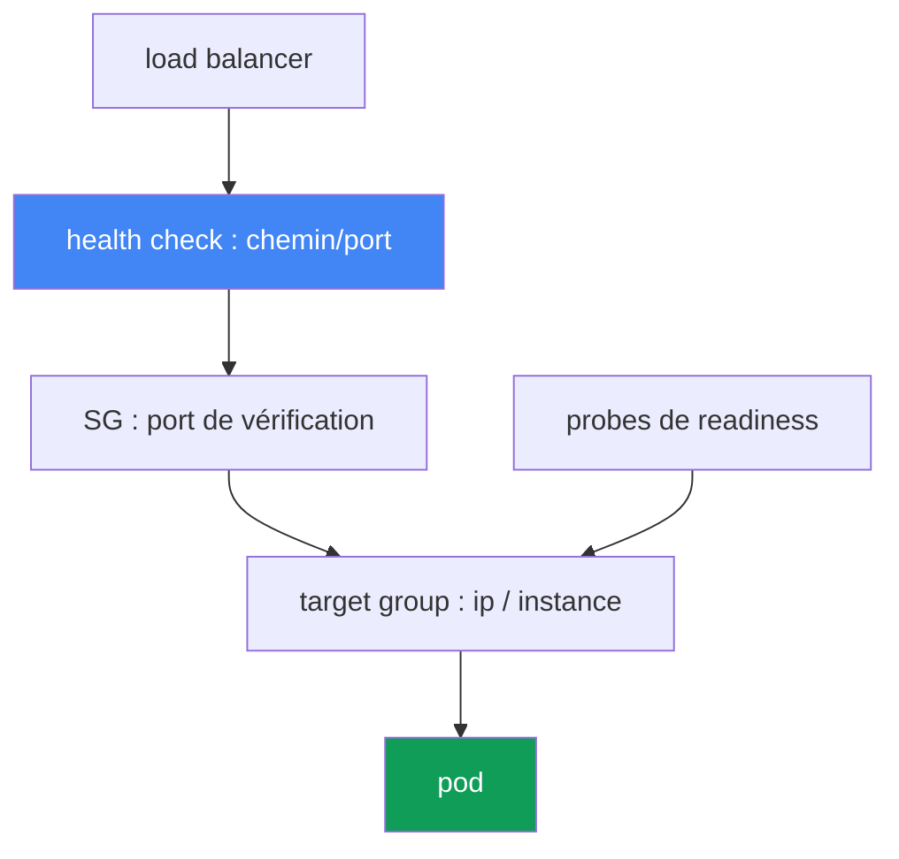

[Русская версия](ru.md) · [Eng version](en.md) · [Versión en español](es.md) · [Deutsche Version](de.md) · [ქართული ვერსია](ge.md) · [繁體中文版](tw.md) · [日本語版](jp.md)
# Chapitre 46. Pannes réseau : ENI épuisées, SG et NACL, DNS, targets unhealthy dans le load balancer

> **La suite.** Le chapitre 45 expliquait pourquoi un nœud ne rejoignait pas du tout le cluster. Ici,
> il s'agit de pannes réseau dans un cluster déjà en service : un pod ne reçoit pas d'IP, la
> connectivité se rompt, le DNS échoue, les targets du load balancer passent au rouge. Les sujets
> connexes sont traités dans d'autres chapitres : fonctionnement de VPC CNI, des ENI et des IP sur
> les nœuds, prefix delegation aux chapitres 7 et 8, load balancers NLB et ALB aux chapitres 26 et
> 27, métriques CoreDNS au chapitre 33 et « le nœud ne rejoint pas le cluster » au chapitre 45.
> Ici, nous identifions la classe de panne réseau à partir du symptôme et la confirmons.

## 46.1. Quatre symptômes d'une même classe

Le cluster fonctionne, les nœuds sont `Ready`, mais le réseau peut défaillir de façons différentes.
Voici quatre cas typiques.

**Le pod reste en `ContainerCreating`.** Il est planifié sur un nœud, mais ne démarre pas :

```bash
kubectl describe pod web-7d9f-abcde
# Events:
#   Warning  FailedCreatePodSandBox  kubelet
#   failed to assign an IP address to container
```

Le message `failed to assign an IP address to container` signifie que VPC CNI n'a pas attribué
une adresse au pod : soit le nœud n'a plus d'IP disponibles, soit le sous-réseau est épuisé.

**La connectivité se rompt.** Un pod ne parvient pas à joindre un autre pod, RDS ou une API
externe : `connection timed out`, alors que le DNS se résout. Ce sont le plus souvent les règles
de security group ou de NACL.

**Les targets du load balancer sont `unhealthy`.** Le Service derrière un NLB ou un ALB retourne
502 ou 503, et les targets du target group ne sont pas à l'état `healthy` :

```bash
aws elbv2 describe-target-health --target-group-arn "$TG_ARN" \
  --query "TargetHealthDescriptions[?TargetHealth.State!='healthy'].[Target.Id,TargetHealth.State,TargetHealth.Reason]"
# [ ["10.0.3.17", "unhealthy", "Target.FailedHealthChecks" ] ]
```

**Le DNS échoue par intermittence.** La résolution fonctionne puis expire par timeout : un
problème fluctuant, difficile à capturer.

L'idée centrale du chapitre : il ne s'agit pas d'une seule erreur, mais d'une classe de pannes
réseau à différents niveaux : adressage, security group, NACL, DNS, health check du load balancer.
Les symptômes se ressemblent (quelque chose « ne passe pas »), mais les couches et les outils
sont différents. Chaque section suivante couvre une couche ; la section 46.7 donne la checklist
et l'ordre à suivre.



## 46.2. Épuisement des IP et des ENI

VPC CNI attribue à chaque pod une véritable IP du sous-réseau VPC (chapitre 6). Les pods sont donc
en concurrence pour une ressource finie, qui peut s'épuiser de deux manières distinctes.

**Les IP du nœud sont épuisées.** Le nombre de pods pouvant tenir sur un nœud ne dépend pas
seulement du CPU et de la mémoire, mais de la limite `max-pods`. Elle dépend du type d'instance :
le nombre d'ENI que l'instance peut porter, multiplié par le nombre d'IP pour chaque ENI. Une petite
instance porte peu d'ENI et peu d'IP : son `max-pods` est faible. Lorsque les IP libres du nœud
sont épuisées, le nouveau pod ne reçoit pas d'adresse et reste en `ContainerCreating` avec
`failed to assign an IP address to container`.

**Le sous-réseau est épuisé.** Même si le nœud a de la place pour une ENI, l'adresse vient du
sous-réseau. Un petit sous-réseau (par exemple `/26`, qui doit aussi servir au Load Balancer et à
d'autres consommateurs) atteint rapidement le subnet IP exhaustion : plus aucune adresse libre,
l'ENI ne monte pas et les pods ne reçoivent pas d'IP.

La distinction repose sur l'endroit précis où la limite est atteinte :

```bash
# nombre d'adresses réellement attribuées et limite du nœud
kubectl get pods -o wide --field-selector spec.nodeName=<node> | wc -l
kubectl get node <node> -o jsonpath='{.status.allocatable.pods}'
# IP libres dans le sous-réseau
aws ec2 describe-subnets --subnet-ids <subnet> \
  --query 'Subnets[0].AvailableIpAddressCount'
```

Les mesures correctives sont présentées aux chapitres 7 et 8 ; voici seulement la carte des choix :

| Mesure | Ce qu'elle apporte | Détail |
|---|---|---|
| prefix delegation | l'ENI reçoit des préfixes /28, et non des IP individuelles : beaucoup plus de pods par nœud | chapitre 7 |
| dimensionnement des sous-réseaux | de grands sous-réseaux pour les pods, pour ne pas atteindre le subnet exhaustion | chapitre 6 |
| secondary CIDR | ajouter de l'espace d'adressage VPC pour les pods | chapitre 7 |
| `WARM_ENI_TARGET` / `WARM_IP_TARGET` | nombre d'IP gardées « en réserve », compromis entre vitesse et consommation | chapitre 8 |

Prefix delegation est le levier le plus efficace : au lieu d'IP secondaires individuelles sur une
ENI, elle reçoit des préfixes, et le `max-pods` d'un nœud est multiplié. Configuration et
compatibilité sont décrites au chapitre 7.

## 46.3. Security groups : filtre stateful au niveau de l'ENI

Un security group (SG) est un firewall au niveau de l'ENI et il est **stateful** : si une connexion
sortante est autorisée, le trafic de retour passe automatiquement ; une règle entrante séparée pour
la réponse n'est pas nécessaire. C'est la différence fondamentale avec le NACL de la section
suivante.

Dans EKS, plusieurs SG entrent en jeu, et les confondre est souvent à l'origine du « ça ne passe
pas » :

- **cluster security group** : créé par EKS, il porte le trafic entre le control plane et les
  nœuds, ainsi que, par défaut, entre les nœuds eux-mêmes.
- **SG des nœuds** : associé aux ENI des instances du node group (par launch template, chapitre 10).
- **security groups for pods** : un SG distinct au niveau d'un pod donné. Il est défini par une
  ressource `SecurityGroupPolicy` qui, par sélecteur, associe une liste de SG aux pods ; VPC CNI
  attribue à ces pods leur propre branch ENI avec ces SG. Important : la politique ne s'applique
  qu'aux pods nouvellement planifiés, les pods déjà exécutés ne changent pas.

Pannes de connectivité typiques dont un SG est responsable :

- **pod à pod entre différents SG.** Si les pods reçoivent des SG via `SecurityGroupPolicy` et que
  les règles n'autorisent pas le trafic mutuel, la connexion reste silencieusement bloquée jusqu'au
  timeout.
- **pod à RDS.** Le SG de la base n'a pas de règle inbound autorisant le trafic depuis le SG des
  nœuds ou des pods vers le port de la base. On corrige par SG reference : la règle RDS reçoit non
  pas un CIDR, mais l'id du SG autorisé.
- **pod vers service externe.** La règle egress du SG ne laisse pas passer le trafic vers le port
  requis.

Une SG reference (une règle qui référence un autre SG plutôt qu'une plage d'adresses) est un style
fiable : elle ne casse pas quand les adresses changent et survit à la recréation des instances.

```bash
# SG présents sur l'ENI du nœud ou du pod
aws ec2 describe-network-interfaces \
  --filters "Name=private-ip-address,Values=10.0.3.17" \
  --query 'NetworkInterfaces[0].Groups'
```

### Son propre SG pour un pod : ce qui casse silencieusement

La microsegmentation est activée, le SG du pod est décrit, l'accès à la base est autorisé, le pod
démarre, mais il ne résout aucun nom, ne passe pas la readiness ou ne sort pas. La cause est unique :
seuls ses SG s'appliquent à un pod avec branch ENI ; les règles du SG de nœud ne s'appliquent pas.
Le minimum documenté pour le SG d'un pod est le suivant :

| À ouvrir dans le SG du pod | Pourquoi, et ce qui casse sans cela |
|---|---|
| id d'un SG existant | avec un id erroné, le pod reste bloqué à la création et `describe pod` montre `InvalidSecurityGroupID.NotFound` lors de l'appel à `CreateNetworkInterface` : premier signe d'une faute de frappe |
| inbound depuis le SG des nœuds sur les ports des probes | `kubelet` envoie les probes ; sinon readiness et liveness échouent et le pod n'entre pas dans les endpoints (section 46.6). C'est la cause la plus fréquente |
| egress 53 en TCP et UDP | les deux transports, vers les SG des pods CoreDNS ou le SG des nœuds où il tourne ; CoreDNS n'a normalement pas son propre SG, c'est en pratique le SG des nœuds ou le cluster security group |
| inbound 53 en TCP et UDP dans le SG CoreDNS | la règle de retour est indispensable : l'egress du pod seul ne constitue que la moitié de la configuration |
| règles vers les pods requis | sans elles, le trafic vers les interlocuteurs du pod attend silencieusement le timeout |
| control plane | des règles sont requises lorsque ce SG est utilisé avec Fargate ; le chemin le plus simple est d'indiquer le cluster security group comme l'un des SG du pod. Pour les pods sur nœuds EC2, cette exigence n'est pas dans la liste : l'API Kubernetes requiert un egress 443 comme d'habitude |

Piège du « cela fonctionne une fois sur deux » : les règles du SG d'un pod ne s'appliquent pas au
trafic entre pods, ni entre le pod et les services sur le même nœud, dont `kubelet` et
`nodeLocalDNS`, et des pods avec des SG différents sur le même nœud ne communiquent pas du tout :
ils sont dans des sous-réseaux différents, dont le routage mutuel est désactivé. Le symptôme varie
selon l'emplacement du pod et de CoreDNS : « parfois ça marche » n'excuse pas le SG. Le mode
d'application détermine quel SG vous déboguez. Par défaut,
`POD_SECURITY_GROUP_ENFORCING_MODE=strict` : le source NAT du trafic sortant de ces pods est
désactivé ; vers l'extérieur, un pod ne sortira que depuis un nœud dans un sous-réseau privé avec
NAT, et il n'a pas Internet depuis un sous-réseau public. Avec `standard`, le trafic hors VPC sort
avec l'adresse de l'ENI primaire de l'instance et passe sous les règles du SG de nœud. Pour les
probes via branch ENI, `DISABLE_TCP_EARLY_DEMUX=true` est requis dans l'init-container `aws-node` ;
avec VPC CNI 1.11.0 ou ultérieur en mode `standard`, il n'est pas nécessaire.

```bash
# mode d'application du SG des pods et paramètres de branch ENI, puis recherche d'erreur dans l'id SG
kubectl describe daemonset aws-node -n kube-system | grep -iE 'SECURITY_GROUP|DEMUX'
kubectl describe pod <pod> | grep -i InvalidSecurityGroupID
```

## 46.4. NACL : filtre stateless au niveau du sous-réseau

Une Network ACL (NACL) agit au niveau du sous-réseau et, à l'inverse d'un SG, elle est **stateless** :
les règles des trafics entrant et sortant sont complètement indépendantes. Autoriser la requête ne
suffit pas : il faut également autoriser séparément la réponse.

D'où le piège classique. Une connexion sort du sous-réseau depuis un port vers un port distant, puis
la réponse revient sur un **ephemeral port**, port temporaire choisi dans une plage haute par le
client pour cette connexion. Si la règle NACL sortante (ou entrante pour les réponses) n'autorise
pas la plage des ephemeral ports, les réponses sont coupées et la connexion reste bloquée, bien que
la requête soit partie. En pratique, le NACL doit autoriser le trafic de retour sur les ephemeral
ports (plage `1024-65535`) ; sinon les sessions TCP ne se ferment pas.

| Propriété | Security group | NACL |
|---|---|---|
| Niveau | ENI (nœud, pod) | sous-réseau |
| État | stateful, réponse automatiquement autorisée | stateless, réponse autorisée séparément |
| Règles | allow uniquement | allow et deny, priorité par numéro |
| ephemeral ports | pris en compte automatiquement | à autoriser manuellement |

Par défaut, le NACL autorise tout le trafic ; il n'est donc en cause dans la plupart des clusters.
Mais si l'équipe sécurité a attaché des NACL personnalisés aux sous-réseaux, ils deviennent suspects
lors de ruptures qu'aucune règle SG n'explique. La distinction est simple : un SG ne bloque pas les
ephemeral ports ; si le problème concerne précisément le trafic de retour, creusez le NACL.

## 46.5. Pannes DNS : timeouts intermittents

La classe la plus insidieuse : la résolution fonctionne puis échoue. Plusieurs causes peuvent se
superposer.

**CoreDNS est surchargé ou indisponible.** Les pods CoreDNS ne tiennent pas le flux de requêtes ou
sont trop peu nombreux pour le cluster. Le symptôme est une hausse de latence et des timeouts de
résolution sous charge. EKS prend en charge l'autoscaling de CoreDNS ; le chapitre 33 traite les
métriques CoreDNS utiles au diagnostic.

**Effet `ndots:5`.** Kubernetes configure les pods avec `ndots:5` et une liste de domaines search.
Un nom comportant moins de cinq points (la plupart, tel que `api.example.com`) est essayé avec tous
les domaines search avant de l'être tel quel. Une requête externe devient plusieurs requêtes
supplémentaires, multipliant la charge DNS. Pour les noms externes « chauds », utilisez un FQDN
terminé par un point (`api.example.com.`), ce qui désactive le parcours des domaines search.

**conntrack table full.** Chaque connexion, y compris une requête DNS UDP, occupe une entrée dans la
table conntrack du noyau du nœud. À saturation, les nouvelles connexions sont perdues, et le DNS
UDP souffre en premier : d'où les timeouts fluctuants. Vérifiez l'utilisation de `nf_conntrack` sur
le nœud.

**Throttling DNS au niveau de l'ENI.** Chaque ENI a une limite stricte de packets per second vers
le VPC resolver (Route 53 Resolver). Lorsque tous les pods d'un nœud envoient le DNS à travers une
même ENI et atteignent cette limite, une partie des paquets est rejetée, encore une fois avec des
timeouts intermittents non liés à un nom précis.

**Atténuation : NodeLocal DNSCache.** Un agent DNS de cache local sur le nœud répond aux pods depuis
le cache et maintient une connexion TCP vers CoreDNS. Il réduit la charge UDP et le throttling
par ENI, et stabilise la queue de latence.

```bash
# la résolution fonctionne-t-elle depuis un pod de diagnostic ?
kubectl run dnstest --image=busybox:1.36 --rm -it --restart=Never -- \
  nslookup kubernetes.default.svc.cluster.local
# état des pods CoreDNS
kubectl -n kube-system get pods -l k8s-app=kube-dns -o wide
```

## 46.6. Targets unhealthy dans le load balancer

Le Service derrière un NLB ou un ALB retourne 502 ou 503 car le load balancer ne voit aucune target
saine (chapitres 26 et 27). Le load balancer envoie des health checks aux targets ; un échec retire
la target de la rotation. Analyse des causes :

- **Health check incorrect.** Le chemin, le port ou le protocole de vérification ne correspond pas
  à ce qu'écoute réellement l'application. Par défaut, l'ALB vérifie `/`, tandis que l'application
  ne répond `200` que sur `/healthz` : la target est `unhealthy` alors que le pod est vivant.
- **Le SG ne laisse pas passer le health check.** Le SG de la target (le nœud avec target-type
  `instance`, ou le pod avec target-type `ip`) n'autorise pas le trafic entrant depuis le SG du
  load balancer vers le port de vérification. Il n'arrive pas, et la target passe au rouge.
- **Incohérence entre target-type et ports.** Avec target-type `ip`, la target est l'IP du pod et
  son `containerPort` ; avec `instance`, c'est le nœud et le `NodePort`. Une erreur de type ou de
  port dans le target group vérifie le mauvais endroit.
- **La probe de readiness du pod n'est pas prête.** Tant que la readiness n'est pas passée, le pod
  n'entre pas dans les endpoints et le target group le voit comme `unhealthy` ou ne le contient pas.
  Le load balancer reflète fidèlement l'état de l'application.

Côté client, 502 (`Bad gateway`) signifie généralement que la target a répondu incorrectement ou
que la connexion s'est rompue, tandis que 503 (`Service unavailable`) signifie qu'il n'y a aucune
target saine. Le diagnostic remonte du target group au pod :

```bash
# état et causes par target
aws elbv2 describe-target-health --target-group-arn "$TG_ARN" \
  --query 'TargetHealthDescriptions[].[Target.Id,TargetHealth.State,TargetHealth.Reason]'
# y a-t-il des endpoints prêts derrière le Service ?
kubectl get endpointslices -l kubernetes.io/service-name=<svc>
```

Le chemin du health check indique où il se rompt, et la readiness décide si le pod rejoint le target
group.



## 46.7. Ordre de diagnostic et outils

On ne répare pas le réseau au hasard, mais du symptôme vers la couche. Ensemble d'outils de base :

```bash
# 1. événements du pod : cause de ContainerCreating et attribution d'IP
kubectl describe pod <pod>
# 2. emplacement du pod et nœud concerné
kubectl get pods -o wide
# 3. ENI, IP et SG à une adresse donnée
aws ec2 describe-network-interfaces \
  --filters "Name=private-ip-address,Values=<ip>" --query 'NetworkInterfaces[0]'
# 4. adresses libres dans le sous-réseau
aws ec2 describe-subnets --subnet-ids <subnet> \
  --query 'Subnets[0].AvailableIpAddressCount'
# 5. santé des targets du load balancer
aws elbv2 describe-target-health --target-group-arn "$TG_ARN"
# 6. résolution depuis un pod
kubectl run dnstest --image=busybox:1.36 --rm -it --restart=Never -- nslookup <name>
# 7. sur le nœud : collecter le dump réseau VPC CNI (logs ipamd/plugin, ENI, eni-configs)
aws ssm send-command --document-name "AWS-RunShellScript" --instance-ids <instance-id> \
  --parameters 'commands=["/opt/cni/bin/aws-cni-support.sh"]'
```

Un outil distinct pour les ruptures « silencieuses » est **VPC Flow Logs** : ils indiquent si un
paquet a reçu ACCEPT ou REJECT au niveau de l'ENI ou du sous-réseau. `REJECT` dans les flow logs
pointe directement vers le SG ou le NACL ; l'absence de paquets de réponse lorsqu'une requête est
partie indique un NACL stateless et les ephemeral ports.

Lorsqu'un pod reste bloqué avec `failed to assign an IP address`, et qu'il est difficile de dire si
les IP sont épuisées ou si l'ENI n'est pas montée, descendez au nœud. VPC CNI conserve les logs dans
`/var/log/aws-routed-eni` (`ipamd.log`, `plugin.log`), et le script
`/opt/cni/bin/aws-cni-support.sh` les collecte avec l'état ENI/IP et la configuration dans une
archive `/var/log/eks_<instance-id>_<...>.tar.gz`. Il est exécuté sur le nœud par SSM, sans SSH.
L'état ipamd est aussi disponible directement : `curl http://localhost:61679/v1/enis` affiche les
ENI et IP attribuées, `/v1/pods` l'association des adresses aux pods.

Checklist « symptôme, cause probable, vérification » :

| Symptôme | Cause probable | À vérifier |
|---|---|---|
| `failed to assign an IP address` | aucune IP libre sur le nœud ou dans le sous-réseau | `describe pod`, `AvailableIpAddressCount` |
| timeout pod-pod ou pod-RDS | le SG n'autorise pas le trafic | `describe-network-interfaces` Groups, SG RDS |
| rupture alors que la requête part | le NACL coupe les ephemeral ports | règles NACL in/out, VPC Flow Logs |
| DNS avec timeouts intermittents | CoreDNS, conntrack, throttling par ENI | métriques CoreDNS (chapitre 33), conntrack, PPS |
| charge DNS superflue sur les noms externes | effet `ndots:5` | domaines search, FQDN avec point |
| 502 ou 503 depuis le Service derrière LB | targets `unhealthy` | `describe-target-health`, health check, SG |
| targets `unhealthy`, pod vivant | chemin/port du health check ou SG | chemin et port de vérification, SG du load balancer |
| pod sans DNS ni readiness | son SG propre remplace le SG de nœud | `SecurityGroupPolicy` du pod, 53 TCP/UDP, inbound depuis SG des nœuds |

La logique : classer d'abord le symptôme (pas d'IP, rupture de connectivité, DNS, 5xx du LB), puis
aller à la couche appropriée. `describe pod` et `get pods -o wide` sont peu coûteux et écartent
d'abord les problèmes d'IP ; `describe-target-health` localise immédiatement une panne de load
balancer ; VPC Flow Logs est le dernier recours pour les ruptures qu'aucune IP ni health check
n'explique.

## 46.8. Application en production

- **Classer le symptôme avant le diagnostic.** Pas d'IP, rupture de connectivité, timeouts DNS, 5xx
  du LB sont quatre couches distinctes. Déterminez d'abord la classe, puis utilisez l'outil, et non
  l'inverse.
- **Planifier le plan d'adressage à l'avance.** De grands sous-réseaux pour les pods et prefix
  delegation (chapitre 7) empêchent l'épuisement d'IP avant le pic de trafic.
- **Utiliser des SG references plutôt que des CIDR.** Les règles référençant le SG des nœuds ou des
  pods survivent à la recréation des instances et aux changements d'adresse ; moins de ruptures
  « inattendues » vers RDS.
- **Installer NodeLocal DNSCache sur les clusters chargés.** Le cache local réduit le throttling par
  ENI et la saturation conntrack due au DNS, supprimant une classe d'incidents insaisissables.
- **Définir consciemment le health check dans le manifeste.** Le chemin, le port et le protocole de
  vérification sont cohérents avec la probe de readiness et les ports de la target, afin que
  `unhealthy` indique un vrai problème et non une faute de frappe.
- **Activer VPC Flow Logs sur les sous-réseaux de production.** Quand le trafic disparaît « en
  silence », un `REJECT` dans les logs évite des heures d'hésitation entre SG et NACL.

## 46.9. Mini-glossaire

- **`failed to assign an IP address to container`** : VPC CNI n'a pas pu attribuer une IP au pod :
  les adresses sont épuisées sur le nœud ou dans le sous-réseau.
- **`max-pods`** : limite de pods par nœud, liée au nombre d'ENI et d'IP par ENI du type d'instance.
- **subnet IP exhaustion** : il ne reste aucune adresse libre dans le sous-réseau pour les ENI et
  les pods.
- **prefix delegation** : attribution de préfixes /28 à une ENI plutôt que d'IP individuelles,
  permettant plus de pods par nœud (chapitre 7).
- **security group** : firewall stateful au niveau de l'ENI ; la réponse à une requête autorisée
  passe automatiquement.
- **`SecurityGroupPolicy`** : ressource associant des SG aux pods par sélecteur (security groups
  for pods) ; un pod avec branch ENI cesse d'hériter des règles du SG de nœud.
- **`POD_SECURITY_GROUP_ENFORCING_MODE`** : `strict` sans source NAT, contre `standard`, où le
  trafic hors VPC passe par l'ENI primaire sous les règles du SG de nœud.
- **NACL** : filtre stateless au niveau du sous-réseau ; règles entrantes et sortantes indépendantes.
- **ephemeral ports** : plage haute `1024-65535` qui reçoit le trafic de retour ; elle doit être
  autorisée manuellement dans le NACL.
- **`ndots:5`** : paramètre resolv.conf des pods qui fait essayer les noms avec les domaines search.
- **conntrack** : table de connexions du noyau du nœud ; à saturation, les nouvelles connexions sont
  perdues.
- **NodeLocal DNSCache** : DNS local de cache sur le nœud qui enlève de la charge à CoreDNS et le
  throttling par ENI.
- **`describe-target-health`** : commande indiquant l'état et la cause pour les targets du target
  group.

## 46.10. Résumé du chapitre

- Les pannes réseau dans un cluster en fonctionnement sont une classe de défaillances à plusieurs
  couches : IP et ENI, security group, NACL, DNS, health check du load balancer. Les symptômes se
  ressemblent, les couches et outils diffèrent.
- `failed to assign an IP address to container` indique un épuisement d'IP : soit `max-pods` sur le
  nœud, soit subnet IP exhaustion. On atténue par prefix delegation et dimensionnement des
  sous-réseaux (chapitres 7 et 8).
- Un security group est stateful et agit au niveau de l'ENI ; les ruptures pod-pod, pod-RDS et
  egress sont le plus souvent des règles SG. Les SG references sont plus fiables que les CIDR.
- Le SG propre d'un pod remplace les règles du SG de nœud ; il faut donc y inscrire manuellement le
  port 53 TCP et UDP dans les deux sens et l'inbound depuis les SG des nœuds vers les ports des
  probes, sinon le pod perd silencieusement DNS et readiness.
- Un NACL est stateless et agit au niveau du sous-réseau ; le piège classique est le trafic de
  retour sur des ephemeral ports non autorisés. Par défaut, un NACL laisse tout passer ; suspectez-le
  lorsqu'il a des règles personnalisées.
- Les timeouts DNS fluctuent : surcharge CoreDNS, effet `ndots:5`, saturation conntrack, throttling
  par ENI vers le resolver. Les atténuations sont NodeLocal DNSCache et l'autoscaling de CoreDNS.
- Les targets unhealthy dans NLB et ALB produisent 502 et 503 : health check incorrect, SG bloquant
  la vérification, incohérence entre target-type et ports, readiness du pod. Le diagnostic est
  `describe-target-health`.
- Ordre : classer le symptôme, puis employer l'outil de sa couche : `describe pod`,
  `describe-network-interfaces`, `describe-target-health`, `nslookup` depuis un pod, VPC Flow Logs.

## 46.11. Utilité dans le travail réel

En astreinte, un incident réseau ressemble à « quelque chose ne passe pas », et la tentation est de
saisir le premier outil venu. Celui qui gagne commence par nommer la classe : pod sans IP, rupture
de connectivité, DNS intermittent ou 5xx du load balancer. La classe fixe immédiatement la couche
et la commande. Un pod en `ContainerCreating` appelle `describe pod` et le compte des IP libres,
pas tcpdump. Un 503 appelle `describe-target-health`, pas un redémarrage de pods. Une bonne
classification économise les minutes durant lesquelles le service est indisponible.

Lors de la planification, les mêmes couches deviennent de la prévention : grands sous-réseaux et
prefix delegation évitent l'épuisement d'IP avant le pic ; SG references et health checks réfléchis
suppriment des classes entières de ruptures ; NodeLocal DNSCache absorbe le throttling DNS sur les
ENI ; VPC Flow Logs transforme une rupture « silencieuse » en `REJECT`. Savoir différencier le SG
stateful du NACL stateless et connaître le point d'épuisement des IP fait gagner des heures : cela
mène directement à la bonne couche.

## 46.12. Questions d'auto-évaluation

1. Pourquoi les pannes réseau d'un cluster sont-elles une classe de défaillances et non une seule erreur ? Nommez les couches.
2. Que signifie `failed to assign an IP address to container` et quelles sont les deux causes possibles ?
3. De quoi dépend `max-pods` sur un nœud et comment prefix delegation change-t-il la situation (chapitre 7) ?
4. Quelle différence entre l'épuisement d'IP sur le nœud et subnet IP exhaustion, et comment vérifier chacun ?
5. Pourquoi un security group est-il stateful et comment cela simplifie-t-il les règles par rapport à un NACL ?
6. Quels SG participent à EKS et que fait `SecurityGroupPolicy` (security groups for pods) ?
7. Qu'est-ce qui cesse de fonctionner pour un pod ayant son propre SG et quelles règles y ajoute-t-on manuellement ?
8. Pourquoi un pod ne joint-il pas RDS malgré un DNS correct et qu'est-ce qu'une SG reference ?
9. Quel est le piège du NACL avec les ephemeral ports et pourquoi n'existe-t-il pas pour un security group ?
10. Nommez les causes de timeouts DNS intermittents : quels sont les rôles de `ndots:5`, conntrack et de la limite par ENI ?
11. Comment NodeLocal DNSCache atténue-t-il les pannes DNS et quelle charge retire-t-il ?
12. Pourquoi les targets d'un load balancer sont-elles `unhealthy` et qu'indique `describe-target-health` ?
13. Quelle différence de sens entre 502 et 503 dans une réponse de load balancer pour le diagnostic ?
14. Quand faut-il consulter VPC Flow Logs pour diagnostiquer une rupture réseau et qu'y chercher ?

## Pratique

Deux labs du cours accompagnent ce thème. Le [lab 120 : pannes réseau et targets unhealthy](../../labs/120/README_FR.MD)
vous fait installer AWS Load Balancer Controller, obtenir un NLB doté de son propre security group
sans règles inbound, observer le symptôme `Target.FailedHealthChecks`, prouver sa cause et corriger
l'accès. Exécution : `TASK=120 make run_eks_task`.

Le [lab 126 : security groups for pods](../../labs/126/README_FR.MD) traite la même couche sous un
autre angle : le pod reçoit sa propre branch ENI, les règles de nœud ne lui sont plus appliquées,
et vous observez `Running` mais pas `Ready`, trouvez la règle manquante pour la probe `kubelet`,
comprenez pourquoi le DNS se corrige par une règle du côté CoreDNS et non par l'egress du pod, puis
vérifiez comment le comportement varie entre les modes `strict` et `standard`. Exécution :
`TASK=126 make run_eks_task`. La vérification dans les deux labs se fait avec la commande
`check_result`.

Au-delà du lab, ce chapitre est un runbook de diagnostic. Toutes les vérifications peuvent être
exécutées sans risque sur un cluster sain, pour connaître l'état normal et reconnaître plus vite un
écart.

Commencez par les adresses des pods et des sous-réseaux :

```bash
# nombre de pods par nœud et limite
kubectl get pods -A -o wide --field-selector spec.nodeName=<node>
kubectl get node <node> -o jsonpath='{.status.allocatable.pods}'
# adresses libres dans le sous-réseau des nœuds : une marge importante est normale
aws ec2 describe-subnets --subnet-ids <subnet> \
  --query 'Subnets[0].AvailableIpAddressCount'
```

Identifiez ensuite les SG attachés à l'ENI d'un pod fonctionnel et vérifiez la résolution depuis
l'intérieur :

```bash
# ENI et ses security groups par IP de pod
aws ec2 describe-network-interfaces \
  --filters "Name=private-ip-address,Values=<ip-pod>" \
  --query 'NetworkInterfaces[0].[NetworkInterfaceId,Groups]'
# DNS depuis un pod de diagnostic : nom interne et nom externe
kubectl run dnstest --image=busybox:1.36 --rm -it --restart=Never -- \
  sh -c 'nslookup kubernetes.default; nslookup example.com'
```

Si le cluster a un Service derrière un load balancer, observez la santé des targets et comparez-la
à la readiness des pods :

```bash
# état des targets : elles sont toutes healthy en fonctionnement normal
aws elbv2 describe-target-health --target-group-arn "$TG_ARN" \
  --query 'TargetHealthDescriptions[].[Target.Id,TargetHealth.State]' --output table
# endpoints prêts derrière le Service
kubectl get endpointslices -l kubernetes.io/service-name=<svc>
```

Pour finir, activez VPC Flow Logs sur le sous-réseau des nœuds et examinez le format des entrées :
la colonne action avec la valeur `ACCEPT` ou `REJECT` est celle à consulter lors de l'analyse d'une
rupture « silencieuse ». Comparez l'état avec la checklist de la section 46.7 : dans un cluster sain,
les IP sont en réserve, les SG présents sur les ENI sont attendus, le DNS résout les noms internes
et externes, et les targets sont `healthy`. En mémorisant l'état normal, vous localiserez plus vite
la couche lorsque le réseau échouera.

---
[Table des matières](../README_FR.md) · [Chapitre 45](../45/fr.md) · [Chapitre 47](../47/fr.md)
