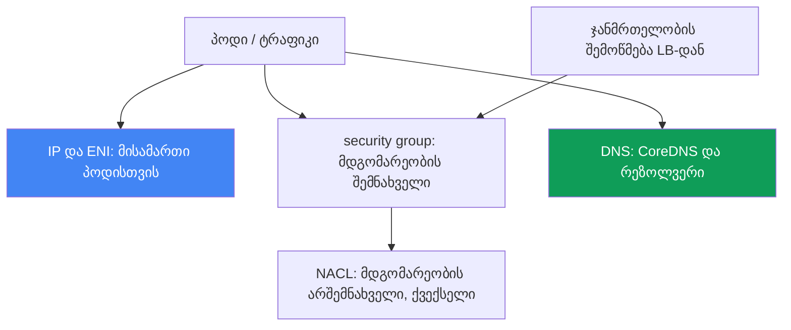
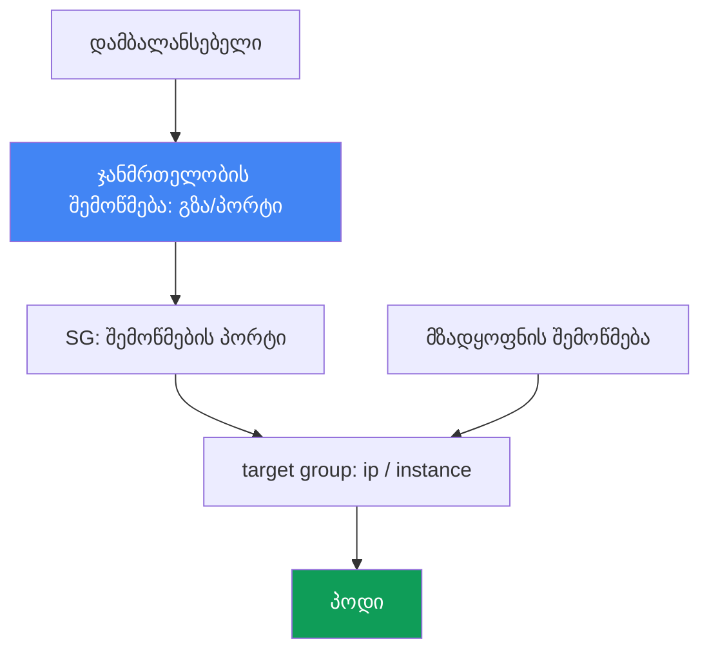

[Русская версия](ru.md) · [Eng version](en.md) · [Versión en español](es.md) · [Version française](fr.md) · [Deutsche Version](de.md) · [繁體中文版](tw.md) · [日本語版](jp.md)
# თავი 46. ქსელური გაუმართაობები: ENI exhausted, SG და NACL, DNS, unhealthy targets დამბალანსებელში

> **რა არის შემდეგ.** თავი 45 განიხილავდა, რატომ ვერ შეუერთდა ნოდი საერთოდ კლასტერს. აქ კი
> განვიხილავთ ქსელურ გაუმართაობებს უკვე მოქმედ კლასტერში: პოდი ვერ იღებს IP-ს, კავშირი წყდება,
> DNS ვერ მუშაობს, დამბალანსებელში target-ები წითლდება. მომიჯნავე თემები სხვა თავებშია:
> VPC CNI-ის, ENI-ისა და ნოდებზე IP-ების მოწყობა, prefix delegation - თავები 7 და 8,
> NLB და ALB დამბალანსებლები - თავები 26 და 27, CoreDNS-ის მეტრიკები - თავი 33, ხოლო
> „ნოდი არ შეუერთდა“ - თავი 45. აქ განვიხილავთ, როგორ ამოვიცნოთ სიმპტომით ქსელური
> გაუმართაობის კლასი და რით დავადასტუროთ ის.

## 46.1. ერთი კლასის ოთხი სიმპტომი

კლასტერი მუშაობს, ნოდები `Ready` მდგომარეობაშია, მაგრამ ქსელი სხვადასხვაგვარად გვღალატობს.
ოთხი ტიპური სურათი ასეთია.

**პოდი `ContainerCreating` მდგომარეობაშია გაჭედილი.** ის ნოდზე დაიგეგმა, მაგრამ არ ეშვება:

```bash
kubectl describe pod web-7d9f-abcde
# Events:
#   Warning  FailedCreatePodSandBox  kubelet
#   failed to assign an IP address to container
```

შეტყობინება `failed to assign an IP address to container` ნიშნავს, რომ VPC CNI-მ პოდს
მისამართი ვერ გამოუყო: ან ნოდზე ხელმისაწვდომი IP-ები ამოიწურა, ან subnet-ში აღარ არის IP.

**კავშირი წყდება.** პოდი ვერ უკავშირდება სხვა პოდს, RDS-ს ან გარე API-ს - ჩანს
`connection timed out`, თუმცა DNS სახელს სწორად გარდაქმნის. ამის მიზეზი ყველაზე ხშირად
security group-ის ან NACL-ის წესებია.

**დამბალანსებელში target-ები `unhealthy` მდგომარეობაშია.** NLB-ის ან ALB-ის უკან არსებული
სერვისი აბრუნებს 502-ს ან 503-ს, target group-ში კი target-ები `healthy` მდგომარეობაში არ არის:

```bash
aws elbv2 describe-target-health --target-group-arn "$TG_ARN" \
  --query "TargetHealthDescriptions[?TargetHealth.State!='healthy'].[Target.Id,TargetHealth.State,TargetHealth.Reason]"
# [ ["10.0.3.17", "unhealthy", "Target.FailedHealthChecks" ] ]
```

**DNS პერიოდულად ვერ მუშაობს.** სახელის გარდაქმნა ხან მუშაობს, ხან timeout-ით წყდება - ეს
არასტაბილური პრობლემაა, რომლის დაჭერაც რთულია.

თავის მთავარი აზრი: ეს ერთი შეცდომა კი არა, სხვადასხვა ფენაზე არსებული ქსელური
გაუმართაობების კლასია - დამისამართება, security group, NACL, DNS და დამბალანსებლის health
check. სიმპტომები მსგავსია, თითქოს რაღაც „ვერ გადის“, მაგრამ ფენები და ხელსაწყოები
განსხვავებულია. ქვემოთ თითო სექცია თითო ფენას ეძღვნება, ხოლო 46.7 სექციაში მოცემულია
ჩეკლისტი და მოქმედებების თანმიმდევრობა.



## 46.2. IP-ებისა და ENI-ის ამოწურვა

VPC CNI თითოეულ პოდს VPC subnet-იდან რეალურ IP-ს აძლევს (თავი 6). შესაბამისად, პოდები
შეზღუდული რესურსისთვის იბრძვიან და ის ორი სხვადასხვა გზით შეიძლება ამოიწუროს.

**ნოდზე IP-ები ამოიწურა.** ნოდზე რამდენი პოდი ეტევა, ამას მხოლოდ CPU და მეხსიერება კი არა,
`max-pods` ლიმიტიც განსაზღვრავს. ის ინსტანსის ტიპზეა დამოკიდებული: ENI-ების რაოდენობა,
რომლის დაჭერაც ინსტანსს შეუძლია, გამრავლებული თითო ENI-ზე IP-ების რაოდენობაზე. პატარა
ინსტანსი ცოტა ENI-სა და IP-ს იტევს, ამიტომ მისი `max-pods` დაბალია. როდესაც ნოდზე თავისუფალი
IP-ები ამოიწურება, ახალი პოდი მისამართს ვერ იღებს და `ContainerCreating` მდგომარეობაში
`failed to assign an IP address to container` შეტყობინებით ჩერდება.

**subnet ამოიწურა.** მაშინაც კი, თუ ნოდზე ENI-ისთვის ადგილი არის, მისამართი subnet-იდან
აიღება. პატარა subnet-ში, მაგალითად `/26`, რომელსაც Load Balancer და სხვა მომხმარებლებიც
იყენებენ, subnet IP exhaustion სწრაფად დგება: თავისუფალი მისამართები აღარ არის, ENI ვერ
იქმნება და პოდები IP-ს ვერ იღებენ.

გასარჩევად უნდა ვნახოთ, კონკრეტულად რომელ ზღვარს მივადექით:

```bash
# რამდენი მისამართია რეალურად მინიჭებული და რა არის ნოდზე ზღვარი
kubectl get pods -o wide --field-selector spec.nodeName=<node> | wc -l
kubectl get node <node> -o jsonpath='{.status.allocatable.pods}'
# თავისუფალი IP მისამართები subnet-ში
aws ec2 describe-subnets --subnet-ids <subnet> \
  --query 'Subnets[0].AvailableIpAddressCount'
```

შემარბილებელი ზომები მე-7 და მე-8 თავებშია აღწერილი, აქ კი მხოლოდ ვარიანტების რუკაა:

| მეთოდი | რას გვაძლევს | სად არის დაწვრილებით |
|---|---|---|
| prefix delegation | ENI ცალკეული IP-ების ნაცვლად /28 პრეფიქსებს იღებს, რაც ნოდზე პოდების რაოდენობას მკვეთრად ზრდის | თავი 7 |
| subnet-ების sizing | პოდებისთვის დიდი subnet-ები, რათა subnet exhaustion არ დადგეს | თავი 6 |
| secondary CIDR | პოდებისთვის VPC-ში დამატებითი მისამართების სივრცის დამატება | თავი 7 |
| `WARM_ENI_TARGET` / `WARM_IP_TARGET` | რამდენი IP შევინახოთ „მარაგში“, სიჩქარესა და მოხმარებას შორის ბალანსი | თავი 8 |

Prefix delegation ყველაზე ეფექტური ბერკეტია: ENI-ზე ცალკეული მეორადი IP-ების ნაცვლად
პრეფიქსები გაიცემა და ნოდზე `max-pods` რამდენჯერმე იზრდება. კონფიგურაცია და თავსებადობა
მე-7 თავშია განხილული.

## 46.3. Security groups: stateful ფილტრი ENI-ის დონეზე

Security group (SG) არის firewall ENI-ის დონეზე და ის **stateful**-ია: თუ გამავალი კავშირი
ნებადართულია, საპასუხო ტრაფიკი ავტომატურად გაივლის და პასუხისთვის ცალკე შემომავალი წესი
საჭირო არ არის. ეს მომდევნო სექციაში განხილული NACL-ისგან მთავარი განსხვავებაა.

EKS-ში რამდენიმე SG მონაწილეობს და მათი ერთმანეთში არევა „ვერ გადის“ ტიპის პრობლემების
ხშირი ძირეული მიზეზია:

- **cluster security group** - იქმნება EKS-ის მიერ; მისი გავლით მოძრაობს ტრაფიკი control plane-სა
  და ნოდებს შორის, ნაგულისხმევად კი თავად ნოდებს შორისაც.
- **ნოდების SG** - მიბმულია node group-ის ინსტანსების ENI-ებზე launch template-ის მეშვეობით
  (თავი 10).
- **security groups for pods** - ცალკე SG კონკრეტული პოდის დონეზე. ის განისაზღვრება
  `SecurityGroupPolicy` რესურსით, რომელიც selector-ის მიხედვით SG-ების სიას პოდებს აბამს;
  VPC CNI ასეთ პოდებს ამ SG-ებით საკუთარ branch ENI-ს გამოუყოფს. მნიშვნელოვანია: policy
  მხოლოდ ახლად დაგეგმილ პოდებზე ვრცელდება, უკვე გაშვებული პოდები არ იცვლება.

კავშირის ტიპური გაუმართაობები, რომელთა მიზეზიც SG არის:

- **პოდი-პოდი სხვადასხვა SG-ს შორის.** თუ პოდები SG-ს `SecurityGroupPolicy`-ის მეშვეობით
  იღებენ და წესები ორმხრივ ტრაფიკს არ უშვებს, კავშირი უხმაუროდ timeout-მდე ჩერდება.
- **პოდი-RDS.** მონაცემთა ბაზის SG-ს არ აქვს inbound წესი, რომელიც ნოდების ან პოდების SG-დან
  DB პორტზე ტრაფიკს დაუშვებდა. გამოსავალი SG reference-ია: RDS-ის წესში CIDR-ის ნაცვლად
  ნებადართული SG-ის id ემატება.
- **პოდი-გარე სერვისი.** SG-ის egress წესი ტრაფიკს საჭირო პორტზე გარეთ არ უშვებს.

SG reference, ანუ წესი, რომელიც მისამართების დიაპაზონის ნაცვლად სხვა SG-ს უთითებს, საიმედო
სტილია: მისამართების შეცვლისას არ ტყდება და ინსტანსების ხელახლა შექმნას უძლებს.

```bash
# რომელი SG-ებია ნოდის ან პოდის ENI-ზე
aws ec2 describe-network-interfaces \
  --filters "Name=private-ip-address,Values=10.0.3.17" \
  --query 'NetworkInterfaces[0].Groups'
```

### პოდის საკუთარი SG: რა ტყდება უხმაუროდ

მიკროსეგმენტაცია ჩავრთეთ, პოდის SG აღვწერეთ, მონაცემთა ბაზაზე წვდომა დავუშვით, პოდი გაეშვა,
მაგრამ სახელებს ვერ გარდაქმნის, readiness-ს ვერ გადის ან გარეთ ვერ უკავშირდება. მიზეზი ერთია:
branch ENI-ის მქონე პოდზე მხოლოდ მისი SG-ები ვრცელდება, ნოდის SG-ის წესები აღარ მოქმედებს.
პოდის SG-ისთვის დოკუმენტირებული მინიმუმი ასეთია:

| რა უნდა გაიხსნას პოდის SG-ში | რატომ არის საჭირო და რა ტყდება მის გარეშე |
|---|---|
| არსებული SG id | არასწორი id-ის შემთხვევაში პოდი შექმნის ეტაპზე სამუდამოდ ჩერდება, ხოლო `describe pod`-ში `CreateNetworkInterface` გამოძახებისას ჩანს `InvalidSecurityGroupID.NotFound` - typo-ს პირველი ნიშანი |
| ნოდების SG-დან შემომავალი ტრაფიკი probe-ების პორტებზე | probe-ებს `kubelet` აგზავნის; ამის გარეშე readiness და liveness ვერ გადის და პოდი endpoints-ში არ ხვდება (სექცია 46.6). ეს ყველაზე ხშირი მიზეზია |
| გამავალი 53 TCP-ით და UDP-ით | ორივე transport, CoreDNS-ის პოდების SG-მდე ან იმ ნოდების SG-მდე, რომლებზეც ის მუშაობს; CoreDNS-ს საკუთარი SG ჩვეულებრივ არ აქვს და პრაქტიკაში ეს ნოდების SG ან cluster security group არის |
| შემომავალი 53 TCP-ით და UDP-ით CoreDNS-ის SG-ში | საპასუხო წესი აუცილებელია: მხოლოდ პოდის egress საკმარისი არ არის, ეს კონფიგურაციის მხოლოდ ნახევარია |
| წესები საჭირო პოდებთან | მათ გარეშე იმ პოდებთან ტრაფიკი, რომლებთანაც პოდს ურთიერთობა სჭირდება, უხმაუროდ timeout-მდე ჩერდება |
| control plane | წესები საჭიროა, როცა SG Fargate-თან გამოიყენება; უმარტივესი გზაა პოდის ერთ-ერთ SG-ად cluster security group-ის მითითება. EC2 ნოდებზე გაშვებული პოდებისთვის ასეთი მოთხოვნა სიაში არ არის: თუ Kubernetes API არის საჭირო, ჩვეულებრივი წესით გამავალი 443 უნდა გაიხსნას |

ხაფანგი „ხან მუშაობს, ხან არა“: პოდის SG-ის წესები არ ვრცელდება ერთსა და იმავე ნოდზე პოდებს
შორის და პოდსა და სერვისებს შორის ტრაფიკზე, მათ შორის `kubelet`-სა და `nodeLocalDNS`-ზე, ხოლო
ერთ ნოდზე განსხვავებული SG-ების მქონე პოდები საერთოდ ვერ უკავშირდებიან ერთმანეთს - ისინი
სხვადასხვა subnet-ში არიან და მათ შორის routing გამორთულია. სიმპტომი იმის მიხედვით ციმციმებს,
სად მოხვდა პოდი და სად არის CoreDNS: აქ „ზოგჯერ მუშაობს“ SG-ს გამართლებას არ წარმოადგენს.
აღსრულების რეჟიმი განსაზღვრავს, ვისი SG-ის გამართვა გვიწევს. ნაგულისხმევი რეჟიმია
`POD_SECURITY_GROUP_ENFORCING_MODE=strict`: ასეთი პოდების გამავალი ტრაფიკისთვის source NAT
გამორთულია, ამიტომ პოდი გარეთ მხოლოდ private subnet-ში NAT-ის მქონე ნოდიდან გავა; public
subnet-იდან მას ინტერნეტი არ ექნება. `standard` რეჟიმში VPC-ის გარეთ ტრაფიკი ინსტანსის primary
ENI-ის მისამართით გადის და ნოდის SG-ის წესებს ექვემდებარება. branch ENI-ის გავლით probe-ებისთვის
`aws-node` init container-ში საჭიროა `DISABLE_TCP_EARLY_DEMUX=true`; VPC CNI 1.11.0 ან უფრო
ახალ ვერსიაში `standard` რეჟიმისას ეს საჭირო არ არის.

```bash
# პოდების SG გამოყენების რეჟიმი და branch ENI-ის პარამეტრები, შემდეგ მოძებნეთ შეცდომა SG id-ში
kubectl describe daemonset aws-node -n kube-system | grep -iE 'SECURITY_GROUP|DEMUX'
kubectl describe pod <pod> | grep -i InvalidSecurityGroupID
```

## 46.4. NACL: stateless ფილტრი subnet-ის დონეზე

Network ACL (NACL) subnet-ის დონეზე მოქმედებს და SG-ისგან განსხვავებით **stateless**-ია:
შემომავალი და გამავალი ტრაფიკის წესები სრულიად დამოუკიდებელია. მოთხოვნის დაშვება საკმარისი
არ არის - პასუხიც ცალკე უნდა დაუშვათ.

აქედან მოდის კლასიკური ხაფანგი. კავშირი subnet-იდან რომელიმე პორტით დისტანციურ პორტზე მიდის,
პასუხი კი უკან **ephemeral port**-ზე ბრუნდება - ეს არის მაღალი დიაპაზონის დროებითი პორტი,
რომელიც კლიენტმა ამ კავშირისთვის აირჩია. თუ NACL-ის გამავალი წესი, ან პასუხებისთვის შემომავალი
წესი, ephemeral ports-ის დიაპაზონს არ უშვებს, პასუხები იჭრება და კავშირი იყინება, მიუხედავად
იმისა, რომ მოთხოვნა გავიდა. პრაქტიკულად ეს ნიშნავს, რომ NACL-ზე ephemeral ports-ის
`1024-65535` დიაპაზონში საპასუხო ტრაფიკი უნდა დაუშვათ, წინააღმდეგ შემთხვევაში TCP სესიები
ვერ სრულდება.

| თვისება | Security group | NACL |
|---|---|---|
| დონე | ENI (ნოდი, პოდი) | subnet |
| მდგომარეობა | stateful, პასუხი ავტომატურად ნებადართულია | stateless, პასუხი ცალკე უნდა დაუშვათ |
| წესები | მხოლოდ allow | allow და deny, ნომრის მიხედვით პრიორიტეტით |
| ephemeral ports | ავტომატურად გაითვალისწინება | ხელით უნდა დაუშვათ |

ნაგულისხმევად NACL მთელ ტრაფიკს უშვებს, ამიტომ კლასტერების უმეტესობაში პრობლემა მას არ
უკავშირდება. მაგრამ თუ უსაფრთხოების გუნდმა subnet-ებზე custom NACL-ები დააყენა, ისინი
ეჭვმიტანილი ხდებიან ისეთი გაწყვეტებისას, რომლებიც SG-ის წესებით „არ აიხსნება“. გარჩევა მარტივია:
SG ephemeral პორტებს ცალკე არ ბლოკავს, ამიტომ თუ პრობლემა სწორედ საპასუხო ტრაფიკშია, NACL
გამოიკვლიეთ.

## 46.5. DNS გაუმართაობები: პერიოდული timeout-ები

ეს ყველაზე ვერაგი კლასია: სახელის გარდაქმნა ხან მუშაობს, ხან არა. რამდენიმე მიზეზი არსებობს
და ისინი შეიძლება ერთმანეთს დაემთხვეს.

**CoreDNS გადატვირთულია ან მიუწვდომელია.** CoreDNS-ის პოდები მოთხოვნების ნაკადს ვერ უმკლავდება
ან მათი რაოდენობა კლასტერისთვის ძალიან მცირეა. სიმპტომია დატვირთვის დროს სახელის გარდაქმნის
latency-ის ზრდა და timeout-ები. EKS CoreDNS-ის autoscaling-ს უჭერს მხარს; დიაგნოსტიკისთვის
CoreDNS-ის მეტრიკები 33-ე თავშია განხილული.

**`ndots:5` ეფექტი.** Kubernetes პოდებს `ndots:5`-სა და search domain-ების სიას უწერს. სახელი,
რომელსაც ხუთი წერტილი არ აქვს, ანუ პრაქტიკულად მათი უმეტესობა, მაგალითად `api.example.com`,
ჯერ ყველა search domain-თან ერთად მოწმდება და მხოლოდ შემდეგ პირდაპირ. ერთი გარე მოთხოვნა
რამდენიმე ზედმეტ მოთხოვნად იქცევა და DNS-ზე დატვირთვა მრავლდება. ხშირად გამოყენებული გარე
სახელებისთვის ბოლოში წერტილიანი FQDN, მაგალითად `api.example.com.`, search domain-ების
გადარჩევას თიშავს.

**conntrack-ის ცხრილი სავსეა.** ყოველი კავშირი, მათ შორის UDP მოთხოვნა DNS-ისადმი, ნოდის kernel-ის
conntrack ცხრილში ჩანაწერს იკავებს. ცხრილის შევსებისას ახალი კავშირები drop-დება, DNS კი UDP-ის
გამოყენების გამო პირველი ზარალდება, რის შედეგადაც პერიოდული timeout-ები ჩნდება. ნოდზე
`nf_conntrack`-ის გამოყენებას ამოწმებენ.

**DNS throttling ENI-ის დონეზე.** თითოეულ ENI-ს VPC resolver-ის, ანუ Route 53 Resolver-ის,
მიმართულებით packets per second-ის მკაცრი ლიმიტი აქვს. როდესაც ნოდის ყველა პოდი DNS მოთხოვნებს
ერთი ENI-ის გავლით აგზავნის და ამ ლიმიტს აღწევს, პაკეტების ნაწილი იკარგება. შედეგად კვლავ
ვიღებთ პერიოდულ timeout-ებს, რომლებიც კონკრეტულ სახელზე არ არის დამოკიდებული.

**შემარბილებელი ზომა - NodeLocal DNSCache.** ნოდზე ადგილობრივი caching DNS agent პოდებს cache-დან
პასუხობს და CoreDNS-თან TCP კავშირს ინარჩუნებს. ეს ამცირებს UDP დატვირთვასა და per-ENI
throttling-ს და latency-ის გრძელ კუდს ასტაბილურებს.

```bash
# მუშაობს თუ არა რეზოლვინგი სადიაგნოსტიკო პოდიდან
kubectl run dnstest --image=busybox:1.36 --rm -it --restart=Never -- \
  nslookup kubernetes.default.svc.cluster.local
# CoreDNS პოდების მდგომარეობა
kubectl -n kube-system get pods -l k8s-app=kube-dns -o wide
```

## 46.6. Unhealthy targets დამბალანსებელში

NLB-ის ან ALB-ის უკან არსებული სერვისი 502-ს ან 503-ს აბრუნებს, რადგან დამბალანსებელი
ჯანმრთელ target-ებს ვერ ხედავს (თავები 26 და 27). დამბალანსებელი target-ებს health check-ს
უგზავნის; შემოწმების ჩავარდნისას target როტაციიდან გამოდის. მიზეზები სათითაოდ განვიხილოთ.

- **არასწორი health check.** შემოწმების path, port ან protocol არ ემთხვევა იმას, რასაც
  აპლიკაცია რეალურად უსმენს. ALB ნაგულისხმევად `/` მისამართს ამოწმებს, აპლიკაცია კი `200`-ს
  მხოლოდ `/healthz`-ზე აბრუნებს - target `unhealthy` ხდება, მიუხედავად იმისა, რომ პოდი ცოცხალია.
- **SG health check-ს არ უშვებს.** target-ის SG, ანუ target-type `instance`-ისას ნოდის SG ან
  target-type `ip`-ისას პოდის SG, დამბალანსებლის SG-დან შემოწმების პორტზე შემომავალ ტრაფიკს
  არ უშვებს. შემოწმება target-მდე ვერ მიდის და ის წითლდება.
- **target-type-ისა და პორტების შეუსაბამობა.** target-type `ip`-ისას target არის პოდის IP და
  მისი `containerPort`; `instance`-ისას კი ნოდი და `NodePort`. target group-ის ტიპის ან პორტის
  შეცდომა შემოწმებას არასწორი მიმართულებით აგზავნის.
- **პოდის readiness probe მზად არ არის.** სანამ readiness არ გავა, პოდი endpoints-ში და target
  group-ში არ ხვდება ან `unhealthy` მდგომარეობაშია. დამბალანსებელი აპლიკაციის მდგომარეობას
  ზუსტად ასახავს.

კლიენტის მხარეს სიმპტომი ასეთია: 502 (`Bad gateway`) ჩვეულებრივ ნიშნავს, რომ target-მა არასწორი
პასუხი გასცა ან კავშირი გაწყდა, ხოლო 503 (`Service unavailable`) ნიშნავს, რომ ჯანმრთელი target
საერთოდ არ არის. დიაგნოსტიკა target group-იდან პოდისკენ მიდის:

```bash
# target-ების მდგომარეობა და მიზეზები
aws elbv2 describe-target-health --target-group-arn "$TG_ARN" \
  --query 'TargetHealthDescriptions[].[Target.Id,TargetHealth.State,TargetHealth.Reason]'
# არის თუ არა სერვისის უკან მზად endpoints
kubectl get endpointslices -l kubernetes.io/service-name=<svc>
```

health check-ის გზა გვაჩვენებს, სად წყდება ის, readiness კი განსაზღვრავს, მოხვდება თუ არა პოდი
target group-ში.



## 46.7. დიაგნოსტიკის თანმიმდევრობა და ხელსაწყოები

ქსელს შემთხვევითი ცდებით კი არ ასწორებენ, არამედ სიმპტომიდან შესაბამის ფენამდე მიდიან.
საბაზისო ხელსაწყოების ნაკრები ასეთია:

```bash
# 1. პოდის მოვლენები: ContainerCreating-ის მიზეზი და IP-ის მინიჭება
kubectl describe pod <pod>
# 2. სად არის პოდი და რომელ ნოდზეა
kubectl get pods -o wide
# 3. ENI, IP და SG კონკრეტულ მისამართზე
aws ec2 describe-network-interfaces \
  --filters "Name=private-ip-address,Values=<ip>" --query 'NetworkInterfaces[0]'
# 4. თავისუფალი მისამართები subnet-ში
aws ec2 describe-subnets --subnet-ids <subnet> \
  --query 'Subnets[0].AvailableIpAddressCount'
# 5. ბალანსერის target-ების ჯანმრთელობა
aws elbv2 describe-target-health --target-group-arn "$TG_ARN"
# 6. პოდიდან რეზოლვინგის შემოწმება
kubectl run dnstest --image=busybox:1.36 --rm -it --restart=Never -- nslookup <name>
# 7. ნოდზე: VPC CNI-ის ქსელის დამპის შეგროვება (ipamd/plugin ლოგები, ENI, eni-configs)
aws ssm send-command --document-name "AWS-RunShellScript" --instance-ids <instance-id> \
  --parameters 'commands=["/opt/cni/bin/aws-cni-support.sh"]'
```

„უხმაურო“ გაწყვეტების ცალკე ხელსაწყოა **VPC Flow Logs**: ისინი წერენ, ENI-ის ან subnet-ის
დონეზე პაკეტმა ACCEPT მიიღო თუ REJECT. flow logs-ში `REJECT` პირდაპირ SG-ზე ან NACL-ზე
მიუთითებს, ხოლო გაგზავნილი მოთხოვნისას საპასუხო პაკეტების არარსებობა - stateless NACL-სა და
ephemeral ports-ზე.

როდესაც პოდი `failed to assign an IP address` შეტყობინებით არის გაჭედილი და გაურკვეველია,
IP-ები ამოიწურა თუ ENI ვერ შეიქმნა, ნოდის დონეზე ჩავდივართ. VPC CNI ლოგებს
`/var/log/aws-routed-eni`-ში ინახავს (`ipamd.log`, `plugin.log`), ხოლო
`/opt/cni/bin/aws-cni-support.sh` სკრიპტი მათ ENI/IP მდგომარეობასა და კონფიგურაციასთან ერთად
`/var/log/eks_<instance-id>_<...>.tar.gz` არქივში აგროვებს. მას ნოდზე SSM-ის მეშვეობით, SSH-ის
გარეშე უშვებენ. ipamd-ის მდგომარეობა პირდაპირაც ჩანს: `curl http://localhost:61679/v1/enis`
გაცემულ ENI-ებსა და IP-ებს აჩვენებს, `/v1/pods` კი მისამართების პოდებთან მიბმას.

ჩეკლისტი „სიმპტომი - სავარაუდო მიზეზი - რა შევამოწმოთ“:

| სიმპტომი | სავარაუდო მიზეზი | რა შევამოწმოთ |
|---|---|---|
| `failed to assign an IP address` | ნოდზე ან subnet-ში თავისუფალი IP არ არის | `describe pod`, `AvailableIpAddressCount` |
| პოდი-პოდი ან პოდი-RDS timeout | SG ტრაფიკს არ უშვებს | `describe-network-interfaces` Groups, RDS-ის SG |
| გაწყვეტა, თუმცა მოთხოვნა გადის | NACL ephemeral ports-ს ჭრის | NACL-ის in/out წესები, VPC Flow Logs |
| DNS პერიოდული timeout-ებით | CoreDNS, conntrack, per-ENI throttling | CoreDNS-ის მეტრიკები (თავი 33), conntrack, PPS |
| ზედმეტი DNS დატვირთვა გარე სახელებზე | `ndots:5` ეფექტი | search domain-ები, წერტილით დასრულებული FQDN |
| 502 ან 503 LB-ის უკან არსებული სერვისიდან | target-ები `unhealthy` არის | `describe-target-health`, health check, SG |
| target-ები `unhealthy` არის, პოდი კი ცოცხალია | health check-ის path/port ან SG | შემოწმების path და port, დამბალანსებლის SG |
| პოდი DNS-ისა და readiness-ის გარეშე | პოდს ნოდის SG-ის ნაცვლად საკუთარი SG აქვს | პოდის `SecurityGroupPolicy`, 53 TCP/UDP, ნოდების SG-დან შემომავალი ტრაფიკი |

ლოგიკა ასეთია: ჯერ სიმპტომის კლასიფიკაცია უნდა მოხდეს, ანუ არ არის IP, წყდება კავშირი, DNS ვერ
მუშაობს თუ LB-დან 5xx მოდის, შემდეგ კი შესაბამის ფენაზე უნდა გადავიდეთ. `describe pod` და
`get pods -o wide` იაფია და პირველივე ეტაპზე გამორიცხავს IP პრობლემებს;
`describe-target-health` დამბალანსებლის გაუმართაობას მყისიერად ადგენს; VPC Flow Logs კი ბოლო
საზღვარია ისეთი გაწყვეტებისთვის, რომლებიც არც IP-ით და არც health check-ით არ აიხსნება.

## 46.8. როგორ გამოიყენება ეს production-ში

- **დიაგნოსტიკამდე სიმპტომის კლასიფიკაცია.** IP არ არის, კავშირი წყდება, DNS timeout-ებია თუ
  LB-დან 5xx მოდის - ეს ოთხი სხვადასხვა ფენაა. ჯერ კლასი დგინდება და მხოლოდ შემდეგ გამოიყენება
  ხელსაწყო, არა პირიქით.
- **მისამართების გეგმა წინასწარ მუშავდება.** პოდებისთვის დიდი subnet-ები და prefix delegation
  (თავი 7) IP-ების ამოწურვას ტრაფიკის პიკამდე აგვარებს.
- **CIDR-ის ნაცვლად SG reference-ები გამოიყენება.** ნოდების ან პოდების SG-ზე მითითებული წესები
  ინსტანსების ხელახლა შექმნასა და მისამართების შეცვლას უძლებს, ამიტომ RDS-მდე ნაკლები
  „მოულოდნელი“ გაწყვეტა ხდება.
- **დატვირთულ კლასტერებზე NodeLocal DNSCache ყენდება.** ადგილობრივი cache DNS-ის per-ENI
  throttling-სა და conntrack-ის შევსებას ამცირებს და რთულად დასაჭერი ინციდენტების მთელ კლასს
  აქრობს.
- **health check მანიფესტში გააზრებულად ინახება.** შემოწმების path, port და protocol readiness
  probe-სა და target-ის პორტებთან არის შეთანხმებული, რათა `unhealthy` რეალურ პრობლემას ნიშნავდეს
  და არა typo-ს.
- **production subnet-ებზე VPC Flow Logs ირთვება.** როდესაც ტრაფიკი „უხმაუროდ“ ქრება, ლოგებში
  `REJECT` SG-სა და NACL-ს შორის გამოცნობაზე დახარჯულ საათებს ზოგავს.

## 46.9. მინი-ლექსიკონი

- **`failed to assign an IP address to container`** - VPC CNI-მ პოდს IP ვერ გამოუყო: მისამართები
  ნოდზე ან subnet-ში ამოიწურა.
- **`max-pods`** - ნოდზე პოდების ზღვარი, რომელიც ინსტანსის ტიპისთვის ENI-ების რაოდენობასა და
  თითო ENI-ზე IP-ების რაოდენობაზეა დამოკიდებული.
- **subnet IP exhaustion** - subnet-ში ENI-ებისა და პოდებისთვის თავისუფალი მისამართები აღარ არის.
- **prefix delegation** - ENI-სთვის ცალკეული IP-ების ნაცვლად /28 პრეფიქსების გაცემა, რაც ნოდზე
  მეტ პოდს უზრუნველყოფს (თავი 7).
- **security group** - stateful firewall ENI-ის დონეზე; ნებადართულ მოთხოვნაზე პასუხი ავტომატურად
  გადის.
- **`SecurityGroupPolicy`** - რესურსი, რომელიც selector-ის მიხედვით SG-ს პოდებს აბამს (security
  groups for pods); branch ENI-ის მქონე პოდი ნოდის SG-ის წესებს აღარ მემკვიდრეობს.
- **`POD_SECURITY_GROUP_ENFORCING_MODE`** - `strict` source NAT-ის გარეშე და `standard`, სადაც VPC-ის
  გარეთ ტრაფიკი primary ENI-ით, ნოდის SG-ის წესების ქვეშ გადის.
- **NACL** - stateless ფილტრი subnet-ის დონეზე; შემომავალი და გამავალი წესები დამოუკიდებელია.
- **ephemeral ports** - მაღალი `1024-65535` დიაპაზონი, რომელზეც საპასუხო ტრაფიკი მიდის; NACL-ზე
  ის ხელით უნდა დაუშვათ.
- **`ndots:5`** - პოდების resolv.conf-ის პარამეტრი, რომლის გამოც სახელები search domain-ებთან
  ერთად მოწმდება.
- **conntrack** - ნოდის kernel-ის კავშირების ცხრილი; მისი შევსებისას ახალი კავშირები drop-დება.
- **NodeLocal DNSCache** - ნოდზე ადგილობრივი caching DNS, რომელიც CoreDNS-სა და per-ENI
  throttling-ზე დატვირთვას ამცირებს.
- **`describe-target-health`** - ბრძანება, რომელიც target group-ის target-ების მდგომარეობასა და
  მიზეზს აჩვენებს.

## 46.10. თავის შეჯამება

- მოქმედ კლასტერში ქსელური გაუმართაობები სხვადასხვა ფენის failure-ების კლასია: IP და ENI,
  security group, NACL, DNS და დამბალანსებლის health check. სიმპტომები მსგავსია, ფენები და
  ხელსაწყოები კი განსხვავებული.
- `failed to assign an IP address to container` IP-ების ამოწურვას ნიშნავს: ან ნოდზე `max-pods`
  ლიმიტს მივაღწიეთ, ან subnet IP exhaustion დადგა. პრობლემას prefix delegation და subnet-ების
  სწორი sizing ამსუბუქებს (თავები 7 და 8).
- Security group stateful-ია და ENI-ის დონეზე მუშაობს; პოდი-პოდი, პოდი-RDS და egress კავშირების
  გაწყვეტას ყველაზე ხშირად SG-ის წესები იწვევს. SG reference-ები CIDR-ზე საიმედოა.
- პოდის საკუთარი SG ნოდის SG-ის წესებს აუქმებს, ამიტომ მასში ორივე მიმართულებით 53 TCP და UDP,
  ასევე probe-ების პორტებზე ნოდების SG-დან შემომავალი ტრაფიკი ხელით უნდა ჩაიწეროს; წინააღმდეგ
  შემთხვევაში პოდი უხმაუროდ კარგავს DNS-სა და readiness-ს.
- NACL stateless-ია და subnet-ის დონეზე მუშაობს; კლასიკური ხაფანგია ephemeral ports-ზე საპასუხო
  ტრაფიკის დაუშვებლობა. ნაგულისხმევად NACL ყველაფერს ატარებს, ამიტომ ეჭვი custom წესებისას
  მიაქვთ მასზე.
- DNS timeout-ები არასტაბილურია: მიზეზებია CoreDNS-ის გადატვირთვა, `ndots:5` ეფექტი, conntrack-ის
  შევსება და resolver-მდე per-ENI throttling. შემარბილებელი ზომებია NodeLocal DNSCache და
  CoreDNS autoscaling.
- NLB-სა და ALB-ში unhealthy targets იწვევს 502-სა და 503-ს: არასწორი health check, SG-ის მიერ
  შემოწმების დაბლოკვა, target-type-ისა და პორტების შეუსაბამობა, პოდის readiness. დიაგნოსტიკის
  ბრძანებაა `describe-target-health`.
- თანმიმდევრობა: ჯერ სიმპტომის კლასიფიკაცია, შემდეგ შესაბამისი ფენის ხელსაწყო - `describe pod`,
  `describe-network-interfaces`, `describe-target-health`, `nslookup` პოდიდან და VPC Flow Logs.

## 46.11. როგორ გამოგადგებათ ეს რეალურ სამუშაოში

მორიგეობისას ქსელური ინციდენტი ხშირად გამოიყურება როგორც „რაღაც ვერ გადის“ და პირველი
ხელსაწყოსთვის ხელის წავლება მაცდურია. იმარჯვებს ის, ვინც ჯერ კლასს ასახელებს: პოდი IP-ის გარეშე,
კავშირის გაწყვეტა, პერიოდულად გაუმართავი DNS თუ დამბალანსებლის 5xx. კლასი დაუყოვნებლივ
განსაზღვრავს ფენასა და ბრძანებას. `ContainerCreating` მდგომარეობაში მყოფი პოდი ნიშნავს
`describe pod`-სა და თავისუფალი IP-ების დათვლას და არა tcpdump-ს. 503 ნიშნავს
`describe-target-health`-ს და არა პოდების restart-ს. სწორი კლასიფიკაცია იმ წუთებს ზოგავს,
როდესაც სერვისი გათიშულია.

დაგეგმვისას იგივე ფენები პრევენციულ ზომებად იქცევა: დიდი subnet-ები და prefix delegation
IP-ების ამოწურვას პიკამდე აგვარებს, SG reference-ები და გააზრებული health check-ები კავშირის
გაწყვეტების მთელ კლასებს აქრობს, NodeLocal DNSCache ENI-ზე DNS throttling-ს ამცირებს, ხოლო VPC
Flow Logs „უხმაურო“ გაწყვეტას `REJECT`-ად აქცევს. stateful SG-სა და stateless NACL-ს შორის
განსხვავების ცოდნა და იმის ცოდნა, სად იწურება IP, საათებს ზოგავს, რადგან პირდაპირ სწორ ფენაზე
მიგვითითებს.

## 46.12. კითხვები თვითშემოწმებისთვის

1. რატომ არის კლასტერში ქსელური გაუმართაობები failure-ების კლასი და არა ერთი შეცდომა? დაასახელეთ ფენები.
2. რას ნიშნავს `failed to assign an IP address to container` და რა ორი მიზეზი დგას მის უკან?
3. რაზეა დამოკიდებული ნოდზე `max-pods` და როგორ ცვლის სურათს prefix delegation (თავი 7)?
4. რით განსხვავდება ნოდზე IP-ების ამოწურვა subnet IP exhaustion-ისგან და როგორ შევამოწმოთ თითოეული?
5. რატომ ეწოდება security group-ს stateful და როგორ ამარტივებს ეს წესებს NACL-თან შედარებით?
6. რომელი SG-ები მონაწილეობს EKS-ში და რას აკეთებს `SecurityGroupPolicy` (security groups for pods)?
7. რა წყვეტს მუშაობას პოდში, რომელმაც საკუთარი SG მიიღო, და რომელი წესები უნდა დაემატოს ხელით?
8. რატომ ვერ უკავშირდება პოდი RDS-ს სწორი DNS-ის მიუხედავად და რა არის SG reference?
9. რაში მდგომარეობს NACL-ის ხაფანგი ephemeral ports-თან და რატომ არ გვხვდება ის security group-ში?
10. დაასახელეთ პერიოდული DNS timeout-ების მიზეზები: რა როლი აქვს `ndots:5`-ს, conntrack-სა და per-ENI ლიმიტს?
11. როგორ ამსუბუქებს NodeLocal DNSCache DNS გაუმართაობებს და რა დატვირთვას ამცირებს?
12. რატომ არის დამბალანსებელში target-ები `unhealthy` და რას აჩვენებს `describe-target-health`?
13. დიაგნოსტიკის თვალსაზრისით, რით განსხვავდება დამბალანსებლის 502 პასუხი 503-ისგან?
14. როდის უნდა გამოიყენოთ VPC Flow Logs ქსელური გაწყვეტის დიაგნოსტიკისას და რას უნდა ეძებდეთ იქ?

## პრაქტიკა

ამ თემას კურსის ორი ლაბორატორია ახლავს. [ლაბორატორია 120 - ქსელური გაუმართაობები და unhealthy
targets](../../labs/120/README_GE.MD): თქვენ აყენებთ AWS Load Balancer Controller-ს, იღებთ
NLB-ს საკუთარი security group-ით inbound წესების გარეშე, აწყდებით
`Target.FailedHealthChecks` სიმპტომს, ამტკიცებთ მიზეზს და წვდომას ასწორებთ. გაშვება:
`TASK=120 make run_eks_task`.

[ლაბორატორია 126 - security groups for pods](../../labs/126/README_GE.MD) იმავე ფენას მეორე
მხრიდან განიხილავს: პოდი საკუთარ branch ENI-ს იღებს, ნოდის წესები მასზე აღარ მოქმედებს, თქვენ
ხედავთ `Running`, მაგრამ არა `Ready` მდგომარეობას, პოულობთ `kubelet` probe-ისთვის გამოტოვებულ
წესს, არკვევთ, რატომ სწორდება DNS CoreDNS-ის მხარეს წესით და არა პოდის egress-ით, და ამოწმებთ,
როგორ იცვლება ქცევა `strict` და `standard` რეჟიმებს შორის. გაშვება:
`TASK=126 make run_eks_task`. ორივე ლაბორატორიაში შემოწმება სრულდება `check_result` ბრძანებით.

ლაბორატორიის გარდა, ეს თავი დიაგნოსტიკური runbook-ია. ყველა შემოწმება შეგიძლიათ უსაფრთხოდ
გაუშვათ ჯანმრთელ კლასტერზე, რათა იცოდეთ, როგორ გამოიყურება ნორმა და გადახრა სწრაფად ამოიცნოთ.

ჯერ პოდებისა და subnet-ების დამისამართება შეამოწმეთ:

```bash
# რამდენი პოდია ნოდზე და რა არის ზღვარი
kubectl get pods -A -o wide --field-selector spec.nodeName=<node>
kubectl get node <node> -o jsonpath='{.status.allocatable.pods}'
# თავისუფალი მისამართები ნოდების subnet-ში: ნორმაში დიდი მარაგია
aws ec2 describe-subnets --subnet-ids <subnet> \
  --query 'Subnets[0].AvailableIpAddressCount'
```

შემდეგ გაარკვიეთ, რომელი SG-ებია მიმაგრებული მოქმედი პოდის ENI-ზე და შიგნიდან სახელის
გარდაქმნა შეამოწმეთ:

```bash
# ENI და მისი security groups პოდის IP-ის მიხედვით
aws ec2 describe-network-interfaces \
  --filters "Name=private-ip-address,Values=<pod-ip>" \
  --query 'NetworkInterfaces[0].[NetworkInterfaceId,Groups]'
# DNS სადიაგნოსტიკო პოდიდან: შიდა და გარე სახელი
kubectl run dnstest --image=busybox:1.36 --rm -it --restart=Never -- \
  sh -c 'nslookup kubernetes.default; nslookup example.com'
```

თუ კლასტერში დამბალანსებლის უკან სერვისი არსებობს, შეამოწმეთ target-ების ჯანმრთელობა და პოდების
readiness-ს შეადარეთ:

```bash
# target-ის მდგომარეობა: ნორმაში ყველა healthy
aws elbv2 describe-target-health --target-group-arn "$TG_ARN" \
  --query 'TargetHealthDescriptions[].[Target.Id,TargetHealth.State]' --output table
# სერვისის უკან მზად endpoints
kubectl get endpointslices -l kubernetes.io/service-name=<svc>
```

ბოლოს ნოდების subnet-ებზე VPC Flow Logs ჩართეთ და ჩანაწერების ფორმატი ნახეთ: `action` სვეტი
`ACCEPT` ან `REJECT` მნიშვნელობით სწორედ ის არის, რასაც „უხმაურო“ გაწყვეტის გამოძიებისას ეძებთ.
სურათი 46.7 სექციის ჩეკლისტს შეადარეთ: ჯანმრთელ კლასტერში IP-ების დიდი მარაგია, ENI-ზე
მოსალოდნელი SG-ებია, DNS შიდა და გარე სახელებს გარდაქმნის, target-ები კი `healthy` მდგომარეობაშია.
ნორმის დამახსოვრებით იმ ფენას უფრო სწრაფად იპოვით, სადაც ქსელი მწყობრიდან გამოვა.

---
[სარჩევი](../README_GE.md) · [თავი 45](../45/ge.md) · [თავი 47](../47/ge.md)
