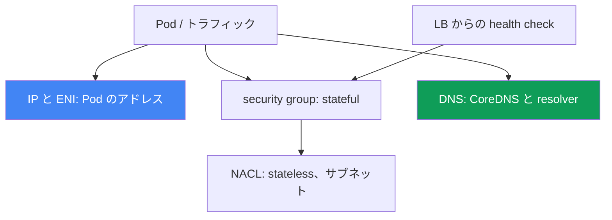
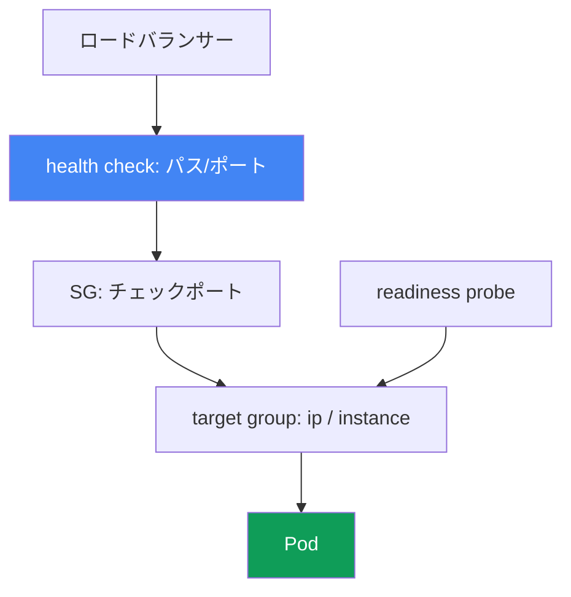

[Русская версия](ru.md) · [Eng version](en.md) · [Versión en español](es.md) · [Version française](fr.md) · [Deutsche Version](de.md) · [ქართული ვერსია](ge.md) · [繁體中文版](tw.md)
# 第46章. ネットワーク障害: ENI 枯渇、SG と NACL、DNS、ロードバランサーの unhealthy targets

> **この先。** 第45章では、そもそもノードがクラスターに参加しない理由を扱いました。ここではすでに稼働中のクラスターで起きるネットワーク障害、すなわち Pod に IP が割り当てられない、接続性が途切れる、DNS が失敗する、ロードバランサーのターゲットが赤くなる問題を扱います。周辺領域は別章で扱います。VPC CNI、ENI、ノード上の IP の仕組みは第7章と第8章、NLB と ALB のロードバランサーは第26章と第27章、CoreDNS のメトリクスは第33章、「ノードが参加しない」問題は第45章です。本章では、症状からネットワーク障害の種類を見分け、何で確認するかを説明します。

## 46.1. 同じ分類に属する四つの症状

クラスターは動作し、ノードは `Ready` であっても、ネットワークはさまざまな形で問題を起こします。代表的な四つのパターンです。

**Pod が `ContainerCreating` のまま止まる。** Pod はノードにスケジュールされているのに起動しません。

```bash
kubectl describe pod web-7d9f-abcde
# Events:
#   Warning  FailedCreatePodSandBox  kubelet
#   failed to assign an IP address to container
```

`failed to assign an IP address to container` は、VPC CNI が Pod にアドレスを割り当てられなかったことを示します。ノード上の利用可能な IP が尽きたか、サブネットが枯渇しています。

**接続性が途切れる。** DNS は名前解決できているのに、Pod から別の Pod、RDS、外部 API への通信が `connection timed out` になります。多くは security group または NACL のルールです。

**ロードバランサーのターゲットが `unhealthy`。** NLB または ALB の背後にあるサービスが 502 や 503 を返し、target group 内のターゲットが `healthy` ではありません。

```bash
aws elbv2 describe-target-health --target-group-arn "$TG_ARN" \
  --query "TargetHealthDescriptions[?TargetHealth.State!='healthy'].[Target.Id,TargetHealth.State,TargetHealth.Reason]"
# [ ["10.0.3.17", "unhealthy", "Target.FailedHealthChecks"] ]
```

**DNS が断続的に失敗する。** 名前解決が動作したり、タイムアウトで失敗したりします。捕捉しにくい不安定な問題です。

本章の要点は、これらは一つのエラーではなく、アドレッシング、security group、NACL、DNS、ロードバランサーの health check という異なるレイヤーで発生するネットワーク障害の分類だということです。症状は似ています（何かに「到達できない」）が、レイヤーとツールは異なります。以下ではレイヤーごとに説明し、46.7 節でチェックリストと順序を示します。



## 46.2. IP と ENI の枯渇

VPC CNI は各 Pod に VPC サブネットから実際の IP を与えます（第6章）。つまり Pod は有限なリソースを取り合い、そのリソースは二つの異なる方法で尽きます。

**ノード上の IP が尽きる。** ノードに配置できる Pod 数は CPU とメモリだけでなく、`max-pods` の制限にも左右されます。これはインスタンスタイプに結び付きます。インスタンスが保持できる ENI 数に、各 ENI の IP 数を掛けたものです。小さなインスタンスが保持できる ENI と IP は少なく、`max-pods` も低くなります。ノード上の空き IP が尽きると、新しい Pod はアドレスを取得できず、`failed to assign an IP address to container` を伴って `ContainerCreating` のまま止まります。

**サブネットが尽きる。** ノードに ENI 用の余地があっても、アドレスはサブネットから取得されます。小さいサブネット（たとえば `/26` で、さらに Load Balancer や他の利用者もある場合）は、すぐに subnet IP exhaustion になります。サブネットに空きアドレスがなく、ENI が起動できず、Pod に IP が割り当てられません。

どこで詰まっているかを区別するには、次を確認します。

```bash
# 実際に割り当て済みのアドレス数と、ノード上の上限
kubectl get pods -o wide --field-selector spec.nodeName=<node> | wc -l
kubectl get node <node> -o jsonpath='{.status.allocatable.pods}'
# サブネットの空き IP
aws ec2 describe-subnets --subnet-ids <subnet> \
  --query 'Subnets[0].AvailableIpAddressCount'
```

緩和策は第7章と第8章で扱います。ここでは選択肢の一覧だけを示します。

| 手法 | 得られること | 詳細 |
|---|---|---|
| prefix delegation | ENI は単一 IP ではなく /28 プレフィックスを受け取り、ノード当たりの Pod 数が大幅に増える | 第7章 |
| サブネットのサイジング | subnet exhaustion に達しないよう、Pod 用に大きなサブネットを確保する | 第6章 |
| secondary CIDR | Pod 用に VPC にアドレス空間を追加する | 第7章 |
| `WARM_ENI_TARGET` / `WARM_IP_TARGET` | 予備として保持する IP 数、速度と消費量のバランス | 第8章 |

Prefix delegation は最も有効な手段です。ENI に単一の secondary IP ではなくプレフィックスを割り当てるため、ノードの `max-pods` が何倍にも増えます。設定と互換性は第7章を参照してください。

## 46.3. Security groups: ENI レベルの stateful フィルター

Security group（SG）は ENI レベルの firewall であり、**stateful** です。送信接続が許可されていれば、戻りトラフィックは自動的に通り、応答用の個別の受信ルールは不要です。これは次節の NACL との重要な違いです。

EKS では複数の SG が関係し、それらの混同が「通信できない」問題のよくある根本原因です。

- **cluster security group**: EKS が作成します。control plane とノードの間、そしてデフォルトではノード間のトラフィックが通ります。
- **ノードの SG**: node group インスタンスの ENI に紐付きます（launch template 経由、第10章）。
- **security groups for pods**: 特定の Pod に対する独立した SG です。`SecurityGroupPolicy` リソースにより、セレクターで Pod に SG のリストを紐付けます。VPC CNI はこのような Pod に、これらの SG を持つ独自の branch ENI を割り当てます。重要なのは、ポリシーは新たにスケジュールされる Pod にのみ適用され、すでに起動済みの Pod は変わらないことです。

SG が原因となる典型的な接続障害は次のとおりです。

- **異なる SG 間の Pod-to-Pod。** Pod が `SecurityGroupPolicy` で SG を取得しており、ルールが相互トラフィックを許可していなければ、接続はタイムアウトまで静かに待機します。
- **Pod-to-RDS。** DB の SG に、ノードまたは Pod の SG から DB ポートへのトラフィックを許可する inbound ルールがありません。CIDR ではなく許可する SG の id を RDS ルールに追加する、SG 参照で解決します。
- **Pod-to-外部サービス。** SG の egress ルールが必要なポートへのトラフィックを出せません。

SG 参照（ルールがアドレス範囲ではなく別の SG を参照すること）は信頼できるスタイルです。アドレスが変わっても壊れず、インスタンスを再作成しても維持されます。

```bash
# ノードまたは Pod の ENI に付与された SG
aws ec2 describe-network-interfaces \
  --filters "Name=private-ip-address,Values=10.0.3.17" \
  --query 'NetworkInterfaces[0].Groups'
```

### Pod 専用 SG: 静かに壊れるもの

マイクロセグメンテーションを有効にし、Pod の SG を定義し、DB へのアクセスを許可して Pod が起動したのに、名前解決できない、readiness を通過しない、外部へ出られないことがあります。原因は一つです。branch ENI を持つ Pod にはその SG **だけ**が適用され、ノード SG のルールは効きません。Pod SG に必要な最小限の、文書化されたルールは次のとおりです。

| Pod の SG で開けるもの | 必要な理由と、ない場合に壊れるもの |
|---|---|
| 既存の SG id | id が誤っていると Pod は作成中に永久に停止し、`describe pod` に `CreateNetworkInterface` 呼び出し時の `InvalidSecurityGroupID.NotFound` が表示されます。これはタイプミスの最初の兆候です |
| probe ポートへのノード SG からの受信 | probe は `kubelet` が送ります。ない場合 readiness と liveness が通らず、Pod は endpoints に入れません（46.6 節）。最も多い原因です |
| TCP と UDP の 53 番への送信 | 両方のトランスポートについて、CoreDNS Pod の SG、または CoreDNS が動作するノードの SG へ許可します。CoreDNS は通常独自 SG を持たないため、実際にはノード SG または cluster security group です |
| CoreDNS の SG への TCP と UDP の 53 番の受信 | 戻りのルールは必須です。Pod 側の egress だけでは設定の半分にすぎません |
| 必要な Pod へのルール | これがないと、Pod が通信すべき相手へのトラフィックはタイムアウトまで静かに停止します |
| control plane | SG を Fargate で使う場合にルールが必要です。最も簡単なのは、Pod の SG の一つとして cluster security group を指定することです。EC2 ノード上の Pod にはこの要件はありません。Kubernetes API には通常どおり outbound 443 が必要です |

「時々動く」という罠があります。Pod SG のルールは、同じノード上の Pod 間および Pod とサービス間のトラフィック（`kubelet` や `nodeLocalDNS` を含む）には適用されず、同じノード上で異なる SG を持つ Pod 同士はまったく通信できません。これらは別のサブネットにあり、間のルーティングは無効です。症状は Pod がどこに配置され、CoreDNS がどこにいるかで変動します。この場合「たまに動く」は SG の正当化になりません。適用モードによって、どの SG をデバッグするかが決まります。デフォルトの `POD_SECURITY_GROUP_ENFORCING_MODE=strict` では、このような Pod の外向きトラフィックに対する source NAT が無効です。Pod が外へ出られるのは NAT を持つプライベートサブネット上のノードからだけで、パブリックサブネットからインターネットへは出られません。`standard` では、VPC 外へのトラフィックはインスタンスの primary ENI のアドレスで送信され、ノード SG のルールが適用されます。branch ENI 経由の probe には `aws-node` の init コンテナで `DISABLE_TCP_EARLY_DEMUX=true` が必要です。VPC CNI 1.11.0 以降で `standard` モードの場合は不要です。

```bash
# Pod SG の適用モードと branch ENI 設定を確認し、SG id のエラーを検索する
kubectl describe daemonset aws-node -n kube-system | grep -iE 'SECURITY_GROUP|DEMUX'
kubectl describe pod <pod> | grep -i InvalidSecurityGroupID
```

## 46.4. NACL: サブネットレベルの stateless フィルター

Network ACL（NACL）はサブネットレベルで機能し、SG と異なり **stateless** です。受信と送信のルールは完全に独立しています。リクエストを許可するだけでは不十分で、応答も別途許可する必要があります。

ここに古典的な罠があります。接続はあるポートからリモートポートへサブネットを出ていきますが、応答はクライアントがその接続用に選択した高い範囲の一時ポート、すなわち **ephemeral port** に戻ります。NACL の送信ルール（または応答の受信ルール）が ephemeral ports の範囲を許可していなければ、リクエストは送信されても応答が遮断され、接続は停止します。実際には、NACL で ephemeral ports（範囲 `1024-65535`）への戻りトラフィックを許可する必要があります。そうしないと TCP セッションは完了しません。

| 属性 | Security group | NACL |
|---|---|---|
| レベル | ENI（ノード、Pod） | サブネット |
| 状態 | stateful、応答は自動許可 | stateless、応答を個別に許可 |
| ルール | allow のみ | allow と deny、番号順の優先度 |
| ephemeral ports | 自動的に考慮される | 手動で許可が必要 |

デフォルトの NACL はすべてのトラフィックを許可するため、ほとんどのクラスターでは原因ではありません。しかしセキュリティチームがサブネットにカスタム NACL を設定している場合、SG ルールでは説明できない切断の容疑者になります。区別は簡単です。SG は ephemeral port を遮断しません。問題がまさに戻りトラフィックにあるなら、NACL を調べてください。

## 46.5. DNS 障害: 断続的なタイムアウト

最も厄介な分類は、名前解決が動作したり失敗したりする問題です。原因は複数あり、重なることもあります。

**CoreDNS が過負荷または利用不能。** CoreDNS Pod がリクエストの流量を処理しきれないか、クラスターに対して少なすぎます。症状は、負荷時の名前解決レイテンシーとタイムアウトの増加です。EKS は CoreDNS のオートスケーリングをサポートしており、診断用の CoreDNS メトリクスは第33章で扱います。

**`ndots:5` の影響。** Kubernetes は Pod に `ndots:5` と search domain のリストを設定します。5 個のドットを持たない名前（たとえばほぼすべての `api.example.com`）は、まず全 search domain を付けて試され、その後にそのまま試されます。一つの外部リクエストが複数の余分なリクエストになり、DNS 負荷が増幅されます。頻繁に参照する外部名には、末尾にドットを付けた FQDN（`api.example.com.`）が有効です。これにより search domain の試行を止められます。

**conntrack table full。** 各接続（DNS への UDP リクエストを含む）は、ノードカーネルの conntrack テーブルにエントリを占有します。満杯になると新しい接続はドロップされ、UDP DNS が最初に影響を受けるため、断続的なタイムアウトになります。ノード上の `nf_conntrack` 使用量を確認します。

**ENI レベルの DNS スロットリング。** 各 ENI には VPC resolver（Route 53 Resolver）に対する packets per second の厳格な上限があります。ノードのすべての Pod が一つの ENI 経由で DNS を送信し、その上限に達すると、一部のパケットがドロップされます。これも特定の名前に紐付かない断続的なタイムアウトになります。

**緩和策: NodeLocal DNSCache。** ノード上のローカルキャッシュ DNS エージェントは、キャッシュから Pod に応答し、CoreDNS への TCP 接続を維持します。これにより UDP 負荷と ENI ごとのスロットリングを減らし、レイテンシーのテールを安定させます。

```bash
# デバッグ Pod から名前解決が機能するか
kubectl run dnstest --image=busybox:1.36 --rm -it --restart=Never -- \
  nslookup kubernetes.default.svc.cluster.local
# CoreDNS Pod の状態
kubectl -n kube-system get pods -l k8s-app=kube-dns -o wide
```

## 46.6. ロードバランサーの unhealthy targets

NLB または ALB の背後にあるサービスは、ロードバランサーが正常なターゲットを認識していないため 502 や 503 を返します（第26章と第27章）。ロードバランサーはターゲットに health check を送り、失敗するとターゲットをローテーションから外します。原因ごとに確認します。

- **誤った health check。** チェックのパス、ポート、またはプロトコルが、アプリケーションが実際に listen しているものと一致しません。ALB はデフォルトで `/` を確認しますが、アプリケーションが `/healthz` にだけ `200` を返す場合、Pod は動いていてもターゲットは `unhealthy` です。
- **SG が health check を通さない。** ターゲットの SG（target-type `instance` ならノード、target-type `ip` なら Pod）が、チェックポートへのロードバランサー SG からの受信トラフィックを許可していません。チェックが到達できず、ターゲットは赤くなります。
- **target-type とポートの不一致。** target-type `ip` のターゲットは Pod の IP とその `containerPort` です。`instance` ではノードと `NodePort` です。target group のタイプまたはポートが間違っていると、チェックは誤った宛先に行きます。
- **Pod の readiness probe が準備できていない。** readiness が通過するまで Pod は endpoints に入らず、target group でも `unhealthy` になります。ロードバランサーはアプリケーションの状態を正しく反映しています。

クライアント側の症状では、502（`Bad gateway`）は通常ターゲットが不正な応答を返したか接続が切れたことを示し、503（`Service unavailable`）は正常なターゲットがまったくないことを示します。診断は target group から Pod へ進めます。

```bash
# ターゲットごとの状態と理由
aws elbv2 describe-target-health --target-group-arn "$TG_ARN" \
  --query 'TargetHealthDescriptions[].[Target.Id,TargetHealth.State,TargetHealth.Reason]'
# Service の背後に ready な endpoints があるか
kubectl get endpointslices -l kubernetes.io/service-name=<svc>
```

health check のパスはどこで途切れるかを示し、readiness は Pod が target group に入るかを決定します。



## 46.7. 診断の順序とツール

ネットワークは当てずっぽうで直すのではなく、症状からレイヤーへ進みます。基本となるツールセットは次のとおりです。

```bash
# 1. Pod のイベント: ContainerCreating と IP 割り当ての原因
kubectl describe pod <pod>
# 2. Pod の場所とノード
kubectl get pods -o wide
# 3. 特定のアドレスに対する ENI、IP、SG
aws ec2 describe-network-interfaces \
  --filters "Name=private-ip-address,Values=<ip>" --query 'NetworkInterfaces[0]'
# 4. サブネットの空きアドレス
aws ec2 describe-subnets --subnet-ids <subnet> \
  --query 'Subnets[0].AvailableIpAddressCount'
# 5. ロードバランサーのターゲットの健全性
aws elbv2 describe-target-health --target-group-arn "$TG_ARN"
# 6. Pod 内からの名前解決確認
kubectl run dnstest --image=busybox:1.36 --rm -it --restart=Never -- nslookup <name>
# 7. ノード上: VPC CNI のネットワークダンプを収集する（ipamd/plugin ログ、ENI、eni-configs）
aws ssm send-command --document-name "AWS-RunShellScript" --instance-ids <instance-id> \
  --parameters 'commands=["/opt/cni/bin/aws-cni-support.sh"]'
```

「静かな」切断に対する専用ツールは **VPC Flow Logs** です。これは ENI またはサブネットレベルでパケットが ACCEPT されたか REJECT されたかを記録します。flow logs の `REJECT` は SG または NACL を直接示し、リクエスト送信済みなのに応答パケットがない場合は stateless NACL と ephemeral ports を示します。

Pod が `failed to assign an IP address` で止まり、IP が尽きたのか ENI が起動できなかったのか不明な場合は、ノードまで降ります。VPC CNI は `/var/log/aws-routed-eni` にログ（`ipamd.log`、`plugin.log`）を保持し、スクリプト `/opt/cni/bin/aws-cni-support.sh` は ENI/IP の状態と設定とともにそれらをアーカイブ `/var/log/eks_<instance-id>_<...>.tar.gz` に収集します。SSH なしで SSM 経由でノード上から実行します。ipamd の状態は直接も確認できます。`curl http://localhost:61679/v1/enis` は割り当て済み ENI と IP を表示し、`/v1/pods` はアドレスと Pod の紐付けを表示します。

「症状、考えられる原因、確認事項」のチェックリストです。

| 症状 | 考えられる原因 | 確認事項 |
|---|---|---|
| `failed to assign an IP address` | ノードまたはサブネットに空き IP がない | `describe pod`、`AvailableIpAddressCount` |
| Pod-to-Pod または Pod-to-RDS の timeout | SG がトラフィックを許可していない | `describe-network-interfaces` の Groups、RDS の SG |
| 切断するがリクエストは送信される | NACL が ephemeral ports を遮断している | NACL の in/out ルール、VPC Flow Logs |
| DNS の断続的なタイムアウト | CoreDNS、conntrack、ENI ごとのスロットリング | CoreDNS メトリクス（第33章）、conntrack、PPS |
| 外部名への余分な DNS 負荷 | `ndots:5` の影響 | search domain、末尾ドット付き FQDN |
| LB の背後のサービスからの 502 または 503 | ターゲットが `unhealthy` | `describe-target-health`、health check、SG |
| ターゲットが `unhealthy` だが Pod は動いている | health check のパス/ポートまたは SG | チェックのパスとポート、ロードバランサー SG |
| DNS も readiness もない Pod | ノード SG ではなく Pod 専用 SG を使用している | Pod の `SecurityGroupPolicy`、53 TCP/UDP、ノード SG からの受信 |

ロジックは、まず症状を分類し（IP なし、接続断、DNS、LB からの 5xx）、次に対応するレイヤーへ進むことです。`describe pod` と `get pods -o wide` は低コストで、最初に IP 問題を除外できます。`describe-target-health` はロードバランサー障害を即座に局所化します。VPC Flow Logs は IP でも health check でも説明できない切断に対する最後の手段です。

## 46.8. 本番環境での適用方法

- **診断前に症状を分類する。** IP なし、接続断、DNS タイムアウト、LB からの 5xx は四つの異なるレイヤーです。先に分類を決めてからツールを使い、その逆にはしません。
- **アドレス計画を事前に行う。** Pod 用の大きなサブネットと prefix delegation（第7章）は、トラフィックピークで起きる前に IP 枯渇を防ぎます。
- **CIDR ではなく SG 参照を使う。** ノードまたは Pod の SG を参照するルールは、インスタンスの再作成とアドレス変更に耐え、RDS への「突然の」切断を減らします。
- **高負荷クラスターに NodeLocal DNSCache を配置する。** ローカルキャッシュは DNS による ENI ごとのスロットリングと conntrack 枯渇を減らし、捉えにくいインシデント分類をなくします。
- **health check をマニフェストで意識的に管理する。** チェックのパス、ポート、プロトコルを readiness probe とターゲットのポートに合わせ、`unhealthy` がタイプミスではなく実際の問題を意味するようにします。
- **本番サブネットで VPC Flow Logs を有効にする。** トラフィックが「静かに」消えるとき、ログの `REJECT` は SG と NACL の間で推測に費やす時間を節約します。

## 46.9. ミニ用語集

- **`failed to assign an IP address to container`**: VPC CNI が Pod に IP を割り当てられませんでした。ノードまたはサブネットのアドレスが尽きています。
- **`max-pods`**: インスタンスタイプの ENI 数と ENI 当たりの IP 数に依存する、ノード当たりの Pod 上限です。
- **subnet IP exhaustion**: サブネットに ENI と Pod 用の空きアドレスが残っていない状態です。
- **prefix delegation**: 単一 IP ではなく ENI に /28 プレフィックスを割り当て、ノード当たりの Pod 数を増やします（第7章）。
- **security group**: ENI レベルの stateful firewall です。許可されたリクエストの応答は自動的に通ります。
- **`SecurityGroupPolicy`**: セレクターで Pod に SG を紐付けるリソースです（security groups for pods）。branch ENI を持つ Pod はノード SG のルールを継承しなくなります。
- **`POD_SECURITY_GROUP_ENFORCING_MODE`**: source NAT を行わない `strict` と、VPC 外のトラフィックがノード SG ルールに従って primary ENI から出る `standard` のモードです。
- **NACL**: サブネットレベルの stateless フィルターです。受信と送信のルールは独立しています。
- **ephemeral ports**: 戻りトラフィックが届く高いポート範囲 `1024-65535` です。NACL では手動で許可します。
- **`ndots:5`**: Pod の resolv.conf 設定で、名前に対して search domain を順に試す原因になります。
- **conntrack**: ノードカーネルの接続テーブルです。満杯になると新しい接続がドロップされます。
- **NodeLocal DNSCache**: ノード上のローカルキャッシュ DNS です。CoreDNS の負荷と ENI ごとのスロットリングを減らします。
- **`describe-target-health`**: target group のターゲットごとの状態と理由を表示するコマンドです。

## 46.10. 本章のまとめ

- 稼働中クラスターのネットワーク障害は、IP と ENI、security group、NACL、DNS、ロードバランサーの health check という異なるレイヤーでの障害分類です。症状は似ていますが、レイヤーとツールは異なります。
- `failed to assign an IP address to container` は IP の枯渇です。ノード上の `max-pods` に達したか、subnet IP exhaustion です。prefix delegation とサブネットのサイジングで緩和します（第7章と第8章）。
- Security group は stateful で ENI レベルで動作します。Pod-to-Pod、Pod-to-RDS、egress の切断は、ほとんどが SG ルールです。SG 参照は CIDR より信頼できます。
- Pod 専用 SG はノード SG のルールを無効にします。そのため TCP と UDP の 53 番を両方向に、また probe ポートへのノード SG からの受信を手動で追加します。そうしないと Pod は DNS と readiness を静かに失います。
- NACL は stateless でサブネットレベルです。古典的な罠は ephemeral ports への戻りトラフィックを許可しないことです。デフォルトの NACL はすべて通すため、カスタムルールの場合に疑います。
- DNS タイムアウトは断続的です。原因は CoreDNS の過負荷、`ndots:5` の影響、conntrack 枯渇、resolver への ENI ごとのスロットリングです。NodeLocal DNSCache と CoreDNS のオートスケーリングで緩和します。
- NLB と ALB の unhealthy targets は 502 と 503 を生みます。誤った health check、チェックを通さない SG、target-type とポートの不一致、Pod の readiness が原因です。診断には `describe-target-health` を使います。
- 順序は、症状を分類してからレイヤーのツールへ進むことです。`describe pod`、`describe-network-interfaces`、`describe-target-health`、Pod からの `nslookup`、VPC Flow Logs を使います。

## 46.11. 実際の業務での役立ち方

オンコール時、ネットワークインシデントは「何かが通信できない」ように見え、最初に思いつくツールを手に取りたくなります。まず分類を言語化できる人が有利です。IP を持たない Pod、接続断、断続的な DNS、ロードバランサーからの 5xx です。分類によりレイヤーとコマンドがすぐ決まります。`ContainerCreating` の Pod なら tcpdump ではなく `describe pod` と空き IP の確認です。503 なら Pod の再起動ではなく `describe-target-health` です。正しい分類は、サービス停止中の貴重な時間を節約します。

計画段階では、同じレイヤーが予防策になります。大きなサブネットと prefix delegation はピーク前に IP 枯渇を解消し、SG 参照と意識した health check は切断の分類全体をなくします。NodeLocal DNSCache は ENI での DNS スロットリングを抑え、VPC Flow Logs は「静かな」切断を `REJECT` に変えます。stateful な SG と stateless な NACL の違い、そして IP がどこで尽きるかを知ることで時間を節約し、正しいレイヤーへ直接進めます。

## 46.12. 自己確認の質問

1. クラスター内のネットワーク障害が一つのエラーではなく障害分類である理由は何ですか。レイヤーを挙げてください。
2. `failed to assign an IP address to container` は何を意味し、その背後にある二つの原因は何ですか。
3. ノードの `max-pods` は何に依存し、prefix delegation は状況をどう変えますか（第7章）。
4. ノード上の IP 枯渇と subnet IP exhaustion はどう異なり、それぞれをどう確認しますか。
5. security group が stateful と呼ばれる理由は何ですか。NACL と比べてルールをどう簡略化しますか。
6. EKS に関係する SG には何があり、`SecurityGroupPolicy`（security groups for pods）は何をしますか。
7. 専用 SG を取得した Pod では何が動かなくなり、どのルールを手動で追加しますか。
8. DNS が正しくても Pod が RDS に到達できない理由は何ですか。SG 参照とは何ですか。
9. ephemeral ports に関する NACL の罠とは何ですか。security group にはなぜ存在しませんか。
10. 断続的な DNS タイムアウトの原因を挙げてください。`ndots:5`、conntrack、ENI ごとの上限はどのように関係しますか。
11. NodeLocal DNSCache は DNS 障害をどう緩和し、どの負荷を減らしますか。
12. ロードバランサーのターゲットが `unhealthy` になる理由は何ですか。`describe-target-health` は何を表示しますか。
13. 診断における意味として、ロードバランサーの応答 502 と 503 はどう違いますか。
14. ネットワーク切断の診断で VPC Flow Logs を使うべきなのはいつで、そこで何を探しますか。

## 実践

このテーマにはコースの二つのラボがあります。[ラボ 120: ネットワーク障害と unhealthy targets](../../labs/120/README_JP.MD) では、AWS Load Balancer Controller を導入し、inbound ルールのない専用 security group を持つ NLB を取得し、`Target.FailedHealthChecks` の症状を捕捉して原因を証明し、アクセスを修正します。起動コマンドは `TASK=120 make run_eks_task` です。

[ラボ 126: security groups for pods](../../labs/126/README_JP.MD) は同じレイヤーを別の側面から扱います。Pod は独自の branch ENI を取得し、ノードのルールはもはや適用されません。`Running` なのに `Ready` ではない状態を捕捉し、`kubelet` probe 用ルールの不足を見つけ、なぜ DNS は Pod egress ではなく CoreDNS 側のルールで直すのかを理解し、`strict` と `standard` モードで動作がどう変わるかを確認します。起動コマンドは `TASK=126 make run_eks_task` です。両ラボの確認は `check_result` コマンドで行います。

ラボに加え、本章は診断 runbook です。すべての確認は健全なクラスターで安全に実行できるため、正常な状態を把握し、逸脱をより速く見つけられます。

まず、Pod とサブネットのアドレッシングを確認します。

```bash
# ノード上の Pod 数とその上限
kubectl get pods -A -o wide --field-selector spec.nodeName=<node>
kubectl get node <node> -o jsonpath='{.status.allocatable.pods}'
# ノードサブネットの空きアドレス: 正常なら十分な余裕がある
aws ec2 describe-subnets --subnet-ids <subnet> \
  --query 'Subnets[0].AvailableIpAddressCount'
```

次に、稼働中の Pod の ENI にどの SG が付いているかを確認し、内部から名前解決を試します。

```bash
# Pod IP から ENI とその security groups を確認
aws ec2 describe-network-interfaces \
  --filters "Name=private-ip-address,Values=<Pod-IP>" \
  --query 'NetworkInterfaces[0].[NetworkInterfaceId,Groups]'
# デバッグ Pod から DNS: 内部名と外部名の両方
kubectl run dnstest --image=busybox:1.36 --rm -it --restart=Never -- \
  sh -c 'nslookup kubernetes.default; nslookup example.com'
```

クラスターにロードバランサーの背後にあるサービスがあれば、ターゲットの健全性を確認し、Pod の readiness と照合します。

```bash
# ターゲットの状態: 正常ならすべて healthy
aws elbv2 describe-target-health --target-group-arn "$TG_ARN" \
  --query 'TargetHealthDescriptions[].[Target.Id,TargetHealth.State]' --output table
# Service の背後に ready な endpoints があるか
kubectl get endpointslices -l kubernetes.io/service-name=<svc>
```

最後に、ノードサブネットで VPC Flow Logs を有効にし、レコード形式を確認してください。action 列の `ACCEPT` または `REJECT` が、「静かな」切断を調べる際に探すものです。46.7 節のチェックリストと照合してください。健全なクラスターでは IP に余裕があり、ENI の SG は期待どおりで、DNS は内部名と外部名を解決し、ターゲットは `healthy` です。正常な状態を覚えておけば、ネットワークが問題を起こしたときにレイヤーをより速く局所化できます。

---
[目次](../README_JP.md) · [第45章](../45/jp.md) · [第47章](../47/jp.md)
