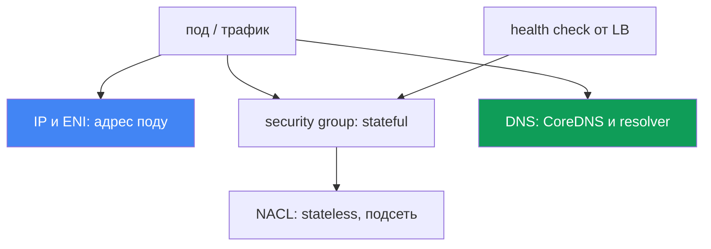
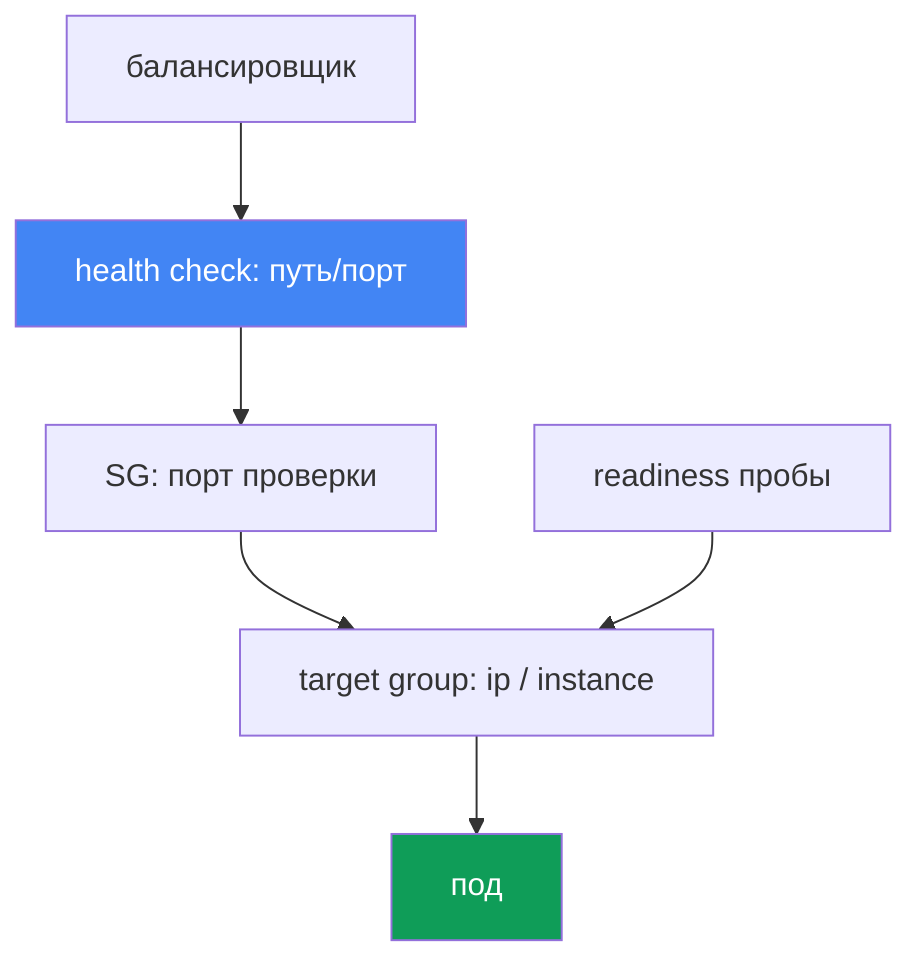

# Глава 46. Сетевые сбои: ENI exhausted, SG и NACL, DNS, unhealthy targets в балансировщике

> **Что дальше.** Глава 45 разбирала, почему нода вообще не присоединилась к кластеру. Здесь -
> сетевые сбои уже в работающем кластере: под не получает IP, связность рвётся, DNS подводит,
> таргеты в балансировщике краснеют. Смежное отдано другим главам: устройство VPC CNI, ENI и IP
> на нодах, prefix delegation - главы 7 и 8, балансировщики NLB и ALB - главы 26 и 27, метрики
> CoreDNS - глава 33, а «нода не присоединилась» - глава 45. Здесь - как по симптому опознать
> класс сетевого сбоя и чем его подтвердить.

## 46.1. Четыре симптома одного класса

Кластер работает, ноды `Ready`, но сеть подводит по-разному. Четыре типичные картины.

**Под висит в `ContainerCreating`.** Он запланирован на ноду, но не стартует:

```bash
kubectl describe pod web-7d9f-abcde
# Events:
#   Warning  FailedCreatePodSandBox  kubelet
#   failed to assign an IP address to container
```

Сообщение `failed to assign an IP address to container` означает, что VPC CNI не выдал поду
адрес: либо на ноде кончились доступные IP, либо кончилась подсеть.

**Связность рвётся.** Под не достукивается до другого пода, до RDS или до внешнего API -
`connection timed out`, хотя DNS резолвится. Это чаще всего правила security group или NACL.

**Таргеты в балансировщике `unhealthy`.** Сервис за NLB или ALB отдаёт 502 или 503, а в target
group таргеты не в состоянии `healthy`:

```bash
aws elbv2 describe-target-health --target-group-arn "$TG_ARN" \
  --query "TargetHealthDescriptions[?TargetHealth.State!='healthy'].[Target.Id,TargetHealth.State,TargetHealth.Reason]"
# [ ["10.0.3.17", "unhealthy", "Target.FailedHealthChecks" ] ]
```

**DNS подводит с перебоями.** Резолвинг то работает, то отваливается по таймауту - плавающая
проблема, которую тяжело поймать.

Ключевая мысль главы: это не одна ошибка, а класс сетевых сбоев на разных уровнях - адресация,
security group, NACL, DNS, health check балансировщика. Симптомы похожи (что-то «не ходит»), а
слои и инструменты разные. Ниже - по слою на раздел, в разделе 46.7 - чеклист и порядок.



## 46.2. Исчерпание IP и ENI

VPC CNI даёт каждому поду реальный IP из подсети VPC (глава 6). Значит, поды конкурируют за
конечный ресурс, и он кончается двумя разными способами.

**Кончились IP на ноде.** Сколько подов помещается на ноду, задаёт не только CPU и память, а
лимит `max-pods`. Он завязан на тип инстанса: число ENI, которое инстанс держит, умноженное
на число IP на каждую ENI. Маленький инстанс держит мало ENI и мало IP - и `max-pods` у
него низкий. Когда свободные IP на ноде исчерпаны, новый под не получает адрес и повисает в
`ContainerCreating` с `failed to assign an IP address to container`.

**Кончилась подсеть.** Даже если на ноде есть место под ENI, адрес берётся из подсети. Мелкая
подсеть (например, `/26`, а под неё ещё Load Balancer и другие потребители) быстро выходит в
subnet IP exhaustion: свободных адресов в подсети нет, ENI не поднимается, поды не получают IP.

Различить помогает, где именно упёрлись:

```bash
# сколько адресов реально выдано и какой предел на ноде
kubectl get pods -o wide --field-selector spec.nodeName=<node> | wc -l
kubectl get node <node> -o jsonpath='{.status.allocatable.pods}'
# свободные IP в подсети
aws ec2 describe-subnets --subnet-ids <subnet> \
  --query 'Subnets[0].AvailableIpAddressCount'
```

Смягчение живёт в главах 7 и 8, здесь - только карта вариантов:

| Приём | Что даёт | Где подробно |
|---|---|---|
| prefix delegation | ENI получает /28-префиксы, а не одиночные IP - резко больше подов на ноду | глава 7 |
| сайзинг подсетей | крупные подсети под поды, чтобы не упереться в subnet exhaustion | глава 6 |
| secondary CIDR | добавить адресное пространство в VPC под поды | глава 7 |
| `WARM_ENI_TARGET` / `WARM_IP_TARGET` | сколько IP держать «про запас», баланс скорости и расхода | глава 8 |

Prefix delegation - самый действенный рычаг: вместо одиночных вторичных IP на ENI выдаются
префиксы, и `max-pods` на ноде растёт в разы. Настройка и совместимость - в главе 7.

## 46.3. Security groups: stateful-фильтр на уровне ENI

Security group (SG) - это firewall на уровне ENI, и он **stateful**: если исходящее соединение
разрешено, обратный трафик проходит сам, отдельное входящее правило под ответ не нужно.
Это ключевое отличие от NACL из следующего раздела.

В EKS в игре несколько SG, и путаница между ними - частый корень «не ходит»:

- **cluster security group** - создаётся EKS, через неё идёт трафик между control plane и
  нодами, а по умолчанию и между самими нодами.
- **SG нод** - привязана к ENI инстансов node group (через launch template, глава 10).
- **security groups for pods** - отдельная SG на уровне конкретного пода. Задаётся ресурсом
  `SecurityGroupPolicy`, который по селектору привязывает список SG к подам; VPC CNI выделяет
  таким подам собственную branch ENI с этими SG. Важно: политика применяется только к вновь
  запланированным подам, уже запущенные не меняются.

Типичные сбои связности, где виновата SG:

- **под-под между разными SG.** Если поды получают SG через `SecurityGroupPolicy`, а правила не
  разрешают взаимный трафик, соединение молча висит до таймаута.
- **под-RDS.** У SG базы нет inbound-правила, разрешающего трафик от SG нод или подов на порт
  БД. Лечится SG-референсом: в правило RDS добавляют не CIDR, а id разрешённой SG.
- **под-внешний сервис.** Egress-правило SG не выпускает трафик на нужный порт.

SG-референс (правило ссылается на другую SG, а не на диапазон адресов) - надёжный стиль:
он не ломается при смене адресов и переживает пересоздание инстансов.

```bash
# какие SG на ENI ноды или пода
aws ec2 describe-network-interfaces \
  --filters "Name=private-ip-address,Values=10.0.3.17" \
  --query 'NetworkInterfaces[0].Groups'
```

### Своя SG у пода: что ломается молча

Микросегментацию включили, SG для пода описали, доступ к БД разрешили, под запустился - и он не
резолвит имена, не проходит readiness или не ходит наружу. Причина одна: к поду с branch ENI
применяются ТОЛЬКО его SG, правила SG ноды не действуют. Документированный минимум для SG пода:

| Что открыть в SG пода | Зачем и что ломается без этого |
|---|---|
| существующий id SG | при неверном id под навсегда застревает на создании, а в `describe pod` виден `InvalidSecurityGroupID.NotFound` при вызове `CreateNetworkInterface` - первый признак опечатки |
| вход от SG нод на портах проб | пробы шлёт `kubelet`; иначе readiness и liveness не проходят и под не попадает в endpoints (раздел 46.6). Самая частая причина |
| исходящий 53 по TCP и UDP | обе транспорта, к SG подов CoreDNS или SG нод, где он работает; своей SG у CoreDNS обычно нет, на практике это SG нод или cluster security group |
| вход 53 по TCP и UDP в SG CoreDNS | обратное правило обязательно: одного egress у пода мало, это половина настройки |
| правила к нужным подам | без них трафик к тем, с кем поду надо общаться, молча висит до таймаута |
| control plane | правила требуются, когда SG используется с Fargate; простейший путь - указать cluster security group одной из SG пода. Для подов на EC2-нодах такого требования в списке нет: нужен Kubernetes API - исходящий 443 на общих основаниях |

Ловушка «работает через раз»: правила SG пода не применяются к трафику между подами и между
подом и сервисами на той же ноде, включая `kubelet` и `nodeLocalDNS`, а поды с разными SG на
одной ноде не общаются вовсе - они в разных подсетях, маршрутизация между ними отключена.
Симптом мерцает от того, куда попал под и где CoreDNS: «иногда работает» тут не оправдание SG.
Режим применения решает, чью SG вы отлаживаете. По умолчанию
`POD_SECURITY_GROUP_ENFORCING_MODE=strict`: source NAT для исходящего трафика таких подов
отключён, наружу под выйдет только с ноды в приватной подсети с NAT, из публичной подсети
интернета у него нет. При `standard` трафик за пределы VPC идёт с адреса primary ENI инстанса и
попадает под правила SG ноды. Для проб через branch ENI нужен `DISABLE_TCP_EARLY_DEMUX=true` в
init-контейнере `aws-node`; при VPC CNI 1.11.0 или новее с режимом `standard` не требуется.

```bash
# режим применения SG для подов и настройки branch ENI, затем поиск ошибки в id SG
kubectl describe daemonset aws-node -n kube-system | grep -iE 'SECURITY_GROUP|DEMUX'
kubectl describe pod <pod> | grep -i InvalidSecurityGroupID
```

## 46.4. NACL: stateless-фильтр на уровне подсети

Network ACL (NACL) действует на уровне подсети и, в отличие от SG, **stateless**: правила для
входящего и исходящего трафика полностью независимы. Разрешить запрос мало - нужно отдельно
разрешить и ответ.

Отсюда классическая ловушка. Соединение уходит из подсети с некоторого порта на удалённый порт,
а ответ приходит обратно на **ephemeral-порт** - временный порт из высокого диапазона, который
клиент выбрал для этого соединения. Если исходящее (или входящее для ответов) правило NACL не
разрешает диапазон ephemeral ports, ответы режутся, и соединение зависает, хотя запрос ушёл.
Практически это значит: на NACL нужно разрешить обратный трафик на ephemeral ports
(диапазон `1024-65535`), иначе TCP-сессии не закрываются.

| Свойство | Security group | NACL |
|---|---|---|
| Уровень | ENI (нода, под) | подсеть |
| Состояние | stateful, ответ разрешён автоматически | stateless, ответ разрешают отдельно |
| Правила | только allow | allow и deny, с приоритетом по номеру |
| ephemeral ports | учитываются автоматически | нужно разрешить вручную |

По умолчанию NACL разрешает весь трафик, поэтому в большинстве кластеров он ни при чём. Но если
команда безопасности навесила на подсети кастомные NACL, они становятся подозреваемым при
обрывах, которые «не объясняются» правилами SG. Разделять просто: SG не бьёт по ephemeral -
если проблема именно в обратном трафике, копайте NACL.

## 46.5. DNS-сбои: перемежающиеся таймауты

Самый коварный класс: резолвинг то работает, то отваливается. Причин несколько, и они
накладываются.

**CoreDNS перегружен или недоступен.** Поды CoreDNS не справляются с потоком запросов или их
слишком мало на кластер. Симптом - рост латентности и таймаутов резолвинга под нагрузкой. EKS
поддерживает автоскейлинг CoreDNS; метрики CoreDNS для диагностики разбирает глава 33.

**Эффект `ndots:5`.** Kubernetes прописывает подам `ndots:5` и список search-доменов. Имя без
пяти точек (а таких почти все, например `api.example.com`) сначала пробуется со всеми
search-доменами и только потом как есть. Один внешний запрос превращается в несколько лишних, и
нагрузка на DNS умножается. Для «горячих» внешних имён помогает FQDN с точкой на конце
(`api.example.com.`), который отключает перебор search-доменов.

**conntrack table full.** Каждое соединение (в том числе UDP-запрос к DNS) занимает запись в
таблице conntrack ядра ноды. При переполнении новые соединения дропаются, а DNS по UDP страдает
первым - отсюда плавающие таймауты. Смотрят использование `nf_conntrack` на ноде.

**Троттлинг DNS на уровне ENI.** У каждой ENI есть жёсткий лимит packets per second к VPC
resolver (Route 53 Resolver). Когда все поды ноды шлют DNS через одну ENI и упираются в него,
часть пакетов отбрасывается - и снова плавающие таймауты, не привязанные к конкретному имени.

**Смягчение - NodeLocal DNSCache.** Локальный кэширующий DNS-агент на ноде отвечает подам из
кэша и держит TCP-соединение к CoreDNS. Это снимает UDP-нагрузку и per-ENI троттлинг и
стабилизирует хвост латентности.

```bash
# работает ли резолвинг из отладочного пода
kubectl run dnstest --image=busybox:1.36 --rm -it --restart=Never -- \
  nslookup kubernetes.default.svc.cluster.local
# состояние подов CoreDNS
kubectl -n kube-system get pods -l k8s-app=kube-dns -o wide
```

## 46.6. Unhealthy targets в балансировщике

Сервис за NLB или ALB отдаёт 502 или 503, потому что балансировщик не видит здоровых таргетов
(главы 26 и 27). Балансировщик шлёт health check на таргеты; провал - и таргет выводится из
ротации. Разбираемся по причинам.

- **Неверный health check.** Путь, порт или протокол проверки не совпадают с тем, что реально
  слушает приложение. ALB по умолчанию проверяет `/`, а приложение отвечает `200` только на
  `/healthz` - таргет `unhealthy`, хотя под жив.
- **SG не пускает health check.** SG таргета (ноды при target-type `instance` или пода при
  target-type `ip`) не разрешает входящий трафик от SG балансировщика на порт проверки. Она
  не доходит - таргет краснеет.
- **Несоответствие target-type и портов.** При target-type `ip` таргет - это IP пода и его
  `containerPort`; при `instance` - нода и `NodePort`. Ошибка в типе или порту target group
  ведёт к проверке не туда.
- **Не готов readiness пробы пода.** Пока readiness не прошла, под не попадает в endpoints и в
  target group либо `unhealthy`. Балансировщик честно отражает состояние приложения.

Симптом на клиенте: 502 (`Bad gateway`) обычно значит, что таргет ответил некорректно или
соединение оборвалось, а 503 (`Service unavailable`) - что здоровых таргетов нет вовсе.
Диагностика идёт от target group к поду:

```bash
# состояние и причины по таргетам
aws elbv2 describe-target-health --target-group-arn "$TG_ARN" \
  --query 'TargetHealthDescriptions[].[Target.Id,TargetHealth.State,TargetHealth.Reason]'
# есть ли готовые endpoints за сервисом
kubectl get endpointslices -l kubernetes.io/service-name=<svc>
```

Путь health check показывает, где он рвётся, а readiness решает, попадёт ли под в target group.



## 46.7. Порядок диагностики и инструменты

Сеть чинят не наугад, а от симптома к слою. Опорный набор инструментов:

```bash
# 1. события пода: причина ContainerCreating и выдачи IP
kubectl describe pod <pod>
# 2. где под и на какой ноде
kubectl get pods -o wide
# 3. ENI, IP и SG на конкретном адресе
aws ec2 describe-network-interfaces \
  --filters "Name=private-ip-address,Values=<ip>" --query 'NetworkInterfaces[0]'
# 4. свободные адреса в подсети
aws ec2 describe-subnets --subnet-ids <subnet> \
  --query 'Subnets[0].AvailableIpAddressCount'
# 5. здоровье таргетов балансировщика
aws elbv2 describe-target-health --target-group-arn "$TG_ARN"
# 6. проверка резолвинга из пода
kubectl run dnstest --image=busybox:1.36 --rm -it --restart=Never -- nslookup <name>
# 7. на ноде: собрать дамп сети VPC CNI (логи ipamd/plugin, ENI, eni-configs)
aws ssm send-command --document-name "AWS-RunShellScript" --instance-ids <instance-id> \
  --parameters 'commands=["/opt/cni/bin/aws-cni-support.sh"]'
```

Отдельный инструмент для «молчаливых» обрывов - **VPC Flow Logs**: они пишут, ACCEPT или REJECT
получил пакет на уровне ENI или подсети. `REJECT` в flow logs прямо указывает на SG или NACL, а
отсутствие ответных пакетов при ушедшем запросе - на stateless NACL и ephemeral ports.

Когда под висит с `failed to assign an IP address`, а неясно, кончились ли IP или ENI не
поднялась, спускаются на ноду. VPC CNI держит логи в `/var/log/aws-routed-eni` (`ipamd.log`,
`plugin.log`), а скрипт `/opt/cni/bin/aws-cni-support.sh` собирает их вместе с состоянием
ENI/IP и конфигурацией в архив `/var/log/eks_<instance-id>_<...>.tar.gz`. Запускают его на
ноде через SSM, без SSH. Состояние ipamd видно и напрямую:
`curl http://localhost:61679/v1/enis` показывает выданные ENI и IP, `/v1/pods` - привязку
адресов к подам.

Чеклист «симптом - вероятная причина - что проверить»:

| Симптом | Вероятная причина | Что проверить |
|---|---|---|
| `failed to assign an IP address` | нет свободных IP на ноде или в подсети | `describe pod`, `AvailableIpAddressCount` |
| под-под или под-RDS timeout | SG не разрешает трафик | `describe-network-interfaces` Groups, SG RDS |
| обрыв, но запрос уходит | NACL режет ephemeral ports | NACL правила in/out, VPC Flow Logs |
| DNS с перемежающимися таймаутами | CoreDNS, conntrack, per-ENI троттлинг | метрики CoreDNS (глава 33), conntrack, PPS |
| лишняя DNS-нагрузка на внешние имена | эффект `ndots:5` | search-домены, FQDN с точкой |
| 502 или 503 от сервиса за LB | таргеты `unhealthy` | `describe-target-health`, health check, SG |
| таргеты `unhealthy`, под жив | health check путь/порт или SG | путь и порт проверки, SG балансировщика |
| под без DNS и без readiness | своя SG у пода вместо SG ноды | `SecurityGroupPolicy` у пода, 53 TCP/UDP, вход от SG нод |

Логика: сначала классифицировать симптом (нет IP / обрыв связности / DNS / 5xx от LB), затем
идти в свой слой. `describe pod` и `get pods -o wide` дёшевы и первыми отсекают IP-проблемы;
`describe-target-health` мгновенно локализует сбой балансировщика; VPC Flow Logs - последний
рубеж для обрывов, которые не объясняются ни IP, ни health check.

## 46.8. Как это применяют в продакшене

- **Классифицируют симптом до диагностики.** Нет IP, обрыв связности, DNS-таймауты, 5xx от LB -
  это четыре разных слоя. Сначала определяют класс, потом лезут в инструмент, а не наоборот.
- **Планируют адресный план заранее.** Крупные подсети под поды и prefix delegation (глава 7)
  закрывают исчерпание IP до того, как оно случится в пике трафика.
- **Пользуются SG-референсами, а не CIDR.** Правила со ссылкой на SG нод или подов переживают
  пересоздание инстансов и смену адресов, меньше «внезапных» обрывов до RDS.
- **Ставят NodeLocal DNSCache на нагруженные кластеры.** Локальный кэш снимает per-ENI
  троттлинг и переполнение conntrack по DNS, убирая неуловимый класс инцидентов.
- **Держат health check в манифесте осознанно.** Путь, порт и протокол проверки согласованы с
  readiness пробой и портами таргета, чтобы `unhealthy` означал реальную проблему, не опечатку.
- **Включают VPC Flow Logs на прод-подсетях.** Когда трафик «молча» пропадает, `REJECT` в логах
  экономит часы гаданий между SG и NACL.

## 46.9. Мини-глоссарий

- **`failed to assign an IP address to container`** - VPC CNI не смог выдать поду IP: кончились
  адреса на ноде или в подсети.
- **`max-pods`** - предел подов на ноду, завязан на число ENI и IP на ENI у типа инстанса.
- **subnet IP exhaustion** - в подсети не осталось свободных адресов под ENI и поды.
- **prefix delegation** - выдача ENI /28-префиксов вместо одиночных IP, больше подов на ноду
  (глава 7).
- **security group** - stateful-firewall на уровне ENI; ответ на разрешённый запрос идёт сам.
- **`SecurityGroupPolicy`** - ресурс, привязывающий SG к подам по селектору (security groups
  for pods); под с branch ENI перестаёт наследовать правила SG ноды.
- **`POD_SECURITY_GROUP_ENFORCING_MODE`** - `strict` без source NAT против `standard`, где за
  VPC трафик идёт с primary ENI под правилами SG ноды.
- **NACL** - stateless-фильтр на уровне подсети; входящие и исходящие правила независимы.
- **ephemeral ports** - высокий диапазон `1024-65535`, куда идёт обратный трафик; на NACL его
  разрешают вручную.
- **`ndots:5`** - настройка resolv.conf подов, из-за которой имена перебирают search-домены.
- **conntrack** - таблица соединений ядра ноды; при переполнении дропаются новые соединения.
- **NodeLocal DNSCache** - локальный кэширующий DNS на ноде, снимает нагрузку с CoreDNS и
  per-ENI троттлинг.
- **`describe-target-health`** - команда, показывающая состояние и причину для таргетов target
  group.

## 46.10. Итоги главы

- Сетевые сбои в работающем кластере - это класс отказов на разных слоях: IP и ENI, security
  group, NACL, DNS, health check балансировщика. Симптомы похожи, слои и инструменты разные.
- `failed to assign an IP address to container` - это исчерпание IP: либо `max-pods` на ноде,
  либо subnet IP exhaustion. Смягчают prefix delegation и сайзингом подсетей (главы 7 и 8).
- Security group - stateful и работает на уровне ENI; обрывы под-под, под-RDS и egress - чаще
  всего правила SG. SG-референсы надёжнее CIDR.
- Своя SG у пода отменяет правила SG ноды, поэтому в неё вручную вписывают 53 по TCP и UDP в
  обе стороны и вход от SG нод на порты проб, иначе под молча теряет DNS и readiness.
- NACL - stateless и на уровне подсети; классическая ловушка - не разрешён обратный трафик на
  ephemeral ports. По умолчанию NACL всё пропускает, подозревают его при кастомных правилах.
- DNS-таймауты плавающие: причины - перегруз CoreDNS, эффект `ndots:5`, переполнение conntrack,
  per-ENI троттлинг к resolver. Смягчение - NodeLocal DNSCache и автоскейлинг CoreDNS.
- Unhealthy targets в NLB и ALB дают 502 и 503: неверный health check, SG не пускает проверку,
  несоответствие target-type и портов, readiness пода. Диагностика - `describe-target-health`.
- Порядок: классифицировать симптом, затем инструмент своего слоя - `describe pod`,
  `describe-network-interfaces`, `describe-target-health`, `nslookup` из пода, VPC Flow Logs.

## 46.11. Как это пригодится в реальной работе

На дежурстве сетевой инцидент выглядит как «что-то не ходит», и соблазн - хвататься за первый
инструмент. Выигрывает тот, кто сначала называет класс: под без IP, обрыв связности, плавающий
DNS или 5xx от балансировщика. Класс сразу задаёт слой и команду. Под в `ContainerCreating` -
это `describe pod` и счёт свободных IP, не tcpdump. 503 - это `describe-target-health`, а не
рестарт подов. Правильная классификация экономит те минуты, когда сервис лежит.

При планировании те же слои превращаются в профилактику: крупные подсети и prefix delegation
снимают исчерпание IP до пика, SG-референсы и осознанные health check убирают целые классы
обрывов, NodeLocal DNSCache гасит DNS-троттлинг на ENI, а VPC Flow Logs превращают «молчаливый»
обрыв в `REJECT`. Умение отличить stateful SG от stateless NACL и знать, где кончаются IP,
бережёт часы: оно ведёт сразу в нужный слой.

## 46.12. Вопросы для самопроверки

1. Почему сетевые сбои в кластере - это класс отказов, а не одна ошибка? Назовите слои.
2. Что означает `failed to assign an IP address to container` и какие две причины за ним стоят?
3. От чего зависит `max-pods` на ноде и как prefix delegation меняет картину (глава 7)?
4. Чем отличается исчерпание IP на ноде от subnet IP exhaustion и как проверить каждое?
5. Почему security group называют stateful и как это упрощает правила по сравнению с NACL?
6. Какие SG участвуют в EKS и что делает `SecurityGroupPolicy` (security groups for pods)?
7. Что перестаёт работать у пода, получившего свою SG, и какие правила в неё дописывают руками?
8. Почему под не достукивается до RDS даже при верном DNS и что такое SG-референс?
9. В чём ловушка NACL с ephemeral ports и почему её не бывает у security group?
10. Назовите причины плавающих DNS-таймаутов: при чём тут `ndots:5`, conntrack и per-ENI лимит.
11. Как NodeLocal DNSCache смягчает DNS-сбои и какую нагрузку он снимает?
12. Почему таргеты в балансировщике `unhealthy` и что показывает `describe-target-health`?
13. Чем 502 отличается от 503 в ответе балансировщика по смыслу для диагностики?
14. Когда в диагностике сетевого обрыва стоит доставать VPC Flow Logs и что там искать?

## Практика

К этой теме идут две лабы курса. [Лаба 120 - сетевые сбои и unhealthy
targets](../../labs/120/README_RU.MD): вы ставите AWS Load Balancer Controller, получаете
NLB с собственной security group без inbound-правил, ловите симптом
`Target.FailedHealthChecks`, доказываете причину и починяете доступ. Запуск -
`TASK=120 make run_eks_task`.

[Лаба 126 - security groups for pods](../../labs/126/README_RU.MD) разбирает тот же слой с
другой стороны: под получает собственную branch ENI, правила ноды на него больше не
действуют, и вы ловите `Running`, но не `Ready`, находите отсутствующее правило для пробы
`kubelet`, разбираетесь, почему DNS лечится правилом на стороне CoreDNS, а не egress пода,
и проверяете, как поведение меняется между режимами `strict` и `standard`. Запуск -
`TASK=126 make run_eks_task`. Проверка в обеих лабах - командой `check_result`.

Помимо лабы, эта глава - диагностический runbook. Все проверки безопасно прогнать на
здоровом кластере, чтобы знать, как выглядит норма, и быстрее опознать отклонение.

Сначала посмотрите на адресацию подов и подсетей:

```bash
# сколько подов на ноде и каков предел
kubectl get pods -A -o wide --field-selector spec.nodeName=<node>
kubectl get node <node> -o jsonpath='{.status.allocatable.pods}'
# свободные адреса в подсети нод: в норме запас большой
aws ec2 describe-subnets --subnet-ids <subnet> \
  --query 'Subnets[0].AvailableIpAddressCount'
```

Затем разберитесь, какие SG навешены на ENI рабочего пода, и проверьте резолвинг изнутри:

```bash
# ENI и его security groups по IP пода
aws ec2 describe-network-interfaces \
  --filters "Name=private-ip-address,Values=<ip-пода>" \
  --query 'NetworkInterfaces[0].[NetworkInterfaceId,Groups]'
# DNS из отладочного пода: и внутреннее, и внешнее имя
kubectl run dnstest --image=busybox:1.36 --rm -it --restart=Never -- \
  sh -c 'nslookup kubernetes.default; nslookup example.com'
```

Если в кластере есть сервис за балансировщиком, посмотрите здоровье таргетов и сверьте с
readiness подов:

```bash
# состояние таргетов: в норме все healthy
aws elbv2 describe-target-health --target-group-arn "$TG_ARN" \
  --query 'TargetHealthDescriptions[].[Target.Id,TargetHealth.State]' --output table
# готовые endpoints за сервисом
kubectl get endpointslices -l kubernetes.io/service-name=<svc>
```

В завершение включите VPC Flow Logs на подсети нод и посмотрите формат записей: столбец action
со значением `ACCEPT` или `REJECT` - это то, что вы ищете при разборе «молчаливого» обрыва.
Сверьте картину с чеклистом из раздела 46.7: на здоровом кластере IP в запасе, SG на ENI
ожидаемые, DNS резолвит внутренние и внешние имена, а таргеты `healthy`. Запомнив норму, вы
быстрее локализуете слой, когда сеть подведёт.

---
[Оглавление](../README_RU.md) · [Глава 45](../45/ru.md) · [Глава 47](../47/ru.md)
