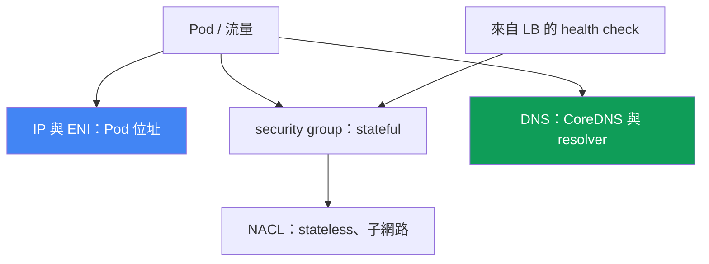
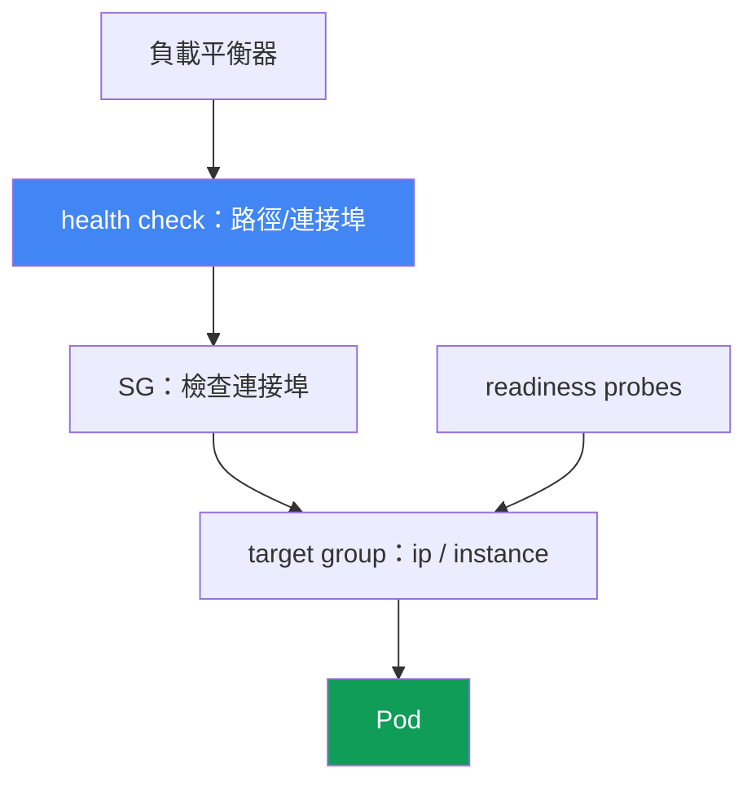

[Русская версия](ru.md) · [Eng version](en.md) · [Versión en español](es.md) · [Version française](fr.md) · [Deutsche Version](de.md) · [ქართული ვერსია](ge.md) · [日本語版](jp.md)
# 第 46 章。網路故障：ENI 耗盡、SG 與 NACL、DNS、負載平衡器中的 unhealthy targets

> **接下來。** 第 45 章說明為什麼節點根本沒有加入叢集。本章討論已在運作叢集中的網路故障：Pod 取不到 IP、連通性中斷、DNS 失效，或負載平衡器 target 變紅。相鄰主題交由其他章節處理：VPC CNI、ENI 及節點 IP 的運作機制見第 7 與第 8 章，NLB 與 ALB 負載平衡器見第 26 與第 27 章，CoreDNS 指標見第 33 章，而「節點未加入」見第 45 章。本章說明如何從症狀辨認網路故障的類別，以及如何加以確認。

## 46.1. 同一類別的四種症狀

叢集在運作、節點為 `Ready`，但網路可能以不同方式出問題。以下是四種典型情況。

**Pod 卡在 `ContainerCreating`。** 它已排程到節點上，卻無法啟動：

```bash
kubectl describe pod web-7d9f-abcde
# Events:
#   Warning  FailedCreatePodSandBox  kubelet
#   failed to assign an IP address to container
```

訊息 `failed to assign an IP address to container` 表示 VPC CNI 未能為 Pod 配發位址：可能是節點上的可用 IP 已耗盡，也可能是子網路已用盡。

**連通性中斷。** Pod 無法連到另一個 Pod、RDS 或外部 API，出現 `connection timed out`，但 DNS 可以解析。這通常是 security group 或 NACL 規則所致。

**負載平衡器中的 target 為 `unhealthy`。** NLB 或 ALB 後方的服務回傳 502 或 503，而 target group 中的 target 並非 `healthy`：

```bash
aws elbv2 describe-target-health --target-group-arn "$TG_ARN" \
  --query "TargetHealthDescriptions[?TargetHealth.State!='healthy'].[Target.Id,TargetHealth.State,TargetHealth.Reason]"
# [ ["10.0.3.17", "unhealthy", "Target.FailedHealthChecks" ] ]
```

**DNS 間歇性失效。** 解析有時正常、有時因逾時失敗，這是難以捕捉的飄忽問題。

本章的關鍵概念是：這不是單一錯誤，而是不同層次的網路故障類別，包括定址、security group、NACL、DNS、負載平衡器 health check。症狀相似（某些東西「無法連線」），但層次與工具不同。下文每個層次各有一節，第 46.7 節則提供檢查清單與順序。



## 46.2. IP 與 ENI 耗盡

VPC CNI 為每個 Pod 從 VPC 子網路提供真實 IP（第 6 章）。因此 Pod 會競爭有限資源，且資源會以兩種不同方式耗盡。

**節點上的 IP 已耗盡。** 一個節點可容納多少 Pod 不僅由 CPU 與記憶體決定，也由 `max-pods` 限制決定。它取決於 instance type：執行個體可持有的 ENI 數量，乘以每個 ENI 的 IP 數量。小型執行個體可持有的 ENI 與 IP 都較少，因此其 `max-pods` 較低。節點上的可用 IP 用盡時，新 Pod 無法取得位址，會以 `failed to assign an IP address to container` 卡在 `ContainerCreating`。

**子網路已耗盡。** 即使節點尚有 ENI 空間，位址仍取自子網路。小型子網路（例如 `/26`，而且還有 Load Balancer 與其他使用者）很快就會發生 subnet IP exhaustion：子網路中沒有可用位址，ENI 無法建立，Pod 也無法取得 IP。

可以透過卡在哪個位置加以區分：

```bash
# 實際已配發多少位址，以及節點的上限
kubectl get pods -o wide --field-selector spec.nodeName=<node> | wc -l
kubectl get node <node> -o jsonpath='{.status.allocatable.pods}'
# 子網路中的可用 IP
aws ec2 describe-subnets --subnet-ids <subnet> \
  --query 'Subnets[0].AvailableIpAddressCount'
```

緩解措施詳見第 7 與第 8 章，此處僅列出選項：

| 作法 | 效果 | 詳細位置 |
|---|---|---|
| prefix delegation | ENI 取得 /28 prefix 而非單一 IP，每個節點的 Pod 數大幅增加 | 第 7 章 |
| 子網路 sizing | 為 Pod 使用較大的子網路，避免撞上 subnet exhaustion | 第 6 章 |
| secondary CIDR | 為 VPC 新增供 Pod 使用的位址空間 | 第 7 章 |
| `WARM_ENI_TARGET` / `WARM_IP_TARGET` | 要保留多少備用 IP，在速度與消耗之間取得平衡 | 第 8 章 |

Prefix delegation 是最有效的槓桿：ENI 不再配發單一 secondary IP，而是配發 prefix，因此節點的 `max-pods` 可增加數倍。設定方式與相容性見第 7 章。

## 46.3. Security groups：ENI 層級的 stateful 篩選器

Security group（SG）是 ENI 層級的 firewall，且為 **stateful**：只要允許輸出連線，回應流量會自動通過，不需要為回應另建輸入規則。這是它與下一節 NACL 的關鍵差異。

EKS 中會涉及多個 SG，混淆它們是「無法連線」的常見根因：

- **cluster security group**：由 EKS 建立，control plane 與節點之間的流量會通過它，預設也承載節點彼此之間的流量。
- **節點 SG**：附加到 node group 執行個體的 ENI（透過 launch template，第 10 章）。
- **security groups for pods**：特定 Pod 層級的獨立 SG。它由 `SecurityGroupPolicy` 資源指定，該資源會依 selector 將 SG 清單附加至 Pod；VPC CNI 為這類 Pod 配發帶有這些 SG 的專屬 branch ENI。重要的是，此 policy 僅會套用到新排程的 Pod，已運作的 Pod 不會改變。

SG 導致連通性問題的典型情形：

- **不同 SG 的 Pod 對 Pod。** 若 Pod 透過 `SecurityGroupPolicy` 取得 SG，而規則未允許相互流量，連線會悄悄卡到逾時。
- **Pod 對 RDS。** 資料庫 SG 沒有允許節點或 Pod SG 流量進入資料庫連接埠的 inbound 規則。可透過 SG reference 修復：將允許 SG 的 id 加入 RDS 規則，而非 CIDR。
- **Pod 對外部服務。** SG 的 egress 規則不允許流量前往所需連接埠。

SG reference（規則參照另一個 SG，而非位址範圍）是可靠的作法：它不會因位址變更而失效，也能在執行個體重建後繼續運作。

```bash
# 節點或 Pod ENI 上有哪些 SG
aws ec2 describe-network-interfaces \
  --filters "Name=private-ip-address,Values=10.0.3.17" \
  --query 'NetworkInterfaces[0].Groups'
```

### Pod 自有 SG：哪些東西會悄悄失效

已啟用微分段、已描述 Pod SG、也已允許資料庫存取，Pod 啟動了，卻無法解析名稱、無法通過 readiness 或無法向外連線。原因相同：具有 branch ENI 的 Pod **只會**套用自己的 SG，節點 SG 規則不會生效。Pod SG 的文件化最低需求如下：

| 要在 Pod SG 中開放的項目 | 原因，以及缺少時會壞掉什麼 |
|---|---|
| 既有的 SG id | id 錯誤時，Pod 會永遠卡在建立中；`describe pod` 會在 `CreateNetworkInterface` 呼叫中顯示 `InvalidSecurityGroupID.NotFound`，這是第一個拼字錯誤跡象 |
| 從節點 SG 到 probe ports 的輸入 | probe 由 `kubelet` 發出；否則 readiness 與 liveness 無法通過，Pod 不會進入 endpoints（第 46.6 節）。這是最常見的原因 |
| TCP 與 UDP 的輸出 53 | 兩種 transport 都需開放，目的地為 CoreDNS Pod SG，或 CoreDNS 運作所在的節點 SG；CoreDNS 通常沒有自己的 SG，實務上是節點 SG 或 cluster security group |
| 到 CoreDNS SG 的 TCP 與 UDP 輸入 53 | 回程規則是必要的：只為 Pod 設定 egress 不足，這只完成了一半 |
| 通往所需 Pod 的規則 | 缺少後，Pod 必須通訊的對象會悄悄逾時 |
| control plane | SG 與 Fargate 搭配使用時需要此規則；最簡單方式是將 cluster security group 指定為 Pod 的其中一個 SG。EC2 節點上的 Pod 不在此清單中：在一般情況下，Kubernetes API 需要輸出 443 |

「有時可以運作」的陷阱是：Pod SG 規則不會套用於同一節點上的 Pod 間流量及 Pod 與服務間流量，包括 `kubelet` 與 `nodeLocalDNS`；同一節點上具有不同 SG 的 Pod 完全無法互通，因為它們位於不同子網路且彼此路由已停用。症狀會隨 Pod 和 CoreDNS 的落點閃爍：「有時可用」不是 SG 的藉口。套用模式決定你正在偵錯哪個 SG。預設值是 `POD_SECURITY_GROUP_ENFORCING_MODE=strict`：這類 Pod 的輸出流量不做 source NAT，Pod 只有在具備 NAT 的私有子網路節點上才能對外連線，公有子網路無法讓它上網。使用 `standard` 時，VPC 外部流量採用執行個體 primary ENI 的位址，並受到節點 SG 規則限制。若 probe 經由 branch ENI，`aws-node` init container 需要 `DISABLE_TCP_EARLY_DEMUX=true`；VPC CNI 1.11.0 或更新版本搭配 `standard` 模式時則不需要。

```bash
# Pod SG 套用模式與 branch ENI 設定，接著尋找 SG id 錯誤
kubectl describe daemonset aws-node -n kube-system | grep -iE 'SECURITY_GROUP|DEMUX'
kubectl describe pod <pod> | grep -i InvalidSecurityGroupID
```

## 46.4. NACL：子網路層級的 stateless 篩選器

Network ACL（NACL）作用於子網路層級，與 SG 不同，它是 **stateless**：輸入與輸出流量規則完全獨立。允許請求並不夠，還必須分別允許回應。

這造成經典陷阱。連線從子網路的某個連接埠前往遠端連接埠，回應則返回至 **ephemeral port**，即用戶端為該連線選取的高位暫時連接埠。如果 NACL 的輸出規則（或回應的輸入規則）不允許 ephemeral ports 範圍，回應會被切斷，連線便會卡住，即使請求已送出。實際上，NACL 必須允許回程流量使用 ephemeral ports（範圍 `1024-65535`），否則 TCP session 無法完成。

| 屬性 | Security group | NACL |
|---|---|---|
| 層級 | ENI（節點、Pod） | 子網路 |
| 狀態 | stateful，回應自動允許 | stateless，必須分別允許回應 |
| 規則 | 僅 allow | allow 與 deny，依編號優先順序 |
| ephemeral ports | 自動納入考量 | 必須手動允許 |

NACL 預設允許所有流量，因此多數叢集與它無關。但若安全團隊已為子網路套用自訂 NACL，當連線中斷無法由 SG 規則解釋時，它就會成為嫌疑。區分很簡單：SG 不會在 ephemeral port 上出錯；若問題正是回程流量，請查 NACL。

## 46.5. DNS 故障：間歇性逾時

這是最棘手的一類：解析有時成功、有時失敗。原因不只一個，且可能相互疊加。

**CoreDNS 過載或不可用。** CoreDNS Pod 無法處理查詢流量，或叢集內的數量不足。症狀是負載下的解析延遲與逾時增加。EKS 支援 CoreDNS 自動擴展；第 33 章說明用於診斷的 CoreDNS 指標。

**`ndots:5` 效應。** Kubernetes 為 Pod 設定 `ndots:5` 及 search domain 清單。少於五個點的名稱（幾乎全都如此，例如 `api.example.com`）會先與每個 search domain 嘗試組合，最後才直接查詢。一次外部查詢會變成數次額外查詢，DNS 負載因而倍增。對「熱門」外部名稱，使用末尾帶點的 FQDN（`api.example.com.`）可停用 search domain 逐一嘗試。

**conntrack table full。** 每個連線（包括 DNS 的 UDP 查詢）都會佔用節點 kernel conntrack table 的一筆記錄。滿載時新連線會被丟棄，而 UDP DNS 最先受害，因此出現飄忽的逾時。可在節點上查看 `nf_conntrack` 使用量。

**ENI 層級的 DNS throttling。** 每個 ENI 對 VPC resolver（Route 53 Resolver）都有嚴格的 packets per second 限制。當節點上所有 Pod 都透過同一 ENI 發送 DNS，並撞上該限制時，部分封包會被丟棄，再次造成與特定名稱無關的間歇性逾時。

**緩解措施是 NodeLocal DNSCache。** 節點上的本地快取 DNS agent 從快取回覆 Pod，並保留至 CoreDNS 的 TCP 連線。它可減少 UDP 負載與 per-ENI throttling，並穩定 latency tail。

```bash
# 從偵錯 Pod 驗證解析是否運作
kubectl run dnstest --image=busybox:1.36 --rm -it --restart=Never -- \
  nslookup kubernetes.default.svc.cluster.local
# CoreDNS Pod 狀態
kubectl -n kube-system get pods -l k8s-app=kube-dns -o wide
```

## 46.6. 負載平衡器中的 unhealthy targets

NLB 或 ALB 後方的服務會回傳 502 或 503，因為負載平衡器看不到健康 target（第 26 與第 27 章）。負載平衡器對 target 發出 health check；失敗後，target 便會退出輪轉。依原因逐一處理。

- **錯誤的 health check。** 檢查的路徑、連接埠或 protocol 與應用程式實際監聽的內容不符。ALB 預設檢查 `/`，但應用程式只在 `/healthz` 回覆 `200`，即使 Pod 存活，target 仍會是 `unhealthy`。
- **SG 不允許 health check。** target 的 SG（target-type `instance` 時是節點 SG，target-type `ip` 時是 Pod SG）未允許來自負載平衡器 SG、前往檢查連接埠的輸入流量。檢查無法抵達，target 便會變紅。
- **target-type 與連接埠不符。** target-type `ip` 時，target 是 Pod IP 與其 `containerPort`；`instance` 時則是節點與 `NodePort`。target group 的類型或連接埠設定錯誤，會讓檢查送到錯誤位置。
- **Pod readiness probe 尚未通過。** readiness 未通過前，Pod 不會進入 endpoints，且在 target group 中會是 `unhealthy`。負載平衡器如實反映應用程式的狀態。

用戶端症狀如下：502（`Bad gateway`）通常表示 target 回覆不正確或連線中斷，503（`Service unavailable`）則表示完全沒有健康 target。診斷從 target group 走向 Pod：

```bash
# target 的狀態與原因
aws elbv2 describe-target-health --target-group-arn "$TG_ARN" \
  --query 'TargetHealthDescriptions[].[Target.Id,TargetHealth.State,TargetHealth.Reason]'
# 服務後方是否有 ready endpoints
kubectl get endpointslices -l kubernetes.io/service-name=<svc>
```

Health check 路徑可顯示中斷位置，而 readiness 決定 Pod 是否進入 target group。



## 46.7. 診斷順序與工具

修復網路不應靠猜測，而應從症狀走向對應層次。基本工具組如下：

```bash
# 1. Pod 事件：ContainerCreating 與 IP 配發的原因
kubectl describe pod <pod>
# 2. Pod 在何處、位於哪個節點
kubectl get pods -o wide
# 3. 特定位址的 ENI、IP 與 SG
aws ec2 describe-network-interfaces \
  --filters "Name=private-ip-address,Values=<ip>" --query 'NetworkInterfaces[0]'
# 4. 子網路中的可用位址
aws ec2 describe-subnets --subnet-ids <subnet> \
  --query 'Subnets[0].AvailableIpAddressCount'
# 5. 負載平衡器 target 健康狀態
aws elbv2 describe-target-health --target-group-arn "$TG_ARN"
# 6. 從 Pod 檢查解析
kubectl run dnstest --image=busybox:1.36 --rm -it --restart=Never -- nslookup <name>
# 7. 在節點上：收集 VPC CNI 網路傾印（ipamd/plugin logs、ENI、eni-configs）
aws ssm send-command --document-name "AWS-RunShellScript" --instance-ids <instance-id> \
  --parameters 'commands=["/opt/cni/bin/aws-cni-support.sh"]'
```

針對「無聲」中斷的獨立工具是 **VPC Flow Logs**：它們記錄封包在 ENI 或子網路層級收到的是 ACCEPT 或 REJECT。flow logs 中的 `REJECT` 直接指出 SG 或 NACL；請求已送出但沒有回應封包，則指向 stateless NACL 與 ephemeral ports。

當 Pod 卡在 `failed to assign an IP address`，而不清楚是 IP 耗盡還是 ENI 未建立時，請深入節點。VPC CNI 將 log 放在 `/var/log/aws-routed-eni`（`ipamd.log`、`plugin.log`），指令碼 `/opt/cni/bin/aws-cni-support.sh` 會將這些內容，以及 ENI/IP 狀態與設定收集至 `/var/log/eks_<instance-id>_<...>.tar.gz` 封存檔。請透過 SSM 在節點上執行，無須 SSH。ipamd 狀態也可直接查看：`curl http://localhost:61679/v1/enis` 顯示已配發的 ENI 與 IP，`/v1/pods` 則顯示位址與 Pod 的繫結。

「症狀、可能原因、檢查項目」檢查清單：

| 症狀 | 可能原因 | 檢查項目 |
|---|---|---|
| `failed to assign an IP address` | 節點或子網路中沒有可用 IP | `describe pod`、`AvailableIpAddressCount` |
| Pod 對 Pod 或 Pod 對 RDS timeout | SG 不允許流量 | `describe-network-interfaces` Groups、RDS SG |
| 中斷但請求已送出 | NACL 切斷 ephemeral ports | NACL in/out 規則、VPC Flow Logs |
| DNS 間歇性逾時 | CoreDNS、conntrack、per-ENI throttling | CoreDNS 指標（第 33 章）、conntrack、PPS |
| 外部名稱產生額外 DNS 負載 | `ndots:5` 效應 | search domains、帶點 FQDN |
| LB 後方服務回傳 502 或 503 | target 為 `unhealthy` | `describe-target-health`、health check、SG |
| target 為 `unhealthy`，但 Pod 存活 | health check 路徑/連接埠或 SG | 檢查路徑與連接埠、負載平衡器 SG |
| Pod 沒有 DNS 且未 ready | Pod 使用自有 SG 而非節點 SG | Pod 的 `SecurityGroupPolicy`、53 TCP/UDP、節點 SG 的輸入 |

邏輯是：先分類症狀（沒有 IP / 連通性中斷 / DNS / LB 的 5xx），然後前往對應層次。`describe pod` 與 `get pods -o wide` 成本低，可先排除 IP 問題；`describe-target-health` 能立即定位負載平衡器故障；對於無法用 IP 或 health check 解釋的中斷，VPC Flow Logs 是最後防線。

## 46.8. 如何在生產環境使用

- **在診斷前分類症狀。** 沒有 IP、連通性中斷、DNS timeout、LB 的 5xx 是四個不同層次。先決定類別，再使用工具，而不是反過來。
- **預先規劃位址方案。** 供 Pod 使用的大型子網路與 prefix delegation（第 7 章）可在流量高峰前避免 IP 耗盡。
- **使用 SG reference，而不是 CIDR。** 參照節點或 Pod SG 的規則能在執行個體重建與位址改變後繼續運作，可減少通往 RDS 的「突發」中斷。
- **在高負載叢集部署 NodeLocal DNSCache。** 本地快取可減少 DNS 的 per-ENI throttling 與 conntrack 滿載，消除難以捉摸的一類事件。
- **在 manifest 中有意識地管理 health check。** 檢查路徑、連接埠與 protocol 應和 readiness probe 及 target 連接埠一致，讓 `unhealthy` 代表真正問題而非拼字錯誤。
- **在生產子網路啟用 VPC Flow Logs。** 當流量「無聲」消失時，log 中的 `REJECT` 能省下在 SG 與 NACL 間猜測的數小時。

## 46.9. 迷你詞彙表

- **`failed to assign an IP address to container`**：VPC CNI 無法為 Pod 配發 IP，節點或子網路中的位址已耗盡。
- **`max-pods`**：每個節點的 Pod 上限，取決於 instance type 的 ENI 數量與每個 ENI 的 IP 數量。
- **subnet IP exhaustion**：子網路中不再有可供 ENI 與 Pod 使用的位址。
- **prefix delegation**：為 ENI 配發 /28 prefix 而非單一 IP，使每個節點可容納更多 Pod（第 7 章）。
- **security group**：ENI 層級的 stateful firewall；允許請求的回應會自動通過。
- **`SecurityGroupPolicy`**：依 selector 為 Pod 附加 SG 的資源（security groups for pods）；具有 branch ENI 的 Pod 不再繼承節點 SG 規則。
- **`POD_SECURITY_GROUP_ENFORCING_MODE`**：`strict` 不使用 source NAT，`standard` 則讓 VPC 外部流量採用 primary ENI 並受節點 SG 規則限制。
- **NACL**：子網路層級的 stateless 篩選器；輸入與輸出規則彼此獨立。
- **ephemeral ports**：回程流量使用的高位連接埠範圍 `1024-65535`；必須在 NACL 中手動允許。
- **`ndots:5`**：Pod resolv.conf 設定，使名稱會逐一嘗試 search domains。
- **conntrack**：節點 kernel 的連線表；滿載時新連線會被丟棄。
- **NodeLocal DNSCache**：節點上的本地快取 DNS，可降低 CoreDNS 負載與 per-ENI throttling。
- **`describe-target-health`**：顯示 target group target 狀態與原因的指令。

## 46.10. 本章總結

- 運作中叢集的網路故障是不同層次的故障類別：IP 與 ENI、security group、NACL、DNS、負載平衡器 health check。症狀相似，但層次與工具不同。
- `failed to assign an IP address to container` 表示 IP 耗盡：可能是節點的 `max-pods`，也可能是 subnet IP exhaustion。可透過 prefix delegation 與子網路 sizing 緩解（第 7 與第 8 章）。
- Security group 是 stateful 並作用於 ENI 層級；Pod 對 Pod、Pod 對 RDS 與 egress 中斷通常是 SG 規則造成。SG reference 比 CIDR 更可靠。
- Pod 自有 SG 會取消節點 SG 規則，因此必須手動加入雙向的 TCP 與 UDP 53，以及從節點 SG 到 probe ports 的輸入，否則 Pod 會無聲失去 DNS 與 readiness。
- NACL 是 stateless 並作用於子網路層級；典型陷阱是未允許回程流量使用 ephemeral ports。NACL 預設允許全部流量，只有自訂規則時才應懷疑它。
- DNS timeout 是飄忽的：原因包括 CoreDNS 過載、`ndots:5` 效應、conntrack 滿載與前往 resolver 的 per-ENI throttling。緩解措施是 NodeLocal DNSCache 與 CoreDNS 自動擴展。
- NLB 與 ALB 的 unhealthy targets 會產生 502 與 503：health check 錯誤、SG 不允許檢查、target-type 與連接埠不符、Pod readiness。診斷工具是 `describe-target-health`。
- 順序是：分類症狀，接著使用相應層次的工具，例如 `describe pod`、`describe-network-interfaces`、`describe-target-health`、從 Pod 執行 `nslookup`、VPC Flow Logs。

## 46.11. 如何幫助實際工作

值班時，網路事件看起來像是「某些東西無法連線」，而第一反應往往是抓起第一個工具。真正有優勢的是先命名類別的人：沒有 IP 的 Pod、連通性中斷、間歇性 DNS，或來自負載平衡器的 5xx。類別會立即決定層次與指令。`ContainerCreating` 中的 Pod 應使用 `describe pod` 並統計可用 IP，而不是 tcpdump。503 應使用 `describe-target-health`，而不是重新啟動 Pod。正確分類能節省服務停擺時最重要的幾分鐘。

在規劃階段，相同層次會轉化成預防措施：大型子網路與 prefix delegation 可在高峰前消除 IP 耗盡；SG reference 與有意識的 health check 可消除整類中斷；NodeLocal DNSCache 可抑制 ENI 上的 DNS throttling；VPC Flow Logs 則將「無聲」中斷轉化為 `REJECT`。能分辨 stateful SG 與 stateless NACL，並知道 IP 會在哪裡耗盡，能節省數小時，因為它會直接帶你前往正確層次。

## 46.12. 自我檢查問題

1. 為什麼叢集中的網路故障是一類故障而非單一錯誤？請列出各層次。
2. `failed to assign an IP address to container` 表示什麼？其背後的兩個原因是什麼？
3. 節點上的 `max-pods` 取決於什麼？prefix delegation 如何改變情況（第 7 章）？
4. 節點 IP 耗盡與 subnet IP exhaustion 有何不同？如何檢查兩者？
5. 為什麼 security group 被稱為 stateful？相較於 NACL，這如何簡化規則？
6. EKS 涉及哪些 SG？`SecurityGroupPolicy`（security groups for pods）做什麼？
7. 取得自有 SG 的 Pod 會停止哪些功能？必須手動加入哪些規則？
8. 為何 Pod 即使 DNS 正確仍無法連到 RDS？SG reference 是什麼？
9. NACL 對 ephemeral ports 的陷阱是什麼？為何 security group 不會有此問題？
10. 請列出間歇性 DNS timeout 的原因：`ndots:5`、conntrack 與 per-ENI 限制有何關係？
11. NodeLocal DNSCache 如何緩解 DNS 故障？它消除哪些負載？
12. 為什麼負載平衡器 target 會是 `unhealthy`？`describe-target-health` 顯示什麼？
13. 就診斷意義而言，負載平衡器回應 502 與 503 有何不同？
14. 診斷網路中斷時，何時應使用 VPC Flow Logs，並應尋找什麼？

## 實作練習

本主題有兩個課程實驗。[實驗 120：網路故障與 unhealthy targets](../../labs/120/README_TW.MD)：您會安裝 AWS Load Balancer Controller，取得具有自有 security group 且沒有 inbound 規則的 NLB，捕捉 `Target.FailedHealthChecks` 症狀，證明原因並修復存取。執行方式為 `TASK=120 make run_eks_task`。

[實驗 126：security groups for pods](../../labs/126/README_TW.MD) 從另一角度處理同一層次：Pod 會取得自己的 branch ENI，節點規則不再套用到它；您將捕捉 `Running` 但非 `Ready` 的情況，找出 probe 缺少的 `kubelet` 規則，了解為什麼 DNS 必須以 CoreDNS 端的規則修復而非 Pod egress，並驗證 `strict` 與 `standard` 模式的行為變化。執行方式為 `TASK=126 make run_eks_task`。兩個實驗都以 `check_result` 指令檢查。

除了實驗，本章也是診斷 runbook。所有檢查都可安全地在健康叢集上執行，以了解正常情況的樣貌，並更快辨認偏差。

先查看 Pod 與子網路定址：

```bash
# 節點上有多少 Pod，以及其上限
kubectl get pods -A -o wide --field-selector spec.nodeName=<node>
kubectl get node <node> -o jsonpath='{.status.allocatable.pods}'
# 節點子網路中的可用位址：正常時應有充足餘裕
aws ec2 describe-subnets --subnet-ids <subnet> \
  --query 'Subnets[0].AvailableIpAddressCount'
```

接著弄清楚工作中 Pod 的 ENI 附加哪些 SG，並從內部測試解析：

```bash
# 依 Pod IP 顯示 ENI 與其 security groups
aws ec2 describe-network-interfaces \
  --filters "Name=private-ip-address,Values=<Pod-IP>" \
  --query 'NetworkInterfaces[0].[NetworkInterfaceId,Groups]'
# 從偵錯 Pod 執行 DNS：內部與外部名稱
kubectl run dnstest --image=busybox:1.36 --rm -it --restart=Never -- \
  sh -c 'nslookup kubernetes.default; nslookup example.com'
```

若叢集中有負載平衡器後方的服務，請查看 target 健康狀態並與 Pod readiness 對照：

```bash
# target 狀態：正常時全部 healthy
aws elbv2 describe-target-health --target-group-arn "$TG_ARN" \
  --query 'TargetHealthDescriptions[].[Target.Id,TargetHealth.State]' --output table
# 服務後方的 ready endpoints
kubectl get endpointslices -l kubernetes.io/service-name=<svc>
```

最後，在節點子網路啟用 VPC Flow Logs 並查看記錄格式：值為 `ACCEPT` 或 `REJECT` 的 action 欄位，正是分析「無聲」中斷時要尋找的內容。將結果與第 46.7 節的檢查清單對照：健康叢集應有充足 IP、ENI 上的 SG 符合預期、DNS 可解析內部及外部名稱，target 皆為 `healthy`。記住正常狀態後，網路失效時便能更快定位層次。

---
[目錄](../README_TW.md) · [第 45 章](../45/tw.md) · [第 47 章](../47/tw.md)
