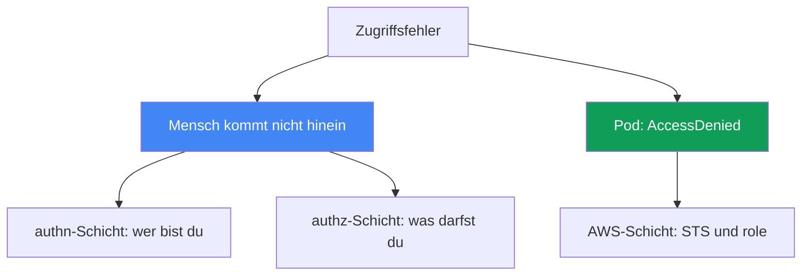
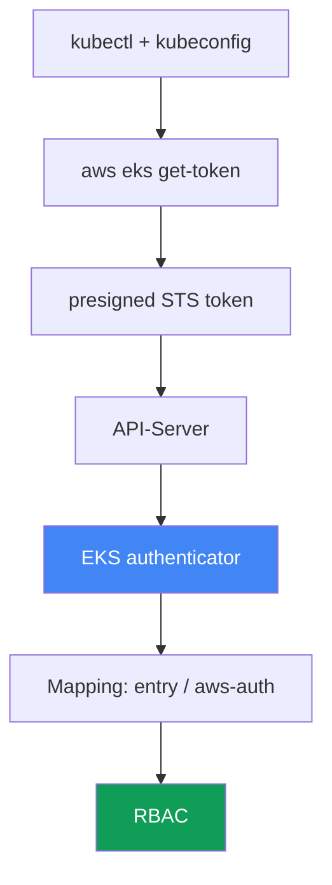

[Русская версия](ru.md) · [Eng version](en.md) · [Versión en español](es.md) · [Version française](fr.md) · [ქართული ვერსია](ge.md) · [繁體中文版](tw.md) · [日本語版](jp.md)
# Kapitel 47. Zugriff und IAM: Access Entries, IRSA und Pod Identity, Webhook, kubeconfig

> **Wie es weitergeht.** Kapitel 45 und 46 behandelten Hardware und Netzwerk: Eine Node ist dem Cluster nicht beigetreten, Traffic fließt nicht. Hier geht es um zwei andere Fehlerklassen: Ein Mensch oder CI kann den Cluster nicht erreichen, und ein Pod erhält bei einem AWS-Aufruf `AccessDenied`, obwohl ihm Zugriff eingerichtet wurde. Die Grundlagen behandeln andere Kapitel: IRSA - Kapitel 16, Pod Identity - Kapitel 17, Access Entries und aws-auth als Zugriffsmechanismen - Kapitel 5, die Autorisierung der Node-Rolle - Kapitel 45. Hier lernen Sie, anhand des Symptoms zu erkennen, auf welcher Schicht der Zugriff fehlerhaft ist, und wie Sie das bestätigen.

## 47.1. Zwei Symptome: Mensch kommt nicht hinein, Pod erhält Ablehnung

Zugriff kann auf zwei unabhängigen Achsen fehlschlagen, die nicht verwechselt werden dürfen.

**Ein Mensch oder CI kann den Cluster nicht erreichen.** `kubectl` antwortet bereits mit einer Ablehnung, bevor es um eine bestimmte Ressource geht:

```bash
kubectl get pods
# error: You must be logged in to the server (Unauthorized)
```

Oder in einer weniger offensichtlichen Form desselben Problems:

```bash
kubectl get nodes
# couldn't get current server API group list: Unauthorized
```

Beide Meldungen sagen dasselbe: Der API-Server hat die anfragende Identität nicht erkannt. Das ist die Authentifizierungsschicht - die IAM identity konnte nicht nachgewiesen werden oder lässt sich innerhalb des Clusters keinem Subjekt zuordnen.

**Ein Pod erhält bei einem AWS-Aufruf `AccessDenied`.** Eine Anwendung mit eingerichtetem IRSA oder Pod Identity schlägt beim Zugriff auf S3, DynamoDB oder Secrets Manager fehl:

```bash
kubectl logs deploy/app
# AccessDenied: User: arn:aws:sts::111122223333:assumed-role/... is not authorized
#   to perform: s3:GetObject on resource: ...
# oder: WebIdentityErr: failed to retrieve credentials
```

Dabei geht es nicht um den Zugriff eines Menschen auf den Cluster, sondern um den Zugriff des Pods auf AWS: Die Kette zum Abrufen temporärer Credentials über STS ist nicht zustande gekommen.

Der Kerngedanke des Kapitels: Das sind zwei unterschiedliche Schichten. Die erste lebt in der Kette `kubectl` - IAM - EKS authenticator - RBAC. Die zweite lebt in der Kette Pod - ServiceAccount - STS - IAM role. Die Diagnose beginnt damit, ehrlich zu benennen, welche dieser Achsen fehlerhaft ist.



## 47.2. Die kubectl-Authentifizierungskette in EKS

Um `Unauthorized` zu beheben, müssen Sie verstehen, wie `kubectl` überhaupt seine Identität nachweist. In EKS geschieht das nicht mit Passwort oder Client-Zertifikat, sondern mit einer durch STS geprüften IAM-Identität.

Die Schritte der Kette:

1. `kubectl` liest die kubeconfig und findet dort ein `exec`-Plugin: den Befehl `aws eks get-token`.
2. Das Plugin erstellt einen **presigned STS request** an `sts:GetCallerIdentity` und kodiert ihn in einen Token mit dem Präfix `k8s-aws-v1.`. Der Token ist mit den aktuellen AWS-Credentials signiert und lebt nur kurz.
3. `kubectl` sendet den Token im Header `Authorization` an den API-Server.
4. Der API-Server leitet den Token an den **EKS authenticator** weiter (webhook token authentication auf der control plane). Der Authenticator spielt den presigned request erneut ab und ermittelt, welche IAM identity ihn signiert hat.
5. Der Authenticator sucht diese identity im Mapping des Clusters (Access Entries oder aws-auth ConfigMap) und wandelt sie in einen Kubernetes-Benutzer und Gruppen um.
6. Danach folgt gewöhnliches **RBAC**: Rollen und Bindings entscheiden, was dieser Benutzer darf.



Das Verständnis dieser Kette ist der Schlüssel zur Diagnose. Ein Abbruch in den Schritten 1-4 (Plugin, Credentials, Token) führt zu `Unauthorized`. Auch ein Abbruch in Schritt 5 (identity ist nicht gemappt) führt zu `Unauthorized`. Schritt 6 dagegen führt zu `Forbidden`, einer eigenen Geschichte im nächsten Abschnitt.

## 47.3. 401 Unauthorized gegenüber 403 Forbidden

Zwei ähnliche Ablehnungen bedeuten zwei unterschiedliche Schichten und zwei unterschiedliche Reparaturen. Sie zu vermischen kostet Zeit.

**401 Unauthorized** bedeutet eine fehlgeschlagene Authentifizierung. Der API-Server versteht oder erkennt die anfragende Identität nicht: Das Plugin liefert keinen Token, Credentials sind abgelaufen oder die IAM identity ist keinem Kubernetes-Subjekt zugeordnet. Die Behebung liegt in kubeconfig, AWS-Credentials und Mapping (Access Entry oder aws-auth).

**403 Forbidden** bedeutet eine fehlgeschlagene Autorisierung. Der API-Server kennt die anfragende Identität bereits, aber RBAC erlaubt die Aktion nicht:

```bash
kubectl get secrets -n kube-system
# Error from server (Forbidden): secrets is forbidden:
#   User "..." cannot list resource "secrets" in namespace "kube-system"
```

Die Behebung liegt in Role/ClusterRole und Bindings, es ist reines Kubernetes RBAC, bekannt aus CKA. AWS spielt hier keine Rolle mehr: Die identity ist nachgewiesen und gemappt.

| Merkmal | 401 Unauthorized | 403 Forbidden |
|---|---|---|
| Schicht | Authentifizierung: Wer bist du? | Autorisierung: Was darfst du? |
| Ursache | kein Token, abgelaufen, identity nicht gemappt | RBAC erlaubt keinen Zugriff auf die Ressource |
| Wo beheben | kubeconfig, Credentials, Access Entry / aws-auth | Role, ClusterRole, RoleBinding |
| In der Meldung | `Unauthorized`, `must be logged in` | `Forbidden`, `cannot <verb> resource` |

Einfache Regel: Bei `Unauthorized` untersuchen Sie IAM und Mapping; bei `Forbidden` untersuchen Sie RBAC. `kubectl auth can-i` aus Abschnitt 47.7 beantwortet genau die Frage der Autorisierung.

## 47.4. Access Entries gegenüber aws-auth ConfigMap

Das Mapping einer IAM identity auf ein Kubernetes-Subjekt (Schritt 5 der Kette) erfolgt in EKS über zwei Mechanismen, und der Cluster-Modus bestimmt, welcher davon funktioniert. Die Grundlagen beider Mechanismen behandelt Kapitel 5, hier geht es darum, wie sie Zugriff fehlschlagen lassen.

Der **authentication mode des Clusters** ist die Einstellung `accessConfig.authenticationMode` mit drei Werten:

| Modus | Was funktioniert | Anmerkung |
|---|---|---|
| `CONFIG_MAP` | nur aws-auth ConfigMap | klassisch, Legacy |
| `API_AND_CONFIG_MAP` | Access Entries und aws-auth | Übergang, beide Quellen |
| `API` | nur Access Entries | ConfigMap wird ignoriert |

Ein **Access Entry** ist ein Eintrag in der EKS API, der an den ARN einer Rolle oder eines Benutzers gebunden ist. Ihm kann eine **access policy** zugewiesen werden (etwa `AmazonEKSClusterAdminPolicy` oder `AmazonEKSAdminPolicy`), oder er wird auf RBAC-Gruppen gemappt, die bereits an eigene Role und ClusterRole gebunden sind.

**Der klassische Lockout.** Zwei verbreitete Wege, den Zugriff zu verlieren:

- **Nur der cluster creator admin.** Der IAM principal, der den Cluster erstellt hat, erhält automatisch Admin-Zugriff. Wenn niemand sonst hinzugefügt wurde, hat nur er Zugriff - und er kann eine CI-Rolle oder die Rolle eines ausgeschiedenen Engineers gewesen sein.
- **Das eigene Mapping in aws-auth entfernt.** Ein unvorsichtiges `kubectl edit` der ConfigMap `aws-auth` entfernt die eigene Zeile. Im Modus `CONFIG_MAP` führt das sofort zu `Unauthorized` für alle, die dort nicht mehr stehen, auch für die Person, die editiert hat.

So reparieren Sie einen ausgesperrten Cluster:

```bash
# aktuellen Modus anzeigen
aws eks describe-cluster --name <cluster> --query 'cluster.accessConfig'
# Access Entries aktivieren, falls vorher nur CONFIG_MAP galt
aws eks update-cluster-config --name <cluster> \
  --access-config authenticationMode=API_AND_CONFIG_MAP
# sich selbst über einen Access Entry mit Admin-Policy Zugriff geben
aws eks create-access-entry --cluster-name <cluster> --principal-arn <Ihr-arn>
aws eks associate-access-policy --cluster-name <cluster> --principal-arn <Ihr-arn> \
  --access-scope type=cluster \
  --policy-arn arn:aws:eks::aws:cluster-access-policy/AmazonEKSClusterAdminPolicy
```

Wichtig: Sie können den Modus auf `API_AND_CONFIG_MAP` umstellen, aber nicht zurück auf `CONFIG_MAP` - die Bewegung in Richtung Access Entries ist nur in eine Richtung möglich. Damit sind Access Entries ein Rettungsmechanismus: Selbst wenn aws-auth beschädigt ist, wird der Zugriff über die EKS API wiederhergestellt, wo IAM-Berechtigungen für den Cluster selbst und nicht der Inhalt der ConfigMap entscheiden.

## 47.5. kubeconfig: stille Ursachen für Unauthorized

Oft ist nicht der Cluster schuld, sondern die lokale kubeconfig oder die Umgebung. Die richtige Datei erzeugt die CLI selbst:

```bash
aws eks update-kubeconfig --name <cluster> --region <region>
# falls nötig unter einem bestimmten Profil
aws eks update-kubeconfig --name <cluster> --region <region> --profile <profile>
```

Der Befehl schreibt einen kubeconfig context mit dem richtigen Server und CA sowie einen `exec`-Abschnitt mit `aws eks get-token`. Danach treten typische Fehler auf:

- **Falsches AWS profile oder falsche Credentials.** Das `exec`-Plugin nimmt Credentials aus der üblichen AWS-Kette (Umgebungsvariablen, `AWS_PROFILE`, `~/.aws/credentials`, Instance-Rolle). Ist das falsche Profil aktiv, signiert eine fremde identity den Token, die möglicherweise nicht gemappt ist - `Unauthorized`.
- **Falsche Region.** In kubeconfig oder bei `get-token` ist die Region eines anderen Clusters angegeben. Der Request geht an die falsche Stelle, die identity passt nicht zur erwarteten.
- **Abgelaufener oder gecachter Token.** Der Token von `get-token` lebt kurz; sind die AWS-Credentials selbst abgelaufen (beispielsweise eine Rolle über SSO), gibt das Plugin keinen gültigen Token aus.
- **Falscher Cluster in `update-kubeconfig`.** Sie haben einen context für einen Cluster erzeugt, arbeiten aber mit einem anderen. `kubectl config current-context` zeigt, wohin die Requests tatsächlich gehen.

Die schnelle Abzweigung "Cluster oder ich": Zeigt `aws sts get-caller-identity` nicht die erwartete identity, liegt das Problem lokal - beim profile oder den Credentials. Ist die identity korrekt, aber weiterhin `Unauthorized`, untersuchen Sie das Mapping aus Abschnitt 47.4.

## 47.6. IRSA und Pod Identity: Warum der Pod AccessDenied erhält

Die zweite Achse ist der Zugriff des Pods auf AWS. Ein Pod besitzt selbst keine AWS-Credentials; diese stellt einer von zwei Mechanismen bereit. Die Grundlagen behandeln Kapitel 16 und 17, hier geht es darum, was bei `AccessDenied` zu prüfen ist.

**IRSA (Kapitel 16).** Der Pod erhält einen ServiceAccount-Token und tauscht ihn über `sts:AssumeRoleWithWebIdentity` bei STS gegen die Credentials einer Rolle ein. Was fehlschlagen kann:

- **Kein IAM OIDC provider für den Cluster.** Ohne registrierten OIDC provider vertraut STS den Cluster-Tokens nicht und der Austausch funktioniert nicht.
- **Falsche trust policy der Rolle.** In der Bedingung müssen `sub` (gleich `system:serviceaccount:<namespace>:<serviceaccount>`) und `aud` (gleich `sts.amazonaws.com`) übereinstimmen. Ein Tippfehler bei Namespace oder SA-Name verhindert die Rollenübernahme.
- **Fehlende oder falsche SA-Annotation** `eks.amazonaws.com/role-arn` - der Pod weiß nicht, welche Rolle er anfordern soll.
- **`sts:AssumeRoleWithWebIdentity` ist nicht erlaubt** - die trust policy lehnt den Token-Austausch ab.
- **Token nicht gemountet.** Der projizierte Token ist nicht im Pod gelandet (der Pod statt des Deployments wurde geändert; der Pod wurde nicht neu erstellt).
- **Regionaler STS endpoint.** Ein Aufruf des globalen statt des regionalen STS erzeugt zusätzliche Latenz und Fehler; in EKS wird der regionale endpoint erwartet.

**Pod Identity (Kapitel 17).** Das ist einfacher: Ein Agent auf der Node gibt Credentials aus, die Rolle wird über eine association mit dem SA verbunden, ein OIDC provider ist nicht nötig. Was fehlschlagen kann:

- **Das Add-on `eks-pod-identity-agent` läuft nicht** - niemand kann Credentials ausgeben.
- **Association fehlt** - die Rolle ist nicht mit diesem SA in diesem Namespace verbunden.
- **Die trust policy der Rolle ist falsch.** Die Rolle muss dem Service `pods.eks.amazonaws.com` mit den Aktionen `sts:AssumeRole` und `sts:TagSession` vertrauen (ohne Letzteres wird die Session nicht getaggt und die association funktioniert nicht).
- **Token ist nicht im Pod gemountet.** Bei funktionierender association erhält der Pod einen projizierten Token unter `/var/run/secrets/pods.eks.amazonaws.com/serviceaccount/eks-pod-identity-token`. Fehlt die Datei, haben Agent oder association nicht funktioniert, oder der Pod wurde nach ihrer Erstellung nicht neu erstellt.

Wann was: IRSA ist ein ausgereifter Mechanismus, der auch ohne EKS-Agent funktioniert, aber einen OIDC provider und eine sorgfältige trust policy für jeden Cluster erfordert. Pod Identity ist neuer und einfacher zu betreiben: Eine trust policy für `pods.eks.amazonaws.com` wird clusterübergreifend wiederverwendet, die Verbindung wird durch die association festgelegt. Ermitteln Sie bei der Untersuchung zuerst, welcher Mechanismus für diesen SA eingerichtet ist, und suchen Sie nicht nach OIDC, wenn Pod Identity arbeitet.

## 47.7. Reihenfolge der Diagnose und Werkzeuge

Zugriff wird vom Symptom zur Schicht repariert, genau wie Netzwerk in Kapitel 46. Zuerst: Welche Achse ist fehlerhaft?

```bash
# wer bin ich tatsächlich aus Sicht von AWS?
aws sts get-caller-identity
# Authentifizierungsmodus und accessConfig des Clusters
aws eks describe-cluster --name <cluster> --query 'cluster.accessConfig'
# wer ist über Access Entries gemappt?
aws eks list-access-entries --cluster-name <cluster>
# was steht in aws-auth (falls der Modus es noch verwendet)
kubectl -n kube-system get cm aws-auth -o yaml
# authz: was darf ich überhaupt?
kubectl auth can-i --list
kubectl auth can-i get pods -n <ns>
```

Für die Pod-Achse:

```bash
# Rollenannotation am ServiceAccount (IRSA)
kubectl get sa <sa> -n <ns> -o jsonpath='{.metadata.annotations.eks\.amazonaws\.com/role-arn}'
# Pod-Identity-Associations
aws eks list-pod-identity-associations --cluster-name <cluster>
# läuft der Pod-Identity-Agent?
kubectl -n kube-system get pods -l app.kubernetes.io/name=eks-pod-identity-agent
# ist der Pod-Identity-Token im Pod gemountet? (keine Datei - Agent/association nicht wirksam)
kubectl exec <pod> -n <ns> -- ls /var/run/secrets/pods.eks.amazonaws.com/serviceaccount/
```

Wenn die authentication-Kette keinen Grund erkennen lässt, helfen die Authenticator-Logs - sie gehören zum control plane logging (Kapitel 21 und 34) und zeigen, ob die anfragende identity gemappt ist.

Checkliste "Symptom - wahrscheinliche Ursache - was prüfen":

| Symptom | Wahrscheinliche Ursache | Was prüfen |
|---|---|---|
| `Unauthorized`, `must be logged in` | falsche identity oder nicht gemappt | `sts get-caller-identity`, `list-access-entries` |
| `Unauthorized` direkt nach `edit aws-auth` | eigenes Mapping entfernt | `get cm aws-auth`, über Access Entry wiederherstellen |
| `Forbidden: cannot <verb>` | RBAC erlaubt den Zugriff nicht | `kubectl auth can-i`, Role und Bindings |
| `couldn't get server API group` | beschädigte kubeconfig oder falsche Region | `update-kubeconfig`, `current-context`, profile |
| Pod: `AccessDenied` mit IRSA | trust policy, OIDC, SA-Annotation | OIDC provider, `sub`/`aud`, Annotation `role-arn` |
| Pod: `WebIdentityErr` | Token nicht gemountet, falsche Rolle | Pod neu erstellen, trust policy prüfen |
| Pod: `AccessDenied` mit Pod Identity | keine association, kein Agent oder kein Token | `list-pod-identity-associations`, Agent, Token im Pod |

Die Logik: Zuerst beantwortet `sts get-caller-identity` die Frage "Wer bin ich?"; anschließend trennen sich die Pfade nach dem Ablehnungscode - bei `Unauthorized` zu Mapping und kubeconfig, bei `Forbidden` zu RBAC, bei `AccessDenied` aus dem Pod zu IRSA oder Pod Identity. Jeder Pfad führt zu seinem Werkzeug, Raten ist nicht nötig.

## 47.8. So wird das in der Produktion eingesetzt

- **Zugriff nicht bei nur einem cluster creator lassen.** Fügen Sie sofort Access Entries für die Arbeitsrollen des Teams und CI hinzu, damit das Ausscheiden einer Person oder eine Rollenrotation den Cluster nicht aussperrt.
- **Modus `API` oder `API_AND_CONFIG_MAP` verwenden.** Access Entries werden über IAM und Terraform verwaltet, können nicht durch `kubectl edit` beschädigt werden, und die Wiederherstellung des Zugriffs benötigt kein funktionierendes kubectl.
- **401 und 403 im Runbook unterscheiden.** Der Bereitschaftsdienst prüft zuerst den Ablehnungscode: `Unauthorized` bedeutet IAM und Mapping, `Forbidden` bedeutet RBAC. Das spart die ersten Minuten eines Incidents.
- **Einen Mechanismus für Pods standardisieren.** Wählen Sie IRSA oder Pod Identity als Standard und mischen Sie sie nicht ohne Grund in einem Cluster - dann gibt es bei `AccessDenied` weniger Stellen zu untersuchen.
- **Trust policy eng und anhand einer Vorlage schreiben.** Für IRSA: präzise `sub` und `aud`; für Pod Identity: `pods.eks.amazonaws.com` mit `sts:AssumeRole` und `sts:TagSession`, aus einem geprüften Modul.
- **Control plane logging frühzeitig aktivieren.** Authenticator- und API-Logs werden genau während eines Zugriffsincidents benötigt; sie nachträglich zu aktivieren ist zu spät.

## 47.9. Mini-Glossar

- **EKS authenticator** - Webhook auf der control plane, der den presigned STS-Token prüft und eine IAM identity einem Kubernetes-Subjekt zuordnet.
- **`aws eks get-token`** - `exec`-Plugin in der kubeconfig, das einen presigned STS-Token für den Cluster-Zugang erzeugt.
- **Unauthorized (401)** - fehlgeschlagene Authentifizierung: identity ist nicht nachgewiesen oder nicht gemappt.
- **Forbidden (403)** - fehlgeschlagene Autorisierung: RBAC erlaubt die Aktion nicht.
- **authentication mode** - Cluster-Einstellung `API`, `API_AND_CONFIG_MAP` oder `CONFIG_MAP`, die die Quelle des Mappings festlegt.
- **access entry** - EKS-API-Eintrag, der einen ARN principal mit access policy oder Gruppen verbindet.
- **access policy** - verwaltete EKS-Zugriffsrichtlinie für den Cluster, zum Beispiel `AmazonEKSClusterAdminPolicy`.
- **aws-auth ConfigMap** - veraltete Methode, IAM über eine ConfigMap im Namespace kube-system auf RBAC zu mappen.
- **cluster creator admin** - IAM principal, der den Cluster erstellt hat und automatisch Admin-Zugriff erhält.
- **IRSA** - Zugriff eines Pods auf AWS über OIDC und `sts:AssumeRoleWithWebIdentity` (Kapitel 16).
- **Pod Identity** - Zugriff eines Pods auf AWS über den Agent `eks-pod-identity-agent` und eine association (Kapitel 17).
- **trust policy** - Vertrauensrichtlinie einer IAM-Rolle: Wer sie unter welchen Bedingungen übernehmen darf.

## 47.10. Zusammenfassung des Kapitels

- Zugriffsfehler teilen sich in zwei Achsen: Ein Mensch oder CI kommt nicht in den Cluster, und ein Pod erhält bei einem AWS-Aufruf `AccessDenied`. Das sind unterschiedliche Schichten mit unterschiedlichen Werkzeugen zur Behebung.
- Der Zugang zu EKS ist die Kette `kubectl` - `aws eks get-token` - presigned STS - authenticator - Mapping - RBAC. Das Verständnis der Kette lokalisiert den Abbruch.
- `Unauthorized` (401) bedeutet Authentifizierung: kein Token, abgelaufen oder identity nicht gemappt. `Forbidden` (403) bedeutet Autorisierung: RBAC erlaubt den Zugriff nicht. Die Behebung erfolgt an unterschiedlichen Stellen.
- Das Mapping definieren Access Entries oder aws-auth, und der authentication mode des Clusters entscheidet, welche Quelle arbeitet. Access Entries sind ein Rettungsmechanismus für einen ausgesperrten Cluster (Kapitel 5).
- Der klassische Lockout: Zugriff hatte nur der cluster creator oder das eigene Mapping in aws-auth wurde entfernt. Das wird durch Moduswechsel und Hinzufügen eines Access Entry behoben.
- kubeconfig kann den Zugang still stören: falsches profile, falsche Region, abgelaufene Credentials, fremder context. `aws sts get-caller-identity` trennt ein lokales Problem schnell von einem Cluster-Problem.
- Ein Pod erhält `AccessDenied` durch eine unterbrochene STS-Kette: bei IRSA wegen OIDC provider, trust policy mit `sub`/`aud` oder SA-Annotation; bei Pod Identity wegen Agent, association oder Vertrauen in `pods.eks.amazonaws.com` mit `sts:AssumeRole` und `sts:TagSession` (Kapitel 16 und 17).

## 47.11. Wie das in der praktischen Arbeit hilft

Ein Zugriffsincident kommt fast immer im schlechtesten Moment: CI kann kein Release ausrollen oder ein Pod schlägt nach dem Deployment bei AWS fehl. Die Versuchung besteht darin, sofort RBAC zu untersuchen oder die Rolle umzuschreiben. Erfolgreich ist, wer mit der ersten Frage die Achse trennt: Kann ein Mensch nicht hinein oder kann der Pod AWS nicht erreichen? Danach vervollständigt der Ablehnungscode die Klassifikation - `Unauthorized`, `Forbidden` oder `AccessDenied` führen an drei unterschiedliche Stellen. `aws sts get-caller-identity` sagt in den ersten Sekunden, ob das eigene Problem oder das des Clusters vorliegt, und das ist meist wichtiger als jeder kubectl-Befehl.

Bei der Planung werden dieselben Schichten zu Prävention. Access Entries statt reinem aws-auth und mehrere Admin-Mappings statt eines einzelnen cluster creator beseitigen eine ganze Klasse von Lockouts. Ein einheitlicher Zugriffsmechanismus für Pods und trust policy aus einem geprüften Modul machen `AccessDenied` selten und vorhersehbar. Vorab aktiviertes control plane logging verwandelt ein stummes `Unauthorized` in einen Eintrag, an dem sichtbar wird, wen und warum der Cluster nicht erkannt hat.

## 47.12. Fragen zur Selbstkontrolle

1. In welche zwei unabhängigen Achsen teilen sich Zugriffsfehler in EKS auf, und warum dürfen sie nicht verwechselt werden?
2. Beschreiben Sie die Authentifizierungskette von `kubectl` in EKS von kubeconfig bis RBAC. Wo tritt 401 auf?
3. Was genau tut `aws eks get-token` und welchen Token erstellt es?
4. Worin unterscheiden sich `Unauthorized` (401) und `Forbidden` (403) hinsichtlich Schicht und Ort der Behebung?
5. Welche drei authentication mode gibt es für den Cluster, und welche Quelle erlaubt jeweils jeder?
6. Wie kann man einen Cluster aussperren, und warum dienen Access Entries als Rettungsmechanismus?
7. Welche stillen Fehler in kubeconfig führen zu `Unauthorized`, und wie unterscheiden Sie sie von einem Cluster-Fehler?
8. Was ist bei `AccessDenied` aus einem Pod mit IRSA (Kapitel 16) in welcher Reihenfolge zu prüfen?
9. Welche Rolle spielen die Bedingungen `sub` und `aud` in der trust policy und die SA-Annotation bei IRSA?
10. Was ist für Pod Identity nötig, und welche trust policy benötigt die Rolle (Kapitel 17)?
11. Wann wählen Sie IRSA, wann Pod Identity, und wie beeinflusst das die Diagnose?
12. Welche Befehle geben einen schnellen Überblick: Wer bin ich, Cluster-Modus, Mapping, Rechte, Associations?
13. Wie helfen die Authenticator-Logs, und wo werden sie aktiviert (Kapitel 21 und 34)?

## Praxis

Das Kurslabor zu diesem Thema: [Labor 121 - Fehlerbehebung beim Zugriff](../../labs/121/README_DE.MD). Darin erzeugen Sie selbst alle drei Ablehnungen und unterscheiden sie: `AccessDenied` von IAM, `Unauthorized` bei einer Rolle ohne Access Entry, `Forbidden` mit View-Policy und anschließend `AccessDenied` bei `AssumeRoleWithWebIdentity` wegen eines nicht übereinstimmenden `sub` in der trust policy; geprüft wird mit dem Befehl `check_result`. Start: `TASK=121 make run_eks_task`.

Neben dem Labor ist dieses Kapitel ein diagnostisches Runbook zum Zugriff. Alle Prüfungen sind auf einem gesunden Cluster sicher und zeigen, wie der Normalzustand aussieht, um Abweichungen schneller zu erkennen.

Sehen Sie zunächst nach, wer Sie aus Sicht von AWS sind und in welchem Modus der Cluster läuft:

```bash
# Ihre tatsächliche IAM identity
aws sts get-caller-identity
# Authentifizierungsmodus und accessConfig
aws eks describe-cluster --name <cluster> --query 'accessConfig'
# wer ist über Access Entries gemappt?
aws eks list-access-entries --cluster-name <cluster>
```

Prüfen Sie danach Ihre Autorisierung innerhalb des Clusters - das ist die RBAC-Schicht, nicht IAM:

```bash
# vollständige Liste Ihrer erlaubten Aktionen
kubectl auth can-i --list
# gezielte Prüfung einer bestimmten Aktion
kubectl auth can-i create deployments -n default
```

Untersuchen Sie zum Abschluss den AWS-Zugriff der Pods. Finden Sie den ServiceAccount eines laufenden Pods und prüfen Sie, über welchen Mechanismus er Credentials erhält:

```bash
# Rollenannotation für IRSA (leer bedeutet: IRSA wird hier nicht verwendet)
kubectl get sa <sa> -n <ns> \
  -o jsonpath='{.metadata.annotations.eks\.amazonaws\.com/role-arn}'
# Pod-Identity-Associations im Cluster
aws eks list-pod-identity-associations --cluster-name <cluster>
```

Vergleichen Sie das Ergebnis mit der Checkliste aus Abschnitt 47.7: In einem gesunden Cluster liefert `get-caller-identity` die erwartete Rolle, Access Entries enthalten die verwendeten ARN, `auth can-i --list` entspricht Ihrer Rolle und Pods besitzen entweder eine IRSA-Annotation oder eine Pod-Identity-Association. Wenn Sie den Normalzustand kennen, erkennen Sie im Incident sofort, welche der beiden Zugriffsachsen fehlerhaft ist.

---
[Inhaltsverzeichnis](../README_DE.md) · [Kapitel 46](../46/de.md) · [Kapitel 48](../48/de.md)