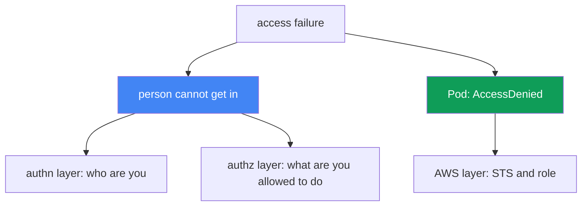
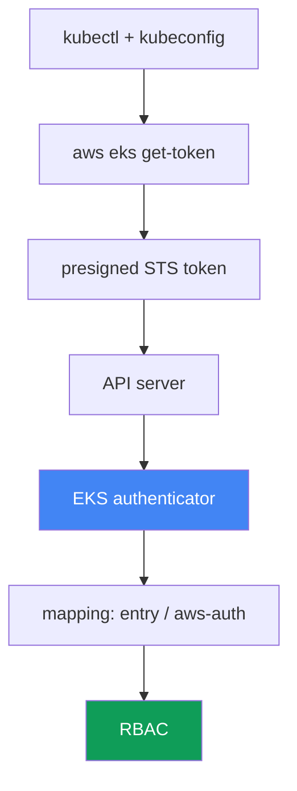

[Русская версия](ru.md) · [Versión en español](es.md) · [Version française](fr.md) · [Deutsche Version](de.md) · [ქართული ვერსია](ge.md) · [繁體中文版](tw.md) · [日本語版](jp.md)
# Chapter 47. Access and IAM: access entries, IRSA and Pod Identity, webhook, kubeconfig

> **What is next.** Chapters 45 and 46 covered hardware and networking: a node did not join, or
> traffic does not flow. Here are two other classes of failures: a person or CI cannot reach the
> cluster, and a Pod gets `AccessDenied` on an AWS call even though access was configured for it.
> The mechanisms are covered in other chapters: IRSA in chapter 16, Pod Identity in chapter 17,
> access entries and aws-auth as access mechanisms in chapter 5, and node-role authorization in
> chapter 45. Here is how to identify from the symptom which access layer is broken and how to
> confirm it.

## 47.1. Two symptoms: a person cannot get in, a Pod gets denied

Access breaks along two independent axes, and they must not be confused.

**A person or CI cannot reach the cluster.** `kubectl` responds with a denial before it gets to a
specific resource:

```bash
kubectl get pods
# error: You must be logged in to the server (Unauthorized)
```

Or a less obvious form of the same problem:

```bash
kubectl get nodes
# couldn't get current server API group list: Unauthorized
```

Both messages mean the same thing: the API server did not recognize the caller. This is the
authentication layer: the IAM identity could not be established or could not be mapped inside the
cluster.

**A Pod gets `AccessDenied` on an AWS call.** An application with configured IRSA or Pod Identity
fails when accessing S3, DynamoDB, or Secrets Manager:

```bash
kubectl logs deploy/app
# AccessDenied: User: arn:aws:sts::111122223333:assumed-role/... is not authorized
#   to perform: s3:GetObject on resource: ...
# or: WebIdentityErr: failed to retrieve credentials
```

This is not about a person's access to the cluster, but a Pod's access to AWS: the chain for
obtaining temporary credentials through STS did not come together.

The key idea of this chapter is that these are two different layers. The first lives in the
`kubectl` - IAM - EKS authenticator - RBAC chain. The second lives in the Pod - ServiceAccount -
STS - IAM role chain. Diagnosis starts with honestly naming which axis is broken.



## 47.2. The kubectl authentication chain in EKS

To fix `Unauthorized`, you need to understand how `kubectl` proves who it is in the first place.
In EKS, this is not a password or a client certificate, but an IAM identity verified through STS.

Steps in the chain:

1. `kubectl` reads kubeconfig and sees an `exec` plugin: the `aws eks get-token` command.
2. The plugin forms a **presigned STS request** to `sts:GetCallerIdentity` and encodes it in a token
   with the `k8s-aws-v1.` prefix. The token is signed with the current AWS credentials and has a
   short lifetime.
3. `kubectl` sends the token to the API server in the `Authorization` header.
4. The API server passes the token to the **EKS authenticator** (webhook token authentication on the
   control plane side). The authenticator "replays" the presigned request and learns which IAM
   identity signed it.
5. The authenticator looks up this identity in the cluster mapping (access entries or the aws-auth
   ConfigMap) and turns it into a Kubernetes user and groups.
6. From there, ordinary **RBAC** applies: roles and bindings decide what that user can do.



Understanding the chain is key to diagnosis. A break at steps 1-4 (plugin, credentials, token)
causes `Unauthorized`. A break at step 5 (the identity is not mapped) also causes `Unauthorized`.
But step 6 is `Forbidden`, a separate story in the next section.

## 47.3. 401 Unauthorized versus 403 Forbidden

Two similar denials mean two different layers and two different fixes. Mixing them wastes time.

**401 Unauthorized** is an authentication failure. The API server did not understand or recognize
who arrived: the plugin did not provide a token, credentials expired, or the IAM identity is not
mapped to a Kubernetes subject. Fix it in kubeconfig, AWS credentials, and the mapping (access
entry or aws-auth).

**403 Forbidden** is an authorization failure. The API server already knows who arrived, but RBAC
does not grant permission for the action:

```bash
kubectl get secrets -n kube-system
# Error from server (Forbidden): secrets is forbidden:
#   User "..." cannot list resource "secrets" in namespace "kube-system"
```

Fix it in the Role/ClusterRole and bindings. This is pure Kubernetes RBAC familiar from CKA. AWS is
no longer involved: the identity was established and mapped.

| Signal | 401 Unauthorized | 403 Forbidden |
|---|---|---|
| Layer | authentication: who are you | authorization: what are you allowed to do |
| Cause | no token, expired token, identity not mapped | RBAC does not grant access to the resource |
| Where to fix | kubeconfig, credentials, access entry / aws-auth | Role, ClusterRole, RoleBinding |
| In the message | `Unauthorized`, `must be logged in` | `Forbidden`, `cannot <verb> resource` |

The simple rule: for `Unauthorized`, investigate IAM and mapping; for `Forbidden`, investigate
RBAC. `kubectl auth can-i` from section 47.7 answers precisely the authorization question.

## 47.4. Access entries versus the aws-auth ConfigMap

Mapping an IAM identity to a Kubernetes subject (step 5 of the chain) in EKS uses two mechanisms,
and the cluster mode determines which works. Their workings are in chapter 5; here is how they
break access.

The cluster **authentication mode** is the `accessConfig.authenticationMode` setting with three
values:

| Mode | What works | Comment |
|---|---|---|
| `CONFIG_MAP` | only the aws-auth ConfigMap | classic, legacy |
| `API_AND_CONFIG_MAP` | both access entries and aws-auth | transitional, both sources |
| `API` | only access entries | ConfigMap is ignored |

An **access entry** is an EKS API record bound to a role or user ARN. It can receive an **access
policy** (for example, `AmazonEKSClusterAdminPolicy` or `AmazonEKSAdminPolicy`) or be mapped to
RBAC groups that already have their own Roles and ClusterRoles bound to them.

**The classic lockout.** There are two frequent ways to lose access:

- **Only the cluster creator is admin.** The IAM principal that created the cluster automatically
  receives administrator access. If nobody else was added, access belongs only to it, and it could
  be a CI role or an engineer who left.
- **Your mapping was removed from aws-auth.** A careless `kubectl edit` of the `aws-auth` ConfigMap
  removes your own line. In `CONFIG_MAP` mode, that immediately gives `Unauthorized` to everyone
  no longer listed there, including the person who edited it.

Fixing a locked-out cluster:

```bash
# view the current mode
aws eks describe-cluster --name <cluster> --query 'cluster.accessConfig'
# enable access entries if it was CONFIG_MAP only
aws eks update-cluster-config --name <cluster> \
  --access-config authenticationMode=API_AND_CONFIG_MAP
# add yourself through an access entry with the administrator policy
aws eks create-access-entry --cluster-name <cluster> --principal-arn <your-arn>
aws eks associate-access-policy --cluster-name <cluster> --principal-arn <your-arn> \
  --access-scope type=cluster \
  --policy-arn arn:aws:eks::aws:cluster-access-policy/AmazonEKSClusterAdminPolicy
```

Importantly, you can switch the mode to `API_AND_CONFIG_MAP`, but not back to `CONFIG_MAP`: the
transition toward access entries is one way. This makes access entries a recovery mechanism: even
if aws-auth is corrupted, access is restored through the EKS API, where IAM permissions on the
cluster itself, rather than ConfigMap contents, decide.

## 47.5. kubeconfig: quiet causes of Unauthorized

Often the cluster is not at fault, but the local kubeconfig or environment is. The CLI itself
generates the correct file:

```bash
aws eks update-kubeconfig --name <cluster> --region <region>
# when needed, under a particular profile
aws eks update-kubeconfig --name <cluster> --region <region> --profile <profile>
```

The command writes a kubeconfig context with the required server and CA plus an `exec` section with
`aws eks get-token`. Typical errors then occur:

- **The wrong AWS profile or credentials.** The `exec` plugin obtains credentials from the ordinary
  AWS chain (environment variables, `AWS_PROFILE`, `~/.aws/credentials`, instance role). If the
  wrong profile is active, the token is signed by someone else's identity, which may not be mapped,
  resulting in `Unauthorized`.
- **The wrong Region.** kubeconfig or `get-token` specifies the Region of another cluster. The
  request goes to the wrong place, and the identity does not match the expected one.
- **Expired or cached token.** A `get-token` token is short lived; if the AWS credentials themselves
  expired (for example, an SSO role), the plugin will not issue a valid token.
- **The wrong cluster in `update-kubeconfig`.** You generated a context for one cluster but work in
  another. `kubectl config current-context` shows where requests actually go.

A quick "cluster or me" split: if `aws sts get-caller-identity` shows an identity other than the
one you expect, the problem is local: the profile or credentials. If the identity is correct but it
is still `Unauthorized`, investigate the mapping from section 47.4.

## 47.6. IRSA and Pod Identity: why a Pod gets AccessDenied

The second axis is a Pod's access to AWS. A Pod has no AWS credentials on its own; one of two
mechanisms provides them. Their workings are in chapters 16 and 17; here is what to check for
`AccessDenied`.

**IRSA (chapter 16).** A Pod obtains a ServiceAccount token and exchanges it in STS through
`sts:AssumeRoleWithWebIdentity` for role credentials. What can break:

- **The cluster has no IAM OIDC provider.** Without a registered OIDC provider, STS does not trust
  cluster tokens and the exchange fails.
- **The role trust policy is wrong.** Its condition must match `sub` (equal to
  `system:serviceaccount:<namespace>:<serviceaccount>`) and `aud` (equal to `sts.amazonaws.com`).
  A typo in the namespace or SA name prevents the role from being issued.
- **The SA annotation is absent or wrong:** `eks.amazonaws.com/role-arn`. The Pod does not know
  which role to request.
- **`sts:AssumeRoleWithWebIdentity` is not allowed** in the trust policy, so the token exchange is
  denied.
- **The token is not mounted.** The projected token did not reach the Pod (the Pod was changed
  rather than the Deployment, or the Pod was not recreated).
- **Regional STS endpoint.** Calling global STS rather than regional STS adds latency and failures;
  EKS expects the regional endpoint.

**Pod Identity (chapter 17).** It is simpler: an agent on the node issues credentials, and the role
is connected to an SA through an association; no OIDC provider is required. What can break:

- **The `eks-pod-identity-agent` add-on is not running:** nobody can issue credentials.
- **The association is absent:** the role is not associated with this SA in this namespace.
- **The role trust policy is wrong.** The role must trust the `pods.eks.amazonaws.com` service with
  `sts:AssumeRole` and `sts:TagSession` actions (without the latter, the session is not tagged and
  the association does not work).
- **The token is not mounted in the Pod.** With a working association, the Pod receives a projected
  token at `/var/run/secrets/pods.eks.amazonaws.com/serviceaccount/eks-pod-identity-token`. No file
  means the agent or association did not work, or the Pod was not recreated after it was created.

When to use which: IRSA is a mature mechanism that works outside the EKS agent, but requires an
OIDC provider and a careful trust policy for every cluster. Pod Identity is newer and simpler to
operate: one trust policy for `pods.eks.amazonaws.com` is reused across clusters, and the link is
set by an association. During diagnosis, first determine which mechanism is configured for the SA,
and do not look for OIDC where Pod Identity is used.

## 47.7. Diagnostic order and tools

Fix access from symptom to layer, just like networking in chapter 46. First, determine which axis
is broken.

```bash
# who AWS actually sees me as
aws sts get-caller-identity
# authentication mode and cluster accessConfig
aws eks describe-cluster --name <cluster> --query 'cluster.accessConfig'
# who is mapped through access entries
aws eks list-access-entries --cluster-name <cluster>
# contents of aws-auth (if the mode still uses it)
kubectl -n kube-system get cm aws-auth -o yaml
# authz: what am I allowed to do at all
kubectl auth can-i --list
kubectl auth can-i get pods -n <ns>
```

For the Pod axis:

```bash
# role annotation on the ServiceAccount (IRSA)
kubectl get sa <sa> -n <ns> -o jsonpath='{.metadata.annotations.eks\.amazonaws\.com/role-arn}'
# Pod Identity associations
aws eks list-pod-identity-associations --cluster-name <cluster>
# is the Pod Identity agent running
kubectl -n kube-system get pods -l app.kubernetes.io/name=eks-pod-identity-agent
# is the Pod Identity token mounted in the Pod itself (no file means agent/association failed)
kubectl exec <pod> -n <ns> -- ls /var/run/secrets/pods.eks.amazonaws.com/serviceaccount/
```

If the authentication chain is silent about the cause, authenticator logs help. They are included in
control plane logging (chapters 21 and 34) and show whether the arriving identity was mapped.

Checklist: "symptom, likely cause, what to check":

| Symptom | Likely cause | What to check |
|---|---|---|
| `Unauthorized`, `must be logged in` | wrong identity or not mapped | `sts get-caller-identity`, `list-access-entries` |
| `Unauthorized` right after `edit aws-auth` | own mapping was removed | `get cm aws-auth`, restore through access entry |
| `Forbidden: cannot <verb>` | RBAC does not grant permission | `kubectl auth can-i`, Role and bindings |
| `couldn't get server API group` | broken kubeconfig or Region | `update-kubeconfig`, `current-context`, profile |
| Pod `AccessDenied` with IRSA | trust policy, OIDC, SA annotation | OIDC provider, `sub`/`aud`, `role-arn` annotation |
| Pod `WebIdentityErr` | token not mounted, wrong role | recreate Pod, check trust policy |
| Pod `AccessDenied` with Pod Identity | no association, agent, or token | `list-pod-identity-associations`, agent, token in Pod |

The logic: first, `sts get-caller-identity` answers "who am I?"; then branch by denial code:
`Unauthorized` leads to mapping and kubeconfig, `Forbidden` to RBAC, and `AccessDenied` from a Pod
to IRSA or Pod Identity. Each branch has its own tool, so there is no need to guess.

## 47.8. How this is used in production

- **Do not leave access with one cluster creator.** Immediately add access entries for the team's
  and CI's working roles so an employee departure or role rotation cannot lock the cluster.
- **Keep mode `API` or `API_AND_CONFIG_MAP`.** Access entries are managed through IAM and Terraform;
  they cannot be broken with `kubectl edit`, and access recovery does not require working kubectl.
- **Distinguish 401 and 403 in the runbook.** The on-call engineer first looks at the denial code:
  `Unauthorized` is IAM and mapping, while `Forbidden` is RBAC. This saves the first minutes of an
  incident.
- **Standardize one mechanism for Pods.** Choose IRSA or Pod Identity as the primary mechanism and
  do not mix them in one cluster without need: there are fewer places to search for `AccessDenied`.
- **Write narrow trust policies from a template.** For IRSA, use exact `sub` and `aud`; for Pod
  Identity, use `pods.eks.amazonaws.com` with `sts:AssumeRole` and `sts:TagSession`, from a tested
  module.
- **Enable control plane logging in advance.** Authenticator and API logs are needed during an
  access incident; enabling them afterward is too late.

## 47.9. Mini glossary

- **EKS authenticator**: a webhook on the control plane that verifies a presigned STS token and
  maps an IAM identity to a Kubernetes subject.
- **`aws eks get-token`**: the `exec` plugin in kubeconfig that forms a presigned STS token to log
  in to the cluster.
- **Unauthorized (401)**: an authentication failure: identity was not established or mapped.
- **Forbidden (403)**: an authorization failure: RBAC does not grant permission for the action.
- **authentication mode**: a cluster setting, `API`, `API_AND_CONFIG_MAP`, or `CONFIG_MAP`, that
  determines the mapping source.
- **access entry**: an EKS API record that connects a principal ARN to an access policy or groups.
- **access policy**: a managed EKS policy for cluster access, for example
  `AmazonEKSClusterAdminPolicy`.
- **aws-auth ConfigMap**: the legacy method for mapping IAM to RBAC through a ConfigMap in the
  kube-system namespace.
- **cluster creator admin**: the IAM principal that created a cluster receives administrator access
  automatically.
- **IRSA**: Pod access to AWS through OIDC and `sts:AssumeRoleWithWebIdentity` (chapter 16).
- **Pod Identity**: Pod access to AWS through the `eks-pod-identity-agent` and an association
  (chapter 17).
- **trust policy**: an IAM role trust policy: who can assume it and under what conditions.

## 47.10. Chapter summary

- Access failures split along two axes: a person or CI cannot enter the cluster, and a Pod gets
  `AccessDenied` on an AWS call. These are different layers with different repair tools.
- Logging in to EKS is the `kubectl` - `aws eks get-token` - presigned STS - authenticator -
  mapping - RBAC chain. Understanding the chain localizes the break.
- `Unauthorized` (401) is authentication: no token, expired token, or identity not mapped.
  `Forbidden` (403) is authorization: RBAC does not grant permission. They are fixed in different
  places.
- Mapping is set by access entries or aws-auth, and the cluster authentication mode determines which
  source works. Access entries are a recovery mechanism for a locked-out cluster (chapter 5).
- The classic lockout is access only for the cluster creator or removal of your own mapping from
  aws-auth. Fix it by changing mode and adding an access entry.
- kubeconfig quietly breaks login: the wrong profile, Region, expired credentials, or another
  context. `aws sts get-caller-identity` quickly separates a local problem from a cluster problem.
- A Pod gets `AccessDenied` from a broken STS chain: for IRSA, OIDC provider, trust policy with
  `sub`/`aud`, and SA annotation; for Pod Identity, agent, association, and trust in
  `pods.eks.amazonaws.com` with `sts:AssumeRole` and `sts:TagSession` (chapters 16 and 17).

## 47.11. How it helps in real work

An access incident nearly always happens at the worst time: CI cannot deploy a release or a Pod
fails on AWS after deployment. The temptation is to immediately dig into RBAC or rewrite the role.
The person who first separates the axis wins: is it a person who cannot enter, or a Pod that cannot
reach AWS? The denial code then completes the classification: `Unauthorized`, `Forbidden`, or
`AccessDenied` lead to three different places. `aws sts get-caller-identity` tells you in the first
seconds whether this is your problem or the cluster's, and that is usually more important than any
kubectl command.

During planning, the same layers become prevention. Access entries instead of bare aws-auth and
multiple administrator mappings instead of one cluster creator eliminate an entire class of
lockouts. A single Pod access mechanism and trust policies from a tested module make `AccessDenied`
rare and predictable. And control plane logging enabled in advance turns a silent `Unauthorized`
into a record showing who and why was not recognized.

## 47.12. Self-check questions

1. Into which two independent axes do EKS access failures split, and why must they not be confused?
2. Describe the `kubectl` authentication chain in EKS from kubeconfig to RBAC. Where does 401 break?
3. What exactly does `aws eks get-token` do, and what token does it form?
4. How does `Unauthorized` (401) differ from `Forbidden` (403) in layer and place of repair?
5. Which three authentication modes does a cluster have, and what mapping source does each permit?
6. How can a cluster be locked out, and why do access entries serve as a recovery mechanism?
7. Which quiet kubeconfig errors cause `Unauthorized`, and how do you distinguish them from a cluster failure?
8. What should you check in order for `AccessDenied` from a Pod with IRSA (chapter 16)?
9. What roles do the `sub` and `aud` conditions in the trust policy and the SA annotation play in IRSA?
10. What does Pod Identity need, and which trust policy must the role have (chapter 17)?
11. When do you choose IRSA versus Pod Identity, and how does that affect diagnosis?
12. Which commands provide a quick picture: who am I, cluster mode, mapping, permissions, associations?
13. How do authenticator logs help, and where are they enabled (chapters 21 and 34)?

## Practice

The course lab for this topic is [Lab 121: access troubleshooting](../../labs/121/README.MD).
In it, you produce all three denials yourself and distinguish them: IAM `AccessDenied`,
`Unauthorized` for a role without an access entry, `Forbidden` with a view policy, and then
`AccessDenied` on `AssumeRoleWithWebIdentity` because `sub` does not match in the trust policy;
validate with the `check_result` command. Start it with `TASK=121 make run_eks_task`.

Beyond the lab, this chapter is a diagnostic runbook for access. All checks are safe on a healthy
cluster and show what normal looks like, so deviations are recognized faster.

First, view who AWS sees you as and the cluster mode:

```bash
# your actual IAM identity
aws sts get-caller-identity
# authentication mode and accessConfig
aws eks describe-cluster --name <cluster> --query 'accessConfig'
# who is mapped through access entries
aws eks list-access-entries --cluster-name <cluster>
```

Then check your authorization inside the cluster: this is the RBAC layer, not IAM:

```bash
# complete list of what you are allowed to do
kubectl auth can-i --list
# targeted check of a specific action
kubectl auth can-i create deployments -n default
```

Finally, investigate Pods' access to AWS. Find a working Pod's ServiceAccount and see which
mechanism gives it credentials:

```bash
# role annotation for IRSA (empty means IRSA is not used here)
kubectl get sa <sa> -n <ns> \
  -o jsonpath='{.metadata.annotations.eks\.amazonaws\.com/role-arn}'
# Pod Identity associations in the cluster
aws eks list-pod-identity-associations --cluster-name <cluster>
```

Compare the picture with the checklist in section 47.7: in a healthy cluster,
`get-caller-identity` returns the expected role, access entries contain working ARNs,
`auth can-i --list` matches your role, and Pods have either an IRSA annotation or a Pod Identity
association. Once you know normal, an incident immediately tells you which of the two access axes
is broken.

---
[Table of contents](../README.md) · [Chapter 46](../46/en.md) · [Chapter 48](../48/en.md)
