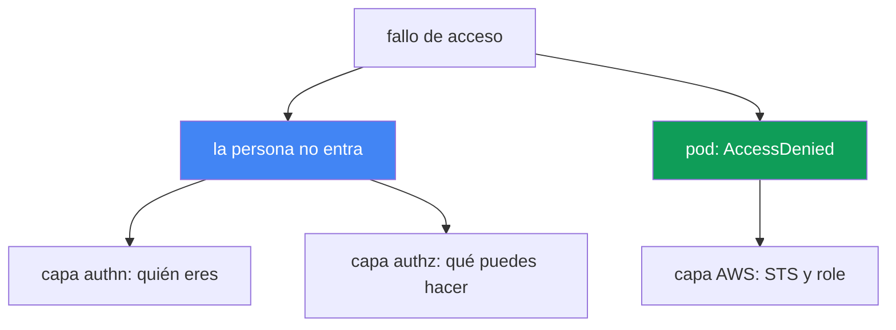
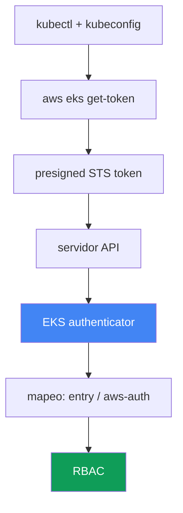

[Русская версия](ru.md) · [Eng version](en.md) · [Version française](fr.md) · [Deutsche Version](de.md) · [ქართული ვერსია](ge.md) · [繁體中文版](tw.md) · [日本語版](jp.md)
# Capítulo 47. Acceso e IAM: access entries, IRSA y Pod Identity, webhook, kubeconfig

> **Qué sigue.** Los capítulos 45 y 46 trataron el hardware y la red: un nodo no se unió, el tráfico no
> fluye. Aquí hay otros dos tipos de fallos: una persona o CI no puede alcanzar el clúster, y
> un pod recibe `AccessDenied` al llamar a AWS, aunque se le haya configurado acceso. El funcionamiento
> se analiza en otros capítulos: IRSA, capítulo 16; Pod Identity, capítulo 17; access entries y
> aws-auth como mecanismos de acceso, capítulo 5; autorización del rol de nodo, capítulo 45. Aquí veremos
> cómo identificar por el síntoma en qué capa se rompió el acceso y cómo confirmarlo.

## 47.1. Dos síntomas: una persona no entra, un pod recibe una denegación

El acceso falla en dos ejes independientes, y no se deben confundir.

**Una persona o CI no puede alcanzar el clúster.** `kubectl` responde con una denegación incluso antes
 de llegar a un recurso concreto:

```bash
kubectl get pods
# error: You must be logged in to the server (Unauthorized)
```

O una forma menos obvia del mismo problema:

```bash
kubectl get nodes
# couldn't get current server API group list: Unauthorized
```

Ambos mensajes indican lo mismo: el servidor API no reconoció a quien llegó. Es la capa de
autenticación: no se pudo demostrar la IAM identity o no hay con qué mapearla dentro del clúster.

**Un pod recibe `AccessDenied` al llamar a AWS.** Una aplicación con IRSA o Pod Identity configurado
falla al acceder a S3, DynamoDB o Secrets Manager:

```bash
kubectl logs deploy/app
# AccessDenied: User: arn:aws:sts::111122223333:assumed-role/... is not authorized
#   to perform: s3:GetObject on resource: ...
# o: WebIdentityErr: failed to retrieve credentials
```

Esto ya no trata sobre el acceso de una persona al clúster, sino sobre el acceso de un pod a AWS: se
rompió la cadena para obtener credenciales temporales mediante STS.

La idea clave del capítulo: son dos capas diferentes. La primera vive en la cadena `kubectl` - IAM - EKS
authenticator - RBAC. La segunda, en la cadena pod - ServiceAccount - STS - IAM role. El diagnóstico
empieza por nombrar honestamente cuál de los ejes está roto.



## 47.2. La cadena de autenticación de kubectl en EKS

Para solucionar `Unauthorized`, hay que entender cómo `kubectl` demuestra quién es. En EKS no es una
contraseña ni un certificado de cliente, sino una identidad IAM verificada mediante STS.

Pasos de la cadena:

1. `kubectl` lee kubeconfig y encuentra el plugin `exec`: el comando `aws eks get-token`.
2. El plugin forma una **solicitud STS presigned** a `sts:GetCallerIdentity` y la codifica en un token
   con el prefijo `k8s-aws-v1.`. El token está firmado con las credenciales AWS actuales y dura poco.
3. `kubectl` envía el token al servidor API en el encabezado `Authorization`.
4. El servidor API pasa el token al **EKS authenticator** (webhook token authentication del lado del
   control plane). El authenticator "reproduce" la solicitud presigned y descubre qué IAM identity
   la firmó.
5. El authenticator busca esta identity en el mapeo del clúster (access entries o el ConfigMap aws-auth)
   y la convierte en un usuario y grupos de Kubernetes.
6. Después actúa el **RBAC** habitual: roles y bindings deciden qué puede hacer ese usuario.



Comprender la cadena es la clave del diagnóstico. Una ruptura en los pasos 1 a 4 (plugin,
credenciales, token) produce `Unauthorized`. Una ruptura en el paso 5 (identity no mapeada)
también produce `Unauthorized`. Pero el paso 6 ya es `Forbidden`, una historia aparte de la
siguiente sección.

## 47.3. 401 Unauthorized frente a 403 Forbidden

Dos denegaciones parecidas, dos capas distintas y dos correcciones distintas. Mezclarlas es perder
tiempo.

**401 Unauthorized** es un fallo de autenticación. El servidor API no entendió o no reconoció quién
llegó: el plugin no entregó un token, las credenciales vencieron o la IAM identity no está mapeada a un
sujeto de Kubernetes. La corrección está en kubeconfig, las credenciales AWS y el mapeo (access entry o
aws-auth).

**403 Forbidden** es un fallo de autorización. El servidor API ya sabe quién llegó, pero RBAC no da
permiso para la acción:

```bash
kubectl get secrets -n kube-system
# Error from server (Forbidden): secrets is forbidden:
#   User "..." cannot list resource "secrets" in namespace "kube-system"
```

La corrección está en Role/ClusterRole y los bindings; es puro Kubernetes RBAC, conocido de CKA. AWS ya
no tiene nada que ver: la identity está demostrada y mapeada.

| Señal | 401 Unauthorized | 403 Forbidden |
|---|---|---|
| Capa | autenticación: quién eres | autorización: qué puedes hacer |
| Causa | no hay token, venció, identity no mapeada | RBAC no da acceso al recurso |
| Dónde corregir | kubeconfig, credenciales, access entry / aws-auth | Role, ClusterRole, RoleBinding |
| En el mensaje | `Unauthorized`, `must be logged in` | `Forbidden`, `cannot <verb> resource` |

Regla simple: con `Unauthorized`, investigue IAM y el mapeo; con `Forbidden`, investigue RBAC.
`kubectl auth can-i` de la sección 47.7 responde precisamente a la pregunta de autorización.

## 47.4. Access entries frente a aws-auth ConfigMap

El mapeo de una IAM identity a un sujeto de Kubernetes (paso 5 de la cadena) se hace en EKS con dos
mecanismos, y el modo del clúster determina cuál funciona. El funcionamiento de ambos está en el
capítulo 5; aquí vemos cómo rompen el acceso.

El **authentication mode del clúster** es la configuración `accessConfig.authenticationMode`, con tres
valores:

| Modo | Qué funciona | Comentario |
|---|---|---|
| `CONFIG_MAP` | solo aws-auth ConfigMap | clásico, heredado |
| `API_AND_CONFIG_MAP` | access entries y aws-auth | transición, ambas fuentes |
| `API` | solo access entries | ConfigMap se ignora |

Una **access entry** es un registro en la API de EKS ligado al ARN de un rol o usuario. Se le puede dar
una **access policy** (por ejemplo, `AmazonEKSClusterAdminPolicy` o `AmazonEKSAdminPolicy`) o mapearla
a grupos RBAC que ya tengan sus propios Role y ClusterRole vinculados.

El clásico "nos bloqueamos". Dos formas frecuentes de perder el acceso:

- **Solo cluster creator admin.** El IAM principal que creó el clúster obtiene acceso de administrador
  automáticamente. Si no se añadió a nadie más, solo él tiene acceso, y podría ser un rol de CI o de un
  ingeniero que ya no trabaja allí.
- **Se eliminó el propio mapeo en aws-auth.** Un `kubectl edit` descuidado del ConfigMap `aws-auth` y
  se borra la propia línea. En modo `CONFIG_MAP`, eso produce `Unauthorized` de inmediato para todos los
  que ya no estén allí, incluido quien lo editó.

Para corregir un clúster bloqueado:

```bash
# ver el modo actual
aws eks describe-cluster --name <cluster> --query 'cluster.accessConfig'
# activar access entries, si antes solo existía CONFIG_MAP
aws eks update-cluster-config --name <cluster> \
  --access-config authenticationMode=API_AND_CONFIG_MAP
# añadir acceso propio mediante una access entry con política de administrador
aws eks create-access-entry --cluster-name <cluster> --principal-arn <tu-arn>
aws eks associate-access-policy --cluster-name <cluster> --principal-arn <tu-arn> \
  --access-scope type=cluster \
  --policy-arn arn:aws:eks::aws:cluster-access-policy/AmazonEKSClusterAdminPolicy
```

Importante: se puede cambiar a `API_AND_CONFIG_MAP`, pero ya no se puede volver a `CONFIG_MAP`; la
transición hacia access entries es unidireccional. Esto hace de access entries un mecanismo de rescate:
aunque aws-auth esté estropeado, el acceso se recupera mediante la API de EKS, donde deciden los permisos
IAM sobre el propio clúster, no el contenido del ConfigMap.

## 47.5. kubeconfig: causas silenciosas de Unauthorized

A menudo el culpable no es el clúster, sino el kubeconfig local o el entorno. El archivo correcto lo
genera el propio CLI:

```bash
aws eks update-kubeconfig --name <cluster> --region <region>
# si hace falta, con un perfil concreto
aws eks update-kubeconfig --name <cluster> --region <region> --profile <profile>
```

El comando escribe en kubeconfig un context con el server y CA correctos, y una sección `exec` con
`aws eks get-token`. Después aparecen errores típicos:

- **AWS profile o credenciales equivocados.** El plugin `exec` toma las credenciales de la cadena AWS
  habitual (variables de entorno, `AWS_PROFILE`, `~/.aws/credentials`, rol de instancia). Si está activo
  otro perfil, el token lo firmará una identity ajena que puede no estar mapeada: `Unauthorized`.
- **Región equivocada.** En kubeconfig o en `get-token` se indica la región de otro clúster. La solicitud
  va al lugar incorrecto y la identity no coincide con la esperada.
- **Token vencido o en caché.** El token de `get-token` dura poco; si vencieron las propias credenciales
  AWS (por ejemplo, un rol mediante SSO), el plugin no emitirá un token válido.
- **Cluster incorrecto en `update-kubeconfig`.** Se generó un context para un clúster, pero se trabaja en
  otro. `kubectl config current-context` muestra adónde van realmente las solicitudes.

Una bifurcación rápida de "el clúster o yo": si `aws sts get-caller-identity` muestra una identity distinta
de la esperada, el problema es local: perfil o credenciales. Si la identity es correcta y aun así hay
`Unauthorized`, investigue el mapeo de la sección 47.4.

## 47.6. IRSA y Pod Identity: por qué un pod recibe AccessDenied

El segundo eje es el acceso del pod a AWS. Un pod no tiene credenciales AWS por sí mismo; se las da uno
de dos mecanismos. El funcionamiento está en los capítulos 16 y 17; aquí veremos qué comprobar ante
`AccessDenied`.

**IRSA (capítulo 16).** El pod obtiene un token de ServiceAccount, lo intercambia en STS mediante
`sts:AssumeRoleWithWebIdentity` por las credenciales del rol. Lo que se rompe:

- **El clúster no tiene IAM OIDC provider.** Sin un OIDC provider registrado, STS no confía en los tokens
  del clúster y el intercambio no se realiza.
- **Trust policy incorrecta del rol.** En la condición deben coincidir `sub` (igual a
  `system:serviceaccount:<namespace>:<serviceaccount>`) y `aud` (igual a `sts.amazonaws.com`). Un error
  tipográfico en el namespace o en el nombre del SA impide entregar el rol.
- **Falta o es incorrecta la anotación del SA** `eks.amazonaws.com/role-arn`: el pod no sabe qué rol pedir.
- **`sts:AssumeRoleWithWebIdentity` no está permitido** en la trust policy: se rechaza el intercambio del
  token.
- **El token no está montado.** El token proyectado no llegó al pod (se editó el pod, no el Deployment; el
  pod no se recreó).
- **Endpoint STS regional.** Usar STS global en vez de regional añade latencia y fallos; en EKS se espera
  el endpoint regional.

**Pod Identity (capítulo 17).** Es más simple: el agente en el nodo entrega credenciales y el rol se une
al SA mediante una association; no necesita OIDC provider. Lo que se rompe:

- **El addon `eks-pod-identity-agent` no está en ejecución**: no hay quien entregue las credenciales.
- **Falta la association**: el rol no está unido a este SA en este namespace.
- **La trust policy del rol es incorrecta.** El rol debe confiar en el servicio `pods.eks.amazonaws.com`
  con las acciones `sts:AssumeRole` y `sts:TagSession` (sin la última no se etiqueta la sesión y la
  asociación no funciona).
- **El token no está montado en el pod.** Con una association que funciona, el pod recibe un token
  proyectado en la ruta `/var/run/secrets/pods.eks.amazonaws.com/serviceaccount/eks-pod-identity-token`.
  Si falta el archivo, el agente o la association no funcionaron, o el pod no se recreó tras crearla.

Cuándo usar cada uno: IRSA es un mecanismo maduro, funciona sin el agente EKS, pero requiere OIDC provider
y una trust policy cuidadosa para cada clúster. Pod Identity es más nuevo y más fácil de operar: una trust
policy para `pods.eks.amazonaws.com` se reutiliza entre clústeres, y el vínculo se establece mediante una
association. Al investigar, determine primero qué mecanismo está configurado para ese SA y no busque OIDC
donde funciona Pod Identity.

## 47.7. Orden de diagnóstico y herramientas

El acceso se corrige desde el síntoma hacia la capa, exactamente como la red en el capítulo 46. Primero,
qué eje está roto.

```bash
# quién soy realmente a ojos de AWS
aws sts get-caller-identity
# modo de autenticación y accessConfig del clúster
aws eks describe-cluster --name <cluster> --query 'cluster.accessConfig'
# quién está mapeado mediante access entries
aws eks list-access-entries --cluster-name <cluster>
# contenido de aws-auth (si el modo aún lo usa)
kubectl -n kube-system get cm aws-auth -o yaml
# authz: qué puedo hacer realmente
kubectl auth can-i --list
kubectl auth can-i get pods -n <ns>
```

Para el eje del pod:

```bash
# anotación de rol en el ServiceAccount (IRSA)
kubectl get sa <sa> -n <ns> -o jsonpath='{.metadata.annotations.eks\.amazonaws\.com/role-arn}'
# associations de Pod Identity
aws eks list-pod-identity-associations --cluster-name <cluster>
# comprobar si el agente de Pod Identity está en ejecución
kubectl -n kube-system get pods -l app.kubernetes.io/name=eks-pod-identity-agent
# comprobar si el token de Pod Identity está montado en el propio pod (sin archivo: el agente/association no funcionó)
kubectl exec <pod> -n <ns> -- ls /var/run/secrets/pods.eks.amazonaws.com/serviceaccount/
```

Si la cadena de authentication no explica la causa, ayudan los logs del authenticator: forman parte del
control plane logging (capítulos 21 y 34) y muestran si la identity que llegó está mapeada.

Lista de comprobación "síntoma - causa probable - qué comprobar":

| Síntoma | Causa probable | Qué comprobar |
|---|---|---|
| `Unauthorized`, `must be logged in` | identity equivocada o no mapeada | `sts get-caller-identity`, `list-access-entries` |
| `Unauthorized` justo tras `edit aws-auth` | se eliminó el propio mapeo | `get cm aws-auth`, recuperar mediante access entry |
| `Forbidden: cannot <verb>` | RBAC no da acceso | `kubectl auth can-i`, Role y bindings |
| `couldn't get server API group` | kubeconfig o región dañados | `update-kubeconfig`, `current-context`, perfil |
| pod con `AccessDenied` al usar IRSA | trust policy, OIDC, anotación del SA | OIDC provider, `sub`/`aud`, anotación `role-arn` |
| pod con `WebIdentityErr` | token no montado, rol incorrecto | recrear el pod, comprobar trust policy |
| pod con `AccessDenied` al usar Pod Identity | falta association, agente o token | `list-pod-identity-associations`, agente, token en el pod |

La lógica: primero `sts get-caller-identity` responde "quién soy"; después el código de denegación divide
la investigación: `Unauthorized` lleva al mapeo y kubeconfig, `Forbidden` a RBAC y `AccessDenied` desde
un pod a IRSA o Pod Identity. Cada rama lleva a su propia herramienta; no hace falta adivinar.

## 47.8. Cómo se aplica en producción

- **No deje el acceso en un único cluster creator.** Añada de inmediato access entries para roles de
  trabajo del equipo y de CI, para que la salida de una persona o la rotación de un rol no bloqueen el
  clúster.
- **Mantenga el modo `API` o `API_AND_CONFIG_MAP`.** Las access entries se gestionan mediante IAM y
  Terraform, no se rompen con `kubectl edit` y recuperar el acceso no exige que kubectl funcione.
- **Distinga 401 y 403 en el runbook.** La persona de guardia primero mira el código de denegación:
  `Unauthorized` es IAM y mapeo; `Forbidden` es RBAC. Esto ahorra los primeros minutos de un incidente.
- **Estandarice un mecanismo para los pods.** Elija IRSA o Pod Identity como principal y no los mezcle en
  un clúster sin necesidad: habrá menos lugares donde buscar ante `AccessDenied`.
- **Escriba la trust policy de forma restrictiva y siguiendo una plantilla.** Para IRSA: `sub` y `aud`
  exactos; para Pod Identity: `pods.eks.amazonaws.com` con `sts:AssumeRole` y `sts:TagSession`, desde un
  módulo comprobado.
- **Active control plane logging con antelación.** Los logs del authenticator y de la API se necesitan
  precisamente durante un incidente de acceso; activarlos a posteriori es demasiado tarde.

## 47.9. Mini glosario

- **EKS authenticator**: webhook del control plane que verifica el token STS presigned y relaciona una IAM
  identity con un sujeto de Kubernetes.
- **`aws eks get-token`**: plugin `exec` de kubeconfig que genera un token STS presigned para entrar en el
  clúster.
- **Unauthorized (401)**: fallo de autenticación; la identity no está demostrada o no está mapeada.
- **Forbidden (403)**: fallo de autorización; RBAC no da permisos para la acción.
- **authentication mode**: configuración del clúster `API`, `API_AND_CONFIG_MAP` o `CONFIG_MAP` que
  establece la fuente de mapeo.
- **access entry**: registro de la API de EKS que vincula un ARN principal con una access policy o grupos.
- **access policy**: política EKS administrada de acceso al clúster, por ejemplo
  `AmazonEKSClusterAdminPolicy`.
- **aws-auth ConfigMap**: método obsoleto de mapear IAM a RBAC mediante un ConfigMap en el namespace
  kube-system.
- **cluster creator admin**: el IAM principal que creó el clúster recibe acceso de administrador
  automáticamente.
- **IRSA**: acceso de un pod a AWS mediante OIDC y `sts:AssumeRoleWithWebIdentity` (capítulo 16).
- **Pod Identity**: acceso de un pod a AWS mediante el agente `eks-pod-identity-agent` y una association
  (capítulo 17).
- **trust policy**: política de confianza de un IAM role; a quién y bajo qué condiciones se permite
  asumirlo.

## 47.10. Resumen del capítulo

- Los fallos de acceso se dividen en dos ejes: una persona o CI no entra al clúster y un pod recibe
  `AccessDenied` al llamar a AWS. Son capas distintas con herramientas de corrección diferentes.
- Entrar en EKS es la cadena `kubectl` - `aws eks get-token` - STS presigned - authenticator - mapeo -
  RBAC. Entender la cadena localiza la ruptura.
- `Unauthorized` (401) es autenticación: no hay token, venció o la identity no está mapeada. `Forbidden`
  (403) es autorización: RBAC no da acceso. Se corrigen en lugares diferentes.
- El mapeo se define mediante access entries o aws-auth, y el authentication mode del clúster decide qué
  fuente funciona. Las access entries son un mecanismo de rescate ante un clúster bloqueado (capítulo 5).
- El clásico "nos bloqueamos" ocurre si el acceso estaba solo en el cluster creator o se eliminó el propio
  mapeo de aws-auth. Se soluciona cambiando el modo y añadiendo una access entry.
- kubeconfig rompe el acceso silenciosamente: perfil o región equivocados, credenciales vencidas, context
  ajeno. `aws sts get-caller-identity` separa rápidamente un problema local de uno del clúster.
- Un pod recibe `AccessDenied` por una cadena STS rota: para IRSA, OIDC provider, trust policy con
  `sub`/`aud` y anotación del SA; para Pod Identity, agente, association y confianza en
  `pods.eks.amazonaws.com` con `sts:AssumeRole` y `sts:TagSession` (capítulos 16 y 17).

## 47.11. Cómo será útil en el trabajo real

Un incidente de acceso casi siempre llega en el peor momento: CI no puede desplegar un release o un pod
falla al acceder a AWS después del despliegue. La tentación es entrar directamente en RBAC o reescribir
el rol. Gana quien con la primera pregunta separa el eje: ¿una persona no puede entrar o el pod no puede
acceder a AWS? Después, el código de denegación completa la clasificación: `Unauthorized`, `Forbidden` o
`AccessDenied` llevan a tres lugares distintos. `aws sts get-caller-identity` en los primeros segundos
dirá si el problema es suyo o del clúster, y normalmente eso importa más que cualquier kubectl.

En la planificación, las mismas capas se convierten en prevención. Access entries en lugar de aws-auth
sin más, y varios mapeos de administrador en lugar de un solo cluster creator eliminan toda una clase de
"nos bloqueamos". Un mecanismo uniforme de acceso de pods y una trust policy de un módulo comprobado
hacen que `AccessDenied` sea poco frecuente y predecible. Y control plane logging activado de antemano
convierte un `Unauthorized` silencioso en un registro donde se ve a quién y por qué no se reconoció.

## 47.12. Preguntas de autoevaluación

1. ¿En qué dos ejes independientes se dividen los fallos de acceso en EKS y por qué no se deben confundir?
2. Describa la cadena de autenticación de `kubectl` en EKS, desde kubeconfig hasta RBAC. ¿Dónde se rompe un 401?
3. ¿Qué hace exactamente `aws eks get-token` y qué tipo de token forma?
4. ¿En qué se diferencia `Unauthorized` (401) de `Forbidden` (403) según la capa y el lugar de corrección?
5. ¿Qué tres authentication mode puede tener el clúster y qué fuente permite cada uno?
6. ¿Cómo se puede "bloquear" un clúster y por qué las access entries sirven como mecanismo de rescate?
7. ¿Qué errores silenciosos de kubeconfig producen `Unauthorized` y cómo distinguirlos de un fallo del clúster?
8. ¿Qué comprobar en orden ante `AccessDenied` de un pod con IRSA (capítulo 16)?
9. ¿Qué papel desempeñan en IRSA las condiciones `sub` y `aud` de la trust policy y la anotación del SA?
10. ¿Qué se necesita para Pod Identity y qué trust policy requiere el rol (capítulo 17)?
11. ¿Cuándo se elige IRSA y cuándo Pod Identity, y cómo influye esto en el diagnóstico?
12. ¿Qué comandos dan una visión rápida de quién soy, modo del clúster, mapeo, permisos y associations?
13. ¿Cómo ayudan los logs del authenticator y dónde se activan (capítulos 21 y 34)?

## Práctica

El laboratorio del curso para este tema: [laboratorio 121 - troubleshooting de acceso](../../labs/121/README_ES.MD).
En él provocará con sus propias manos las tres denegaciones y las distinguirá: `AccessDenied` de IAM,
`Unauthorized` para un rol sin access entry, `Forbidden` con la política view y después
`AccessDenied` en `AssumeRoleWithWebIdentity` debido a la discrepancia de `sub` en la trust policy; la
comprobación se hace con el comando `check_result`. Ejecución: `TASK=121 make run_eks_task`.

Además del laboratorio, este capítulo es un runbook de diagnóstico de acceso. Todas las comprobaciones son
seguras en un clúster sano y muestran cómo es la normalidad para reconocer más deprisa una desviación.

Primero, vea quién es a ojos de AWS y en qué modo está el clúster:

```bash
# su IAM identity real
aws sts get-caller-identity
# modo de autenticación y accessConfig
aws eks describe-cluster --name <cluster> --query 'accessConfig'
# quién está mapeado mediante access entries
aws eks list-access-entries --cluster-name <cluster>
```

Después compruebe su autorización dentro del clúster: es la capa RBAC, no IAM:

```bash
# lista completa de lo que puede hacer
kubectl auth can-i --list
# comprobación puntual de una acción concreta
kubectl auth can-i create deployments -n default
```

Por último, examine el acceso de los pods a AWS. Encuentre el ServiceAccount del pod de trabajo y vea
mediante qué mecanismo obtiene credenciales:

```bash
# anotación de rol para IRSA (vacío: IRSA no se usa aquí)
kubectl get sa <sa> -n <ns> \
  -o jsonpath='{.metadata.annotations.eks\.amazonaws\.com/role-arn}'
# associations de Pod Identity en el clúster
aws eks list-pod-identity-associations --cluster-name <cluster>
```

Compare el resultado con la lista de comprobación de la sección 47.7: en un clúster sano,
`get-caller-identity` devuelve el rol esperado, las access entries contienen los ARN de trabajo,
`auth can-i --list` corresponde a su rol y los pods tienen una anotación IRSA o una association de Pod
Identity. Si recuerda la normalidad, ante un incidente entenderá de inmediato cuál de los dos ejes de
acceso se rompió.

---
[Índice](../README_ES.md) · [Capítulo 46](../46/es.md) · [Capítulo 48](../48/es.md)
