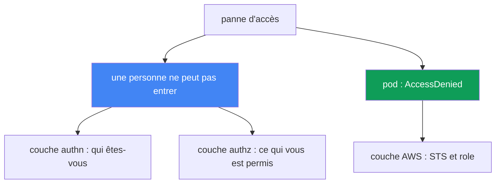
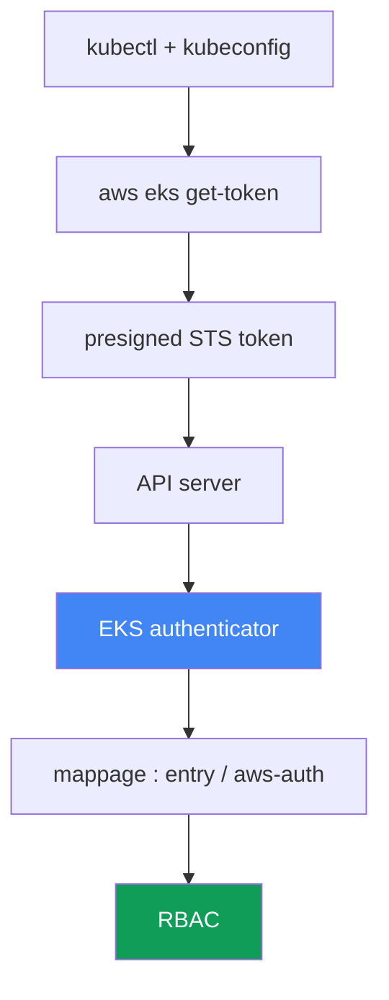

[Русская версия](ru.md) · [Eng version](en.md) · [Versión en español](es.md) · [Deutsche Version](de.md) · [ქართული ვერსია](ge.md) · [繁體中文版](tw.md) · [日本語版](jp.md)
# Chapitre 47. Accès et IAM : access entries, IRSA et Pod Identity, webhook, kubeconfig

> **La suite.** Les chapitres 45 et 46 traitaient du matériel et du réseau : un nœud ne rejoint pas le cluster, le trafic ne passe pas. Ici, nous abordons deux autres classes de pannes : une personne ou une CI ne peut pas atteindre le cluster, et un pod reçoit `AccessDenied` lors d'un appel AWS alors qu'un accès lui a été configuré. Le fonctionnement est traité dans d'autres chapitres : IRSA au chapitre 16, Pod Identity au chapitre 17, les access entries et aws-auth comme mécanismes d'accès au chapitre 5, l'autorisation du rôle du nœud au chapitre 45. Ici, nous verrons comment reconnaître, à partir du symptôme, à quel niveau l'accès est cassé et comment le confirmer.

## 47.1. Deux symptômes : une personne ne peut pas entrer, un pod reçoit un refus

L'accès peut casser selon deux axes indépendants, qu'il ne faut pas confondre.

**Une personne ou une CI ne peut pas atteindre le cluster.** `kubectl` répond par un refus avant même d'arriver à une ressource précise :

```bash
kubectl get pods
# error: You must be logged in to the server (Unauthorized)
```

Ou sous une forme moins évidente du même problème :

```bash
kubectl get nodes
# couldn't get current server API group list: Unauthorized
```

Les deux messages signifient la même chose : l'API server n'a pas reconnu l'appelant. C'est la couche d'authentification : l'IAM identity n'a pas pu être prouvée ou elle ne peut pas être mappée à l'intérieur du cluster.

**Un pod reçoit `AccessDenied` lors d'un appel AWS.** Une application avec IRSA ou Pod Identity configuré échoue lorsqu'elle accède à S3, DynamoDB ou Secrets Manager :

```bash
kubectl logs deploy/app
# AccessDenied: User: arn:aws:sts::111122223333:assumed-role/... is not authorized
#   to perform: s3:GetObject on resource: ...
# ou : WebIdentityErr: failed to retrieve credentials
```

Il ne s'agit déjà plus de l'accès d'une personne au cluster, mais de l'accès du pod à AWS : la chaîne d'obtention d'identifiants temporaires via STS n'a pas été établie.

L'idée clé de ce chapitre : ce sont deux couches distinctes. La première vit dans la chaîne `kubectl` - IAM - EKS authenticator - RBAC. La seconde vit dans la chaîne pod - ServiceAccount - STS - IAM role. Le diagnostic commence par identifier honnêtement lequel des axes est cassé.



## 47.2. La chaîne d'authentification kubectl dans EKS

Pour corriger `Unauthorized`, il faut comprendre comment `kubectl` prouve son identité. Dans EKS, ce n'est ni un mot de passe ni un certificat client, mais une IAM identity vérifiée par STS.

Étapes de la chaîne :

1. `kubectl` lit le kubeconfig et y trouve le plugin `exec` : la commande `aws eks get-token`.
2. Le plugin forme une **requête STS presigned** vers `sts:GetCallerIdentity` et l'encode dans un token avec le préfixe `k8s-aws-v1.`. Le token est signé avec les identifiants AWS actuels et a une courte durée de vie.
3. `kubectl` envoie le token à l'API server dans l'en-tête `Authorization`.
4. L'API server transmet le token à **EKS authenticator** (webhook token authentication côté control plane). L'authenticator « rejoue » la requête presigned et détermine quelle IAM identity l'a signée.
5. L'authenticator cherche cette identity dans le mappage du cluster (access entries ou ConfigMap aws-auth) et la transforme en utilisateur Kubernetes et en groupes.
6. Ensuite, c'est le **RBAC** habituel : les rôles et bindings décident de ce que cet utilisateur peut faire.



Comprendre la chaîne est la clé du diagnostic. Une rupture aux étapes 1 à 4 (plugin, identifiants, token) produit `Unauthorized`. Une rupture à l'étape 5 (identity non mappée) produit également `Unauthorized`. En revanche, l'étape 6 donne `Forbidden`, ce qui constitue une autre situation, traitée dans la section suivante.

## 47.3. 401 Unauthorized contre 403 Forbidden

Deux refus similaires, deux couches différentes et deux corrections différentes. Les mélanger fait perdre du temps.

**401 Unauthorized** correspond à un échec d'authentification. L'API server n'a pas compris ou reconnu l'appelant : le plugin n'a pas fourni de token, les identifiants ont expiré, l'IAM identity n'est pas mappée à un sujet Kubernetes. La correction se trouve dans le kubeconfig, les identifiants AWS et le mappage (access entry ou aws-auth).

**403 Forbidden** correspond à un échec d'autorisation. L'API server sait déjà qui est l'appelant, mais RBAC ne lui accorde pas le droit d'effectuer l'action :

```bash
kubectl get secrets -n kube-system
# Error from server (Forbidden): secrets is forbidden:
#   User "..." cannot list resource "secrets" in namespace "kube-system"
```

La correction se trouve dans Role/ClusterRole et les bindings. C'est du Kubernetes RBAC pur, connu avec CKA. AWS n'intervient déjà plus ici : l'identity est prouvée et mappée.

| Indice | 401 Unauthorized | 403 Forbidden |
|---|---|---|
| Couche | authentification : qui êtes-vous | autorisation : ce qui vous est permis |
| Cause | pas de token, token expiré, identity non mappée | RBAC n'accorde pas le droit sur la ressource |
| Où corriger | kubeconfig, identifiants, access entry / aws-auth | Role, ClusterRole, RoleBinding |
| Dans le message | `Unauthorized`, `must be logged in` | `Forbidden`, `cannot <verb> resource` |

Règle simple : avec `Unauthorized`, examinez IAM et le mappage ; avec `Forbidden`, examinez RBAC. La commande `kubectl auth can-i` de la section 47.7 répond précisément à la question d'autorisation.

## 47.4. Access entries contre ConfigMap aws-auth

Le mappage d'une IAM identity vers un sujet Kubernetes (étape 5 de la chaîne) dans EKS s'effectue par deux mécanismes, et le mode du cluster détermine lequel fonctionne. Le fonctionnement des deux est traité au chapitre 5 ; ici, nous voyons comment ils peuvent casser l'accès.

**Authentication mode du cluster** est le paramètre `accessConfig.authenticationMode`, avec trois valeurs :

| Mode | Ce qui fonctionne | Commentaire |
|---|---|---|
| `CONFIG_MAP` | uniquement le ConfigMap aws-auth | classique, hérité |
| `API_AND_CONFIG_MAP` | les access entries et aws-auth | transition, les deux sources |
| `API` | uniquement les access entries | le ConfigMap est ignoré |

Une **access entry** est une entrée dans l'API EKS, liée à l'ARN d'un rôle ou d'un utilisateur. On peut lui attribuer une **access policy** (par exemple, `AmazonEKSClusterAdminPolicy` ou `AmazonEKSAdminPolicy`) ou la mapper à des groupes RBAC auxquels sont déjà attachés leurs propres Role et ClusterRole.

**Le cas classique du « verrouillage ».** Deux manières fréquentes de perdre l'accès :

- **Un seul cluster creator admin.** L'IAM principal qui a créé le cluster reçoit automatiquement un accès administrateur. Si personne d'autre n'est ajouté, lui seul dispose de l'accès, et il peut s'agir d'un rôle CI ou d'un ingénieur ayant quitté l'entreprise.
- **Suppression de son propre mappage dans aws-auth.** Un `kubectl edit` imprudent du ConfigMap `aws-auth` supprime sa propre ligne. En mode `CONFIG_MAP`, cela provoque immédiatement `Unauthorized` pour tous ceux qui n'y figurent plus, y compris celui qui l'éditait.

Pour corriger un cluster verrouillé :

```bash
# voir le mode actuel
aws eks describe-cluster --name <cluster> --query 'cluster.accessConfig'
# activer les access entries s'il n'y avait que CONFIG_MAP
aws eks update-cluster-config --name <cluster> \
  --access-config authenticationMode=API_AND_CONFIG_MAP
# vous ajouter un accès via une access entry avec la policy administrateur
aws eks create-access-entry --cluster-name <cluster> --principal-arn <votre-arn>
aws eks associate-access-policy --cluster-name <cluster> --principal-arn <votre-arn> \
  --access-scope type=cluster \
  --policy-arn arn:aws:eks::aws:cluster-access-policy/AmazonEKSClusterAdminPolicy
```

Important : il est possible de basculer le mode vers `API_AND_CONFIG_MAP`, mais il n'est plus possible de revenir à `CONFIG_MAP` : la transition vers les access entries est à sens unique. Cela fait des access entries un mécanisme de secours : même si aws-auth est endommagé, l'accès est restauré par l'API EKS, où ce sont les droits IAM sur le cluster lui-même qui comptent, et non le contenu du ConfigMap.

## 47.5. kubeconfig : causes discrètes de Unauthorized

Souvent, le cluster n'est pas en cause, mais le kubeconfig local ou l'environnement. Le CLI génère lui-même le bon fichier :

```bash
aws eks update-kubeconfig --name <cluster> --region <region>
# au besoin, avec un profil précis
aws eks update-kubeconfig --name <cluster> --region <region> --profile <profile>
```

La commande écrit dans le kubeconfig un context avec le server et le CA appropriés, ainsi qu'une section `exec` avec `aws eks get-token`. Les erreurs typiques suivantes subsistent :

- **Mauvais AWS profile ou identifiants.** Le plugin `exec` prend les identifiants depuis la chaîne AWS habituelle (variables d'environnement, `AWS_PROFILE`, `~/.aws/credentials`, rôle d'instance). Si le mauvais profil est actif, le token est signé par une autre identity, qui peut ne pas être mappée : `Unauthorized`.
- **Mauvaise région.** Le kubeconfig ou `get-token` indique la région d'un autre cluster. La requête part au mauvais endroit, l'identity ne correspond pas à celle attendue.
- **Token expiré ou mis en cache.** Le token `get-token` a une courte durée de vie ; si les identifiants AWS eux-mêmes ont expiré (par exemple un rôle via SSO), le plugin ne fournira pas de token valide.
- **Mauvais cluster dans `update-kubeconfig`.** Un context a été généré pour un cluster mais vous travaillez dans un autre. `kubectl config current-context` montre où les requêtes sont réellement envoyées.

Pour trancher rapidement entre « le cluster ou moi » : si `aws sts get-caller-identity` montre une identity différente de celle attendue, le problème est local, dans le profil ou les identifiants. Si l'identity est correcte mais que `Unauthorized` persiste, examinez le mappage de la section 47.4.

## 47.6. IRSA et Pod Identity : pourquoi le pod reçoit AccessDenied

Le second axe concerne l'accès du pod à AWS. Un pod ne possède pas lui-même d'identifiants AWS ; l'un des deux mécanismes les lui fournit. Leur fonctionnement est traité aux chapitres 16 et 17 ; ici, nous voyons quoi vérifier avec `AccessDenied`.

**IRSA (chapitre 16).** Le pod obtient un token ServiceAccount et l'échange dans STS contre les identifiants d'un rôle par `sts:AssumeRoleWithWebIdentity`. Voici ce qui peut casser :

- **Absence d'IAM OIDC provider pour le cluster.** Sans OIDC provider enregistré, STS ne fait pas confiance aux tokens du cluster et l'échange échoue.
- **Trust policy incorrecte du rôle.** La condition doit faire correspondre `sub` (égal à `system:serviceaccount:<namespace>:<serviceaccount>`) et `aud` (égal à `sts.amazonaws.com`). Une faute de frappe dans le namespace ou le nom du SA empêche l'attribution du rôle.
- **Absence ou erreur dans l'annotation du SA** `eks.amazonaws.com/role-arn` : le pod ne sait pas quel rôle demander.
- **`sts:AssumeRoleWithWebIdentity` non autorisé** dans la trust policy : l'échange de token est refusé.
- **Token non monté.** Le token projeté n'est pas arrivé dans le pod (le pod a été modifié au lieu du Deployment ; le pod n'a pas été recréé).
- **Endpoint STS régional.** L'appel au STS global plutôt qu'au STS régional ajoute de la latence et des pannes ; EKS attend l'endpoint régional.

**Pod Identity (chapitre 17).** C'est plus simple : un agent sur le nœud fournit les identifiants, le rôle est lié au SA par une association, et aucun OIDC provider n'est nécessaire. Voici ce qui peut casser :

- **L'addon `eks-pod-identity-agent` n'est pas lancé** : personne ne peut fournir les identifiants.
- **L'association est absente** : le rôle n'est pas lié à ce SA dans ce namespace.
- **La trust policy du rôle est incorrecte.** Le rôle doit faire confiance au service `pods.eks.amazonaws.com` avec les actions `sts:AssumeRole` et `sts:TagSession` (sans cette dernière, la session n'est pas étiquetée et l'association ne fonctionne pas).
- **Le token n'est pas monté dans le pod.** Lorsqu'une association fonctionne, le pod reçoit un token projeté au chemin `/var/run/secrets/pods.eks.amazonaws.com/serviceaccount/eks-pod-identity-token`. L'absence du fichier signifie que l'agent ou l'association n'a pas fonctionné, ou que le pod n'a pas été recréé après la création de l'association.

Quand utiliser quoi : IRSA est un mécanisme mature, qui fonctionne aussi sans agent EKS, mais requiert un OIDC provider et une trust policy soigneuse pour chaque cluster. Pod Identity est plus récent et plus simple à exploiter : une trust policy unique pour `pods.eks.amazonaws.com` est réutilisée entre les clusters, et le lien est défini par l'association. Lors du diagnostic, déterminez d'abord quel mécanisme est configuré pour ce SA, et ne cherchez pas OIDC là où Pod Identity est utilisé.

## 47.7. Ordre du diagnostic et outils

On corrige l'accès du symptôme vers la couche, exactement comme le réseau au chapitre 46. Commencez par déterminer quel axe est cassé.

```bash
# qui suis-je réellement aux yeux d'AWS
aws sts get-caller-identity
# mode d'authentification et accessConfig du cluster
aws eks describe-cluster --name <cluster> --query 'cluster.accessConfig'
# qui est mappé via les access entries
aws eks list-access-entries --cluster-name <cluster>
# contenu de aws-auth (si le mode l'utilise encore)
kubectl -n kube-system get cm aws-auth -o yaml
# authz : ce qui m'est réellement permis
kubectl auth can-i --list
kubectl auth can-i get pods -n <ns>
```

Pour l'axe du pod :

```bash
# annotation de rôle sur le ServiceAccount (IRSA)
kubectl get sa <sa> -n <ns> -o jsonpath='{.metadata.annotations.eks\.amazonaws\.com/role-arn}'
# associations Pod Identity
aws eks list-pod-identity-associations --cluster-name <cluster>
# l'agent Pod Identity est-il lancé ?
kubectl -n kube-system get pods -l app.kubernetes.io/name=eks-pod-identity-agent
# le token Pod Identity est-il monté dans le pod lui-même (pas de fichier : agent/association en échec)
kubectl exec <pod> -n <ns> -- ls /var/run/secrets/pods.eks.amazonaws.com/serviceaccount/
```

Si la chaîne d'authentication ne donne pas la cause, les logs de l'authenticator aident : ils font partie des control plane logging (chapitres 21 et 34) et montrent si l'identity reçue est mappée.

Checklist « symptôme - cause probable - vérification » :

| Symptôme | Cause probable | À vérifier |
|---|---|---|
| `Unauthorized`, `must be logged in` | mauvaise identity ou identity non mappée | `sts get-caller-identity`, `list-access-entries` |
| `Unauthorized` juste après `edit aws-auth` | suppression de son propre mappage | `get cm aws-auth`, restaurer via une access entry |
| `Forbidden: cannot <verb>` | RBAC n'accorde pas le droit | `kubectl auth can-i`, Role et bindings |
| `couldn't get server API group` | kubeconfig ou région incorrects | `update-kubeconfig`, `current-context`, profil |
| pod `AccessDenied` avec IRSA | trust policy, OIDC, annotation SA | OIDC provider, `sub`/`aud`, annotation `role-arn` |
| pod `WebIdentityErr` | token non monté, rôle incorrect | recréer le pod, vérifier la trust policy |
| pod `AccessDenied` avec Pod Identity | absence d'association, d'agent ou de token | `list-pod-identity-associations`, agent, token dans le pod |

La logique est la suivante : `sts get-caller-identity` répond d'abord à « qui suis-je » ; puis le code du refus oriente la suite : `Unauthorized` vers le mappage et kubeconfig, `Forbidden` vers RBAC, `AccessDenied` depuis le pod vers IRSA ou Pod Identity. Chaque branche mène à son propre outil, il est inutile de deviner.

## 47.8. Comment cela est appliqué en production

- **Ne pas laisser l'accès à un unique cluster creator.** Ajoutez aussitôt des access entries pour les rôles de travail de l'équipe et de CI, afin que le départ d'une personne ou la rotation d'un rôle ne verrouille pas le cluster.
- **Maintenir le mode `API` ou `API_AND_CONFIG_MAP`.** Les access entries se gèrent via IAM et Terraform, ne peuvent pas être cassées avec `kubectl edit`, et la restauration de l'accès ne requiert pas un kubectl fonctionnel.
- **Distinguer 401 et 403 dans le runbook.** L'astreinte regarde d'abord le code du refus : `Unauthorized` concerne IAM et le mappage, `Forbidden` concerne RBAC. Cela économise les premières minutes d'un incident.
- **Standardiser un mécanisme pour les pods.** Choisissez IRSA ou Pod Identity comme mécanisme principal et ne les mélangez pas dans le même cluster sans nécessité : il y aura moins d'endroits à examiner avec `AccessDenied`.
- **Écrire des trust policies strictes et sur modèle.** Pour IRSA, utilisez des `sub` et `aud` exacts ; pour Pod Identity, `pods.eks.amazonaws.com` avec `sts:AssumeRole` et `sts:TagSession`, depuis un module éprouvé.
- **Activer les control plane logging à l'avance.** Les logs de l'authenticator et de l'API sont nécessaires précisément pendant un incident d'accès ; les activer après coup est trop tard.

## 47.9. Mini-glossaire

- **EKS authenticator** : webhook du control plane qui vérifie le token STS presigned et associe l'IAM identity à un sujet Kubernetes.
- **`aws eks get-token`** : plugin `exec` du kubeconfig qui forme un token STS presigned pour se connecter au cluster.
- **Unauthorized (401)** : échec d'authentification ; l'identity n'est pas prouvée ou n'est pas mappée.
- **Forbidden (403)** : échec d'autorisation ; RBAC n'accorde pas le droit d'effectuer l'action.
- **authentication mode** : paramètre de cluster `API`, `API_AND_CONFIG_MAP` ou `CONFIG_MAP` qui définit la source du mappage.
- **access entry** : entrée de l'API EKS qui lie un ARN principal à une access policy ou à des groupes.
- **access policy** : politique d'accès EKS gérée vers le cluster, par exemple `AmazonEKSClusterAdminPolicy`.
- **ConfigMap aws-auth** : méthode obsolète de mappage d'IAM vers RBAC par un ConfigMap dans le namespace kube-system.
- **cluster creator admin** : IAM principal qui a créé le cluster et reçoit automatiquement l'accès administrateur.
- **IRSA** : accès d'un pod à AWS par OIDC et `sts:AssumeRoleWithWebIdentity` (chapitre 16).
- **Pod Identity** : accès d'un pod à AWS via l'agent `eks-pod-identity-agent` et une association (chapitre 17).
- **trust policy** : politique de confiance d'un rôle IAM : qui peut l'assumer et dans quelles conditions.

## 47.10. Résumé du chapitre

- Les pannes d'accès se répartissent sur deux axes : une personne ou une CI ne peut pas entrer dans le cluster, et un pod reçoit `AccessDenied` lors d'un appel AWS. Ce sont des couches distinctes avec des outils de correction différents.
- La connexion à EKS suit la chaîne `kubectl` - `aws eks get-token` - STS presigned - authenticator - mappage - RBAC. Comprendre cette chaîne localise la rupture.
- `Unauthorized` (401) concerne l'authentification : absence de token, expiration, identity non mappée. `Forbidden` (403) concerne l'autorisation : RBAC n'accorde pas le droit. Ils se corrigent à des endroits différents.
- Le mappage est défini par les access entries ou aws-auth, et l'authentication mode du cluster détermine quelle source fonctionne. Les access entries sont un mécanisme de secours pour un cluster verrouillé (chapitre 5).
- Le cas classique du « verrouillage » survient lorsque l'accès n'était donné qu'au cluster creator ou que son propre mappage a été supprimé de aws-auth. Il se corrige par un changement de mode et l'ajout d'une access entry.
- kubeconfig casse discrètement la connexion : mauvais profil, région, identifiants expirés, context d'un autre cluster. `aws sts get-caller-identity` sépare rapidement un problème local d'un problème de cluster.
- Un pod reçoit `AccessDenied` à cause d'une chaîne STS rompue : pour IRSA, OIDC provider, trust policy avec `sub`/`aud`, annotation SA ; pour Pod Identity, agent, association, confiance en `pods.eks.amazonaws.com` avec `sts:AssumeRole` et `sts:TagSession` (chapitres 16 et 17).

## 47.11. Utilité dans le travail réel

Un incident d'accès arrive presque toujours au pire moment : la CI ne peut pas déployer une release ou un pod échoue sur AWS après le déploiement. La tentation est d'aller immédiatement dans RBAC ou de réécrire le rôle. Celui qui commence par séparer les axes l'emporte : est-ce une personne qui ne peut pas entrer, ou un pod qui ne peut pas utiliser AWS ? Ensuite, le code du refus achève la classification : `Unauthorized`, `Forbidden` ou `AccessDenied` mènent à trois endroits différents. `aws sts get-caller-identity` indique dès les premières secondes si le problème est du côté local ou du cluster, et cela est le plus souvent plus important que n'importe quelle commande kubectl.

Lors de la planification, ces mêmes couches deviennent de la prévention. Des access entries plutôt qu'un aws-auth seul, et plusieurs mappages administrateurs plutôt qu'un unique cluster creator, éliminent toute une classe de « verrouillages ». Un mécanisme d'accès unique pour les pods et une trust policy provenant d'un module éprouvé rendent `AccessDenied` rare et prévisible. Des control plane logging activés à l'avance transforment un `Unauthorized` muet en une entrée qui indique qui et pourquoi n'a pas été reconnu.

## 47.12. Questions d'auto-évaluation

1. Quels sont les deux axes indépendants sur lesquels se répartissent les pannes d'accès dans EKS et pourquoi ne faut-il pas les confondre ?
2. Décrivez la chaîne d'authentification `kubectl` dans EKS, du kubeconfig jusqu'à RBAC. Où se produit une 401 ?
3. Que fait exactement `aws eks get-token` et quel type de token forme-t-il ?
4. En quoi `Unauthorized` (401) diffère-t-il de `Forbidden` (403), selon la couche et l'emplacement de la correction ?
5. Quels sont les trois authentication mode du cluster et quelle source chacun autorise-t-il ?
6. Comment peut-on « verrouiller » un cluster et pourquoi les access entries servent-elles de mécanisme de secours ?
7. Quelles erreurs discrètes de kubeconfig produisent `Unauthorized` et comment les distinguer d'une panne du cluster ?
8. Que faut-il vérifier dans l'ordre avec `AccessDenied` depuis un pod utilisant IRSA (chapitre 16) ?
9. Quel rôle jouent les conditions `sub` et `aud` dans la trust policy d'IRSA, ainsi que l'annotation SA ?
10. De quoi Pod Identity a-t-il besoin et quelle trust policy le rôle exige-t-il (chapitre 17) ?
11. Quand choisit-on IRSA et quand Pod Identity, et comment cela influence-t-il le diagnostic ?
12. Quelles commandes donnent rapidement une vue d'ensemble : qui suis-je, mode du cluster, mappage, droits, associations ?
13. Comment les logs de l'authenticator aident-ils et où sont-ils activés (chapitres 21 et 34) ?

## Pratique

Le laboratoire du cours sur ce thème est le [laboratoire 121 - diagnostic des accès](../../labs/121/README_FR.MD). Vous y obtenez vous-même les trois refus et les distinguez : `AccessDenied` d'IAM, `Unauthorized` pour un rôle sans access entry, `Forbidden` avec une policy view, puis `AccessDenied` sur `AssumeRoleWithWebIdentity` à cause d'une non-correspondance de `sub` dans la trust policy ; la vérification se fait avec la commande `check_result`. Lancez-le avec `TASK=121 make run_eks_task`.

En plus du laboratoire, ce chapitre est un runbook de diagnostic de l'accès. Toutes les vérifications sont sans danger sur un cluster sain et montrent à quoi ressemble la normale, afin de reconnaître plus vite un écart.

Commencez par voir qui vous êtes aux yeux d'AWS et dans quel mode se trouve le cluster :

```bash
# votre IAM identity réelle
aws sts get-caller-identity
# mode d'authentification et accessConfig
aws eks describe-cluster --name <cluster> --query 'accessConfig'
# qui est mappé via les access entries
aws eks list-access-entries --cluster-name <cluster>
```

Vérifiez ensuite votre autorisation à l'intérieur du cluster : c'est la couche RBAC, pas IAM :

```bash
# liste complète de ce qui vous est permis
kubectl auth can-i --list
# vérification ciblée d'une action précise
kubectl auth can-i create deployments -n default
```

Pour finir, examinez l'accès des pods à AWS. Trouvez le ServiceAccount d'un pod en fonctionnement et voyez par quel mécanisme il obtient ses identifiants :

```bash
# annotation de rôle pour IRSA (vide signifie qu'IRSA n'est pas utilisé ici)
kubectl get sa <sa> -n <ns> \
  -o jsonpath='{.metadata.annotations.eks\.amazonaws\.com/role-arn}'
# associations Pod Identity dans le cluster
aws eks list-pod-identity-associations --cluster-name <cluster>
```

Comparez la situation avec la checklist de la section 47.7 : dans un cluster sain, `get-caller-identity` donne le rôle attendu, les access entries contiennent les ARN utilisés, `auth can-i --list` correspond à votre rôle, et les pods ont soit une annotation IRSA, soit une association Pod Identity. En mémorisant la normale, vous comprendrez immédiatement pendant un incident lequel des deux axes d'accès est cassé.

---
[Table des matières](../README_FR.md) · [Chapitre 46](../46/fr.md) · [Chapitre 48](../48/fr.md)
