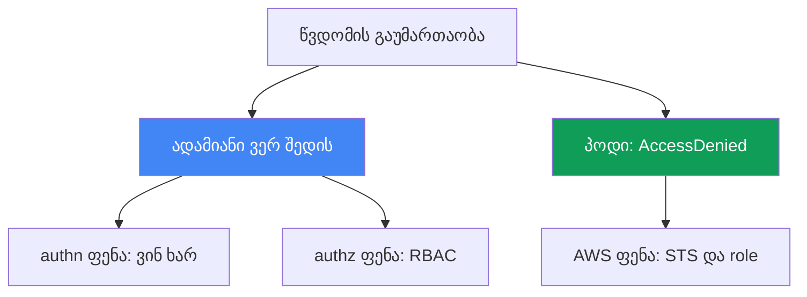
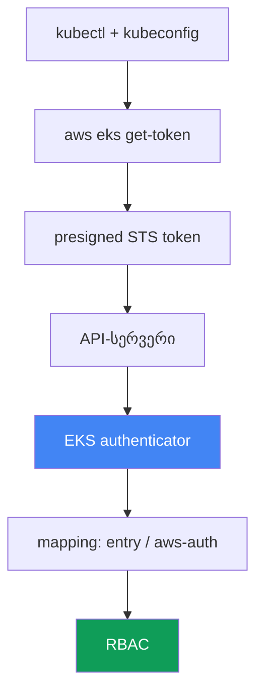

[Русская версия](ru.md) · [Eng version](en.md) · [Versión en español](es.md) · [Version française](fr.md) · [Deutsche Version](de.md) · [繁體中文版](tw.md) · [日本語版](jp.md)
# თავი 47. წვდომა და IAM: access entries, IRSA და Pod Identity, webhook, kubeconfig

> **რა არის შემდეგ.** თავები 45 და 46 ინფრასტრუქტურასა და ქსელს განიხილავდა: ნოდი არ
> შეუერთდა, ტრაფიკი არ მოძრაობს. აქ გაუმართაობების ორ სხვა კლასს განვიხილავთ: ადამიანი ან CI
> კლასტერს ვერ უკავშირდება და პოდი AWS-ის გამოძახებისას `AccessDenied`-ს იღებს, მიუხედავად
> იმისა, რომ მისთვის წვდომა გამართულია. მოწყობა სხვა თავებშია განხილული: IRSA - თავი 16,
> Pod Identity - თავი 17, access entries და aws-auth, როგორც წვდომის მექანიზმები - თავი 5,
> ნოდის როლის ავტორიზაცია - თავი 45. აქ განვიხილავთ, როგორ ამოვიცნოთ სიმპტომით, რომელ ფენაზეა
> წვდომა დარღვეული და რით დავადასტუროთ ეს.

## 47.1. ორი სიმპტომი: ადამიანი ვერ შედის, პოდი უარს იღებს

წვდომა ორ დამოუკიდებელ ღერძზე ირღვევა და მათი ერთმანეთში არევა არ შეიძლება.

**ადამიანი ან CI კლასტერს ვერ უკავშირდება.** `kubectl` უარს მანამდე აბრუნებს, სანამ საქმე
კონკრეტულ რესურსამდე მივა:

```bash
kubectl get pods
# error: You must be logged in to the server (Unauthorized)
```

ან იმავე პრობლემის ნაკლებად აშკარა ფორმა:

```bash
kubectl get nodes
# couldn't get current server API group list: Unauthorized
```

ორივე შეტყობინება ერთ რამეს ნიშნავს: API-სერვერმა მოსული სუბიექტი ვერ ამოიცნო. ეს
ავთენტიფიკაციის ფენაა - IAM identity-ის დამტკიცება ვერ მოხერხდა ან კლასტერში მისი mapping-ის
სამიზნე არ არსებობს.

**პოდი AWS-ის გამოძახებისას `AccessDenied`-ს იღებს.** გამართული IRSA-ს ან Pod Identity-ის
მქონე აპლიკაცია S3-ის, DynamoDB-ის ან Secrets Manager-ის მიმართვისას იშლება:

```bash
kubectl logs deploy/app
# AccessDenied: User: arn:aws:sts::111122223333:assumed-role/... is not authorized
#   to perform: s3:GetObject on resource: ...
# ან: WebIdentityErr: failed to retrieve credentials
```

აქ საქმე უკვე ადამიანის კლასტერზე წვდომას კი არა, პოდის AWS-ზე წვდომას ეხება: STS-ის
მეშვეობით დროებითი credentials-ის მიღების ჯაჭვი ვერ აეწყო.

თავის მთავარი აზრია: ეს ორი სხვადასხვა ფენაა. პირველი `kubectl` - IAM - EKS authenticator -
RBAC ჯაჭვშია. მეორე - პოდი - ServiceAccount - STS - IAM role ჯაჭვში. დიაგნოსტიკა იწყება
იმის ზუსტად დასახელებით, თუ რომელი ღერძია მწყობრიდან გამოსული.



## 47.2. kubectl-ის ავთენტიფიკაციის ჯაჭვი EKS-ში

`Unauthorized`-ის გამოსასწორებლად უნდა გვესმოდეს, საერთოდ როგორ ამტკიცებს `kubectl` თავის
ვინაობას. EKS-ში ეს პაროლი ან კლიენტის სერტიფიკატი კი არა, STS-ის მეშვეობით შემოწმებული
IAM identity-ია.

ჯაჭვის ნაბიჯები:

1. `kubectl` კითხულობს kubeconfig-ს და იქ `exec`-პლაგინს ხედავს: ბრძანებას
   `aws eks get-token`.
2. პლაგინი `sts:GetCallerIdentity`-ის მიმართ **presigned STS მოთხოვნას** ქმნის და მას
   `k8s-aws-v1.` პრეფიქსიან ტოკენში აკოდირებს. ტოკენი მიმდინარე AWS credentials-ით არის
   ხელმოწერილი და მცირე ხანს მოქმედებს.
3. `kubectl` ტოკენს API-სერვერს `Authorization` სათაურში უგზავნის.
4. API-სერვერი ტოკენს **EKS authenticator**-ს გადასცემს (webhook token authentication
   control plane-ის მხარეს). Authenticator presigned მოთხოვნას „ათამაშებს“ და ადგენს, რომელმა
   IAM identity-მ მოაწერა მას ხელი.
5. Authenticator ამ identity-ს კლასტერის mapping-ში (access entries ან aws-auth ConfigMap)
   ეძებს და Kubernetes-ის მომხმარებლად და ჯგუფებად გარდაქმნის.
6. შემდეგ ჩვეულებრივი **RBAC** მუშაობს: როლები და binding-ები წყვეტს, რა შეუძლია ამ
   მომხმარებელს.



ჯაჭვის გაგება დიაგნოსტიკის გასაღებია. 1-4 ნაბიჯებზე (პლაგინი, credentials, ტოკენი) გაწყვეტა
`Unauthorized`-ს იწვევს. მე-5 ნაბიჯზე გაწყვეტაც (identity არ არის mapped) `Unauthorized`-ს
იწვევს. მე-6 ნაბიჯი კი უკვე `Forbidden`-ია, რაც შემდეგი სექციის ცალკე თემაა.

## 47.3. 401 Unauthorized და 403 Forbidden

ორი მსგავსი უარი - ორი სხვადასხვა ფენა და ორი სხვადასხვა გამოსწორების გზა. მათი არევა დროის
კარგვას ნიშნავს.

**401 Unauthorized** - ავთენტიფიკაციის ჩავარდნაა. API-სერვერმა ვერ გაიგო ან ვერ აღიარა, ვინ
მოვიდა: პლაგინმა ტოკენი არ დააბრუნა, credentials-ის ვადა გავიდა, IAM identity Kubernetes-ის
სუბიექტზე არ არის mapped. გამოსწორება საჭიროა kubeconfig-ში, AWS credentials-ში და mapping-ში
(access entry ან aws-auth).

**403 Forbidden** - ავტორიზაციის ჩავარდნაა. API-სერვერმა უკვე იცის, ვინ მოვიდა, მაგრამ RBAC
მოქმედების უფლებას არ აძლევს:

```bash
kubectl get secrets -n kube-system
# Error from server (Forbidden): secrets is forbidden:
#   User "..." cannot list resource "secrets" in namespace "kube-system"
```

გამოსწორება საჭიროა Role/ClusterRole-სა და binding-ებში. ეს CKA-დან ნაცნობი წმინდა Kubernetes
RBAC-ია. AWS აქ არაფერ შუაშია: identity დამტკიცებულია და mapped-ია.

| ნიშანი | 401 Unauthorized | 403 Forbidden |
|---|---|---|
| ფენა | ავთენტიფიკაცია: ვინ ხარ | ავტორიზაცია: რისი უფლება გაქვს |
| მიზეზი | ტოკენი არ არის, ვადა გავიდა, identity არ არის mapped | RBAC რესურსზე უფლებას არ იძლევა |
| სად უნდა გამოსწორდეს | kubeconfig, credentials, access entry / aws-auth | Role, ClusterRole, RoleBinding |
| შეტყობინებაში | `Unauthorized`, `must be logged in` | `Forbidden`, `cannot <verb> resource` |

მარტივი წესი: `Unauthorized` - IAM-სა და mapping-ს ვიკვლევთ; `Forbidden` - RBAC-ს ვიკვლევთ.
47.7 სექციის `kubectl auth can-i` სწორედ ავტორიზაციის კითხვას პასუხობს.

## 47.4. Access entries და aws-auth ConfigMap

IAM identity-ის Kubernetes-ის სუბიექტზე mapping (ჯაჭვის მე-5 ნაბიჯი) EKS-ში ორი მექანიზმით
კეთდება, ხოლო კლასტერის რეჟიმი განსაზღვრავს, რომელი მათგანი მუშაობს. ორივეს მოწყობა მე-5
თავშია განხილული, აქ კი ვნახავთ, როგორ არღვევს ეს წვდომას.

**კლასტერის Authentication mode** - `accessConfig.authenticationMode` პარამეტრია სამი
მნიშვნელობით:

| რეჟიმი | რა მუშაობს | კომენტარი |
|---|---|---|
| `CONFIG_MAP` | მხოლოდ aws-auth ConfigMap | კლასიკური, legacy მიდგომა |
| `API_AND_CONFIG_MAP` | access entries-ც და aws-auth-იც | გარდამავალი, ორივე წყარო |
| `API` | მხოლოდ access entries | ConfigMap იგნორირებულია |

**Access entry** - EKS API-ის ჩანაწერია, რომელიც როლის ან მომხმარებლის ARN-ზეა მიბმული. მას
შეიძლება მიეცეს **access policy** (მაგალითად, `AmazonEKSClusterAdminPolicy` ან
`AmazonEKSAdminPolicy`) ან მოხდეს mapping RBAC ჯგუფებზე, რომლებზეც უკვე საკუთარი Role და
ClusterRole არის მიბმული.

**კლასიკური „ჩავიკეტეთ“.** წვდომის დაკარგვის ორი ხშირი გზა:

- **მხოლოდ cluster creator admin.** კლასტერის შემქმნელი IAM principal ავტომატურად იღებს
  ადმინისტრატორის წვდომას. თუ სხვა არავინ დაამატეს, წვდომა მხოლოდ მას აქვს, ის კი შეიძლება
  CI-ის ან უკვე წასული ინჟინრის როლი ყოფილიყო.
- **საკუთარი mapping წაშალეს aws-auth-იდან.** ConfigMap `aws-auth`-ის დაუდევარი
  `kubectl edit` - და საკუთარი სტრიქონი წაშლილია. `CONFIG_MAP` რეჟიმში ეს მყისიერ
  `Unauthorized`-ს იწვევს ყველასთვის, ვინც იქ აღარ არის, მათ შორის რედაქტორისთვისაც.

ჩაკეტილი კლასტერის გამოსწორება:

```bash
# მიმდინარე რეჟიმის ნახვა
aws eks describe-cluster --name <cluster> --query 'cluster.accessConfig'
# access entries-ის ჩართვა, თუ მანამდე მხოლოდ CONFIG_MAP იყო
aws eks update-cluster-config --name <cluster> \
  --access-config authenticationMode=API_AND_CONFIG_MAP
# საკუთარი წვდომის დამატება access entry-ითა და ადმინისტრატორის პოლიტიკით
aws eks create-access-entry --cluster-name <cluster> --principal-arn <თქვენი-arn>
aws eks associate-access-policy --cluster-name <cluster> --principal-arn <თქვენი-arn> \
  --access-scope type=cluster \
  --policy-arn arn:aws:eks::aws:cluster-access-policy/AmazonEKSClusterAdminPolicy
```

მნიშვნელოვანია: რეჟიმის `API_AND_CONFIG_MAP`-ზე გადართვა შესაძლებელია, მაგრამ
`CONFIG_MAP`-ზე დაბრუნება აღარ შეიძლება - access entries-ისკენ გადასვლა ცალმხრივია. ეს
access entries-ს გადარჩენის მექანიზმად აქცევს: aws-auth-ის დაზიანების შემთხვევაშიც კი წვდომა
EKS API-ით აღდგება, სადაც თავად კლასტერზე IAM უფლებები წყვეტს და არა ConfigMap-ის შიგთავსი.

## 47.5. kubeconfig: Unauthorized-ის უხმაურო მიზეზები

ხშირად დამნაშავე კლასტერი კი არა, ლოკალური kubeconfig ან გარემოა. სწორ ფაილს თავად CLI ქმნის:

```bash
aws eks update-kubeconfig --name <cluster> --region <region>
# საჭიროების შემთხვევაში კონკრეტული პროფილით
aws eks update-kubeconfig --name <cluster> --region <region> --profile <profile>
```

ბრძანება kubeconfig-ში წერს context-ს საჭირო server-ითა და CA-ით და `exec` სექციას
`aws eks get-token`-ით. შემდეგ ტიპური შეცდომები ჩნდება:

- **არასწორი AWS profile ან credentials.** `exec`-პლაგინი credentials-ს AWS-ის ჩვეულებრივი
  ჯაჭვიდან იღებს (გარემოს ცვლადები, `AWS_PROFILE`, `~/.aws/credentials`, ინსტანსის როლი). თუ
  არასწორი პროფილია აქტიური, ტოკენს სხვა identity მოაწერს ხელს და ის შეიძლება mapped არ იყოს,
  რაც `Unauthorized`-ს გამოიწვევს.
- **არასწორი რეგიონი.** kubeconfig-ში ან `get-token`-ში სხვა კლასტერის რეგიონია მითითებული.
  მოთხოვნა არასწორი მიმართულებით მიდის და identity მოსალოდნელს არ ემთხვევა.
- **ვადაგასული ან cache-ში დარჩენილი ტოკენი.** `get-token`-ის ტოკენი ხანმოკლეა; თუ თავად AWS
  credentials-ს გაუვიდა ვადა (მაგალითად, SSO-ით მიღებულ როლს), პლაგინი ვალიდურ ტოკენს ვერ
  გასცემს.
- **არასწორი cluster `update-kubeconfig`-ში.** context ერთი კლასტერისთვის შეიქმნა, მუშაობა კი
  სხვაში მიმდინარეობს. `kubectl config current-context` აჩვენებს, რეალურად სად მიდის
  მოთხოვნები.

სწრაფი განშტოება „კლასტერი თუ მე“: თუ `aws sts get-caller-identity` სხვა identity-ს აჩვენებს
და არა იმას, რომელსაც ელით, პრობლემა ლოკალურია - პროფილი ან credentials. თუ identity სწორია,
მაგრამ მაინც `Unauthorized` მიიღეთ, 47.4 სექციის mapping გამოიკვლიეთ.

## 47.6. IRSA და Pod Identity: რატომ იღებს პოდი AccessDenied-ს

მეორე ღერძი პოდის AWS-ზე წვდომაა. თავად პოდს AWS credentials არ აქვს; მას ერთ-ერთი ორი
მექანიზმი გასცემს. მოწყობა მე-16 და მე-17 თავებშია, აქ კი ვნახავთ, რა უნდა შემოწმდეს
`AccessDenied`-ისას.

**IRSA (თავი 16).** პოდი ServiceAccount-ის ტოკენს იღებს და STS-ში
`sts:AssumeRoleWithWebIdentity`-ის მეშვეობით როლის credentials-ზე ცვლის. რა შეიძლება
გაწყდეს:

- **კლასტერს IAM OIDC provider არ აქვს.** რეგისტრირებული OIDC provider-ის გარეშე STS
  კლასტერის ტოკენებს არ ენდობა და გაცვლა ვერ ხდება.
- **როლის trust policy არასწორია.** პირობებში უნდა ემთხვეოდეს `sub` (უდრის
  `system:serviceaccount:<namespace>:<serviceaccount>`-ს) და `aud` (უდრის
  `sts.amazonaws.com`-ს). namespace-ში ან SA-ის სახელში შეცდომა საკმარისია, რომ როლი არ
  გაიცეს.
- **SA-ს ანოტაცია `eks.amazonaws.com/role-arn` არ აქვს ან არასწორია** - პოდმა არ იცის, რომელი
  როლი მოითხოვოს.
- **trust policy არ უშვებს `sts:AssumeRoleWithWebIdentity`-ს** - ტოკენის გაცვლა უარყოფილია.
- **ტოკენი არ არის დამონტაჟებული.** projected ტოკენი პოდში არ მოხვდა (შეიცვალა პოდი და არა
  Deployment; პოდი თავიდან არ შექმნილა).
- **რეგიონული STS endpoint.** გლობალურ STS-თან მიმართვა რეგიონულის ნაცვლად დამატებით
  დაყოვნებასა და გაუმართაობებს იწვევს; EKS-ში რეგიონული endpoint არის მოსალოდნელი.

**Pod Identity (თავი 17).** უფრო მარტივია: ნოდზე აგენტი credentials-ს გასცემს, როლი SA-სთან
association-ის მეშვეობით არის დაკავშირებული, OIDC provider კი საჭირო არ არის. რა შეიძლება
გაწყდეს:

- **ადონი `eks-pod-identity-agent` არ არის გაშვებული** - credentials-ის გამცემი არავინაა.
- **Association არ არსებობს** - როლი ამ namespace-ის ამ SA-სთან დაკავშირებული არ არის.
- **როლის trust policy არასწორია.** როლი უნდა ენდობოდეს სერვისს `pods.eks.amazonaws.com`
  მოქმედებებით `sts:AssumeRole` და `sts:TagSession` (ამ უკანასკნელის გარეშე სესია არ
  დაიტეგება და association არ იმუშავებს).
- **ტოკენი პოდში არ არის დამონტაჟებული.** მოქმედი association-ის დროს პოდი projected ტოკენს
  იღებს მისამართზე
  `/var/run/secrets/pods.eks.amazonaws.com/serviceaccount/eks-pod-identity-token`. თუ ფაილი
  არ არსებობს, აგენტმა ან association-მა არ იმუშავა, ან პოდი association-ის შექმნის შემდეგ
  თავიდან არ შექმნილა.

როდის რომელი: IRSA მომწიფებული მექანიზმია, EKS აგენტის გარეშეც მუშაობს, მაგრამ მოითხოვს OIDC
provider-სა და თითოეული კლასტერისთვის ზუსტ trust policy-ს. Pod Identity უფრო ახალი და
ექსპლუატაციაში მარტივია: ერთი trust policy `pods.eks.amazonaws.com`-ისთვის კლასტერებს შორის
ხელახლა გამოიყენება, კავშირი კი association-ით განისაზღვრება. კვლევისას ჯერ დაადგინეთ,
რომელი მექანიზმია გამართული ამ SA-სთვის და OIDC-ს იქ ნუ მოძებნით, სადაც Pod Identity მუშაობს.

## 47.7. დიაგნოსტიკის თანმიმდევრობა და ხელსაწყოები

წვდომა სიმპტომიდან ფენისკენ სწორდება, ზუსტად ისე, როგორც ქსელი 46-ე თავში. ჯერ უნდა
განისაზღვროს, რომელი ღერძია მწყობრიდან გამოსული.

```bash
# სინამდვილეში ვინ ვარ AWS-ის თვალში
aws sts get-caller-identity
# კლასტერის ავთენტიფიკაციის რეჟიმი და accessConfig
aws eks describe-cluster --name <cluster> --query 'cluster.accessConfig'
# ვინ არის mapped access entries-ის მეშვეობით
aws eks list-access-entries --cluster-name <cluster>
# რა არის aws-auth-ში (თუ რეჟიმი მას ჯერ კიდევ იყენებს)
kubectl -n kube-system get cm aws-auth -o yaml
# authz: საერთოდ რისი უფლება მაქვს
kubectl auth can-i --list
kubectl auth can-i get pods -n <ns>
```

პოდის ღერძისთვის:

```bash
# როლის ანოტაცია ServiceAccount-ზე (IRSA)
kubectl get sa <sa> -n <ns> -o jsonpath='{.metadata.annotations.eks\.amazonaws\.com/role-arn}'
# Pod Identity association-ები
aws eks list-pod-identity-associations --cluster-name <cluster>
# გაშვებულია თუ არა Pod Identity აგენტი
kubectl -n kube-system get pods -l app.kubernetes.io/name=eks-pod-identity-agent
# დამონტაჟებულია თუ არა Pod Identity ტოკენი თავად პოდში (ფაილი არ არის - აგენტმა/association-მა არ იმუშავა)
kubectl exec <pod> -n <ns> -- ls /var/run/secrets/pods.eks.amazonaws.com/serviceaccount/
```

თუ authentication ჯაჭვი მიზეზზე არაფერს ამბობს, authenticator-ის ლოგები დაგვეხმარება - ისინი
control plane logging-ში შედის (თავები 21 და 34) და აჩვენებს, არის თუ არა მოსული identity
mapped.

ჩეკლისტი „სიმპტომი - სავარაუდო მიზეზი - რა შევამოწმოთ“:

| სიმპტომი | სავარაუდო მიზეზი | რა შევამოწმოთ |
|---|---|---|
| `Unauthorized`, `must be logged in` | სხვა identity ან არ არის mapped | `sts get-caller-identity`, `list-access-entries` |
| `Unauthorized` უშუალოდ `edit aws-auth`-ის შემდეგ | საკუთარი mapping წაშლილია | `get cm aws-auth`, აღდგენა access entry-ით |
| `Forbidden: cannot <verb>` | RBAC უფლებას არ იძლევა | `kubectl auth can-i`, Role და binding-ები |
| `couldn't get server API group` | დაზიანებული kubeconfig ან არასწორი რეგიონი | `update-kubeconfig`, `current-context`, პროფილი |
| პოდის `AccessDenied` IRSA-ს დროს | trust policy, OIDC, SA-ს ანოტაცია | OIDC provider, `sub`/`aud`, `role-arn` ანოტაცია |
| პოდის `WebIdentityErr` | ტოკენი არ არის დამონტაჟებული, არასწორი როლი | პოდის თავიდან შექმნა, trust policy-ის შემოწმება |
| პოდის `AccessDenied` Pod Identity-ის დროს | association, აგენტი ან ტოკენი არ არის | `list-pod-identity-associations`, აგენტი, ტოკენი პოდში |

ლოგიკა: ჯერ `sts get-caller-identity` პასუხობს კითხვას „ვინ ვარ“; შემდეგ უარის კოდის მიხედვით
ვიყოფით - `Unauthorized` mapping-სა და kubeconfig-ში, `Forbidden` RBAC-ში, პოდის
`AccessDenied` კი IRSA-ში ან Pod Identity-ში გვაგზავნის. თითოეულ განშტოებას თავისი ხელსაწყო
აქვს, გამოცნობა საჭირო არ არის.

## 47.8. როგორ იყენებენ ამას production-ში

- **წვდომას ერთ cluster creator-ზე არ ტოვებენ.** გუნდის სამუშაო როლებისა და CI-სთვის access
  entry მაშინვე ემატება, რათა ერთი ადამიანის წასვლამ ან როლის როტაციამ კლასტერი არ ჩაკეტოს.
- **ინარჩუნებენ `API` ან `API_AND_CONFIG_MAP` რეჟიმს.** Access entries IAM-ისა და Terraform-ის
  მეშვეობით იმართება, მათ `kubectl edit` ვერ დააზიანებს და წვდომის აღდგენას მოქმედი kubectl
  არ სჭირდება.
- **runbook-ში 401-სა და 403-ს განასხვავებენ.** მორიგე ჯერ უარის კოდს უყურებს:
  `Unauthorized` - IAM და mapping; `Forbidden` - RBAC. ეს ინციდენტის პირველ წუთებს ზოგავს.
- **პოდებისთვის ერთ მექანიზმს ასტანდარტებენ.** ძირითადად IRSA-ს ან Pod Identity-ს ირჩევენ და
  საჭიროების გარეშე ერთ კლასტერში არ ურევენ - `AccessDenied`-ისას საძიებელი ადგილი ნაკლებია.
- **trust policy-ს ვიწროდ და შაბლონით წერენ.** IRSA-სთვის - ზუსტი `sub` და `aud`, Pod
  Identity-ისთვის - `pods.eks.amazonaws.com` მოქმედებებით `sts:AssumeRole` და
  `sts:TagSession`, შემოწმებული მოდულიდან.
- **control plane logging-ს წინასწარ რთავენ.** authenticator-ისა და API-ის ლოგები სწორედ
  წვდომის ინციდენტის დროს არის საჭირო; მათი ფაქტის შემდეგ ჩართვა დაგვიანებულია.

## 47.9. მინი-ლექსიკონი

- **EKS authenticator** - webhook control plane-ზე, რომელიც presigned STS ტოკენს ამოწმებს და
  IAM identity-ს Kubernetes-ის სუბიექტს შეუსაბამებს.
- **`aws eks get-token`** - `exec`-პლაგინი kubeconfig-ში, რომელიც კლასტერში შესასვლელად
  presigned STS ტოკენს ქმნის.
- **Unauthorized (401)** - ავთენტიფიკაციის ჩავარდნა: identity არ არის დამტკიცებული ან mapped.
- **Forbidden (403)** - ავტორიზაციის ჩავარდნა: RBAC მოქმედების უფლებას არ იძლევა.
- **authentication mode** - კლასტერის `API`, `API_AND_CONFIG_MAP` ან `CONFIG_MAP` პარამეტრი,
  რომელიც mapping-ის წყაროს განსაზღვრავს.
- **access entry** - EKS API-ის ჩანაწერი, რომელიც principal-ის ARN-ს access policy-სთან ან
  ჯგუფებთან აკავშირებს.
- **access policy** - EKS-ის მიერ მართული კლასტერზე წვდომის პოლიტიკა, მაგალითად
  `AmazonEKSClusterAdminPolicy`.
- **aws-auth ConfigMap** - IAM-ის RBAC-ზე mapping-ის მოძველებული მეთოდი kube-system
  namespace-ში ConfigMap-ის მეშვეობით.
- **cluster creator admin** - კლასტერის შემქმნელი IAM principal, რომელიც ადმინისტრატორის
  წვდომას ავტომატურად იღებს.
- **IRSA** - პოდის AWS-ზე წვდომა OIDC-ისა და `sts:AssumeRoleWithWebIdentity`-ის მეშვეობით
  (თავი 16).
- **Pod Identity** - პოდის AWS-ზე წვდომა `eks-pod-identity-agent` აგენტისა და association-ის
  მეშვეობით (თავი 17).
- **trust policy** - IAM როლის ნდობის პოლიტიკა: ვის და რა პირობებით შეუძლია მისი მიღება.

## 47.10. თავის შეჯამება

- წვდომის გაუმართაობები ორ ღერძად იყოფა: ადამიანი ან CI კლასტერში ვერ შედის და პოდი AWS-ის
  გამოძახებისას `AccessDenied`-ს იღებს. ეს სხვადასხვა ფენებია, გამოსწორების სხვადასხვა
  ხელსაწყოებით.
- EKS-ში შესვლა არის ჯაჭვი `kubectl` - `aws eks get-token` - presigned STS - authenticator -
  mapping - RBAC. ჯაჭვის გაგება გაწყვეტის ადგილს განსაზღვრავს.
- `Unauthorized` (401) - ავთენტიფიკაცია: ტოკენი არ არის, ვადა გავიდა, identity არ არის mapped.
  `Forbidden` (403) - ავტორიზაცია: RBAC უფლებას არ იძლევა. ისინი სხვადასხვა ადგილას სწორდება.
- mapping-ს access entries ან aws-auth განსაზღვრავს, ხოლო კლასტერის authentication mode
  წყვეტს, რომელი წყარო მუშაობს. Access entries ჩაკეტილი კლასტერის გადარჩენის მექანიზმია
  (თავი 5).
- კლასიკური „ჩავიკეტეთ“ - წვდომა მხოლოდ cluster creator-ს ჰქონდა ან საკუთარი mapping წაიშალა
  aws-auth-იდან. ეს რეჟიმის შეცვლითა და access entry-ის დამატებით სწორდება.
- kubeconfig შესვლას უხმაუროდ არღვევს: არასწორი პროფილი, რეგიონი, ვადაგასული credentials,
  სხვა context. `aws sts get-caller-identity` ლოკალურ პრობლემას კლასტერის პრობლემისგან სწრაფად
  განასხვავებს.
- პოდი `AccessDenied`-ს STS ჯაჭვის გაწყვეტის გამო იღებს: IRSA-სთვის - OIDC provider, trust
  policy `sub`/`aud`-ით, SA-ს ანოტაცია; Pod Identity-ისთვის - აგენტი, association, ნდობა
  `pods.eks.amazonaws.com`-ისადმი მოქმედებებით `sts:AssumeRole` და `sts:TagSession`
  (თავები 16 და 17).

## 47.11. როგორ გამოგვადგება ეს რეალურ მუშაობაში

წვდომის ინციდენტი თითქმის ყოველთვის ყველაზე ცუდ მომენტში ხდება: CI რელიზს ვერ შლის ან პოდი
deployment-ის შემდეგ AWS-ზე მიმართვისას იშლება. ჩნდება ცდუნება, დაუყოვნებლივ RBAC-ში ჩავიხედოთ
ან როლი თავიდან დავწეროთ. იგებს ის, ვინც პირველივე კითხვით ღერძებს განასხვავებს: ადამიანი ვერ
შედის თუ პოდი ვერ უკავშირდება AWS-ს. შემდეგ უარის კოდი კლასიფიკაციას ასრულებს -
`Unauthorized`, `Forbidden` ან `AccessDenied` სამ სხვადასხვა ადგილას გვაგზავნის.
`aws sts get-caller-identity` პირველივე წამებში გვეუბნება, პრობლემა ჩვენთანაა თუ კლასტერთან,
და ეს ყველაზე ხშირად ნებისმიერ kubectl-ზე მნიშვნელოვანია.

დაგეგმვისას იგივე ფენები პრევენციად გარდაიქმნება. უბრალო aws-auth-ის ნაცვლად access entries
და ერთი cluster creator-ის ნაცვლად რამდენიმე ადმინისტრატორის mapping „ჩავიკეტეთ“ კლასის
პრობლემებს მთლიანად აქრობს. პოდების წვდომის ერთიანი მექანიზმი და შემოწმებული მოდულიდან აღებული
trust policy `AccessDenied`-ს იშვიათსა და პროგნოზირებადს ხდის. წინასწარ ჩართული control plane
logging კი უხმო `Unauthorized`-ს ჩანაწერად აქცევს, სადაც ჩანს, ვინ და რატომ არ იქნა აღიარებული.

## 47.12. თვითშემოწმების კითხვები

1. რომელ ორ დამოუკიდებელ ღერძად იყოფა EKS-ში წვდომის გაუმართაობები და რატომ არ შეიძლება მათი
   ერთმანეთში არევა?
2. აღწერეთ EKS-ში `kubectl`-ის ავთენტიფიკაციის ჯაჭვი kubeconfig-იდან RBAC-მდე. სად წყდება 401?
3. კონკრეტულად რას აკეთებს `aws eks get-token` და რა ტოკენს ქმნის ის?
4. რით განსხვავდება `Unauthorized` (401) `Forbidden`-ისგან (403) ფენისა და გამოსწორების ადგილის
   მიხედვით?
5. კლასტერის რომელი სამი authentication mode არსებობს და mapping-ის რომელ წყაროს უშვებს
   თითოეული?
6. როგორ შეიძლება კლასტერის „ჩაკეტვა“ და რატომ არის access entries გადარჩენის მექანიზმი?
7. kubeconfig-ის რომელი უხმაურო შეცდომები იწვევს `Unauthorized`-ს და როგორ განვასხვავოთ ისინი
   კლასტერის გაუმართაობისგან?
8. რა უნდა შემოწმდეს თანმიმდევრობით IRSA-ს მქონე პოდის `AccessDenied`-ისას (თავი 16)?
9. რა როლს ასრულებს IRSA-ში trust policy-ის `sub` და `aud` პირობები და SA-ს ანოტაცია?
10. რა არის საჭირო Pod Identity-ისთვის და რომელ trust policy-ს მოითხოვს როლი (თავი 17)?
11. როდის ირჩევენ IRSA-ს და როდის Pod Identity-ს, და როგორ მოქმედებს ეს დიაგნოსტიკაზე?
12. რომელი ბრძანებები გვაძლევს სწრაფ სურათს: ვინ ვარ, კლასტერის რეჟიმი, mapping, უფლებები,
    association-ები?
13. როგორ გვეხმარება authenticator-ის ლოგები და სად ირთვება ისინი (თავები 21 და 34)?

## პრაქტიკა

კურსის ლაბა ამ თემისთვის: [ლაბა 121 - წვდომის troubleshooting](../../labs/121/README_GE.MD).
მასში საკუთარი ხელით მიიღებთ სამივე უარს და ერთმანეთისგან განასხვავებთ: `AccessDenied` IAM-ისგან,
`Unauthorized` access entry-ის არმქონე როლისთვის, `Forbidden` view-policy-ის დროს, შემდეგ კი
`AccessDenied`-ს `AssumeRoleWithWebIdentity`-ზე trust policy-ში `sub`-ის შეუსაბამობის გამო;
შემოწმება - `check_result` ბრძანებით. გაშვება - `TASK=121 make run_eks_task`.

ლაბის გარდა, ეს თავი წვდომის სადიაგნოსტიკო runbook-ია. ყველა შემოწმება ჯანმრთელ კლასტერზე
უსაფრთხოა და გვიჩვენებს, როგორ გამოიყურება ნორმა, რათა გადახრა უფრო სწრაფად ამოვიცნოთ.

ჯერ ნახეთ, ვინ ხართ AWS-ის თვალში და რომელ რეჟიმშია კლასტერი:

```bash
# თქვენი რეალური IAM identity
aws sts get-caller-identity
# ავთენტიფიკაციის რეჟიმი და accessConfig
aws eks describe-cluster --name <cluster> --query 'accessConfig'
# ვინ არის mapped access entries-ის მეშვეობით
aws eks list-access-entries --cluster-name <cluster>
```

შემდეგ კლასტერში საკუთარი ავტორიზაცია შეამოწმეთ - ეს RBAC-ის ფენაა და არა IAM:

```bash
# სრული სია იმისა, რისი უფლებაც გაქვთ
kubectl auth can-i --list
# კონკრეტული მოქმედების წერტილოვანი შემოწმება
kubectl auth can-i create deployments -n default
```

ბოლოს პოდების AWS-ზე წვდომა გამოიკვლიეთ. იპოვეთ სამუშაო პოდის ServiceAccount და ნახეთ, რომელი
მექანიზმით იღებს ის credentials-ს:

```bash
# როლის ანოტაცია IRSA-სთვის (ცარიელია - ესე იგი IRSA აქ არ გამოიყენება)
kubectl get sa <sa> -n <ns> \
  -o jsonpath='{.metadata.annotations.eks\.amazonaws\.com/role-arn}'
# კლასტერის Pod Identity association-ები
aws eks list-pod-identity-associations --cluster-name <cluster>
```

სურათი 47.7 სექციის ჩეკლისტს შეადარეთ: ჯანმრთელ კლასტერში `get-caller-identity` მოსალოდნელ
როლს აბრუნებს, access entries სამუშაო ARN-ებს შეიცავს, `auth can-i --list` თქვენს როლს
შეესაბამება, ხოლო პოდებს ან IRSA-ს ანოტაცია აქვთ, ან Pod Identity association. ნორმის
დამახსოვრებით ინციდენტისას მაშინვე მიხვდებით, წვდომის ორი ღერძიდან რომელია მწყობრიდან გამოსული.

---
[სარჩევი](../README_GE.md) · [თავი 46](../46/ge.md) · [თავი 48](../48/ge.md)
