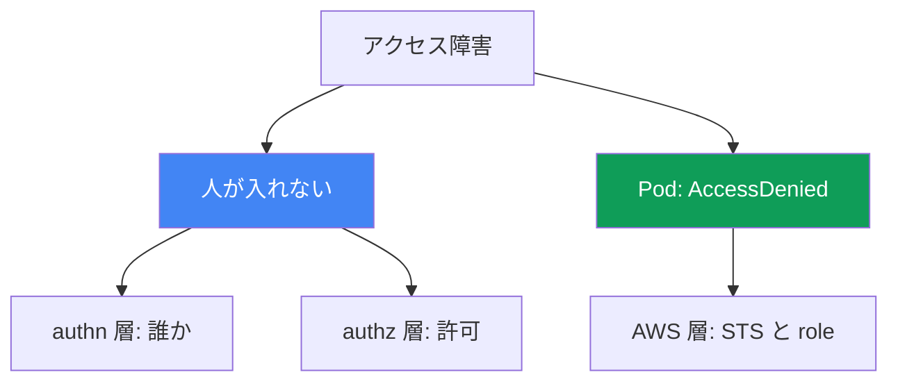
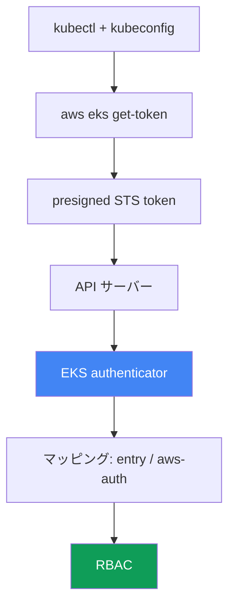

[ロシア語版](ru.md) · [英語版](en.md) · [スペイン語版](es.md) · [フランス語版](fr.md) · [ドイツ語版](de.md) · [ジョージア語版](ge.md) · [繁体字中国語版](tw.md)
# 第47章. アクセスと IAM: access entries、IRSA と Pod Identity、webhook、kubeconfig

> **この先。** 第45章と第46章では、ハードウェアとネットワークを扱いました。ノードが参加しない、トラフィックが流れない、といった問題です。本章では別の二種類の障害を扱います。人や CI がクラスターに到達できない問題と、アクセスを設定した Pod が AWS 呼び出しで `AccessDenied` を受ける問題です。各仕組みの詳細は別章で扱います。IRSA は第16章、Pod Identity は第17章、アクセスの仕組みとしての access entries と aws-auth は第5章、ノードロールの認可は第45章です。本章では症状からどの層でアクセスが壊れたかを見分け、何で確認するかを説明します。

## 47.1. 二つの症状: 人が入れない、Pod が拒否される

アクセスは互いに独立した二つの軸で壊れます。この二つを混同してはいけません。

**人または CI がクラスターに到達できない。** `kubectl` は特定リソースに達する前に拒否を返します。

```bash
kubectl get pods
# error: You must be logged in to the server (Unauthorized)
```

または、同じ問題の分かりにくい形です。

```bash
kubectl get nodes
# couldn't get current server API group list: Unauthorized
```

両方のメッセージが示すことは同じです。API サーバーは到達した主体を認識しませんでした。これは認証の層です。IAM identity を証明できなかったか、クラスター内部で対応付ける先がありません。

**Pod が AWS 呼び出しで `AccessDenied` を受ける。** IRSA または Pod Identity を設定したアプリケーションが、S3、DynamoDB、Secrets Manager へのアクセスで失敗します。

```bash
kubectl logs deploy/app
# AccessDenied: User: arn:aws:sts::111122223333:assumed-role/... is not authorized
#   to perform: s3:GetObject on resource: ...
# または: WebIdentityErr: failed to retrieve credentials
```

これは人のクラスターアクセスではなく、Pod の AWS へのアクセスの問題です。STS を介した一時的な認証情報取得のチェーンを構築できていません。

本章の要点は、これらは別の層だということです。前者は `kubectl` - IAM - EKS authenticator - RBAC のチェーンにあり、後者は Pod - ServiceAccount - STS - IAM role のチェーンにあります。診断は、どちらの軸が壊れたのかを正確に言い切ることから始まります。



## 47.2. EKS における kubectl 認証チェーン

`Unauthorized` を直すには、`kubectl` がそもそも自分をどう証明するかを理解する必要があります。EKS ではパスワードやクライアント証明書ではなく、STS で検証された IAM identity を使います。

チェーンの手順:

1. `kubectl` は kubeconfig を読み、そこに `exec` プラグイン、すなわち `aws eks get-token` コマンドを見つけます。
2. プラグインは `sts:GetCallerIdentity` に対する **presigned STS リクエスト**を作り、`k8s-aws-v1.` プレフィックス付きのトークンにエンコードします。トークンは現在の AWS 認証情報で署名され、短時間だけ有効です。
3. `kubectl` は `Authorization` ヘッダー内のトークンを API サーバーに送ります。
4. API サーバーはトークンを **EKS authenticator** に渡します。これは control plane 側の webhook token authentication です。Authenticator は presigned リクエストを「再生」し、どの IAM identity が署名したかを特定します。
5. Authenticator はクラスターのマッピング内、つまり access entries または aws-auth ConfigMap でその identity を探し、Kubernetes ユーザーとグループに変換します。
6. その後は通常の **RBAC** です。role と binding が、そのユーザーに許可される操作を決めます。



このチェーンの理解が診断の鍵です。手順 1-4、すなわちプラグイン、認証情報、トークンの切断は `Unauthorized` になります。手順 5、identity がマッピングされていない場合も `Unauthorized` です。一方、手順 6 は `Forbidden` であり、次節の別の問題です。

## 47.3. 401 Unauthorized と 403 Forbidden

似た二つの拒否は、二つの異なる層と修正を意味します。混同すれば時間を失います。

**401 Unauthorized** は認証の失敗です。API サーバーは到達した主体を理解または認識できませんでした。プラグインがトークンを返さない、認証情報が期限切れ、IAM identity が Kubernetes の主体にマッピングされていない、という場合です。修正箇所は kubeconfig、AWS 認証情報、マッピング、すなわち access entry または aws-auth です。

**403 Forbidden** は認可の失敗です。到達した主体を API サーバーはすでに知っていますが、RBAC がその操作を許可していません。

```bash
kubectl get secrets -n kube-system
# Error from server (Forbidden): secrets is forbidden:
#   User "..." cannot list resource "secrets" in namespace "kube-system"
```

修正箇所は Role/ClusterRole と binding です。これは CKA でなじみのある純粋な Kubernetes RBAC です。AWS はすでに関係ありません。identity は証明され、マッピングも済んでいます。

| 特徴 | 401 Unauthorized | 403 Forbidden |
|---|---|---|
| 層 | 認証: 誰か | 認可: 何が許可されるか |
| 原因 | トークンなし、期限切れ、identity が未マッピング | RBAC がリソースの権限を与えない |
| 修正箇所 | kubeconfig、認証情報、access entry / aws-auth | Role、ClusterRole、RoleBinding |
| メッセージ | `Unauthorized`、`must be logged in` | `Forbidden`、`cannot <verb> resource` |

単純な規則です。`Unauthorized` なら IAM とマッピングを調べ、`Forbidden` なら RBAC を調べます。47.7 節の `kubectl auth can-i` は、まさに認可の問いに答えます。

## 47.4. Access entries と aws-auth ConfigMap

IAM identity を Kubernetes の主体にマッピングする、つまりチェーンの手順 5 は、EKS では二つの仕組みで行われます。クラスターのモードが、どちらが動作するかを決めます。双方の仕組みは第5章で扱っています。ここでは、これがどうアクセス障害になるかを説明します。

**クラスターの authentication mode** は、`accessConfig.authenticationMode` の設定で、三つの値があります。

| モード | 動作するもの | コメント |
|---|---|---|
| `CONFIG_MAP` | aws-auth ConfigMap のみ | 従来方式、レガシー |
| `API_AND_CONFIG_MAP` | access entries と aws-auth の両方 | 移行用、両方のソース |
| `API` | access entries のみ | ConfigMap は無視される |

**Access entry** は、role または user の ARN に結び付く EKS API のレコードです。**access policy**、例えば `AmazonEKSClusterAdminPolicy` や `AmazonEKSAdminPolicy` を与えるか、すでに Role と ClusterRole が結び付けられた RBAC グループへマッピングできます。

**典型的な「ロックアウト」。** アクセスを失うよくある二つの方法があります。

- **cluster creator admin だけ。** クラスターを作成した IAM principal は、自動的に管理者アクセスを受けます。他の主体を追加していなければ、アクセスできるのはその principal だけです。その principal は CI の role や退職したエンジニアの role だったかもしれません。
- **aws-auth の自分のマッピングを削除した。** ConfigMap `aws-auth` に対する不注意な `kubectl edit` により、自分の行が削除されます。`CONFIG_MAP` モードでは、その中にいない全員に即座に `Unauthorized` が発生し、編集した本人も含まれます。

ロックアウトされたクラスターの修復:

```bash
# 現在のモードを確認する
aws eks describe-cluster --name <cluster> --query 'cluster.accessConfig'
# CONFIG_MAP のみなら access entries を有効にする
aws eks update-cluster-config --name <cluster> \
  --access-config authenticationMode=API_AND_CONFIG_MAP
# 管理者ポリシーを持つ access entry で自分のアクセスを追加する
aws eks create-access-entry --cluster-name <cluster> --principal-arn <あなたの-arn>
aws eks associate-access-policy --cluster-name <cluster> --principal-arn <あなたの-arn> \
  --access-scope type=cluster \
  --policy-arn arn:aws:eks::aws:cluster-access-policy/AmazonEKSClusterAdminPolicy
```

重要: モードは `API_AND_CONFIG_MAP` に切り替えられますが、`CONFIG_MAP` へ戻すことはできません。access entries 方向への移行は一方向です。このため access entries は救済の仕組みになります。aws-auth が壊れていても、ConfigMap の内容ではなくクラスター自体への IAM 権限で決まる EKS API を通じて、アクセスを復旧できます。

## 47.5. kubeconfig: 気付きにくい Unauthorized の原因

原因はクラスターではなく、ローカルの kubeconfig や環境であることがよくあります。正しいファイルは CLI 自身に生成させます。

```bash
aws eks update-kubeconfig --name <cluster> --region <region>
# 特定の profile が必要な場合
aws eks update-kubeconfig --name <cluster> --region <region> --profile <profile>
```

このコマンドは、正しい server、CA、および `aws eks get-token` を持つ `exec` セクションを kubeconfig context に書き込みます。その後によくある問題があります。

- **誤った AWS profile または認証情報。** `exec` プラグインは通常の AWS 認証情報チェーン、環境変数、`AWS_PROFILE`、`~/.aws/credentials`、instance role から認証情報を得ます。誤った profile が有効なら、トークンは別の identity で署名され、その identity はマッピングされていないかもしれません。その結果は `Unauthorized` です。
- **誤ったリージョン。** kubeconfig または `get-token` に別のクラスターのリージョンが指定されています。リクエストは別の場所へ送られ、identity は期待されるものと一致しません。
- **期限切れまたはキャッシュされたトークン。** `get-token` のトークンは短命です。AWS 認証情報自体、例えば SSO の role が期限切れなら、プラグインは有効なトークンを発行できません。
- **`update-kubeconfig` のクラスターが誤っている。** 一つのクラスター用の context を生成して、別のクラスターで作業しています。`kubectl config current-context` は、実際にリクエストが向かう先を示します。

「クラスターか自分か」を素早く分けるには、`aws sts get-caller-identity` を使います。期待する identity でなければ、問題はローカルの profile または認証情報です。identity が正しいのに `Unauthorized` なら、47.4 節のマッピングを調べます。

## 47.6. IRSA と Pod Identity: Pod が AccessDenied を受ける理由

二つ目の軸は Pod の AWS へのアクセスです。Pod 自体は AWS 認証情報を持ちません。二つの仕組みの一方が認証情報を与えます。仕組みの詳細は第16章と第17章で扱います。ここでは `AccessDenied` のときに確認することを説明します。

**IRSA (第16章)。** Pod は ServiceAccount トークンを受け取り、`sts:AssumeRoleWithWebIdentity` を通じて STS で role の認証情報と交換します。壊れる箇所:

- **クラスターに IAM OIDC provider がない。** 登録済みの OIDC provider がなければ、STS はクラスターのトークンを信頼せず、交換は通りません。
- **role の trust policy が誤っている。** 条件内で `sub`、つまり `system:serviceaccount:<namespace>:<serviceaccount>` と、`aud`、つまり `sts.amazonaws.com` が一致しなければなりません。namespace または SA 名のタイプミスにより、role は発行されません。
- **SA のアノテーション** `eks.amazonaws.com/role-arn` がない、または誤っているため、Pod は要求すべき role を知りません。
- **`sts:AssumeRoleWithWebIdentity` が許可されていない。** trust policy がトークン交換を拒否します。
- **トークンがマウントされていない。** projected token が Pod に入りません。Deployment ではなく Pod を編集した、または Pod が再作成されていない場合です。
- **リージョナル STS endpoint。** グローバル STS ではなくリージョナル STS への呼び出しが必要です。グローバル STS を使うと余分な遅延や障害が発生し、EKS ではリージョナル endpoint が想定されます。

**Pod Identity (第17章)。** より単純です。ノード上の agent が認証情報を発行し、role は association を介して SA に結び付きます。OIDC provider は不要です。壊れる箇所:

- **アドオン `eks-pod-identity-agent` が動作していない。** 認証情報を発行するものがありません。
- **Association が存在しない。** role が、その namespace のその SA に結び付いていません。
- **role の trust policy が誤っている。** role は `pods.eks.amazonaws.com` を信頼し、`sts:AssumeRole` と `sts:TagSession` のアクションを持つ必要があります。後者がなければセッションにタグを付けられず、association は動作しません。
- **トークンが Pod にマウントされていない。** association が動作していれば、Pod は `/var/run/secrets/pods.eks.amazonaws.com/serviceaccount/eks-pod-identity-token` のパスに projected token を受け取ります。ファイルがなければ、agent か association が動作していないか、作成後に Pod が再作成されていません。

使い分け: IRSA は成熟した仕組みで、EKS agent の外でも動作しますが、OIDC provider と各クラスターに対する慎重な trust policy が必要です。Pod Identity は新しく、運用が簡単です。`pods.eks.amazonaws.com` 向けの一つの trust policy をクラスター間で再利用でき、結び付きは association で定義します。調査ではまず、この SA にどちらの仕組みが設定されているかを特定し、Pod Identity が動いている場所で OIDC を探さないでください。

## 47.7. 診断の順序とツール

アクセスは、ネットワークを第46章で扱ったのと同様に、症状から層へ向かって修復します。最初に、どちらの軸が壊れたかを決めます。

```bash
# AWS から見た実際の自分
aws sts get-caller-identity
# クラスターの認証モードと accessConfig
aws eks describe-cluster --name <cluster> --query 'cluster.accessConfig'
# access entries を通じてマッピングされている主体
aws eks list-access-entries --cluster-name <cluster>
# aws-auth の内容。モードがまだこれを使用する場合
kubectl -n kube-system get cm aws-auth -o yaml
# authz: 実際に許可されていること
kubectl auth can-i --list
kubectl auth can-i get pods -n <ns>
```

Pod の軸には次を使います。

```bash
# ServiceAccount 上の role アノテーション (IRSA)
kubectl get sa <sa> -n <ns> -o jsonpath='{.metadata.annotations.eks\.amazonaws\.com/role-arn}'
# Pod Identity の association
aws eks list-pod-identity-associations --cluster-name <cluster>
# Pod Identity agent が動いているか
kubectl -n kube-system get pods -l app.kubernetes.io/name=eks-pod-identity-agent
# Pod Identity token が Pod 自身にマウントされているか。ファイルがなければ agent/association が失敗
kubectl exec <pod> -n <ns> -- ls /var/run/secrets/pods.eks.amazonaws.com/serviceaccount/
```

authentication のチェーンが原因を示さない場合、authenticator のログが役立ちます。これらは control plane logging に含まれ、第21章と第34章で扱います。到達した identity がマッピングされたかを示します。

「症状 - 可能性が高い原因 - 確認項目」のチェックリスト:

| 症状 | 可能性が高い原因 | 確認項目 |
|---|---|---|
| `Unauthorized`、`must be logged in` | identity が違う、または未マッピング | `sts get-caller-identity`、`list-access-entries` |
| `edit aws-auth` の直後の `Unauthorized` | 自分のマッピングを削除した | `get cm aws-auth`、access entry で復旧 |
| `Forbidden: cannot <verb>` | RBAC が権限を与えない | `kubectl auth can-i`、Role と binding |
| `couldn't get server API group` | kubeconfig またはリージョンが壊れている | `update-kubeconfig`、`current-context`、profile |
| IRSA で Pod が `AccessDenied` | trust policy、OIDC、SA アノテーション | OIDC provider、`sub`/`aud`、`role-arn` アノテーション |
| Pod が `WebIdentityErr` | トークン未マウント、role が誤っている | Pod を再作成、trust policy を確認 |
| Pod Identity で Pod が `AccessDenied` | association、agent、または token がない | `list-pod-identity-associations`、agent、Pod 内の token |

ロジックはこうです。最初に `sts get-caller-identity` が「自分は誰か」に答えます。次に拒否コードで分岐します。`Unauthorized` はマッピングと kubeconfig、`Forbidden` は RBAC、Pod からの `AccessDenied` は IRSA または Pod Identity に進みます。各分岐は固有のツールへつながるので、推測する必要はありません。

## 47.8. プロダクションでの適用方法

- **アクセスを一人の cluster creator に残さない。** チームと CI の作業用 role に access entry を直ちに追加し、一人の離職や role のローテーションでクラスターがロックアウトされないようにします。
- **`API` または `API_AND_CONFIG_MAP` モードを維持する。** Access entries は IAM と Terraform を通じて管理できます。`kubectl edit` で壊れず、アクセスの復旧に動作中の kubectl を必要としません。
- **runbook で 401 と 403 を区別する。** 当番はまず拒否コードを見ます。`Unauthorized` は IAM とマッピング、`Forbidden` は RBAC です。これによりインシデントの最初の数分を節約できます。
- **Pod には一つの仕組みを標準化する。** IRSA または Pod Identity を主要な仕組みとして選び、必要がない限り同じクラスターで混在させません。`AccessDenied` のときに探す場所が減ります。
- **trust policy を狭く、テンプレートに基づいて書く。** IRSA では正確な `sub` と `aud`、Pod Identity では `sts:AssumeRole` と `sts:TagSession` を持つ `pods.eks.amazonaws.com` を、検証済みモジュールから使います。
- **control plane logging をあらかじめ有効化する。** authenticator と API のログはアクセスインシデントの最中に必要です。事後に有効化しても遅すぎます。

## 47.9. ミニ用語集

- **EKS authenticator** - presigned STS token を検証し、IAM identity を Kubernetes の主体に対応付ける control plane 上の webhook。
- **`aws eks get-token`** - クラスターに入るための presigned STS token を生成する kubeconfig 内の `exec` プラグイン。
- **Unauthorized (401)** - 認証の失敗。identity が証明されていないか、マッピングされていない。
- **Forbidden (403)** - 認可の失敗。RBAC が操作の権限を与えない。
- **authentication mode** - マッピング元を決める、クラスターの `API`、`API_AND_CONFIG_MAP`、または `CONFIG_MAP` 設定。
- **access entry** - ARN principal を access policy またはグループに結び付ける EKS API のレコード。
- **access policy** - 例えば `AmazonEKSClusterAdminPolicy` のような、クラスターに対する EKS 管理アクセスポリシー。
- **aws-auth ConfigMap** - kube-system namespace の ConfigMap を通じて IAM を RBAC にマッピングする、旧式の方法。
- **cluster creator admin** - クラスターを作成した IAM principal は、自動的に管理者アクセスを得る。
- **IRSA** - OIDC と `sts:AssumeRoleWithWebIdentity` を介する Pod の AWS アクセス (第16章)。
- **Pod Identity** - `eks-pod-identity-agent` と association を介する Pod の AWS アクセス (第17章)。
- **trust policy** - どの主体がどの条件で IAM role を引き受けることを許可されるかを定める、IAM role の信頼ポリシー。

## 47.10. 本章のまとめ

- アクセス障害は二つの軸に分かれます。人または CI がクラスターに入れない問題と、Pod が AWS 呼び出しで `AccessDenied` を受ける問題です。これらは修復ツールも異なる別の層です。
- EKS へのログインは、`kubectl` - `aws eks get-token` - presigned STS - authenticator - マッピング - RBAC のチェーンです。このチェーンを理解すれば切断箇所を特定できます。
- `Unauthorized` (401) は認証です。トークンがない、期限切れ、identity が未マッピングです。`Forbidden` (403) は認可で、RBAC が権限を与えません。修正箇所は異なります。
- マッピングは access entries または aws-auth が提供し、クラスターの authentication mode がどのソースを使うかを決めます。access entries はロックアウトしたクラスターの救済手段です (第5章)。
- 典型的なロックアウトは、アクセスが cluster creator だけだった場合、または aws-auth の自分のマッピングを削除した場合です。モード変更と access entry の追加で直します。
- kubeconfig は静かにログインを壊します。誤った profile、リージョン、期限切れの認証情報、別の context です。`aws sts get-caller-identity` はローカル問題とクラスター問題をすばやく分けます。
- Pod が `AccessDenied` を受けるのは STS チェーンの切断によるものです。IRSA では OIDC provider、`sub`/`aud` を持つ trust policy、SA アノテーションを、Pod Identity では agent、association、`sts:AssumeRole` と `sts:TagSession` を持つ `pods.eks.amazonaws.com` の信頼を確認します (第16章と第17章)。

## 47.11. 実務での役立ち方

アクセスインシデントはほぼ常に最悪の時に起きます。CI がリリースできない、またはデプロイ後の Pod が AWS で失敗する時です。すぐに RBAC を調べたり role を書き換えたりしたくなります。しかし最初の問いで軸を分ける人が優位です。人が入れないのか、Pod が AWS にアクセスできないのか。次に拒否コードが分類を仕上げます。`Unauthorized`、`Forbidden`、`AccessDenied` は三つの別の場所へ導きます。最初の数秒で `aws sts get-caller-identity` を実行すれば、それが自分の問題かクラスターの問題かが分かります。多くの場合、これはどの kubectl よりも重要です。

計画時には同じ層が予防策になります。むき出しの aws-auth ではなく access entries を使い、一人の cluster creator ではなく複数の管理者マッピングを用意すれば、ロックアウトという障害分類全体を排除できます。Pod のアクセスを一つの仕組みに統一し、検証済みモジュールの trust policy を使えば、`AccessDenied` はまれで予測可能になります。さらに、あらかじめ有効にした control plane logging は、無言の `Unauthorized` を、誰がなぜ認識されなかったかが見える記録に変えます。

## 47.12. 自己確認の質問

1. EKS のアクセス障害はどの二つの独立した軸に分かれ、なぜ混同してはいけないのですか。
2. kubeconfig から RBAC までの EKS における `kubectl` 認証チェーンを説明してください。401 はどこで切れますか。
3. `aws eks get-token` は正確には何を行い、どのようなトークンを生成しますか。
4. `Unauthorized` (401) と `Forbidden` (403) は、層と修正箇所でどう違いますか。
5. クラスターにある三つの authentication mode と、それぞれが許可するソースは何ですか。
6. クラスターをどのようにロックアウトでき、なぜ access entries が救済の仕組みになるのですか。
7. kubeconfig のどの気付きにくい誤りが `Unauthorized` を引き起こし、クラスター障害とどう区別しますか。
8. IRSA を使う Pod から `AccessDenied` が起きたとき、どの順序で何を確認しますか (第16章)。
9. IRSA で trust policy の `sub` と `aud` 条件、そして SA アノテーションはどのような役割を果たしますか。
10. Pod Identity には何が必要で、role はどのような trust policy を必要としますか (第17章)。
11. IRSA と Pod Identity はいつ選び、診断にどのような影響がありますか。
12. 誰であるか、クラスターのモード、マッピング、権限、association をすばやく把握するコマンドは何ですか。
13. authenticator のログはどのように役立ち、どこで有効にしますか (第21章と第34章)。

## 実践

このテーマのコースラボは、[ラボ 121: アクセスのトラブルシューティング](../../labs/121/README_JP.MD) です。このラボでは、三つの拒否を自分で発生させて区別します。IAM からの `AccessDenied`、access entry のない role による `Unauthorized`、view ポリシーにおける `Forbidden`、そして trust policy 内の `sub` 不一致による `AssumeRoleWithWebIdentity` の `AccessDenied` です。確認には `check_result` コマンドを使います。起動は `TASK=121 make run_eks_task` です。

ラボに加えて、本章はアクセスの診断 runbook です。すべての確認は健全なクラスター上で安全に実行でき、正常な状態を確認することで、逸脱をより早く見つけられます。

まず、AWS から見た自分とクラスターのモードを確認します。

```bash
# 実際の IAM identity
aws sts get-caller-identity
# 認証モードと accessConfig
aws eks describe-cluster --name <cluster> --query 'accessConfig'
# access entries を通じてマッピングされている主体
aws eks list-access-entries --cluster-name <cluster>
```

次に、クラスター内部での自分の認可を確認します。これは IAM ではなく RBAC の層です。

```bash
# 許可されているすべての操作の一覧
kubectl auth can-i --list
# 特定の操作の個別確認
kubectl auth can-i create deployments -n default
```

最後に Pod の AWS へのアクセスを調べます。実行中の Pod の ServiceAccount を特定し、どの仕組みで認証情報を取得するかを確認します。

```bash
# IRSA の role アノテーション。空なら IRSA はここで使用されていない
kubectl get sa <sa> -n <ns> \
  -o jsonpath='{.metadata.annotations.eks\.amazonaws\.com/role-arn}'
# クラスター内の Pod Identity association
aws eks list-pod-identity-associations --cluster-name <cluster>
```

47.7 節のチェックリストと照らし合わせてください。健全なクラスターでは、`get-caller-identity` は期待する role を返し、access entries には作業用 ARN が含まれ、`auth can-i --list` は自分の role に対応し、Pod には IRSA アノテーションまたは Pod Identity association のいずれかがあります。正常な状態を覚えておけば、インシデント時に二つのアクセス軸のどちらが壊れたかをすぐに理解できます。

---
[目次](../README_JP.md) · [第46章](../46/jp.md) · [第48章](../48/jp.md)
