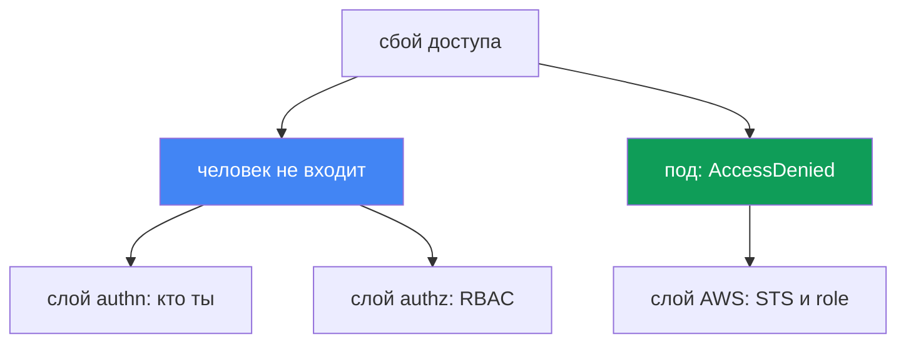
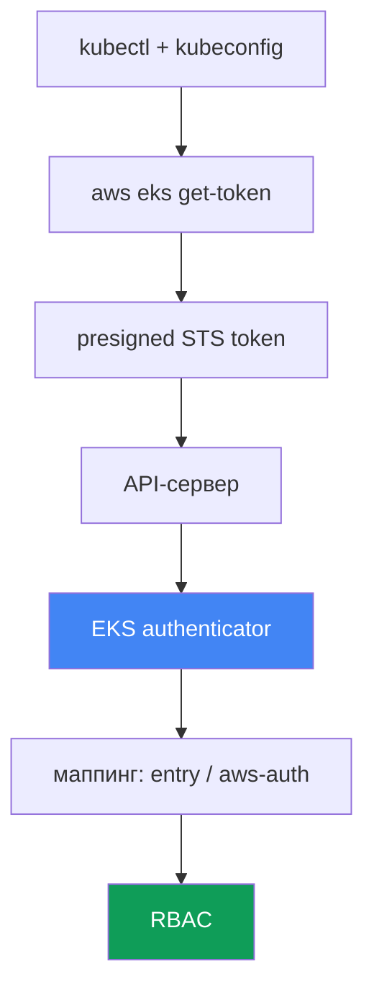

# Глава 47. Доступ и IAM: access entries, IRSA и Pod Identity, webhook, kubeconfig

> **Что дальше.** Главы 45 и 46 разбирали железо и сеть: нода не присоединилась, трафик не
> ходит. Здесь - два других класса сбоев: человек или CI не может достучаться до кластера, и
> под получает `AccessDenied` на вызове AWS, хотя ему настроили доступ. Устройство разбирается
> в других главах: IRSA - глава 16, Pod Identity - глава 17, access entries и aws-auth как
> механизмы доступа - глава 5, авторизация роли ноды - глава 45. Здесь - как по симптому
> опознать, на каком слое сломан доступ, и чем это подтвердить.

## 47.1. Два симптома: человек не входит, под получает отказ

Доступ ломается на двух независимых осях, и путать их нельзя.

**Человек или CI не может достучаться до кластера.** `kubectl` отвечает отказом ещё до того,
как дело дойдёт до конкретного ресурса:

```bash
kubectl get pods
# error: You must be logged in to the server (Unauthorized)
```

Или менее очевидная форма той же беды:

```bash
kubectl get nodes
# couldn't get current server API group list: Unauthorized
```

Оба сообщения говорят одно: API-сервер не признал того, кто пришёл. Это слой аутентификации -
IAM identity не удалось доказать или её не на кого замапить внутри кластера.

**Под получает `AccessDenied` на вызове AWS.** Приложение с настроенным IRSA или Pod Identity
падает на обращении к S3, DynamoDB или Secrets Manager:

```bash
kubectl logs deploy/app
# AccessDenied: User: arn:aws:sts::111122223333:assumed-role/... is not authorized
#   to perform: s3:GetObject on resource: ...
# или: WebIdentityErr: failed to retrieve credentials
```

Это уже не про доступ человека к кластеру, а про доступ пода к AWS: не собралась цепочка
получения временных креденшелов через STS.

Ключевая мысль главы: это два разных слоя. Первый живёт в цепочке `kubectl` - IAM - EKS
authenticator - RBAC. Второй - в цепочке под - ServiceAccount - STS - IAM role. Диагностика
начинается с того, чтобы честно назвать, какая из осей сломана.



## 47.2. Цепочка аутентификации kubectl в EKS

Чтобы чинить `Unauthorized`, надо понимать, как `kubectl` вообще доказывает, кто он. В EKS это
не пароль и не клиентский сертификат, а IAM-идентичность, проверенная через STS.

Шаги цепочки:

1. `kubectl` читает kubeconfig и видит там `exec`-плагин: команду `aws eks get-token`.
2. Плагин формирует **presigned STS-запрос** к `sts:GetCallerIdentity` и кодирует его в токен
   с префиксом `k8s-aws-v1.`. Токен подписан текущими AWS-креденшелами и живёт недолго.
3. `kubectl` шлёт токен API-серверу в заголовке `Authorization`.
4. API-сервер передаёт токен в **EKS authenticator** (webhook token authentication на стороне
   control plane). Authenticator «проигрывает» presigned-запрос и узнаёт, какая IAM identity
   его подписала.
5. Authenticator ищет эту identity в маппинге кластера (access entries или aws-auth ConfigMap)
   и превращает её в Kubernetes-пользователя и группы.
6. Дальше обычный **RBAC**: роли и биндинги решают, что этому пользователю можно.



Понимание цепочки - ключ к диагностике. Обрыв на шагах 1-4 (плагин, креденшелы, токен) даёт
`Unauthorized`. Обрыв на шаге 5 (identity не замаплена) - тоже `Unauthorized`. А вот шаг 6 -
это уже `Forbidden`, отдельная история следующего раздела.

## 47.3. 401 Unauthorized против 403 Forbidden

Два похожих отказа - два разных слоя и два разных ремонта. Смешивать их - терять время.

**401 Unauthorized** - провал аутентификации. API-сервер не понял или не признал, кто пришёл:
плагин не отдал токен, креденшелы протухли, IAM identity не замаплена на Kubernetes-субъекта.
Ремонт - в kubeconfig, в AWS-креденшелах и в маппинге (access entry или aws-auth).

**403 Forbidden** - провал авторизации. Кто пришёл, API-сервер уже знает, но RBAC не даёт прав
на действие:

```bash
kubectl get secrets -n kube-system
# Error from server (Forbidden): secrets is forbidden:
#   User "..." cannot list resource "secrets" in namespace "kube-system"
```

Ремонт - в Role/ClusterRole и биндингах, это чистый Kubernetes RBAC, знакомый с CKA. AWS тут
уже ни при чём: identity доказана и замаплена.

| Признак | 401 Unauthorized | 403 Forbidden |
|---|---|---|
| Слой | аутентификация: кто ты | авторизация: что тебе можно |
| Причина | нет токена, протух, identity не замаплена | RBAC не даёт прав на ресурс |
| Где чинить | kubeconfig, креденшелы, access entry / aws-auth | Role, ClusterRole, RoleBinding |
| В сообщении | `Unauthorized`, `must be logged in` | `Forbidden`, `cannot <verb> resource` |

Простое правило: `Unauthorized` - разбираемся с IAM и маппингом; `Forbidden` - разбираемся с
RBAC. `kubectl auth can-i` из раздела 47.7 отвечает именно на вопрос авторизации.

## 47.4. Access entries против aws-auth ConfigMap

Маппинг IAM identity на Kubernetes-субъекта (шаг 5 цепочки) в EKS делается двумя механизмами,
и режим кластера задаёт, какой из них работает. Устройство обоих - в главе 5, здесь - как это
ломает доступ.

**Authentication mode кластера** - настройка `accessConfig.authenticationMode` с тремя
значениями:

| Режим | Что работает | Комментарий |
|---|---|---|
| `CONFIG_MAP` | только aws-auth ConfigMap | классика, наследие |
| `API_AND_CONFIG_MAP` | и access entries, и aws-auth | переходный, оба источника |
| `API` | только access entries | ConfigMap игнорируется |

**Access entry** - запись в EKS API, привязанная к ARN роли или пользователя. Ей можно дать
**access policy** (например, `AmazonEKSClusterAdminPolicy` или `AmazonEKSAdminPolicy`) либо
замапить на RBAC-группы, к которым уже привязаны свои Role и ClusterRole.

**Классика «залочились».** Два частых способа потерять доступ:

- **Только cluster creator admin.** IAM principal, создавший кластер, получает админский доступ
  автоматически. Если больше никого не добавили, доступ есть только у него - а он мог быть
  ролью CI или уволившегося инженера.
- **Снесли свой маппинг в aws-auth.** Неаккуратный `kubectl edit` ConfigMap `aws-auth` - и своя
  строка удалена. В режиме `CONFIG_MAP` это моментальный `Unauthorized` для всех, кого там
  больше нет, включая того, кто редактировал.

Чинить залоченный кластер:

```bash
# посмотреть текущий режим
aws eks describe-cluster --name <cluster> --query 'cluster.accessConfig'
# включить access entries, если был только CONFIG_MAP
aws eks update-cluster-config --name <cluster> \
  --access-config authenticationMode=API_AND_CONFIG_MAP
# добавить себе доступ через access entry с админской политикой
aws eks create-access-entry --cluster-name <cluster> --principal-arn <ваш-arn>
aws eks associate-access-policy --cluster-name <cluster> --principal-arn <ваш-arn> \
  --access-scope type=cluster \
  --policy-arn arn:aws:eks::aws:cluster-access-policy/AmazonEKSClusterAdminPolicy
```

Важно: переключить режим на `API_AND_CONFIG_MAP` можно, а обратно к `CONFIG_MAP` уже нет -
переход в сторону access entries односторонний. Это делает access entries спасательным
механизмом: даже если aws-auth испорчен, доступ восстанавливается через EKS API, где решают
IAM-права на сам кластер, а не содержимое ConfigMap.

## 47.5. kubeconfig: тихие причины Unauthorized

Часто виноват не кластер, а локальный kubeconfig или окружение. Правильный файл генерирует сам
CLI:

```bash
aws eks update-kubeconfig --name <cluster> --region <region>
# при необходимости под конкретным профилем
aws eks update-kubeconfig --name <cluster> --region <region> --profile <profile>
```

Команда пишет в kubeconfig context с нужными server и CA и `exec`-секцию с `aws eks get-token`.
Дальше живут типичные ошибки:

- **Не тот AWS profile или креденшелы.** `exec`-плагин берёт креденшелы из обычной цепочки AWS
  (переменные окружения, `AWS_PROFILE`, `~/.aws/credentials`, роль инстанса). Если активен не
  тот профиль, токен подпишется чужой identity, и она может быть не замаплена - `Unauthorized`.
- **Не тот регион.** В kubeconfig или в `get-token` указан регион не того кластера. Запрос
  уходит не туда, identity не совпадает с ожидаемой.
- **Протухший или закэшированный токен.** Токен `get-token` короткоживущий; если истекли сами
  AWS-креденшелы (например, роль по SSO), плагин не выдаст валидный токен.
- **Неверный cluster в `update-kubeconfig`.** Сгенерировали context для одного кластера, а
  работаете в другом. `kubectl config current-context` показывает, куда реально идут запросы.

Быстрая развилка «кластер или я»: если `aws sts get-caller-identity` показывает не ту identity,
которую вы ждёте, проблема локальная - профиль или креденшелы. Если identity верная, а всё
равно `Unauthorized`, копайте в маппинг из раздела 47.4.

## 47.6. IRSA и Pod Identity: почему под получает AccessDenied

Вторая ось - доступ пода к AWS. Под сам по себе AWS-креденшелов не имеет; их даёт один из двух
механизмов. Устройство - главы 16 и 17, здесь - что проверять при `AccessDenied`.

**IRSA (глава 16).** Под получает токен ServiceAccount, обменивает его в STS через
`sts:AssumeRoleWithWebIdentity` на креденшелы роли. Что рвётся:

- **Нет IAM OIDC provider у кластера.** Без зарегистрированного OIDC provider STS не доверяет
  токенам кластера, и обмен не проходит.
- **Неверная trust policy роли.** В условии должны совпасть `sub` (равен
  `system:serviceaccount:<namespace>:<serviceaccount>`) и `aud` (равен `sts.amazonaws.com`).
  Опечатка в namespace или имени SA - и роль не отдаётся.
- **Нет или неверна аннотация SA** `eks.amazonaws.com/role-arn` - под не знает, какую роль
  просить.
- **`sts:AssumeRoleWithWebIdentity` не разрешён** trust policy - обмен токена отклонён.
- **Токен не смонтирован.** Проектируемый токен не попал в под (правился под, а не Deployment;
  под не пересоздан).
- **Региональный STS endpoint.** Обращение к глобальному STS вместо регионального даёт лишнюю
  задержку и сбои; в EKS ожидается региональный endpoint.

**Pod Identity (глава 17).** Проще: агент на ноде выдаёт креденшелы, роль связывается с SA
через association, OIDC provider не нужен. Что рвётся:

- **Аддон `eks-pod-identity-agent` не запущен** - выдавать креденшелы некому.
- **Association отсутствует** - роль не связана с этим SA в этом namespace.
- **Trust policy роли не та.** Роль должна доверять сервису `pods.eks.amazonaws.com` с
  действиями `sts:AssumeRole` и `sts:TagSession` (без последнего сессия не тегируется и
  ассоциация не работает).
- **Токен не смонтирован в под.** При работающей association под получает проектируемый токен
  по пути `/var/run/secrets/pods.eks.amazonaws.com/serviceaccount/eks-pod-identity-token`. Нет
  файла - агент или association не сработали, либо под не пересоздан после её создания.

Когда что: IRSA - зрелый механизм, работает и вне EKS-агента, но требует OIDC provider и
аккуратной trust policy на каждый кластер. Pod Identity - новее и проще в эксплуатации: одна
trust policy на `pods.eks.amazonaws.com` переиспользуется между кластерами, а связь задаётся
association. При разборе сначала определите, какой механизм настроен для этого SA, и не ищите
OIDC там, где работает Pod Identity.

## 47.7. Порядок диагностики и инструменты

Доступ чинят от симптома к слою, ровно как сеть в главе 46. Сначала - какая ось сломана.

```bash
# кто я на самом деле в глазах AWS
aws sts get-caller-identity
# режим аутентификации и accessConfig кластера
aws eks describe-cluster --name <cluster> --query 'cluster.accessConfig'
# кто замаплен через access entries
aws eks list-access-entries --cluster-name <cluster>
# что в aws-auth (если режим ещё его использует)
kubectl -n kube-system get cm aws-auth -o yaml
# authz: что мне вообще можно
kubectl auth can-i --list
kubectl auth can-i get pods -n <ns>
```

Для оси пода:

```bash
# аннотация роли на ServiceAccount (IRSA)
kubectl get sa <sa> -n <ns> -o jsonpath='{.metadata.annotations.eks\.amazonaws\.com/role-arn}'
# ассоциации Pod Identity
aws eks list-pod-identity-associations --cluster-name <cluster>
# запущен ли агент Pod Identity
kubectl -n kube-system get pods -l app.kubernetes.io/name=eks-pod-identity-agent
# смонтирован ли токен Pod Identity в самом поде (нет файла - агент/association не сработали)
kubectl exec <pod> -n <ns> -- ls /var/run/secrets/pods.eks.amazonaws.com/serviceaccount/
```

Если цепочка authentication молчит о причине, помогают логи authenticator - они входят в
control plane logging (главы 21 и 34) и показывают, замаплена ли пришедшая identity.

Чеклист «симптом - вероятная причина - что проверить»:

| Симптом | Вероятная причина | Что проверить |
|---|---|---|
| `Unauthorized`, `must be logged in` | не та identity или не замаплена | `sts get-caller-identity`, `list-access-entries` |
| `Unauthorized` сразу после `edit aws-auth` | снесён свой маппинг | `get cm aws-auth`, восстановить через access entry |
| `Forbidden: cannot <verb>` | RBAC не даёт прав | `kubectl auth can-i`, Role и биндинги |
| `couldn't get server API group` | битый kubeconfig или регион | `update-kubeconfig`, `current-context`, профиль |
| под `AccessDenied` при IRSA | trust policy, OIDC, аннотация SA | OIDC provider, `sub`/`aud`, аннотация `role-arn` |
| под `WebIdentityErr` | токен не смонтирован, роль не та | пересоздать под, проверить trust policy |
| под `AccessDenied` при Pod Identity | нет association, агента или токена | `list-pod-identity-associations`, агент, токен в поде |

Логика: сначала `sts get-caller-identity` отвечает «кто я»; затем по коду отказа расходимся -
`Unauthorized` в маппинг и kubeconfig, `Forbidden` в RBAC, `AccessDenied` из пода в IRSA или
Pod Identity. Каждая ветка ведёт в свой инструмент, гадать не нужно.

## 47.8. Как это применяют в продакшене

- **Не оставляют доступ на одном cluster creator.** Сразу добавляют access entry для рабочих
  ролей команды и CI, чтобы уход одного человека или ротация роли не заперли кластер.
- **Держат режим `API` или `API_AND_CONFIG_MAP`.** Access entries управляются через IAM и
  Terraform, их не сломать `kubectl edit`, и восстановление доступа не требует живого kubectl.
- **Различают 401 и 403 в runbook.** Дежурный сначала смотрит код отказа: `Unauthorized` - это
  IAM и маппинг, `Forbidden` - это RBAC. Это экономит первые минуты инцидента.
- **Стандартизируют один механизм для подов.** Выбирают IRSA или Pod Identity как основной и не
  смешивают в одном кластере без нужды - меньше мест, где искать при `AccessDenied`.
- **Пишут trust policy узко и по шаблону.** Для IRSA - точные `sub` и `aud`, для Pod Identity -
  `pods.eks.amazonaws.com` с `sts:AssumeRole` и `sts:TagSession`, из проверенного модуля.
- **Включают control plane logging заранее.** Логи authenticator и API нужны именно в момент
  инцидента с доступом; включать их постфактум поздно.

## 47.9. Мини-глоссарий

- **EKS authenticator** - webhook на control plane, который проверяет presigned STS-токен и
  сопоставляет IAM identity с Kubernetes-субъектом.
- **`aws eks get-token`** - `exec`-плагин в kubeconfig, формирующий presigned STS-токен для
  входа в кластер.
- **Unauthorized (401)** - провал аутентификации: identity не доказана или не замаплена.
- **Forbidden (403)** - провал авторизации: RBAC не даёт прав на действие.
- **authentication mode** - настройка кластера `API`, `API_AND_CONFIG_MAP` или `CONFIG_MAP`,
  задающая источник маппинга.
- **access entry** - запись EKS API, связывающая ARN principal с access policy или группами.
- **access policy** - управляемая EKS политика доступа к кластеру, например
  `AmazonEKSClusterAdminPolicy`.
- **aws-auth ConfigMap** - устаревший способ маппинга IAM на RBAC через ConfigMap в kube-system
  namespace.
- **cluster creator admin** - IAM principal, создавший кластер, получает админский доступ
  автоматически.
- **IRSA** - доступ пода к AWS через OIDC и `sts:AssumeRoleWithWebIdentity` (глава 16).
- **Pod Identity** - доступ пода к AWS через агент `eks-pod-identity-agent` и association
  (глава 17).
- **trust policy** - политика доверия IAM-роли: кому и с какими условиями разрешено её принять.

## 47.10. Итоги главы

- Сбои доступа делятся на две оси: человек или CI не входит в кластер и под получает
  `AccessDenied` на вызове AWS. Это разные слои с разными инструментами ремонта.
- Вход в EKS - это цепочка `kubectl` - `aws eks get-token` - presigned STS - authenticator -
  маппинг - RBAC. Понимание цепочки локализует обрыв.
- `Unauthorized` (401) - аутентификация: нет токена, протух, identity не замаплена. `Forbidden`
  (403) - авторизация: RBAC не даёт прав. Чинятся в разных местах.
- Маппинг задают access entries или aws-auth, а authentication mode кластера решает, какой
  источник работает. Access entries - спасательный механизм при залоченном кластере (глава 5).
- Классика «залочились» - доступ был только у cluster creator или снесён свой маппинг в
  aws-auth. Лечится сменой режима и добавлением access entry.
- kubeconfig ломает вход тихо: не тот профиль, регион, протухшие креденшелы, чужой context.
  `aws sts get-caller-identity` быстро отделяет локальную проблему от кластерной.
- Под получает `AccessDenied` из-за разорванной цепочки STS: для IRSA - OIDC provider, trust
  policy с `sub`/`aud`, аннотация SA; для Pod Identity - агент, association, доверие
  `pods.eks.amazonaws.com` с `sts:AssumeRole` и `sts:TagSession` (главы 16 и 17).

## 47.11. Как это пригодится в реальной работе

Инцидент с доступом почти всегда приходит в худший момент: CI не может выкатить релиз или под
после деплоя валится на AWS. Соблазн - сразу лезть в RBAC или переписывать роль. Выигрывает
тот, кто первым вопросом отделяет ось: это человек не входит или под не может в AWS. Дальше код
отказа доканчивает классификацию - `Unauthorized`, `Forbidden` или `AccessDenied` ведут в три
разных места. `aws sts get-caller-identity` в первые секунды говорит, ваша ли это проблема или
кластера, и это чаще всего важнее любого kubectl.

При планировании те же слои превращаются в профилактику. Access entries вместо голого aws-auth
и несколько админских маппингов вместо одного cluster creator убирают целый класс «залочились».
Единый механизм доступа подов и trust policy из проверенного модуля делают `AccessDenied`
редким и предсказуемым. А включённое заранее control plane logging превращает немой
`Unauthorized` в запись, где видно, кого и почему не признали.

## 47.12. Вопросы для самопроверки

1. На какие две независимые оси делятся сбои доступа в EKS и почему их нельзя путать?
2. Опишите цепочку аутентификации `kubectl` в EKS от kubeconfig до RBAC. Где рвётся 401?
3. Что именно делает `aws eks get-token` и что за токен он формирует?
4. Чем `Unauthorized` (401) отличается от `Forbidden` (403) по слою и месту ремонта?
5. Какие три authentication mode бывают у кластера и что каждый разрешает как источник?
6. Как можно «залочить» кластер и почему access entries служат спасательным механизмом?
7. Какие тихие ошибки kubeconfig дают `Unauthorized` и как отличить их от сбоя кластера?
8. Что проверять по порядку при `AccessDenied` из пода с IRSA (глава 16)?
9. Какую роль в IRSA играют условия `sub` и `aud` в trust policy и аннотация SA?
10. Что нужно для Pod Identity и какой trust policy требует роль (глава 17)?
11. Когда выбирают IRSA, а когда Pod Identity, и как это влияет на диагностику?
12. Какие команды дают быструю картину: кто я, режим кластера, маппинг, права, ассоциации?
13. Чем помогают логи authenticator и где они включаются (главы 21 и 34)?

## Практика

Лаба курса к этой теме: [лаба 121 - troubleshooting доступа](../../labs/121/README_RU.MD).
В ней вы своими руками получаете все три отказа и различаете их: `AccessDenied` от IAM,
`Unauthorized` у роли без access entry, `Forbidden` при view-политике, а затем
`AccessDenied` на `AssumeRoleWithWebIdentity` из-за несовпадения `sub` в trust policy;
проверка - командой `check_result`. Запуск - `TASK=121 make run_eks_task`.

Помимо лабы, эта глава - диагностический runbook по доступу. Все проверки безопасны на
здоровом кластере и показывают, как выглядит норма, чтобы быстрее опознать отклонение.

Сначала посмотрите, кто вы в глазах AWS и в каком режиме кластер:

```bash
# ваша реальная IAM identity
aws sts get-caller-identity
# режим аутентификации и accessConfig
aws eks describe-cluster --name <cluster> --query 'accessConfig'
# кто замаплен через access entries
aws eks list-access-entries --cluster-name <cluster>
```

Затем проверьте свою авторизацию внутри кластера - это слой RBAC, не IAM:

```bash
# полный список того, что вам можно
kubectl auth can-i --list
# точечная проверка конкретного действия
kubectl auth can-i create deployments -n default
```

В завершение разберитесь с доступом подов к AWS. Найдите ServiceAccount рабочего пода и
посмотрите, каким механизмом он получает креденшелы:

```bash
# аннотация роли для IRSA (пусто - значит IRSA тут не используется)
kubectl get sa <sa> -n <ns> \
  -o jsonpath='{.metadata.annotations.eks\.amazonaws\.com/role-arn}'
# ассоциации Pod Identity в кластере
aws eks list-pod-identity-associations --cluster-name <cluster>
```

Сверьте картину с чеклистом из раздела 47.7: на здоровом кластере `get-caller-identity` даёт
ожидаемую роль, access entries содержат рабочие ARN, `auth can-i --list` соответствует вашей
роли, а у подов есть либо аннотация IRSA, либо association Pod Identity. Запомнив норму, вы при
инциденте сразу поймёте, какая из двух осей доступа сломана.

---
[Оглавление](../README_RU.md) · [Глава 46](../46/ru.md) · [Глава 48](../48/ru.md)
