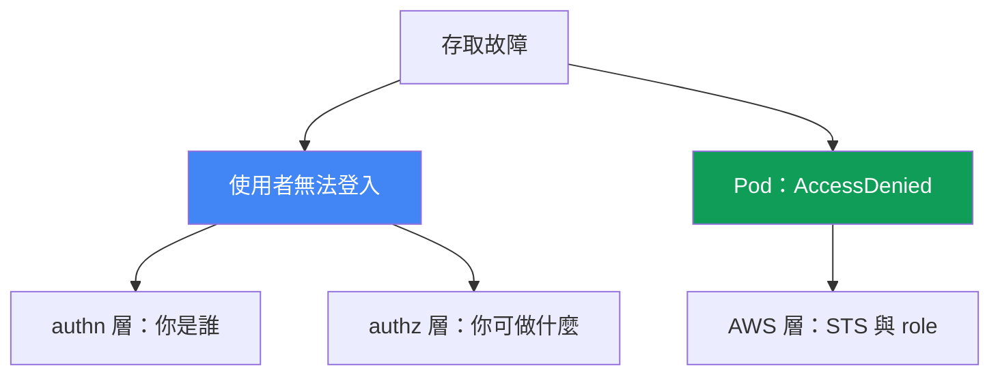
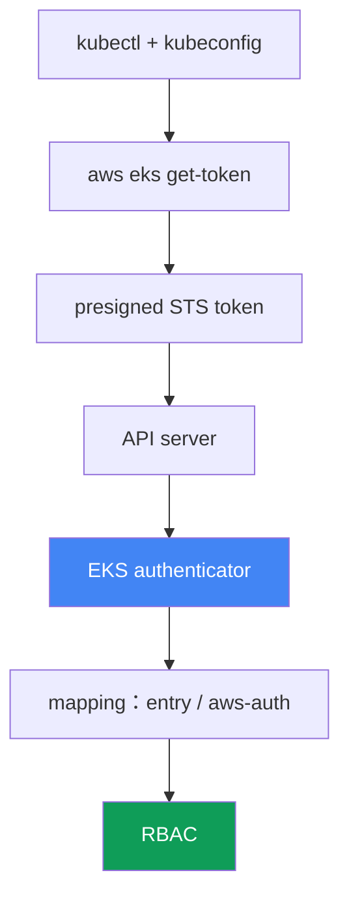

[Русская версия](ru.md) · [Eng version](en.md) · [Versión en español](es.md) · [Version française](fr.md) · [Deutsche Version](de.md) · [ქართული ვერსია](ge.md) · [日本語版](jp.md)
# 第 47 章。存取與 IAM：access entries、IRSA 與 Pod Identity、webhook、kubeconfig

> **接下來。** 第 45 與第 46 章探討硬體與網路：節點未加入，流量無法通行。這裡有另外兩類故障：使用者或 CI 無法存取叢集，以及已設定存取權的 Pod 在呼叫 AWS 時取得 `AccessDenied`。相關機制見其他章節：IRSA 見第 16 章，Pod Identity 見第 17 章，access entries 與 aws-auth 作為存取機制見第 5 章，節點角色授權見第 45 章。本章說明如何根據症狀辨識存取在哪一層失效，以及如何加以確認。

## 47.1. 兩種症狀：使用者無法登入，Pod 收到拒絕

存取會在兩條獨立軸線上失效，絕不能混淆。

**使用者或 CI 無法存取叢集。** 在碰到特定資源以前，`kubectl` 就回覆拒絕：

```bash
kubectl get pods
# error: You must be logged in to the server (Unauthorized)
```

或是同一問題較不明顯的形式：

```bash
kubectl get nodes
# couldn't get current server API group list: Unauthorized
```

兩個訊息都表示同一件事：API server 沒有辨識發出請求者。這是 authentication 層，IAM identity 未能證明自己，或無法在叢集內映射到對象。

**Pod 在呼叫 AWS 時收到 `AccessDenied`。** 已設定 IRSA 或 Pod Identity 的應用程式在存取 S3、DynamoDB 或 Secrets Manager 時失敗：

```bash
kubectl logs deploy/app
# AccessDenied: User: arn:aws:sts::111122223333:assumed-role/... is not authorized
#   to perform: s3:GetObject on resource: ...
# 或：WebIdentityErr: failed to retrieve credentials
```

這已不是使用者存取叢集，而是 Pod 存取 AWS 的問題：透過 STS 取得暫時 credentials 的鏈結未能建立。

本章的關鍵概念是：這是兩個不同層次。第一個存在於 `kubectl` - IAM - EKS authenticator - RBAC 鏈結；第二個存在於 Pod - ServiceAccount - STS - IAM role 鏈結。診斷的起點，是如實指出哪一條軸線失效。



## 47.2. EKS 中 kubectl 的 authentication 鏈結

要修復 `Unauthorized`，必須了解 `kubectl` 如何證明自己的身分。在 EKS 中，這不是密碼或 client certificate，而是經 STS 驗證的 IAM identity。

鏈結步驟：

1. `kubectl` 讀取 kubeconfig，並在其中發現 `exec` plugin：`aws eks get-token` 指令。
2. plugin 形成發往 `sts:GetCallerIdentity` 的 **presigned STS request**，並將它編碼為帶有 `k8s-aws-v1.` prefix 的 token。token 由目前 AWS credentials 簽署，且有效期很短。
3. `kubectl` 在 `Authorization` header 中將 token 傳送給 API server。
4. API server 將 token 傳入 **EKS authenticator**（control plane 端的 webhook token authentication）。authenticator 會「重播」presigned request，並識別哪個 IAM identity 簽署它。
5. authenticator 在叢集 mapping 中查找該 identity（access entries 或 aws-auth ConfigMap），並將其轉為 Kubernetes user 與 groups。
6. 接著是一般的 **RBAC**：roles 與 bindings 決定該 user 可執行什麼。



理解此鏈結是診斷的關鍵。步驟 1-4（plugin、credentials、token）中斷會得到 `Unauthorized`。步驟 5（identity 未映射）中斷也會得到 `Unauthorized`。至於步驟 6 則是 `Forbidden`，那是下一節的另一個問題。

## 47.3. 401 Unauthorized 與 403 Forbidden

兩個相似的拒絕訊息代表兩個不同層次，也需要不同修復方式。混在一起只會浪費時間。

**401 Unauthorized** 是 authentication 失敗。API server 不理解或不認可請求者：plugin 未提供 token、credentials 已過期，或 IAM identity 未映射至 Kubernetes subject。應從 kubeconfig、AWS credentials 與 mapping（access entry 或 aws-auth）修復。

**403 Forbidden** 是 authorization 失敗。API server 已知請求者身分，但 RBAC 未授與動作權限：

```bash
kubectl get secrets -n kube-system
# Error from server (Forbidden): secrets is forbidden:
#   User "..." cannot list resource "secrets" in namespace "kube-system"
```

應從 Role/ClusterRole 與 bindings 修復，這是純 Kubernetes RBAC，也是 CKA 中熟悉的內容。AWS 已不再相關：identity 已證明並已映射。

| 特徵 | 401 Unauthorized | 403 Forbidden |
|---|---|---|
| 層次 | 驗證：你是誰 | 授權：你可做什麼 |
| 原因 | 沒有權杖、權杖過期、身分未映射 | RBAC 未授與資源權限 |
| 修復位置 | kubeconfig、憑證、存取項目 / aws-auth | Role、ClusterRole、RoleBinding |
| 訊息內容 | `Unauthorized`、`must be logged in` | `Forbidden`、`cannot <verb> resource` |

簡單規則：`Unauthorized` 時檢查 IAM 與 mapping；`Forbidden` 時檢查 RBAC。第 47.7 節的 `kubectl auth can-i` 正是回答 authorization 問題。

## 47.4. Access entries 與 aws-auth ConfigMap

在 EKS 中，將 IAM identity 映射至 Kubernetes subject（鏈結的步驟 5）有兩種機制，而叢集模式決定哪些機制運作。兩者的原理見第 5 章，此處說明它們如何造成存取故障。

**叢集的 authentication mode** 是設定 `accessConfig.authenticationMode`，有三個值：

| 模式 | 運作項目 | 說明 |
|---|---|---|
| `CONFIG_MAP` | 僅 aws-auth ConfigMap | 傳統、舊有方式 |
| `API_AND_CONFIG_MAP` | access entries 與 aws-auth 都運作 | 過渡期間，兩種來源並行 |
| `API` | 僅 access entries | 忽略 ConfigMap |

**Access entry** 是 EKS API 中附加至 role 或 user ARN 的項目。可為它授予 **access policy**（例如 `AmazonEKSClusterAdminPolicy` 或 `AmazonEKSAdminPolicy`），或將其映射到已綁定自身 Role 與 ClusterRole 的 RBAC groups。

**典型的「把自己鎖在外面」。** 有兩種常見的失去存取權方式：

- **只有 cluster creator admin。** 建立叢集的 IAM principal 會自動取得 admin 存取權。若沒有新增其他人，只有它能存取，而它可能是 CI role 或已離職工程師的 role。
- **在 aws-auth 中刪除自己的 mapping。** 不慎執行 `kubectl edit` 修改 `aws-auth` ConfigMap，便會刪除自己的列。在 `CONFIG_MAP` 模式中，對所有不再列於其中的人而言，這會立即造成 `Unauthorized`，包括正在編輯的人。

修復被鎖住的叢集：

```bash
# 查看目前模式
aws eks describe-cluster --name <cluster> --query 'cluster.accessConfig'
# 若原本只有 CONFIG_MAP，啟用 access entries
aws eks update-cluster-config --name <cluster> \
  --access-config authenticationMode=API_AND_CONFIG_MAP
# 透過具 admin policy 的 access entry 為自己新增存取權
aws eks create-access-entry --cluster-name <cluster> --principal-arn <您的-arn>
aws eks associate-access-policy --cluster-name <cluster> --principal-arn <您的-arn> \
  --access-scope type=cluster \
  --policy-arn arn:aws:eks::aws:cluster-access-policy/AmazonEKSClusterAdminPolicy
```

請注意：可切換至 `API_AND_CONFIG_MAP`，但不能切回 `CONFIG_MAP`，朝 access entries 的轉換是單向的。這使 access entries 成為救援機制：即使 aws-auth 已損毀，仍可透過 EKS API 恢復存取權。在此由叢集自身的 IAM permissions 決定，而不是由 ConfigMap 內容決定。

## 47.5. kubeconfig：造成 Unauthorized 的隱性原因

通常問題不在叢集，而在本機 kubeconfig 或環境。正確檔案由 CLI 自行產生：

```bash
aws eks update-kubeconfig --name <cluster> --region <region>
# 如有需要，指定特定 profile
aws eks update-kubeconfig --name <cluster> --region <region> --profile <profile>
```

此指令會在 kubeconfig 寫入包含正確 server、CA 以及 `aws eks get-token` 的 `exec` section 的 context。接下來會出現以下典型錯誤：

- **錯誤的 AWS profile 或 credentials。** `exec` plugin 會從一般 AWS chain 取得 credentials（environment variables、`AWS_PROFILE`、`~/.aws/credentials`、instance role）。若啟用錯誤 profile，token 會以其他 identity 簽署，而它可能未映射，導致 `Unauthorized`。
- **錯誤的 region。** kubeconfig 或 `get-token` 中的 region 指向其他叢集。request 送往錯誤位置，identity 不符預期。
- **已過期或快取的 token。** `get-token` token 的有效期很短；若 AWS credentials 本身已過期（例如 SSO role），plugin 無法發出有效 token。
- **`update-kubeconfig` 中的 cluster 錯誤。** 為某個叢集產生 context，卻在另一個叢集中操作。`kubectl config current-context` 顯示 request 實際送往何處。

快速判斷「叢集還是我」：若 `aws sts get-caller-identity` 顯示的 identity 並非您預期者，問題在本機，是 profile 或 credentials。若 identity 正確但仍為 `Unauthorized`，請深入第 47.4 節的 mapping。

## 47.6. IRSA 與 Pod Identity：為什麼 Pod 收到 AccessDenied

第二條軸線是 Pod 存取 AWS。Pod 本身沒有 AWS credentials，必須由兩種機制之一提供。其原理見第 16 與第 17 章，此處說明 `AccessDenied` 時要檢查什麼。

**IRSA（第 16 章）。** Pod 取得 ServiceAccount token，透過 `sts:AssumeRoleWithWebIdentity` 在 STS 中交換為 role credentials。可能的中斷點：

- **叢集沒有 IAM OIDC provider。** 沒有已註冊的 OIDC provider，STS 不信任叢集 tokens，交換失敗。
- **角色的信任政策錯誤。** condition 必須符合 `sub`（等於 `system:serviceaccount:<namespace>:<serviceaccount>`）與 `aud`（等於 `sts.amazonaws.com`）。namespace 或 SA 名稱拼寫錯誤，角色就不會被提供。
- **SA 註解缺失或錯誤** `eks.amazonaws.com/role-arn`，Pod 不知道要請求哪個角色。
- **信任政策未允許 `sts:AssumeRoleWithWebIdentity`，** 權杖交換會被拒絕。
- **token 未掛載。** projected token 未進入 Pod（修改了 Pod 而非 Deployment，或 Pod 未重新建立）。
- **Regional STS endpoint。** 呼叫 global STS 而非 regional endpoint 會造成額外 latency 與故障；EKS 預期使用 regional endpoint。

**Pod Identity（第 17 章）。** 較為簡單：節點上的 agent 提供 credentials，role 透過 association 與 SA 連結，不需要 OIDC provider。可能的中斷點：

- **`eks-pod-identity-agent` addon 未運作，** 沒有任何元件可提供 credentials。
- **association 不存在，** role 未與此 namespace 中的此 SA 關聯。
- **role 的 信任政策 不正確。** role 必須信任服務 `pods.eks.amazonaws.com`，並具有 `sts:AssumeRole` 與 `sts:TagSession` actions（缺少後者時 session 不會被標記，association 無法運作）。
- **token 未掛載至 Pod。** 當 association 運作時，Pod 在 `/var/run/secrets/pods.eks.amazonaws.com/serviceaccount/eks-pod-identity-token` 取得 projected token。沒有此檔案表示 agent 或 association 未生效，或 Pod 在建立 association 後沒有重新建立。

何時使用何者：IRSA 是成熟機制，也可在 EKS agent 以外運作，但每個叢集都需要 OIDC provider 與精確的 信任政策。Pod Identity 較新且更容易操作：`pods.eks.amazonaws.com` 的單一 信任政策 可在叢集間重複使用，關聯由 association 設定。分析時，先確認此 SA 已設定哪一種機制，切勿在使用 Pod Identity 的地方尋找 OIDC。

## 47.7. 診斷順序與工具

存取依症狀往層次修復，如同第 46 章處理網路一樣。先確認哪一條軸線失效。

```bash
# 從 AWS 角度確認我實際是誰
aws sts get-caller-identity
# 叢集的 authentication mode 與 accessConfig
aws eks describe-cluster --name <cluster> --query 'cluster.accessConfig'
# 透過 access entries 映射的項目
aws eks list-access-entries --cluster-name <cluster>
# aws-auth 的內容（若模式仍使用它）
kubectl -n kube-system get cm aws-auth -o yaml
# authz：我究竟可做什麼
kubectl auth can-i --list
kubectl auth can-i get pods -n <ns>
```

針對 Pod 軸線：

```bash
# ServiceAccount 上的 role annotation（IRSA）
kubectl get sa <sa> -n <ns> -o jsonpath='{.metadata.annotations.eks\.amazonaws\.com/role-arn}'
# Pod Identity 關聯
aws eks list-pod-identity-associations --cluster-name <cluster>
# Pod Identity agent 是否正在運作
kubectl -n kube-system get pods -l app.kubernetes.io/name=eks-pod-identity-agent
# Pod 中是否掛載 Pod Identity token（沒有檔案表示 agent/association 未生效）
kubectl exec <pod> -n <ns> -- ls /var/run/secrets/pods.eks.amazonaws.com/serviceaccount/
```

如果 authentication 鏈結沒有說明原因，authenticator logs 可提供協助。它們是 control plane logging 的一部分（第 21 與第 34 章），並會顯示傳入的 identity 是否已映射。

「症狀、可能原因、檢查項目」清單：

| 症狀 | 可能原因 | 檢查項目 |
|---|---|---|
| `Unauthorized`、`must be logged in` | identity 錯誤或未映射 | `sts get-caller-identity`、`list-access-entries` |
| `edit aws-auth` 後立即出現 `Unauthorized` | 刪除了自己的 mapping | `get cm aws-auth`、透過 access entry 還原 |
| `Forbidden: cannot <verb>` | RBAC 未授與權限 | `kubectl auth can-i`、Role 與 bindings |
| `couldn't get server API group` | kubeconfig 或 region 損毀 | `update-kubeconfig`、`current-context`、profile |
| IRSA 下 Pod 出現 `AccessDenied` | 信任政策、OIDC、SA 註解 | OIDC provider、`sub`/`aud`、`role-arn` annotation |
| Pod 出現 `WebIdentityErr` | token 未掛載、role 錯誤 | 重新建立 Pod、檢查 信任政策 |
| Pod Identity 下 Pod 出現 `AccessDenied` | 缺少 association、agent 或 token | `list-pod-identity-associations`、agent、Pod 中的 token |

邏輯是：先由 `sts get-caller-identity` 回答「我是誰」；接著依拒絕代碼分流：`Unauthorized` 進入 mapping 與 kubeconfig，`Forbidden` 進入 RBAC，來自 Pod 的 `AccessDenied` 則進入 IRSA 或 Pod Identity。每個分支都有自己的工具，無須猜測。

## 47.8. 如何在生產環境使用

- **不要只保留一個 cluster creator 的存取權。** 立即為團隊與 CI 的工作 roles 新增 access entries，以免某人離職或 role rotation 將叢集鎖住。
- **維持 `API` 或 `API_AND_CONFIG_MAP` 模式。** Access entries 由 IAM 與 Terraform 管理，不會因 `kubectl edit` 損壞，恢復存取權也不需要正常運作的 kubectl。
- **在 runbook 中區分 401 與 403。** 值班人員先看拒絕代碼：`Unauthorized` 是 IAM 與 mapping，`Forbidden` 是 RBAC。這可節省 incident 最初幾分鐘。
- **為 Pod 標準化單一機制。** 選擇 IRSA 或 Pod Identity 作為主力，不要無必要地在同一叢集中混用，`AccessDenied` 的排查位置會更少。
- **以範本撰寫狹窄的 信任政策。** IRSA 使用精確的 `sub` 與 `aud`，Pod Identity 使用包含 `sts:AssumeRole` 與 `sts:TagSession` 的 `pods.eks.amazonaws.com`，且應來自經驗證的 module。
- **預先啟用 control plane logging。** authenticator 與 API logs 正是在存取 incident 時需要；事後才啟用已經太晚。

## 47.9. 迷你詞彙表

- **EKS authenticator**：control plane 上的 webhook，驗證 presigned STS token，並將 IAM identity 對應至 Kubernetes subject。
- **`aws eks get-token`**：kubeconfig 中的 `exec` plugin，形成用於登入叢集的 presigned STS token。
- **Unauthorized (401)**：authentication 失敗，identity 未證明或未映射。
- **Forbidden (403)**：authorization 失敗，RBAC 未授與動作權限。
- **authentication mode**：叢集設定 `API`、`API_AND_CONFIG_MAP` 或 `CONFIG_MAP`，決定 mapping 來源。
- **access entry**：將 ARN principal 與 access policy 或 groups 連結的 EKS API 項目。
- **access policy**：EKS 受管理的叢集存取 policy，例如 `AmazonEKSClusterAdminPolicy`。
- **aws-auth ConfigMap**：透過 kube-system namespace 中的 ConfigMap，將 IAM 映射至 RBAC 的舊有方式。
- **cluster creator admin**：建立叢集的 IAM principal 自動取得 admin 存取權。
- **IRSA**：Pod 透過 OIDC 與 `sts:AssumeRoleWithWebIdentity` 存取 AWS（第 16 章）。
- **Pod Identity**：Pod 透過 `eks-pod-identity-agent` agent 與 association 存取 AWS（第 17 章）。
- **信任政策**：IAM role 的信任 policy，指定允許哪些對象以何種 conditions assume 它。

## 47.10. 本章總結

- 存取故障分為兩條軸線：使用者或 CI 無法登入叢集，以及 Pod 在呼叫 AWS 時收到 `AccessDenied`。它們是不同層次，需使用不同修復工具。
- 登入 EKS 是 `kubectl` - `aws eks get-token` - presigned STS - authenticator - mapping - RBAC 的鏈結。理解它即可定位中斷點。
- `Unauthorized` (401) 是 authentication：沒有 token、token 已過期、identity 未映射。`Forbidden` (403) 是 authorization：RBAC 未授與權限。兩者在不同位置修復。
- mapping 由 access entries 或 aws-auth 設定，叢集 authentication mode 決定哪個來源運作。access entries 是叢集鎖住時的救援機制（第 5 章）。
- 典型的「鎖住自己」是只讓 cluster creator 存取，或從 aws-auth 刪除自己的 mapping。可藉由變更模式並新增 access entry 修復。
- kubeconfig 可無聲地讓登入失效：profile 錯誤、region 錯誤、credentials 過期或 context 不符。`aws sts get-caller-identity` 能快速將本機問題與叢集問題區分開來。
- Pod 收到 `AccessDenied` 是因 STS 鏈結中斷：IRSA 要檢查 OIDC provider、具有 `sub`/`aud` 的 信任政策 與 SA 註解；Pod Identity 要檢查 agent、association，以及具有 `sts:AssumeRole` 與 `sts:TagSession` 的 `pods.eks.amazonaws.com` trust（第 16 與第 17 章）。

## 47.11. 如何幫助實際工作

存取 incident 幾乎總是在最糟時機到來：CI 無法部署 release，或 Pod 在部署後因呼叫 AWS 而失敗。人們很容易立刻查看 RBAC 或重寫 role。真正的優勢，是先將兩條軸線分開：是使用者無法登入，還是 Pod 無法存取 AWS？接著拒絕代碼完成分類：`Unauthorized`、`Forbidden` 或 `AccessDenied` 會指向三個不同位置。最初幾秒執行的 `aws sts get-caller-identity` 能判斷是您的問題還是叢集問題，這通常比任何 kubectl 都重要。

在規劃時，這些層次會轉為預防措施。以 access entries 取代單獨的 aws-auth，並設定多個 admin mappings 而非只有一個 cluster creator，可排除整類「鎖住自己」問題。為 Pod 使用統一存取機制，加上經驗證 module 的 信任政策，會讓 `AccessDenied` 罕見且可預測。預先啟用的 control plane logging 則能將沉默的 `Unauthorized` 轉化為可看出拒絕哪個對象及原因的記錄。

## 47.12. 自我檢查問題

1. EKS 中的存取故障分為哪兩條獨立軸線，為何不可混淆？
2. 請描述 EKS 中 `kubectl` 從 kubeconfig 到 RBAC 的 authentication 鏈結。401 在何處中斷？
3. `aws eks get-token` 具體做什麼，它形成何種 token？
4. `Unauthorized` (401) 與 `Forbidden` (403) 在層次與修復位置上有何不同？
5. 叢集有哪三種 authentication mode，每一種允許什麼作為來源？
6. 如何可能將叢集「鎖住」，以及為何 access entries 是救援機制？
7. 哪些隱性 kubeconfig 錯誤會造成 `Unauthorized`，如何將它們與叢集故障區分？
8. 使用 IRSA 的 Pod 出現 `AccessDenied` 時，依序應檢查什麼（第 16 章）？
9. 在 IRSA 中，信任政策 的 `sub` 與 `aud` conditions 及 SA 註解 各有何作用？
10. Pod Identity 需要什麼，role 必須具有何種 信任政策（第 17 章）？
11. 何時選擇 IRSA，何時選擇 Pod Identity，這如何影響診斷？
12. 哪些指令可快速呈現：我是誰、叢集模式、mapping、權限與 associations？
13. authenticator logs 有何幫助，以及在哪裡啟用（第 21 與第 34 章）？

## 實作練習

本主題的課程實驗是：[實驗 121：存取疑難排解](../../labs/121/README_TW.MD)。您將親手取得全部三種拒絕並加以區分：IAM 的 `AccessDenied`、沒有 access entry 的 role 所得到的 `Unauthorized`、view policy 下的 `Forbidden`，接著還有因 信任政策 中 `sub` 不符而產生、來自 `AssumeRoleWithWebIdentity` 的 `AccessDenied`；使用 `check_result` 指令進行驗證。執行方式為 `TASK=121 make run_eks_task`。

除了實驗以外，本章也是存取診斷 runbook。所有檢查都可安全地在健康叢集上進行，展示正常情況的樣貌，以便更快辨識偏差。

首先，查看您在 AWS 看來是誰，以及叢集使用哪個模式：

```bash
# 您實際的 IAM identity
aws sts get-caller-identity
# authentication mode 與 accessConfig
aws eks describe-cluster --name <cluster> --query 'accessConfig'
# 透過 access entries 映射的項目
aws eks list-access-entries --cluster-name <cluster>
```

接著檢查您在叢集內的 authorization，這是 RBAC 層而非 IAM：

```bash
# 您可執行的一切操作完整清單
kubectl auth can-i --list
# 對特定動作進行精確檢查
kubectl auth can-i create deployments -n default
```

最後，了解 Pod 存取 AWS 的情況。找出運作中 Pod 的 ServiceAccount，確認它透過哪種機制取得 credentials：

```bash
# IRSA 的 role annotation（空白表示此處未使用 IRSA）
kubectl get sa <sa> -n <ns> \
  -o jsonpath='{.metadata.annotations.eks\.amazonaws\.com/role-arn}'
# 叢集中的 Pod Identity associations
aws eks list-pod-identity-associations --cluster-name <cluster>
```

將結果與第 47.7 節的檢查清單對照：健康叢集中的 `get-caller-identity` 會傳回預期 role，access entries 包含正常的 ARN，`auth can-i --list` 符合您的 role，而 Pod 具有 IRSA 註解 或 Pod Identity association。記住正常情況後，incident 發生時便可立即了解哪一條存取軸線失效。

---
[目錄](../README_TW.md) · [第 46 章](../46/tw.md) · [第 48 章](../48/tw.md)
