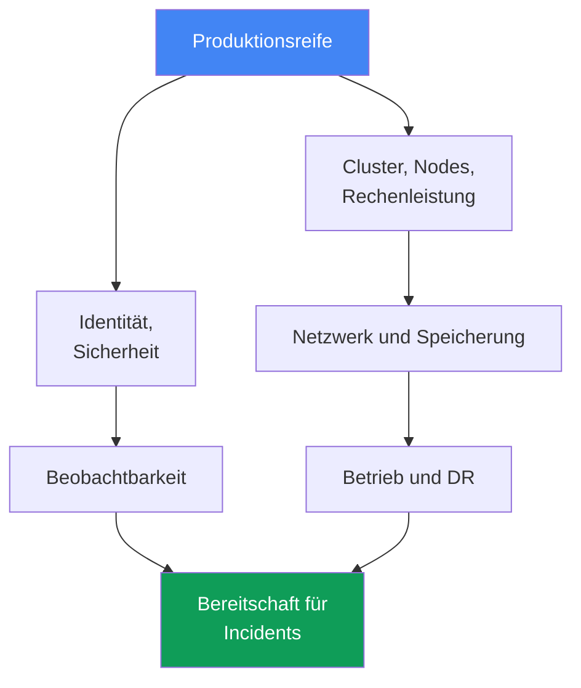
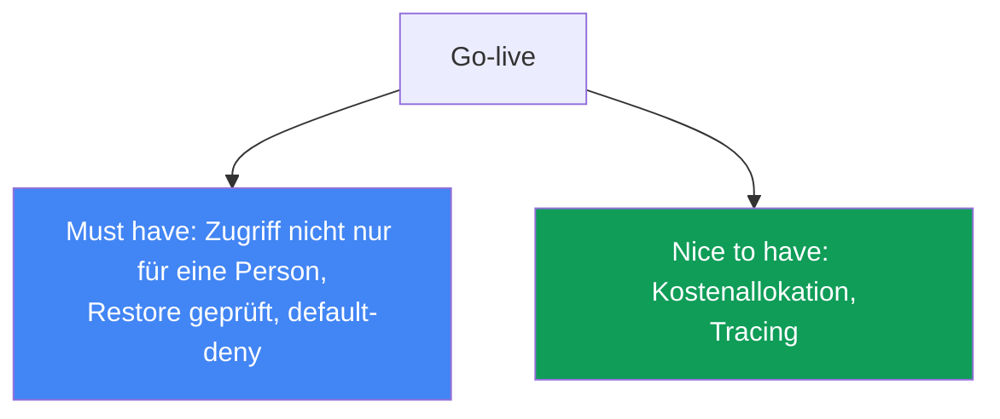

[Русская версия](ru.md) · [Eng version](en.md) · [Versión en español](es.md) · [Version française](fr.md) · [ქართული ვერსია](ge.md) · [繁體中文版](tw.md) · [日本語版](jp.md)
# Kapitel 48. EKS-Checkliste für die Produktion und weiterführende Lektüre

> **Wie es weitergeht.** Dies ist das Ende des Kurses. In 47 Kapiteln wurde der Cluster in allen Dimensionen aufgebaut: control plane und Versionen, Nodes und Skalierung, Identität und Sicherheit, Speicherung, Netzwerk, Beobachtbarkeit, Betrieb und Troubleshooting. Hier wird alles zu einer umfassenden Checkliste für die Produktionsreife zusammengeführt, nach Bereichen gegliedert und mit einem Kapitelverweis für jeden Punkt. Es kommen keine neuen Mechanismen hinzu: Das Kapitel stützt sich vollständig auf die Teile 1-8 und dient als Karte vor dem Go-live des Clusters. Zum Schluss folgt, wie Sie weitermachen können, damit dieser Kurs nicht Ihr Endpunkt bleibt.

## 48.1. Das Problem: "scheint bereit" ist nicht bereit

Der Cluster läuft, Anwendungen werden ausgerollt, die Dashboards sind grün. Die Go-live-Frist ist diese Woche, und auf die Frage "Sind wir bereit?" antwortet das Team: "Vermutlich ja, wir haben wohl alles erledigt." Genau dieses "vermutlich" ist das Problem: Ohne systematische Prüfung nach Bereichen bleiben Lücken unsichtbar, bis der erste Incident eintritt, und dann kommt genau das ans Licht, das man "wohl erledigt" hatte.

So sieht ein typisches Paket von "scheinbar bereit" aus, dessen Lücken nicht sofort auffallen:

```text
- Cluster mit Terraform erstellt, Nodes auf Karpenter       # aber ist die Version noch im standard support?
- IRSA für die Hauptanwendung eingerichtet                  # aber hat nicht nur eine Person Clusterzugriff?
- Load Balancer liefert Traffic, TLS funktioniert           # aber gibt es eine default-deny NetworkPolicy?
- Metriken und Logs fließen in CloudWatch                   # aber sind retention und Alerts eingerichtet?
- AWS Backup nach Zeitplan aktiviert                        # aber wurde ein Restore jemals geprüft?
- PDBs für kritische Services gesetzt                       # aber blockieren sie nicht ein Node-Upgrade?
```

Jede Zeile links sieht erledigt aus. Jeder Kommentar rechts ist ein eigener Incident, der im ungünstigsten Moment eintritt: Das Backup wurde nicht getestet und der Restore startet nicht; es gibt keine NetworkPolicy und ein kompromittierter Pod kann durch den ganzen Cluster laufen; ein PDB mit `maxUnavailable: 0` blockiert den Drain beim Upgrade vollständig; Clusterzugriff hatte ausschließlich ein ausgeschiedener Engineer.

Das Gedächtnis ist eine schlechte Checkliste. Nach einem halbjährigen Projekt erinnert sich niemand, ob das Audit der control plane aktiviert oder DR geprüft wurde. Es braucht eine systematische Liste über alle Bereiche, in der jeder Punkt entweder mit Verweis auf das Kapitel abgeschlossen oder ehrlich als Lücke markiert ist. Der Rest dieses Kapitels ist eine solche Liste.



## 48.2. Cluster und control plane (Teil 1)

Das Fundament. Wenn die Version nicht mehr unterstützt wird oder die Subnetze nur in einer AZ liegen, spielt alles andere keine Rolle.

| Was prüfen | Kapitel |
|---|---|
| Kubernetes-Version innerhalb des standard support, Upgrade-Plan vorhanden | Kapitel 38 |
| Endpoint-Zugriff durchdacht: public/private, source ranges passend zur Aufgabe | Kapitel 2 |
| Cluster-Subnetze in drei AZs, der IP-Plan reicht für das Wachstum der Pods | Kapitel 6, 7 |
| Cluster wurde aus Code (Terraform/eksctl) erstellt, nicht durch Klicks in der Konsole | Kapitel 4 |
| Ressourcen sind mit Tags versehen: Team, Umgebung, cost allocation | Kapitel 4, 43 |

Das Wesentliche: Der Cluster muss aus IaC reproduzierbar sein und auf einer unterstützten Version laufen. Einen manuell angelegten Cluster ohne Code kann man bei DR weder neu erstellen noch in einem pull request reviewen.

## 48.3. Rechenleistung (Teil 2)

Nodes liegen vollständig im Verantwortungsbereich des Engineers. Hier werden sowohl Hochverfügbarkeit als auch die Kosten entschieden.

| Was prüfen | Kapitel |
|---|---|
| Node-Strategie bewusst gewählt: Auto Mode, Karpenter oder managed node groups | Kapitel 9, 12 |
| Spot-Mix für fehlertolerante Workloads, Diversifizierung der Typen | Kapitel 13 |
| requests anhand tatsächlicher Werte gesetzt (right-sizing), nicht "nach Gefühl" | Kapitel 14 |
| Karpenter disruption/consolidation eingerichtet, drift wird nicht ignoriert | Kapitel 12 |
| Pod-Dichte je Node ist mit ENI- und IP-Limits abgestimmt | Kapitel 14 |

Das Wesentliche: Die Node-Strategie ist eine bewusste Wahl mit klaren Folgen für Kosten und Resilienz, nicht "den Default gelassen". Spot ohne Diversifizierung ist keine Einsparung, sondern ein Risiko.

## 48.4. Identität und Sicherheit (Teil 3)

Der breiteste Bereich und die häufigste Quelle stiller Lücken. Prüfen Sie Punkt für Punkt.

| Was prüfen | Kapitel |
|---|---|
| Pods greifen über IRSA oder Pod Identity auf AWS zu, nicht über statische Schlüssel | Kapitel 16, 17 |
| Clusterzugriff hat nicht nur der cluster creator; access entries sind angelegt | Kapitel 5, 47 |
| Secrets kommen aus Secrets Manager/SSM (External Secrets/CSI), nicht aus Manifesten | Kapitel 18 |
| Nodes und Pods sind gehärtet: IMDSv2, hop limit, Pod Security Admission | Kapitel 19 |
| Images werden in ECR gescannt, die Basis stammt aus vertrauenswürdigen Quellen | Kapitel 20 |
| Audit der control plane ist aktiviert: api, audit, authenticator in den Logs | Kapitel 21 |
| Kyverno-/Gatekeeper-Policies schließen gefährliche Muster in Manifesten aus | Kapitel 22 |

Das Wesentliche: Kein langlebiger AWS-Schlüssel in Pods und kein Cluster, auf den nur eine Person zugreifen kann. Das Audit wird vor dem Incident aktiviert, nachträglich gibt es keine Logs mehr.

## 48.5. Speicherung (Teil 4)

Ein kleiner, aber tückischer Bereich: EBS-Defaults und nicht getestete Volume-Backups treffen unerwartet.

| Was prüfen | Kapitel |
|---|---|
| Die Standard-StorageClass nutzt gp3, nicht das veraltete gp2 | Kapitel 23 |
| `volumeBindingMode: WaitForFirstConsumer`, damit das Volume nicht in der falschen AZ entsteht | Kapitel 23 |
| Persistente Volumes fließen in das Backup ein, Snapshots sind geprüft | Kapitel 23, 41 |
| Shared Storage zwischen AZs ist bewusst gewählt: EFS/FSx dort, wo ReadWriteMany benötigt wird | Kapitel 24 |

Das Wesentliche: `WaitForFirstConsumer` verhindert die klassische Falle, dass ein Pod in einer AZ und sein EBS-Volume in einer anderen liegt und der Pod dauerhaft `Pending` bleibt.

## 48.6. Netzwerk und Traffic (Teil 5)

Fehler hier sind von außen sichtbar: ein nicht erreichbarer Service, offener egress, Traffic über alle AZs.

| Was prüfen | Kapitel |
|---|---|
| Load Balancer über AWS Load Balancer Controller: NLB und ALB Ingress | Kapitel 26, 27 |
| TLS-Zertifikate über ACM, HTTPS wird am Load Balancer terminiert | Kapitel 27 |
| NetworkPolicy mit default-deny, Traffic zwischen Pods ist explizit erlaubt | Kapitel 30 |
| DNS-Einträge verwaltet external-dns, nicht manuell in Route 53 | Kapitel 29 |
| VPC endpoints für AWS-Services, NAT je AZ, egress-Traffic unter Kontrolle | Kapitel 31 |

Das Wesentliche: Eine default-deny NetworkPolicy ist die Sicherheitsgrenze innerhalb des Clusters. Ohne sie sieht jeder kompromittierte Pod alle Nachbarn. VPC endpoints senken zugleich die Kosten für egress.

## 48.7. Beobachtbarkeit (Teil 6)

Ohne diesen Bereich wird ein Incident blind untersucht. Prüfen Sie, dass Daten nicht nur fließen, sondern auch lange genug aufbewahrt werden und Alerts auslösen.

| Was prüfen | Kapitel |
|---|---|
| metrics-server läuft, ein Metrik-Backend (Prometheus/Container Insights) ist vorhanden | Kapitel 33 |
| Logs werden von Nodes und Pods exportiert, retention ist bewusst festgelegt | Kapitel 34 |
| Alerts für die wichtigsten Symptome sind eingerichtet, nicht nur Dashboards | Kapitel 33, 34 |
| Tracing für Microservices (ADOT/X-Ray), wo die Aufrufkette relevant ist | Kapitel 36 |

Das Wesentliche: Ein Dashboard, auf das niemand schaut, ersetzt keinen Alert. Retention ohne Plan bedeutet entweder verlorene Logs bei der Analyse oder eine unerwartete Speicherrechnung.

## 48.8. Betrieb (Teil 7)

Der Bereich, der "der Cluster funktioniert heute" von "der Cluster überlebt ein Upgrade und eine Störung" trennt.

| Was prüfen | Kapitel |
|---|---|
| Es gibt einen Plan für Updates des Clusters und der Add-ons, veraltete APIs sind entfernt | Kapitel 37, 38 |
| rollback readiness ist klar: Rollback-Fenster und Reihenfolge sind bekannt | Kapitel 39 |
| PDB und topology spread schützen die Verfügbarkeit bei Drain und Upgrade | Kapitel 40 |
| PDBs blockieren den Drain nicht vollständig (`maxUnavailable: 0` ist ein Warnsignal) | Kapitel 40 |
| AWS Backup ist eingerichtet: Clusterzustand und persistente Volumes | Kapitel 41 |
| DR-Restore wurde an einem game day tatsächlich getestet, nicht nur eingerichtet | Kapitel 42 |
| Kosten sind nach Teams und Namespaces sichtbar (OpenCost/Kubecost) | Kapitel 43 |
| GitOps ist die Quelle der Wahrheit für Manifeste (Argo CD/Flux) | Kapitel 44 |

Das Wesentliche: Ein konfigurierter, aber nie geprüfter Restore ist kein Backup, sondern Hoffnung. Ein game day macht aus DR mit dem Status "sollte funktionieren" den Status "funktionierte dann und dann".

## 48.9. Bereitschaft für Incidents (Teil 8)

Der abschließende Bereich: Wenn alles ausfällt, zählt nicht der Aufbau, sondern die Geschwindigkeit der Eingrenzung.

| Was prüfen | Kapitel |
|---|---|
| Ein Runbook für eine Node, die dem Cluster nicht beigetreten ist, ist vorhanden | Kapitel 45 |
| Ein Runbook für Netzwerkfehler ist vorhanden: ENI, SG/NACL, DNS, unhealthy targets | Kapitel 46 |
| Ein Runbook für Zugriff ist vorhanden: 401 gegenüber 403, IRSA/Pod Identity, kubeconfig | Kapitel 47 |
| SSM-Zugriff auf Nodes funktioniert (ohne ungeschütztes SSH), ein Zugriff auf den Knoten ist möglich | Kapitel 45 |
| Control plane logging ist aktiviert, authenticator- und API-Logs sind verfügbar | Kapitel 21, 34 |

Das Wesentliche: Runbooks und Zugriff über SSM müssen vor dem Incident existieren. Zugriff auf eine Node einzurichten, wenn sie bereits defekt ist, ist zu spät.

## 48.10. Gesamtbild und Prioritäten

Die acht Bereiche oben sind die Achsen der Bereitschaft. Keine darf ausgelassen werden, doch nicht alle sind für den ersten Produktionsstart gleich dringend. Einige Punkte sind "must have", ohne sie ist das Einschalten von produktivem Traffic gefährlich; andere sind "nice to have" und werden erst in der Produktion nachgezogen, ohne den Start zu blockieren.



| Priorität | Punkte | Warum |
|---|---|---|
| Must have vor dem Go-live | unterstützte Version, Zugriff nicht nur für eine Person, Audit und Logs der control plane aktiviert, default-deny NetworkPolicy, keine Secrets in Manifesten, Restore getestet, PDBs blockieren kein Upgrade | Ohne das ist der erste Incident oder Einbruch teurer als eine Verzögerung des Starts |
| Wichtig in den ersten Wochen | right-sizing der requests, Spot-Mix, Log-retention, Alerts, Upgrade-Plan, VPC endpoints | Beeinflusst Resilienz und Kosten, blockiert den Start aber nicht |
| Nice to have | Tracing für Microservices, detaillierte Kostenallokation, ausgereiftes GitOps für eine Clusterlandschaft | Erhöht die Reife und wird in der Produktion iterativ fertiggestellt |

Der praktische Sinn der Tabelle: Wenn die Frist drängt, wird zuerst die gesamte Spalte "must have" geschlossen. Den Rest plant man als explizite Aufgaben mit Verantwortlichen, statt ihn auf "irgendwann später" zu verschieben.

## 48.11. Einführungsszenarien: womit anfangen

Der Kurs ist umfangreich, und "womit anfangen" hängt vom Kontext ab. Ein Startup von null und ein Unternehmen, das aus dem eigenen Rechenzentrum migriert, beginnen an unterschiedlichen Punkten. Es gibt keine einheitlich richtige Reihenfolge, aber ein allgemeines Prinzip: Jeder Start erfolgt als Code und mit Isolation, damit Entscheidungen umkehrbar bleiben. Es folgen zwei ausgearbeitete Szenarien und ein gemeinsames Fazit. Kostspielige Anforderungen werden nicht vorzeitig eingeführt, der Weg zu ihnen wird jedoch nicht versperrt.

### Szenario 1. Startup von null: MVP schnell und günstig, ohne spätere Umbauten

Es gibt noch kein Produkt; ein MVP wird möglichst schnell und günstig benötigt. Ein Audit wie PCI DSS ist aktuell nicht erforderlich, aber die Architektur muss es ermöglichen, es später ohne Umbau und ohne unnötige Kosten heute hinzuzufügen.

- **Schneller Start.** EKS Auto Mode oder managed node groups mit Karpenter, Spot für nicht-produktive Workloads (Kapitel 9, 12, 13). Der Cluster ist vom ersten Tag an Code über terraform-aws-eks (Kapitel 4), damit später nicht nachgebaut werden muss, was per Klick erstellt wurde.
- **Jetzt günstig.** Möglichst wenig NAT und Traffic zwischen AZs (Kapitel 31), ein Cluster mit Isolation nach Namespace statt einer Clusterlandschaft (Kapitel 32), managed Add-ons statt Eigenbetrieb (Kapitel 37).
- **Damit später kein Umbau nötig ist.** Gleich private endpoint und IRSA/Pod Identity statt Schlüssel (Kapitel 16, 17, 19), mindestens grundlegende Audit-Logs der control plane und Tags für Kosten (Kapitel 21, 43), StorageClass mit gp3 und `WaitForFirstConsumer` (Kapitel 23).
- **Vorbereitung auf PCI DSS ohne heutige Kosten.** Kostengünstige Bausteine werden strukturell aktiviert: audit logs, Verschlüsselung der Secrets mit KMS, NetworkPolicy-kompatibles CNI, Pod Security Admission. Kostspieliges, etwa dedizierte Accounts, GuardDuty runtime und vollständige Segmentierung, wird verschoben, aber der Weg dorthin nicht geschlossen (Kapitel 18, 19, 21, 22, 30). Der Schlüssel: Isolation durch Namespaces und Accounts sowie IaC ermöglichen späteres Wachstum bis zum Audit.

### Szenario 2. Eigenes Rechenzentrum -> EKS: nahtlose Migration

Das Unternehmen betreibt eigene Server im Rechenzentrum, einschließlich eines eigenen Kubernetes, und migriert zu EKS und AWS. Es braucht eine Migration ohne Ausfallzeit und mit einem Rollback-Plan.

- **Konnektivität zwischen on-prem und VPC.** Site-to-Site VPN oder Direct Connect, Abstimmung der CIDRs, damit sich die Bereiche nicht überschneiden (Kapitel 6, 31, 32); während des Übergangs eine hybride Architektur.
- **Schrittweise Übernahme.** Workloads werden Service für Service verschoben; die Umschaltung erfolgt über DNS und Traffic-Gewichtung (Kapitel 29); Daten werden über Replikate und Backups übertragen, nicht in einem einzigen Schritt.
- **Was "Manifeste einfach übertragen" scheitern lässt.** StorageClass und Volumes (EBS ist an eine AZ gebunden, Kapitel 23; shared ist EFS, Kapitel 24), LoadBalancer und Ingress werden zu NLB und ALB (Kapitel 26, 27), NetworkPolicy hängt vom CNI ab (Kapitel 30), Zugriff läuft über IAM und RBAC access entries (Kapitel 5), identity über IRSA/Pod Identity statt statischer Schlüssel (Kapitel 16, 17).
- **Pod-Dichte.** Auf overlay-CNI halten kubeadm-Nodes Hunderte kleiner Pods, während VPC CNI jedem Pod eine echte IP aus der VPC gibt und am ENI-Limit anstößt, also bei Dutzenden Pods je Node. Abhilfe schaffen prefix delegation und eine Neuberechnung von `max-pods`; sonst bleiben Pods `Pending` (Kapitel 7, 14).
- **Prüfung auf Parität.** Zuerst ein nicht-produktiver Cluster: Last und Beobachtbarkeit testen (Kapitel 33, 34), danach die Produktion. Der Rollback-Plan bleibt bereit (Kapitel 42).

Zusammengefasst sehen die beiden Starts so aus:

| Szenario | Womit anfangen | Was verschieben |
|---|---|---|
| Startup von null | IaC, private endpoint, IRSA, gp3, grundlegendes Audit und Tags | GuardDuty runtime, Multi-Account, vollständige Segmentierung |
| Rechenzentrum -> EKS | Konnektivität und CIDR, Parität in nicht-produktiver Umgebung, Rollback-Plan | Kostenoptimierung und ausgereiftes Multi-Cluster |

Das allgemeine Prinzip: Jeder Start erfolgt als Code und mit Isolation (Namespace oder Accounts), damit Entscheidungen umkehrbar sind. Kostspielige Anforderungen werden nicht zu früh mitgenommen, aber es wird auch keine Architektur angelegt, die sie ausschließt. Dann ist der Übergang vom MVP zum Audit oder vom Hybridmodell zu vollständigem EKS ein Feinschliff und kein Neubau.

## 48.12. Was als Nächstes lesen

Der Kurs ist eine Karte, keine Obergrenze. Danach sollten Sie zu den Primärquellen gehen und sie griffbereit halten.

- **EKS Best Practices Guide** - die offizielle AWS-Sammlung von Empfehlungen zu Sicherheit, Netzwerk, Zuverlässigkeit, Autoskalierung und Kosten. Der nächste Bezugspunkt nach diesem Kurs: Sie vertieft genau die Bereiche der obigen Checkliste.
- **AWS Well-Architected Framework** - sechs Säulen (operational excellence, security, reliability, performance, cost, sustainability) als allgemeiner Rahmen zur Bewertung jedes Systems in AWS, nicht nur von EKS. Nützlich für ein Review der gesamten Architektur.
- **Kubernetes documentation** - Primärquelle für Kubernetes selbst: API, Controller, Scheduler. Alles, was nicht EKS-spezifisch ist, befindet sich dort.
- **EKS release calendar und version lifecycle** - der offizielle Zeitplan für Releases und das Ende der Unterstützung von Versionen. Daraus entsteht der Update-Plan (Kapitel 38); verfolgen Sie ihn ständig, statt sich einen Monat vor Ende des Supports daran zu erinnern.
- **CNCF-Projekte und Community** - Karpenter, Cilium, Argo, Prometheus, OpenTelemetry und weitere Werkzeuge aus dem Kurs entwickeln sich in CNCF weiter; ihre release notes und Diskussionen zeigen, wohin sich das Ökosystem bewegt. Aktive Community-Kanäle (Kubernetes Slack, GitHub-Diskussionen der Projekte) bieten eine schnelle Möglichkeit zu prüfen, ob jemand bereits auf Ihr Problem gestoßen ist.

Die Regel ist einfach: Die Checkliste dieses Kapitels sagt, **was** zu prüfen ist, die genannten Ressourcen sagen, **wo** Details zu finden sind und wie Sie Änderungen verfolgen, wenn sich Versionen und best practices verändern.

### Kursgrenzen: was hier bewusst nicht behandelt wird

Der Kurs hält sich an ein Thema, den Betrieb von EKS, und alles, was davon wegführt, wird bewusst anderen Quellen überlassen. Das sind keine Lücken, sondern gewählte Grenzen. Im Folgenden steht, was genau außerhalb des Rahmens bleibt und wohin Sie für Details gehen können.

| Thema | Warum außerhalb des Rahmens | Wohin gehen |
|---|---|---|
| HashiCorp Vault über den Überblick hinaus: PKI und transit engine, Installation im Cluster, HCL-Policies, Vault namespaces | Eigenständiges Produkt mit eigenem Betriebsmodell, kein Teil von EKS; eine Übersicht zu Vault als Schicht für die Secret-Speicherung enthält der Kurs (Kapitel 18) | Vault-Dokumentation |
| Herstellerabhängige CI-Pipelines: fertige Beschreibungen für GitHub Actions, GitLab CI und andere | Der Kurs beschreibt GitOps als Modell, nicht die Syntax eines konkreten CI (Kapitel 44) | Dokumentation Ihres CI-Systems |
| Multi-Account und Multi-Cluster in der Praxis | Als Architektur behandelt (Kapitel 32), keine reproduzierbare Praxis: mindestens zwei AWS-Accounts erforderlich | AWS-Organizations- und EKS-Dokumentation |
| Audit und Erkennung mit GuardDuty in der Praxis | Mechanik beschrieben (Kapitel 21), keine Praxis: kostenpflichtiger Service, löst nicht sofort aus | Amazon-GuardDuty-Dokumentation |
| Anwendungsentwicklung und Service-Code, einschließlich Datenschemata | Der Kurs behandelt die Plattform, nicht das Schreiben einer Anwendung | Fachquellen zur Entwicklung |
| Anwendungsdienste von AWS außerhalb des Clusters: RDS, Queues, Caches | Als Verbraucher und Kostenquelle erwähnt, aber ohne eigenen Betrieb im Kurs | Dokumentation der jeweiligen AWS-Services |
| Progressive Delivery über den Überblick hinaus: Argo Rollouts, Flagger | Genannt und von Cluster-blue/green abgegrenzt (Kapitel 44), ohne eigenes Kapitel | Argo-Rollouts- und Flagger-Dokumentation |
| Windows-Nodes | Nur dort erwähnt, wo sie die Mechanik ändern: Einschränkungen von Pod Identity, Typen von access entry | EKS-Dokumentation zu Windows-Nodes |
| Managed-Funktion von EKS für Argo CD als Praxis | Im Text behandelt (Kapitel 44), kein Labor: Authentifizierung erfolgt ausschließlich über AWS Identity Center, das AWS Organizations erfordert und in einem persönlichen Account eine Hürde ist | EKS- und AWS-Identity-Center-Dokumentation |

Die Liste der Grenzen ist keine Liste offener Arbeiten. Jede Zeile oben ist eine Entscheidung darüber, wo der Betrieb von EKS endet und ein anderes Fachgebiet beginnt. Wenn Sie ein Thema jetzt benötigen, bietet der Kurs genug Kontext, um die jeweilige Dokumentation nicht bei null, sondern mit Verständnis dafür zu lesen, wo sie sich einfügt.

## 48.13. Wie das in der Produktion eingesetzt wird

- **Die Checkliste als lebendes Dokument im Repository führen.** Nicht im Kopf und nicht im Chat, sondern neben IaC, wo sie im pull request sichtbar ist und ihre Änderungshistorie nachverfolgt werden kann.
- **Ownership für die Bereiche zuweisen.** Jeder Bereich, etwa Netzwerk, Sicherheit oder Kosten, hat eine verantwortliche Person, die dafür einsteht, dass seine Punkte geschlossen sind und nicht degradieren.
- **Die Checkliste vor jedem Go-live durchgehen.** Ein neuer Cluster oder ein neuer großer Service geht nicht live, bis die Spalte "must have" vollständig und ausdrücklich geschlossen ist.
- **Regelmäßig statt einmalig überprüfen.** Einmal je Quartal und nach großen Änderungen: Versionen altern, Lasten steigen, und das gestrige "erledigt" ist heute vielleicht bereits eine Lücke.
- **Lücken ehrlich markieren.** Ein offener Punkt wird als bekanntes Risiko mit Aufgabe und Frist markiert, nicht stillschweigend übersprungen, damit die Checkliste grün aussieht.
- **Mit game days und Upgrades verknüpfen.** DR-Restore und Upgrade-Plan werden in Übungen geprüft; das Ergebnis fließt als bestätigter oder fehlgeschlagener Punkt in die Checkliste zurück.

## 48.14. Mini-Glossar

- **Produktions-Checkliste** - systematische Liste von Bereitschaftsprüfungen nach Bereichen, in der jeder Punkt mit Kapitelverweis abgeschlossen oder als bekanntes Risiko markiert ist.
- **Bereich der Bereitschaft** - eine getrennt geprüfte Achse des Betriebs (control plane, Nodes, Sicherheit, Netzwerk, Speicherung, Beobachtbarkeit, Betrieb, Incidents).
- **must have** - ein Punkt, ohne den der Produktionsstart gefährlich ist und blockiert werden muss.
- **nice to have** - ein reifefördernder Punkt, der erst in der Produktion fertiggestellt werden darf.
- **standard support** - der Zeitraum der EKS-Versionsunterstützung, innerhalb dessen die Version betrieben wird (Kapitel 38).
- **rollback readiness** - Bereitschaft für ein Versions-Rollback: Fenster und Reihenfolge sind bekannt (Kapitel 39).
- **game day** - Übung, bei der DR- und Incident-Szenarien in der Praxis geprüft werden (Kapitel 42).
- **ownership** - festgelegte Verantwortung für einen Bereich oder Punkt der Checkliste.

## 48.15. Zusammenfassung des Kapitels und des Kurses

- "Scheint bereit" ohne systematische Prüfung ist keine Bereitschaft: Lücken bleiben unsichtbar, bis der erste Incident sie offenlegt. Das Gedächtnis wird durch eine Checkliste nach Bereichen ersetzt.
- Produktionsreife gliedert sich in neun Bereiche, die die Teile des Kurses wiederholen: control plane, Nodes, Sicherheit, Speicherung, Netzwerk, Beobachtbarkeit, Betrieb, Incidents.
- AWS betreibt die control plane, aber Version, Zugriff, IaC und Tags bleiben Aufgabe des Engineers (Teil 1).
- Nodes, Spot-Mix, right-sizing und disruption sind eine bewusste Wahl von Kosten und Resilienz, kein Default (Teil 2).
- Kein langlebiger Schlüssel in Pods, Zugriff nicht nur für eine Person, Audit rechtzeitig aktiviert und default-deny im Netzwerk bilden die Grundlage der Sicherheit (Teile 3 und 5).
- Ein eingerichteter, aber ungeprüfter Restore ist Hoffnung, kein Backup; DR wird im game day geprüft, und Upgrades haben einen Plan sowie rollback readiness (Teil 7).
- Runbooks und SSM-Zugriff bestehen vor dem Incident; bei einer Störung zählt die Geschwindigkeit der Eingrenzung, nicht der Aufbau (Teil 8).
- Priorisierung entscheidet über den Termin: Zuerst wird alles unter "must have" geschlossen, der Rest wird als Aufgabe geplant. Danach folgen EKS Best Practices Guide, Well-Architected, Kubernetes docs und der Versionskalender.

## 48.16. Wie das in der praktischen Arbeit hilft

Der Moment, in dem ein Cluster in Produktion geht, ist fast immer von Termindruck und der Versuchung begleitet zu sagen: "Scheint bereit, los geht's." Ein Engineer mit einer Checkliste nach Bereichen antwortet anders: Er geht die neun Achsen durch, schließt die Spalte "must have" und benennt die verbliebenen Lücken ausdrücklich als Aufgaben mit Verantwortlichen. Das ist keine Bürokratie, sondern Absicherung: Jeder Punkt der Checkliste entspricht einem Incident, der nicht passiert, weil er vorab bedacht wurde. Der Unterschied zwischen Teams zeigt sich nicht am Tag des Starts, sondern beim ersten schweren Ausfall: Bei manchen tauchen ein ungetesteter Restore und Zugriff für einen Ausgeschiedenen auf, bei anderen wird der Incident in Minuten anhand des Runbooks eingegrenzt.

Bei der Planung wirkt die Checkliste als Reifekarte. Sie zeigt, wo der Cluster stark ist und wo er an "später fertig machen" hängt, und macht aus dem vagen "das sollten wir verbessern" konkrete Aufgaben nach Bereichen, mit Eigentümern und Terminen. Bei einer vierteljährlichen Überprüfung verhindert sie, dass die Bereitschaft abnimmt, während Versionen altern und Lasten wachsen. Die Kapitelverweise machen sie zudem eigenständig: Jeder Punkt kann bis zu Befehlen und Details aufgelöst werden, indem man zum passenden Kapitel zurückkehrt. Der Kurs endet, der Betrieb jedoch nicht, und diese Checkliste bleibt ein Arbeitswerkzeug.

## 48.17. Fragen zur Selbstkontrolle

1. Warum ist "scheint bereit" ohne systematische Prüfung gefährlich, und was ersetzt die Erinnerung an Erledigtes?
2. In welche neun Bereiche gliedert sich die Produktionsreife, und wie sind sie mit den Teilen des Kurses verbunden?
3. Was bleibt im Bereich control plane trotz des Managed-Betriebs beim Engineer (Teil 1)?
4. Welche Punkte zu Nodes gehören in die Checkliste, und warum sind sie eine bewusste Wahl (Teil 2)?
5. Nennen Sie die Sicherheitsaspekte, die vor der Produktion zwingend geprüft werden müssen (Teil 3).
6. Warum gehört `volumeBindingMode: WaitForFirstConsumer` in die Checkliste für Speicherung (Kapitel 23)?
7. Warum enthält der Netzwerkbereich eine default-deny NetworkPolicy, und was schützt sie (Kapitel 30)?
8. Worin unterscheidet sich ein "eingerichtetes Backup" von einem "getesteten Restore", und welche Rolle spielt ein game day dabei?
9. Warum ist ein PDB mit `maxUnavailable: 0` ein Warnsignal bei einem Node-Upgrade (Kapitel 40)?
10. Was muss im Bereich der Incident-Bereitschaft vor einem Incident vorhanden sein und nicht erst danach?
11. Wie unterscheiden Sie "must have vor dem Go-live" von "nice to have", und warum ist diese Priorisierung nötig?
12. Wie wird die Checkliste in der Produktion geführt und überprüft: Wo lebt sie, wer ist verantwortlich, wie häufig erfolgt die Prüfung?
13. Welche Ressourcen sollten Sie als Nächstes lesen, und welche Rolle spielt der EKS-Versionskalender (Kapitel 38)?

## Praxis

Für dieses Kapitel gibt es kein separates Labor: Es führt den gesamten Kurs in einer Checkliste zusammen. Die beste Praxis ist, sie am eigenen Cluster durchzugehen, die Punkte mit Befehlen aus den passenden Kapiteln zu schließen und ehrlich festzuhalten, wo Lücken gefunden wurden.

Beginnen Sie mit dem Fundament, Version und Zugriffsmodus (Kapitel 38, 2):

```bash
# Clusterversion und Support-Status
aws eks describe-cluster --name <cluster> --query 'cluster.{version:version,status:status}'
# Zugriffsmodus für Endpoint und accessConfig
aws eks describe-cluster --name <cluster> \
  --query 'cluster.{endpoint:resourcesVpcConfig,access:accessConfig}'
```

Prüfen Sie die Zugriffssicherheit und das aktivierte Audit (Kapitel 47, 21):

```bash
# welche principals sind auf den Clusterzugriff gemappt - ist es nur einer?
aws eks list-access-entries --cluster-name <cluster>
# welche Log-Typen der control plane sind aktiviert
aws eks describe-cluster --name <cluster> --query 'cluster.logging'
```

Sehen Sie sich Netzwerk und Speicherung an, default-deny und StorageClass (Kapitel 30, 23):

```bash
# gibt es mindestens eine NetworkPolicy? (leer bedeutet: default-deny gibt es sicher nicht)
kubectl get networkpolicy -A
# Standard-StorageClass und Bindungsmodus des Volumes
kubectl get storageclass
```

Danach der Betrieb, Backup und Schutz der Verfügbarkeit (Kapitel 41, 40):

```bash
# AWS-Backup-Pläne im Account
aws backup list-backup-plans --query 'BackupPlansList[].BackupPlanName'
# PDBs im Cluster - ist maxUnavailable: 0 darunter?
kubectl get pdb -A
```

Wenn Sie die Bereiche aus den Abschnitten 48.2-48.9 durchgegangen sind, erhalten Sie nicht ein abstraktes "scheint bereit", sondern ein konkretes Bild: Was mit Kapitelverweis geschlossen ist und was als Lücke bleibt. Formulieren Sie die Lücken als Aufgaben mit Verantwortlichen und Fristen und beginnen Sie mit der Spalte "must have" aus Abschnitt 48.10. Das ist der Übergang von Hoffnung zu Bereitschaft.

---
[Inhaltsverzeichnis](../README_DE.md) · [Kapitel 47](../47/de.md)
