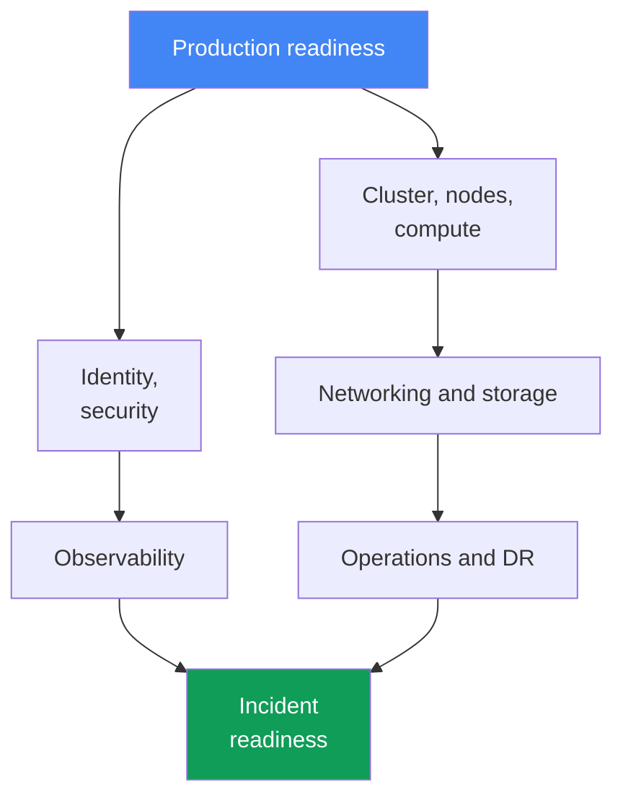
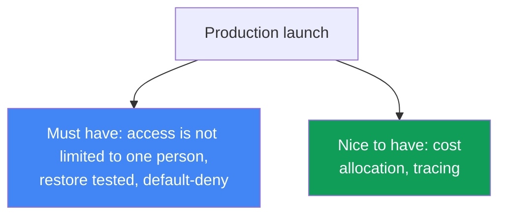

[Русская версия](ru.md) · [Versión en español](es.md) · [Version française](fr.md) · [Deutsche Version](de.md) · [ქართული ვერსია](ge.md) · [繁體中文版](tw.md) · [日本語版](jp.md)
# Chapter 48. EKS production checklist and what to read next

> **What is next.** This is the end of the course. Across 47 chapters, the cluster has been built
> from every angle: control plane and versions, nodes and scaling, identity and security, storage,
> networking, observability, operations, and troubleshooting. Here, all of that comes together in
> one consolidated production-readiness checklist by domain, with the relevant chapter for each
> item. There are no new mechanisms here: the chapter relies on all of parts 1-8 and serves as a
> map before taking a cluster to production. At the end, you will find where to go next so that you
> do not stop with this course.

## 48.1. The problem: "seems ready" is not ready

The cluster is up, applications are deploying, dashboards are green. The production deadline is
this week, and when asked "are we ready?", the team answers "I think so, I think we did
everything." That "I think" is precisely the problem: without a systematic check across domains,
gaps remain invisible until the first incident happens, and then exactly what was only "probably
done" surfaces.

This is what a typical set of "seems ready" items looks like, where the gaps are not obvious:

```text
- the cluster was created through Terraform, nodes use Karpenter  # but is the version still in standard support?
- IRSA is configured for the main application                     # but does more than one person have cluster access?
- the load balancer serves traffic, TLS works                     # but is there a default-deny NetworkPolicy?
- metrics and logs flow to CloudWatch                             # but are retention and alerts configured?
- AWS Backup is enabled on a schedule                             # but has a restore ever been tested?
- critical services have PDBs                                     # but do they block node upgrades?
```

Every line on the left looks complete. Every comment on the right is a separate incident that
will arrive at the worst possible time: the backup was never tested and the restore does not come
up; there is no NetworkPolicy, so a compromised Pod can reach the entire cluster; a PDB with
`maxUnavailable: 0` permanently blocks drain during an upgrade; only an engineer who has left
the company had cluster access.

Memory is a poor checklist. After a six-month project, no one remembers whether control plane
audit logging was enabled or DR was tested. You need a systematic list covering every domain,
where every item is either complete with a reference to its chapter or honestly marked as a gap.
The rest of this chapter is that list.



## 48.2. Cluster and control plane (Part 1)

The foundation. If the version is out of support or subnets are configured in one AZ, nothing else
matters.

| What to check | Chapter |
|---|---|
| Kubernetes version is within standard support and there is an upgrade plan | chapter 38 |
| Endpoint access is deliberate: public/private and source ranges fit the need | chapter 2 |
| Cluster subnets span three AZs, and the IP plan supports Pod growth | chapters 6, 7 |
| The cluster is created from code (Terraform/eksctl), not through console clicks | chapter 4 |
| Resources are tagged with team, environment, and cost-allocation tags | chapters 4, 43 |

The key point: the cluster must be reproducible from IaC and run on a supported version. A manual
cluster without code cannot be recreated for DR and cannot be reviewed in a pull request.

## 48.3. Compute (Part 2)

Nodes are entirely the engineer's responsibility. This is where both resilience and the bill are
decided.

| What to check | Chapter |
|---|---|
| The node strategy is deliberately chosen: Auto Mode, Karpenter, or managed node groups | chapters 9, 12 |
| Spot mix for fault-tolerant workloads, with instance-type diversification | chapter 13 |
| requests are set from actual usage (right-sizing), not by guesswork | chapter 14 |
| Karpenter disruption/consolidation is configured and drift is not ignored | chapter 12 |
| Pod density per node is aligned with ENI and IP limits | chapter 14 |

The key point: a node strategy is a deliberate choice with understood implications for cost and
resilience, not "we left the default." Spot without diversification is not savings, it is risk.

## 48.4. Identity and security (Part 3)

The broadest domain and the most frequent source of quiet gaps. Check it item by item.

| What to check | Chapter |
|---|---|
| Pods access AWS through IRSA or Pod Identity, not static keys | chapters 16, 17 |
| Cluster access is not limited to the cluster creator; access entries are in place | chapters 5, 47 |
| Secrets use Secrets Manager/SSM (External Secrets/CSI), not manifests | chapter 18 |
| Nodes and Pods are hardened: IMDSv2, hop limit, Pod Security Admission | chapter 19 |
| Images are scanned in ECR and their base comes from trusted sources | chapter 20 |
| Control plane audit is enabled: api, audit, authenticator in logs | chapter 21 |
| Kyverno/Gatekeeper policies prevent dangerous manifest patterns | chapter 22 |

The key point: no long-lived AWS key in any Pod, and no cluster where only one person has access.
Enable auditing before an incident, because logs will not exist after the fact.

## 48.5. Storage (Part 4)

A small but treacherous domain: EBS defaults and untested volume backup cause unexpected damage.

| What to check | Chapter |
|---|---|
| The default StorageClass is gp3, not the obsolete gp2 | chapter 23 |
| `volumeBindingMode: WaitForFirstConsumer`, so a volume is not created in the wrong AZ | chapter 23 |
| Persistent volumes are included in backups and snapshots are verified | chapters 23, 41 |
| Shared storage across AZs is deliberate: EFS/FSx where ReadWriteMany is needed | chapter 24 |

The key point: `WaitForFirstConsumer` avoids the classic trap where the Pod is in one AZ but its
EBS volume is in another, leaving the Pod permanently `Pending`.

## 48.6. Networking and traffic (Part 5)

Mistakes here are visible from outside: an unavailable service, open egress, traffic across every
AZ.

| What to check | Chapter |
|---|---|
| Load balancers use AWS Load Balancer Controller: NLB and ALB Ingress | chapters 26, 27 |
| TLS certificates use ACM and HTTPS terminates at the load balancer | chapter 27 |
| NetworkPolicy has default-deny, and traffic between Pods is explicitly allowed | chapter 30 |
| DNS records are managed by external-dns, not manually in Route 53 | chapter 29 |
| VPC endpoints for AWS services, NAT per AZ, and egress traffic under control | chapter 31 |

The key point: a default-deny NetworkPolicy is the security boundary inside the cluster. Without
it, any compromised Pod can see every neighbor. VPC endpoints also reduce egress cost.

## 48.7. Observability (Part 6)

Without this domain, an incident is debugged blind. Check that data is not merely flowing, but is
also retained for the required period and produces alerts.

| What to check | Chapter |
|---|---|
| metrics-server works, and a metrics backend exists (Prometheus/Container Insights) | chapter 33 |
| Logs are exported from nodes and Pods, with retention set deliberately | chapter 34 |
| Alerts are configured for key symptoms, not only dashboards | chapters 33, 34 |
| Tracing for microservices (ADOT/X-Ray), where the call chain matters | chapter 36 |

The key point: a dashboard that nobody watches does not replace an alert. Retention without a
plan means either lost logs during investigation or an unexpected storage bill.

## 48.8. Operations (Part 7)

The domain that separates "the cluster works today" from "the cluster will survive an upgrade and
a failure."

| What to check | Chapter |
|---|---|
| There is a plan for cluster and add-on updates, and deprecated APIs are removed | chapters 37, 38 |
| Rollback readiness is understood: the rollback window and order are known | chapter 39 |
| PDBs and topology spread protect availability during drain and upgrades | chapter 40 |
| PDBs do not permanently block drain (`maxUnavailable: 0` is a red flag) | chapter 40 |
| AWS Backup is configured for cluster state and persistent volumes | chapter 41 |
| DR restore was actually tested in a game day, not merely configured | chapter 42 |
| Cost is visible by team and namespace (OpenCost/Kubecost) | chapter 43 |
| GitOps is the source of truth for manifests (Argo CD/Flux) | chapter 44 |

The key point: a configured but never tested restore is not backup, it is hope. A game day moves
DR from "it should work" to "it worked on this date."

## 48.9. Incident readiness (Part 8)

The final domain: when everything fails, the important thing is not the design, but the speed of
localization.

| What to check | Chapter |
|---|---|
| There is a runbook for a node that did not join | chapter 45 |
| There is a runbook for network failures: ENI, SG/NACL, DNS, unhealthy targets | chapter 46 |
| There is a runbook for access: 401 versus 403, IRSA/Pod Identity, kubeconfig | chapter 47 |
| SSM access to nodes works (without bare SSH), and you can enter a node | chapter 45 |
| Control plane logging is enabled and authenticator and API logs are available | chapters 21, 34 |

The key point: runbooks and SSM access must exist before an incident. It is too late to configure
node access when the node is already broken.

## 48.10. The big picture and priorities

The eight domains above are readiness axes. None can be skipped, but they are not all equally
urgent for an initial production launch. Some items are must-have, where enabling production
traffic without them is dangerous; some are nice-to-have, completed already in production without
blocking launch.



| Priority | Items | Why |
|---|---|---|
| Must have before production | supported version, access for more than one person, control plane auditing and logs enabled, default-deny NetworkPolicy, secrets not in manifests, restore tested, PDBs do not block upgrades | without this, the first incident or compromise costs more than a delayed launch |
| Important in the first weeks | right-sizing requests, spot mix, log retention, alerts, upgrade plan, VPC endpoints | affects resilience and cost, but does not block launch |
| Nice to have | microservice tracing, detailed cost allocation, mature GitOps for a fleet of clusters | increases maturity and can be delivered iteratively in production |

The practical meaning of the table is this: if the deadline is tight, complete the entire
"must-have" column first, and plan the rest as explicit tasks with owners rather than leaving it
for "sometime later."

## 48.11. Adoption scenarios: where to start

The course is large, and "where to start" depends on context. A startup beginning from scratch
and a company moving from its own data center begin at different points. There is no single right
sequence, but there is one common principle: begin anything as code and with isolation so that
decisions remain reversible. Below are two detailed scenarios and a general conclusion. Do not
bring in expensive requirements prematurely, but do not close the path to them either.

### Scenario 1. Startup from scratch: an MVP quickly and cheaply, without rework later

There is no product yet, and an MVP is needed as quickly and cheaply as possible. An audit such as
PCI DSS is not required now, but the architecture must make it possible to add later without
rework or unnecessary cost today.

- **Fast start.** EKS Auto Mode or managed node groups with Karpenter, Spot for non-production
  workloads (chapters 9, 12, 13). A cluster as code from day one with terraform-aws-eks (chapter
  4), so that resources created through clicks do not have to be rebuilt later.
- **Cheap now.** Minimize NAT and cross-AZ traffic (chapter 31), use one cluster with namespace
  isolation instead of a fleet of clusters (chapter 32), and use managed add-ons rather than
  self-maintenance (chapter 37).
- **Avoid rework later.** Use a private endpoint and IRSA/Pod Identity instead of keys from the
  start (chapters 16, 17, 19), at least basic control plane audit logging and cost tags (chapters
  21, 43), and a StorageClass with gp3 and `WaitForFirstConsumer` (chapter 23).
- **A foundation for PCI DSS without spending now.** Structurally enable the inexpensive parts:
  audit logs, KMS encryption for secrets, a NetworkPolicy-compatible CNI, and Pod Security
  Admission. Defer the expensive parts, dedicated accounts, GuardDuty runtime, and full
  segmentation, but do not block the way to them (chapters 18, 19, 21, 22, 30). The key is that
  isolation through namespaces and accounts plus IaC allows growth toward an audit later.

### Scenario 2. Own data center -> EKS: seamless migration

The company has its own servers in a data center, including its own Kubernetes, and is moving to
EKS and AWS. It needs a migration without downtime and with a rollback plan.

- **On-premises and VPC connectivity.** Site-to-Site VPN or Direct Connect, plus CIDR alignment
  to prevent overlapping ranges (chapters 6, 31, 32); use a hybrid model during the transition.
- **Gradual migration.** Move workloads service by service; switch through DNS and traffic
  weighting (chapter 29); move data through replicas and backups rather than all at once.
- **What breaks "simply moving manifests."** StorageClasses and volumes (EBS is bound to an AZ,
  chapter 23; shared storage is EFS, chapter 24), LoadBalancer and Ingress become NLB and ALB
  (chapters 26, 27), NetworkPolicy depends on the CNI (chapter 30), access uses IAM and RBAC
  access entries (chapter 5), and identity uses IRSA/Pod Identity instead of static keys
  (chapters 16, 17).
- **Pod density.** Overlay-CNI kubeadm nodes can hold hundreds of small Pods, while VPC CNI gives
  every Pod a real VPC IP and hits the ENI limit, meaning tens of Pods per node. Use prefix
  delegation and recalculate `max-pods`, otherwise Pods remain `Pending` (chapters 7, 14).
- **Parity verification.** Start with a non-production cluster: run workload and observability
  tests (chapters 33, 34), then move to production. Keep the rollback plan ready (chapter 42).

In summary, the two starting points look like this:

| Scenario | Where to start | What to defer |
|---|---|---|
| Startup from scratch | IaC, private endpoint, IRSA, gp3, basic auditing and tags | GuardDuty runtime, multi-account, full segmentation |
| Data center -> EKS | connectivity and CIDR, parity in non-production, rollback plan | cost optimization and mature multi-cluster setup |

The general principle: begin anything as code and with isolation, through namespaces or accounts,
so that decisions remain reversible. Do not bring in expensive requirements prematurely, but do
not design an architecture that excludes them. Then moving from an MVP to an audit, or from a
hybrid setup to full EKS, is refinement rather than a rewrite.

## 48.12. What to read next

The course is a map, not a ceiling. Next, turn to primary sources and keep them close at hand.

- **EKS Best Practices Guide** is AWS's official collection of recommendations on security,
  networking, reliability, autoscaling, and cost. It is the closest guide after this course: it
  deepens exactly the domains in the checklist above.
- **AWS Well-Architected Framework** provides six pillars, operational excellence, security,
  reliability, performance, cost, and sustainability, as a general framework for evaluating any
  system in AWS, not only EKS. It is useful for reviewing an entire architecture.
- **Kubernetes documentation** is the primary source for Kubernetes itself: APIs, controllers,
  and the scheduler. Everything that is not EKS-specific lives there.
- **EKS release calendar and version lifecycle** is the official schedule for version releases
  and end of support. The upgrade plan is built around it (chapter 38); track it continuously,
  rather than remembering it one month before support ends.
- **CNCF projects and community** include Karpenter, Cilium, Argo, Prometheus, OpenTelemetry,
  and other course tools that evolve within CNCF; their release notes and discussions show where
  the ecosystem is heading. Live community channels, Kubernetes Slack and project GitHub
  discussions, are a quick way to check whether someone has already encountered your problem.

The rule is simple: the checklist in this chapter tells you what to check, while the listed
resources tell you where to get the details and how to stay current when versions and best
practices change.

### Course boundaries: what is deliberately not covered here

The course focuses on one subject, operating EKS, and deliberately leaves anything that goes
beyond it to other sources. These are not gaps, but chosen boundaries. Below is what is outside
scope and where to go for details.

| Topic | Why it is outside scope | Where to go |
|---|---|---|
| HashiCorp Vault beyond the overview: PKI and transit engine, cluster installation, HCL policies, Vault namespaces | a separate product with its own operations model, not part of EKS; the course includes an overview of Vault as a secrets-storage layer (chapter 18) | Vault documentation |
| Vendor CI pipelines: ready-made definitions for GitHub Actions, GitLab CI, and others | the course describes GitOps as a model, not the syntax of a particular CI system (chapter 44) | documentation for your CI system |
| Multi-account and multi-cluster in practice | covered as architecture (chapter 32), but there is no reproducible practice because at least two AWS accounts are required | AWS Organizations and EKS documentation |
| Audit and detection with GuardDuty in practice | the mechanics are described (chapter 21), but there is no practice because it is a paid service and does not trigger immediately | Amazon GuardDuty documentation |
| Application development and service code, including data schemas | the course is about the platform, not how to write an application | specialized development resources |
| AWS application services outside the cluster: RDS, queues, caches | mentioned as consumers and a source of costs, but the course does not cover operating them | documentation for the relevant AWS services |
| Progressive delivery beyond the overview: Argo Rollouts, Flagger | named and distinguished from cluster blue/green (chapter 44), but do not have their own chapter | Argo Rollouts and Flagger documentation |
| Windows nodes | mentioned only where they change the mechanics: Pod Identity limitations and access entry types | EKS documentation on Windows nodes |
| Managed EKS capability for Argo CD as a practice | covered in the text (chapter 44), but there will be no lab: authentication works only through AWS Identity Center, which requires AWS Organizations and is a barrier in a personal account | EKS and AWS Identity Center documentation |

The boundary list is not a list of unfinished work. Every row above is a decision about where EKS
operations end and another domain begins. If you need a topic now, the course provides enough
context to read the relevant documentation not from zero, but with an understanding of where it
fits.

## 48.13. How this is used in production

- **Keep the checklist as a living document in the repository.** Not in people's heads or a chat,
  but alongside IaC, where it is visible in pull requests and its change history can be tracked.
- **Assign ownership to domains.** Every domain, networking, security, cost, has an owner who is
  responsible for ensuring its items are complete and have not degraded.
- **Go through the checklist before every production rollout.** A new cluster or major new service
  does not go live until the entire "must-have" column is explicitly complete.
- **Review it regularly, not just once.** Every quarter and after major changes: versions age,
  workloads grow, and yesterday's "ready" can be a gap today.
- **Mark gaps honestly.** An incomplete item is marked as a known risk with a task and due date,
  rather than silently skipped to make the checklist look green.
- **Tie it to game days and upgrades.** Test DR restore and the upgrade plan in exercises, then
  return the result to the checklist as a confirmed or failed item.

## 48.14. Mini glossary

- **Production checklist** is a systematic list of readiness checks by domain, where every item is
  complete with a reference to a chapter or marked as a known risk.
- **Readiness domain** is one operational axis, control plane, nodes, security, networking,
  storage, observability, operations, incidents, checked separately.
- **must have** is an item without which going to production is dangerous and must be blocked.
- **nice to have** is an item that increases maturity and may be completed in production.
- **standard support** is the EKS-version support period in which you keep the version (chapter
  38).
- **rollback readiness** is readiness to roll back a version: the window and order are known
  (chapter 39).
- **game day** is an exercise where DR and incident scenarios are tested in practice (chapter 42).
- **ownership** is assigned responsibility for a domain or checklist item.

## 48.15. Chapter and course summary

- "Seems ready" without systematic checking is not readiness: gaps are invisible until the first
  incident exposes them. A domain-based checklist replaces memory.
- Production readiness breaks down into nine domains that mirror course parts: control plane,
  nodes, security, storage, networking, observability, operations, and incidents.
- AWS operates the control plane, but the version, access, IaC, and tags remain the engineer's
  responsibility (Part 1).
- Nodes, spot mix, right-sizing, and disruption are deliberate choices about cost and resilience,
  not defaults (Part 2).
- No long-lived keys in Pods, access for more than one person, auditing enabled in advance, and
  default-deny networking are the security baseline (parts 3 and 5).
- A configured but untested restore is hope, not backup; test DR in a game day, and give upgrades
  a plan and rollback readiness (Part 7).
- Runbooks and SSM access exist before an incident; during a failure, localization speed matters,
  not the design (Part 8).
- Prioritization solves the scheduling challenge: complete every "must-have" item first, then plan
  the rest as tasks. Next come the EKS Best Practices Guide, Well-Architected, Kubernetes docs,
  and the version calendar.

## 48.16. How this helps in real work

Taking a cluster to production is almost always accompanied by deadline pressure and the
temptation to say, "it seems ready, let's go." An engineer with a domain-based checklist answers
differently: they go through the nine axes, complete the "must-have" column, and explicitly name
the remaining gaps as tasks with owners. This is not bureaucracy, but insurance: every checklist
item is an incident that will not happen because it was anticipated. The difference between teams
is visible not on launch day, but during the first serious failure: one team discovers an untested
restore and access held by a departed employee, while another localizes the incident in minutes
using a runbook.

When planning, the checklist works as a maturity map. It shows where the cluster is strong and
where it rests on "we will finish it later," turning vague "we should improve this" into concrete
domain tasks with owners and deadlines. Reviewed every quarter, it prevents readiness from
degrading as versions age and workloads grow. References to chapters make it self-contained:
any item can be expanded into commands and details by returning to the relevant course chapter.
The course ends, but operations do not, and this checklist remains a working tool.

## 48.17. Self-check questions

1. Why is "seems ready" without systematic checking dangerous, and what replaces memory of what was done?
2. Into which nine domains does production readiness break down, and how do they relate to the course parts?
3. What remains the engineer's responsibility in the control plane domain despite it being managed (Part 1)?
4. What node-related items belong in the checklist, and why are they a deliberate choice (Part 2)?
5. List the security items that must be checked before production (Part 3).
6. Why is `volumeBindingMode: WaitForFirstConsumer` part of the storage checklist (chapter 23)?
7. Why does the network domain include default-deny NetworkPolicy, and what does it protect (chapter 30)?
8. What is the difference between a "configured backup" and a "tested restore," and how does a game day relate?
9. Why is a PDB with `maxUnavailable: 0` a red flag during node upgrades (chapter 40)?
10. What must exist in the incident-readiness domain before an incident, rather than after it?
11. How do you distinguish "must have before production" from "nice to have," and why is that prioritization needed?
12. How is the production checklist maintained and reviewed: where does it live, who owns it, and how often?
13. What resources should you read next, and what role does the EKS version calendar play (chapter 38)?

## Practice

There is no separate lab for this chapter: it brings the whole course together in a checklist. The
best practice is to go through it on your own cluster, completing items with commands from the
corresponding chapters and honestly noting where gaps are found.

Start with the foundation, version and access mode (chapters 38, 2):

```bash
# cluster version and support status
aws eks describe-cluster --name <cluster> --query 'cluster.{version:version,status:status}'
# endpoint access mode and accessConfig
aws eks describe-cluster --name <cluster> \
  --query 'cluster.{endpoint:resourcesVpcConfig,access:accessConfig}'
```

Check access security and enabled auditing (chapters 47, 21):

```bash
# who is mapped to cluster access: is it only one principal?
aws eks list-access-entries --cluster-name <cluster>
# which control plane log types are enabled
aws eks describe-cluster --name <cluster> --query 'cluster.logging'
```

Inspect networking and storage, default-deny and StorageClass (chapters 30, 23):

```bash
# is there at least one NetworkPolicy? Empty means there is definitely no default-deny
kubectl get networkpolicy -A
# default StorageClass and volume binding mode
kubectl get storageclass
```

Then operations, backup and availability protection (chapters 41, 40):

```bash
# AWS Backup plans in the account
aws backup list-backup-plans --query 'BackupPlansList[].BackupPlanName'
# PDBs across the cluster: are any of them maxUnavailable: 0?
kubectl get pdb -A
```

By going through the domains in sections 48.2-48.9, you get not an abstract "seems ready," but a
concrete picture: what is complete with a chapter reference, and what remains a gap. Record gaps
as tasks with owners and deadlines, starting with the "must-have" column in section 48.10. That
is the transition from hope to readiness.

---
[Contents](../README.md) · [Chapter 47](../47/en.md)
