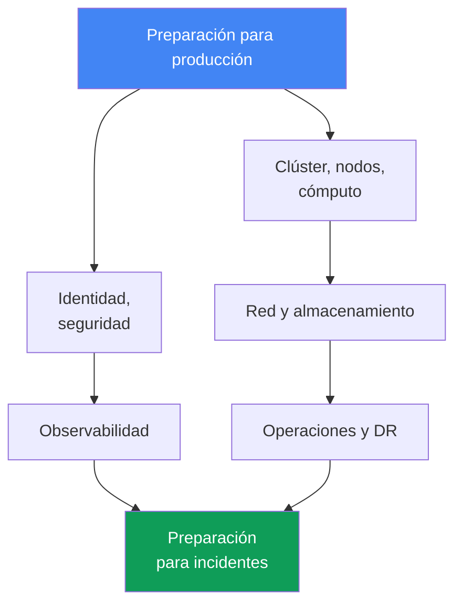
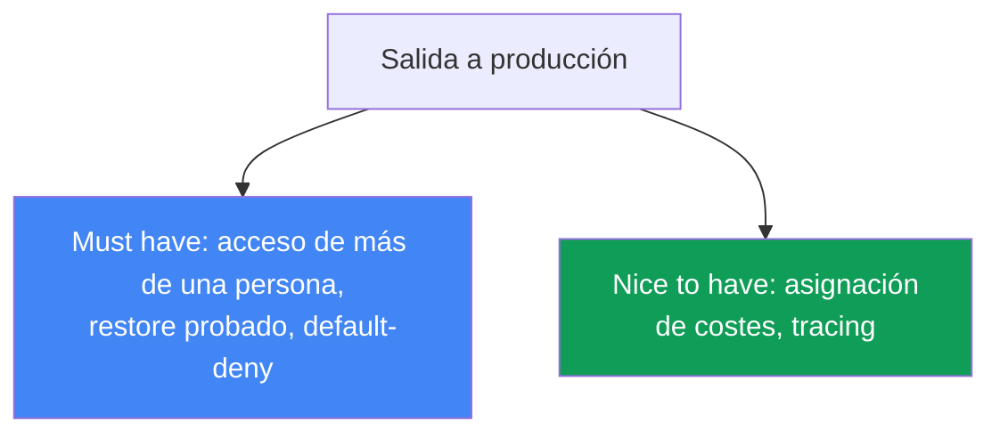

[Русская версия](ru.md) · [Eng version](en.md) · [Version française](fr.md) · [Deutsche Version](de.md) · [ქართული ვერსია](ge.md) · [繁體中文版](tw.md) · [日本語版](jp.md)
# Capítulo 48. Checklist de producción de EKS y qué leer después

> **Qué sigue.** Este es el final del curso. En 47 capítulos, el clúster se ha construido en todas sus dimensiones: control
> plane y versiones, nodos y escalado, identidad y seguridad, almacenamiento, red,
> observabilidad, operaciones y troubleshooting. Aquí todo se reúne en una checklist consolidada
> de preparación para producción, por dominios e indicando el capítulo para cada punto. No hay
> mecanismos nuevos: el capítulo se apoya por completo en las partes 1-8 y sirve como mapa antes
> de llevar el clúster a producción. Al final, se indica hacia dónde avanzar para no detenerse en
> este curso.

## 48.1. El problema: «parece listo» no es estar listo

El clúster está levantado, las aplicaciones se despliegan, los dashboards están en verde. La fecha
límite para pasar a producción es esta semana y, ante la pregunta «¿estamos listos?», el equipo
responde «parece que sí, parece que hicimos todo». Precisamente ese «parece» es el problema: sin
una comprobación sistemática por dominios, los huecos no se ven hasta que ocurre el primer
incidente, y entonces sale a la luz exactamente lo que «parecía hecho».

Así luce un conjunto típico de «parece listo» en el que las carencias pasan desapercibidas:

```text
- el clúster se creó con Terraform, los nodos usan Karpenter  # ¿pero la versión sigue en standard support?
- IRSA está configurado para la aplicación principal         # ¿pero el acceso al clúster no depende de una sola persona?
- el balanceador entrega tráfico, TLS funciona               # ¿pero existe una NetworkPolicy default-deny?
- las métricas y logs llegan a CloudWatch                    # ¿pero están configurados retention y alertas?
- AWS Backup está activado con una programación              # ¿pero se ha probado un restore al menos una vez?
- hay PDB en los servicios críticos                           # ¿pero no bloquean la actualización de nodos?
```

Cada línea de la izquierda parece completada. Cada comentario de la derecha es un incidente
independiente que llegará en el peor momento: no se probó el backup y el restore no levanta;
no hay NetworkPolicy y un pod comprometido recorre todo el clúster; un PDB con
`maxUnavailable: 0` bloquea por completo el drain durante una actualización; el acceso al
clúster solo lo tenía un ingeniero que ya se fue.

La memoria es una mala checklist. Tras un proyecto de medio año, nadie recuerda si la auditoría
del control plane estaba activada o si se probó DR. Hace falta una lista sistemática de todos los
dominios, donde cada punto esté cerrado con un enlace al capítulo o marcado honestamente como un
hueco. El resto del capítulo es esa lista.



## 48.2. Clúster y control plane (Parte 1)

La base. Si la versión salió de soporte o las subredes están definidas en una sola AZ, todo lo
demás es irrelevante.

| Qué comprobar | Capítulo |
|---|---|
| Versión de Kubernetes dentro de standard support, con un plan de actualización | capítulo 38 |
| Endpoint access pensado: público/privado, source ranges adecuados para la tarea | capítulo 2 |
| Subredes del clúster en tres AZ, el plan de IP basta para el crecimiento de pods | capítulos 6, 7 |
| El clúster se creó como código (Terraform/eksctl), no con clics en la consola | capítulo 4 |
| Los recursos tienen etiquetas: equipo, entorno, cost allocation | capítulos 4, 43 |

Lo esencial: el clúster debe ser reproducible desde IaC y usar una versión soportada. Un clúster
manual sin código no se puede recrear durante DR ni revisar en un pull request.

## 48.3. Cómputo (Parte 2)

Los nodos son por completo la zona de responsabilidad del ingeniero. Aquí se deciden tanto la
resiliencia como la factura.

| Qué comprobar | Capítulo |
|---|---|
| Estrategia de nodos elegida conscientemente: Auto Mode, Karpenter o managed node groups | capítulos 9, 12 |
| Mezcla de Spot para cargas tolerantes a fallos, diversificación de tipos | capítulo 13 |
| requests definidos según el uso real (right-sizing), no «a ojo» | capítulo 14 |
| Disruption/consolidation de Karpenter configurados, sin ignorar el drift | capítulo 12 |
| Densidad de pods por nodo acorde con los límites de ENI e IP | capítulo 14 |

Lo esencial: la estrategia de nodos es una elección consciente con consecuencias claras para el
precio y la resiliencia, no «dejamos el valor predeterminado». Spot sin diversificación no es
ahorro, sino riesgo.

## 48.4. Identidad y seguridad (Parte 3)

El dominio más amplio y la fuente más frecuente de huecos silenciosos. Hay que comprobarlo punto
por punto.

| Qué comprobar | Capítulo |
|---|---|
| Los pods acceden a AWS mediante IRSA o Pod Identity, no con claves estáticas | capítulos 16, 17 |
| El acceso al clúster no lo tiene solo el cluster creator; existen access entries | capítulos 5, 47 |
| Secretos mediante Secrets Manager/SSM (External Secrets/CSI), no en manifiestos | capítulo 18 |
| Nodos y pods están endurecidos: IMDSv2, hop limit, Pod Security Admission | capítulo 19 |
| Las imágenes se escanean en ECR y la base procede de fuentes confiables | capítulo 20 |
| La auditoría del control plane está activada: api, audit, authenticator en los logs | capítulo 21 |
| Las políticas de Kyverno/Gatekeeper cubren patrones peligrosos de manifiestos | capítulo 22 |

Lo esencial: ni una sola clave de AWS de larga duración en los pods ni un solo clúster con acceso
de una única persona. La auditoría se activa antes del incidente: después ya no habrá logs.

## 48.5. Almacenamiento (Parte 4)

Un dominio pequeño pero traicionero: los valores predeterminados de EBS y un backup de volúmenes
sin probar golpean de forma inesperada.

| Qué comprobar | Capítulo |
|---|---|
| StorageClass predeterminada en gp3, no en el obsoleto gp2 | capítulo 23 |
| `volumeBindingMode: WaitForFirstConsumer`, para que el volumen no nazca en la AZ equivocada | capítulo 23 |
| Los volúmenes persistentes entran en el backup y los snapshots están comprobados | capítulos 23, 41 |
| Almacenamiento compartido entre AZ elegido conscientemente: EFS/FSx donde se necesita ReadWriteMany | capítulo 24 |

Lo esencial: `WaitForFirstConsumer` evita la trampa clásica en la que el pod está en una AZ y su
volumen EBS en otra, dejando al pod en `Pending` para siempre.

## 48.6. Red y tráfico (Parte 5)

Aquí los errores son visibles desde fuera: un servicio inaccesible, egress abierto, tráfico a
través de todas las AZ.

| Qué comprobar | Capítulo |
|---|---|
| Balanceadores mediante AWS Load Balancer Controller: NLB y ALB Ingress | capítulos 26, 27 |
| Certificados TLS mediante ACM, HTTPS termina en el balanceador | capítulo 27 |
| NetworkPolicy con default-deny, tráfico entre pods permitido explícitamente | capítulo 30 |
| Registros DNS gestionados por external-dns, no manualmente en Route 53 | capítulo 29 |
| VPC endpoints para servicios AWS, NAT por AZ, tráfico egress bajo control | capítulo 31 |

Lo esencial: una NetworkPolicy default-deny es la frontera de seguridad dentro del clúster. Sin
ella, cualquier pod comprometido ve a todos sus vecinos. Los VPC endpoints también reducen el
coste de egress.

## 48.7. Observabilidad (Parte 6)

Sin este dominio, un incidente se depura a ciegas. Hay que comprobar que los datos no solo fluyen,
sino que se conservan el tiempo necesario y generan alertas.

| Qué comprobar | Capítulo |
|---|---|
| metrics-server funciona y existe un backend de métricas (Prometheus/Container Insights) | capítulo 33 |
| Los logs se exportan desde nodos y pods, con retention definido conscientemente | capítulo 34 |
| Hay alertas configuradas para los síntomas clave, no solo dashboards | capítulos 33, 34 |
| Tracing para microservicios (ADOT/X-Ray), donde importa la cadena de llamadas | capítulo 36 |

Lo esencial: un dashboard que nadie mira no sustituye a una alerta. Retention sin un plan produce
logs perdidos durante un análisis o una factura inesperada de almacenamiento.

## 48.8. Operaciones (Parte 7)

El dominio que separa «el clúster funciona hoy» de «el clúster sobrevivirá a una actualización y a
un fallo».

| Qué comprobar | Capítulo |
|---|---|
| Existe un plan de actualizaciones del clúster y los addons, y las API obsoletas se limpiaron | capítulos 37, 38 |
| Se entiende la rollback readiness: se conocen la ventana y el orden de reversión | capítulo 39 |
| PDB y topology spread protegen la disponibilidad durante drain y actualizaciones | capítulo 40 |
| Los PDB no bloquean el drain indefinidamente (`maxUnavailable: 0` es una señal de alarma) | capítulo 40 |
| AWS Backup está configurado: estado del clúster y volúmenes persistentes | capítulo 41 |
| El DR-restore se probó de verdad en un game day, no solo se configuró | capítulo 42 |
| El coste es visible por equipos y namespace (OpenCost/Kubecost) | capítulo 43 |
| GitOps es la fuente de verdad para los manifiestos (Argo CD/Flux) | capítulo 44 |

Lo esencial: un restore configurado pero jamás comprobado no es un backup, sino una esperanza. Un
game day lleva DR de «debería funcionar» a «funcionó tal día».

## 48.9. Preparación para incidentes (Parte 8)

El dominio final: cuando todo falle, no importa la arquitectura sino la velocidad de localización.

| Qué comprobar | Capítulo |
|---|---|
| Existe un runbook para un nodo que no se unió | capítulo 45 |
| Existe un runbook para fallos de red: ENI, SG/NACL, DNS, unhealthy targets | capítulo 46 |
| Existe un runbook para acceso: 401 frente a 403, IRSA/Pod Identity, kubeconfig | capítulo 47 |
| Funciona el acceso SSM a los nodos (sin SSH directo), se puede entrar a un nodo | capítulo 45 |
| Control plane logging está activado, y los logs de authenticator y API están disponibles | capítulos 21, 34 |

Lo esencial: el runbook y el acceso mediante SSM deben existir antes del incidente. Configurar el
acceso a un nodo cuando ya está roto es demasiado tarde.

## 48.10. Panorama consolidado y prioridades

Los ocho dominios anteriores son los ejes de preparación. No se puede omitir ninguno, pero no
todos son igual de urgentes para la primera salida a producción. Algunos puntos son «must have»,
sin los cuales es peligroso activar tráfico real; otros son «nice to have», que se completan ya en
producción sin bloquear el lanzamiento.



| Prioridad | Puntos | Por qué |
|---|---|---|
| Must have antes de producción | versión soportada, acceso de más de una persona, auditoría y logs del control plane activados, NetworkPolicy default-deny, secretos fuera de los manifiestos, restore probado, los PDB no bloquean la actualización | sin esto, el primer incidente o intrusión cuesta más que retrasar el lanzamiento |
| Importante en las primeras semanas | right-sizing de requests, mezcla de spot, retention de logs, alertas, plan de actualizaciones, VPC endpoints | afecta la resiliencia y la factura, pero no bloquea el lanzamiento |
| Nice to have | tracing de microservicios, asignación detallada de costes, GitOps maduro para una flota de clústeres | aumenta la madurez y se completa iterativamente en producción |

El sentido práctico de la tabla es que, si el plazo aprieta, primero se cierra toda la columna
«must have», y el resto se planifica como tareas explícitas con responsables, no se deja para
«algún día más adelante».

## 48.11. Escenarios de adopción: por dónde empezar

El curso es grande, y «por dónde empezar» depende del contexto. Una startup desde cero y una
empresa que migra desde su propio centro de datos parten de puntos distintos. No hay un orden
único correcto, pero el principio general es uno: cualquier inicio se hace como código y con
aislamiento, para que las decisiones sigan siendo reversibles. A continuación hay dos escenarios
detallados y una conclusión común. Los requisitos caros no se introducen antes de tiempo, pero
tampoco se cierra el camino hacia ellos.

### Escenario 1. Startup desde cero: MVP rápido y barato, sin rehacer después

El producto aún no existe y se necesita un MVP lo más rápido y barato posible. Una auditoría como
PCI DSS no es necesaria ahora, pero la arquitectura debe permitir añadirla después sin rehacer ni
gastar de más hoy.

- **Inicio rápido.** EKS Auto Mode o managed node groups con Karpenter, spot para cargas no-prod
  (capítulos 9, 12, 13). Clúster como código desde el primer día mediante terraform-aws-eks
  (capítulo 4), para no tener que rehacer lo creado con clics.
- **Barato ahora.** Mínimo NAT y tráfico entre zonas (capítulo 31), un clúster con aislamiento por
  namespace en lugar de una flota de clústeres (capítulo 32), addons gestionados en vez de
  autosostenimiento (capítulo 37).
- **Para no rehacer después.** Desde el principio private endpoint e IRSA/Pod Identity en vez de
  claves (capítulos 16, 17, 19), al menos auditoría básica del control plane y etiquetas de coste
  (capítulos 21, 43), StorageClass con gp3 y `WaitForFirstConsumer` (capítulo 23).
- **Base para PCI DSS sin gasto ahora.** Se activa estructuralmente lo barato: audit logs, cifrado
  de secretos mediante KMS, CNI compatible con NetworkPolicy, Pod Security Admission. Lo caro,
  cuentas dedicadas, GuardDuty runtime y segmentación completa, se pospone, pero sin cerrar el
  camino hacia ello (capítulos 18, 19, 21, 22, 30). La clave: el aislamiento mediante namespace
  y cuentas, junto con IaC, permite crecer hacia la auditoría más adelante.

### Escenario 2. Centro de datos propio -> EKS: migración sin interrupciones

La empresa tiene sus propios servidores en un centro de datos (incluido su propio Kubernetes) y
está migrando a EKS y AWS. Necesita una migración sin tiempo de inactividad y con un plan de
reversión.

- **Conectividad entre on-prem y VPC.** Site-to-Site VPN o Direct Connect, coordinación de CIDR
  para evitar rangos solapados (capítulos 6, 31, 32); durante la transición, un esquema híbrido.
- **Traslado gradual.** Las cargas se trasladan servicio a servicio; el cambio se hace mediante
  DNS y peso de tráfico (capítulo 29); los datos mediante réplicas y backups, no de una vez.
- **Qué rompe «simplemente trasladar los manifiestos».** StorageClass y volúmenes (EBS está
  ligado a una AZ, capítulo 23; compartido, EFS, capítulo 24), LoadBalancer e Ingress pasan a
  ser NLB y ALB (capítulos 26, 27), NetworkPolicy depende del CNI (capítulo 30), el acceso se
  gestiona mediante IAM y RBAC access entries (capítulo 5), la identidad mediante IRSA/Pod
  Identity en vez de claves estáticas (capítulos 16, 17).
- **Densidad de pods.** En nodos kubeadm con overlay-CNI caben cientos de pods pequeños, mientras
  que VPC CNI da a cada pod una IP real de la VPC y alcanza el límite de ENI (decenas de pods por
  nodo). Se soluciona con prefix delegation y recalculando `max-pods`; de lo contrario, los pods
  quedan en `Pending` (capítulos 7, 14).
- **Comprobación de paridad.** Primero, un clúster no-prod: ejecución de carga y observabilidad
  (capítulos 33, 34), y después prod. El plan de reversión se mantiene preparado (capítulo 42).

En resumen, los dos inicios se ven así:

| Escenario | Por dónde empezar | Qué posponer |
|---|---|---|
| Startup desde cero | IaC, private endpoint, IRSA, gp3, auditoría básica y etiquetas | GuardDuty runtime, multicuenta, segmentación completa |
| Centro de datos -> EKS | conectividad y CIDR, paridad en no-prod, plan de reversión | optimización de precio y multiclúster maduro |

El principio común: cualquier inicio se hace como código y con aislamiento (namespace o cuentas),
para que las decisiones sean reversibles. Los requisitos caros no se introducen antes de tiempo,
pero tampoco se diseña una arquitectura que los excluya. Entonces, el paso de un MVP a una
auditoría o de un híbrido a EKS completo es un ajuste, no una reescritura.

## 48.12. Qué leer después

El curso es un mapa, no un techo. Después conviene acudir a las fuentes primarias y tenerlas a
mano.

- **EKS Best Practices Guide**: conjunto oficial de recomendaciones de AWS sobre seguridad, red,
  fiabilidad, autoescalado y coste. Es la referencia más cercana tras este curso: profundiza
  exactamente en los dominios de la checklist anterior.
- **AWS Well-Architected Framework**: seis pilares (operational excellence, security,
  reliability, performance, cost, sustainability) como marco general para evaluar cualquier
  sistema en AWS, no solo EKS. Es útil para revisar la arquitectura completa.
- **Kubernetes documentation**: fuente primaria sobre Kubernetes: API, controladores y
  scheduler. Todo lo que no es específico de EKS vive allí.
- **EKS release calendar y version lifecycle**: calendario oficial de lanzamiento y retirada de
  soporte de versiones. Con él se construye el plan de actualizaciones (capítulo 38); hay que
  seguirlo continuamente, no recordarlo un mes antes del fin de soporte.
- **Proyectos y comunidad CNCF**: Karpenter, Cilium, Argo, Prometheus, OpenTelemetry y otras
  herramientas del curso evolucionan en CNCF; sus release notes y debates muestran hacia dónde
  avanza el ecosistema. Los canales vivos de la comunidad (Kubernetes Slack, debates de los
  proyectos en GitHub) son una forma rápida de comprobar si alguien ya se encontró con su
  problema.

La regla es simple: la checklist de este capítulo indica qué comprobar, y los recursos enumerados
indican dónde obtener los detalles y cómo mantenerse al día de los cambios cuando las versiones y
las best practices evolucionen.

### Límites del curso: qué no se trata aquí conscientemente

El curso mantiene un solo tema, las operaciones de EKS, y todo lo que se desvía se deja
conscientemente a otras fuentes. No son huecos, sino una elección de límites. A continuación se
indica qué quedó fuera y dónde buscar los detalles.

| Tema | Por qué queda fuera | Dónde acudir |
|---|---|---|
| HashiCorp Vault más allá de la introducción: PKI y transit engine, instalación en el clúster, políticas HCL, namespaces de Vault | producto independiente con su propio modelo operativo, no parte de EKS; el curso incluye una visión general de Vault como capa de almacenamiento de secretos (capítulo 18) | documentación de Vault |
| Pipelines CI de proveedores: descripciones listas para GitHub Actions, GitLab CI y otros | el curso describe GitOps como modelo, no la sintaxis de un CI concreto (capítulo 44) | documentación de su sistema CI |
| Multicuenta y multiclúster en la práctica | se tratan como arquitectura (capítulo 32), pero no hay práctica reproducible: hacen falta al menos dos cuentas AWS | documentación de AWS Organizations y EKS |
| Auditoría y detección con GuardDuty en la práctica | el mecanismo se describe (capítulo 21), pero no hay práctica: es un servicio de pago y no se activa de inmediato | documentación de Amazon GuardDuty |
| Desarrollo de aplicaciones y código de servicios, incluidos esquemas de datos | el curso trata de la plataforma, no de cómo escribir una aplicación | fuentes especializadas de desarrollo |
| Servicios de AWS para aplicaciones fuera del clúster: RDS, colas, cachés | se mencionan como consumidores y fuentes de coste, pero el curso no cubre su operación | documentación de los servicios AWS correspondientes |
| Entrega progresiva más allá de la introducción: Argo Rollouts, Flagger | se nombran y diferencian del blue/green de clústeres (capítulo 44), pero no tienen capítulo propio | documentación de Argo Rollouts y Flagger |
| Nodos Windows | se mencionan solo donde cambian el mecanismo: limitaciones de Pod Identity, tipos de access entry | documentación de EKS sobre nodos Windows |
| Funcionalidad gestionada de EKS para Argo CD como práctica | se trata en el texto (capítulo 44), pero no habrá laboratorio: la autenticación usa solo AWS Identity Center, que requiere AWS Organizations y es una barrera en una cuenta personal | documentación de EKS y AWS Identity Center |

La lista de límites no es una lista de trabajo pendiente. Cada fila anterior es una decisión sobre
dónde terminan las operaciones de EKS y empieza otro dominio. Si necesita el tema ahora mismo, el
curso proporciona contexto suficiente para leer la documentación especializada no desde cero,
sino entendiendo dónde encaja.

## 48.13. Cómo se aplica esto en producción

- **Mantener la checklist como documento vivo en el repositorio.** No en la cabeza ni en un chat,
  sino junto al IaC, donde sea visible en un pull request y se pueda seguir el historial de
  cambios.
- **Asignar ownership a los dominios.** Cada dominio (red, seguridad, coste) tiene una persona
  responsable de que sus puntos estén cerrados y no se hayan degradado.
- **Revisar la checklist antes de cada salida a producción.** Un clúster nuevo o un nuevo servicio
  grande no entra en servicio hasta que la columna «must have» esté cerrada completa y
  explícitamente.
- **Revisarla regularmente, no una sola vez.** Una vez por trimestre y tras cambios importantes:
  las versiones envejecen, las cargas crecen, lo que ayer estaba «listo» hoy ya es un hueco.
- **Marcar los huecos honestamente.** Un punto sin cerrar se marca como riesgo conocido con tarea
  y fecha límite, no se omite en silencio para que la checklist parezca verde.
- **Vincularla a game days y actualizaciones.** El DR-restore y el plan de actualización se
  comprueban en ejercicios, y el resultado vuelve a la checklist como punto confirmado o fallido.

## 48.14. Mini glosario

- **checklist de producción**: lista sistemática de comprobaciones de preparación por dominios,
  donde cada punto se cierra con un enlace al capítulo o se marca como riesgo conocido.
- **dominio de preparación**: un eje de operaciones (control plane, nodos, seguridad, red,
  almacenamiento, observabilidad, operaciones, incidentes), comprobado por separado.
- **must have**: punto sin el cual la salida a producción es peligrosa y debe bloquearse.
- **nice to have**: punto que aumenta la madurez y que se puede completar ya en producción.
- **standard support**: período de soporte de una versión de EKS, durante el cual se mantiene
  (capítulo 38).
- **rollback readiness**: preparación para revertir una versión: se conocen la ventana y el orden
  (capítulo 39).
- **game day**: ejercicio en el que se comprueban en la práctica DR y escenarios de incidentes
  (capítulo 42).
- **ownership**: responsabilidad asignada a un dominio o punto de la checklist.

## 48.15. Resumen del capítulo y del curso

- «Parece listo» sin una comprobación sistemática no es preparación: los huecos no son visibles
  hasta que el primer incidente los revela. La memoria se sustituye por una checklist por dominios.
- La preparación para producción se divide en nueve dominios que repiten las partes del curso:
  control plane, nodos, seguridad, almacenamiento, red, observabilidad, operaciones, incidentes.
- AWS opera el control plane, pero la versión, el acceso, IaC y las etiquetas siguen siendo
  responsabilidad del ingeniero (Parte 1).
- Nodos, mezcla de spot, right-sizing y disruption son una elección consciente de precio y
  resiliencia, no un valor predeterminado (Parte 2).
- Ni una sola clave de larga duración en pods, acceso de más de una persona, auditoría activada
  con anticipación y default-deny en la red son la base de la seguridad (partes 3 y 5).
- Un restore configurado pero no probado es una esperanza, no un backup; DR se comprueba en un
  game day, y las actualizaciones tienen un plan y rollback readiness (Parte 7).
- Los runbooks y el acceso SSM existen antes del incidente; durante un fallo importa la velocidad
  de localización, no la arquitectura (Parte 8).
- La priorización resuelve el plazo: primero se cierra todo «must have» y el resto se planifica
  como tareas. Después: EKS Best Practices Guide, Well-Architected, Kubernetes docs y el
  calendario de versiones.

## 48.16. Cómo será útil en el trabajo real

El momento de pasar un clúster a producción casi siempre viene acompañado de presión por los
plazos y la tentación de decir «parece listo, adelante». Un ingeniero que tiene una checklist por
dominios responde de otro modo: recorre los nueve ejes, cierra la columna «must have» y nombra
explícitamente los huecos restantes como tareas con responsables. No es burocracia, sino un
seguro: cada punto de la checklist es un incidente que no ocurrirá porque se previó de antemano.
La diferencia entre equipos no se ve el día del lanzamiento, sino en el primer fallo serio: en unos
sale a la luz un restore sin probar y el acceso de una persona que ya se fue; en otros, el incidente
se localiza en minutos mediante el runbook.

Al planificar, la checklist funciona como un mapa de madurez. Muestra dónde el clúster es fuerte y
dónde se sostiene en «lo terminaremos después», y convierte el vago «deberíamos mejorar» en
tareas concretas por dominios, con propietarios y fechas. Revisada una vez por trimestre, evita que
la preparación se degrade a medida que las versiones envejecen y las cargas crecen. Y los enlaces a
los capítulos la hacen autosuficiente: cualquier punto puede desplegarse hasta comandos y detalles
volviendo al capítulo necesario del curso. El curso termina, pero las operaciones no, y esta
checklist permanece como herramienta de trabajo.

## 48.17. Preguntas de autoevaluación

1. ¿Por qué «parece listo» sin una comprobación sistemática es peligroso, y qué sustituye la memoria de lo realizado?
2. ¿En qué nueve dominios se divide la preparación para producción y cómo se relacionan con las partes del curso?
3. ¿Qué permanece a cargo del ingeniero en el dominio del control plane, pese a ser gestionado (Parte 1)?
4. ¿Qué puntos sobre nodos forman parte de la checklist y por qué son una elección consciente (Parte 2)?
5. Enumere los puntos de seguridad que es obligatorio comprobar antes de producción (Parte 3).
6. ¿Por qué `volumeBindingMode: WaitForFirstConsumer` forma parte de la checklist de almacenamiento (capítulo 23)?
7. ¿Por qué el dominio de red incluye una NetworkPolicy default-deny y qué protege (capítulo 30)?
8. ¿Qué diferencia hay entre «backup configurado» y «restore probado», y qué tiene que ver un game day?
9. ¿Por qué un PDB con `maxUnavailable: 0` es una señal de alarma durante una actualización de nodos (capítulo 40)?
10. ¿Qué debe existir en el dominio de preparación para incidentes antes del incidente, y no después?
11. ¿Cómo distinguir los puntos «must have antes de producción» de «nice to have» y por qué es necesaria esta priorización?
12. ¿Cómo se mantiene y revisa una checklist en producción: dónde vive, quién la posee y con qué frecuencia?
13. ¿Qué recursos hay que leer después y qué papel tiene el calendario de versiones de EKS (capítulo 38)?

## Práctica

No hay laboratorio independiente para este capítulo: reúne todo el curso en una checklist. La mejor
práctica es recorrerla en su propio clúster, cerrando los puntos con comandos de los capítulos
correspondientes y marcando honestamente dónde se detectaron huecos.

Empiece por la base: versión y modo de acceso (capítulos 38, 2):

```bash
# versión del clúster y estado de soporte
aws eks describe-cluster --name <cluster> --query 'cluster.{version:version,status:status}'
# modo de acceso al endpoint y accessConfig
aws eks describe-cluster --name <cluster> \
  --query 'cluster.{endpoint:resourcesVpcConfig,access:accessConfig}'
```

Compruebe la seguridad del acceso y la auditoría activada (capítulos 47, 21):

```bash
# quién está mapeado al acceso del clúster: comprobar que no sea un solo principal
aws eks list-access-entries --cluster-name <cluster>
# qué tipos de logs del control plane están activados
aws eks describe-cluster --name <cluster> --query 'cluster.logging'
```

Revise red y almacenamiento: default-deny y StorageClass (capítulos 30, 23):

```bash
# si existe al menos una NetworkPolicy (vacío significa que seguro no hay default-deny)
kubectl get networkpolicy -A
# StorageClass predeterminada y modo de asociación de volumen
kubectl get storageclass
```

Después, operaciones: backup y protección de disponibilidad (capítulos 41, 40):

```bash
# planes de AWS Backup en la cuenta
aws backup list-backup-plans --query 'BackupPlansList[].BackupPlanName'
# PDB de todo el clúster: comprobar que no haya maxUnavailable: 0
kubectl get pdb -A
```

Al recorrer los dominios de las secciones 48.2-48.9, obtendrá no un abstracto «parece listo», sino
una imagen concreta: qué está cerrado con un enlace al capítulo y qué sigue siendo un hueco.
Convierta los huecos en tareas con responsables y fechas, empezando por la columna «must have» de
la sección 48.10: eso es el paso de la esperanza a la preparación.

---
[Índice](../README_ES.md) · [Capítulo 47](../47/es.md)
