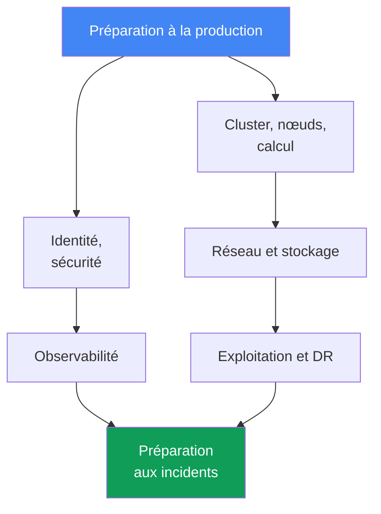
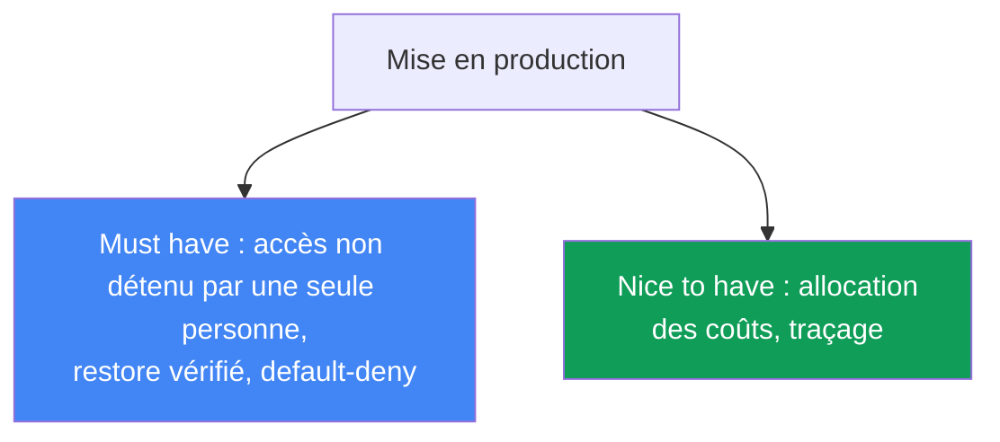

[Русская версия](ru.md) · [Eng version](en.md) · [Versión en español](es.md) · [Deutsche Version](de.md) · [ქართული ვერსია](ge.md) · [繁體中文版](tw.md) · [日本語版](jp.md)
# Chapitre 48. Checklist de production EKS et lectures pour aller plus loin

> **La suite.** C'est la fin du cours. En 47 chapitres, le cluster a été construit sous tous ses angles : control plane et versions, nœuds et mise à l'échelle, identité et sécurité, stockage, réseau, observabilité, exploitation et troubleshooting. Tout cela est ici réuni dans une checklist de préparation à la production, par domaine, avec le chapitre correspondant à chaque point. Il n'y a pas de nouveaux mécanismes : ce chapitre s'appuie sur l'ensemble des parties 1 à 8 et sert de carte avant de mettre un cluster en production. À la fin, vous trouverez où aller ensuite pour ne pas vous arrêter à ce cours.

## 48.1. Le problème : « on est à peu près prêt » n'est pas être prêt

Le cluster est opérationnel, les applications sont déployées, les tableaux de bord sont verts. La date limite de mise en production est cette semaine et, à la question « sommes-nous prêts ? », l'équipe répond « à peu près, nous avons à peu près tout fait ». C'est précisément ce « à peu près » qui pose problème : sans vérification systématique par domaine, les lacunes restent invisibles jusqu'au premier incident, et c'est alors que ressort exactement ce qui avait été « à peu près fait ».

Voici à quoi ressemble un ensemble typique de « à peu près prêt », dont les lacunes ne sautent pas aux yeux :

```text
- le cluster est créé avec Terraform, les nœuds sont sur Karpenter  # mais la version est-elle toujours en standard support ?
- IRSA est configuré pour l'application principale                  # mais l'accès au cluster appartient-il à plusieurs personnes ?
- le load balancer sert le trafic, TLS fonctionne                    # mais une NetworkPolicy default-deny existe-t-elle ?
- les métriques et les logs arrivent dans CloudWatch                # mais retention et alertes sont-elles configurées ?
- AWS Backup est activé selon une planification                      # mais un restore a-t-il été vérifié au moins une fois ?
- des PDB sont en place pour les services critiques                  # mais ne bloquent-elles pas une mise à niveau des nœuds ?
```

Chaque ligne de gauche semble terminée. Chaque commentaire de droite correspond à un incident distinct, qui arrivera au pire moment : le backup n'a jamais été testé et le restore ne remonte pas ; il n'y a pas de NetworkPolicy et un pod compromis circule dans tout le cluster ; un PDB avec `maxUnavailable: 0` bloque totalement le drain lors d'une mise à niveau ; l'accès au cluster n'appartenait qu'à un ingénieur parti de l'entreprise.

La mémoire est une mauvaise checklist. Au terme d'un projet de six mois, personne ne sait si l'audit du control plane est activé ou si le DR a été vérifié. Il faut une liste systématique de tous les domaines, dans laquelle chaque point est soit clos avec un lien vers un chapitre, soit honnêtement marqué comme une lacune. Le reste du chapitre constitue cette liste.



## 48.2. Cluster et control plane (Partie 1)

La fondation. Si la version n'est plus prise en charge ou si les sous-réseaux sont définis dans une seule AZ, le reste n'a pas d'importance.

| À vérifier | Chapitre |
|---|---|
| Version Kubernetes dans le standard support, avec un plan de mise à niveau | chapitre 38 |
| Endpoint access réfléchi : public/privé, source ranges adaptés au besoin | chapitre 2 |
| Sous-réseaux du cluster dans trois AZ, plan IP suffisant pour la croissance des pods | chapitres 6, 7 |
| Cluster créé par du code (Terraform/eksctl), pas par des clics dans la console | chapitre 4 |
| Ressources étiquetées : équipe, environnement, cost allocation | chapitres 4, 43 |

L'essentiel : le cluster doit être reproductible depuis l'IaC et utiliser une version prise en charge. Un cluster manuel sans code ne peut pas être recréé pour un DR, ni revu dans une pull request.

## 48.3. Calcul (Partie 2)

Les nœuds relèvent entièrement de la responsabilité de l'ingénieur. C'est ici que se décident la tolérance aux pannes et la facture.

| À vérifier | Chapitre |
|---|---|
| Stratégie de nœuds choisie consciemment : Auto Mode, Karpenter ou managed node groups | chapitres 9, 12 |
| Mélange Spot pour les charges tolérantes aux pannes, diversification des types | chapitre 13 |
| requests définies selon les besoins réels (right-sizing), et non « au jugé » | chapitre 14 |
| Karpenter disruption/consolidation configurés, drift non ignoré | chapitre 12 |
| Densité de pods par nœud alignée sur les limites ENI et IP | chapitre 14 |

L'essentiel : une stratégie de nœuds est un choix conscient, avec des conséquences claires sur le prix et la résilience, et non « le défaut est resté ». Du Spot sans diversification n'est pas une économie, mais un risque.

## 48.4. Identité et sécurité (Partie 3)

C'est le domaine le plus vaste et la source la plus fréquente de lacunes silencieuses. Vérifiez point par point.

| À vérifier | Chapitre |
|---|---|
| Les pods accèdent à AWS par IRSA ou Pod Identity, pas avec des clés statiques | chapitres 16, 17 |
| L'accès au cluster n'appartient pas seulement au cluster creator ; des access entries sont établies | chapitres 5, 47 |
| Secrets via Secrets Manager/SSM (External Secrets/CSI), pas dans les manifestes | chapitre 18 |
| Nœuds et pods durcis : IMDSv2, hop limit, Pod Security Admission | chapitre 19 |
| Images analysées dans ECR, base provenant de sources fiables | chapitre 20 |
| Audit du control plane activé : api, audit, authenticator dans les logs | chapitre 21 |
| Des policies Kyverno/Gatekeeper couvrent les motifs dangereux des manifestes | chapitre 22 |

L'essentiel : aucune clé AWS de longue durée dans les pods et aucun cluster dont l'accès est détenu par une seule personne. L'audit s'active avant l'incident : après coup, les logs n'existent plus.

## 48.5. Stockage (Partie 4)

Un domaine restreint mais piégeux : les valeurs par défaut d'EBS et les backups de volumes non testés frappent sans prévenir.

| À vérifier | Chapitre |
|---|---|
| StorageClass par défaut sur gp3, et non sur gp2 obsolète | chapitre 23 |
| `volumeBindingMode: WaitForFirstConsumer` pour que le volume ne naisse pas dans la mauvaise AZ | chapitre 23 |
| Volumes persistants inclus dans le backup, snapshots vérifiés | chapitres 23, 41 |
| Stockage partagé entre AZ choisi consciemment : EFS/FSx là où ReadWriteMany est nécessaire | chapitre 24 |

L'essentiel : `WaitForFirstConsumer` évite le piège classique où le pod se trouve dans une AZ et son volume EBS dans une autre, laissant le pod à jamais `Pending`.

## 48.6. Réseau et trafic (Partie 5)

Ici, les erreurs sont visibles de l'extérieur : un service inaccessible, un egress ouvert, du trafic dans toutes les AZ.

| À vérifier | Chapitre |
|---|---|
| Load balancers via AWS Load Balancer Controller : NLB et ALB Ingress | chapitres 26, 27 |
| Certificats TLS via ACM, HTTPS se termine sur le load balancer | chapitre 27 |
| NetworkPolicy avec default-deny, trafic entre pods explicitement autorisé | chapitre 30 |
| Enregistrements DNS gérés par external-dns, pas manuellement dans Route 53 | chapitre 29 |
| VPC endpoints pour les services AWS, NAT par AZ, trafic egress contrôlé | chapitre 31 |

L'essentiel : une NetworkPolicy default-deny est une frontière de sécurité à l'intérieur du cluster. Sans elle, tout pod compromis voit tous ses voisins. Les VPC endpoints réduisent aussi le coût de l'egress.

## 48.7. Observabilité (Partie 6)

Sans ce domaine, un incident se diagnostique à l'aveugle. Vérifiez que les données ne font pas qu'arriver, mais sont conservées le temps voulu et génèrent des alertes.

| À vérifier | Chapitre |
|---|---|
| metrics-server fonctionne, un backend de métriques existe (Prometheus/Container Insights) | chapitre 33 |
| Logs exportés depuis les nœuds et les pods, retention définie consciemment | chapitre 34 |
| Alertes configurées sur les symptômes clés, pas seulement des tableaux de bord | chapitres 33, 34 |
| Traçage pour les microservices (ADOT/X-Ray), là où la chaîne d'appels importe | chapitre 36 |

L'essentiel : un tableau de bord que personne ne regarde ne remplace pas une alerte. Une retention sans plan signifie soit des logs perdus au moment de l'analyse, soit une facture de stockage inattendue.

## 48.8. Exploitation (Partie 7)

Le domaine qui sépare « le cluster fonctionne aujourd'hui » de « le cluster survivra à une mise à niveau et à une panne ».

| À vérifier | Chapitre |
|---|---|
| Plan de mise à jour du cluster et des addons, API obsolètes éliminées | chapitres 37, 38 |
| Rollback readiness comprise : fenêtre et ordre du rollback connus | chapitre 39 |
| PDB et topology spread protègent la disponibilité pendant un drain et une mise à niveau | chapitre 40 |
| Les PDB ne bloquent pas définitivement le drain (`maxUnavailable: 0` est un signal d'alarme) | chapitre 40 |
| AWS Backup configuré : état du cluster et volumes persistants | chapitre 41 |
| DR-restore réellement testé lors d'un game day, pas seulement configuré | chapitre 42 |
| Coût visible par équipe et namespace (OpenCost/Kubecost) | chapitre 43 |
| GitOps est la source de vérité des manifestes (Argo CD/Flux) | chapitre 44 |

L'essentiel : un restore configuré mais jamais vérifié n'est pas un backup, c'est un espoir. Un game day fait passer le DR de « cela devrait fonctionner » à « cela a fonctionné à telle date ».

## 48.9. Préparation aux incidents (Partie 8)

Le dernier domaine : lorsque tout cassera, ce n'est pas le fonctionnement interne qui compte, mais la vitesse de localisation.

| À vérifier | Chapitre |
|---|---|
| Runbook pour un nœud qui ne rejoint pas le cluster | chapitre 45 |
| Runbook pour les pannes réseau : ENI, SG/NACL, DNS, unhealthy targets | chapitre 46 |
| Runbook pour l'accès : 401 contre 403, IRSA/Pod Identity, kubeconfig | chapitre 47 |
| Accès SSM aux nœuds opérationnel (sans SSH nu), possibilité d'entrer sur un nœud | chapitre 45 |
| Control plane logging activé, logs authenticator et API disponibles | chapitres 21, 34 |

L'essentiel : les runbooks et l'accès par SSM doivent exister avant l'incident. Configurer l'accès à un nœud au moment où il est déjà cassé est trop tard.

## 48.10. Vue d'ensemble et priorités

Les huit domaines ci-dessus sont les axes de préparation. Aucun ne peut être ignoré, mais ils n'ont pas tous la même urgence pour la première mise en production. Certains points sont des « must have », sans lesquels il est dangereux d'activer le trafic de production ; d'autres sont des « nice to have », à finaliser déjà en production sans bloquer le lancement.



| Priorité | Points | Pourquoi |
|---|---|---|
| Must have avant la production | version prise en charge, accès non détenu par une seule personne, audit et logs du control plane activés, NetworkPolicy default-deny, secrets hors des manifestes, restore testé, PDB ne bloquant pas les mises à niveau | sans cela, le premier incident ou piratage coûte plus cher que le retard du lancement |
| Important dans les premières semaines | right-sizing des requests, mélange Spot, retention des logs, alertes, plan de mise à niveau, VPC endpoints | influe sur la résilience et la facture, sans bloquer le lancement |
| Nice to have | traçage des microservices, allocation détaillée des coûts, GitOps mature pour un parc de clusters | améliore la maturité, finalisé progressivement en production |

Le sens pratique du tableau : si l'échéance presse, clôturez d'abord toute la colonne « must have », puis planifiez le reste comme des tâches explicites avec des responsables, au lieu de les laisser à « plus tard, un jour ».

## 48.11. Scénarios de mise en œuvre : par où commencer

Le cours est vaste, et le point de départ dépend du contexte. Une startup partant de zéro et une entreprise migrant depuis son propre datacenter ne démarrent pas au même endroit. Il n'y a pas d'ordre universellement correct, mais un principe commun : tout démarrage se fait comme du code et avec de l'isolation, afin que les décisions restent réversibles. Voici deux scénarios détaillés et une conclusion générale. Ne faites pas peser trop tôt les exigences coûteuses, sans pour autant leur fermer la voie.

### Scénario 1. Startup partant de zéro : un MVP rapide et peu coûteux, sans refaire ensuite

Le produit n'existe pas encore, il faut un MVP aussi vite et économiquement que possible. Un audit comme PCI DSS n'est pas requis maintenant, mais l'architecture doit permettre de l'ajouter plus tard, sans refonte ni dépense superflue aujourd'hui.

- **Démarrage rapide.** EKS Auto Mode ou managed node groups avec Karpenter, Spot pour les charges non-prod (chapitres 9, 12, 13). Cluster comme code dès le premier jour avec terraform-aws-eks (chapitre 4), pour ne pas devoir refaire ce qui a été créé par clics.
- **Peu coûteux maintenant.** Minimum de NAT et de trafic inter-AZ (chapitre 31), un seul cluster avec isolation par namespace plutôt qu'un parc de clusters (chapitre 32), managed addons plutôt que l'auto-maintenance (chapitre 37).
- **Pour ne pas refaire plus tard.** Endpoint privé et IRSA/Pod Identity immédiatement, plutôt que des clés (chapitres 16, 17, 19), au moins un audit-log du control plane et des tags de coût de base (chapitres 21, 43), StorageClass avec gp3 et `WaitForFirstConsumer` (chapitre 23).
- **Préparer PCI DSS sans dépenses immédiates.** Activez structurellement les éléments peu coûteux : audit logs, chiffrement des secrets avec KMS, CNI compatible NetworkPolicy, Pod Security Admission. Différez les éléments coûteux, comptes dédiés, runtime GuardDuty, segmentation complète, mais ne leur fermez pas la voie (chapitres 18, 19, 21, 22, 30). La clé : l'isolation par namespace et par comptes, avec l'IaC, permet de grandir vers l'audit plus tard.

### Scénario 2. Datacenter propre -> EKS : migration sans interruption

L'entreprise possède ses propres serveurs en datacenter, y compris son propre Kubernetes, et migre vers EKS et AWS. Il faut une migration sans arrêt et un plan de rollback.

- **Connectivité on-prem et VPC.** Site-to-Site VPN ou Direct Connect, coordination des CIDR afin que les plages ne se recouvrent pas (chapitres 6, 31, 32) ; pour la période de transition, un schéma hybride.
- **Transfert progressif.** Les charges sont transférées service par service ; basculement via DNS et poids du trafic (chapitre 29) ; les données sont transférées par répliques et backups, pas en une fois.
- **Ce qui casse le simple transfert des manifestes.** StorageClass et volumes (EBS est lié à une AZ, chapitre 23 ; partagé : EFS, chapitre 24), LoadBalancer et Ingress deviennent NLB et ALB (chapitres 26, 27), NetworkPolicy dépend du CNI (chapitre 30), l'accès passe par les IAM et RBAC access entries (chapitre 5), l'identité passe par IRSA/Pod Identity au lieu de clés statiques (chapitres 16, 17).
- **Densité des pods.** Sur des nœuds kubeadm avec overlay-CNI, des centaines de petits pods tiennent, tandis que VPC CNI donne à chaque pod une véritable IP du VPC et atteint la limite ENI, soit des dizaines de pods par nœud. Utilisez prefix delegation et recalculez `max-pods`, sinon les pods restent bloqués en `Pending` (chapitres 7, 14).
- **Vérification de parité.** D'abord un cluster non-prod : exécution de la charge et de l'observabilité (chapitres 33, 34), puis production. Gardez le plan de rollback prêt (chapitre 42).

En résumé, les deux débuts ressemblent à ceci :

| Scénario | Par où commencer | Ce qu'il faut différer |
|---|---|---|
| Startup partant de zéro | IaC, endpoint privé, IRSA, gp3, audit et tags de base | runtime GuardDuty, multi-compte, segmentation complète |
| Datacenter -> EKS | connectivité et CIDR, parité en non-prod, plan de rollback | optimisation du prix et multi-cluster mature |

Le principe général : tout démarrage se fait comme du code et avec de l'isolation, par namespace ou par comptes, afin que les décisions soient réversibles. Ne faites pas peser trop tôt les exigences coûteuses, mais ne concevez pas non plus une architecture qui les exclut. Ainsi, passer d'un MVP à un audit ou d'un hybride à EKS complet devient une finalisation, non une réécriture.

## 48.12. Que lire ensuite

Le cours est une carte, pas un plafond. Il convient ensuite d'aller aux sources primaires et de les garder à portée de main.

- **EKS Best Practices Guide** : ensemble officiel de recommandations AWS pour la sécurité, le réseau, la fiabilité, l'autoscaling et le coût. C'est le meilleur repère après ce cours : il approfondit exactement les domaines de la checklist ci-dessus.
- **AWS Well-Architected Framework** : six piliers, operational excellence, security, reliability, performance, cost, sustainability, comme cadre général pour évaluer n'importe quel système dans AWS, pas uniquement EKS. Utile pour revoir l'architecture dans son ensemble.
- **Kubernetes documentation** : source primaire sur Kubernetes lui-même : API, contrôleurs, scheduler. Tout ce qui n'est pas spécifique à EKS s'y trouve.
- **EKS release calendar et version lifecycle** : calendrier officiel de sortie et de fin de support des versions. C'est sur lui que se construit le plan de mise à niveau (chapitre 38) ; suivez-le constamment, au lieu de vous en souvenir un mois avant la fin du support.
- **Projets et communauté CNCF** : Karpenter, Cilium, Argo, Prometheus, OpenTelemetry et les autres outils du cours évoluent dans la CNCF ; leurs release notes et discussions montrent où va l'écosystème. Les canaux communautaires actifs, Kubernetes Slack et les discussions GitHub des projets, permettent de vérifier rapidement si quelqu'un a déjà rencontré votre problème.

La règle est simple : la checklist de ce chapitre indique quoi vérifier, et les ressources énumérées indiquent où trouver les détails et comment rester à jour lorsque les versions et les best practices évoluent.

### Limites du cours : ce qui n'est délibérément pas abordé ici

Le cours se limite à l'exploitation d'EKS, et tout ce qui s'en éloigne est consciemment laissé à d'autres sources. Ce ne sont pas des lacunes, mais des limites choisies. Voici ce qui reste hors périmètre et où trouver les détails.

| Sujet | Pourquoi hors périmètre | Où aller |
|---|---|---|
| HashiCorp Vault au-delà de l'aperçu : PKI et transit engine, installation dans le cluster, policies HCL, namespaces Vault | produit distinct avec son propre modèle d'exploitation, pas une partie d'EKS ; le cours contient un aperçu de Vault comme couche de stockage des secrets (chapitre 18) | documentation Vault |
| Pipelines CI de fournisseurs : descriptions prêtes à l'emploi pour GitHub Actions, GitLab CI et autres | le cours décrit GitOps comme modèle, et non la syntaxe d'une CI donnée (chapitre 44) | documentation de votre système CI |
| Multi-compte et multi-cluster en pratique | traités comme architecture (chapitre 32), sans pratique reproductible : au moins deux comptes AWS sont nécessaires | documentation AWS Organizations et EKS |
| Audit et détection avec GuardDuty en pratique | mécanisme décrit (chapitre 21), sans pratique : service payant, ne se déclenche pas immédiatement | documentation Amazon GuardDuty |
| Développement applicatif et code des services, y compris les schémas de données | le cours porte sur la plateforme, non sur la manière d'écrire une application | sources spécialisées en développement |
| Services AWS applicatifs hors du cluster : RDS, files d'attente, caches | mentionnés comme consommateurs et sources de coût, sans leur propre exploitation dans le cours | documentation des services AWS concernés |
| Livraison progressive au-delà de l'aperçu : Argo Rollouts, Flagger | cités et distingués du blue/green de clusters (chapitre 44), sans chapitre propre | documentation Argo Rollouts et Flagger |
| Nœuds Windows | mentionnés uniquement lorsqu'ils modifient le fonctionnement : limites de Pod Identity, types d'access entry | documentation EKS sur les nœuds Windows |
| Fonctionnalité managée EKS pour Argo CD sous forme de pratique | traitée dans le texte (chapitre 44), sans lab : l'authentification passe uniquement par AWS Identity Center, qui requiert AWS Organizations, un frein dans un compte personnel | documentation EKS et AWS Identity Center |

La liste des limites n'est pas une liste d'éléments inachevés. Chaque ligne ci-dessus est une décision sur l'endroit où se termine l'exploitation d'EKS et où commence un autre domaine. Si vous avez besoin d'un sujet maintenant, le cours donne assez de contexte pour lire la documentation spécialisée non depuis zéro, mais en comprenant où elle s'intègre.

## 48.13. Application en production

- **Maintenir la checklist comme document vivant dans le dépôt.** Pas dans la tête ni dans un chat, mais à côté de l'IaC, où elle est visible dans les pull requests et où l'historique des changements est traçable.
- **Attribuer la responsabilité des domaines.** Chaque domaine, réseau, sécurité, coût, a un responsable qui s'assure que ses points sont clos et ne se dégradent pas.
- **Parcourir la checklist avant chaque mise en production.** Un nouveau cluster ou un nouveau service important ne va pas au combat tant que la colonne « must have » n'est pas entièrement et explicitement clôturée.
- **La revoir régulièrement, pas une seule fois.** Une fois par trimestre et après les changements majeurs : les versions vieillissent, les charges augmentent, ce qui était « prêt » hier est déjà une lacune aujourd'hui.
- **Marquer les lacunes honnêtement.** Un point non clos est marqué comme risque connu, avec tâche et échéance, et non passé silencieusement sous silence pour que la checklist semble verte.
- **La lier aux game days et mises à niveau.** Le DR-restore et le plan de mise à niveau sont vérifiés lors d'exercices, puis le résultat revient dans la checklist comme point confirmé ou échoué.

## 48.14. Mini-glossaire

- **Checklist de production** : liste systématique de vérifications de préparation par domaine, où chaque point est clos avec un lien vers un chapitre ou marqué comme risque connu.
- **Domaine de préparation** : un axe d'exploitation, control plane, nœuds, sécurité, réseau, stockage, observabilité, exploitation, incidents, vérifié séparément.
- **must have** : point sans lequel une mise en production est dangereuse et doit être bloquée.
- **nice to have** : point qui accroît la maturité et qu'il est acceptable de finaliser déjà en production.
- **standard support** : période de prise en charge d'une version EKS, durant laquelle elle doit être maintenue (chapitre 38).
- **rollback readiness** : préparation au retour de version : fenêtre et ordre connus (chapitre 39).
- **game day** : exercice dans lequel le DR et les scénarios d'incident sont réellement vérifiés (chapitre 42).
- **ownership** : responsabilité attribuée à un domaine ou à un point de checklist.

## 48.15. Résumé du chapitre et du cours

- « À peu près prêt » sans vérification systématique n'est pas une préparation : les lacunes restent invisibles jusqu'à ce que le premier incident les expose. La mémoire est remplacée par une checklist par domaines.
- La préparation à la production se décompose en neuf domaines, qui reprennent les parties du cours : control plane, nœuds, sécurité, stockage, réseau, observabilité, exploitation, incidents.
- AWS gère le control plane, mais version, accès, IaC et tags restent la responsabilité de l'ingénieur (Partie 1).
- Nœuds, mélange Spot, right-sizing et disruption sont des choix conscients de coût et de résilience, pas des valeurs par défaut (Partie 2).
- Aucune clé longue durée dans les pods, accès non détenu par une seule personne, audit activé à l'avance, default-deny dans le réseau : c'est la base de la sécurité (parties 3 et 5).
- Un restore configuré mais non vérifié est un espoir, pas un backup ; le DR est vérifié par un game day, et les mises à niveau ont un plan et une rollback readiness (Partie 7).
- Les runbooks et l'accès SSM existent avant l'incident ; lors d'une panne, la vitesse de localisation compte, pas le fonctionnement interne (Partie 8).
- La priorisation résout l'échéance : clôturez d'abord tous les « must have », puis planifiez le reste comme tâches. Ensuite : EKS Best Practices Guide, Well-Architected, documentation Kubernetes et calendrier des versions.

## 48.16. Utilité dans le travail réel

Le moment de mettre un cluster en production s'accompagne presque toujours de pression sur les délais et de la tentation de dire « c'est à peu près prêt, allons-y ». L'ingénieur doté d'une checklist par domaines répond autrement : il parcourt neuf axes, clôture la colonne « must have » et nomme explicitement les lacunes restantes comme des tâches avec responsables. Ce n'est pas de la bureaucratie, mais une assurance : chaque point de la checklist est un incident qui ne se produira pas, parce qu'il a été anticipé. La différence entre les équipes ne se voit pas le jour du lancement, mais lors de la première panne grave : chez certaines, un restore non testé et un accès détenu par un ancien employé ressortent ; chez les autres, l'incident est localisé par le runbook en quelques minutes.

Lors de la planification, la checklist sert de carte de maturité. Elle montre où le cluster est solide et où il repose sur « nous finirons plus tard », et transforme le vague « il faudrait améliorer » en tâches concrètes par domaine, avec propriétaires et échéances. Revue chaque trimestre, elle empêche la préparation de se dégrader à mesure que les versions vieillissent et que les charges croissent. Les liens vers les chapitres la rendent autonome : chaque point peut être développé jusqu'aux commandes et détails en revenant au chapitre pertinent du cours. Le cours se termine, mais l'exploitation non, et cette checklist reste un outil de travail.

## 48.17. Questions d'auto-évaluation

1. Pourquoi « à peu près prêt » sans vérification systématique est-il dangereux, et qu'est-ce qui remplace la mémoire du travail effectué ?
2. En quels neuf domaines se décompose la préparation à la production, et comment sont-ils liés aux parties du cours ?
3. Qu'est-ce qui, dans le domaine du control plane, reste à la responsabilité de l'ingénieur malgré la gestion par AWS (Partie 1) ?
4. Quels points concernant les nœuds entrent dans la checklist, et pourquoi s'agit-il d'un choix conscient (Partie 2) ?
5. Énumérez les points de sécurité à vérifier obligatoirement avant la production (Partie 3).
6. Pourquoi `volumeBindingMode: WaitForFirstConsumer` fait-il partie de la checklist de stockage (chapitre 23) ?
7. Pourquoi une NetworkPolicy default-deny appartient-elle au domaine réseau, et que protège-t-elle (chapitre 30) ?
8. Quelle différence y a-t-il entre un « backup configuré » et un « restore testé », et quel est le rôle du game day ?
9. Pourquoi un PDB avec `maxUnavailable: 0` est-il un signal d'alarme lors d'une mise à niveau des nœuds (chapitre 40) ?
10. Qu'est-ce qui doit exister dans le domaine de préparation aux incidents avant l'incident, et non après ?
11. Comment distinguer les points « must have avant la production » des « nice to have », et pourquoi cette priorisation est-elle utile ?
12. Comment maintenir et revoir une checklist en production : où vit-elle, qui en est responsable, à quelle fréquence ?
13. Quelles ressources faut-il lire ensuite, et quel rôle joue le calendrier des versions EKS (chapitre 38) ?

## Pratique

Il n'y a pas de lab distinct pour ce chapitre : il réunit tout le cours en une checklist. La meilleure pratique est de la parcourir sur votre cluster, de clôturer les points avec les commandes des chapitres correspondants et de marquer honnêtement les lacunes découvertes.

Commencez par les fondations, version et mode d'accès (chapitres 38, 2) :

```bash
# version du cluster et statut de support
aws eks describe-cluster --name <cluster> --query 'cluster.{version:version,status:status}'
# mode d'accès à l'endpoint et accessConfig
aws eks describe-cluster --name <cluster> \
  --query 'cluster.{endpoint:resourcesVpcConfig,access:accessConfig}'
```

Vérifiez la sécurité de l'accès et l'audit activé (chapitres 47, 21) :

```bash
# qui est mappé à l'accès au cluster : n'est-ce pas un unique principal ?
aws eks list-access-entries --cluster-name <cluster>
# quels types de logs control plane sont activés
aws eks describe-cluster --name <cluster> --query 'cluster.logging'
```

Examinez réseau et stockage, default-deny et StorageClass (chapitres 30, 23) :

```bash
# existe-t-il au moins une NetworkPolicy (vide : donc aucune default-deny)
kubectl get networkpolicy -A
# StorageClass par défaut et mode de liaison du volume
kubectl get storageclass
```

Puis l'exploitation, backup et protection de disponibilité (chapitres 41, 40) :

```bash
# plans AWS Backup du compte
aws backup list-backup-plans --query 'BackupPlansList[].BackupPlanName'
# PDB dans le cluster : y a-t-il un maxUnavailable: 0 ?
kubectl get pdb -A
```

En parcourant les domaines des sections 48.2 à 48.9, vous obtiendrez non pas un abstrait « à peu près prêt », mais une carte concrète : ce qui est clôturé avec un lien vers un chapitre et ce qui reste une lacune. Formalisez les lacunes comme tâches avec responsables et échéances, en commençant par la colonne « must have » de la section 48.10 : c'est le passage de l'espoir à la préparation.

---
[Table des matières](../README_FR.md) · [Chapitre 47](../47/fr.md)
