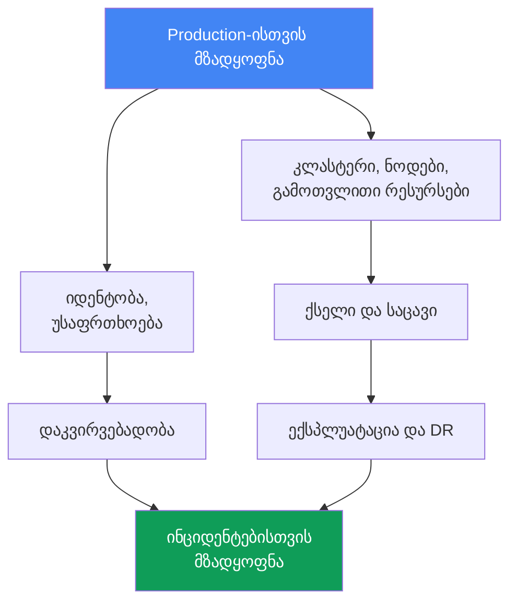
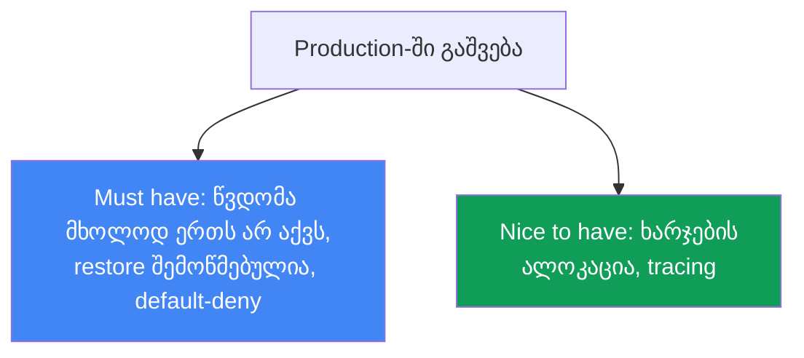

[Русская версия](ru.md) · [Eng version](en.md) · [Versión en español](es.md) · [Version française](fr.md) · [Deutsche Version](de.md) · [繁體中文版](tw.md) · [日本語版](jp.md)
# თავი 48. EKS-ის production checklist და შემდგომი საკითხავი

> **რა არის შემდეგ.** ეს კურსის დასასრულია. 47 თავში კლასტერი ყველა განზომილებით ავაწყვეთ:
> control plane და ვერსიები, ნოდები და მასშტაბირება, იდენტობა და უსაფრთხოება, საცავი, ქსელი,
> დაკვირვებადობა, ექსპლუატაცია და troubleshooting. აქ ეს ყველაფერი production-ისთვის
> მზადყოფნის ერთიან checklist-ში ერთიანდება - დომენების მიხედვით და თითოეული პუნქტისთვის
> შესაბამისი თავის მითითებით. აქ ახალი მექანიზმები არ არის: თავი მთლიანად 1-8 ნაწილებს
> ეყრდნობა და კლასტერის production-ში გაშვებამდე რუკის როლს ასრულებს. ბოლოს განხილულია,
> საით უნდა გააგრძელოთ სვლა, რომ ამ კურსზე არ შეჩერდეთ.

## 48.1. პრობლემა: „თითქოს მზადაა“ მზადყოფნას არ ნიშნავს

კლასტერი გაშვებულია, აპლიკაციები ახლდება, dashboard-ები მწვანეა. production-ში გაშვების
ვადა ამ კვირაშია და კითხვაზე „მზად ვართ?“ გუნდი პასუხობს: „თითქოს კი, თითქოს ყველაფერი
გავაკეთეთ“. სწორედ ეს „თითქოს“ არის პრობლემა: დომენების მიხედვით სისტემატური შემოწმების
გარეშე ხარვეზები პირველ ინციდენტამდე შეუმჩნეველი რჩება, შემდეგ კი ზუსტად ის იჩენს თავს,
რაც „თითქოს გაკეთებული იყო“.

ასე გამოიყურება „თითქოს მზადაა“ პუნქტების ტიპური ნაკრები, რომელშიც ხარვეზები თვალში არ
გვხვდება:

```text
- კლასტერი Terraform-ით შეიქმნა, ნოდები Karpenter-ზეა          # მაგრამ ვერსია ჯერ კიდევ standard support-შია?
- IRSA ძირითადი აპლიკაციისთვის გამართულია                    # მაგრამ კლასტერზე წვდომა მხოლოდ ერთ ადამიანს ხომ არ აქვს?
- load balancer ტრაფიკს ატარებს, TLS მუშაობს                 # მაგრამ NetworkPolicy default-deny არსებობს?
- მეტრიკები და ლოგები CloudWatch-ში იგზავნება                 # მაგრამ retention და alert-ები გამართულია?
- AWS Backup განრიგით ჩართულია                               # მაგრამ restore ერთხელ მაინც შემოწმდა?
- კრიტიკულ სერვისებს PDB აქვთ                                # მაგრამ ისინი ნოდების upgrade-ს ხომ არ ბლოკავენ?
```

მარცხნივ თითოეული სტრიქონი შესრულებულად გამოიყურება. მარჯვნივ თითოეული კომენტარი ცალკე
ინციდენტია, რომელიც ყველაზე ცუდ დროს მოხდება: backup არ შემოწმებულა და restore ვერ ეშვება;
NetworkPolicy არ არსებობს და კომპრომეტირებული პოდი მთელ კლასტერში გადაადგილდება; PDB
`maxUnavailable: 0`-ით upgrade-ის დროს drain-ს სრულად ბლოკავს; კლასტერზე წვდომა მხოლოდ
სამსახურიდან წასულ ინჟინერს ჰქონდა.

მეხსიერება ცუდი checklist-ია. ნახევარწლიანი პროექტის შემდეგ აღარავის ახსოვს, ჩართულია თუ არა
control plane-ის audit და შემოწმდა თუ არა DR. საჭიროა ყველა დომენის სისტემატური სია, სადაც
თითოეული პუნქტი ან დახურულია შესაბამის თავზე ბმულით, ან გულწრფელად არის მონიშნული ხარვეზად.
თავის დარჩენილი ნაწილი სწორედ ასეთი სიაა.



## 48.2. კლასტერი და control plane (ნაწილი 1)

საფუძველი. თუ ვერსიის მხარდაჭერა დასრულდა ან subnet-ები მხოლოდ ერთ AZ-შია განსაზღვრული,
დანარჩენს მნიშვნელობა აღარ აქვს.

| რა უნდა შემოწმდეს | თავი |
|---|---|
| Kubernetes-ის ვერსია standard support-ის ფარგლებშია და upgrade-ის გეგმა არსებობს | თავი 38 |
| Endpoint access გააზრებულად არის შერჩეული: public/private, ამოცანის შესაბამისი source ranges | თავი 2 |
| კლასტერის subnet-ები სამ AZ-შია, IP-გეგმა პოდების ზრდისთვის საკმარისია | თავები 6, 7 |
| კლასტერი კოდითაა შექმნილი (Terraform/eksctl) და არა კონსოლში დაწკაპუნებით | თავი 4 |
| რესურსებს აქვს tag-ები: გუნდი, გარემო, cost allocation | თავები 4, 43 |

მთავარი: კლასტერი IaC-დან აღდგენადი უნდა იყოს და მხარდაჭერილ ვერსიაზე მუშაობდეს. კოდის გარეშე
ხელით შექმნილი კლასტერის ხელახლა შექმნა DR-ის დროს და მისი pull request-ში review შეუძლებელია.

## 48.3. გამოთვლითი რესურსები (ნაწილი 2)

ნოდები მთლიანად ინჟინრის პასუხისმგებლობის სფეროა. აქ წყდება როგორც fault tolerance, ისე
ხარჯი.

| რა უნდა შემოწმდეს | თავი |
|---|---|
| ნოდების სტრატეგია გააზრებულადაა არჩეული: Auto Mode, Karpenter ან managed node groups | თავები 9, 12 |
| fault-tolerant workload-ებისთვის Spot mix და instance type-ების დივერსიფიკაცია გამოიყენება | თავი 13 |
| requests რეალური მოხმარების მიხედვითაა დაყენებული (right-sizing) და არა ინტუიციურად | თავი 14 |
| Karpenter disruption/consolidation გამართულია, drift უგულებელყოფილი არ არის | თავი 12 |
| თითო ნოდზე პოდების სიმჭიდროვე ENI-ისა და IP-ის ლიმიტებთანაა შეთანხმებული | თავი 14 |

მთავარი: ნოდების სტრატეგია ფასსა და მდგრადობაზე გასაგები შედეგების მქონე გააზრებული არჩევანია
და არა „default დავტოვეთ“. დივერსიფიკაციის გარეშე Spot ეკონომია კი არა, რისკია.

## 48.4. იდენტობა და უსაფრთხოება (ნაწილი 3)

ყველაზე ფართო დომენი და შეუმჩნეველი ხარვეზების ყველაზე ხშირი წყარო. შეამოწმეთ პუნქტობრივად.

| რა უნდა შემოწმდეს | თავი |
|---|---|
| პოდები AWS-ს IRSA-ს ან Pod Identity-ის მეშვეობით უკავშირდება და არა სტატიკური გასაღებებით | თავები 16, 17 |
| კლასტერზე წვდომა მხოლოდ cluster creator-ს არ აქვს; შექმნილია access entries | თავები 5, 47 |
| საიდუმლოებები Secrets Manager/SSM-იდან მიიღება (External Secrets/CSI) და მანიფესტებში არ ინახება | თავი 18 |
| ნოდები და პოდები გამკაცრებულია: IMDSv2, hop limit, Pod Security Admission | თავი 19 |
| image-ები ECR-ში მოწმდება, base image სანდო წყაროებიდან მიიღება | თავი 20 |
| control plane-ის audit ჩართულია: api, audit, authenticator ლოგებშია | თავი 21 |
| Kyverno/Gatekeeper policy-ები მანიფესტების სახიფათო pattern-ებს კეტავს | თავი 22 |

მთავარი: პოდებში არც ერთი ხანგრძლივად მოქმედი AWS გასაღები და არც ერთი კლასტერი, რომელზეც
წვდომა მხოლოდ ერთ ადამიანს აქვს. audit ინციდენტამდე უნდა ჩაირთოს, რადგან ფაქტის შემდეგ
ლოგები აღარ იარსებებს.

## 48.5. საცავი (ნაწილი 4)

პატარა, მაგრამ მზაკვრული დომენი: EBS-ის default-ები და ტომების შეუმოწმებელი backup მოულოდნელად
ქმნის პრობლემას.

| რა უნდა შემოწმდეს | თავი |
|---|---|
| default StorageClass მოძველებული gp2-ის ნაცვლად gp3-ზეა | თავი 23 |
| მითითებულია `volumeBindingMode: WaitForFirstConsumer`, რათა ტომი არასწორ AZ-ში არ შეიქმნას | თავი 23 |
| მუდმივი ტომები backup-ში ხვდება და snapshot-ები შემოწმებულია | თავები 23, 41 |
| AZ-ებს შორის shared storage გააზრებულად გამოიყენება: EFS/FSx იქ, სადაც ReadWriteMany საჭიროა | თავი 24 |

მთავარი: `WaitForFirstConsumer` გვიცავს კლასიკური ხაფანგისგან, როცა პოდი ერთ AZ-შია, მისი
EBS ტომი კი მეორეში და პოდი სამუდამოდ `Pending` მდგომარეობაში რჩება.

## 48.6. ქსელი და ტრაფიკი (ნაწილი 5)

აქ შეცდომები გარედან ჩანს: მიუწვდომელი სერვისი, ღია egress, ყველა AZ-ზე გამავალი ტრაფიკი.

| რა უნდა შემოწმდეს | თავი |
|---|---|
| load balancer-ები AWS Load Balancer Controller-ით იმართება: NLB და ALB Ingress | თავები 26, 27 |
| TLS სერტიფიკატები ACM-ით იმართება, HTTPS load balancer-ზე სრულდება | თავი 27 |
| NetworkPolicy default-deny-ითაა, პოდებს შორის ტრაფიკი ცხადად არის დაშვებული | თავი 30 |
| DNS ჩანაწერებს external-dns მართავს და არა Route 53-ში ხელით შეტანილი ცვლილებები | თავი 29 |
| AWS სერვისებისთვის VPC endpoints გამოიყენება, NAT განაწილებულია AZ-ების მიხედვით, egress ტრაფიკი კონტროლდება | თავი 31 |

მთავარი: default-deny NetworkPolicy კლასტერის შიდა უსაფრთხოების საზღვარია. მის გარეშე ნებისმიერ
კომპრომეტირებულ პოდს ყველა მეზობლის დანახვა შეუძლია. ამასთან, VPC endpoints egress-ის
ღირებულებასაც ამცირებს.

## 48.7. დაკვირვებადობა (ნაწილი 6)

ამ დომენის გარეშე ინციდენტის გამართვა ბრმად ხდება. შეამოწმეთ არა მხოლოდ მონაცემების მიღება,
არამედ საჭირო დროით შენახვა და alert-ების წარმოქმნაც.

| რა უნდა შემოწმდეს | თავი |
|---|---|
| metrics-server მუშაობს, არსებობს მეტრიკების backend (Prometheus/Container Insights) | თავი 33 |
| ლოგები ნოდებიდან და პოდებიდან გაიტანება, retention გააზრებულადაა განსაზღვრული | თავი 34 |
| გამართულია alert-ები ძირითად სიმპტომებზე და არა მხოლოდ dashboard-ები | თავები 33, 34 |
| მიკროსერვისებისთვის tracing (ADOT/X-Ray) გამოიყენება იქ, სადაც გამოძახებების ჯაჭვი მნიშვნელოვანია | თავი 36 |

მთავარი: dashboard, რომელსაც არავინ უყურებს, alert-ს ვერ ჩაანაცვლებს. გეგმის გარეშე retention
ან გამოძიების დროს დაკარგულ ლოგებს, ან საცავის მოულოდნელ ანგარიშს ნიშნავს.

## 48.8. ექსპლუატაცია (ნაწილი 7)

დომენი, რომელიც „კლასტერი დღეს მუშაობს“-ს „კლასტერი upgrade-სა და ავარიას გადაიტანს“-ისგან
განასხვავებს.

| რა უნდა შემოწმდეს | თავი |
|---|---|
| არსებობს კლასტერისა და add-on-ების განახლების გეგმა, მოძველებული API-ები მოცილებულია | თავები 37, 38 |
| rollback readiness გასაგებია: rollback-ის ფანჯარა და თანმიმდევრობა ცნობილია | თავი 39 |
| PDB და topology spread drain-ისა და upgrade-ის დროს ხელმისაწვდომობას იცავს | თავი 40 |
| PDB drain-ს სრულად არ ბლოკავს (`maxUnavailable: 0` წითელი ალამია) | თავი 40 |
| AWS Backup გამართულია: კლასტერის მდგომარეობა და მუდმივი ტომები | თავი 41 |
| DR restore რეალურად შემოწმებულია game day-ზე და არა მხოლოდ გამართული | თავი 42 |
| ხარჯები გუნდებისა და namespace-ების მიხედვით ჩანს (OpenCost/Kubecost) | თავი 43 |
| GitOps მანიფესტებისთვის source of truth-ია (Argo CD/Flux) | თავი 44 |

მთავარი: გამართული, მაგრამ არასდროს შემოწმებული restore backup კი არა, იმედია. Game day DR-ს
„უნდა იმუშაოს“ მდგომარეობიდან „ამა და ამ დროს იმუშავა“ მდგომარეობაში გადაჰყავს.

## 48.9. ინციდენტებისთვის მზადყოფნა (ნაწილი 8)

საბოლოო დომენი: როცა ყველაფერი გაფუჭდება, მნიშვნელოვანია არა მოწყობა, არამედ პრობლემის
ლოკალიზაციის სიჩქარე.

| რა უნდა შემოწმდეს | თავი |
|---|---|
| არსებობს runbook ნოდისთვის, რომელიც კლასტერს არ შეუერთდა | თავი 45 |
| არსებობს runbook ქსელური ავარიებისთვის: ENI, SG/NACL, DNS, unhealthy targets | თავი 46 |
| არსებობს runbook წვდომისთვის: 401 და 403, IRSA/Pod Identity, kubeconfig | თავი 47 |
| ნოდებზე SSM წვდომა მუშაობს (ღია SSH-ის გარეშე), ნოდში შესვლა შესაძლებელია | თავი 45 |
| control plane logging ჩართულია, authenticator-ისა და API-ის ლოგები ხელმისაწვდომია | თავები 21, 34 |

მთავარი: runbook და SSM-ით წვდომა ინციდენტამდე უნდა არსებობდეს. ნოდზე წვდომის გამართვა მაშინ,
როცა ის უკვე გაფუჭებულია, დაგვიანებულია.

## 48.10. ერთიანი სურათი და პრიორიტეტები

ზემოთ ჩამოთვლილი რვა დომენი მზადყოფნის ღერძებია. არც ერთის გამოტოვება არ შეიძლება, მაგრამ
production-ში პირველად გასვლისთვის ყველა თანაბრად სასწრაფო არ არის. პუნქტების ნაწილი „must
have“-ია და მათ გარეშე საბრძოლო ტრაფიკის ჩართვა სახიფათოა; ნაწილი „nice to have“-ია და მათი
დასრულება production-ში, გაშვების დაბლოკვის გარეშე შეიძლება.



| პრიორიტეტი | პუნქტები | რატომ |
|---|---|---|
| Must have production-მდე | მხარდაჭერილი ვერსია, წვდომა მხოლოდ ერთ ადამიანს არ აქვს, control plane-ის audit და ლოგები ჩართულია, default-deny NetworkPolicy, საიდუმლოებები მანიფესტებში არ არის, restore შემოწმებულია, PDB upgrade-ს არ ბლოკავს | ამის გარეშე პირველივე ინციდენტი ან გატეხვა გაშვების გადადებაზე ძვირი დაჯდება |
| მნიშვნელოვანია პირველ კვირებში | requests-ის right-sizing, Spot mix, ლოგების retention, alert-ები, upgrade-ის გეგმა, VPC endpoints | გავლენას ახდენს მდგრადობასა და ხარჯზე, მაგრამ გაშვებას არ ბლოკავს |
| Nice to have | მიკროსერვისების tracing, ხარჯების დეტალური ალოკაცია, კლასტერების პარკისთვის მომწიფებული GitOps | ზრდის სიმწიფეს და production-ში ეტაპობრივად სრულდება |

ცხრილის პრაქტიკული აზრი: თუ ვადა გვაწვება, ჯერ მთელი „must have“ სვეტი უნდა დაიხუროს,
დანარჩენი კი პასუხისმგებელი პირების მქონე ცხად ამოცანებად დაიგეგმოს და არა „ოდესმე მერე“-სთვის
დარჩეს.

## 48.11. დანერგვის სცენარები: საიდან დავიწყოთ

კურსი დიდია და საწყისი წერტილი კონტექსტზეა დამოკიდებული. ნულიდან დაწყებული startup და საკუთარი
data center-იდან გადასული კომპანია სხვადასხვა წერტილიდან იწყებს. ერთადერთი სწორი
თანმიმდევრობა არ არსებობს, მაგრამ საერთო პრინციპი ერთია: ნებისმიერი დასაწყისი კოდითა და
იზოლაციით უნდა შესრულდეს, რათა გადაწყვეტილებები შექცევადი დარჩეს. ქვემოთ ორი დეტალური
სცენარი და საერთო დასკვნაა. ძვირადღირებული მოთხოვნები ნაადრევად არ უნდა შემოვიტანოთ, თუმცა
მათკენ მიმავალი გზაც არ უნდა დავკეტოთ.

### სცენარი 1. Startup ნულიდან: MVP სწრაფად და იაფად, მოგვიანებით გადაკეთების გარეშე

პროდუქტი ჯერ არ არსებობს, MVP მაქსიმალურად სწრაფად და იაფადაა საჭირო. PCI DSS-ის მსგავსი
აუდიტი ამჟამად საჭირო არ არის, მაგრამ არქიტექტურამ მომავალში მისი დამატება დღევანდელი ზედმეტი
ხარჯისა და გადაკეთების გარეშე უნდა დაუშვას.

- **სწრაფი დასაწყისი.** EKS Auto Mode ან managed node groups Karpenter-ით, Spot non-prod
  workload-ებისთვის (თავები 9, 12, 13). კლასტერი პირველივე დღიდან კოდით, terraform-aws-eks-ის
  მეშვეობით იქმნება (თავი 4), რათა კონსოლში დაწკაპუნებით შექმნილის მოგვიანებით გადაკეთება არ
  გახდეს საჭირო.
- **ახლავე იაფად.** მინიმალური NAT და AZ-ებს შორის ტრაფიკი (თავი 31), კლასტერების პარკის
  ნაცვლად ერთი კლასტერი namespace-ების მიხედვით იზოლაციით (თავი 32), managed add-on-ები
  საკუთარი ძალებით მხარდაჭერის ნაცვლად (თავი 37).
- **მოგვიანებით რომ არ გადაკეთდეს.** თავიდანვე private endpoint და გასაღებების ნაცვლად
  IRSA/Pod Identity (თავები 16, 17, 19), control plane-ის მინიმუმ საბაზისო audit log და ხარჯის
  tag-ები (თავები 21, 43), StorageClass gp3-ითა და `WaitForFirstConsumer`-ით (თავი 23).
- **PCI DSS-ისთვის საფუძველი დღეს ზედმეტი ხარჯის გარეშე.** სტრუქტურულად იაფი ფუნქციები
  ირთვება: audit logs, საიდუმლოებების KMS-ით დაშიფვრა, NetworkPolicy-სთან თავსებადი CNI,
  Pod Security Admission. ძვირადღირებული ფუნქციები - გამოყოფილი account-ები, GuardDuty
  runtime, სრული სეგმენტაცია - გადაიდება, მაგრამ მათკენ გზა არ იკეტება (თავები 18, 19, 21,
  22, 30). მთავარი: namespace-ებისა და account-ების მეშვეობით იზოლაცია IaC-თან ერთად
  მოგვიანებით აუდიტის მოთხოვნებამდე ზრდის საშუალებას იძლევა.

### სცენარი 2. საკუთარი data center -> EKS: შეუფერხებელი მიგრაცია

კომპანიას data center-ში საკუთარი სერვერები, მათ შორის საკუთარი Kubernetes აქვს და EKS-სა
და AWS-ზე გადადის. საჭიროა მიგრაცია downtime-ის გარეშე და rollback-ის გეგმით.

- **On-prem-ისა და VPC-ის დაკავშირება.** Site-to-Site VPN ან Direct Connect, CIDR-ების
  შეთანხმება, რათა დიაპაზონები არ გადაიკვეთოს (თავები 6, 31, 32); გარდამავალი პერიოდისთვის
  ჰიბრიდული სქემა გამოიყენება.
- **ეტაპობრივი გადატანა.** workload-ები სერვისების მიხედვით გადააქვთ; გადართვა DNS-ისა და
  ტრაფიკის წონის მეშვეობით ხდება (თავი 29); მონაცემები კი replica-ებითა და backup-ებით
  გადააქვთ და არა ერთბაშად.
- **რატომ არ მუშაობს „უბრალოდ გადავიტანოთ მანიფესტები“.** StorageClass და ტომები (EBS
  მიბმულია AZ-ზე, თავი 23; shared ვარიანტია EFS, თავი 24), LoadBalancer და Ingress NLB-ად და
  ALB-ად გარდაიქმნება (თავები 26, 27), NetworkPolicy CNI-ზეა დამოკიდებული (თავი 30), წვდომა
  IAM-ისა და RBAC access entries-ის მეშვეობითაა (თავი 5), identity კი სტატიკური გასაღებების
  ნაცვლად IRSA/Pod Identity-ით იმართება (თავები 16, 17).
- **პოდების სიმჭიდროვე.** overlay-CNI kubeadm-ზე ნოდები ასობით პატარა პოდს იტევს, VPC CNI კი
  თითოეულ პოდს VPC-დან რეალურ IP-ს აძლევს და ENI-ის ლიმიტს აწყდება (ათობით პოდი თითო ნოდზე).
  პრობლემა prefix delegation-ითა და `max-pods`-ის ხელახალი გამოთვლით გვარდება, წინააღმდეგ
  შემთხვევაში პოდები `Pending` მდგომარეობაში რჩება (თავები 7, 14).
- **პარიტეტის შემოწმება.** ჯერ non-prod კლასტერი: დატვირთვისა და დაკვირვებადობის შემოწმება
  (თავები 33, 34), შემდეგ production. rollback-ის გეგმა მზად უნდა იყოს (თავი 42).

ორი საწყისი სცენარი შეჯამებულად ასე გამოიყურება:

| სცენარი | საიდან დავიწყოთ | რა გადავდოთ |
|---|---|---|
| Startup ნულიდან | IaC, private endpoint, IRSA, gp3, საბაზისო audit და tag-ები | GuardDuty runtime, multi-account, სრული სეგმენტაცია |
| Data center -> EKS | კავშირი და CIDR, პარიტეტი non-prod-ზე, rollback-ის გეგმა | ფასის ოპტიმიზაცია და მომწიფებული multi-cluster |

საერთო პრინციპი: ნებისმიერი დასაწყისი კოდითა და იზოლაციით (namespace ან account-ები) უნდა
შესრულდეს, რათა გადაწყვეტილებები შექცევადი იყოს. ძვირადღირებული მოთხოვნები ნაადრევად არ უნდა
შემოვიტანოთ, მაგრამ არც მათი გამომრიცხავი არქიტექტურა უნდა ავაგოთ. მაშინ MVP-დან აუდიტზე ან
ჰიბრიდული სქემიდან სრულ EKS-ზე გადასვლა გაუმჯობესება იქნება და არა თავიდან გადაწერა.

## 48.12. რა წავიკითხოთ შემდეგ

კურსი რუკაა და არა ჭერი. შემდეგ პირველწყაროებზე უნდა გადახვიდეთ და ისინი ხელთ გქონდეთ.

- **EKS Best Practices Guide** - AWS-ის ოფიციალური რეკომენდაციები უსაფრთხოების, ქსელის,
  საიმედოობის, autoscaling-ისა და ხარჯის შესახებ. ამ კურსის შემდეგ უახლოესი ორიენტირია,
  რადგან ზუსტად ზემოთ ჩამოთვლილ checklist-ის დომენებს აღრმავებს.
- **AWS Well-Architected Framework** - ექვსი pillar (operational excellence, security,
  reliability, performance, cost, sustainability), როგორც AWS-ში ნებისმიერი სისტემის და
  არა მხოლოდ EKS-ის შეფასების საერთო ჩარჩო. სასარგებლოა მთლიანად არქიტექტურის review-სთვის.
- **Kubernetes documentation** - თავად Kubernetes-ის პირველწყარო: API, controller-ები,
  scheduler. ყველაფერი, რაც სპეციფიკურად EKS-ს არ ეხება, სწორედ იქ არის აღწერილი.
- **EKS release calendar და version lifecycle** - ვერსიების გამოშვებისა და მხარდაჭერიდან
  ამოღების ოფიციალური გრაფიკი. upgrade-ის გეგმა მის მიხედვით იგება (თავი 38); ის მუდმივად
  უნდა გაკონტროლდეს და არა მხარდაჭერის დასრულებამდე ერთი თვით ადრე გაგვახსენდეს.
- **CNCF პროექტები და community** - Karpenter, Cilium, Argo, Prometheus, OpenTelemetry და
  კურსში განხილული სხვა ინსტრუმენტები CNCF-ში ვითარდება; მათი release notes და განხილვები
  ეკოსისტემის განვითარების მიმართულებას გვიჩვენებს. community-ის ცოცხალი არხები (Kubernetes
  Slack, პროექტების GitHub discussions) სწრაფად გვაჩვენებს, უკვე შეეჯახა თუ არა ვინმე ჩვენს
  პრობლემას.

წესი მარტივია: ამ თავის checklist გვიჩვენებს, რა უნდა შევამოწმოთ, ჩამოთვლილი რესურსები კი
გვასწავლის, სად მოვიძიოთ დეტალები და როგორ მივყვეთ ცვლილებებს, როცა ვერსიები და best
practices შეიცვლება.

### კურსის საზღვრები: რა არ განიხილება აქ შეგნებულად

კურსი ერთ თემას, EKS-ის ექსპლუატაციას ეძღვნება, ხოლო ყველაფერი, რაც სხვა მიმართულებით მიდის,
შეგნებულადაა დატოვებული სხვა წყაროებისთვის. ეს ხარვეზები კი არა, საზღვრების არჩევანია. ქვემოთ
მოცემულია, კონკრეტულად რა დარჩა საზღვრებს მიღმა და სად უნდა მოიძიოთ დეტალები.

| თემა | რატომაა საზღვრებს მიღმა | სად მოვიძიოთ |
|---|---|---|
| HashiCorp Vault მიმოხილვაზე ღრმად: PKI და transit engine, კლასტერში დაყენება, HCL policy-ები, Vault namespaces | ცალკე პროდუქტია ექსპლუატაციის საკუთარი მოდელით და არა EKS-ის ნაწილი; კურსში Vault-ის, როგორც საიდუმლოებების საცავის ფენის მიმოხილვა არის (თავი 18) | Vault-ის დოკუმენტაცია |
| კონკრეტული vendor-ის CI pipeline-ები: მზა აღწერები GitHub Actions-ისთვის, GitLab CI-ისთვის და სხვებისთვის | კურსი GitOps-ს მოდელად აღწერს და არა კონკრეტული CI-ის syntax-ს (თავი 44) | თქვენი CI სისტემის დოკუმენტაცია |
| Multi-account და multi-cluster პრაქტიკაში | განხილულია როგორც არქიტექტურა (თავი 32), მაგრამ აღდგენადი პრაქტიკა არ არის: მინიმუმ ორი AWS account არის საჭირო | AWS Organizations-ისა და EKS-ის დოკუმენტაცია |
| Audit და detect GuardDuty-ით პრაქტიკაში | მექანიკა აღწერილია (თავი 21), პრაქტიკა არ არის: ფასიანი სერვისია და დაუყოვნებლივ არ აქტიურდება | Amazon GuardDuty-ის დოკუმენტაცია |
| აპლიკაციების შემუშავება და სერვისების კოდი, მათ შორის მონაცემთა სქემები | კურსი პლატფორმაზეა და არა აპლიკაციის დაწერაზე | დარგობრივი წყაროები პროგრამული უზრუნველყოფის შემუშავებაზე |
| კლასტერის მიღმა გამოყენებული AWS სერვისები: RDS, queue-ები, cache-ები | მოხსენიებულია როგორც მომხმარებლები და ხარჯის წყარო, მაგრამ მათი ექსპლუატაცია კურსში არ არის | შესაბამისი AWS სერვისების დოკუმენტაცია |
| Progressive delivery მიმოხილვაზე ღრმად: Argo Rollouts, Flagger | დასახელებულია და გამიჯნულია კლასტერების blue/green მიდგომისგან (თავი 44), ცალკე თავი არ აქვს | Argo Rollouts-ისა და Flagger-ის დოკუმენტაცია |
| Windows ნოდები | მხოლოდ იქაა ნახსენები, სადაც მექანიკას ცვლის: Pod Identity-ის შეზღუდვები, access entry-ის ტიპები | EKS-ის დოკუმენტაცია Windows ნოდებზე |
| EKS-ის managed შესაძლებლობა Argo CD-ისთვის პრაქტიკის სახით | ტექსტში განხილულია (თავი 44), lab არ იქნება: ავთენტიფიკაცია მხოლოდ AWS Identity Center-ით ხდება, მას კი AWS Organizations სჭირდება და პირად account-ში ეს ბარიერია | EKS-ისა და AWS Identity Center-ის დოკუმენტაცია |

საზღვრების სია დაუსრულებელი სამუშაოების სია არ არის. ზემოთ თითოეული სტრიქონი გადაწყვეტილებაა,
თუ სად მთავრდება EKS-ის ექსპლუატაცია და იწყება სხვა საგნობრივი სფერო. თუ ეს თემა ახლავე
გჭირდებათ, კურსი საკმარის კონტექსტს გაძლევთ, რომ სპეციალიზებული დოკუმენტაციის კითხვა ნულიდან
კი არ დაიწყოთ, არამედ უკვე გესმოდეთ, სად ერთვება ის მთლიან სურათში.

## 48.13. როგორ იყენებენ ამას production-ში

- **Checklist-ს ცოცხალ დოკუმენტად ინახავენ repository-ში.** არა მეხსიერებაში და არა chat-ში,
  არამედ IaC-ის გვერდით, სადაც ის pull request-ში ჩანს და ცვლილებების ისტორია იძებნება.
- **დომენებზე ownership-ს ანაწილებენ.** თითოეულ დომენს (ქსელი, უსაფრთხოება, ხარჯი) ჰყავს
  პასუხისმგებელი, რომელიც პასუხს აგებს პუნქტების დახურვასა და მათი მდგომარეობის არგაუარესებაზე.
- **Checklist-ს production-ში ყოველი გაშვების წინ გადიან.** ახალი კლასტერი ან დიდი ახალი
  სერვისი საბრძოლო გარემოში არ გადის, სანამ „must have“ სვეტი მთლიანად და ცხადად არ დაიხურება.
- **რეგულარულად ამოწმებენ და არა მხოლოდ ერთხელ.** კვარტალში ერთხელ და დიდი ცვლილებების შემდეგ:
  ვერსიები ძველდება, დატვირთვა იზრდება, გუშინდელი „მზადაა“ დღეს უკვე ხარვეზია.
- **ხარვეზებს გულწრფელად აღნიშნავენ.** დაუხურავი პუნქტი ცნობილ რისკად ინიშნება, შესაბამისი
  ამოცანითა და ვადით, და ჩუმად არ გამოიტოვება checklist-ის გასამწვანებლად.
- **Game day-სა და upgrade-ებს უკავშირებენ.** DR restore და upgrade-ის გეგმა სავარჯიშოებზე
  მოწმდება, შედეგი კი checklist-ში დადასტურებულ ან ჩავარდნილ პუნქტად ბრუნდება.

## 48.14. მინი-ლექსიკონი

- **Production checklist** - დომენების მიხედვით მზადყოფნის შემოწმებების სისტემატური სია,
  სადაც თითოეული პუნქტი შესაბამის თავზე ბმულითაა დახურული ან ცნობილ რისკად მონიშნული.
- **მზადყოფნის დომენი** - ექსპლუატაციის ერთი ცალკე შესამოწმებელი ღერძი (control plane,
  ნოდები, უსაფრთხოება, ქსელი, საცავი, დაკვირვებადობა, ექსპლუატაცია, ინციდენტები).
- **must have** - პუნქტი, რომლის გარეშეც production-ში გაშვება სახიფათოა და უნდა დაიბლოკოს.
- **nice to have** - სიმწიფის გამზრდელი პუნქტი, რომლის დასრულებაც production-ში შეიძლება.
- **standard support** - EKS ვერსიის მხარდაჭერის პერიოდი, რომლის ფარგლებშიც ის უნდა
  დარჩეს (თავი 38).
- **rollback readiness** - ვერსიის rollback-ისთვის მზადყოფნა: ცნობილია ფანჯარა და
  თანმიმდევრობა (თავი 39).
- **game day** - სწავლება, რომელზეც DR და ინციდენტის სცენარები პრაქტიკულად მოწმდება (თავი 42).
- **ownership** - დომენზე ან checklist-ის პუნქტზე დაკისრებული პასუხისმგებლობა.

## 48.15. თავისა და კურსის შეჯამება

- სისტემატური შემოწმების გარეშე „თითქოს მზადაა“ მზადყოფნა არ არის: ხარვეზები პირველ
  ინციდენტამდე შეუმჩნეველია. მეხსიერებას დომენების checklist ცვლის.
- Production-ისთვის მზადყოფნა კურსის ნაწილების შესაბამის ცხრა დომენად იყოფა: control plane,
  ნოდები, უსაფრთხოება, საცავი, ქსელი, დაკვირვებადობა, ექსპლუატაცია, ინციდენტები.
- Control plane-ს AWS მართავს, მაგრამ ვერსია, წვდომა, IaC და tag-ები ინჟინრის პასუხისმგებლობად
  რჩება (ნაწილი 1).
- ნოდები, Spot mix, right-sizing და disruption ფასისა და მდგრადობის გააზრებული არჩევანია და
  არა default (ნაწილი 2).
- პოდებში არც ერთი ხანგრძლივად მოქმედი გასაღები, წვდომა არა მხოლოდ ერთ ადამიანს, წინასწარ
  ჩართული audit და default-deny ქსელში უსაფრთხოების საფუძველია (ნაწილები 3 და 5).
- გამართული, მაგრამ შეუმოწმებელი restore იმედია და არა backup; DR game day-ზე მოწმდება,
  upgrade-ებს კი გეგმა და rollback readiness აქვს (ნაწილი 7).
- Runbook-ები და SSM წვდომა ინციდენტამდე არსებობს; ავარიის დროს მოწყობაზე მნიშვნელოვანი
  ლოკალიზაციის სიჩქარეა (ნაწილი 8).
- პრიორიტეტიზაცია ვადას განსაზღვრავს: ჯერ მთელი „must have“ იხურება, დანარჩენი ამოცანებად
  იგეგმება. შემდეგი საკითხავია EKS Best Practices Guide, Well-Architected, Kubernetes docs
  და ვერსიების კალენდარი.

## 48.16. როგორ გამოგადგებათ ეს რეალურ სამუშაოში

კლასტერის production-ში გაშვებას თითქმის ყოველთვის ახლავს ვადების ზეწოლა და ცდუნება,
ვთქვათ: „თითქოს მზადაა, გავუშვათ“. დომენების checklist-ის მქონე ინჟინერი სხვაგვარად პასუხობს:
ის ცხრა ღერძს ამოწმებს, „must have“ სვეტს ხურავს და დარჩენილ ხარვეზებს პასუხისმგებელი პირების
მქონე ამოცანებად ცხადად ასახელებს. ეს ბიუროკრატია კი არა, დაზღვევაა: checklist-ის თითოეული
პუნქტი ინციდენტია, რომელიც წინასწარ გათვალისწინების გამო არ მოხდება. გუნდებს შორის განსხვავება
გაშვების დღეს კი არა, პირველ სერიოზულ ავარიაზე ჩანს: ზოგს შეუმოწმებელი restore და წასული
თანამშრომლის ხელში დარჩენილი წვდომა დახვდება, სხვები კი ინციდენტს runbook-ით წუთებში
დაალოკალიზებენ.

დაგეგმვისას checklist სიმწიფის რუკად მუშაობს. ის აჩვენებს, სად არის კლასტერი ძლიერი და სად
დგას „მოგვიანებით გავაკეთებთ“-ზე, ბუნდოვან „უნდა გავაუმჯობესოთ“-ს კი დომენების მიხედვით
მფლობელებისა და ვადების მქონე კონკრეტულ ამოცანებად გარდაქმნის. კვარტალში ერთხელ გადახედვა
მზადყოფნას დეგრადაციისგან იცავს, როცა ვერსიები ძველდება და დატვირთვა იზრდება. თავებზე ბმულები
მას თვითკმარად აქცევს: ნებისმიერი პუნქტი საჭირო თავში დაბრუნებით ბრძანებებსა და დეტალებამდე
შეიძლება გაიშალოს. კურსი სრულდება, ექსპლუატაცია კი არა, და ეს checklist სამუშაო ინსტრუმენტად
რჩება.

## 48.17. თვითშემოწმების კითხვები

1. რატომაა სისტემატური შემოწმების გარეშე „თითქოს მზადაა“ სახიფათო და რა ცვლის შესრულებული სამუშაოს დამახსოვრებას?
2. რომელ ცხრა დომენად იყოფა production-ისთვის მზადყოფნა და როგორ უკავშირდება ისინი კურსის ნაწილებს?
3. მართვადი სერვისის მიუხედავად, control plane-ის დომენში რა რჩება ინჟინრის პასუხისმგებლობად (ნაწილი 1)?
4. ნოდებთან დაკავშირებული რომელი პუნქტები შედის checklist-ში და რატომაა ეს გააზრებული არჩევანი (ნაწილი 2)?
5. ჩამოთვალეთ უსაფრთხოების პუნქტები, რომლებიც production-ში გაშვებამდე აუცილებლად უნდა შემოწმდეს (ნაწილი 3).
6. რატომ შედის `volumeBindingMode: WaitForFirstConsumer` საცავის checklist-ში (თავი 23)?
7. რატომ შედის default-deny NetworkPolicy ქსელის დომენში და რას იცავს ის (თავი 30)?
8. რა განსხვავებაა „გამართულ backup“-სა და „შემოწმებულ restore“-ს შორის და რა კავშირი აქვს ამას game day-სთან?
9. რატომაა PDB `maxUnavailable: 0`-ით წითელი ალამი ნოდების upgrade-ის დროს (თავი 40)?
10. ინციდენტებისთვის მზადყოფნის დომენში რა უნდა არსებობდეს ინციდენტამდე და არა მის შემდეგ?
11. როგორ განვასხვავოთ „must have production-მდე“ და „nice to have“ პუნქტები და რატომაა ეს პრიორიტეტიზაცია საჭირო?
12. როგორ ინახავენ და ამოწმებენ checklist-ს production-ში: სად ინახება, ვინ ფლობს, რა სიხშირით მოწმდება?
13. რომელი რესურსები უნდა წავიკითხოთ შემდეგ და რა როლი აქვს EKS ვერსიების კალენდარს (თავი 38)?

## პრაქტიკა

ამ თავს ცალკე lab არ აქვს: ის მთელ კურსს checklist-ში აერთიანებს. საუკეთესო პრაქტიკაა საკუთარ
კლასტერზე checklist-ის გავლა, შესაბამისი თავების ბრძანებებით პუნქტების დახურვა და აღმოჩენილი
ხარვეზების გულწრფელად მონიშვნა.

დაიწყეთ საფუძვლით - ვერსია და წვდომის რეჟიმი (თავები 38, 2):

```bash
# კლასტერის ვერსია და მხარდაჭერის სტატუსი
aws eks describe-cluster --name <cluster> --query 'cluster.{version:version,status:status}'
# endpoint-ზე წვდომის რეჟიმი და accessConfig
aws eks describe-cluster --name <cluster> \
  --query 'cluster.{endpoint:resourcesVpcConfig,access:accessConfig}'
```

შეამოწმეთ წვდომის უსაფრთხოება და ჩართული audit (თავები 47, 21):

```bash
# ვის აქვს კლასტერზე წვდომის mapping - მხოლოდ ერთი principal ხომ არ არის
aws eks list-access-entries --cluster-name <cluster>
# control plane-ის რომელი ტიპის ლოგებია ჩართული
aws eks describe-cluster --name <cluster> --query 'cluster.logging'
```

შეამოწმეთ ქსელი და საცავი - default-deny და StorageClass (თავები 30, 23):

```bash
# არსებობს თუ არა ერთი NetworkPolicy მაინც (თუ ცარიელია, default-deny ნამდვილად არ არის)
kubectl get networkpolicy -A
# default StorageClass და ტომის binding mode
kubectl get storageclass
```

შემდეგ შეამოწმეთ ექსპლუატაცია - backup და ხელმისაწვდომობის დაცვა (თავები 41, 40):

```bash
# AWS Backup-ის გეგმები account-ში
aws backup list-backup-plans --query 'BackupPlansList[].BackupPlanName'
# PDB-ები კლასტერში - ხომ არ არის მათ შორის maxUnavailable: 0
kubectl get pdb -A
```

48.2-48.9 სექციების დომენების გავლის შემდეგ აბსტრაქტული „თითქოს მზადაა“-ს ნაცვლად კონკრეტულ
სურათს მიიღებთ: რა დაიხურა შესაბამის თავზე ბმულით და რა დარჩა ხარვეზად. ხარვეზები
პასუხისმგებელი პირებისა და ვადების მქონე ამოცანებად ჩამოაყალიბეთ და 48.10 სექციის „must have“
სვეტით დაიწყეთ - სწორედ ეს არის იმედიდან მზადყოფნაზე გადასვლა.

---
[სარჩევი](../README_GE.md) · [თავი 47](../47/ge.md)
