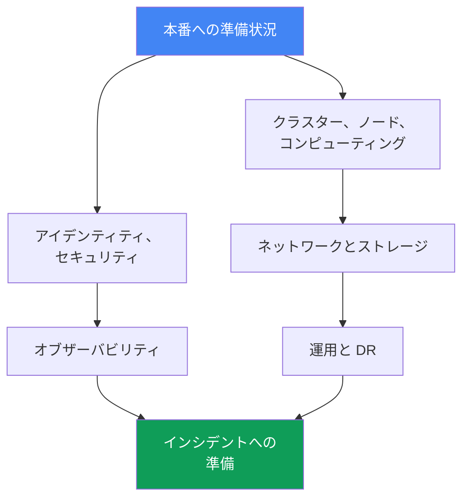
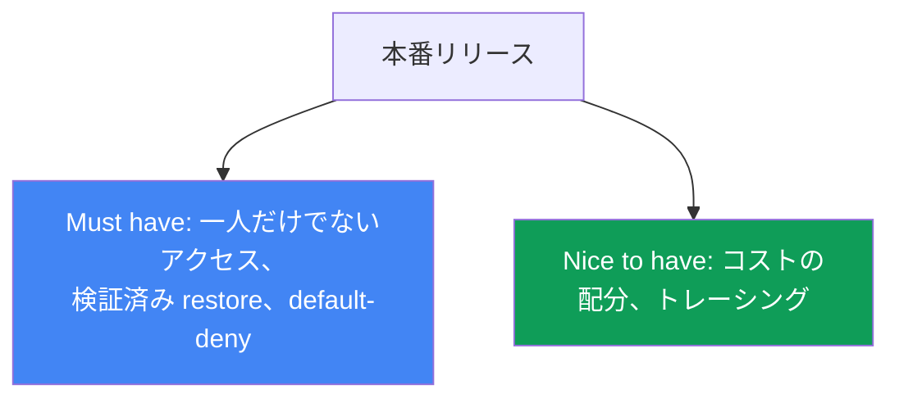

[ロシア語版](ru.md) · [英語版](en.md) · [スペイン語版](es.md) · [フランス語版](fr.md) · [ドイツ語版](de.md) · [ジョージア語版](ge.md) · [繁体字中国語版](tw.md)
# 第48章. EKS の本番チェックリストと次に読むもの

> **この先。** これがコースの最終章です。47章を通じて、control plane とバージョン、ノードとスケーリング、アイデンティティとセキュリティ、ストレージ、ネットワーク、オブザーバビリティ、運用、troubleshooting という、クラスターのあらゆる領域を構築してきました。ここではそれらを、本番稼働の準備状況を確認する一つの総合チェックリストにまとめます。ドメインごとに各項目の章を示します。新しい仕組みはありません。本章はパート1-8全体に基づき、クラスターを本番へ出す前の地図として機能します。最後に、このコースで終わらずに次へ進むための道筋を示します。

## 48.1. 問題: 「たぶん準備できた」は準備できたことにならない

クラスターは立ち上がり、アプリケーションはデプロイされ、ダッシュボードは緑です。本番リリースの期限は今週で、「準備できたか」という問いにチームは「たぶん、必要なことは全部やったはず」と答えます。問題はまさにこの「たぶん」です。ドメインごとの体系的な確認がなければ、最初のインシデントが起きるまで穴は見えません。そしてそのとき、「たぶんやった」ことがそのまま露呈します。

見落としがちな隙間を含む、典型的な「たぶん準備できた」の一覧は次のようになります。

```text
- クラスターは Terraform で作成、ノードは Karpenter        # しかしバージョンはまだ standard support 内か？
- 主アプリケーションに IRSA を設定                        # しかしクラスターアクセスは一人だけではないか？
- ロードバランサーがトラフィックを返し、TLS も動作         # しかし NetworkPolicy の default-deny はあるか？
- メトリクスとログは CloudWatch に送られている             # しかし retention とアラートは設定済みか？
- AWS Backup はスケジュールで有効                           # しかし restore を一度でも検証したか？
- 重要サービスには PDB がある                              # しかしノードアップグレードをブロックしないか？
```

左側の各行は完了しているように見えます。右側の各コメントは、最悪の瞬間に起きる独立したインシデントです。backup をテストしておらず restore が起動しない、NetworkPolicy がなく侵害された Pod がクラスター全体を移動できる、`maxUnavailable: 0` の PDB がアップグレード時の drain を完全にブロックする、クラスターへのアクセス権が退職したエンジニア一人にしかなかった、などです。

記憶はよいチェックリストではありません。半年にわたるプロジェクトの後では、control plane の監査が有効か、DR を検証したかを誰も覚えていません。すべてのドメインにわたる体系的な一覧が必要です。各項目は章へのリンク付きで完了にするか、正直に穴としてマークします。本章の残りがその一覧です。



## 48.2. クラスターと control plane（パート1）

土台です。バージョンがサポート切れ、またはサブネットが一つの AZ にしかなければ、他のことは重要ではありません。

| 確認すること | 章 |
|---|---|
| Kubernetes バージョンが standard support 内にあり、アップグレード計画がある | 第38章 |
| Endpoint access が検討されている: public/private、用途に合う source ranges | 第2章 |
| クラスターのサブネットが3つの AZ にあり、IP 計画に Pod 増加の余裕がある | 第6、7章 |
| クラスターがコンソール操作ではなくコード（Terraform/eksctl）から作成されている | 第4章 |
| リソースにチーム、環境、cost allocation のタグが付いている | 第4、43章 |

要点: クラスターは IaC から再現可能で、サポート対象のバージョンで動いていなければなりません。コードのない手作業のクラスターは DR 時に作り直せず、pull request でレビューもできません。

## 48.3. コンピューティング（パート2）

ノードはエンジニアが全面的に責任を持つ領域です。可用性もコストもここで決まります。

| 確認すること | 章 |
|---|---|
| ノード戦略が意識して選ばれている: Auto Mode、Karpenter、または managed node groups | 第9、12章 |
| 可用性を確保するワークロード向けの Spot ミックスとインスタンスタイプの多様化 | 第13章 |
| requests が推測ではなく実績に基づき設定されている（right-sizing） | 第14章 |
| Karpenter の disruption/consolidation が設定され、drift を無視していない | 第12章 |
| ノードあたりの Pod 密度が ENI と IP の上限に合っている | 第14章 |

要点: ノード戦略は価格と耐障害性への影響を理解した意識的な選択であり、「デフォルトのまま」にすることではありません。多様化のない Spot は節約ではなくリスクです。

## 48.4. アイデンティティとセキュリティ（パート3）

最も広いドメインであり、静かな穴が最も起こりやすい領域です。項目ごとに確認します。

| 確認すること | 章 |
|---|---|
| Pod が静的キーではなく IRSA または Pod Identity を介して AWS にアクセスする | 第16、17章 |
| クラスターへのアクセスが cluster creator だけではない。access entries が作成されている | 第5、47章 |
| シークレットがマニフェストではなく Secrets Manager/SSM（External Secrets/CSI）で管理されている | 第18章 |
| ノードと Pod が hardened されている: IMDSv2、hop limit、Pod Security Admission | 第19章 |
| イメージが ECR でスキャンされ、ベースイメージを信頼できるソースから取得している | 第20章 |
| control plane の監査が有効: api、audit、authenticator がログにある | 第21章 |
| Kyverno/Gatekeeper ポリシーが危険なマニフェストパターンを防いでいる | 第22章 |

要点: Pod 内に長期有効な AWS キーを一つも置かず、一人しかアクセスできないクラスターを一つも作らないことです。監査はインシデント前に有効化します。後からではログはもうありません。

## 48.5. ストレージ（パート4）

小さいながら油断できないドメインです。EBS のデフォルト設定と未検証のボリュームバックアップは突然問題になります。

| 確認すること | 章 |
|---|---|
| デフォルトの StorageClass が古い gp2 ではなく gp3 である | 第23章 |
| ボリュームが誤った AZ に作られないよう `volumeBindingMode: WaitForFirstConsumer` を使う | 第23章 |
| 永続ボリュームがバックアップ対象となり、スナップショットが検証済みである | 第23、41章 |
| AZ 間で共有するストレージを意識して選んでいる。ReadWriteMany が必要な場所では EFS/FSx を使う | 第24章 |

要点: `WaitForFirstConsumer` は、Pod が一方の AZ、EBS ボリュームが別の AZ にあり、Pod が永久に `Pending` となる典型的な罠を防ぎます。

## 48.6. ネットワークとトラフィック（パート5）

ここでの間違いは外から見えます。到達不能なサービス、開いた egress、すべての AZ をまたぐトラフィックです。

| 確認すること | 章 |
|---|---|
| AWS Load Balancer Controller によるロードバランサー: NLB と ALB Ingress | 第26、27章 |
| ACM による TLS 証明書、ロードバランサーでの HTTPS 終端 | 第27章 |
| default-deny を伴う NetworkPolicy、Pod 間トラフィックは明示的に許可されている | 第30章 |
| Route 53 を手作業で変更せず、external-dns が DNS レコードを管理している | 第29章 |
| AWS サービス用の VPC endpoints、AZ ごとの NAT、制御された egress トラフィック | 第31章 |

要点: default-deny の NetworkPolicy はクラスター内部のセキュリティ境界です。これがなければ、侵害された Pod はすべての隣接 Pod を見ることができます。VPC endpoints は egress コストも削減します。

## 48.7. オブザーバビリティ（パート6）

このドメインなしでは、インシデントを手探りでデバッグすることになります。データが送信されているだけでなく、必要な期間保持され、アラートを発生させることを確認します。

| 確認すること | 章 |
|---|---|
| metrics-server が稼働し、メトリクスバックエンド（Prometheus/Container Insights）がある | 第33章 |
| ログがノードと Pod から送信され、retention が意図的に設定されている | 第34章 |
| ダッシュボードだけでなく、重要な症状に対するアラートが設定されている | 第33、34章 |
| 呼び出し連鎖が重要なマイクロサービス向けのトレーシング（ADOT/X-Ray） | 第36章 |

要点: 誰も見ないダッシュボードはアラートの代わりになりません。計画のない retention は、調査時にログを失うか、予期しないストレージ料金につながります。

## 48.8. 運用（パート7）

「クラスターが今日動く」と「クラスターがアップグレードと障害を乗り越える」を分けるドメインです。

| 確認すること | 章 |
|---|---|
| クラスターとアドオンの更新計画があり、古い API を削除している | 第37、38章 |
| rollback readiness が理解されている: ロールバックの時間枠と手順が分かっている | 第39章 |
| PDB と topology spread が drain とアップグレード中の可用性を保護している | 第40章 |
| PDB が drain を永久にブロックしない（`maxUnavailable: 0` は危険信号） | 第40章 |
| AWS Backup が設定されている: クラスター状態と永続ボリューム | 第41章 |
| DR-restore が設定だけでなく game day で実際にテストされている | 第42章 |
| チームと namespace ごとにコストが見える（OpenCost/Kubecost） | 第43章 |
| GitOps がマニフェストの唯一の情報源である（Argo CD/Flux） | 第44章 |

要点: 設定済みでも一度も検証していない restore は、バックアップではなく希望です。Game day は DR を「動くはず」から「この日に動いた」へ変えます。

## 48.9. インシデントへの準備（パート8）

最後のドメインです。すべてが壊れたときに重要なのは仕組みではなく、切り分けの速さです。

| 確認すること | 章 |
|---|---|
| 参加しないノード用の runbook がある | 第45章 |
| ENI、SG/NACL、DNS、unhealthy targets を含むネットワーク障害用の runbook がある | 第46章 |
| 401 と 403、IRSA/Pod Identity、kubeconfig を扱うアクセス用の runbook がある | 第47章 |
| ノードへの SSM アクセスが動作する（生の SSH なし）。ノードに入れる | 第45章 |
| Control plane logging が有効で、authenticator と API のログにアクセスできる | 第21、34章 |

要点: runbook と SSM 経由のアクセスはインシデント前から存在していなければなりません。すでに壊れたノードへのアクセスをその瞬間に設定するのでは遅すぎます。

## 48.10. 全体像と優先順位

上記の8つのドメインが準備状況の軸です。どれも省略できませんが、最初の本番リリースに対する緊急度は同じではありません。一部は「must have」で、これなしに本番トラフィックを有効にするのは危険です。一部は「nice to have」であり、リリースを止めず本番で改善できます。



| 優先順位 | 項目 | 理由 |
|---|---|---|
| 本番前の Must have | サポート対象バージョン、一人だけでないアクセス、control plane の監査とログが有効、default-deny NetworkPolicy、マニフェストにシークレットがない、restore を検証済み、PDB がアップグレードをブロックしない | これがなければ、最初のインシデントまたは侵害のコストがリリース遅延より高くなる |
| 最初の数週間で重要 | right-sizing requests、Spot ミックス、ログ retention、アラート、アップグレード計画、VPC endpoints | 可用性とコストに影響するが、リリースをブロックしない |
| Nice to have | マイクロサービスのトレーシング、詳細なコスト配分、クラスター群向けの成熟した GitOps | 成熟度を高め、本番で反復的に仕上げられる |

表の実践的な意味は明確です。期限が迫っているなら、まず「must have」列をすべて完了させます。残りは「いつか後で」にせず、担当者付きの明示的なタスクとして計画します。

## 48.11. 導入シナリオ: 何から始めるか

コースは大きく、「何から始めるか」は状況によって異なります。ゼロからのスタートアップと自社データセンターから移行する企業では、出発点が違います。唯一の正しい順序はありませんが、共通の原則は一つです。どの開始もコードとして、かつ分離を伴って実施し、決定を可逆に保ちます。以下に二つの詳細なシナリオと共通の結論を示します。高価な要件を早すぎる段階で持ち込まず、そこへ至る道も閉ざしません。

### シナリオ1. ゼロからのスタートアップ: 後の作り直しなしに、MVP を速く安く

まだ製品がなく、MVP をできるだけ速く安く必要としています。PCI DSS のような監査は今は不要かもしれませんが、後で作り直しや今日の余計なコストなしに追加できるアーキテクチャでなければなりません。

- **迅速な開始。** EKS Auto Mode または Karpenter を伴う managed node groups、非本番ワークロードには Spot（第9、12、13章）。初日から terraform-aws-eks（第4章）でクラスターをコード化し、クリックで作ったものを後から作り直さないようにします。
- **今は低コスト。** NAT と AZ 間トラフィックを最小化し（第31章）、クラスター群ではなく namespace による分離を持つ一つのクラスターを使い（第32章）、自己運用ではなく managed アドオンを使います（第37章）。
- **後で作り直さないために。** キーの代わりに最初から private endpoint と IRSA/Pod Identity（第16、17、19章）、少なくとも基本的な control plane の監査ログとコスト用タグ（第21、43章）、gp3 と `WaitForFirstConsumer` を使う StorageClass（第23章）を設定します。
- **今コストをかけずに PCI DSS へ備える。** audit logs、KMS によるシークレット暗号化、NetworkPolicy 対応 CNI、Pod Security Admission といった安価なものを構造的に有効にします。専用アカウント、GuardDuty runtime、完全なセグメンテーションといった高価なものは延期しますが、そこへの道は閉ざしません（第18、19、21、22、30章）。鍵は、namespace とアカウントによる分離に IaC を組み合わせ、後から監査へ成長できることです。

### シナリオ2. 自社データセンター -> EKS: シームレスな移行

企業はデータセンター内に自前のサーバー（自前の Kubernetes を含む）を持ち、EKS と AWS へ移行中です。停止時間なしで、ロールバック計画を伴う移行が必要です。

- **on-prem と VPC の接続性。** Site-to-Site VPN または Direct Connect を使い、範囲が重複しないよう CIDR を調整します（第6、31、32章）。移行期間にはハイブリッド構成を使います。
- **段階的な移行。** ワークロードをサービス単位で移し、DNS とトラフィックの重みで切り替えます（第29章）。データは一度にではなくレプリカとバックアップで移します。
- **「マニフェストをそのまま移す」ことで壊れるもの。** StorageClass とボリューム（EBS は AZ に結び付く、第23章。共有には EFS、第24章）、LoadBalancer と Ingress は NLB と ALB になり（第26、27章）、NetworkPolicy は CNI に依存し（第30章）、アクセスは IAM と RBAC access entries を介し（第5章）、identity は静的キーの代わりに IRSA/Pod Identity を使います（第16、17章）。
- **Pod 密度。** overlay-CNI の kubeadm ノードは数百の小さな Pod を保持できますが、VPC CNI は各 Pod に VPC の実 IP を与え、ENI の上限に達します（ノードあたり数十 Pod）。prefix delegation と `max-pods` の再計算で対処します。そうしないと Pod は `Pending` のままになります（第7、14章）。
- **同等性の検証。** 最初に非本番クラスターで負荷とオブザーバビリティを検証し（第33、34章）、次に本番へ進みます。ロールバック計画は常に用意しておきます（第42章）。

二つの開始方法をまとめると次のようになります。

| シナリオ | 何から始めるか | 後回しにすること |
|---|---|---|
| ゼロからのスタートアップ | IaC、private endpoint、IRSA、gp3、基本監査とタグ | GuardDuty runtime、マルチアカウント、完全なセグメンテーション |
| データセンター -> EKS | 接続性と CIDR、非本番での同等性、ロールバック計画 | コスト最適化と成熟したマルチクラスター |

共通原則: どの開始もコードとして、かつ分離（namespace またはアカウント）を伴って実施し、決定を可逆にします。高価な要件を早すぎる段階で持ち込みませんが、それを排除するアーキテクチャにもしてはいけません。そうすれば MVP から監査へ、またはハイブリッドから完全な EKS への移行は書き直しではなく仕上げになります。

## 48.12. 次に読むもの

このコースは地図であり、到達点ではありません。次は一次資料へ進み、手元に置いてください。

- **EKS Best Practices Guide** - セキュリティ、ネットワーク、信頼性、オートスケーリング、コストについての AWS 公式推奨集です。このコースの次に最も近い指針であり、上のチェックリストのドメインをまさに深掘りします。
- **AWS Well-Architected Framework** - 6つの柱（operational excellence、security、reliability、performance、cost、sustainability）により、EKS に限らない AWS 上のあらゆるシステムを評価する共通の枠組みです。アーキテクチャ全体のレビューに有用です。
- **Kubernetes documentation** - Kubernetes 自体の一次資料です。API、コントローラー、スケジューラーを扱います。EKS 固有でないものはそこにあります。
- **EKS release calendar と version lifecycle** - バージョンのリリースとサポート終了の公式スケジュールです。アップグレード計画（第38章）はこれに基づきます。サポート終了の一か月前に思い出すのではなく、常に追跡する必要があります。
- **CNCF プロジェクトとコミュニティ** - Karpenter、Cilium、Argo、Prometheus、OpenTelemetry、その他コース内のツールは CNCF で発展しています。これらの release notes と議論はエコシステムの方向を示します。コミュニティのライブチャネル（Kubernetes Slack、プロジェクトの GitHub discussions）は、誰かがすでに自分の問題にぶつかっていないかをすばやく確認する方法です。

ルールは単純です。本章のチェックリストは何を確認するかを示し、列挙したリソースは詳細を得る場所と、バージョンや best practices が変わっても最新状態を保つ方法を示します。

### コースの境界: ここで意図的に扱わないこと

本コースは EKS の運用という一つのテーマを守り、横道にそれる内容は意図して他の資料に委ねています。これは欠落ではなく、境界の選択です。以下は範囲外にしたものと、詳細を得る場所です。

| テーマ | 範囲外である理由 | 次に読むもの |
|---|---|---|
| 概要より深い HashiCorp Vault: PKI と transit engine、クラスターへのインストール、HCL ポリシー、Vault namespaces | 独自の運用モデルを持つ別製品であり、EKS の一部ではない。コースにはシークレットストレージ層としての Vault の概説がある（第18章） | Vault のドキュメント |
| ベンダー固有の CI パイプライン: GitHub Actions、GitLab CI などの完成した定義 | コースは特定 CI の構文ではなく、モデルとして GitOps を説明する（第44章） | 使用する CI システムの documentation |
| 実運用でのマルチアカウントとマルチクラスター | アーキテクチャとしては扱った（第32章）が、再現可能な実践はない。最低二つの AWS アカウントが必要 | AWS Organizations と EKS documentation |
| GuardDuty を使う監査と検知の実践 | 仕組みは説明した（第21章）が、実践はない。有料サービスで、検出も即時ではない | Amazon GuardDuty のドキュメント |
| データスキーマを含むアプリケーション開発とサービスコード | コースはプラットフォームについてであり、アプリケーションの書き方についてではない | 開発に関する専門資料 |
| クラスター外の AWS アプリケーションサービス: RDS、キュー、キャッシュ | コンシューマーおよびコストの源として触れるが、独自の運用はコースにない | 該当する AWS サービスの documentation |
| 概要より深い progressive delivery: Argo Rollouts、Flagger | blue/green クラスターと区別して言及している（第44章）が、独自の章はない | Argo Rollouts と Flagger documentation |
| Windows ノード | Pod Identity の制約、access entry のタイプなど、仕組みが変わる箇所でのみ触れる | Windows ノードに関する EKS documentation |
| 実践としての Argo CD 向け EKS managed 機能 | 本文で扱った（第44章）が、ラボはない。認証が AWS Identity Center 経由のみであり、これは AWS Organizations を必要とするため、個人アカウントでは障壁になる | EKS と AWS Identity Center documentation |

境界の一覧は未完成項目の一覧ではありません。上の各行は、EKS 運用がどこで終わり、別の専門領域がどこで始まるかの決定です。今すぐ必要なテーマなら、コースは専門ドキュメントをゼロからではなく、それがどこにはまるかを理解して読めるだけのコンテキストを与えます。

## 48.13. 本番での適用方法

- **チェックリストをリポジトリ内の生きたドキュメントとして管理する。** 頭の中やチャットではなく、IaC の隣に置きます。これにより pull request で確認でき、変更履歴も追跡できます。
- **ドメインに ownership を割り当てる。** 各ドメイン（ネットワーク、セキュリティ、コスト）には、その項目が完了し劣化していないことの責任者がいます。
- **本番へのリリースのたびにチェックリストを通す。** 新しいクラスターまたは大規模な新サービスは、「must have」列が明示的にすべて完了するまで本番に出しません。
- **一度きりでなく定期的に見直す。** 四半期ごと、および大きな変更後に実施します。バージョンは古くなり、負荷は増え、昨日の「完了」は今日には穴になる可能性があります。
- **穴を正直に記録する。** 未完了の項目を、タスクと期限を伴う既知のリスクとしてマークします。チェックリストを緑に見せるために黙って飛ばしてはいけません。
- **game day とアップグレードに結び付ける。** DR-restore とアップグレード計画を演習で検証し、結果を確認済みまたは失敗した項目としてチェックリストへ戻します。

## 48.14. ミニ用語集

- **本番チェックリスト** - ドメインごとの準備状況を体系的に確認する一覧。各項目は章へのリンクとともに完了とするか、既知のリスクとしてマークされます。
- **準備ドメイン** - 個別に確認する運用の一軸（control plane、ノード、セキュリティ、ネットワーク、ストレージ、オブザーバビリティ、運用、インシデント）。
- **must have** - これなしに本番へ出すのは危険であり、リリースを止めるべき項目。
- **nice to have** - 成熟度を高める項目。本番ですでに仕上げてもよい項目。
- **standard support** - EKS バージョンを維持するサポート期間（第38章）。
- **rollback readiness** - バージョンをロールバックする準備状態。時間枠と手順が分かっていること（第39章）。
- **game day** - DR とインシデントシナリオを実地で確認する演習（第42章）。
- **ownership** - ドメインまたはチェックリスト項目に対して明確に割り当てられた責任。

## 48.15. 本章とコースのまとめ

- 体系的な確認なしの「たぶん準備できた」は準備ではありません。最初のインシデントが暴くまで穴は見えません。記憶をドメイン別チェックリストに置き換えます。
- 本番への準備は、コースのパートを繰り返す9つのドメインに分解されます: control plane、ノード、セキュリティ、ストレージ、ネットワーク、オブザーバビリティ、運用、インシデント。
- control plane は AWS が運用しますが、バージョン、アクセス、IaC、タグはエンジニアの責任として残ります（パート1）。
- ノード、Spot ミックス、right-sizing、disruption は、デフォルトではなく価格と耐障害性を意識して選ぶものです（パート2）。
- Pod に長期有効キーを一つも置かず、アクセスを一人に限定せず、監査をあらかじめ有効化し、ネットワークに default-deny を置くことがセキュリティの基本です（パート3、5）。
- 設定済みで未検証の restore はバックアップでなく希望です。DR は game day で検証し、アップグレードには計画と rollback readiness を持たせます（パート7）。
- Runbook と SSM アクセスはインシデント前に存在します。障害時に重要なのは仕組みでなく、切り分けの速さです（パート8）。
- 優先順位が期限を決めます。最初に「must have」をすべて完了し、残りをタスクとして計画します。次に EKS Best Practices Guide、Well-Architected、Kubernetes docs、バージョンカレンダーを読みます。

## 48.16. 実務でどう役立つか

クラスターを本番に出す瞬間には、ほぼ常に期限の圧力と「たぶん準備できた、行こう」と言いたい誘惑があります。ドメイン別のチェックリストを持つエンジニアは異なる答えをします。9つの軸を確認し、「must have」列を完了し、残った穴を担当者付きのタスクとして明示します。これは官僚主義ではなく保険です。各チェックリスト項目は、あらかじめ想定したために起きないインシデントです。チームの違いはリリース当日ではなく、最初の重大な障害で明らかになります。一方では未検証の restore と退職者だけが持つアクセスが発覚し、他方では runbook により数分でインシデントを切り分けられます。

計画時には、チェックリストは成熟度の地図として機能します。クラスターの強みと「後で仕上げよう」に支えられている場所を示し、曖昧な「改善すべき」を、所有者と期限を伴うドメイン別の具体的なタスクに変えます。四半期ごとに見直すことで、バージョンが古くなり負荷が増えても準備状況が劣化することを防ぎます。章へのリンクによりチェックリストは自己完結します。必要なコース章に戻れば、どの項目もコマンドと詳細まで掘り下げられます。コースは終わりますが、運用は終わりません。このチェックリストは実務の道具として残ります。

## 48.17. 自己確認の質問

1. 体系的な確認なしの「たぶん準備できた」が危険なのはなぜですか。実施済みの記憶を何が置き換えますか。
2. 本番への準備はどの9つのドメインに分解され、それらはコースのパートとどう結び付きますか。
3. managed であっても control plane ドメインでエンジニアに残る責任は何ですか（パート1）。
4. ノードのチェックリストにはどの項目が入り、なぜそれは意識的な選択ですか（パート2）。
5. 本番前に必ず確認すべきセキュリティ項目を挙げてください（パート3）。
6. なぜ `volumeBindingMode: WaitForFirstConsumer` はストレージチェックリストに含まれますか（第23章）。
7. default-deny NetworkPolicy はなぜネットワークドメインに入り、何を保護しますか（第30章）。
8. 「設定済みバックアップ」と「検証済み restore」の違いは何ですか。game day はどう関係しますか。
9. `maxUnavailable: 0` の PDB がノードアップグレード時の危険信号である理由は何ですか（第40章）。
10. インシデント準備ドメインでは、インシデント後でなく前に何が存在していなければなりませんか。
11. 「本番前の must have」と「nice to have」の項目をどう区別し、この優先順位付けはなぜ必要ですか。
12. 本番ではチェックリストをどのように管理し見直しますか。どこに置き、誰が所有し、どの頻度ですか。
13. 次にどのリソースを読むべきで、EKS バージョンカレンダーはどの役割を果たしますか（第38章）。

## 実践

この章には個別のラボはありません。コース全体をチェックリストにまとめる章だからです。最良の実践は、自分のクラスターでこの一覧を確認し、対応する章のコマンドで項目を完了させ、穴が見つかった場所を正直に記録することです。

まず土台であるバージョンとアクセスモードを確認します（第38、2章）。

```bash
# クラスターのバージョンとサポート状態
aws eks describe-cluster --name <cluster> --query 'cluster.{version:version,status:status}'
# endpoint のアクセスモードと accessConfig
aws eks describe-cluster --name <cluster> \
  --query 'cluster.{endpoint:resourcesVpcConfig,access:accessConfig}'
```

アクセスのセキュリティと有効な監査を確認します（第47、21章）。

```bash
# クラスターアクセスにマッピングされているのは一つの principal だけではないか
aws eks list-access-entries --cluster-name <cluster>
# 有効になっている control plane ログのタイプ
aws eks describe-cluster --name <cluster> --query 'cluster.logging'
```

ネットワークとストレージ、default-deny と StorageClass を確認します（第30、23章）。

```bash
# NetworkPolicy が一つでもあるか（空なら default-deny は確実にない）
kubectl get networkpolicy -A
# デフォルトの StorageClass とボリュームバインディングモード
kubectl get storageclass
```

次に運用として、バックアップと可用性保護を確認します（第41、40章）。

```bash
# アカウント内の AWS Backup プラン
aws backup list-backup-plans --query 'BackupPlansList[].BackupPlanName'
# クラスター全体の PDB。maxUnavailable: 0 のものがないか
kubectl get pdb -A
```

セクション48.2-48.9のドメインを確認すれば、抽象的な「たぶん準備できた」ではなく、具体的な全体像を得られます。章へのリンク付きで完了したものと、穴として残ったものです。まずセクション48.10の「must have」列から、穴を担当者と期限を持つタスクにします。これが希望から準備状況への移行です。

---
[目次](../README_JP.md) · [第47章](../47/jp.md)
