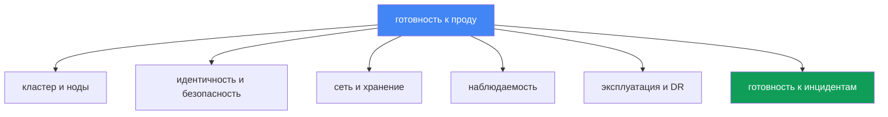
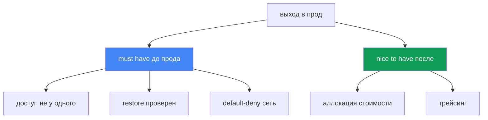

# Глава 48. Продакшн-чеклист EKS и что читать дальше

> **Что дальше.** Это финал курса. За 47 глав кластер собран по всем измерениям: control
> plane и версии, ноды и масштабирование, идентичность и безопасность, хранение, сеть,
> наблюдаемость, эксплуатация и troubleshooting. Здесь всё это сводится в один сводный
> чеклист готовности к продакшену - по доменам, с указанием главы на каждый пункт. Новых
> механизмов тут нет: глава опирается на части 1-8 целиком и служит картой перед выводом
> кластера в прод. В конце - куда двигаться дальше, чтобы не остановиться на этом курсе.

## 48.1. Проблема: «вроде готов» - это не готов

Кластер поднят, приложения катятся, дашборды зелёные. Дедлайн вывода в прод на этой неделе,
и на вопрос «мы готовы?» команда отвечает «вроде да, вроде всё сделали». Именно «вроде» и есть
проблема: без систематической проверки по доменам дыры не видны, пока не случится первый
инцидент - и тогда всплывёт ровно то, что «вроде сделали».

Так выглядит типичный набор «вроде готово», в котором пробелы не бросаются в глаза:

```text
- кластер создан через Terraform, ноды на Karpenter        # а версия ещё в standard support?
- IRSA настроен для основного приложения                   # а доступ к кластеру не у одного?
- балансировщик отдаёт трафик, TLS работает                # а NetworkPolicy default-deny есть?
- метрики и логи льются в CloudWatch                       # а retention и алерты настроены?
- AWS Backup включён по расписанию                          # а restore хоть раз проверяли?
- PDB стоят у критичных сервисов                            # а они не блокируют апгрейд нод?
```

Каждая строка слева выглядит выполненной. Каждый комментарий справа - это отдельный инцидент,
который придёт в худший момент: backup не тестировали и restore не поднимается; NetworkPolicy
нет, и скомпрометированный под ходит по всему кластеру; PDB с `maxUnavailable: 0` намертво
блокирует drain при апгрейде; доступ к кластеру был только у уволившегося инженера.

Память - плохой чеклист. Через полгодовой проект никто не помнит, включён ли аудит control
plane и проверялся ли DR. Нужен систематический список по всем доменам, где каждый пункт либо
закрыт со ссылкой на главу, либо честно помечен как дыра. Остаток главы - такой список.



## 48.2. Кластер и control plane (Часть 1)

Фундамент. Если версия ушла из поддержки или подсети заданы в одной AZ, всё остальное неважно.

| Что проверить | Глава |
|---|---|
| Версия Kubernetes в пределах standard support, есть план апгрейда | глава 38 |
| Endpoint access продуман: public/private, source ranges под задачу | глава 2 |
| Подсети кластера в трёх AZ, IP-плана хватает на рост подов | главы 6, 7 |
| Кластер создан из кода (Terraform/eksctl), а не кликами в консоли | глава 4 |
| Ресурсы размечены тегами: команда, окружение, cost allocation | главы 4, 43 |

Ключевое: кластер должен быть воспроизводим из IaC и жить на поддерживаемой версии. Ручной
кластер без кода нельзя пересоздать при DR и нельзя ревьюить в pull request.

## 48.3. Вычисления (Часть 2)

Ноды - зона ответственности инженера целиком. Здесь решается и отказоустойчивость, и счёт.

| Что проверить | Глава |
|---|---|
| Стратегия нод осознанно выбрана: Auto Mode, Karpenter или managed node groups | главы 9, 12 |
| Spot-микс для отказоустойчивых нагрузок, диверсификация типов | глава 13 |
| requests выставлены по факту (right-sizing), не «на глаз» | глава 14 |
| Karpenter disruption/consolidation настроены, drift не игнорируется | глава 12 |
| Плотность подов на ноду согласована с лимитами ENI и IP | глава 14 |

Ключевое: стратегия нод - это осознанный выбор с понятными последствиями для цены и
устойчивости, а не «оставили дефолт». Spot без диверсификации - это не экономия, а риск.

## 48.4. Идентичность и безопасность (Часть 3)

Самый широкий домен и самый частый источник тихих дыр. Проверять пункт за пунктом.

| Что проверить | Глава |
|---|---|
| Поды ходят в AWS через IRSA или Pod Identity, не через статические ключи | главы 16, 17 |
| Доступ к кластеру не только у cluster creator; заведены access entries | главы 5, 47 |
| Секреты через Secrets Manager/SSM (External Secrets/CSI), не в манифестах | глава 18 |
| Ноды и поды захардены: IMDSv2, hop limit, Pod Security Admission | глава 19 |
| Образы сканируются в ECR, база берётся из доверенных источников | глава 20 |
| Аудит control plane включён: api, audit, authenticator в логах | глава 21 |
| Политики Kyverno/Gatekeeper закрывают опасные паттерны манифестов | глава 22 |

Ключевое: ни одного долгоживущего AWS-ключа в подах и ни одного кластера с доступом у одного
человека. Аудит включают до инцидента - постфактум логов уже не будет.

## 48.5. Хранение (Часть 4)

Небольшой, но коварный домен: дефолты EBS и непротестированный бэкап томов бьют внезапно.

| Что проверить | Глава |
|---|---|
| StorageClass по умолчанию на gp3, а не на устаревшем gp2 | глава 23 |
| `volumeBindingMode: WaitForFirstConsumer`, чтобы том не рождался не в той AZ | глава 23 |
| Постоянные тома попадают в бэкап, снапшоты проверены | главы 23, 41 |
| Shared-хранилище между AZ осознанно: EFS/FSx там, где нужен ReadWriteMany | глава 24 |

Ключевое: `WaitForFirstConsumer` спасает от классической ловушки, когда под в одной AZ, а его
EBS-том в другой, и под навсегда `Pending`.

## 48.6. Сеть и трафик (Часть 5)

Здесь ошибки видны снаружи: недоступный сервис, открытый egress, трафик по всем AZ.

| Что проверить | Глава |
|---|---|
| Балансировщики через AWS Load Balancer Controller: NLB и ALB Ingress | главы 26, 27 |
| TLS-сертификаты через ACM, HTTPS терминируется на балансировщике | глава 27 |
| NetworkPolicy с default-deny, трафик между подами разрешён явно | глава 30 |
| DNS-записи управляются external-dns, а не руками в Route 53 | глава 29 |
| VPC endpoints для AWS-сервисов, NAT по AZ, egress-трафик под контролем | глава 31 |

Ключевое: default-deny NetworkPolicy - граница безопасности внутри кластера. Без неё любой
скомпрометированный под видит всех соседей. VPC endpoints заодно режут стоимость egress.

## 48.7. Наблюдаемость (Часть 6)

Без этого домена инцидент отлаживается вслепую. Проверять, что данные не только льются, но и
хранятся нужное время и порождают алерты.

| Что проверить | Глава |
|---|---|
| metrics-server работает, есть бэкенд метрик (Prometheus/Container Insights) | глава 33 |
| Логи вывозятся с нод и подов, retention задан осознанно | глава 34 |
| Настроены алерты на ключевые симптомы, а не только дашборды | главы 33, 34 |
| Трейсинг для микросервисов (ADOT/X-Ray), где важна цепочка вызовов | глава 36 |

Ключевое: дашборд, на который никто не смотрит, не заменяет алерт. Retention без плана - это
либо потерянные логи в момент разбора, либо неожиданный счёт за хранение.

## 48.8. Эксплуатация (Часть 7)

Домен, который отделяет «кластер работает сегодня» от «кластер переживёт апгрейд и сбой».

| Что проверить | Глава |
|---|---|
| Есть план обновлений кластера и аддонов, устаревшие API вычищены | главы 37, 38 |
| Rollback readiness понятен: окно отката и порядок известны | глава 39 |
| PDB и topology spread защищают доступность при drain и апгрейде | глава 40 |
| PDB не блокируют drain намертво (`maxUnavailable: 0` - красный флаг) | глава 40 |
| AWS Backup настроен: состояние кластера и постоянные тома | глава 41 |
| DR-restore реально протестирован на game day, а не только настроен | глава 42 |
| Стоимость видна по командам и namespace (OpenCost/Kubecost) | глава 43 |
| GitOps - источник истины для манифестов (Argo CD/Flux) | глава 44 |

Ключевое: настроенный, но ни разу не проверенный restore - это не бэкап, а надежда. Game day
переводит DR из статуса «должно сработать» в «сработало вот тогда-то».

## 48.9. Готовность к инцидентам (Часть 8)

Финальный домен: когда всё сломается, важно не устройство, а скорость локализации.

| Что проверить | Глава |
|---|---|
| Есть runbook на ноду, которая не присоединилась | глава 45 |
| Есть runbook на сетевые сбои: ENI, SG/NACL, DNS, unhealthy targets | глава 46 |
| Есть runbook на доступ: 401 против 403, IRSA/Pod Identity, kubeconfig | глава 47 |
| SSM-доступ на ноды работает (без голого SSH), можно зайти на узел | глава 45 |
| Control plane logging включён, логи authenticator и API доступны | главы 21, 34 |

Ключевое: runbook и доступ через SSM должны существовать до инцидента. Настраивать доступ к
ноде в момент, когда она уже сломана, поздно.

## 48.10. Сводная картина и приоритеты

Девять доменов выше - это оси готовности. Ни одну нельзя пропустить, но не все одинаково
срочны для первого выхода в прод. Часть пунктов - «must have», без них включать боевой трафик
опасно; часть - «nice to have», их доводят уже в проде, не блокируя запуск.



| Приоритет | Пункты | Почему так |
|---|---|---|
| Must have до прода | поддерживаемая версия, доступ не у одного, аудит и логи control plane включены, default-deny NetworkPolicy, секреты не в манифестах, restore протестирован, PDB не блокируют апгрейд | без этого первый же инцидент или взлом дороже, чем задержка запуска |
| Важно в первые недели | right-sizing requests, spot-микс, retention логов, алерты, план апгрейдов, VPC endpoints | влияет на устойчивость и счёт, но не блокирует запуск |
| Nice to have | трейсинг микросервисов, детальная аллокация стоимости, зрелый GitOps на парк кластеров | повышает зрелость, доводится в проде итеративно |

Практический смысл таблицы: если дедлайн жмёт, закрывают сначала весь столбец «must have», а
остальное планируют явными задачами с ответственными, а не оставляют на «потом когда-нибудь».

## 48.11. Что читать дальше

Курс - это карта, а не потолок. Дальше стоит идти к первоисточникам и держать их под рукой.

- **EKS Best Practices Guide** - официальный набор рекомендаций AWS по безопасности, сети,
  надёжности, автомасштабированию и стоимости. Ближайший ориентир после этого курса: он
  углубляет ровно те домены, что в чеклисте выше.
- **AWS Well-Architected Framework** - шесть столпов (operational excellence, security,
  reliability, performance, cost, sustainability) как общая рамка для оценки любой системы в
  AWS, не только EKS. Полезно для ревью архитектуры целиком.
- **Kubernetes documentation** - первоисточник по самому Kubernetes: API, контроллеры,
  планировщик. То, что не специфично для EKS, живёт именно там.
- **EKS release calendar и version lifecycle** - официальный график выхода и снятия с
  поддержки версий. По нему строится план обновлений (глава 38); отслеживать его нужно
  постоянно, а не вспоминать за месяц до конца поддержки.
- **CNCF-проекты и комьюнити** - Karpenter, Cilium, Argo, Prometheus, OpenTelemetry и прочие
  инструменты из курса развиваются в CNCF; их release notes и обсуждения показывают, куда
  движется экосистема. Живые каналы комьюнити (Kubernetes Slack, GitHub-обсуждения проектов) -
  быстрый способ проверить, не наступил ли кто-то уже на вашу проблему.

Правило простое: чеклист из этой главы - что проверить, а перечисленные ресурсы - где взять
детали и как оставаться в курсе изменений, когда версии и best practices сдвинутся.

## 48.12. Как это применяют в продакшене

- **Ведут чеклист как живой документ в репозитории.** Не в голове и не в чате, а рядом с IaC,
  где его видно в pull request и историю изменений можно отследить.
- **Назначают ownership на домены.** У каждого домена (сеть, безопасность, стоимость) есть
  ответственный, который отвечает за то, что его пункты закрыты и не деградировали.
- **Проходят чеклист перед каждым выводом в прод.** Новый кластер или новый крупный сервис не
  выходит в бой, пока столбец «must have» не закрыт целиком и явно.
- **Пересматривают регулярно, а не однократно.** Раз в квартал и после крупных изменений:
  версии стареют, нагрузки растут, вчерашнее «готово» сегодня уже дыра.
- **Отмечают дыры честно.** Незакрытый пункт помечается как известный риск с задачей и сроком,
  а не тихо пропускается, чтобы чеклист выглядел зелёным.
- **Привязывают к game day и апгрейдам.** DR-restore и апгрейд-план проверяют на учениях, а
  результат возвращают в чеклист как подтверждённый или проваленный пункт.

## 48.13. Мини-глоссарий

- **Продакшн-чеклист** - систематический список проверок готовности по доменам, где каждый
  пункт закрыт со ссылкой на главу либо помечен как известный риск.
- **Домен готовности** - одна ось эксплуатации (control plane, ноды, безопасность, сеть,
  хранение, наблюдаемость, эксплуатация, инциденты), проверяемая отдельно.
- **must have** - пункт, без которого выход в прод опасен и должен быть заблокирован.
- **nice to have** - пункт, повышающий зрелость, который допустимо доводить уже в проде.
- **standard support** - период поддержки версии EKS, в котором её и держат (глава 38).
- **rollback readiness** - готовность к откату версии: известны окно и порядок (глава 39).
- **game day** - учения, на которых DR и инцидент-сценарии проверяют на деле (глава 42).
- **ownership** - закреплённая ответственность за домен или пункт чеклиста.

## 48.14. Итоги главы и курса

- «Вроде готов» без систематической проверки - это не готовность: дыры не видны, пока их не
  вскроет первый инцидент. Память заменяют чеклистом по доменам.
- Готовность к проду раскладывается на девять доменов, повторяющих части курса: control plane,
  ноды, безопасность, хранение, сеть, наблюдаемость, эксплуатация, инциденты.
- Control plane обслуживает AWS, но версия, доступ, IaC и теги остаются на инженере (Часть 1).
- Ноды, spot-микс, right-sizing и disruption - это осознанный выбор цены и устойчивости, а не
  дефолт (Часть 2).
- Ни одного долгоживущего ключа в подах, доступ не у одного человека, аудит включён заранее,
  default-deny в сети - это база безопасности (части 3 и 5).
- Настроенный, но непроверенный restore - это надежда, а не бэкап; DR проверяют game day, а
  апгрейды имеют план и rollback readiness (Часть 7).
- Runbook'и и SSM-доступ существуют до инцидента; при сбое важна скорость локализации, а не
  устройство (Часть 8).
- Приоритезация решает срок: сначала закрывают весь «must have», остальное планируют задачами.
  Дальше - EKS Best Practices Guide, Well-Architected, Kubernetes docs и календарь версий.

## 48.15. Как это пригодится в реальной работе

Момент вывода кластера в прод почти всегда сопровождается давлением сроков и соблазном сказать
«вроде готово, поехали». Инженер, у которого есть чеклист по доменам, отвечает иначе: он
проходит девять осей, закрывает столбец «must have» и явно называет оставшиеся дыры задачами с
ответственными. Это не бюрократия, а страховка: каждый пункт чеклиста - это инцидент, который
не случится, потому что его предусмотрели заранее. Разница между командами видна не в день
запуска, а в первый серьёзный сбой: у одних всплывает непротестированный restore и доступ у
уволившегося, у других инцидент локализуется по runbook за минуты.

При планировании чеклист работает как карта зрелости. Он показывает, где кластер силён, а где
держится на «потом доделаем», и превращает расплывчатое «надо бы улучшить» в конкретные задачи
по доменам с владельцами и сроками. Пересматриваемый раз в квартал, он не даёт готовности
деградировать по мере того, как версии стареют, а нагрузки растут. А ссылки на главы делают
его самодостаточным: любой пункт можно раскрыть до команд и деталей, вернувшись к нужной главе
курса. Курс заканчивается, но эксплуатация - нет, и этот чеклист остаётся рабочим инструментом.

## 48.16. Вопросы для самопроверки

1. Почему «вроде готов» без систематической проверки опасен, и что заменяет память о сделанном?
2. На какие девять доменов раскладывается готовность к проду и как они связаны с частями курса?
3. Что в домене control plane остаётся на инженере, несмотря на управляемость (Часть 1)?
4. Какие пункты по нодам входят в чеклист и почему это осознанный выбор (Часть 2)?
5. Перечислите пункты безопасности, которые обязательно проверить перед продом (Часть 3).
6. Почему `volumeBindingMode: WaitForFirstConsumer` попадает в чеклист хранения (глава 23)?
7. Зачем в сетевой домен входит default-deny NetworkPolicy и что она защищает (глава 30)?
8. Чем отличается «настроенный бэкап» от «протестированного restore» и при чём тут game day?
9. Почему PDB с `maxUnavailable: 0` - это красный флаг при апгрейде нод (глава 40)?
10. Что в домене готовности к инцидентам должно существовать до инцидента, а не после?
11. Как отличить пункты «must have до прода» от «nice to have» и зачем эта приоритезация?
12. Как ведут и пересматривают чеклист в продакшене: где он живёт, кто владеет, как часто?
13. Какие ресурсы читать дальше и какую роль играет календарь версий EKS (глава 38)?

## Практика

Отдельной лабы у этой главы нет: она сводит весь курс в чеклист. Лучшая практика - пройтись по
нему на своём кластере, закрывая пункты командами из соответствующих глав, и честно отметить,
где обнаружились дыры.

Начните с фундамента - версия и режим доступа (главы 38, 2):

```bash
# версия кластера и статус поддержки
aws eks describe-cluster --name <cluster> --query 'cluster.{version:version,status:status}'
# режим доступа к endpoint и accessConfig
aws eks describe-cluster --name <cluster> \
  --query 'cluster.{endpoint:resourcesVpcConfig,access:accessConfig}'
```

Проверьте безопасность доступа и включённый аудит (главы 47, 21):

```bash
# кто замаплен на доступ к кластеру - не один ли это principal
aws eks list-access-entries --cluster-name <cluster>
# какие типы логов control plane включены
aws eks describe-cluster --name <cluster> --query 'cluster.logging'
```

Посмотрите сеть и хранение - default-deny и StorageClass (главы 30, 23):

```bash
# есть ли хоть одна NetworkPolicy (пусто - значит default-deny точно нет)
kubectl get networkpolicy -A
# StorageClass по умолчанию и режим привязки тома
kubectl get storageclass
```

Затем эксплуатация - бэкап и защита доступности (главы 41, 40):

```bash
# планы AWS Backup в аккаунте
aws backup list-backup-plans --query 'BackupPlansList[].BackupPlanName'
# PDB по кластеру - нет ли среди них maxUnavailable: 0
kubectl get pdb -A
```

Пройдя по доменам из разделов 48.2-48.9, вы получите не абстрактное «вроде готов», а конкретную
картину: что закрыто со ссылкой на главу, а что осталось дырой. Оформите дыры как задачи с
ответственными и сроками, начав со столбца «must have» из раздела 48.10 - это и есть переход от
надежды к готовности.

---
[Оглавление](../README_RU.md) · [Глава 47](../47/ru.md)
