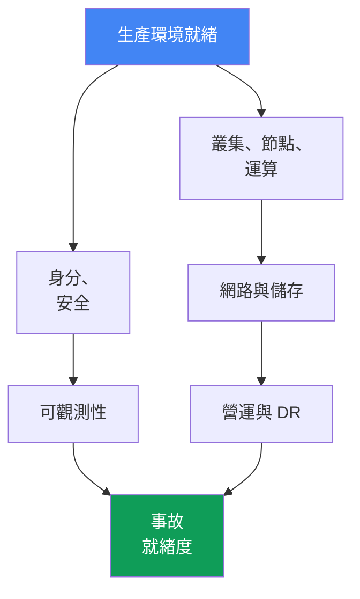
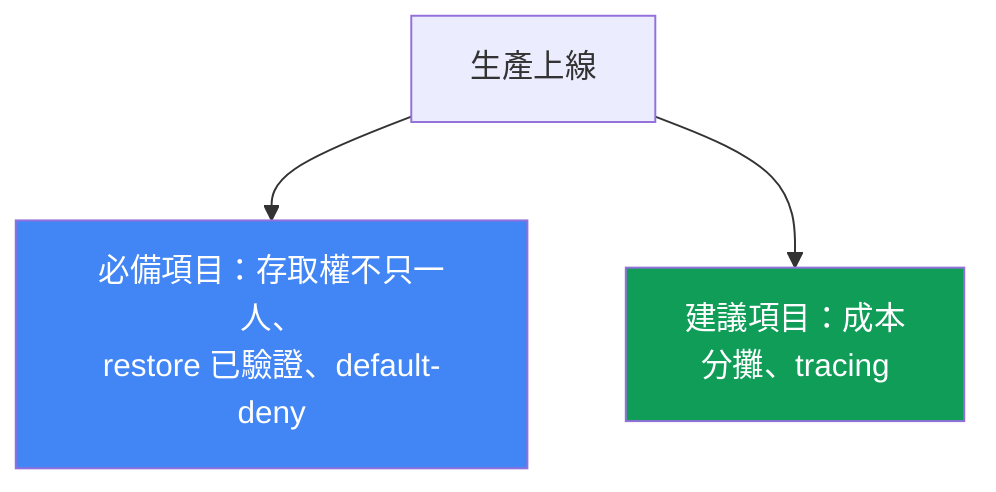

[Русская версия](ru.md) · [Eng version](en.md) · [Versión en español](es.md) · [Version française](fr.md) · [Deutsche Version](de.md) · [ქართული ვერსია](ge.md) · [日本語版](jp.md)
# 第 48 章。EKS 生產環境檢查清單與後續閱讀方向

> **接下來。** 這是課程的終章。經過 47 章，叢集已從各個面向建構完成：control plane 與版本、節點與擴縮、身分與安全、儲存、網路、可觀測性、營運與疑難排解。本章會把這些內容彙整為一份依領域分類的生產環境就緒檢查清單，並為每一項標示對應章節。這裡沒有新機制：本章建立在完整的第 1 至第 8 部分之上，是叢集進入生產環境前的地圖。最後會說明後續可往哪裡深入，避免止步於本課程。

## 48.1. 問題：「看起來準備好了」並不等於準備好了

叢集已啟動，應用程式正在部署，儀表板一片綠色。生產上線期限就在這週，當被問到「我們準備好了嗎？」時，團隊回答「大概吧，好像都做完了」。問題正是這個「大概」：如果沒有按領域系統性檢查，缺口在第一次事故發生前不會浮現，而到時候冒出的正是那些「好像做過了」的事。

以下是典型的「看似就緒」項目，其中的空缺並不顯眼：

```text
- 叢集透過 Terraform 建立，節點使用 Karpenter        # 但版本仍在 standard support 內嗎？
- 主應用程式已設定 IRSA                                # 但叢集存取權不只一人擁有嗎？
- 負載平衡器正在傳送流量，TLS 正常運作                 # 但有 NetworkPolicy default-deny 嗎？
- metrics 與 logs 正在匯入 CloudWatch                  # 但 retention 與 alerts 已設定嗎？
- AWS Backup 已依排程啟用                               # 但曾經驗證 restore 嗎？
- 關鍵服務已設定 PDB                                    # 但它們不會阻塞節點升級嗎？
```

左側每一列看似都已完成。右側每個註解都是一個會在最糟時刻發生的獨立事故：未測試 backup，restore 無法啟動；缺少 NetworkPolicy，受入侵的 Pod 能在整個叢集內移動；`maxUnavailable: 0` 的 PDB 徹底阻塞升級時的 drain；叢集存取權只有已離職的工程師擁有。

記憶是很差的檢查清單。在長達半年的專案後，沒有人會記得 control plane audit 是否啟用，或 DR 是否驗證過。需要一份涵蓋所有領域的系統化清單，其中每一項要麼附上章節連結表示已完成，要麼誠實標註為缺口。本章其餘內容就是這份清單。



## 48.2. 叢集與 control plane（第 1 部分）

這是基礎。若版本已不受支援，或子網路只設在一個 AZ，其他一切都沒有意義。

| 檢查項目 | 章節 |
|---|---|
| Kubernetes 版本仍在 standard support 期間內，且已有升級計畫 | 第 38 章 |
| 已考量 endpoint access：符合需求的 public/private 與 source ranges | 第 2 章 |
| 叢集子網路分布於三個 AZ，IP 計畫足以因應 Pod 成長 | 第 6、7 章 |
| 叢集透過程式碼（Terraform/eksctl）建立，而非在主控台點選 | 第 4 章 |
| 資源已標示 tags：團隊、環境、cost allocation | 第 4、43 章 |

關鍵是：叢集必須可從 IaC 重現，並執行受支援的版本。沒有程式碼的手動叢集無法在 DR 時重新建立，也無法在 pull request 中審查。

## 48.3. 運算（第 2 部分）

節點是工程師完全負責的區域。可用性與成本都在此決定。

| 檢查項目 | 章節 |
|---|---|
| 節點策略已明確選定：Auto Mode、Karpenter 或 managed node groups | 第 9、12 章 |
| 為具容錯能力的工作負載使用 Spot 混合配置，並分散 instance 類型 | 第 13 章 |
| requests 依實際情況設定（right-sizing），而非憑感覺 | 第 14 章 |
| 已設定 Karpenter disruption/consolidation，且沒有忽略 drift | 第 12 章 |
| 每節點 Pod 密度已與 ENI 與 IP limits 協調 | 第 14 章 |

關鍵是：節點策略是對成本與韌性後果有明確認知的選擇，而不是「保留預設值」。未分散配置的 Spot 不是節省成本，而是風險。

## 48.4. 身分與安全（第 3 部分）

這是範圍最廣、也最常出現隱性缺口的領域。逐項檢查。

| 檢查項目 | 章節 |
|---|---|
| Pod 透過 IRSA 或 Pod Identity 存取 AWS，而非使用靜態金鑰 | 第 16、17 章 |
| 叢集存取權不只屬於 cluster creator；已建立 access entries | 第 5、47 章 |
| 透過 Secrets Manager/SSM（External Secrets/CSI）管理 secrets，而非放在 manifests 中 | 第 18 章 |
| 節點與 Pod 已 harden：IMDSv2、hop limit、Pod Security Admission | 第 19 章 |
| 映像已在 ECR 掃描，基底映像來自受信任來源 | 第 20 章 |
| 已啟用 control plane audit：logs 中有 api、audit、authenticator | 第 21 章 |
| Kyverno/Gatekeeper policies 能阻擋 manifests 中的危險模式 | 第 22 章 |

關鍵是：Pod 中不能有任何長期 AWS key，叢集也不能只有一人能存取。audit 必須在事故前啟用，事後已不會有 logs 可看。

## 48.5. 儲存（第 4 部分）

這是小而棘手的領域：EBS 預設值與未測試的磁碟區 backup 會突然造成問題。

| 檢查項目 | 章節 |
|---|---|
| 預設 StorageClass 使用 gp3，而非已過時的 gp2 | 第 23 章 |
| 使用 `volumeBindingMode: WaitForFirstConsumer`，避免磁碟區建立在錯誤 AZ | 第 23 章 |
| persistent volumes 已納入 backup，snapshots 已驗證 | 第 23、41 章 |
| 已審慎決定跨 AZ shared storage：需要 ReadWriteMany 時使用 EFS/FSx | 第 24 章 |

關鍵是：`WaitForFirstConsumer` 能避免經典陷阱，也就是 Pod 在一個 AZ，但其 EBS volume 在另一個 AZ，因而永遠維持 `Pending`。

## 48.6. 網路與流量（第 5 部分）

此處的錯誤會從外部可見：服務無法存取、egress 過於開放、流量穿越所有 AZ。

| 檢查項目 | 章節 |
|---|---|
| 透過 AWS Load Balancer Controller 使用負載平衡器：NLB 與 ALB Ingress | 第 26、27 章 |
| TLS certificates 透過 ACM，HTTPS 在負載平衡器終止 | 第 27 章 |
| NetworkPolicy 使用 default-deny，Pod 間流量已明確允許 | 第 30 章 |
| DNS records 由 external-dns 管理，而非手動在 Route 53 設定 | 第 29 章 |
| 對 AWS services 使用 VPC endpoints，各 AZ 使用 NAT，egress traffic 受控 | 第 31 章 |

關鍵是：default-deny NetworkPolicy 是叢集內部的安全邊界。缺少它時，任何受入侵的 Pod 都能看到所有鄰居。VPC endpoints 同時也能降低 egress 成本。

## 48.7. 可觀測性（第 6 部分）

沒有這個領域，事故只能盲目除錯。要確認資料不只持續流入，也保存了足夠時間並產生 alerts。

| 檢查項目 | 章節 |
|---|---|
| metrics-server 正常運作，已有 metrics backend（Prometheus/Container Insights） | 第 33 章 |
| 日誌從節點與 Pod 匯出，保留期已審慎設定 | 第 34 章 |
| 已針對關鍵症狀設定警示，而非只有儀表板 | 第 33、34 章 |
| 對需要追蹤呼叫鏈的 microservices 使用 tracing（ADOT/X-Ray） | 第 36 章 |

關鍵是：沒有人看的 dashboard 不能取代 alert。沒有計畫的 retention，意味著事故分析時遺失 logs，或收到意外的 storage 帳單。

## 48.8. 營運（第 7 部分）

這個領域區分了「叢集今天能運作」與「叢集能撐過升級與故障」。

| 檢查項目 | 章節 |
|---|---|
| 有叢集與 addons 的更新計畫，已清除 deprecated APIs | 第 37、38 章 |
| 已了解 rollback readiness：知道 rollback window 與順序 | 第 39 章 |
| PDB 與 topology spread 在 drain 與升級期間保護可用性 | 第 40 章 |
| PDB 不會徹底阻塞 drain（`maxUnavailable: 0` 是 red flag） | 第 40 章 |
| AWS Backup 已設定：涵蓋叢集狀態與 persistent volumes | 第 41 章 |
| DR restore 確實已在 game day 測試，而非僅完成設定 | 第 42 章 |
| 可依團隊與 namespace 看見成本（OpenCost/Kubecost） | 第 43 章 |
| GitOps 是 manifests 的 source of truth（Argo CD/Flux） | 第 44 章 |

關鍵是：設定好卻從未驗證的 restore 不是 backup，而是希望。game day 將 DR 從「應該可行」變成「曾在某日成功運作」。

## 48.9. 事故就緒度（第 8 部分）

最後一個領域：當一切故障時，重要的不是架構，而是定位速度。

| 檢查項目 | 章節 |
|---|---|
| 已有節點未加入時的 runbook | 第 45 章 |
| 已有網路故障的 runbook：ENI、SG/NACL、DNS、unhealthy targets | 第 46 章 |
| 已有存取問題的 runbook：401 與 403、IRSA/Pod Identity、kubeconfig | 第 47 章 |
| 節點的 SSM access 可用（不使用裸露 SSH），可登入 node | 第 45 章 |
| 已啟用 control plane logging，authenticator 與 API logs 可用 | 第 21、34 章 |

關鍵是：runbook 與經由 SSM 的存取必須在事故前就存在。等 node 已經故障時才設定存取，為時已晚。

## 48.10. 全貌與優先順序

以上八個領域構成就緒度的軸線。沒有任何一個可以跳過，但對首次生產上線而言，並非全部都同樣緊急。有些項目是「必備項目」，缺少它們就不應啟用正式流量；有些是「建議項目」，可在生產中持續完善，而不阻塞啟動。



| 優先順序 | 項目 | 原因 |
|---|---|---|
| 生產前必備項目 | 受支援版本、存取權不只一人、已啟用 control plane audit 與 logs、default-deny NetworkPolicy、secrets 不在 manifests 中、restore 已驗證、PDB 不阻塞升級 | 否則第一次事故或入侵的代價，會高於延後啟動 |
| 前幾週的重要項目 | right-sizing requests、Spot 混合配置、log retention、alerts、升級計畫、VPC endpoints | 影響韌性與成本，但不阻塞啟動 |
| 建議項目 | microservices tracing、細緻的成本分攤、成熟的多叢集 GitOps | 提升成熟度，可在生產中迭代完善 |

此表的實務意義是：若期限緊迫，先完成整個「必備項目」欄位，其餘則規劃為有明確負責人的工作項目，而不是留待「以後某一天」。

## 48.11. 導入情境：從何開始

課程內容很多，「從何開始」取決於情境。從零開始的 startup 與從自有 data center 遷移的公司，起點不同。沒有單一正確順序，但共同原則只有一個：任何起步都應以程式碼與隔離進行，使決策保持可逆。以下有兩個詳細情境與共同結論。不應過早承擔昂貴需求，但也不應封死通往它們的路。

### 情境 1。從零開始的 startup：快速且低成本的 MVP，之後不必重做

產品尚未推出，需要以最快、最低成本做出 MVP。現在似乎不需要 PCI DSS audit，但架構必須容許日後加入它，不必重做，也不會帶來今天不必要的支出。

- **快速起步。** 對 non-prod workloads 使用 EKS Auto Mode 或搭配 Karpenter 的 managed node groups，以及 Spot（第 9、12、13 章）。從第一天起透過 terraform-aws-eks 將叢集作為程式碼建立（第 4 章），避免日後重做主控台點選建立的資源。
- **目前低成本。** 最小化 NAT 與 inter-AZ traffic（第 31 章），以 namespace 隔離的一個 cluster 取代整個 cluster fleet（第 32 章），使用 managed addons 而非自行維護（第 37 章）。
- **避免日後重做。** 立即使用 private endpoint 與 IRSA/Pod Identity，而非 keys（第 16、17、19 章）；至少啟用基礎 control plane audit log 與 cost tags（第 21、43 章），並使用 gp3 與 `WaitForFirstConsumer` 的 StorageClass（第 23 章）。
- **為 PCI DSS 奠定基礎而不增加當前成本。** 結構性地啟用低成本措施：audit logs、以 KMS 加密 secrets、相容於 NetworkPolicy 的 CNI、Pod Security Admission。昂貴的措施，例如 dedicated accounts、GuardDuty runtime、完整 segmentation 可以延後，但不封死實現它們的途徑（第 18、19、21、22、30 章）。關鍵是：透過 namespaces 與 accounts 的隔離，加上 IaC，能讓系統日後成長到可接受 audit。

### 情境 2。自有 data center -> EKS：無縫遷移

公司在 data center 中有自有 servers（包括自建 Kubernetes），正遷移至 EKS 與 AWS。需要無停機遷移與 rollback plan。

- **on-prem 與 VPC 的連通性。** 使用 Site-to-Site VPN 或 Direct Connect，協調 CIDR 以避免 ranges 重疊（第 6、31、32 章）；過渡期間採用 hybrid architecture。
- **逐步遷移。** 逐服務搬遷 workloads；透過 DNS 與 traffic weights 切換（第 29 章）；資料透過 replicas 與 backups 遷移，而非一次完成。
- **哪些項目會讓「只遷移 manifests」失敗。** StorageClass 與 volumes（EBS 綁定 AZ，第 23 章；shared 使用 EFS，第 24 章）、LoadBalancer 與 Ingress 變成 NLB 與 ALB（第 26、27 章）、NetworkPolicy 相依於 CNI（第 30 章）、存取透過 IAM 與 RBAC access entries（第 5 章）、identity 使用 IRSA/Pod Identity 而非 static keys（第 16、17 章）。
- **Pod 密度。** 在 overlay-CNI 的 kubeadm 中，nodes 可容納數百個小型 Pods；VPC CNI 會給每個 Pod 一個真實 VPC IP，並受限於 ENI limit（每節點數十個 Pods）。需透過 prefix delegation 與重新計算 `max-pods` 處理，否則 Pods 會停留在 `Pending`（第 7、14 章）。
- **驗證 parity。** 先建立 non-prod cluster：執行 workload 與 observability 測試（第 33、34 章），再進入 prod。保有可隨時啟用的 rollback plan（第 42 章）。

兩種起步方式可概括如下：

| 情境 | 從何開始 | 延後什麼 |
|---|---|---|
| 從零開始的 startup | IaC、private endpoint、IRSA、gp3、基礎 audit 與 tags | GuardDuty runtime、多帳號、完整 segmentation |
| Data center -> EKS | 連通性與 CIDR、non-prod parity、rollback plan | 成本最佳化與成熟的多叢集 |

共同原則是：任何起步都以程式碼與隔離（namespace 或 account）進行，使決策可逆。不應過早帶入昂貴需求，但也不應建構排除這些需求的架構。如此一來，從 MVP 走向 audit，或從 hybrid 走向完整 EKS，都是完善，而非重寫。

## 48.12. 後續閱讀方向

課程是一張地圖，不是上限。接下來應閱讀原始資料，並隨時放在手邊。

- **EKS Best Practices Guide** - AWS 對安全、網路、可靠性、自動擴縮與成本的官方建議集合。它是本課程後最直接的指引：恰好深入上方檢查清單中的領域。
- **AWS Well-Architected Framework** - 六大支柱（營運卓越、安全、可靠性、效能、成本、永續性）是評估任何 AWS 系統而不只 EKS 的通用框架。適合用於完整架構審查。
- **Kubernetes 文件** - Kubernetes 本身的第一手資料：API、控制器、排程器。非 EKS 特定的內容都在這裡。
- **EKS release calendar 與 version lifecycle** - 版本發布與結束支援的官方時程。升級計畫依此建立（第 38 章）；應持續追蹤，而非在支援結束前一個月才想起。
- **CNCF projects 與 community** - Karpenter、Cilium、Argo、Prometheus、OpenTelemetry 與課程中的其他工具都在 CNCF 生態系發展；它們的 release notes 與討論能顯示生態系的方向。活躍的 community channels（Kubernetes Slack、project GitHub discussions）可迅速確認是否已有其他人遇到相同問題。

規則很簡單：本章的 checklist 說明要檢查什麼，列出的資源則說明到哪裡取得細節，以及在 versions 與 best practices 改變時如何持續更新。

### 課程邊界：刻意不涵蓋的內容

本課程聚焦一個主題：EKS 營運。所有偏離此主題的內容都刻意交由其他來源處理。這不是缺漏，而是對邊界的選擇。以下說明哪些內容不在範圍內，以及應前往何處取得細節。

| 主題 | 為何不在範圍內 | 前往何處 |
|---|---|---|
| HashiCorp Vault 的進階內容：PKI 與 transit engine、叢集安裝、HCL policies、Vault namespaces | 這是有自身營運模型的獨立產品，而非 EKS 的一部分；課程已介紹 Vault 作為 secrets storage layer（第 18 章） | Vault 文件 |
| 特定廠商的 CI pipelines：GitHub Actions、GitLab CI 等現成描述 | 課程將 GitOps 說明為模型，而非特定 CI 的 syntax（第 44 章） | 您的 CI 系統文件 |
| 實務上的 multi-account 與 multi-cluster | 作為 architecture 已說明（第 32 章），但沒有可重現實作：至少需要兩個 AWS accounts | AWS Organizations 與 EKS 文件 |
| 實務上的 GuardDuty audit 與 detection | 已說明機制（第 21 章），但沒有實作：這是付費服務，且不會立即觸發 | Amazon GuardDuty 文件 |
| 應用程式開發與 service code，包括 data schemas | 課程討論 platform，而非如何編寫 application | 專門的 development resources |
| 叢集以外的 AWS application services：RDS、queues、caches | 僅作為 consumers 與 cost source 提及，沒有各自的營運內容 | 對應 AWS services documentation |
| 深入 progressive delivery：Argo Rollouts、Flagger | 已提到並與 cluster blue/green 區分（第 44 章），但沒有專章 | Argo Rollouts 與 Flagger documentation |
| Windows nodes | 僅在會改變機制之處提及：Pod Identity 限制、access entry types | EKS Windows nodes documentation |
| EKS 對 Argo CD 的 managed capability 實作 | 已在文本說明（第 44 章），不提供 lab：authentication 僅能透過 AWS Identity Center，而它需要 AWS Organizations，這是個人 account 的門檻 | EKS 與 AWS Identity Center documentation |

這份邊界清單不是未完成項目的清單。上方每一列都是關於 EKS 營運在哪裡結束、另一個專業領域在哪裡開始的決定。如果您現在就需要某個主題，課程提供的上下文足以讓您不必從零開始閱讀專門文件，而能理解它如何整合其中。

## 48.13. 如何在生產環境中使用它

- **將 checklist 作為 repository 中的活文件維護。** 不放在腦中或 chat，而是放在 IaC 旁，使其能在 pull request 中被看見並追蹤變更歷史。
- **為各領域指定 ownership。** 每個領域（network、security、cost）都有 owner，負責確保項目已完成且沒有退化。
- **每次生產上線前都通過 checklist。** 新 cluster 或新的大型 service，在「必備項目」欄位完整且明確完成前，不應進入正式環境。
- **定期檢視，而非只做一次。** 每季一次，並在重大變更後重新檢視：versions 會老化、workloads 會成長，昨天的「完成」今天可能已是缺口。
- **誠實標記缺口。** 未完成項目應標示為有任務與期限的已知風險，而不是為讓 checklist 看起來一片綠色而悄悄略過。
- **連結到 game days 與 upgrades。** 在演練中驗證 DR restore 與 upgrade plan，並將結果以已驗證或失敗項目回填至 checklist。

## 48.14. 小型詞彙表

- **生產環境檢查清單** - 依領域系統化檢查就緒度的清單，其中每項都以章節連結標示完成，或標為已知風險。
- **就緒度領域** - 一條可獨立檢查的營運軸線（control plane、nodes、security、network、storage、observability、operations、incidents）。
- **必備項目** - 缺少時生產上線有危險、且應被阻擋的項目。
- **建議項目** - 可提升成熟度、允許在生產環境中繼續完善的項目。
- **standard support** - EKS version 的支援期間，應維持在此期間內（第 38 章）。
- **rollback readiness** - version rollback 的準備度：已知 window 與順序（第 39 章）。
- **game day** - 實際驗證 DR 與 incident scenarios 的演練（第 42 章）。
- **ownership** - 對某領域或 checklist item 的既定責任。

## 48.15. 本章與本課程總結

- 沒有系統性檢查的「看起來準備好了」不是真正的就緒：缺口會一直不可見，直到第一次事故揭露它。以依領域的 checklist 取代記憶。
- 生產環境就緒度可分為九個領域，對應課程各部分：control plane、nodes、security、storage、network、observability、operations、incidents。
- control plane 由 AWS 維護，但 version、access、IaC 與 tags 仍是工程師的責任（第 1 部分）。
- nodes、Spot 混合配置、right-sizing 與 disruption 是對成本與韌性的有意識選擇，而非預設值（第 2 部分）。
- Pod 中沒有長期 key、存取權不只一人、audit 預先啟用、網路採用 default-deny，是安全的基礎（第 3 與第 5 部分）。
- 已設定但未驗證的 restore 是希望而非 backup；以 game day 驗證 DR，升級則應有 plan 與 rollback readiness（第 7 部分）。
- runbooks 與 SSM access 必須在事故前就存在；發生故障時，重要的是定位速度而不是架構（第 8 部分）。
- 優先排序決定時程：先完成完整的「必備項目」，其餘規劃為工作項目。後續閱讀 EKS Best Practices Guide、Well-Architected、Kubernetes docs 與 version calendar。

## 48.16. 這對實際工作有何幫助

叢集進入生產環境的時刻，幾乎總伴隨時程壓力，以及想說「看起來準備好了，出發吧」的誘惑。有依領域 checklist 的工程師會以不同方式回應：走過九條軸線，完成「必備項目」欄位，並將剩餘缺口明確列為有負責人的工作項目。這不是官僚作風，而是保險：每個 checklist item 都代表一個因為提前預見而不會發生的 incident。團隊間的差異不會在上線日顯現，而會在第一次嚴重故障時顯現：一方發現未測試的 restore 與只有離職人員擁有的 access，另一方則能在數分鐘內依 runbook 定位 incident。

規劃時，checklist 是成熟度地圖。它指出叢集在哪些部分強健、哪些部分仍靠「以後再完成」，將模糊的「應該改善」轉為按領域分配 owner 與期限的具體任務。每季檢視一次後，它能避免隨著 versions 老化、workloads 成長而使就緒度退化。章節連結讓它能自給自足：回到課程適當章節，任何項目都能展開至 commands 與細節。課程結束了，但營運不會結束，這份 checklist 仍是日常工作的工具。

## 48.17. 自我檢查問題

1. 為什麼沒有系統性檢查的「看起來準備好了」很危險？什麼能取代對已完成事項的記憶？
2. 生產環境就緒度分為哪九個領域？它們如何連結到課程各部分？
3. 儘管是 managed 的，control plane 領域中哪些事項仍由工程師負責（第 1 部分）？
4. 節點 checklist 包含哪些項目，為何它們是有意識的選擇（第 2 部分）？
5. 列出進入生產環境前必須檢查的 security 項目（第 3 部分）。
6. 為何 `volumeBindingMode: WaitForFirstConsumer` 會列入 storage checklist（第 23 章）？
7. 為何 network domain 包含 default-deny NetworkPolicy？它保護什麼（第 30 章）？
8. 「已設定 backup」與「已測試 restore」有何差異？game day 與此有什麼關係？
9. 為何 `maxUnavailable: 0` 的 PDB 是 node upgrade 時的 red flag（第 40 章）？
10. incident readiness domain 中哪些內容必須在 incident 前就存在，而非事後？
11. 如何區分「生產前必備項目」與「建議項目」？為什麼要這樣排序？
12. 在 production 中如何維護與檢視 checklist：它放在哪裡、誰擁有、頻率為何？
13. 後續應閱讀哪些 resources？EKS version calendar 的作用是什麼（第 38 章）？

## 實作

本章沒有獨立 lab：它將整個課程彙整為 checklist。最佳實作是將它套用到自己的 cluster，使用各對應章節的 commands 完成項目，並誠實標註發現的缺口。

先從基礎開始：version 與 access mode（第 38、2 章）：

```bash
# 叢集版本與支援狀態
aws eks describe-cluster --name <cluster> --query 'cluster.{version:version,status:status}'
# endpoint access mode 與 accessConfig
aws eks describe-cluster --name <cluster> \
  --query 'cluster.{endpoint:resourcesVpcConfig,access:accessConfig}'
```

檢查 access security 與是否已啟用 audit（第 47、21 章）：

```bash
# 對應到叢集存取權的 principal，確認不只一個
aws eks list-access-entries --cluster-name <cluster>
# 已啟用哪些 control plane log types
aws eks describe-cluster --name <cluster> --query 'cluster.logging'
```

查看 network 與 storage：default-deny 與 StorageClass（第 30、23 章）：

```bash
# 是否至少有一個 NetworkPolicy（空白代表肯定沒有 default-deny）
kubectl get networkpolicy -A
# 預設 StorageClass 與 volume binding mode
kubectl get storageclass
```

接著檢查營運：backup 與 availability protection（第 41、40 章）：

```bash
# account 中的 AWS Backup plans
aws backup list-backup-plans --query 'BackupPlansList[].BackupPlanName'
# 叢集中的 PDB，確認沒有 maxUnavailable: 0
kubectl get pdb -A
```

逐一檢視第 48.2 至 48.9 節的領域後，得到的不再是抽象的「看起來準備好了」，而是一張具體地圖：哪些已完成並附有章節連結，哪些仍是缺口。將缺口列為有 owners 與 deadlines 的工作項目，先從第 48.10 節的「必備項目」欄位開始，這就是從希望轉為就緒。

---
[目錄](../README_TW.md) · [第 47 章](../47/tw.md)
