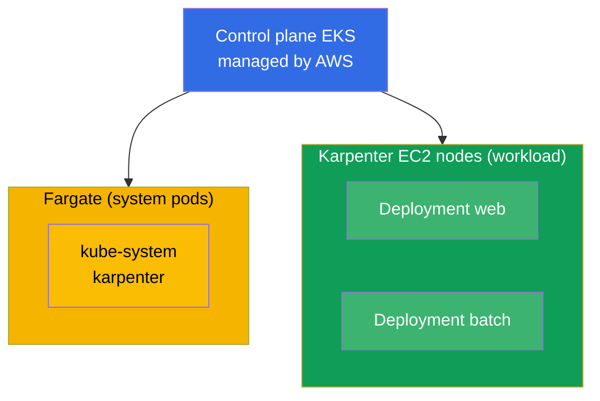
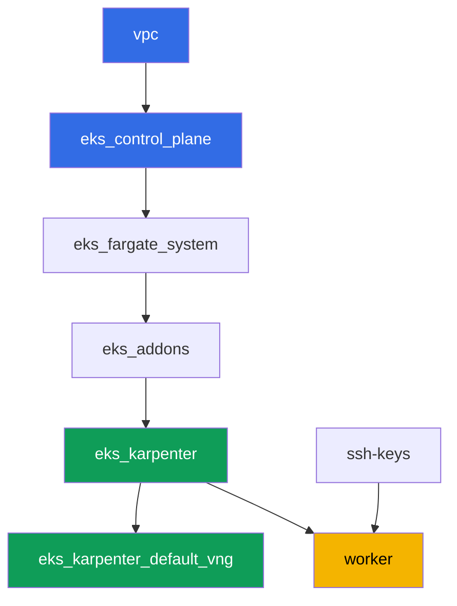

[Русская версия](README_RU.MD) · [Versión en español](README_ES.MD) · [Version française](README_FR.MD) · [Deutsche Version](README_DE.MD) · [ქართული ვერსია](README_GE.MD) · [繁體中文版](README_TW.MD) · [日本語版](README_JP.MD)

# Lab 101 - Cluster as code: VPC, control plane, nodes and kubeconfig

## Description

The first lab of the EKS course and the foundation for all the following ones. Here you get
a cluster built as code via Terragrunt, and learn to read it: where the boundary lies
between what AWS manages (the control plane) and what stays on you (network, nodes,
access). You deploy a workload on managed compute, see the split between system pods on
Fargate and worker nodes on Karpenter, verify that VPC CNI hands pods addresses from your
VPC, and confirm that worker nodes come up on AL2023.

Tasks are written in a production style: a short statement plus acceptance criteria.
Checking is automatic, via the `check_result` command.

## Goal

Reinforce the material from these course chapters:

- [Chapter 4. Creating a cluster: eksctl, Terraform and Terragrunt](../../course/04/ru.md) - cluster as code and kubeconfig
- [Chapter 6. Cluster networking: VPC CNI, ENI and IP addresses](../../course/06/ru.md) - where pods get their addresses from
- [Chapter 9. Compute types: managed node groups, Fargate, Auto Mode](../../course/09/ru.md) - what runs where
- [Chapter 10. AMI and bootstrap: AL2023, launch templates, kubelet](../../course/10/ru.md) - which image nodes run on

## What we're creating

In this lab the cluster is already deployed as code. You work with what it gives you and
build a small workload on top of it.

| Object | What it is | Why it's in this lab |
|--------|---------|-------------------|
| Namespace `eks-101` | a cluster section for the lab's workload | keeps resources separate without interfering with system ones (chapter 4) |
| Deployment `web` (3 replicas) | the ping_pong application | shows that worker pods land on Karpenter's EC2 nodes, not Fargate (chapter 9) |
| Artifact `nodes.txt` | a snapshot of cluster nodes | records the split between Fargate (system) and EC2 (workload) (chapter 9) |
| Artifact `podip.txt` | pod IP | confirms that VPC CNI issued an address from VPC `10.10.0.0/16` (chapter 6) |
| Artifact `ami.txt` | node OS image | verifies that the worker node runs Amazon Linux 2023 (chapter 10) |
| Deployment `batch` (6 replicas) | a workload with a CPU request | observes how Karpenter adds compute on demand (chapter 9) |
| Pod `fg-probe` + artifact `whyfargate.txt` | a pod that requests Fargate, plus an explanation | captures the symptom (Pending) and states the boundary of responsibility (chapters 4, 9) |

The resulting cluster picture:



## Infrastructure

The environment is deployed in AWS (`eu-central-1`) via Terragrunt. Each lab directory is
one component with its own `terragrunt.hcl`, which references a shared module in
`terraform/modules/` and declares dependencies through `dependency` blocks. Terragrunt
builds a dependency graph and applies the components in the right order.

### Modules and dependencies

| Directory (component) | Module (`terraform/modules/`) | Depends on | What it creates |
|---------------------|-------------------------------|------------|-------------|
| `vpc` | `vpc_v3` | - | VPC `10.10.0.0/16`, public and private subnets in two AZs, NAT |
| `ssh-keys` | `ssh-keys` | - | an SSH key pair for the worker machine and nodes |
| `eks_control_plane` | `eks_v2_control_plane` | `vpc` | EKS control plane `1.36`, OIDC, security groups |
| `eks_fargate_system` | `eks_v2_fargate` | `vpc`, `eks_control_plane` | Fargate profile for `kube-system` and `karpenter` |
| `eks_addons` | `eks_v2_addons` | `eks_control_plane`, `eks_fargate_system` | coredns, kube-proxy, vpc-cni, pod-identity add-ons |
| `eks_karpenter` | `eks_v2_karpenter` | `vpc`, `eks_control_plane`, `eks_addons`, `eks_fargate_system` | Karpenter controller, node IAM role |
| `eks_karpenter_default_vng` | `eks_v2_karpenter_vng` | `vpc`, `eks_control_plane`, `eks_karpenter` | default NodePool `default` and EC2NodeClass on AL2023 |
| `worker` | `eks_v2_work_pc` | `ssh-keys`, `vpc`, `eks_control_plane`, `eks_karpenter` | worker machine with kubectl, tests, and `check_result` |

Dependency graph (what gets applied earlier is lower down the arrow):



System pods run on Fargate, worker nodes are brought up by Karpenter. This is exactly the
compute split covered in chapter 9.

### Where things are configured

Settings are split across two levels: the shared `env.hcl` and each component's `inputs`.

`env.hcl` (shared environment parameters, read by all components):

| Parameter | Value in the lab | What it affects |
|----------|-----------------|---------------|
| `region` | `eu-central-1` | region for all resources |
| `vpc_default_cidr`, `subnets` | `10.10.0.0/16`, subnets per AZ | VPC address plan and subnet tags |
| `prefix` | `eks-task101` | prefix for resource names and tags |
| `stack_name` | `eks101` | used to build `env_name` - the cluster name |
| `k8_version` | `1.36.0` | kubectl version on the worker machine |
| `instance_type_worker` | `t3.medium` | worker machine instance type |
| `spot_additional_types` | a list of types | spot instance pool for nodes |
| `ssh_password_enable`, `access_cidrs` | `true`, `0.0.0.0/0` | SSH access to the worker machine |
| `root_volume` | `gp3`, `10` | worker machine root disk |

`inputs` in each component's `terragrunt.hcl` (settings specific to that module):

| File | Key settings |
|------|--------------------|
| `eks_control_plane/terragrunt.hcl` | `eks.version = "1.36"`, private subnets for nodes, public subnets for the endpoint |
| `eks_addons/terragrunt.hcl` | add-on versions for 1.36: kube-proxy `v1.36.0-eksbuild.14`, coredns `v1.14.3-eksbuild.3`, vpc-cni, eks-pod-identity-agent |
| `eks_fargate_system/terragrunt.hcl` | namespace selectors for Fargate (`kube-system`, `karpenter`) |
| `eks_karpenter/terragrunt.hcl` | Karpenter version `1.8.1`, controller resources |
| `eks_karpenter_default_vng/terragrunt.hcl` | NodePool `requirements` (arch, spot/on-demand, types), `limits`, `disruption` |
| `worker/terragrunt.hcl` | `test_url` and `task_script_url` for the lab 101 files, `exam_time_minutes` |

Rule: parameters shared across the whole lab (region, network, versions, prefixes) live in
`env.hcl`; module-specific parameters live in that module's `terragrunt.hcl` `inputs`. So,
for example, to change the cluster version you edit `eks.version` in
`eks_control_plane/terragrunt.hcl` and the add-on versions in `eks_addons/terragrunt.hcl`;
to change the network you edit `subnets` in `env.hcl`.

## Deployment

```bash
TASK=101 make run_eks_task
```

Deployment takes roughly 15-20 minutes. In the output, find the line with the SSH connection
to the worker machine and connect to it. kubectl there is already configured for the right
cluster.

Useful commands on the worker machine:

```bash
time_left       # how much environment time is left
check_result    # check the solution
```

> Environment security. `env.hcl` has `ssh_password_enable = true` and
> `access_cidrs = ["0.0.0.0/0"]` enabled - convenient for a training environment, but this
> is not something to do in production. Per the course standards (chapters 0.2, 2, 19),
> access to worker machines should go through AWS SSM Session Manager without exposing
> public SSH ports, and `access_cidrs` should be narrowed down to specific addresses. Here
> public SSH is left in place only to keep the setup simple.

## Tasks

---
|        **1**        | **Namespace for the lab's workload**                             |
| :-----------------: | :---------------------------------------------------------- |
| What to do          | Create a namespace named `eks-101`. All objects in this lab are created inside it. |
| Acceptance criteria    | - namespace `eks-101` exists. |
---
|        **2**        | **Deployment on managed compute**                   |
| :-----------------: | :---------------------------------------------------------- |
| What to do          | In the `eks-101` namespace, create Deployment `web`, image `viktoruj/ping_pong:latest`, `3` replicas. Wait until all replicas become Ready. The pods should land on Karpenter's EC2 nodes (node name `ip-...`), not on Fargate: the cluster's Fargate profile only covers `kube-system` and `karpenter`, and there's none for `eks-101`, so Karpenter picks up the workload. You'll write the reasoning down in task 7. |
| Acceptance criteria    | - Deployment `web` in `eks-101`, image `viktoruj/ping_pong`;<br/>- `3` ready replicas;<br/>- not a single `web` pod on a Fargate node. |
---
|        **3**        | **Node snapshot: system vs. workload**                       |
| :-----------------: | :---------------------------------------------------------- |
| What to do          | Save the cluster's node list to `/var/work/tests/artifacts/3/nodes.txt` so that it shows both Fargate nodes (`fargate-...`) and Karpenter EC2 nodes (`ip-...`).<br/>Format hint: `kubectl get nodes -o wide > /var/work/tests/artifacts/3/nodes.txt` (node names in the first column are enough for the check). |
| Acceptance criteria    | - the file is not empty;<br/>- it contains at least one `fargate-...` node and at least one `ip-...` node. |
---
|        **4**        | **Pod IP from the VPC address space**                   |
| :-----------------: | :---------------------------------------------------------- |
| What to do          | Take the IP of any `web` pod and save it to `/var/work/tests/artifacts/4/podip.txt`. Make sure the address is from VPC `10.10.0.0/16` (VPC CNI assigns pods addresses from the VPC's subnets).<br/>Format hint: `kubectl get po -n eks-101 -l app=web -o jsonpath='{.items[0].status.podIP}'` - the file should contain only the address, no extra columns.<br/>For understanding (not for the check): compare the address against the private subnet CIDRs via `aws ec2 describe-subnets --filters "Name=vpc-id,Values=<vpc-id>" --query 'Subnets[].[CidrBlock,AvailabilityZone]'`. |
| Acceptance criteria    | - the file is not empty;<br/>- the IP starts with `10.10.`. |
---
|        **5**        | **Worker node image (AL2023)**                             |
| :-----------------: | :---------------------------------------------------------- |
| What to do          | Determine the OS image of the worker (EC2) node running the `web` pods, and save it to `/var/work/tests/artifacts/5/ami.txt`.<br/>Format hint: get the node from `kubectl get po ... -o jsonpath='{.items[0].spec.nodeName}'` and its image via `kubectl get node <node> -o jsonpath='{.status.nodeInfo.osImage}'` - the file should contain a line like `Amazon Linux 2023`. |
| Acceptance criteria    | - the file is not empty;<br/>- it contains a line with `Amazon Linux` (AL2023). |
---
|        **6**        | **Scaling compute on demand**                            |
| :-----------------: | :---------------------------------------------------------- |
| What to do          | In the `eks-101` namespace, create Deployment `batch`, image `viktoruj/ping_pong:latest`, `6` replicas, with the container's `resources.requests.cpu` set (e.g. `500m`). Wait until Karpenter allocates compute and all `6` replicas become Ready.<br/>Note: Karpenter needs roughly 60-90 seconds to bring up a new EC2 node (instance request plus AL2023 bootstrap), so the pods will sit in `Pending` at first. Before running `check_result`, wait for readiness: `kubectl rollout status deployment/batch -n eks-101`. |
| Acceptance criteria    | - Deployment `batch` in `eks-101` with `requests.cpu` set;<br/>- `6` ready replicas. |
---
|        **7**        | **Boundary of responsibility: symptom and explanation**          |
| :-----------------: | :---------------------------------------------------------- |
| What to do          | Intentionally trigger the symptom. In `eks-101`, create Pod `fg-probe` (image `viktoruj/ping_pong:latest`) with `nodeSelector` `eks.amazonaws.com/compute-type: fargate`, i.e. explicitly request Fargate. The pod will remain `Pending` (there's no Fargate profile for `eks-101`, and Karpenter's EC2 nodes don't carry that label). Investigate the cause: `kubectl describe pod fg-probe -n eks-101` (the `Events` section) and namespace events `kubectl get events -n eks-101 --sort-by='.metadata.creationTimestamp'`. Save a short explanation to `/var/work/tests/artifacts/7/whyfargate.txt`: why the `web` and `batch` pods landed on Karpenter's EC2 nodes instead of Fargate, and why `fg-probe` got stuck. The text must contain the words `Fargate` and `profile`. |
| Acceptance criteria    | - Pod `fg-probe` in `eks-101` in `Pending` state;<br/>- the file `/var/work/tests/artifacts/7/whyfargate.txt` is not empty and mentions `Fargate` and `profile`. |
---

## Checking the result

On the worker machine, run the automatic check:

```bash
check_result
```

The script will run the tests and show the percentage of completed tasks.

## Solution

Reference solution: [worker/files/solutions/1.MD](worker/files/solutions/1.MD)

## Deleting the cluster and resources

> **First remove the workload and wait for the EC2 nodes to go, then tear down the stack.**
> This lab doesn't create any AWS resources by hand, everything else is Kubernetes objects
> (Deployment `web`, `batch` and Pod `fg-probe` in namespace `eks-101`), so there's only one
> danger here: if you delete the cluster while the workload is still running, Karpenter's
> EC2 node goes away with it, but the secondary ENI from VPC CNI stays in `available` state
> and holds onto the node security group. Then `destroy` hangs on
> `module.eks.aws_security_group.node[0]: Still destroying...` for tens of minutes.

```bash
# 1. Remove the lab's workload
kubectl delete namespace eks-101 --ignore-not-found

# 2. Wait for Karpenter to remove the NodeClaim and EC2 node (only fargate-* should remain)
while kubectl get nodeclaims --no-headers 2>/dev/null | grep -q .; do
  echo "NodeClaim still alive, waiting..."; sleep 15
done
kubectl get nodes | grep -v fargate
```

Only after that, tear down the stack:

```bash
TASK=101 make delete_eks_task
```

If `destroy` still gets stuck on the node security group, an orphaned ENI is left behind.
Find and delete it:

```bash
aws ec2 describe-network-interfaces --filters Name=status,Values=available \
  --query 'NetworkInterfaces[?Tags[?Key==`eks:eni:owner`]].[NetworkInterfaceId,Description]' \
  --output table
aws ec2 delete-network-interface --network-interface-id <eni-id>
```
