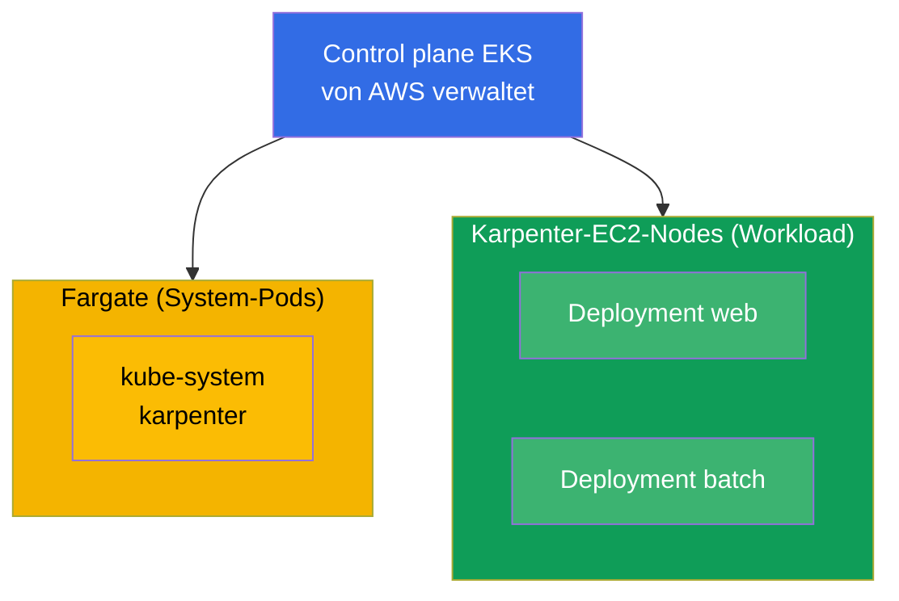
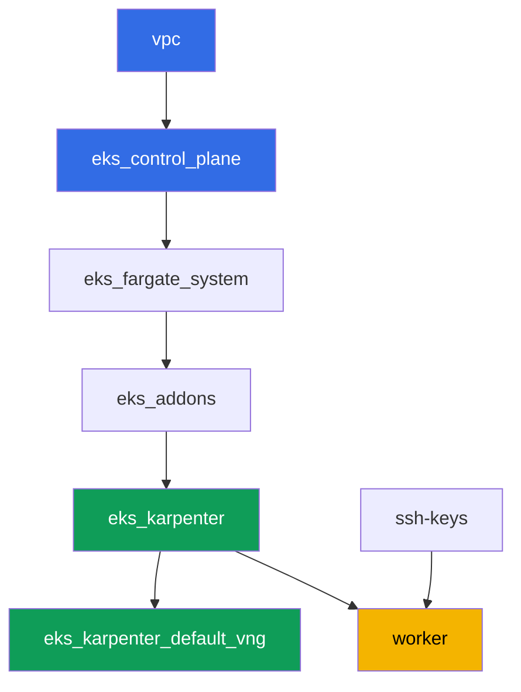

[Русская версия](README_RU.MD) · [Eng version](README.MD) · [Versión en español](README_ES.MD) · [Version française](README_FR.MD) · [ქართული ვერსია](README_GE.MD) · [繁體中文版](README_TW.MD) · [日本語版](README_JP.MD)

# Lab 101 - Cluster als Code: VPC, Control Plane, Nodes und kubeconfig

## Beschreibung

Das erste Lab des EKS-Kurses und die Grundlage für alle folgenden. Hier bekommen Sie einen
Cluster, der als Code über Terragrunt aufgebaut ist, und lernen, ihn zu lesen: wo die Grenze
zwischen dem liegt, was AWS verwaltet (die Control Plane), und dem, was bei Ihnen bleibt
(Netzwerk, Nodes, Zugriff). Sie deployen eine Workload auf verwaltetem Compute, sehen die
Trennung zwischen System-Pods auf Fargate und Worker-Nodes auf Karpenter, prüfen, dass VPC
CNI den Pods Adressen aus Ihrer VPC vergibt, und stellen sicher, dass Worker-Nodes auf
AL2023 hochfahren.

Die Aufgaben sind im Produktionsstil geschrieben: eine kurze Aufgabenstellung plus
Abnahmekriterien. Die Prüfung erfolgt automatisch über den Befehl `check_result`.

## Ziel

Den Stoff dieser Kurskapitel vertiefen:

- [Kapitel 4. Cluster erstellen: eksctl, Terraform und Terragrunt](../../course/04/ru.md) - Cluster als Code und kubeconfig
- [Kapitel 6. Cluster-Netzwerk: VPC CNI, ENI und IP-Adressen](../../course/06/ru.md) - woher Pods ihre Adressen bekommen
- [Kapitel 9. Compute-Typen: Managed Node Groups, Fargate, Auto Mode](../../course/09/ru.md) - was wo läuft
- [Kapitel 10. AMI und Bootstrap: AL2023, Launch Templates, kubelet](../../course/10/ru.md) - auf welchem Image die Nodes laufen

## Was wir erstellen

In diesem Lab ist der Cluster bereits als Code deployt. Sie arbeiten mit dem, was er
bietet, und bauen darauf eine kleine Workload auf.

| Objekt | Was es ist | Wofür in diesem Lab |
|--------|---------|-------------------|
| Namespace `eks-101` | ein Cluster-Bereich für die Lab-Workload | hält Ressourcen getrennt, ohne die System-Ressourcen zu stören (Kapitel 4) |
| Deployment `web` (3 Replicas) | die ping_pong-Anwendung | zeigt, dass Worker-Pods auf Karpenter-EC2-Nodes laufen, nicht auf Fargate (Kapitel 9) |
| Artefakt `nodes.txt` | ein Schnappschuss der Cluster-Nodes | dokumentiert die Trennung zwischen Fargate (System) und EC2 (Workload) (Kapitel 9) |
| Artefakt `podip.txt` | Pod-IP | bestätigt, dass VPC CNI eine Adresse aus der VPC `10.10.0.0/16` vergeben hat (Kapitel 6) |
| Artefakt `ami.txt` | OS-Image des Nodes | prüft, dass der Worker-Node auf Amazon Linux 2023 läuft (Kapitel 10) |
| Deployment `batch` (6 Replicas) | Workload mit CPU-Request | beobachtet, wie Karpenter bei Bedarf Compute hinzufügt (Kapitel 9) |
| Pod `fg-probe` + Artefakt `whyfargate.txt` | ein Pod, der Fargate anfordert, plus Erklärung | erfasst das Symptom (Pending) und formuliert die Verantwortungsgrenze (Kapitel 4, 9) |

Das resultierende Bild des Clusters:



## Infrastruktur

Die Umgebung wird in AWS (`eu-central-1`) über Terragrunt deployt. Jedes Lab-Verzeichnis ist
eine Komponente mit eigenem `terragrunt.hcl`, das auf ein gemeinsames Modul in
`terraform/modules/` verweist und seine Abhängigkeiten über `dependency`-Blöcke deklariert.
Terragrunt baut einen Abhängigkeitsgraphen und wendet die Komponenten in der richtigen
Reihenfolge an.

### Module und Abhängigkeiten

| Verzeichnis (Komponente) | Modul (`terraform/modules/`) | Abhängig von | Was es erstellt |
|---------------------|-------------------------------|------------|-------------|
| `vpc` | `vpc_v3` | - | VPC `10.10.0.0/16`, öffentliche und private Subnetze in zwei AZ, NAT |
| `ssh-keys` | `ssh-keys` | - | ein SSH-Schlüsselpaar für die Worker-Maschine und die Nodes |
| `eks_control_plane` | `eks_v2_control_plane` | `vpc` | EKS Control Plane `1.36`, OIDC, Security Groups |
| `eks_fargate_system` | `eks_v2_fargate` | `vpc`, `eks_control_plane` | Fargate-Profil für `kube-system` und `karpenter` |
| `eks_addons` | `eks_v2_addons` | `eks_control_plane`, `eks_fargate_system` | Add-ons coredns, kube-proxy, vpc-cni, pod-identity |
| `eks_karpenter` | `eks_v2_karpenter` | `vpc`, `eks_control_plane`, `eks_addons`, `eks_fargate_system` | Karpenter-Controller, IAM-Rolle der Nodes |
| `eks_karpenter_default_vng` | `eks_v2_karpenter_vng` | `vpc`, `eks_control_plane`, `eks_karpenter` | Standard-NodePool `default` und EC2NodeClass auf AL2023 |
| `worker` | `eks_v2_work_pc` | `ssh-keys`, `vpc`, `eks_control_plane`, `eks_karpenter` | Worker-Maschine mit kubectl, Tests und `check_result` |

Abhängigkeitsgraph (was früher angewendet wird, steht weiter unten am Pfeil):



System-Pods laufen auf Fargate, Worker-Nodes werden von Karpenter hochgefahren. Genau das
ist die Compute-Trennung, um die es in Kapitel 9 geht.

### Wo was konfiguriert wird

Die Einstellungen sind auf zwei Ebenen verteilt: das gemeinsame `env.hcl` und die `inputs`
jeder Komponente.

`env.hcl` (gemeinsame Umgebungsparameter, von allen Komponenten gelesen):

| Parameter | Wert im Lab | Was er beeinflusst |
|----------|-----------------|---------------|
| `region` | `eu-central-1` | Region aller Ressourcen |
| `vpc_default_cidr`, `subnets` | `10.10.0.0/16`, Subnetze pro AZ | Adressplan der VPC und Subnetz-Tags |
| `prefix` | `eks-task101` | Präfix für Ressourcennamen und Tags |
| `stack_name` | `eks101` | daraus wird `env_name` - der Clustername - gebildet |
| `k8_version` | `1.36.0` | kubectl-Version auf der Worker-Maschine |
| `instance_type_worker` | `t3.medium` | Instanztyp der Worker-Maschine |
| `spot_additional_types` | eine Liste von Typen | Spot-Instance-Pool für die Nodes |
| `ssh_password_enable`, `access_cidrs` | `true`, `0.0.0.0/0` | SSH-Zugriff auf die Worker-Maschine |
| `root_volume` | `gp3`, `10` | Root-Disk der Worker-Maschine |

`inputs` im `terragrunt.hcl` jeder Komponente (Parameter des jeweiligen Moduls):

| Datei | Wichtige Einstellungen |
|------|--------------------|
| `eks_control_plane/terragrunt.hcl` | `eks.version = "1.36"`, private Subnetze für Nodes, öffentliche Subnetze für den Endpoint |
| `eks_addons/terragrunt.hcl` | Add-on-Versionen für 1.36: kube-proxy `v1.36.0-eksbuild.14`, coredns `v1.14.3-eksbuild.3`, vpc-cni, eks-pod-identity-agent |
| `eks_fargate_system/terragrunt.hcl` | Namespace-Selektoren für Fargate (`kube-system`, `karpenter`) |
| `eks_karpenter/terragrunt.hcl` | Karpenter-Version `1.8.1`, Controller-Ressourcen |
| `eks_karpenter_default_vng/terragrunt.hcl` | `requirements` des NodePool (Architektur, Spot/On-Demand, Typen), `limits`, `disruption` |
| `worker/terragrunt.hcl` | `test_url` und `task_script_url` für die Lab-101-Dateien, `exam_time_minutes` |

Regel: Parameter, die für das gesamte Lab gelten (Region, Netzwerk, Versionen, Präfixe),
liegen in `env.hcl`; modulspezifische Parameter liegen in den `inputs` des jeweiligen
`terragrunt.hcl`. Um zum Beispiel die Cluster-Version zu ändern, passt man `eks.version` in
`eks_control_plane/terragrunt.hcl` und die Add-on-Versionen in `eks_addons/terragrunt.hcl`
an; um das Netzwerk zu ändern, passt man `subnets` in `env.hcl` an.

## Deployment

```bash
TASK=101 make run_eks_task
```

Das Deployment dauert etwa 15-20 Minuten. Suchen Sie in der Ausgabe die Zeile mit der
SSH-Verbindung zur Worker-Maschine und verbinden Sie sich damit. kubectl ist dort bereits
für den richtigen Cluster konfiguriert.

Nützliche Befehle auf der Worker-Maschine:

```bash
time_left       # verbleibende Zeit der Umgebung
check_result    # Lösung prüfen
```

> Sicherheit der Testumgebung. In `env.hcl` sind `ssh_password_enable = true` und
> `access_cidrs = ["0.0.0.0/0"]` aktiviert - praktisch für eine Lernumgebung, aber so sollte
> man es in Produktion nicht machen. Nach den Standards des Kurses (Kapitel 0.2, 2, 19) wird
> der Zugriff auf Worker-Maschinen über AWS SSM Session Manager geöffnet, ohne öffentliche
> SSH-Ports nach außen, und `access_cidrs` wird auf konkrete Adressen eingeschränkt. Hier
> bleibt öffentliches SSH nur der Einfachheit halber bestehen.

## Aufgaben

---
|        **1**        | **Namespace für die Lab-Workload**                             |
| :-----------------: | :---------------------------------------------------------- |
| Was wir tun          | Erstellen Sie einen Namespace mit dem Namen `eks-101`. Alle Objekte des Labs werden darin erstellt. |
| Abnahmekriterien    | - Namespace `eks-101` existiert. |
---
|        **2**        | **Deployment auf verwaltetem Compute**                   |
| :-----------------: | :---------------------------------------------------------- |
| Was wir tun          | Erstellen Sie im Namespace `eks-101` das Deployment `web`, Image `viktoruj/ping_pong:latest`, `3` Replicas. Warten Sie, bis alle Replicas Ready sind. Die Pods sollen auf Karpenter-EC2-Nodes landen (Node-Name `ip-...`), nicht auf Fargate: Das Fargate-Profil im Cluster deckt nur `kube-system` und `karpenter` ab, für `eks-101` gibt es keines, daher übernimmt Karpenter die Workload. Die Begründung halten Sie in Aufgabe 7 fest. |
| Abnahmekriterien    | - Deployment `web` in `eks-101`, Image `viktoruj/ping_pong`;<br/>- `3` bereite Replicas;<br/>- kein `web`-Pod auf einem Fargate-Node. |
---
|        **3**        | **Node-Schnappschuss: System versus Workload**                       |
| :-----------------: | :---------------------------------------------------------- |
| Was wir tun          | Speichern Sie die Node-Liste des Clusters in `/var/work/tests/artifacts/3/nodes.txt` so, dass darin sowohl Fargate-Nodes (`fargate-...`) als auch Karpenter-EC2-Nodes (`ip-...`) sichtbar sind.<br/>Format-Hinweis: `kubectl get nodes -o wide > /var/work/tests/artifacts/3/nodes.txt` (Node-Namen in der ersten Spalte reichen für die Prüfung). |
| Abnahmekriterien    | - die Datei ist nicht leer;<br/>- sie enthält mindestens einen Node `fargate-...` und mindestens einen `ip-...`. |
---
|        **4**        | **Pod-IP aus dem Adressraum der VPC**                   |
| :-----------------: | :---------------------------------------------------------- |
| Was wir tun          | Nehmen Sie die IP eines beliebigen `web`-Pods und speichern Sie sie in `/var/work/tests/artifacts/4/podip.txt`. Stellen Sie sicher, dass die Adresse aus der VPC `10.10.0.0/16` stammt (VPC CNI vergibt Pod-Adressen aus den Subnetzen der VPC).<br/>Format-Hinweis: `kubectl get po -n eks-101 -l app=web -o jsonpath='{.items[0].status.podIP}'` - in der Datei soll nur die Adresse stehen, ohne zusätzliche Spalten.<br/>Zum Verständnis (nicht Teil der Prüfung): vergleichen Sie die Adresse mit den CIDRs der privaten Subnetze über `aws ec2 describe-subnets --filters "Name=vpc-id,Values=<vpc-id>" --query 'Subnets[].[CidrBlock,AvailabilityZone]'`. |
| Abnahmekriterien    | - die Datei ist nicht leer;<br/>- die IP beginnt mit `10.10.`. |
---
|        **5**        | **Image des Worker-Nodes (AL2023)**                             |
| :-----------------: | :---------------------------------------------------------- |
| Was wir tun          | Ermitteln Sie das OS-Image des Worker-Nodes (EC2), auf dem die `web`-Pods laufen, und speichern Sie es in `/var/work/tests/artifacts/5/ami.txt`.<br/>Format-Hinweis: den Node aus `kubectl get po ... -o jsonpath='{.items[0].spec.nodeName}'` nehmen und sein Image über `kubectl get node <node> -o jsonpath='{.status.nodeInfo.osImage}'` ermitteln - in der Datei soll eine Zeile wie `Amazon Linux 2023` stehen. |
| Abnahmekriterien    | - die Datei ist nicht leer;<br/>- sie enthält eine Zeile mit `Amazon Linux` (AL2023). |
---
|        **6**        | **Compute-Skalierung nach Bedarf**                            |
| :-----------------: | :---------------------------------------------------------- |
| Was wir tun          | Erstellen Sie im Namespace `eks-101` das Deployment `batch`, Image `viktoruj/ping_pong:latest`, `6` Replicas, mit gesetztem `resources.requests.cpu` am Container (z. B. `500m`). Warten Sie, bis Karpenter Compute bereitstellt und alle `6` Replicas Ready werden.<br/>Hinweis: Karpenter braucht etwa 60-90 Sekunden, um einen neuen EC2-Node hochzufahren (Instanzanforderung plus AL2023-Bootstrap), daher hängen die Pods zunächst in `Pending`. Warten Sie vor `check_result` auf die Bereitschaft: `kubectl rollout status deployment/batch -n eks-101`. |
| Abnahmekriterien    | - Deployment `batch` in `eks-101` mit gesetztem `requests.cpu`;<br/>- `6` bereite Replicas. |
---
|        **7**        | **Verantwortungsgrenze: Symptom und Erklärung**          |
| :-----------------: | :---------------------------------------------------------- |
| Was wir tun          | Lösen Sie das Symptom absichtlich aus. Erstellen Sie in `eks-101` den Pod `fg-probe` (Image `viktoruj/ping_pong:latest`) mit `nodeSelector` `eks.amazonaws.com/compute-type: fargate`, also fordern Sie Fargate explizit an. Der Pod bleibt in `Pending` (für `eks-101` gibt es kein Fargate-Profil, und Karpenter-EC2-Nodes tragen dieses Label nicht). Untersuchen Sie die Ursache: `kubectl describe pod fg-probe -n eks-101` (Abschnitt `Events`) und die Namespace-Events `kubectl get events -n eks-101 --sort-by='.metadata.creationTimestamp'`. Speichern Sie in `/var/work/tests/artifacts/7/whyfargate.txt` eine kurze Erklärung: warum die Pods `web` und `batch` auf Karpenter-EC2-Nodes und nicht auf Fargate gelandet sind, und warum `fg-probe` hängen bleibt. Der Text muss die Wörter `Fargate` und `profile` (Fargate profile) enthalten. |
| Abnahmekriterien    | - Pod `fg-probe` in `eks-101` im Zustand `Pending`;<br/>- die Datei `/var/work/tests/artifacts/7/whyfargate.txt` ist nicht leer und erwähnt `Fargate` und `profile`. |
---

## Ergebnis prüfen

Führen Sie auf der Worker-Maschine die automatische Prüfung aus:

```bash
check_result
```

Das Skript führt die Tests aus und zeigt den Prozentsatz erledigter Aufgaben.

## Lösung

Referenzlösung: [worker/files/solutions/1_DE.MD](worker/files/solutions/1_DE.MD)

## Cluster und Ressourcen löschen

> **Entfernen Sie zuerst die Workload und warten Sie, bis die EC2-Nodes verschwunden sind,
> erst dann reißen Sie die Umgebung ab.** Dieses Lab erstellt keine AWS-Ressourcen von Hand,
> alles andere sind Kubernetes-Objekte (Deployment `web`, `batch` und Pod `fg-probe` im
> Namespace `eks-101`), daher gibt es nur eine Gefahr: Löscht man den Cluster, während die
> Workload noch läuft, verschwindet der Karpenter-EC2-Node mit ihm, aber das sekundäre ENI
> von VPC CNI bleibt im Zustand `available` und hält die Security Group der Nodes fest.
> Dann hängt `destroy` zehn Minuten oder länger bei
> `module.eks.aws_security_group.node[0]: Still destroying...`.

```bash
# 1. Lab-Workload entfernen
kubectl delete namespace eks-101 --ignore-not-found

# 2. Warten, bis Karpenter NodeClaim und EC2-Node entfernt (nur fargate-* sollten übrig bleiben)
while kubectl get nodeclaims --no-headers 2>/dev/null | grep -q .; do
  echo "NodeClaim ist noch da, warte..."; sleep 15
done
kubectl get nodes | grep -v fargate
```

Erst danach die Umgebung abreißen:

```bash
TASK=101 make delete_eks_task
```

Bleibt `destroy` trotzdem bei der Security Group der Nodes hängen, ist ein verwaistes ENI
übrig geblieben. Finden und löschen Sie es:

```bash
aws ec2 describe-network-interfaces --filters Name=status,Values=available \
  --query 'NetworkInterfaces[?Tags[?Key==`eks:eni:owner`]].[NetworkInterfaceId,Description]' \
  --output table
aws ec2 delete-network-interface --network-interface-id <eni-id>
```
