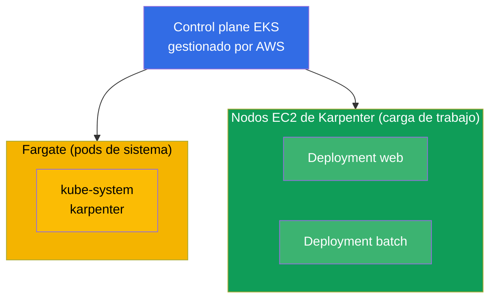
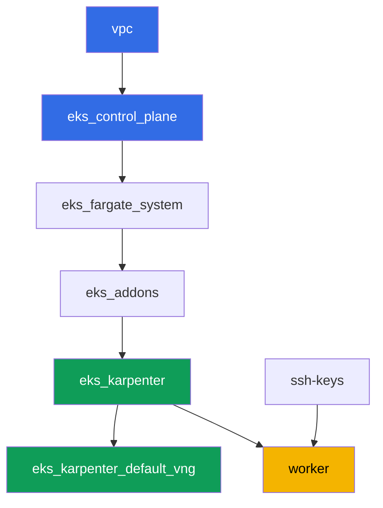

[Русская версия](README_RU.MD) · [Eng version](README.MD) · [Version française](README_FR.MD) · [Deutsche Version](README_DE.MD) · [ქართული ვერსია](README_GE.MD) · [繁體中文版](README_TW.MD) · [日本語版](README_JP.MD)

# Lab 101 - Cluster como código: VPC, control plane, nodos y kubeconfig

## Descripción

El primer laboratorio del curso de EKS y la base de todos los siguientes. Aquí obtienes un
clúster construido como código mediante Terragrunt, y aprendes a leerlo: dónde está la
frontera entre lo que gestiona AWS (el control plane) y lo que queda de tu lado (red, nodos,
acceso). Despliegas una carga de trabajo sobre cómputo gestionado, ves la separación entre
los pods de sistema en Fargate y los nodos de trabajo en Karpenter, verificas que VPC CNI
entrega a los pods direcciones de tu VPC, y confirmas que los nodos de trabajo arrancan
sobre AL2023.

Las tareas están escritas en estilo de producción: un enunciado breve más criterios de
aceptación. La verificación es automática, mediante el comando `check_result`.

## Objetivo

Reforzar el material de estos capítulos del curso:

- [Capítulo 4. Creación de un clúster: eksctl, Terraform y Terragrunt](../../course/04/ru.md) - clúster como código y kubeconfig
- [Capítulo 6. Red del clúster: VPC CNI, ENI y direcciones IP](../../course/06/ru.md) - de dónde vienen las direcciones de los pods
- [Capítulo 9. Tipos de cómputo: managed node groups, Fargate, Auto Mode](../../course/09/ru.md) - qué se ejecuta y dónde
- [Capítulo 10. AMI y bootstrap: AL2023, launch templates, kubelet](../../course/10/ru.md) - sobre qué imagen viven los nodos

## Qué vamos a crear

En este laboratorio el clúster ya está desplegado como código. Trabajas con lo que te
ofrece y creas encima una pequeña carga de trabajo.

| Objeto | Qué es | Para qué sirve en este laboratorio |
|--------|---------|-------------------|
| Namespace `eks-101` | una sección del clúster para la carga del laboratorio | mantiene los recursos separados sin interferir con los de sistema (capítulo 4) |
| Deployment `web` (3 réplicas) | la aplicación ping_pong | vemos que los pods de trabajo van a nodos EC2 de Karpenter, no a Fargate (capítulo 9) |
| Artefacto `nodes.txt` | una foto de los nodos del clúster | registra la separación entre Fargate (sistema) y EC2 (carga de trabajo) (capítulo 9) |
| Artefacto `podip.txt` | IP del pod | confirma que VPC CNI entregó una dirección de la VPC `10.10.0.0/16` (capítulo 6) |
| Artefacto `ami.txt` | imagen del sistema operativo del nodo | comprueba que el nodo de trabajo corre Amazon Linux 2023 (capítulo 10) |
| Deployment `batch` (6 réplicas) | carga de trabajo con petición de CPU | observamos cómo Karpenter añade cómputo según la demanda (capítulo 9) |
| Pod `fg-probe` + artefacto `whyfargate.txt` | un pod que pide Fargate, y su explicación | capturamos el síntoma (Pending) y formulamos la frontera de responsabilidad (capítulos 4, 9) |

Imagen final del clúster:



## Infraestructura

El entorno se despliega en AWS (`eu-central-1`) mediante Terragrunt. Cada carpeta del
laboratorio es un componente con su propio `terragrunt.hcl`, que hace referencia a un
módulo compartido en `terraform/modules/` y declara sus dependencias mediante bloques
`dependency`. Terragrunt construye un grafo de dependencias y aplica los componentes en el
orden correcto.

### Módulos y dependencias

| Carpeta (componente) | Módulo (`terraform/modules/`) | Depende de | Qué crea |
|---------------------|-------------------------------|------------|-------------|
| `vpc` | `vpc_v3` | - | VPC `10.10.0.0/16`, subredes públicas y privadas en dos AZ, NAT |
| `ssh-keys` | `ssh-keys` | - | un par de claves SSH para la máquina de trabajo y los nodos |
| `eks_control_plane` | `eks_v2_control_plane` | `vpc` | control plane de EKS `1.36`, OIDC, security groups |
| `eks_fargate_system` | `eks_v2_fargate` | `vpc`, `eks_control_plane` | perfil de Fargate para `kube-system` y `karpenter` |
| `eks_addons` | `eks_v2_addons` | `eks_control_plane`, `eks_fargate_system` | add-ons de coredns, kube-proxy, vpc-cni, pod-identity |
| `eks_karpenter` | `eks_v2_karpenter` | `vpc`, `eks_control_plane`, `eks_addons`, `eks_fargate_system` | controlador de Karpenter, rol IAM de los nodos |
| `eks_karpenter_default_vng` | `eks_v2_karpenter_vng` | `vpc`, `eks_control_plane`, `eks_karpenter` | NodePool por defecto `default` y EC2NodeClass sobre AL2023 |
| `worker` | `eks_v2_work_pc` | `ssh-keys`, `vpc`, `eks_control_plane`, `eks_karpenter` | máquina de trabajo con kubectl, tests y `check_result` |

Grafo de dependencias (lo que se aplica antes está más abajo en la flecha):



Los pods de sistema van a Fargate, los nodos de trabajo los levanta Karpenter. Esa es
exactamente la separación de cómputo de la que habla el capítulo 9.

### Dónde se configura cada cosa

Los ajustes están repartidos en dos niveles: el `env.hcl` compartido y los `inputs` de cada
componente.

`env.hcl` (parámetros comunes del entorno, leídos por todos los componentes):

| Parámetro | Valor en el laboratorio | Qué afecta |
|----------|-----------------|---------------|
| `region` | `eu-central-1` | región de todos los recursos |
| `vpc_default_cidr`, `subnets` | `10.10.0.0/16`, subredes por AZ | plan de direcciones de la VPC y etiquetas de subredes |
| `prefix` | `eks-task101` | prefijo de nombres de recursos y etiquetas |
| `stack_name` | `eks101` | con él se construye `env_name`, el nombre del clúster |
| `k8_version` | `1.36.0` | versión de kubectl en la máquina de trabajo |
| `instance_type_worker` | `t3.medium` | tipo de instancia de la máquina de trabajo |
| `spot_additional_types` | una lista de tipos | pool de instancias spot para los nodos |
| `ssh_password_enable`, `access_cidrs` | `true`, `0.0.0.0/0` | acceso SSH a la máquina de trabajo |
| `root_volume` | `gp3`, `10` | disco raíz de la máquina de trabajo |

`inputs` en el `terragrunt.hcl` de cada componente (parámetros del módulo concreto):

| Archivo | Ajustes clave |
|------|--------------------|
| `eks_control_plane/terragrunt.hcl` | `eks.version = "1.36"`, subredes privadas para los nodos, subredes públicas para el endpoint |
| `eks_addons/terragrunt.hcl` | versiones de add-ons para 1.36: kube-proxy `v1.36.0-eksbuild.14`, coredns `v1.14.3-eksbuild.3`, vpc-cni, eks-pod-identity-agent |
| `eks_fargate_system/terragrunt.hcl` | selectores de namespace para Fargate (`kube-system`, `karpenter`) |
| `eks_karpenter/terragrunt.hcl` | versión de Karpenter `1.8.1`, recursos del controlador |
| `eks_karpenter_default_vng/terragrunt.hcl` | `requirements` del NodePool (arquitectura, spot/on-demand, tipos), `limits`, `disruption` |
| `worker/terragrunt.hcl` | `test_url` y `task_script_url` de los archivos del laboratorio 101, `exam_time_minutes` |

Regla: los parámetros comunes a todo el laboratorio (región, red, versiones, prefijos) viven
en `env.hcl`; los parámetros de un módulo concreto van en `inputs` de su `terragrunt.hcl`.
Así, por ejemplo, para cambiar la versión del clúster se edita `eks.version` en
`eks_control_plane/terragrunt.hcl` y las versiones de los add-ons en
`eks_addons/terragrunt.hcl`; para cambiar la red se edita `subnets` en `env.hcl`.

## Despliegue

```bash
TASK=101 make run_eks_task
```

El despliegue tarda aproximadamente 15-20 minutos. En la salida, busca la línea con la
conexión SSH a la máquina de trabajo y conéctate a ella. kubectl ya está configurado allí
para el clúster correcto.

Comandos útiles en la máquina de trabajo:

```bash
time_left       # cuánto tiempo queda del entorno
check_result    # verificar la solución
```

> Seguridad del entorno. En `env.hcl` están activados `ssh_password_enable = true` y
> `access_cidrs = ["0.0.0.0/0"]` - cómodo para un entorno de formación, pero no es algo que
> se deba hacer en producción. Según los estándares del curso (capítulos 0.2, 2, 19), el
> acceso a las máquinas de trabajo se abre mediante AWS SSM Session Manager sin puertos SSH
> públicos hacia el exterior, y `access_cidrs` se restringe a direcciones concretas. Aquí se
> deja SSH público solo para simplificar el arranque.

## Tareas

---
|        **1**        | **Namespace para la carga del laboratorio**                             |
| :-----------------: | :---------------------------------------------------------- |
| Qué hacemos          | Crea un namespace llamado `eks-101`. Todos los objetos del laboratorio se crean dentro de él. |
| Criterios de aceptación    | - el namespace `eks-101` existe. |
---
|        **2**        | **Deployment sobre cómputo gestionado**                   |
| :-----------------: | :---------------------------------------------------------- |
| Qué hacemos          | En el namespace `eks-101` crea el Deployment `web`, imagen `viktoruj/ping_pong:latest`, `3` réplicas. Espera a que todas las réplicas estén Ready. Los pods deben ir a nodos EC2 de Karpenter (nombre de nodo `ip-...`), no a Fargate: el perfil de Fargate del clúster solo cubre `kube-system` y `karpenter`, y no hay uno para `eks-101`, así que Karpenter se encarga de la carga. Justificarás esto en la tarea 7. |
| Criterios de aceptación    | - Deployment `web` en `eks-101`, imagen `viktoruj/ping_pong`;<br/>- `3` réplicas listas;<br/>- ningún pod `web` en un nodo Fargate. |
---
|        **3**        | **Foto de los nodos: sistema frente a carga de trabajo**                       |
| :-----------------: | :---------------------------------------------------------- |
| Qué hacemos          | Guarda la lista de nodos del clúster en `/var/work/tests/artifacts/3/nodes.txt` de forma que se vean tanto nodos Fargate (`fargate-...`) como nodos EC2 de Karpenter (`ip-...`).<br/>Pista de formato: `kubectl get nodes -o wide > /var/work/tests/artifacts/3/nodes.txt` (con los nombres de los nodos en la primera columna es suficiente para la verificación). |
| Criterios de aceptación    | - el archivo no está vacío;<br/>- contiene al menos un nodo `fargate-...` y al menos uno `ip-...`. |
---
|        **4**        | **IP de un pod dentro del espacio de direcciones de la VPC**                   |
| :-----------------: | :---------------------------------------------------------- |
| Qué hacemos          | Toma la IP de cualquier pod `web` y guárdala en `/var/work/tests/artifacts/4/podip.txt`. Comprueba que la dirección pertenece a la VPC `10.10.0.0/16` (VPC CNI entrega a los pods direcciones de las subredes de la VPC).<br/>Pista de formato: `kubectl get po -n eks-101 -l app=web -o jsonpath='{.items[0].status.podIP}'` - en el archivo solo debe quedar la dirección, sin columnas de más.<br/>Para entenderlo (no forma parte de la verificación): compara la dirección con los CIDR de las subredes privadas mediante `aws ec2 describe-subnets --filters "Name=vpc-id,Values=<vpc-id>" --query 'Subnets[].[CidrBlock,AvailabilityZone]'`. |
| Criterios de aceptación    | - el archivo no está vacío;<br/>- la IP empieza por `10.10.`. |
---
|        **5**        | **Imagen del nodo de trabajo (AL2023)**                             |
| :-----------------: | :---------------------------------------------------------- |
| Qué hacemos          | Determina la imagen del sistema operativo del nodo de trabajo (EC2) donde corren los pods `web`, y guárdala en `/var/work/tests/artifacts/5/ami.txt`.<br/>Pista de formato: obtén el nodo con `kubectl get po ... -o jsonpath='{.items[0].spec.nodeName}'` y su imagen con `kubectl get node <node> -o jsonpath='{.status.nodeInfo.osImage}'` - en el archivo debe quedar una línea como `Amazon Linux 2023`. |
| Criterios de aceptación    | - el archivo no está vacío;<br/>- contiene una línea con `Amazon Linux` (AL2023). |
---
|        **6**        | **Escalado de cómputo según la demanda**                            |
| :-----------------: | :---------------------------------------------------------- |
| Qué hacemos          | En el namespace `eks-101` crea el Deployment `batch`, imagen `viktoruj/ping_pong:latest`, `6` réplicas, con `resources.requests.cpu` fijado en el contenedor (por ejemplo `500m`). Espera a que Karpenter asigne cómputo y las `6` réplicas queden Ready.<br/>Nota: Karpenter necesita entre 60 y 90 segundos aproximadamente para levantar un nuevo nodo EC2 (solicitud de instancia más bootstrap de AL2023), así que los pods primero quedarán en `Pending`. Antes de ejecutar `check_result`, espera a que estén listos: `kubectl rollout status deployment/batch -n eks-101`. |
| Criterios de aceptación    | - Deployment `batch` en `eks-101` con `requests.cpu` fijado;<br/>- `6` réplicas listas. |
---
|        **7**        | **Frontera de responsabilidad: síntoma y explicación**          |
| :-----------------: | :---------------------------------------------------------- |
| Qué hacemos          | Provoca el síntoma a propósito. En `eks-101` crea el Pod `fg-probe` (imagen `viktoruj/ping_pong:latest`) con `nodeSelector` `eks.amazonaws.com/compute-type: fargate`, es decir, pide Fargate explícitamente. El pod se quedará en `Pending` (no hay perfil de Fargate para `eks-101`, y los nodos EC2 de Karpenter no llevan esa label). Analiza la causa: `kubectl describe pod fg-probe -n eks-101` (sección `Events`) y los eventos del namespace `kubectl get events -n eks-101 --sort-by='.metadata.creationTimestamp'`. Guarda en `/var/work/tests/artifacts/7/whyfargate.txt` una explicación breve: por qué los pods `web` y `batch` fueron a nodos EC2 de Karpenter y no a Fargate, y por qué `fg-probe` se quedó colgado. El texto debe contener las palabras `Fargate` y `profile` (Fargate profile). |
| Criterios de aceptación    | - Pod `fg-probe` en `eks-101` en estado `Pending`;<br/>- el archivo `/var/work/tests/artifacts/7/whyfargate.txt` no está vacío y menciona `Fargate` y `profile`. |
---

## Verificación del resultado

En la máquina de trabajo, ejecuta la verificación automática:

```bash
check_result
```

El script ejecutará los tests y mostrará el porcentaje de tareas completadas.

## Solución

Solución de referencia: [worker/files/solutions/1_ES.MD](worker/files/solutions/1_ES.MD)

## Eliminación del clúster y los recursos

> **Primero retira la carga de trabajo y espera a que se vayan los nodos EC2, luego destruye
> el entorno.** Este laboratorio no crea recursos de AWS a mano, todo lo demás son objetos de
> Kubernetes (Deployment `web`, `batch` y Pod `fg-probe` en el namespace `eks-101`), así que
> hay un solo peligro: si borras el clúster con la carga aún en marcha, el nodo EC2 de
> Karpenter se va con él, pero el ENI secundario de VPC CNI queda en estado `available` y
> retiene el security group de los nodos. Entonces `destroy` se queda colgado en
> `module.eks.aws_security_group.node[0]: Still destroying...` durante decenas de minutos.

```bash
# 1. Retirar la carga del laboratorio
kubectl delete namespace eks-101 --ignore-not-found

# 2. Esperar a que Karpenter retire el NodeClaim y el nodo EC2 (solo deben quedar fargate-*)
while kubectl get nodeclaims --no-headers 2>/dev/null | grep -q .; do
  echo "El NodeClaim sigue vivo, esperando..."; sleep 15
done
kubectl get nodes | grep -v fargate
```

Solo después de esto, destruye el entorno:

```bash
TASK=101 make delete_eks_task
```

Si `destroy` sigue atascándose en el security group de los nodos, queda un ENI huérfano.
Búscalo y elimínalo:

```bash
aws ec2 describe-network-interfaces --filters Name=status,Values=available \
  --query 'NetworkInterfaces[?Tags[?Key==`eks:eni:owner`]].[NetworkInterfaceId,Description]' \
  --output table
aws ec2 delete-network-interface --network-interface-id <eni-id>
```
