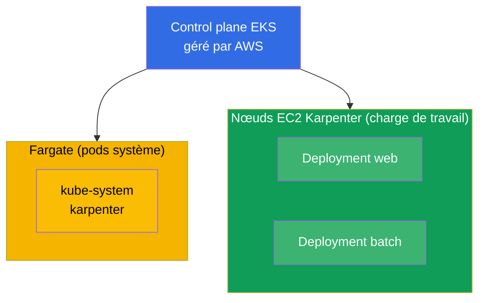
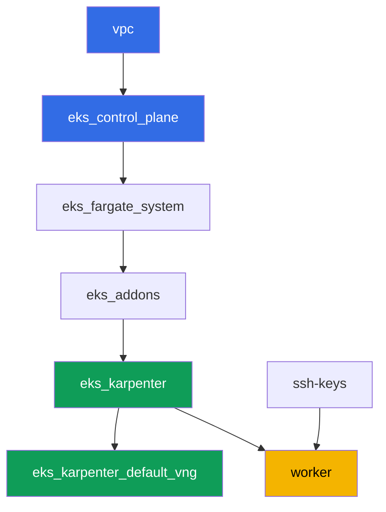

[Русская версия](README_RU.MD) · [Eng version](README.MD) · [Versión en español](README_ES.MD) · [Deutsche Version](README_DE.MD) · [ქართული ვერსია](README_GE.MD) · [繁體中文版](README_TW.MD) · [日本語版](README_JP.MD)

# Lab 101 - Cluster en tant que code : VPC, control plane, nœuds et kubeconfig

## Description

Le premier laboratoire du cours EKS et la base de tous ceux qui suivent. Vous obtenez ici un
cluster construit comme du code via Terragrunt, et vous apprenez à le lire : où passe la
frontière entre ce que gère AWS (le control plane) et ce qui reste de votre côté (réseau,
nœuds, accès). Vous déployez une charge de travail sur du compute managé, vous observez la
séparation entre les pods système sur Fargate et les nœuds de travail sur Karpenter, vous
vérifiez que VPC CNI attribue aux pods des adresses de votre VPC, et vous confirmez que les
nœuds de travail démarrent sur AL2023.

Les tâches sont écrites dans un style de production : un énoncé court plus des critères
d'acceptation. La vérification est automatique, via la commande `check_result`.

## Objectif

Consolider le contenu des chapitres suivants du cours :

- [Chapitre 4. Création d'un cluster : eksctl, Terraform et Terragrunt](../../course/04/ru.md) - cluster en tant que code et kubeconfig
- [Chapitre 6. Réseau du cluster : VPC CNI, ENI et adresses IP](../../course/06/ru.md) - d'où viennent les adresses des pods
- [Chapitre 9. Types de compute : managed node groups, Fargate, Auto Mode](../../course/09/ru.md) - ce qui s'exécute et où
- [Chapitre 10. AMI et bootstrap : AL2023, launch templates, kubelet](../../course/10/ru.md) - sur quelle image vivent les nœuds

## Ce que nous créons

Dans ce laboratoire, le cluster est déjà déployé en tant que code. Vous travaillez avec ce
qu'il vous offre et vous construisez par-dessus une petite charge de travail.

| Objet | Ce que c'est | Pourquoi dans ce laboratoire |
|--------|---------|-------------------|
| Namespace `eks-101` | une section du cluster pour la charge du laboratoire | garde les ressources séparées sans gêner celles du système (chapitre 4) |
| Deployment `web` (3 réplicas) | l'application ping_pong | on constate que les pods de travail vont sur des nœuds EC2 Karpenter, pas sur Fargate (chapitre 9) |
| Artefact `nodes.txt` | un instantané des nœuds du cluster | consigne la séparation entre Fargate (système) et EC2 (charge de travail) (chapitre 9) |
| Artefact `podip.txt` | IP du pod | confirme que VPC CNI a attribué une adresse du VPC `10.10.0.0/16` (chapitre 6) |
| Artefact `ami.txt` | image OS du nœud | vérifie que le nœud de travail tourne sur Amazon Linux 2023 (chapitre 10) |
| Deployment `batch` (6 réplicas) | charge de travail avec requête CPU | on observe comment Karpenter ajoute du compute à la demande (chapitre 9) |
| Pod `fg-probe` + artefact `whyfargate.txt` | un pod qui demande Fargate, plus l'explication | on capture le symptôme (Pending) et on formule la frontière de responsabilité (chapitres 4, 9) |

Vue finale du cluster :



## Infrastructure

L'environnement est déployé sur AWS (`eu-central-1`) via Terragrunt. Chaque dossier du
laboratoire est un composant avec son propre `terragrunt.hcl`, qui référence un module
partagé dans `terraform/modules/` et déclare ses dépendances via des blocs `dependency`.
Terragrunt construit un graphe de dépendances et applique les composants dans le bon ordre.

### Modules et dépendances

| Dossier (composant) | Module (`terraform/modules/`) | Dépend de | Ce qu'il crée |
|---------------------|-------------------------------|------------|-------------|
| `vpc` | `vpc_v3` | - | VPC `10.10.0.0/16`, sous-réseaux publics et privés dans deux AZ, NAT |
| `ssh-keys` | `ssh-keys` | - | une paire de clés SSH pour la machine de travail et les nœuds |
| `eks_control_plane` | `eks_v2_control_plane` | `vpc` | control plane EKS `1.36`, OIDC, security groups |
| `eks_fargate_system` | `eks_v2_fargate` | `vpc`, `eks_control_plane` | profil Fargate pour `kube-system` et `karpenter` |
| `eks_addons` | `eks_v2_addons` | `eks_control_plane`, `eks_fargate_system` | add-ons coredns, kube-proxy, vpc-cni, pod-identity |
| `eks_karpenter` | `eks_v2_karpenter` | `vpc`, `eks_control_plane`, `eks_addons`, `eks_fargate_system` | contrôleur Karpenter, rôle IAM des nœuds |
| `eks_karpenter_default_vng` | `eks_v2_karpenter_vng` | `vpc`, `eks_control_plane`, `eks_karpenter` | NodePool par défaut `default` et EC2NodeClass sur AL2023 |
| `worker` | `eks_v2_work_pc` | `ssh-keys`, `vpc`, `eks_control_plane`, `eks_karpenter` | machine de travail avec kubectl, tests et `check_result` |

Graphe de dépendances (ce qui est appliqué en premier est plus bas dans la flèche) :



Les pods système vont sur Fargate, les nœuds de travail sont montés par Karpenter. C'est
exactement la séparation de compute évoquée au chapitre 9.

### Où chaque chose est configurée

Les réglages sont répartis sur deux niveaux : l'`env.hcl` commun et les `inputs` de chaque
composant.

`env.hcl` (paramètres communs de l'environnement, lus par tous les composants) :

| Paramètre | Valeur dans le laboratoire | Ce qu'il affecte |
|----------|-----------------|---------------|
| `region` | `eu-central-1` | région de toutes les ressources |
| `vpc_default_cidr`, `subnets` | `10.10.0.0/16`, sous-réseaux par AZ | plan d'adressage du VPC et tags des sous-réseaux |
| `prefix` | `eks-task101` | préfixe des noms de ressources et des tags |
| `stack_name` | `eks101` | permet de construire `env_name`, le nom du cluster |
| `k8_version` | `1.36.0` | version de kubectl sur la machine de travail |
| `instance_type_worker` | `t3.medium` | type d'instance de la machine de travail |
| `spot_additional_types` | une liste de types | pool d'instances spot pour les nœuds |
| `ssh_password_enable`, `access_cidrs` | `true`, `0.0.0.0/0` | accès SSH à la machine de travail |
| `root_volume` | `gp3`, `10` | disque racine de la machine de travail |

`inputs` dans le `terragrunt.hcl` de chaque composant (paramètres du module concerné) :

| Fichier | Réglages clés |
|------|--------------------|
| `eks_control_plane/terragrunt.hcl` | `eks.version = "1.36"`, sous-réseaux privés pour les nœuds, sous-réseaux publics pour l'endpoint |
| `eks_addons/terragrunt.hcl` | versions des add-ons pour 1.36 : kube-proxy `v1.36.0-eksbuild.14`, coredns `v1.14.3-eksbuild.3`, vpc-cni, eks-pod-identity-agent |
| `eks_fargate_system/terragrunt.hcl` | sélecteurs de namespace pour Fargate (`kube-system`, `karpenter`) |
| `eks_karpenter/terragrunt.hcl` | version de Karpenter `1.8.1`, ressources du contrôleur |
| `eks_karpenter_default_vng/terragrunt.hcl` | `requirements` du NodePool (architecture, spot/on-demand, types), `limits`, `disruption` |
| `worker/terragrunt.hcl` | `test_url` et `task_script_url` des fichiers du laboratoire 101, `exam_time_minutes` |

Règle : les paramètres communs à tout le laboratoire (région, réseau, versions, préfixes)
vivent dans `env.hcl` ; les paramètres propres à un module vivent dans les `inputs` de son
`terragrunt.hcl`. Ainsi, pour changer la version du cluster, on modifie `eks.version` dans
`eks_control_plane/terragrunt.hcl` et les versions des add-ons dans
`eks_addons/terragrunt.hcl` ; pour changer le réseau, on modifie `subnets` dans `env.hcl`.

## Déploiement

```bash
TASK=101 make run_eks_task
```

Le déploiement prend environ 15 à 20 minutes. Dans la sortie, repérez la ligne avec la
connexion SSH vers la machine de travail et connectez-vous. kubectl y est déjà configuré
pour le bon cluster.

Commandes utiles sur la machine de travail :

```bash
time_left       # temps restant de l'environnement
check_result    # vérifier la solution
```

> Sécurité du banc de test. Dans `env.hcl`, `ssh_password_enable = true` et
> `access_cidrs = ["0.0.0.0/0"]` sont activés - pratique pour un environnement de formation,
> mais à ne pas faire en production. Selon les standards du cours (chapitres 0.2, 2, 19),
> l'accès aux machines de travail passe par AWS SSM Session Manager sans port SSH public
> exposé, et `access_cidrs` est restreint à des adresses précises. Ici, le SSH public est
> laissé uniquement pour simplifier le démarrage.

## Tâches

---
|        **1**        | **Namespace pour la charge du laboratoire**                             |
| :-----------------: | :---------------------------------------------------------- |
| Ce qu'on fait          | Créez un namespace nommé `eks-101`. Tous les objets du laboratoire sont créés à l'intérieur. |
| Critères d'acceptation    | - le namespace `eks-101` existe. |
---
|        **2**        | **Deployment sur du compute managé**                   |
| :-----------------: | :---------------------------------------------------------- |
| Ce qu'on fait          | Dans le namespace `eks-101`, créez le Deployment `web`, image `viktoruj/ping_pong:latest`, `3` réplicas. Attendez que tous les réplicas soient Ready. Les pods doivent aller sur des nœuds EC2 Karpenter (nom de nœud `ip-...`), pas sur Fargate : le profil Fargate du cluster ne couvre que `kube-system` et `karpenter`, il n'y en a pas pour `eks-101`, donc Karpenter prend la charge. Vous consignerez cette justification à la tâche 7. |
| Critères d'acceptation    | - Deployment `web` dans `eks-101`, image `viktoruj/ping_pong` ;<br/>- `3` réplicas prêts ;<br/>- aucun pod `web` sur un nœud Fargate. |
---
|        **3**        | **Instantané des nœuds : système contre charge de travail**                       |
| :-----------------: | :---------------------------------------------------------- |
| Ce qu'on fait          | Enregistrez la liste des nœuds du cluster dans `/var/work/tests/artifacts/3/nodes.txt` de façon à voir à la fois les nœuds Fargate (`fargate-...`) et les nœuds EC2 Karpenter (`ip-...`).<br/>Indice de format : `kubectl get nodes -o wide > /var/work/tests/artifacts/3/nodes.txt` (les noms de nœuds en première colonne suffisent pour la vérification). |
| Critères d'acceptation    | - le fichier n'est pas vide ;<br/>- il contient au moins un nœud `fargate-...` et au moins un `ip-...`. |
---
|        **4**        | **IP d'un pod dans l'espace d'adressage du VPC**                   |
| :-----------------: | :---------------------------------------------------------- |
| Ce qu'on fait          | Récupérez l'IP de n'importe quel pod `web` et enregistrez-la dans `/var/work/tests/artifacts/4/podip.txt`. Vérifiez que l'adresse appartient au VPC `10.10.0.0/16` (VPC CNI attribue aux pods des adresses issues des sous-réseaux du VPC).<br/>Indice de format : `kubectl get po -n eks-101 -l app=web -o jsonpath='{.items[0].status.podIP}'` - le fichier ne doit contenir que l'adresse, sans colonne superflue.<br/>Pour comprendre (pas nécessaire pour la vérification) : comparez l'adresse aux CIDR des sous-réseaux privés via `aws ec2 describe-subnets --filters "Name=vpc-id,Values=<vpc-id>" --query 'Subnets[].[CidrBlock,AvailabilityZone]'`. |
| Critères d'acceptation    | - le fichier n'est pas vide ;<br/>- l'IP commence par `10.10.`. |
---
|        **5**        | **Image du nœud de travail (AL2023)**                             |
| :-----------------: | :---------------------------------------------------------- |
| Ce qu'on fait          | Déterminez l'image OS du nœud de travail (EC2) sur lequel tournent les pods `web`, et enregistrez-la dans `/var/work/tests/artifacts/5/ami.txt`.<br/>Indice de format : récupérez le nœud via `kubectl get po ... -o jsonpath='{.items[0].spec.nodeName}'` et son image via `kubectl get node <node> -o jsonpath='{.status.nodeInfo.osImage}'` - le fichier doit contenir une ligne du type `Amazon Linux 2023`. |
| Critères d'acceptation    | - le fichier n'est pas vide ;<br/>- il contient une ligne avec `Amazon Linux` (AL2023). |
---
|        **6**        | **Mise à l'échelle du compute à la demande**                            |
| :-----------------: | :---------------------------------------------------------- |
| Ce qu'on fait          | Dans le namespace `eks-101`, créez le Deployment `batch`, image `viktoruj/ping_pong:latest`, `6` réplicas, avec `resources.requests.cpu` défini sur le conteneur (par exemple `500m`). Attendez que Karpenter alloue du compute et que les `6` réplicas soient Ready.<br/>Remarque : Karpenter met environ 60 à 90 secondes pour lever un nouveau nœud EC2 (demande d'instance plus bootstrap AL2023), donc les pods resteront d'abord en `Pending`. Avant d'exécuter `check_result`, attendez la disponibilité : `kubectl rollout status deployment/batch -n eks-101`. |
| Critères d'acceptation    | - Deployment `batch` dans `eks-101` avec `requests.cpu` défini ;<br/>- `6` réplicas prêts. |
---
|        **7**        | **Frontière de responsabilité : symptôme et explication**          |
| :-----------------: | :---------------------------------------------------------- |
| Ce qu'on fait          | Provoquez le symptôme délibérément. Dans `eks-101`, créez le Pod `fg-probe` (image `viktoruj/ping_pong:latest`) avec le `nodeSelector` `eks.amazonaws.com/compute-type: fargate`, c'est-à-dire en demandant explicitement Fargate. Le pod restera en `Pending` (il n'y a pas de profil Fargate pour `eks-101`, et les nœuds EC2 Karpenter ne portent pas ce label). Analysez la cause : `kubectl describe pod fg-probe -n eks-101` (section `Events`) et les événements du namespace `kubectl get events -n eks-101 --sort-by='.metadata.creationTimestamp'`. Enregistrez dans `/var/work/tests/artifacts/7/whyfargate.txt` une explication courte : pourquoi les pods `web` et `batch` sont allés sur des nœuds EC2 Karpenter plutôt que sur Fargate, et pourquoi `fg-probe` est resté bloqué. Le texte doit contenir les mots `Fargate` et `profile` (Fargate profile). |
| Critères d'acceptation    | - Pod `fg-probe` dans `eks-101` à l'état `Pending` ;<br/>- le fichier `/var/work/tests/artifacts/7/whyfargate.txt` n'est pas vide et mentionne `Fargate` et `profile`. |
---

## Vérification du résultat

Sur la machine de travail, lancez la vérification automatique :

```bash
check_result
```

Le script exécutera les tests et affichera le pourcentage de tâches accomplies.

## Solution

Solution de référence : [worker/files/solutions/1_FR.MD](worker/files/solutions/1_FR.MD)

## Suppression du cluster et des ressources

> **Retirez d'abord la charge de travail et attendez le départ des nœuds EC2, puis détruisez
> le banc de test.** Ce laboratoire ne crée aucune ressource AWS à la main, tout le reste
> sont des objets Kubernetes (Deployment `web`, `batch` et Pod `fg-probe` dans le namespace
> `eks-101`), donc il n'y a qu'un seul danger : si vous supprimez le cluster alors que la
> charge tourne encore, le nœud EC2 de Karpenter disparaît avec lui, mais l'ENI secondaire
> de VPC CNI reste à l'état `available` et retient le security group des nœuds. Dans ce cas,
> `destroy` reste bloqué sur `module.eks.aws_security_group.node[0]: Still destroying...`
> pendant des dizaines de minutes.

```bash
# 1. Retirer la charge du laboratoire
kubectl delete namespace eks-101 --ignore-not-found

# 2. Attendre que Karpenter retire le NodeClaim et le nœud EC2 (seuls fargate-* doivent rester)
while kubectl get nodeclaims --no-headers 2>/dev/null | grep -q .; do
  echo "Le NodeClaim est encore vivant, on attend..."; sleep 15
done
kubectl get nodes | grep -v fargate
```

Ce n'est qu'ensuite que vous détruisez le banc de test :

```bash
TASK=101 make delete_eks_task
```

Si `destroy` reste bloqué sur le security group des nœuds, c'est qu'un ENI orphelin
subsiste. Trouvez-le et supprimez-le :

```bash
aws ec2 describe-network-interfaces --filters Name=status,Values=available \
  --query 'NetworkInterfaces[?Tags[?Key==`eks:eni:owner`]].[NetworkInterfaceId,Description]' \
  --output table
aws ec2 delete-network-interface --network-interface-id <eni-id>
```
