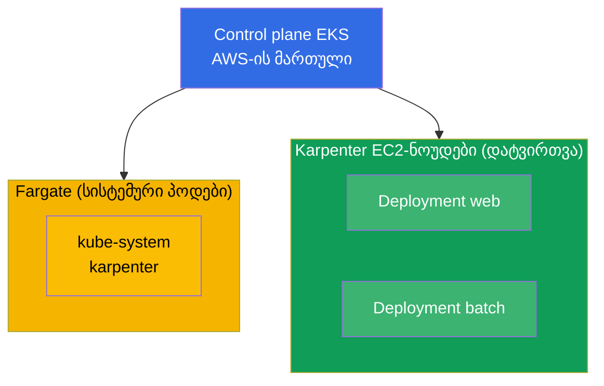
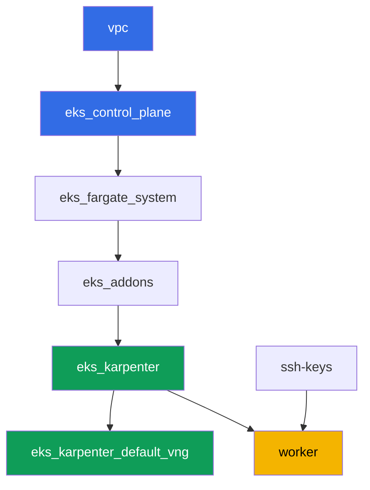

[Русская версия](README_RU.MD) · [Eng version](README.MD) · [Versión en español](README_ES.MD) · [Version française](README_FR.MD) · [Deutsche Version](README_DE.MD) · [繁體中文版](README_TW.MD) · [日本語版](README_JP.MD)

# ლაბა 101 - კლასტერი როგორც კოდი: VPC, control plane, ნოუდები და kubeconfig

## აღწერა

EKS კურსის პირველი ლაბა და საფუძველი ყველა მომდევნო ლაბისთვის. აქ თქვენ იღებთ კლასტერს,
რომელიც აწყობილია როგორც კოდი Terragrunt-ის მეშვეობით, და სწავლობთ მის წაკითხვას: სად
გადის საზღვარი იმას, რასაც AWS ემსახურება (control plane), და იმას, რაც თქვენზე რჩება
(ქსელი, ნოუდები, წვდომა). თქვენ დეპლოიმენტს აყენებთ მართულ compute-ზე, ხედავთ სისტემური
პოდების გამიჯვნას Fargate-ზე და სამუშაო ნოუდების Karpenter-ზე, ამოწმებთ, რომ VPC CNI
პოდებს გამოუყოფს მისამართებს თქვენი VPC-დან, და ადასტურებთ, რომ სამუშაო ნოუდები
იმართებიან AL2023-ზე.

დავალებები დაწერილია production-სტილში: მოკლე დავალება პლუს მიღების კრიტერიუმები.
შემოწმება ავტომატურია, ბრძანებით `check_result`.

## მიზანი

გავამყაროთ კურსის ამ თავების მასალა:

- [თავი 4. კლასტერის შექმნა: eksctl, Terraform და Terragrunt](../../course/04/ru.md) - კლასტერი როგორც კოდი და kubeconfig
- [თავი 6. კლასტერის ქსელი: VPC CNI, ENI და IP-მისამართები](../../course/06/ru.md) - საიდან იღებენ პოდები მისამართებს
- [თავი 9. Compute-ის ტიპები: managed node groups, Fargate, Auto Mode](../../course/09/ru.md) - რა და სად სრულდება
- [თავი 10. AMI და bootstrap: AL2023, launch templates, kubelet](../../course/10/ru.md) - რომელ image-ზე ცხოვრობენ ნოუდები

## რას ვქმნით

ამ ლაბაში კლასტერი უკვე დეპლოირებულია როგორც კოდი. თქვენ მუშაობთ იმით, რასაც ის
გვთავაზობს, და მასზე ზემოთ ქმნით მცირე დატვირთვას.

| ობიექტი | რა არის ეს | რისთვის ამ ლაბაში |
|--------|---------|-------------------|
| Namespace `eks-101` | კლასტერის სექცია ლაბის დატვირთვისთვის | ინახავს რესურსებს განცალკევებულად, სისტემურებზე ხელის შეუშლელად (თავი 4) |
| Deployment `web` (3 რეპლიკა) | ping_pong აპლიკაცია | ვხედავთ, რომ სამუშაო პოდები ხვდებიან Karpenter-ის EC2-ნოუდებზე, არა Fargate-ზე (თავი 9) |
| არტეფაქტი `nodes.txt` | კლასტერის ნოუდების ასლი | აფიქსირებს Fargate-ის (სისტემა) და EC2-ის (დატვირთვა) გამიჯვნას (თავი 9) |
| არტეფაქტი `podip.txt` | პოდის IP | ადასტურებს, რომ VPC CNI-მ გამოუყო მისამართი VPC `10.10.0.0/16`-დან (თავი 6) |
| არტეფაქტი `ami.txt` | ნოუდის OS image | ამოწმებს, რომ სამუშაო ნოუდი მუშაობს Amazon Linux 2023-ზე (თავი 10) |
| Deployment `batch` (6 რეპლიკა) | დატვირთვა CPU-request-ით | ვაკვირდებით, როგორ ამატებს Karpenter compute-ს მოთხოვნის მიხედვით (თავი 9) |
| Pod `fg-probe` + არტეფაქტი `whyfargate.txt` | პოდი, რომელიც ითხოვს Fargate-ს, პლუს განმარტება | ვიჭერთ სიმპტომს (Pending) და ვაფორმულირებთ პასუხისმგებლობის საზღვარს (თავები 4, 9) |

კლასტერის საბოლოო სურათი:



## ინფრასტრუქტურა

გარემო დეპლოირდება AWS-ში (`eu-central-1`) Terragrunt-ის მეშვეობით. ლაბის ყოველი
დირექტორია ერთი კომპონენტია საკუთარი `terragrunt.hcl`-ით, რომელიც მიმართავს საერთო
მოდულს `terraform/modules/`-ში და აცხადებს დამოკიდებულებებს `dependency` ბლოკებით.
Terragrunt აწყობს დამოკიდებულებების გრაფს და აპლიკებს კომპონენტებს სწორი
თანმიმდევრობით.

### მოდულები და დამოკიდებულებები

| დირექტორია (კომპონენტი) | მოდული (`terraform/modules/`) | დამოკიდებულია | რას ქმნის |
|---------------------|-------------------------------|------------|-------------|
| `vpc` | `vpc_v3` | - | VPC `10.10.0.0/16`, საჯარო და პრივატული ქვექსელები ორ AZ-ში, NAT |
| `ssh-keys` | `ssh-keys` | - | SSH-გასაღებების წყვილი სამუშაო მანქანისა და ნოუდებისთვის |
| `eks_control_plane` | `eks_v2_control_plane` | `vpc` | EKS control plane `1.36`, OIDC, security groups |
| `eks_fargate_system` | `eks_v2_fargate` | `vpc`, `eks_control_plane` | Fargate-პროფილი `kube-system`-ისთვის და `karpenter`-ისთვის |
| `eks_addons` | `eks_v2_addons` | `eks_control_plane`, `eks_fargate_system` | დამატებები coredns, kube-proxy, vpc-cni, pod-identity |
| `eks_karpenter` | `eks_v2_karpenter` | `vpc`, `eks_control_plane`, `eks_addons`, `eks_fargate_system` | Karpenter-ის კონტროლერი, ნოუდების IAM-როლი |
| `eks_karpenter_default_vng` | `eks_v2_karpenter_vng` | `vpc`, `eks_control_plane`, `eks_karpenter` | ნაგულისხმევი NodePool `default` და EC2NodeClass AL2023-ზე |
| `worker` | `eks_v2_work_pc` | `ssh-keys`, `vpc`, `eks_control_plane`, `eks_karpenter` | სამუშაო მანქანა kubectl-ით, ტესტებით და `check_result`-ით |

დამოკიდებულებების გრაფი (რაც უფრო ადრე აპლიცირდება, ის ხრიხისკენ ქვემოთაა):



სისტემური პოდები ხვდებიან Fargate-ზე, სამუშაო ნოუდებს ამართავს Karpenter. ეს არის
ზუსტად ის compute-ის გამიჯვნა, რაზეც ლაპარაკია თავში 9.

### სად რა კონფიგურირდება

პარამეტრები გადანაწილებულია ორ დონეზე: საერთო `env.hcl` და თითოეული კომპონენტის
`inputs`.

`env.hcl` (გარემოს საერთო პარამეტრები, წაკითხული ყველა კომპონენტის მიერ):

| პარამეტრი | მნიშვნელობა ლაბაში | რაზე ახდენს გავლენას |
|----------|-----------------|---------------|
| `region` | `eu-central-1` | ყველა რესურსის რეგიონი |
| `vpc_default_cidr`, `subnets` | `10.10.0.0/16`, ქვექსელები AZ-ების მიხედვით | VPC-ის მისამართების გეგმა და ქვექსელების ტეგები |
| `prefix` | `eks-task101` | რესურსების სახელებისა და ტეგების პრეფიქსი |
| `stack_name` | `eks101` | მისგან იწყობა `env_name` - კლასტერის სახელი |
| `k8_version` | `1.36.0` | kubectl-ის ვერსია სამუშაო მანქანაზე |
| `instance_type_worker` | `t3.medium` | სამუშაო მანქანის instance-ის ტიპი |
| `spot_additional_types` | ტიპების სია | spot-instance-ების პული ნოუდებისთვის |
| `ssh_password_enable`, `access_cidrs` | `true`, `0.0.0.0/0` | SSH-წვდომა სამუშაო მანქანაზე |
| `root_volume` | `gp3`, `10` | სამუშაო მანქანის root-დისკი |

`inputs` თითოეული კომპონენტის `terragrunt.hcl`-ში (კონკრეტული მოდულის პარამეტრები):

| ფაილი | ძირითადი პარამეტრები |
|------|--------------------|
| `eks_control_plane/terragrunt.hcl` | `eks.version = "1.36"`, პრივატული ქვექსელები ნოუდებისთვის, საჯარო ქვექსელები endpoint-ისთვის |
| `eks_addons/terragrunt.hcl` | დამატებების ვერსიები 1.36-ისთვის: kube-proxy `v1.36.0-eksbuild.14`, coredns `v1.14.3-eksbuild.3`, vpc-cni, eks-pod-identity-agent |
| `eks_fargate_system/terragrunt.hcl` | namespace-სელექტორები Fargate-სთვის (`kube-system`, `karpenter`) |
| `eks_karpenter/terragrunt.hcl` | Karpenter-ის ვერსია `1.8.1`, კონტროლერის რესურსები |
| `eks_karpenter_default_vng/terragrunt.hcl` | NodePool-ის `requirements` (არქიტექტურა, spot/on-demand, ტიპები), `limits`, `disruption` |
| `worker/terragrunt.hcl` | `test_url` და `task_script_url` ლაბა 101-ის ფაილებზე, `exam_time_minutes` |

წესი: მთელი ლაბისთვის საერთო პარამეტრები (რეგიონი, ქსელი, ვერსიები, პრეფიქსები)
ცხოვრობენ `env.hcl`-ში; კონკრეტული მოდულის პარამეტრები - მისი `terragrunt.hcl`-ის
`inputs`-ში. მაგალითად, კლასტერის ვერსიის შესაცვლელად რედაქტირდება `eks.version`
`eks_control_plane/terragrunt.hcl`-ში და დამატებების ვერსიები
`eks_addons/terragrunt.hcl`-ში; ქსელის შესაცვლელად - `subnets` `env.hcl`-ში.

## განლაგება

```bash
TASK=101 make run_eks_task
```

განლაგება გრძელდება დაახლოებით 15-20 წუთი. output-ში მოძებნეთ ხაზი SSH-შეერთებით
სამუშაო მანქანასთან და დაუკავშირდით მას. kubectl იქ უკვე კონფიგურირებულია საჭირო
კლასტერზე.

სასარგებლო ბრძანებები სამუშაო მანქანაზე:

```bash
time_left       # რამდენი დრო დარჩა გარემოს
check_result    # გადამოწმება
```

> სტენდის უსაფრთხოება. `env.hcl`-ში ჩართულია `ssh_password_enable = true` და
> `access_cidrs = ["0.0.0.0/0"]` - ეს მოსახერხებელია სასწავლო გარემოსთვის, მაგრამ ასე არ
> უნდა გავხადოთ production-ში. კურსის სტანდარტების მიხედვით (თავები 0.2, 2, 19) სამუშაო
> მანქანებზე წვდომა იხსნება AWS SSM Session Manager-ის მეშვეობით, საჯარო SSH-პორტების
> გარეთ გამოტანის გარეშე, ხოლო `access_cidrs` ვიწროვდება კონკრეტულ მისამართებზე. აქ
> საჯარო SSH დარჩენილია მხოლოდ გაშვების გასამარტივებლად.

## დავალებები

---
|        **1**        | **Namespace ლაბის დატვირთვისთვის**                             |
| :-----------------: | :---------------------------------------------------------- |
| რას ვაკეთებთ          | შექმენით namespace სახელით `eks-101`. ლაბის ყველა ობიექტი შექმნილია მის შიგნით. |
| მიღების კრიტერიუმები    | - namespace `eks-101` არსებობს. |
---
|        **2**        | **Deployment მართულ compute-ზე**                   |
| :-----------------: | :---------------------------------------------------------- |
| რას ვაკეთებთ          | Namespace `eks-101`-ში შექმენით Deployment `web`, image `viktoruj/ping_pong:latest`, `3` რეპლიკა. დაელოდეთ, სანამ ყველა რეპლიკა გახდება Ready. პოდები უნდა ხვდებოდნენ Karpenter-ის EC2-ნოუდებზე (ნოუდის სახელი `ip-...`), არა Fargate-ზე: კლასტერში Fargate-პროფილი მხოლოდ `kube-system`-ს და `karpenter`-ს ეხება, `eks-101`-ისთვის ის არ არსებობს, ამიტომ დატვირთვას იღებს Karpenter. დასაბუთებას დააფიქსირებთ დავალება 7-ში. |
| მიღების კრიტერიუმები    | - Deployment `web` `eks-101`-ში, image `viktoruj/ping_pong`;<br/>- `3` მზა რეპლიკა;<br/>- არც ერთი `web` პოდი არ არის Fargate-ნოუდზე. |
---
|        **3**        | **ნოუდების ასლი: სისტემა vs დატვირთვა**                       |
| :-----------------: | :---------------------------------------------------------- |
| რას ვაკეთებთ          | შეინახეთ კლასტერის ნოუდების სია ფაილში `/var/work/tests/artifacts/3/nodes.txt` ისე, რომ ჩანდეს ორივე: Fargate-ნოუდები (`fargate-...`) და Karpenter EC2-ნოუდები (`ip-...`).<br/>ფორმატის მინიშნება: `kubectl get nodes -o wide > /var/work/tests/artifacts/3/nodes.txt` (ნოუდების სახელები პირველ სვეტში საკმარისია შემოწმებისთვის). |
| მიღების კრიტერიუმები    | - ფაილი არ არის ცარიელი;<br/>- შეიცავს მინიმუმ ერთ `fargate-...` ნოუდს და მინიმუმ ერთ `ip-...`-ს. |
---
|        **4**        | **პოდის IP VPC-ის მისამართების სივრციდან**                   |
| :-----------------: | :---------------------------------------------------------- |
| რას ვაკეთებთ          | აიღეთ ნებისმიერი `web` პოდის IP და შეინახეთ ფაილში `/var/work/tests/artifacts/4/podip.txt`. დარწმუნდით, რომ მისამართი VPC `10.10.0.0/16`-დანაა (VPC CNI პოდებს გამოუყოფს მისამართებს VPC-ის ქვექსელებიდან).<br/>ფორმატის მინიშნება: `kubectl get po -n eks-101 -l app=web -o jsonpath='{.items[0].status.podIP}'` - ფაილში მხოლოდ მისამართი უნდა იყოს, ზედმეტი სვეტების გარეშე.<br/>გასაგებად (არ წარმოადგენს შემოწმების ნაწილს): შეადარეთ მისამართი პრივატული ქვექსელების CIDR-ებს `aws ec2 describe-subnets --filters "Name=vpc-id,Values=<vpc-id>" --query 'Subnets[].[CidrBlock,AvailabilityZone]'` ბრძანებით. |
| მიღების კრიტერიუმები    | - ფაილი არ არის ცარიელი;<br/>- IP იწყება `10.10.`-ით. |
---
|        **5**        | **სამუშაო ნოუდის image (AL2023)**                             |
| :-----------------: | :---------------------------------------------------------- |
| რას ვაკეთებთ          | დაადგინეთ სამუშაო (EC2) ნოუდის OS image, რომელზეც ტრიალებს `web` პოდები, და შეინახეთ ფაილში `/var/work/tests/artifacts/5/ami.txt`.<br/>ფორმატის მინიშნება: აიღეთ ნოუდი `kubectl get po ... -o jsonpath='{.items[0].spec.nodeName}'`-იდან და მისი image `kubectl get node <node> -o jsonpath='{.status.nodeInfo.osImage}'`-ით - ფაილში უნდა იყოს ხაზი ტიპის `Amazon Linux 2023`. |
| მიღების კრიტერიუმები    | - ფაილი არ არის ცარიელი;<br/>- შეიცავს ხაზს `Amazon Linux`-ით (AL2023). |
---
|        **6**        | **Compute-ის მასშტაბირება მოთხოვნის მიხედვით**                            |
| :-----------------: | :---------------------------------------------------------- |
| რას ვაკეთებთ          | Namespace `eks-101`-ში შექმენით Deployment `batch`, image `viktoruj/ping_pong:latest`, `6` რეპლიკა, კონტეინერზე დაყენებული `resources.requests.cpu` (მაგალითად `500m`). დაელოდეთ, სანამ Karpenter გამოუყოფს compute-ს და ყველა `6` რეპლიკა გახდება Ready.<br/>შენიშვნა: Karpenter-ს სჭირდება დაახლოებით 60-90 წამი ახალი EC2-ნოუდის ასამართავად (instance-ის მოთხოვნა პლუს AL2023 bootstrap), ამიტომ პოდები თავდაპირველად `Pending`-ში დარჩებიან. `check_result`-ის გამოშვებამდე დაელოდეთ მზაობას: `kubectl rollout status deployment/batch -n eks-101`. |
| მიღების კრიტერიუმები    | - Deployment `batch` `eks-101`-ში, დაყენებული `requests.cpu`-ით;<br/>- `6` მზა რეპლიკა. |
---
|        **7**        | **პასუხისმგებლობის საზღვარი: სიმპტომი და განმარტება**          |
| :-----------------: | :---------------------------------------------------------- |
| რას ვაკეთებთ          | სპეციალურად გამოიწვიეთ სიმპტომი. `eks-101`-ში შექმენით Pod `fg-probe` (image `viktoruj/ping_pong:latest`) `nodeSelector`-ით `eks.amazonaws.com/compute-type: fargate`, ანუ ითხოვთ Fargate-ს ცალსახად. პოდი დარჩება `Pending`-ში (`eks-101`-ისთვის Fargate-პროფილი არ არსებობს, ხოლო Karpenter-ის EC2-ნოუდებს ეს label არ აქვთ). გაარკვიეთ მიზეზი: `kubectl describe pod fg-probe -n eks-101` (სექცია `Events`) და namespace-ის events-ები `kubectl get events -n eks-101 --sort-by='.metadata.creationTimestamp'`. შეინახეთ ფაილში `/var/work/tests/artifacts/7/whyfargate.txt` მოკლე განმარტება: რატომ ხვდნენ `web` და `batch` პოდები Karpenter-ის EC2-ნოუდებზე და არა Fargate-ზე, და რატომ ჩარჩა `fg-probe`. ტექსტში უნდა იყოს სიტყვები `Fargate` და `profile` (Fargate profile). |
| მიღების კრიტერიუმები    | - Pod `fg-probe` `eks-101`-ში მდგომარეობაში `Pending`;<br/>- ფაილი `/var/work/tests/artifacts/7/whyfargate.txt` არ არის ცარიელი და ახსენებს `Fargate`-ს და `profile`-ს. |
---

## შედეგის შემოწმება

სამუშაო მანქანაზე გაუშვით ავტომატური შემოწმება:

```bash
check_result
```

სკრიპტი გაუშვებს ტესტებს და გამოაჩენს შესრულებული დავალებების პროცენტს.

## გადაწყვეტა

ეტალონური გადაწყვეტა: [worker/files/solutions/1_GE.MD](worker/files/solutions/1_GE.MD)

## კლასტერისა და რესურსების წაშლა

> **ჯერ მოხსენით დატვირთვა და დაელოდეთ, სანამ EC2-ნოუდები არ გაქრება, მხოლოდ მერე
> დაანგრიეთ სტენდი.** ეს ლაბა AWS-რესურსებს ხელით არ ქმნის, ყველა დანარჩენი -
> Kubernetes-ის ობიექტებია (Deployment `web`, `batch` და Pod `fg-probe` namespace
> `eks-101`-ში), ამიტომ საფრთხე მხოლოდ ერთია: თუ კლასტერს წაშლით მაშინ, როცა დატვირთვა
> ჯერ კიდევ მუშაობს, Karpenter-ის EC2-ნოუდი მასთან ერთად წავა, მაგრამ VPC CNI-ის
> მეორადი ENI `available` მდგომარეობაში დარჩება და ნოუდების security group-ს
> შეაკავებს. ასეთ შემთხვევაში `destroy` ჩერდება
> `module.eks.aws_security_group.node[0]: Still destroying...`-ზე ათეულ წუთს.

```bash
# 1. ლაბის დატვირთვის მოხსნა
kubectl delete namespace eks-101 --ignore-not-found

# 2. დაელოდეთ, სანამ Karpenter მოხსნის NodeClaim-ს და EC2-ნოუდს (დარჩება მხოლოდ fargate-*)
while kubectl get nodeclaims --no-headers 2>/dev/null | grep -q .; do
  echo "NodeClaim ჯერ ისევ ცოცხალია, ველოდებით..."; sleep 15
done
kubectl get nodes | grep -v fargate
```

მხოლოდ ამის შემდეგ დაანგრიეთ სტენდი:

```bash
TASK=101 make delete_eks_task
```

თუ `destroy` მაინც შედგა ნოუდების security group-ზე, ესე იგი დარჩა დაუპატრონებელი ENI.
მოძებნეთ და წაშალეთ ის:

```bash
aws ec2 describe-network-interfaces --filters Name=status,Values=available \
  --query 'NetworkInterfaces[?Tags[?Key==`eks:eni:owner`]].[NetworkInterfaceId,Description]' \
  --output table
aws ec2 delete-network-interface --network-interface-id <eni-id>
```
