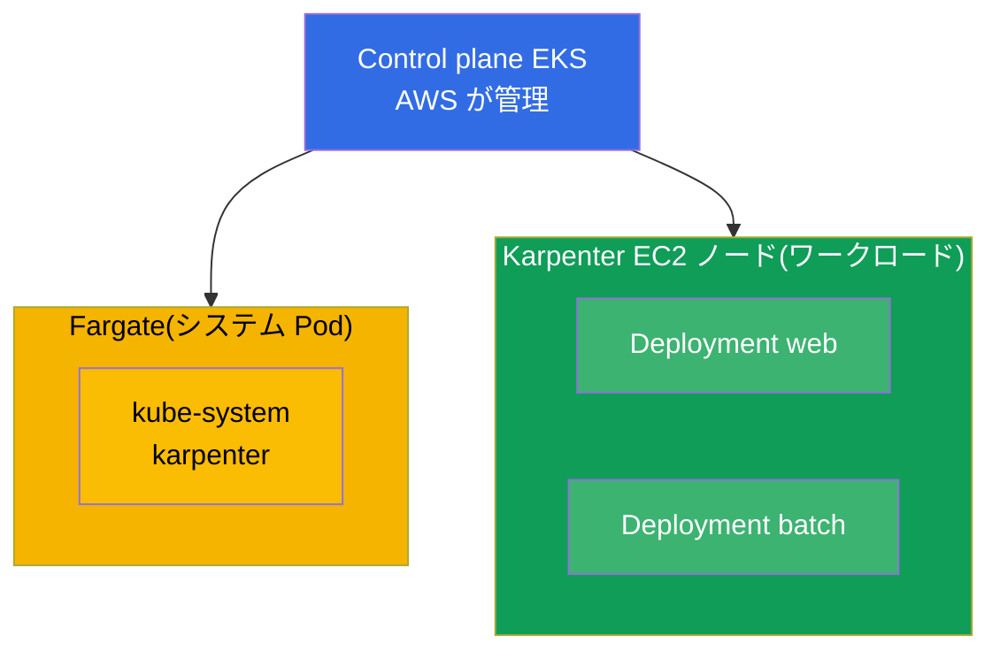
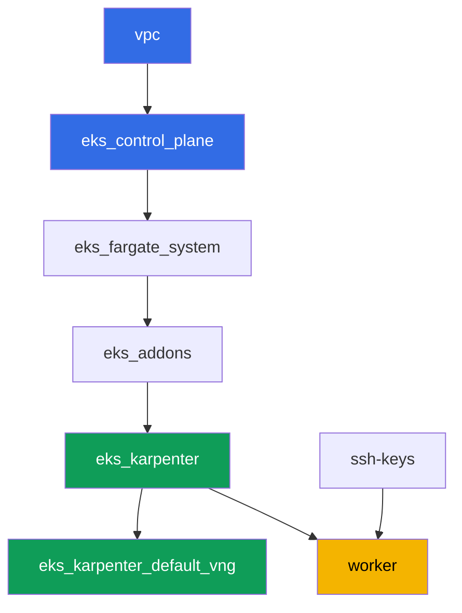

[Русская версия](README_RU.MD) · [Eng version](README.MD) · [Versión en español](README_ES.MD) · [Version française](README_FR.MD) · [Deutsche Version](README_DE.MD) · [ქართული ვერსია](README_GE.MD) · [繁體中文版](README_TW.MD)

# ラボ 101 - コードとしてのクラスタ:VPC、control plane、ノード、kubeconfig

## 説明

EKS コースの最初のラボであり、以降すべてのラボの基礎となります。ここでは Terragrunt に
よってコードとして構築されたクラスタを手にし、それを読み解く方法を学びます。AWS が
管理する部分(control plane)と、自分側に残る部分(ネットワーク、ノード、アクセス)の
境界線がどこにあるのかを理解します。マネージドコンピュート上にワークロードをデプロイし、
システム Pod が Fargate 上に、ワーカーノードが Karpenter 上に分かれる様子を観察し、
VPC CNI が Pod に自分の VPC のアドレスを割り当てていることを確認し、ワーカーノードが
AL2023 上で起動していることを確認します。

タスクは production スタイルで書かれています:短い課題文とアクセプタンス基準。検証は
`check_result` コマンドによって自動的に行われます。

## 目的

コースの以下の章の内容を定着させます:

- [第 4 章。クラスタの作成:eksctl、Terraform、Terragrunt](../../course/04/jp.md) - コードとしてのクラスタと kubeconfig
- [第 6 章。クラスタネットワーク:VPC CNI、ENI、IP アドレス](../../course/06/jp.md) - Pod のアドレスがどこから来るか
- [第 9 章。コンピュートの種類:managed node groups、Fargate、Auto Mode](../../course/09/jp.md) - 何がどこで動くか
- [第 10 章。AMI と bootstrap:AL2023、launch templates、kubelet](../../course/10/jp.md) - ノードがどのイメージ上で動いているか

## 作成するもの

このラボでは、クラスタは既にコードとしてデプロイされています。あなたはそれが提供する
ものを使い、その上に小さなワークロードを構築します。

| オブジェクト | 何か | このラボでの目的 |
|--------|---------|-------------------|
| Namespace `eks-101` | ラボのワークロード用のクラスタ区画 | システムのリソースを妨げずにリソースを分離する(第 4 章) |
| Deployment `web`(3 レプリカ) | ping_pong アプリケーション | ワーカー Pod が Fargate ではなく Karpenter の EC2 ノードに配置されることを確認する(第 9 章) |
| アーティファクト `nodes.txt` | クラスタノードのスナップショット | Fargate(システム)と EC2(ワークロード)の分離を記録する(第 9 章) |
| アーティファクト `podip.txt` | Pod の IP | VPC CNI が VPC `10.10.0.0/16` からアドレスを割り当てたことを確認する(第 6 章) |
| アーティファクト `ami.txt` | ノードの OS イメージ | ワーカーノードが Amazon Linux 2023 で動作していることを確認する(第 10 章) |
| Deployment `batch`(6 レプリカ) | CPU request を持つワークロード | Karpenter が需要に応じてコンピュートを追加する様子を観察する(第 9 章) |
| Pod `fg-probe` + アーティファクト `whyfargate.txt` | Fargate を要求する Pod と、その説明 | 症状(Pending)を捉え、責任の境界を明文化する(第 4、9 章) |

クラスタの最終的な構成図:



## インフラストラクチャ

環境は Terragrunt によって AWS(`eu-central-1`)にデプロイされます。ラボの各ディレクト
リは 1 つのコンポーネントであり、それぞれ独自の `terragrunt.hcl` を持ち、
`terraform/modules/` の共有モジュールを参照し、`dependency` ブロックで依存関係を宣言
します。Terragrunt は依存関係グラフを構築し、正しい順序でコンポーネントを適用します。

### モジュールと依存関係

| ディレクトリ(コンポーネント) | モジュール(`terraform/modules/`) | 依存先 | 作成されるもの |
|---------------------|-------------------------------|------------|-------------|
| `vpc` | `vpc_v3` | - | VPC `10.10.0.0/16`、2 つの AZ にあるパブリックとプライベートのサブネット、NAT |
| `ssh-keys` | `ssh-keys` | - | ワーカーマシンとノード用の SSH キーペア |
| `eks_control_plane` | `eks_v2_control_plane` | `vpc` | EKS control plane `1.36`、OIDC、security groups |
| `eks_fargate_system` | `eks_v2_fargate` | `vpc`、`eks_control_plane` | `kube-system` と `karpenter` 用の Fargate profile |
| `eks_addons` | `eks_v2_addons` | `eks_control_plane`、`eks_fargate_system` | coredns、kube-proxy、vpc-cni、pod-identity のアドオン |
| `eks_karpenter` | `eks_v2_karpenter` | `vpc`、`eks_control_plane`、`eks_addons`、`eks_fargate_system` | Karpenter コントローラ、ノードの IAM ロール |
| `eks_karpenter_default_vng` | `eks_v2_karpenter_vng` | `vpc`、`eks_control_plane`、`eks_karpenter` | デフォルトの NodePool `default` と AL2023 上の EC2NodeClass |
| `worker` | `eks_v2_work_pc` | `ssh-keys`、`vpc`、`eks_control_plane`、`eks_karpenter` | kubectl、テスト、`check_result` を備えたワーカーマシン |

依存関係グラフ(先に適用されるものほど矢印の下側にある):



システム Pod は Fargate 上で動き、ワーカーノードは Karpenter によって立ち上げられます。
これはまさに第 9 章で扱うコンピュートの分離です。

### どこで何が設定されるか

設定は 2 つのレベルに分かれています:共通の `env.hcl` と各コンポーネントの `inputs`。

`env.hcl`(すべてのコンポーネントが読み込む共通の環境パラメータ):

| パラメータ | ラボでの値 | 影響範囲 |
|----------|-----------------|---------------|
| `region` | `eu-central-1` | すべてのリソースのリージョン |
| `vpc_default_cidr`、`subnets` | `10.10.0.0/16`、AZ ごとのサブネット | VPC のアドレス計画とサブネットのタグ |
| `prefix` | `eks-task101` | リソース名とタグのプレフィックス |
| `stack_name` | `eks101` | ここから `env_name`(クラスタ名)が組み立てられる |
| `k8_version` | `1.36.0` | ワーカーマシン上の kubectl のバージョン |
| `instance_type_worker` | `t3.medium` | ワーカーマシンのインスタンスタイプ |
| `spot_additional_types` | タイプのリスト | ノード用のスポットインスタンスプール |
| `ssh_password_enable`、`access_cidrs` | `true`、`0.0.0.0/0` | ワーカーマシンへの SSH アクセス |
| `root_volume` | `gp3`、`10` | ワーカーマシンのルートディスク |

各コンポーネントの `terragrunt.hcl` の `inputs`(そのモジュール固有のパラメータ):

| ファイル | 主な設定 |
|------|--------------------|
| `eks_control_plane/terragrunt.hcl` | `eks.version = "1.36"`、ノード用のプライベートサブネット、エンドポイント用のパブリックサブネット |
| `eks_addons/terragrunt.hcl` | 1.36 用のアドオンバージョン:kube-proxy `v1.36.0-eksbuild.14`、coredns `v1.14.3-eksbuild.3`、vpc-cni、eks-pod-identity-agent |
| `eks_fargate_system/terragrunt.hcl` | Fargate 用の namespace セレクタ(`kube-system`、`karpenter`) |
| `eks_karpenter/terragrunt.hcl` | Karpenter のバージョン `1.8.1`、コントローラのリソース |
| `eks_karpenter_default_vng/terragrunt.hcl` | NodePool の `requirements`(アーキテクチャ、spot/on-demand、タイプ)、`limits`、`disruption` |
| `worker/terragrunt.hcl` | ラボ 101 のファイルを指す `test_url` と `task_script_url`、`exam_time_minutes` |

原則:ラボ全体で共通のパラメータ(リージョン、ネットワーク、バージョン、プレフィックス)
は `env.hcl` にあり、特定のモジュールのパラメータはそのモジュールの `terragrunt.hcl` の
`inputs` にあります。例えばクラスタのバージョンを変更するには
`eks_control_plane/terragrunt.hcl` の `eks.version` と `eks_addons/terragrunt.hcl` の
アドオンバージョンを編集し、ネットワークを変更するには `env.hcl` の `subnets` を編集し
ます。

## デプロイ

```bash
TASK=101 make run_eks_task
```

デプロイには約 15-20 分かかります。出力の中からワーカーマシンへの SSH 接続の行を見つけ
て接続してください。そこでは kubectl が既に正しいクラスタ向けに設定されています。

ワーカーマシン上で使える便利なコマンド:

```bash
time_left       # 環境の残り時間
check_result    # 解答の確認
```

> 検証環境のセキュリティについて。`env.hcl` では `ssh_password_enable = true` と
> `access_cidrs = ["0.0.0.0/0"]` が有効になっています。学習用環境としては便利ですが、
> 本番環境ではこのようにしてはいけません。コースの標準(第 0.2、2、19 章)によれば、
> ワーカーマシンへのアクセスは公開 SSH ポートを外に出さずに AWS SSM Session Manager を
> 経由して開き、`access_cidrs` は具体的なアドレスに絞り込みます。ここでは、セットアップ
> を簡単にするためだけに公開 SSH を残しています。

## タスク

---
|        **1**        | **ラボのワークロード用の Namespace**                             |
| :-----------------: | :---------------------------------------------------------- |
| やること          | `eks-101` という名前の namespace を作成してください。ラボのすべてのオブジェクトはこの中に作成されます。 |
| アクセプタンス基準    | - namespace `eks-101` が存在する。 |
---
|        **2**        | **マネージドコンピュート上の Deployment**                   |
| :-----------------: | :---------------------------------------------------------- |
| やること          | `eks-101` namespace に Deployment `web` を作成してください。イメージは `viktoruj/ping_pong:latest`、レプリカ数は `3` です。すべてのレプリカが Ready になるまで待ってください。Pod は Karpenter の EC2 ノード(ノード名が `ip-...`)に配置されるべきで、Fargate には配置されません:クラスタの Fargate profile は `kube-system` と `karpenter` のみをカバーし、`eks-101` 用のものは存在しないため、Karpenter がこのワークロードを引き受けます。この根拠はタスク 7 で記録します。 |
| アクセプタンス基準    | - `eks-101` に Deployment `web`、イメージ `viktoruj/ping_pong`;<br/>- `3` 個の Ready なレプリカ;<br/>- `web` の Pod が 1 つも Fargate ノードに存在しないこと。 |
---
|        **3**        | **ノードのスナップショット:システム対ワークロード**                       |
| :-----------------: | :---------------------------------------------------------- |
| やること          | クラスタのノード一覧を `/var/work/tests/artifacts/3/nodes.txt` に保存し、Fargate ノード(`fargate-...`)と Karpenter の EC2 ノード(`ip-...`)の両方が見えるようにしてください。<br/>フォーマットのヒント:`kubectl get nodes -o wide > /var/work/tests/artifacts/3/nodes.txt`(1 列目にノード名があれば検証には十分です)。 |
| アクセプタンス基準    | - ファイルが空でないこと;<br/>- `fargate-...` ノードと `ip-...` ノードがそれぞれ少なくとも 1 つ含まれていること。 |
---
|        **4**        | **VPC のアドレス空間から取得した Pod の IP**                   |
| :-----------------: | :---------------------------------------------------------- |
| やること          | 任意の `web` Pod の IP を取得し、`/var/work/tests/artifacts/4/podip.txt` に保存してください。そのアドレスが VPC `10.10.0.0/16` に属していることを確認してください(VPC CNI は VPC のサブネットから Pod にアドレスを割り当てます)。<br/>フォーマットのヒント:`kubectl get po -n eks-101 -l app=web -o jsonpath='{.items[0].status.podIP}'` - ファイルにはアドレスのみを記載し、余分な列は入れないでください。<br/>理解のために(検証対象ではありません):`aws ec2 describe-subnets --filters "Name=vpc-id,Values=<vpc-id>" --query 'Subnets[].[CidrBlock,AvailabilityZone]'` でプライベートサブネットの CIDR と比較してください。 |
| アクセプタンス基準    | - ファイルが空でないこと;<br/>- IP が `10.10.` で始まること。 |
---
|        **5**        | **ワーカーノードのイメージ(AL2023)**                             |
| :-----------------: | :---------------------------------------------------------- |
| やること          | `web` Pod が動作しているワーカー(EC2)ノードの OS イメージを特定し、`/var/work/tests/artifacts/5/ami.txt` に保存してください。<br/>フォーマットのヒント:`kubectl get po ... -o jsonpath='{.items[0].spec.nodeName}'` でノードを取得し、`kubectl get node <node> -o jsonpath='{.status.nodeInfo.osImage}'` でそのイメージを取得します - ファイルには `Amazon Linux 2023` のような行が入ります。 |
| アクセプタンス基準    | - ファイルが空でないこと;<br/>- `Amazon Linux`(AL2023)を含む行があること。 |
---
|        **6**        | **需要に応じたコンピュートのスケーリング**                            |
| :-----------------: | :---------------------------------------------------------- |
| やること          | `eks-101` namespace に Deployment `batch` を作成してください。イメージは `viktoruj/ping_pong:latest`、レプリカ数は `6`、コンテナには `resources.requests.cpu`(例えば `500m`)を設定します。Karpenter がコンピュートを割り当て、`6` 個すべてのレプリカが Ready になるまで待ってください。<br/>備考:Karpenter が新しい EC2 ノードを立ち上げるには、インスタンスのリクエストと AL2023 の bootstrap を含めておおよそ 60-90 秒かかるため、Pod は最初 `Pending` のままになります。`check_result` を実行する前に、`kubectl rollout status deployment/batch -n eks-101` で準備完了を待ってください。 |
| アクセプタンス基準    | - `eks-101` に `requests.cpu` を設定した Deployment `batch`;<br/>- `6` 個の Ready なレプリカ。 |
---
|        **7**        | **責任の境界:症状と説明**          |
| :-----------------: | :---------------------------------------------------------- |
| やること          | 意図的に症状を発生させます。`eks-101` に Pod `fg-probe`(イメージ `viktoruj/ping_pong:latest`)を、`nodeSelector` `eks.amazonaws.com/compute-type: fargate` を付けて作成してください。つまり Fargate を明示的にリクエストします。Pod は `Pending` のままになります(`eks-101` には Fargate profile がなく、Karpenter の EC2 ノードはそのラベルを持っていません)。原因を調べてください:`kubectl describe pod fg-probe -n eks-101`(`Events` セクション)と、namespace のイベント `kubectl get events -n eks-101 --sort-by='.metadata.creationTimestamp'`。`web` と `batch` の Pod が Fargate ではなく Karpenter の EC2 ノードに配置された理由、そして `fg-probe` が止まってしまった理由についての短い説明を `/var/work/tests/artifacts/7/whyfargate.txt` に保存してください。本文には `Fargate` と `profile` という単語を含める必要があります。 |
| アクセプタンス基準    | - Pod `fg-probe` が `eks-101` で `Pending` 状態であること;<br/>- ファイル `/var/work/tests/artifacts/7/whyfargate.txt` が空でなく、`Fargate` と `profile` について言及していること。 |
---

## 結果の確認

ワーカーマシン上で自動チェックを実行してください:

```bash
check_result
```

スクリプトがテストを実行し、完了したタスクの割合を表示します。

## 解答

参考解答:[worker/files/solutions/1_JP.MD](worker/files/solutions/1_JP.MD)

## クラスタとリソースの削除

> **まずワークロードを外し、EC2 ノードがいなくなるのを待ってから、環境を破棄してくださ
> い。** このラボは AWS リソースを手動で作成しません。それ以外はすべて Kubernetes オブ
> ジェクト(namespace `eks-101` の Deployment `web`、`batch`、Pod `fg-probe`)なので、
> 危険は 1 つだけです。ワークロードが動いたままクラスタを削除すると、Karpenter の EC2
> ノードもそれと一緒に消えますが、VPC CNI のセカンダリ ENI は `available` 状態のまま
> 残り、ノードの security group を保持し続けます。その結果、`destroy` が
> `module.eks.aws_security_group.node[0]: Still destroying...` で数十分も止まってしまい
> ます。

```bash
# 1. ラボのワークロードを外す
kubectl delete namespace eks-101 --ignore-not-found

# 2. Karpenter が NodeClaim と EC2 ノードを外すまで待つ(fargate-* だけが残るはず)
while kubectl get nodeclaims --no-headers 2>/dev/null | grep -q .; do
  echo "NodeClaim はまだ残っています、待機中..."; sleep 15
done
kubectl get nodes | grep -v fargate
```

これが終わってから、環境を破棄してください:

```bash
TASK=101 make delete_eks_task
```

それでも `destroy` がノードの security group で止まる場合は、孤立した ENI が残ってい
ます。見つけて削除してください:

```bash
aws ec2 describe-network-interfaces --filters Name=status,Values=available \
  --query 'NetworkInterfaces[?Tags[?Key==`eks:eni:owner`]].[NetworkInterfaceId,Description]' \
  --output table
aws ec2 delete-network-interface --network-interface-id <eni-id>
```
