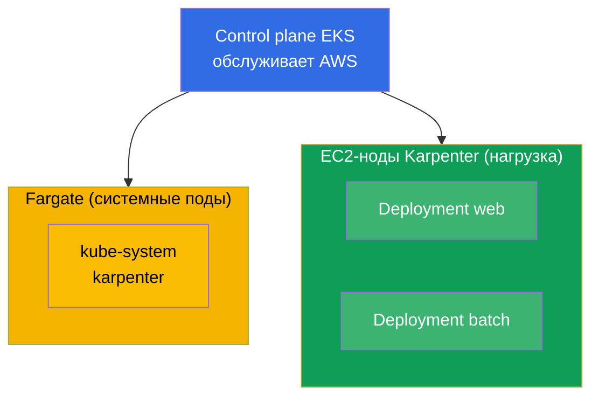
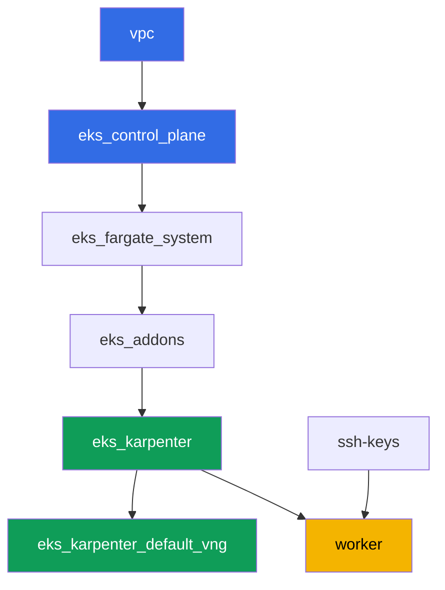

[Eng version](README.MD) · [Versión en español](README_ES.MD) · [Version française](README_FR.MD) · [Deutsche Version](README_DE.MD) · [ქართული ვერსია](README_GE.MD) · [繁體中文版](README_TW.MD) · [日本語版](README_JP.MD)

# Лаба 101 - Кластер как код: VPC, control plane, ноды и kubeconfig

## Описание

Первая лаба курса EKS и фундамент для всех следующих. Здесь вы получаете кластер,
собранный как код через Terragrunt, и учитесь его читать: где проходит граница между
тем, что обслуживает AWS (control plane), и тем, что остаётся на вас (сеть, ноды,
доступ). Вы разворачиваете нагрузку на управляемых вычислениях, видите разделение
системных подов на Fargate и рабочих нод на Karpenter, проверяете, что VPC CNI выдаёт
подам адреса из вашей VPC, и убеждаетесь, что рабочие ноды поднимаются на AL2023.

Задания в продакшн-стиле: короткая постановка плюс критерии приёмки. Проверка -
автоматическая, командой `check_result`.

## Цель

Закрепить материал глав курса:

- [Глава 4. Создание кластера: eksctl, Terraform и Terragrunt](../../course/04/ru.md) - кластер как код и kubeconfig
- [Глава 6. Сеть кластера: VPC CNI, ENI и IP-адреса](../../course/06/ru.md) - откуда у подов адреса
- [Глава 9. Типы вычислений: managed node groups, Fargate, Auto Mode](../../course/09/ru.md) - что и где выполняется
- [Глава 10. AMI и bootstrap: AL2023, launch templates, kubelet](../../course/10/ru.md) - на каком образе живут ноды

## Что мы создаём

В этой лабе кластер уже развёрнут как код. Вы работаете с тем, что он даёт, и создаёте
поверх небольшую нагрузку.

| Объект | Что это | Зачем в этой лабе |
|--------|---------|-------------------|
| Namespace `eks-101` | раздел кластера под нагрузку лабы | держим ресурсы отдельно, не мешая системным (глава 4) |
| Deployment `web` (3 реплики) | приложение ping_pong | видим, что рабочие поды идут на EC2-ноды Karpenter, а не на Fargate (глава 9) |
| Артефакт `nodes.txt` | срез нод кластера | фиксируем разделение Fargate (система) и EC2 (нагрузка) (глава 9) |
| Артефакт `podip.txt` | IP пода | подтверждаем, что VPC CNI выдал адрес из VPC `10.10.0.0/16` (глава 6) |
| Артефакт `ami.txt` | образ ОС ноды | проверяем, что рабочая нода на Amazon Linux 2023 (глава 10) |
| Deployment `batch` (6 реплик) | нагрузка с запросом CPU | наблюдаем, как Karpenter добавляет вычисления под спрос (глава 9) |
| Pod `fg-probe` + артефакт `whyfargate.txt` | под, который просит Fargate, и объяснение | ловим симптом (Pending) и формулируем границу ответственности (главы 4, 9) |

Итоговая картина кластера:



## Инфраструктура

Окружение разворачивается в AWS (`eu-central-1`) через Terragrunt. Каждый каталог лабы -
это один компонент со своим `terragrunt.hcl`, который ссылается на общий модуль в
`terraform/modules/` и объявляет зависимости через блоки `dependency`. Terragrunt строит
граф зависимостей и применяет компоненты в правильном порядке.

### Модули и зависимости

| Каталог (компонент) | Модуль (`terraform/modules/`) | Зависит от | Что создаёт |
|---------------------|-------------------------------|------------|-------------|
| `vpc` | `vpc_v3` | - | VPC `10.10.0.0/16`, публичные и приватные подсети в двух AZ, NAT |
| `ssh-keys` | `ssh-keys` | - | пара SSH-ключей для рабочей машины и нод |
| `eks_control_plane` | `eks_v2_control_plane` | `vpc` | control plane EKS `1.36`, OIDC, security groups |
| `eks_fargate_system` | `eks_v2_fargate` | `vpc`, `eks_control_plane` | Fargate-профиль для `kube-system` и `karpenter` |
| `eks_addons` | `eks_v2_addons` | `eks_control_plane`, `eks_fargate_system` | аддоны coredns, kube-proxy, vpc-cni, pod-identity |
| `eks_karpenter` | `eks_v2_karpenter` | `vpc`, `eks_control_plane`, `eks_addons`, `eks_fargate_system` | контроллер Karpenter, IAM-роль нод |
| `eks_karpenter_default_vng` | `eks_v2_karpenter_vng` | `vpc`, `eks_control_plane`, `eks_karpenter` | дефолтный NodePool `default` и EC2NodeClass на AL2023 |
| `worker` | `eks_v2_work_pc` | `ssh-keys`, `vpc`, `eks_control_plane`, `eks_karpenter` | рабочая машина с kubectl, тестами и `check_result` |

Граф зависимостей (что применяется раньше, то ниже по стрелке):



Системные поды идут на Fargate, рабочие ноды поднимает Karpenter. Это то самое
разделение вычислений, о котором говорит глава 9.

### Где что настраивается

Настройки разнесены по двум уровням: общий `env.hcl` и `inputs` каждого компонента.

`env.hcl` (общие параметры окружения, читаются всеми компонентами):

| Параметр | Значение в лабе | На что влияет |
|----------|-----------------|---------------|
| `region` | `eu-central-1` | регион всех ресурсов |
| `vpc_default_cidr`, `subnets` | `10.10.0.0/16`, подсети по AZ | адресный план VPC и теги подсетей |
| `prefix` | `eks-task101` | префикс имён ресурсов и тегов |
| `stack_name` | `eks101` | из него собирается `env_name` - имя кластера |
| `k8_version` | `1.36.0` | версия kubectl на рабочей машине |
| `instance_type_worker` | `t3.medium` | тип инстанса рабочей машины |
| `spot_additional_types` | список типов | пул spot-инстансов для нод |
| `ssh_password_enable`, `access_cidrs` | `true`, `0.0.0.0/0` | доступ по SSH к рабочей машине |
| `root_volume` | `gp3`, `10` | корневой диск рабочей машины |

`inputs` в `terragrunt.hcl` каждого компонента (параметры конкретного модуля):

| Файл | Ключевые настройки |
|------|--------------------|
| `eks_control_plane/terragrunt.hcl` | `eks.version = "1.36"`, приватные подсети под ноды, публичные под endpoint |
| `eks_addons/terragrunt.hcl` | версии аддонов под 1.36: kube-proxy `v1.36.0-eksbuild.14`, coredns `v1.14.3-eksbuild.3`, vpc-cni, eks-pod-identity-agent |
| `eks_fargate_system/terragrunt.hcl` | селекторы namespace для Fargate (`kube-system`, `karpenter`) |
| `eks_karpenter/terragrunt.hcl` | версия Karpenter `1.8.1`, ресурсы контроллера |
| `eks_karpenter_default_vng/terragrunt.hcl` | `requirements` NodePool (arch, spot/on-demand, типы), `limits`, `disruption` |
| `worker/terragrunt.hcl` | `test_url` и `task_script_url` на файлы лабы 101, `exam_time_minutes` |

Правило: параметры, общие для всей лабы (регион, сеть, версии, префиксы), живут в `env.hcl`;
параметры конкретного модуля - в `inputs` его `terragrunt.hcl`. Чтобы, например, сменить
версию кластера, правят `eks.version` в `eks_control_plane/terragrunt.hcl` и версии аддонов
в `eks_addons/terragrunt.hcl`; чтобы изменить сеть - `subnets` в `env.hcl`.

## Развёртывание

```bash
TASK=101 make run_eks_task
```

Развёртывание занимает примерно 15-20 минут. В выводе найдите строку с SSH-подключением к
рабочей машине и подключитесь к ней. kubectl там уже настроен на нужный кластер.

Полезные команды на рабочей машине:

```bash
time_left       # сколько осталось времени окружения
check_result    # проверить решение
```

> Безопасность стенда. В `env.hcl` включены `ssh_password_enable = true` и
> `access_cidrs = ["0.0.0.0/0"]` - это удобно для учебного окружения, но так делать в
> продакшене нельзя. По стандартам курса (главы 0.2, 2, 19) доступ к рабочим машинам
> открывают через AWS SSM Session Manager без публичных SSH-портов наружу, а `access_cidrs`
> сужают до конкретных адресов. Здесь публичный SSH оставлен только ради простоты запуска.

## Задания

---
|        **1**        | **Namespace для нагрузки лабы**                             |
| :-----------------: | :---------------------------------------------------------- |
| Что делаем          | Создайте namespace с именем `eks-101`. Все объекты лабы создаются внутри него. |
| Критерии приёмки    | - namespace `eks-101` существует. |
---
|        **2**        | **Deployment на управляемых вычислениях**                   |
| :-----------------: | :---------------------------------------------------------- |
| Что делаем          | В namespace `eks-101` создайте Deployment `web`, образ `viktoruj/ping_pong:latest`, `3` реплики. Дождитесь, пока все реплики станут Ready. Поды должны идти на EC2-ноды Karpenter (имя ноды `ip-...`), а не на Fargate: Fargate-профиль в кластере есть только для `kube-system` и `karpenter`, а для `eks-101` его нет, поэтому нагрузку берёт Karpenter. Обоснование вы зафиксируете в задании 7. |
| Критерии приёмки    | - Deployment `web` в `eks-101`, образ `viktoruj/ping_pong`;<br/>- `3` готовые реплики;<br/>- ни один под `web` не на Fargate-ноде. |
---
|        **3**        | **Срез нод: система против нагрузки**                       |
| :-----------------: | :---------------------------------------------------------- |
| Что делаем          | Сохраните список нод кластера в файл `/var/work/tests/artifacts/3/nodes.txt` так, чтобы в нём были видны и Fargate-ноды (`fargate-...`), и EC2-ноды Karpenter (`ip-...`).<br/>Подсказка по формату: `kubectl get nodes -o wide > /var/work/tests/artifacts/3/nodes.txt` (имена нод в первом столбце, этого достаточно для проверки). |
| Критерии приёмки    | - файл не пуст;<br/>- содержит хотя бы одну ноду `fargate-...` и хотя бы одну `ip-...`. |
---
|        **4**        | **IP пода из адресного пространства VPC**                   |
| :-----------------: | :---------------------------------------------------------- |
| Что делаем          | Возьмите IP любого пода `web` и сохраните его в файл `/var/work/tests/artifacts/4/podip.txt`. Убедитесь, что адрес из VPC `10.10.0.0/16` (VPC CNI выдаёт подам адреса из подсетей VPC).<br/>Подсказка по формату: `kubectl get po -n eks-101 -l app=web -o jsonpath='{.items[0].status.podIP}'` - в файле только адрес, без лишних столбцов.<br/>Для понимания (не для проверки): сверьте адрес с CIDR приватных подсетей через `aws ec2 describe-subnets --filters "Name=vpc-id,Values=<vpc-id>" --query 'Subnets[].[CidrBlock,AvailabilityZone]'`. |
| Критерии приёмки    | - файл не пуст;<br/>- IP начинается с `10.10.`. |
---
|        **5**        | **Образ рабочей ноды (AL2023)**                             |
| :-----------------: | :---------------------------------------------------------- |
| Что делаем          | Определите образ ОС рабочей (EC2) ноды, на которой идут поды `web`, и сохраните его в файл `/var/work/tests/artifacts/5/ami.txt`.<br/>Подсказка по формату: возьмите ноду из `kubectl get po ... -o jsonpath='{.items[0].spec.nodeName}'` и её образ через `kubectl get node <node> -o jsonpath='{.status.nodeInfo.osImage}'` - в файле строка вида `Amazon Linux 2023`. |
| Критерии приёмки    | - файл не пуст;<br/>- содержит строку с `Amazon Linux` (AL2023). |
---
|        **6**        | **Масштаб вычислений под спрос**                            |
| :-----------------: | :---------------------------------------------------------- |
| Что делаем          | В namespace `eks-101` создайте Deployment `batch`, образ `viktoruj/ping_pong:latest`, `6` реплик, у контейнера задан `resources.requests.cpu` (например `500m`). Дождитесь, пока Karpenter выделит вычисления и все `6` реплик станут Ready.<br/>Примечание: Karpenter требуется примерно 60-90 секунд на запуск новой EC2-ноды (запрос инстанса плюс bootstrap AL2023), поэтому поды сначала висят в `Pending`. Перед `check_result` дождитесь готовности: `kubectl rollout status deployment/batch -n eks-101`. |
| Критерии приёмки    | - Deployment `batch` в `eks-101` с заданным `requests.cpu`;<br/>- `6` готовых реплик. |
---
|        **7**        | **Граница ответственности: симптом и объяснение**          |
| :-----------------: | :---------------------------------------------------------- |
| Что делаем          | Намеренно вызовите симптом. В `eks-101` создайте Pod `fg-probe` (образ `viktoruj/ping_pong:latest`) с `nodeSelector` `eks.amazonaws.com/compute-type: fargate`, то есть попросите Fargate явно. Под останется в `Pending` (для `eks-101` нет Fargate-профиля, а EC2-ноды Karpenter не несут такой label). Разберите причину: `kubectl describe pod fg-probe -n eks-101` (секция `Events`) и события namespace `kubectl get events -n eks-101 --sort-by='.metadata.creationTimestamp'`. Сохраните в файл `/var/work/tests/artifacts/7/whyfargate.txt` короткое объяснение: почему поды `web` и `batch` попали на EC2-ноды Karpenter, а не на Fargate, и почему `fg-probe` завис. В тексте должны быть слова `Fargate` и `профиль` (Fargate profile). |
| Критерии приёмки    | - Pod `fg-probe` в `eks-101` в состоянии `Pending`;<br/>- файл `/var/work/tests/artifacts/7/whyfargate.txt` не пуст и упоминает `Fargate` и `профиль`. |
---

## Проверка результата

На рабочей машине запустите автоматическую проверку:

```bash
check_result
```

Скрипт прогонит тесты и покажет процент выполненных заданий.

## Решение

Эталонное решение: [worker/files/solutions/1_RU.MD](worker/files/solutions/1_RU.MD)

## Удаление кластера и ресурсов

> **Сначала снимите нагрузку и дождитесь, пока уйдут EC2-ноды, потом сносите стенд.**
> AWS-ресурсов руками эта лаба не создаёт, всё лишнее - объекты Kubernetes (Deployment
> `web`, `batch` и Pod `fg-probe` в namespace `eks-101`), поэтому опасность тут одна: если
> удалять кластер с работающей нагрузкой, EC2-нода Karpenter уходит вместе с ним, а
> вторичный ENI от VPC CNI остаётся в состоянии `available` и держит security group нод.
> Тогда `destroy` зависает на `module.eks.aws_security_group.node[0]: Still
> destroying...` на десятки минут.

```bash
# 1. Снять нагрузку лабы
kubectl delete namespace eks-101 --ignore-not-found

# 2. Дождаться, пока Karpenter уберёт NodeClaim и EC2-ноду (останутся только fargate-*)
while kubectl get nodeclaims --no-headers 2>/dev/null | grep -q .; do
  echo "NodeClaim ещё жив, ждём..."; sleep 15
done
kubectl get nodes | grep -v fargate
```

Только после этого сносите стенд:

```bash
TASK=101 make delete_eks_task
```

Если `destroy` всё же встал на security group нод, значит остался осиротевший ENI. Найдите
и удалите его:

```bash
aws ec2 describe-network-interfaces --filters Name=status,Values=available \
  --query 'NetworkInterfaces[?Tags[?Key==`eks:eni:owner`]].[NetworkInterfaceId,Description]' \
  --output table
aws ec2 delete-network-interface --network-interface-id <eni-id>
```
