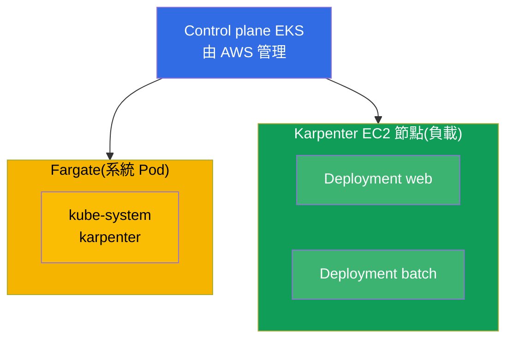
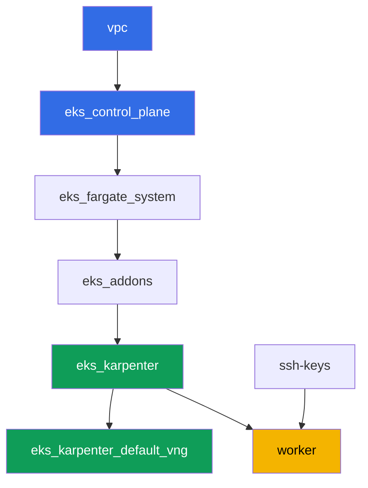

[Русская версия](README_RU.MD) · [Eng version](README.MD) · [Versión en español](README_ES.MD) · [Version française](README_FR.MD) · [Deutsche Version](README_DE.MD) · [ქართული ვერსია](README_GE.MD) · [日本語版](README_JP.MD)

# 實驗 101 - 集群即代碼:VPC、control plane、節點與 kubeconfig

## 說明

EKS 課程的第一個實驗,也是後續所有實驗的基礎。在這裡你會拿到一個透過 Terragrunt 以代碼
方式構建的集群,並學習如何讀懂它:AWS 負責維護的部分(control plane)與留給你負責的部分
(網路、節點、存取)之間的邊界在哪裡。你會在受管理的計算資源上部署負載,觀察系統 Pod 在
Fargate 上與工作節點在 Karpenter 上的分離,驗證 VPC CNI 為 Pod 分配的是你的 VPC 中的位
址,並確認工作節點運行在 AL2023 上。

任務以生產風格編寫:簡短的任務描述加驗收標準。驗證是自動的,透過 `check_result` 命令
完成。

## 目標

鞏固以下課程章節的內容:

- [第 4 章。創建集群:eksctl、Terraform 與 Terragrunt](../../course/04/ru.md) - 集群即代碼與 kubeconfig
- [第 6 章。集群網路:VPC CNI、ENI 與 IP 位址](../../course/06/ru.md) - Pod 位址從何而來
- [第 9 章。計算類型:managed node groups、Fargate、Auto Mode](../../course/09/ru.md) - 什麼在哪裡運行
- [第 10 章。AMI 與 bootstrap:AL2023、launch templates、kubelet](../../course/10/ru.md) - 節點運行在什麼映像上

## 我們要創建什麼

在這個實驗中,集群已經以代碼方式部署完成。你要在此基礎上使用它並創建一個小型負載。

| 對象 | 這是什麼 | 在這個實驗中的作用 |
|--------|---------|-------------------|
| Namespace `eks-101` | 供實驗負載使用的集群區域 | 讓資源保持隔離,不干擾系統資源(第 4 章) |
| Deployment `web`(3 個副本) | ping_pong 應用程式 | 觀察工作 Pod 落在 Karpenter 的 EC2 節點上,而不是 Fargate(第 9 章) |
| 產物 `nodes.txt` | 集群節點快照 | 記錄 Fargate(系統)與 EC2(負載)的分離(第 9 章) |
| 產物 `podip.txt` | Pod IP | 確認 VPC CNI 分配了來自 VPC `10.10.0.0/16` 的位址(第 6 章) |
| 產物 `ami.txt` | 節點作業系統映像 | 驗證工作節點運行在 Amazon Linux 2023 上(第 10 章) |
| Deployment `batch`(6 個副本) | 帶有 CPU request 的負載 | 觀察 Karpenter 如何按需增加計算資源(第 9 章) |
| Pod `fg-probe` + 產物 `whyfargate.txt` | 一個請求 Fargate 的 Pod,以及解釋 | 捕捉症狀(Pending)並闡述職責邊界(第 4、9 章) |

集群的最終圖景:



## 基礎設施

環境透過 Terragrunt 部署在 AWS(`eu-central-1`)。實驗中的每個目錄都是一個組件,擁有
自己的 `terragrunt.hcl`,它引用 `terraform/modules/` 中的共用模組,並透過 `dependency`
區塊聲明依賴關係。Terragrunt 會構建依賴關係圖並按正確的順序套用各個組件。

### 模組與依賴關係

| 目錄(組件) | 模組(`terraform/modules/`) | 依賴於 | 創建了什麼 |
|---------------------|-------------------------------|------------|-------------|
| `vpc` | `vpc_v3` | - | VPC `10.10.0.0/16`,兩個 AZ 中的公有與私有子網,NAT |
| `ssh-keys` | `ssh-keys` | - | 供工作機與節點使用的一對 SSH 金鑰 |
| `eks_control_plane` | `eks_v2_control_plane` | `vpc` | EKS control plane `1.36`、OIDC、security groups |
| `eks_fargate_system` | `eks_v2_fargate` | `vpc`、`eks_control_plane` | `kube-system` 與 `karpenter` 的 Fargate 配置檔 |
| `eks_addons` | `eks_v2_addons` | `eks_control_plane`、`eks_fargate_system` | coredns、kube-proxy、vpc-cni、pod-identity 附加元件 |
| `eks_karpenter` | `eks_v2_karpenter` | `vpc`、`eks_control_plane`、`eks_addons`、`eks_fargate_system` | Karpenter 控制器、節點 IAM 角色 |
| `eks_karpenter_default_vng` | `eks_v2_karpenter_vng` | `vpc`、`eks_control_plane`、`eks_karpenter` | 預設 NodePool `default` 以及基於 AL2023 的 EC2NodeClass |
| `worker` | `eks_v2_work_pc` | `ssh-keys`、`vpc`、`eks_control_plane`、`eks_karpenter` | 帶有 kubectl、測試腳本和 `check_result` 的工作機 |

依賴關係圖(較早套用的組件位於箭頭下方):



系統 Pod 運行在 Fargate 上,工作節點由 Karpenter 建立。這正是第 9 章討論的計算分離。

### 各項設定在哪裡配置

設定分佈在兩個層級:共用的 `env.hcl` 以及每個組件各自的 `inputs`。

`env.hcl`(所有組件共用並讀取的環境參數):

| 參數 | 實驗中的值 | 影響什麼 |
|----------|-----------------|---------------|
| `region` | `eu-central-1` | 所有資源的區域 |
| `vpc_default_cidr`、`subnets` | `10.10.0.0/16`,依 AZ 劃分的子網 | VPC 的位址規劃與子網標籤 |
| `prefix` | `eks-task101` | 資源名稱與標籤的前綴 |
| `stack_name` | `eks101` | 用於構建 `env_name` - 集群名稱 |
| `k8_version` | `1.36.0` | 工作機上 kubectl 的版本 |
| `instance_type_worker` | `t3.medium` | 工作機的 instance 類型 |
| `spot_additional_types` | 類型列表 | 節點用的 spot instance 池 |
| `ssh_password_enable`、`access_cidrs` | `true`、`0.0.0.0/0` | 對工作機的 SSH 存取 |
| `root_volume` | `gp3`、`10` | 工作機的根磁碟 |

每個組件 `terragrunt.hcl` 中的 `inputs`(該模組特定的參數):

| 檔案 | 關鍵設定 |
|------|--------------------|
| `eks_control_plane/terragrunt.hcl` | `eks.version = "1.36"`,節點使用的私有子網,endpoint 使用的公有子網 |
| `eks_addons/terragrunt.hcl` | 針對 1.36 的附加元件版本:kube-proxy `v1.36.0-eksbuild.14`、coredns `v1.14.3-eksbuild.3`、vpc-cni、eks-pod-identity-agent |
| `eks_fargate_system/terragrunt.hcl` | Fargate 的 namespace 選擇器(`kube-system`、`karpenter`) |
| `eks_karpenter/terragrunt.hcl` | Karpenter 版本 `1.8.1`,控制器資源 |
| `eks_karpenter_default_vng/terragrunt.hcl` | NodePool 的 `requirements`(架構、spot/on-demand、類型)、`limits`、`disruption` |
| `worker/terragrunt.hcl` | 指向實驗 101 檔案的 `test_url` 與 `task_script_url`、`exam_time_minutes` |

規則:整個實驗共用的參數(區域、網路、版本、前綴)存放在 `env.hcl` 中;特定模組的參數
存放在該模組 `terragrunt.hcl` 的 `inputs` 中。例如,要更改集群版本,需修改
`eks_control_plane/terragrunt.hcl` 中的 `eks.version` 以及 `eks_addons/terragrunt.hcl`
中的附加元件版本;要更改網路,則修改 `env.hcl` 中的 `subnets`。

## 部署

```bash
TASK=101 make run_eks_task
```

部署大約需要 15-20 分鐘。在輸出中找到連接工作機的 SSH 那一行並連接上去。kubectl 在那
裡已經配置好指向正確的集群。

工作機上的常用命令:

```bash
time_left       # 環境剩餘的時間
check_result    # 檢查解答
```

> 測試環境的安全性。`env.hcl` 中啟用了 `ssh_password_enable = true` 和
> `access_cidrs = ["0.0.0.0/0"]` - 這對於學習環境很方便,但在生產環境中不應該這樣做。
> 依照課程標準(第 0.2、2、19 章),對工作機的存取應透過 AWS SSM Session Manager 進行,
> 不對外暴露公開的 SSH 端口,並將 `access_cidrs` 限制到具體的位址。這裡保留公開 SSH 只
> 是為了簡化啟動流程。

## 任務

---
|        **1**        | **供實驗負載使用的 Namespace**                             |
| :-----------------: | :---------------------------------------------------------- |
| 我們要做什麼          | 創建一個名為 `eks-101` 的 namespace。實驗中的所有對象都在其中創建。 |
| 驗收標準    | - namespace `eks-101` 存在。 |
---
|        **2**        | **在受管理計算資源上的 Deployment**                   |
| :-----------------: | :---------------------------------------------------------- |
| 我們要做什麼          | 在 `eks-101` namespace 中創建 Deployment `web`,映像 `viktoruj/ping_pong:latest`,`3` 個副本。等待所有副本變為 Ready。Pod 應落在 Karpenter 的 EC2 節點上(節點名稱為 `ip-...`),而不是 Fargate:集群中的 Fargate 配置檔僅覆蓋 `kube-system` 和 `karpenter`,`eks-101` 沒有對應的配置檔,因此 Karpenter 承擔了這個負載。你將在任務 7 中記錄這一論證。 |
| 驗收標準    | - Deployment `web` 位於 `eks-101`,映像為 `viktoruj/ping_pong`;<br/>- `3` 個就緒副本;<br/>- 沒有任何一個 `web` Pod 落在 Fargate 節點上。 |
---
|        **3**        | **節點快照:系統與負載對比**                       |
| :-----------------: | :---------------------------------------------------------- |
| 我們要做什麼          | 將集群的節點列表保存到 `/var/work/tests/artifacts/3/nodes.txt`,使其中同時能看到 Fargate 節點(`fargate-...`)和 Karpenter EC2 節點(`ip-...`)。<br/>格式提示:`kubectl get nodes -o wide > /var/work/tests/artifacts/3/nodes.txt`(第一列有節點名稱即可滿足檢查需求)。 |
| 驗收標準    | - 檔案不為空;<br/>- 至少包含一個 `fargate-...` 節點和一個 `ip-...` 節點。 |
---
|        **4**        | **來自 VPC 位址空間的 Pod IP**                   |
| :-----------------: | :---------------------------------------------------------- |
| 我們要做什麼          | 取得任意一個 `web` Pod 的 IP,並保存到 `/var/work/tests/artifacts/4/podip.txt`。確認該位址屬於 VPC `10.10.0.0/16`(VPC CNI 為 Pod 分配的是 VPC 子網中的位址)。<br/>格式提示:`kubectl get po -n eks-101 -l app=web -o jsonpath='{.items[0].status.podIP}'` - 檔案中只應有位址,不要有多餘的列。<br/>為了理解(不作為檢查依據):透過 `aws ec2 describe-subnets --filters "Name=vpc-id,Values=<vpc-id>" --query 'Subnets[].[CidrBlock,AvailabilityZone]'` 比對該位址與私有子網的 CIDR。 |
| 驗收標準    | - 檔案不為空;<br/>- IP 以 `10.10.` 開頭。 |
---
|        **5**        | **工作節點的映像(AL2023)**                             |
| :-----------------: | :---------------------------------------------------------- |
| 我們要做什麼          | 確定運行 `web` Pod 的工作(EC2)節點的作業系統映像,並保存到 `/var/work/tests/artifacts/5/ami.txt`。<br/>格式提示:透過 `kubectl get po ... -o jsonpath='{.items[0].spec.nodeName}'` 取得節點,再透過 `kubectl get node <node> -o jsonpath='{.status.nodeInfo.osImage}'` 取得其映像 - 檔案中應有類似 `Amazon Linux 2023` 的一行。 |
| 驗收標準    | - 檔案不為空;<br/>- 包含帶有 `Amazon Linux` 的一行(AL2023)。 |
---
|        **6**        | **按需求擴展計算資源**                            |
| :-----------------: | :---------------------------------------------------------- |
| 我們要做什麼          | 在 `eks-101` namespace 中創建 Deployment `batch`,映像 `viktoruj/ping_pong:latest`,`6` 個副本,容器上設定 `resources.requests.cpu`(例如 `500m`)。等待 Karpenter 分配計算資源,並讓全部 `6` 個副本變為 Ready。<br/>備註:Karpenter 大約需要 60-90 秒才能啟動一個新的 EC2 節點(instance 請求加上 AL2023 bootstrap),因此 Pod 一開始會處於 `Pending`。執行 `check_result` 之前,請先等待就緒:`kubectl rollout status deployment/batch -n eks-101`。 |
| 驗收標準    | - Deployment `batch` 位於 `eks-101`,已設定 `requests.cpu`;<br/>- `6` 個就緒副本。 |
---
|        **7**        | **職責邊界:症狀與解釋**          |
| :-----------------: | :---------------------------------------------------------- |
| 我們要做什麼          | 故意觸發這個症狀。在 `eks-101` 中創建 Pod `fg-probe`(映像 `viktoruj/ping_pong:latest`),`nodeSelector` 設為 `eks.amazonaws.com/compute-type: fargate`,也就是明確請求 Fargate。該 Pod 會停留在 `Pending`(`eks-101` 沒有 Fargate 配置檔,而 Karpenter 的 EC2 節點也沒有這個 label)。分析原因:`kubectl describe pod fg-probe -n eks-101`(`Events` 部分)以及 namespace 的事件 `kubectl get events -n eks-101 --sort-by='.metadata.creationTimestamp'`。將簡短的解釋保存到 `/var/work/tests/artifacts/7/whyfargate.txt`:為什麼 `web` 和 `batch` Pod 落在了 Karpenter 的 EC2 節點上而不是 Fargate,以及為什麼 `fg-probe` 卡住了。文字中必須包含 `Fargate` 和 `profile` 這兩個詞。 |
| 驗收標準    | - Pod `fg-probe` 在 `eks-101` 中處於 `Pending` 狀態;<br/>- 檔案 `/var/work/tests/artifacts/7/whyfargate.txt` 不為空,並提到 `Fargate` 和 `profile`。 |
---

## 檢查結果

在工作機上執行自動檢查:

```bash
check_result
```

腳本會執行測試並顯示已完成任務的百分比。

## 解答

參考解答:[worker/files/solutions/1_TW.MD](worker/files/solutions/1_TW.MD)

## 刪除集群與資源

> **先移除負載,等 EC2 節點消失後,才能拆除環境。** 這個實驗不會手動創建任何 AWS 資源,
> 其他一切都是 Kubernetes 對象(namespace `eks-101` 中的 Deployment `web`、`batch` 和
> Pod `fg-probe`),所以只有一個風險:如果在負載仍在運行時刪除集群,Karpenter 的 EC2
> 節點會隨之消失,但 VPC CNI 的次要 ENI 會停留在 `available` 狀態並持續佔用節點的
> security group。這樣一來,`destroy` 就會卡在
> `module.eks.aws_security_group.node[0]: Still destroying...` 上長達數十分鐘。

```bash
# 1. 移除實驗負載
kubectl delete namespace eks-101 --ignore-not-found

# 2. 等待 Karpenter 移除 NodeClaim 和 EC2 節點(只應剩下 fargate-*)
while kubectl get nodeclaims --no-headers 2>/dev/null | grep -q .; do
  echo "NodeClaim 還在,等待中..."; sleep 15
done
kubectl get nodes | grep -v fargate
```

只有在這之後,才能拆除環境:

```bash
TASK=101 make delete_eks_task
```

如果 `destroy` 仍然卡在節點的 security group 上,說明留下了孤立的 ENI。找到並刪除它:

```bash
aws ec2 describe-network-interfaces --filters Name=status,Values=available \
  --query 'NetworkInterfaces[?Tags[?Key==`eks:eni:owner`]].[NetworkInterfaceId,Description]' \
  --output table
aws ec2 delete-network-interface --network-interface-id <eni-id>
```
