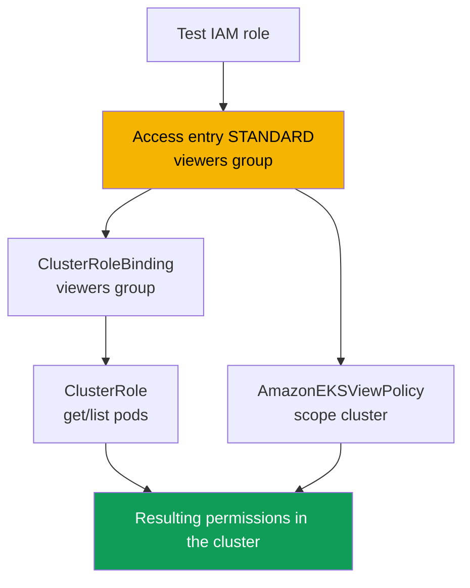
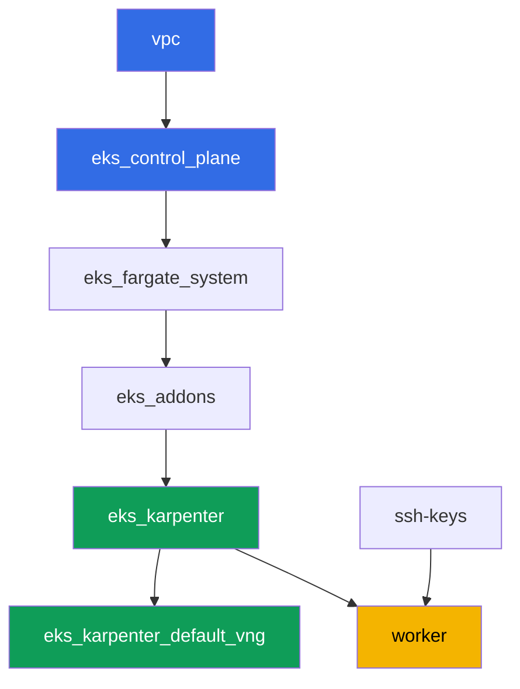

[Русская версия](README_RU.MD) · [Versión en español](README_ES.MD) · [Version française](README_FR.MD) · [Deutsche Version](README_DE.MD) · [ქართული ვერსია](README_GE.MD) · [繁體中文版](README_TW.MD) · [日本語版](README_JP.MD)

# Lab 102 - Cluster access: IAM and RBAC, access entries and access policies

## Description

The cluster is created (lab 101), and the next question is who gets into it and with what
permissions. In this lab you dig into the seam between two layers: authentication via IAM
and authorization via RBAC. You set up a second IAM principal, grant it access through an
access entry, hand out permissions in two ways - your own RBAC and a ready-made access
policy - and see in practice the difference between `Unauthorized` (authentication failed)
and `Forbidden` (authentication passed, but RBAC didn't allow the action).

Tasks are written in a production style: a short statement plus acceptance criteria.
Checking is automatic, via the `check_result` command, plus a few manual assume-role steps
you need to run yourself to see the difference live.

## Goal

Reinforce the material from this course chapter:

- [Chapter 5. Cluster access: IAM and RBAC, access entries](../../course/05/ru.md) -
  migrating away from aws-auth

## What we're creating

The cluster is already deployed as code (as in lab 101) and runs in `authenticationMode =
API` mode. You create a second IAM principal and set up its access via two parallel paths:
RBAC on top of an access entry, and a ready-made access policy.

| Object | What it is | Why it's in this lab |
|--------|---------|-------------------|
| Test IAM role | second principal, assumable only by the worker role | a principal for testing an access entry without touching other labs' permissions |
| Access entry (`STANDARD`, `viewers` group) | maps the role to a Kubernetes group | links the IAM principal to an RBAC subject |
| `ClusterRole`/`ClusterRoleBinding viewers-pod-reader` | RBAC for the `viewers` group | `get`/`list` permissions on pods, classic RBAC on top of an access entry |
| `AmazonEKSViewPolicy` association (scope `cluster`) | AWS access policy | a second, parallel source of permissions, with no RBAC of its own |
| Artifacts `1/accessconfig.json`, `7/...txt`, `8/...txt` | configuration snapshots and explanations | record the access mode and the Unauthorized/Forbidden difference |



## Infrastructure

The environment is deployed in AWS (`eu-central-1`) via Terragrunt, as in lab 101. Each lab
directory is one component with its own `terragrunt.hcl`, which references a shared module
in `terraform/modules/` and declares dependencies through `dependency` blocks. This lab
doesn't need any special components for access: the cluster is already created by the
`eks_v2_control_plane` module (`terraform-aws-modules/eks/aws` v21) in `API` mode, and all
tasks run through the `aws eks` CLI and plain RBAC manifests from the worker machine.

### Modules and dependencies

| Directory (component) | Module (`terraform/modules/`) | Depends on | What it creates |
|---------------------|-------------------------------|------------|-------------|
| `vpc` | `vpc_v3` | - | VPC `10.10.0.0/16`, public and private subnets in two AZs, NAT |
| `ssh-keys` | `ssh-keys` | - | an SSH key pair for the worker machine and nodes |
| `eks_control_plane` | `eks_v2_control_plane` | `vpc` | EKS control plane `1.36`, `API` access mode, OIDC |
| `eks_fargate_system` | `eks_v2_fargate` | `vpc`, `eks_control_plane` | Fargate profile for `kube-system` and `karpenter` |
| `eks_addons` | `eks_v2_addons` | `eks_control_plane`, `eks_fargate_system` | coredns, kube-proxy, vpc-cni, pod-identity add-ons |
| `eks_karpenter` | `eks_v2_karpenter` | `vpc`, `eks_control_plane`, `eks_addons`, `eks_fargate_system` | Karpenter controller, node IAM role |
| `eks_karpenter_default_vng` | `eks_v2_karpenter_vng` | `vpc`, `eks_control_plane`, `eks_karpenter` | default NodePool `default` and EC2NodeClass on AL2023 |
| `worker` | `eks_v2_work_pc` | `ssh-keys`, `vpc`, `eks_control_plane`, `eks_karpenter` | worker machine with kubectl, tests, and `check_result` |

Dependency graph (what gets applied earlier is lower down the arrow), same as in lab 101:



### The second principal and worker permissions

The Karpenter node role doesn't work as the "second principal": the Karpenter submodule
automatically creates its own `EC2_LINUX` access entry for it, and one IAM principal can't
be in two access entries. So the lab creates a separate test IAM role right on the worker
via the AWS CLI (no changes to the cluster's terraform).

The worker role (`eks_v2_work_pc/iam.tf`) already had `eks:*` - enough for all
`create-access-entry`, `associate-access-policy` and similar commands. To create the test
role (task 2), the worker got narrow `iam:CreateRole`, `iam:GetRole`, `iam:DeleteRole`,
`iam:PutRolePolicy` and `sts:AssumeRole` permissions, scoped to the resource
`arn:aws:iam::<account>:role/*-test-*` - meaning the worker can only manage roles with
`-test-` in the name and only assume those, without expanding its own permissions to
anything else.

## Deployment

```bash
TASK=102 make run_eks_task
```

Deployment takes roughly 15-20 minutes. In the output, find the line with the SSH connection
to the worker machine and connect to it. kubectl there is already configured for the right
cluster.

Useful commands on the worker machine:

```bash
time_left       # how much environment time is left
check_result    # check the solution
```

> Environment security. `env.hcl` has `ssh_password_enable = true` and
> `access_cidrs = ["0.0.0.0/0"]` enabled - convenient for a training environment, but this
> is not something to do in production. Per the course standards, access to worker
> machines should go through AWS SSM Session Manager without exposing public SSH ports, and
> `access_cidrs` should be narrowed down to specific addresses. Here public SSH is left in
> place only to keep the setup simple.

## Tasks

---
|        **1**        | **Inventory: cluster access mode**                  |
| :-----------------: | :---------------------------------------------------------- |
| What to do          | Save `aws eks describe-cluster --name <cluster> --query 'cluster.accessConfig'` to the file `/var/work/tests/artifacts/1/accessconfig.json`. Confirm that `authenticationMode` equals `API`. |
| Acceptance criteria    | - the file is not empty;<br/>- it contains `"authenticationMode": "API"`. |
---
|        **2**        | **A second IAM principal for testing**                          |
| :-----------------: | :---------------------------------------------------------- |
| What to do          | Create a test IAM role (name must contain `-test-`, e.g. `eks-task102-test-viewer`) with a trust policy that allows `sts:AssumeRole` only for the worker role's ARN. Save the role's ARN to the file `/var/work/tests/artifacts/2/test_role_arn.txt`. |
| Acceptance criteria    | - the file is not empty, contains a role ARN with `test` in the name;<br/>- the role exists (`aws iam get-role`). |
---
|        **3**        | **Access entry for the test principal**                   |
| :-----------------: | :---------------------------------------------------------- |
| What to do          | Create a `STANDARD` access entry for the test role with `kubernetesGroups` equal to `viewers`, without an explicit `username` (let EKS fill it in on its own). |
| Acceptance criteria    | - `aws eks describe-access-entry` returns `type=STANDARD`;<br/>- `kubernetesGroups` contains `viewers`. |
---
|        **4**        | **RBAC on top of the access entry: read-only pods**            |
| :-----------------: | :---------------------------------------------------------- |
| What to do          | Create `ClusterRole` `viewers-pod-reader` with only `get` and `list` permissions on `pods`, and `ClusterRoleBinding` `viewers-pod-reader` binding it to the `viewers` group. This is classic RBAC on top of an access entry, without an access policy. |
| Acceptance criteria    | - `ClusterRole` grants only `get`/`list` on `pods` (no `create`, `delete`);<br/>- `ClusterRoleBinding` is bound to the `viewers` group. |
---
|        **5**        | **Manual permission check via assume-role**                  |
| :-----------------: | :---------------------------------------------------------- |
| What to do          | From the worker, run `aws sts assume-role --role-arn <test_role_arn> --role-session-name test-viewer-session`, export the temporary credentials, and get a separate kubeconfig via `aws eks update-kubeconfig --alias test-viewer --kubeconfig /tmp/test-viewer.kubeconfig`. Check `kubectl --kubeconfig /tmp/test-viewer.kubeconfig get pods -A` (should work) and `kubectl --kubeconfig /tmp/test-viewer.kubeconfig create namespace test` (should fail with `Forbidden`). Save both commands and their result to the file `/var/work/tests/artifacts/5/rbac_check.txt`. |
| Acceptance criteria    | - the file is not empty, mentions `get pods` and `Forbidden`. |
---
|        **6**        | **Access policy on top of the access entry**                       |
| :-----------------: | :---------------------------------------------------------- |
| What to do          | Associate the `AmazonEKSViewPolicy` access policy with scope `cluster` to the test role. Confirm via `aws eks list-associated-access-policies` that the association exists. |
| Acceptance criteria    | - `list-associated-access-policies` contains `AmazonEKSViewPolicy` with `accessScope.type=cluster`. |
---
|        **7**        | **Diagnostics: Unauthorized vs. Forbidden**              |
| :-----------------: | :---------------------------------------------------------- |
| What to do          | Create another test role (name with `-test-`) with no access entry at all, get its kubeconfig via assume-role the same way as in task 5, and run `kubectl get pods -A` - confirm the response is `Unauthorized`, not `Forbidden`, because the cluster doesn't know this ARN at all (verify via `aws eks list-access-entries`). Compare with the `Forbidden` from task 5. Save an explanation of the difference to the file `/var/work/tests/artifacts/7/unauthorized_vs_forbidden.txt`, mentioning both errors and the `list-access-entries` command. |
| Acceptance criteria    | - the file is not empty, mentions `Unauthorized`, `Forbidden` and `list-access-entries`. |
---
|        **8**        | **Revoking access: deleting and restoring the access entry**   |
| :-----------------: | :---------------------------------------------------------- |
| What to do          | Delete the test role's access entry from task 3 (`aws eks delete-access-entry`), verify via `test-viewer.kubeconfig` that access is gone (`Unauthorized`), then create the entry again with the same `viewers` group so the environment stays in a working state for grading. Save the course of the experiment to the file `/var/work/tests/artifacts/8/delete_recreate.txt`. |
| Acceptance criteria    | - the test role's access entry exists again, type `STANDARD`;<br/>- the file mentions `Unauthorized`, `delete-access-entry` and `create-access-entry`. |
---

## Checking the result

On the worker machine, run the automatic check:

```bash
check_result
```

The script will run the tests and show the percentage of completed tasks. Tasks 5, 7 and 8
require a live assume-role with temporary credentials, so the automated check only verifies
the resulting configuration (access entry, RBAC, access policy) and the explanation
artifacts - you need to see the actual `Unauthorized`/`Forbidden` difference yourself by
running the commands from the solution.

## Solution

Reference solution: [worker/files/solutions/1.MD](worker/files/solutions/1.MD)

## Deleting the cluster and resources

> **First remove the test IAM roles.** You created the roles `eks-task102-test-viewer` and
> `eks-task102-test-nobody` by hand via the AWS CLI, they're not in terraform state, and
> `destroy` won't touch them. IAM roles live outside the region and outside the cluster, so
> they'll stay in the account, and on the next run of the lab `aws iam create-role` will
> fail with `EntityAlreadyExists`. Deleting the access entries separately isn't required
> (they disappear along with the cluster), but if you want to redo the lab on the same
> cluster, remove them too.

```bash
CLUSTER=$(aws eks list-clusters --query 'clusters[0]' --output text)

for ROLE in eks-task102-test-viewer eks-task102-test-nobody; do
  ARN=$(aws iam get-role --role-name "$ROLE" --query 'Role.Arn' --output text 2>/dev/null) || continue
  # this role's access entry (needed if you're redoing the lab)
  aws eks delete-access-entry --cluster-name "$CLUSTER" --principal-arn "$ARN" 2>/dev/null
  # inline and attached policies, if you added any
  for P in $(aws iam list-role-policies --role-name "$ROLE" --query 'PolicyNames' --output text); do
    aws iam delete-role-policy --role-name "$ROLE" --policy-name "$P"
  done
  for P in $(aws iam list-attached-role-policies --role-name "$ROLE" \
      --query 'AttachedPolicies[].PolicyArn' --output text); do
    aws iam detach-role-policy --role-name "$ROLE" --policy-arn "$P"
  done
  aws iam delete-role --role-name "$ROLE"
done
```

> **Remove the workload.** If the lab's pods made Karpenter bring up an EC2 node, remove the
> workload and wait for the node to go away: otherwise VPC CNI won't have time to remove its
> secondary ENIs, an orphaned ENI stays in `available` state, holds onto the node security
> group, and `destroy` hangs on
> `module.eks.aws_security_group.node[0]: Still destroying...`.

```bash
while kubectl get nodes --no-headers 2>/dev/null | grep -qv fargate; do
  echo "The Karpenter EC2 node is still alive, waiting..."; sleep 15
done
```

```bash
TASK=102 make delete_eks_task
```

If `destroy` still gets stuck on the security group, find and delete the orphaned ENI:

```bash
aws ec2 describe-network-interfaces --filters Name=status,Values=available \
  --query 'NetworkInterfaces[].[NetworkInterfaceId,Description,Groups[0].GroupName]' --output table
aws ec2 delete-network-interface --network-interface-id <eni-id>
```
